# AVIONICS SOFTWARE VERIFICATION & INTEGRATION STUDY MATERIAL — PART 1

**Audience:** Senior/Lead Avionics Software Verification & Integration Engineers (7+ years)  
**Focus:** Production-grade engineering practice, certification-ready evidence, and interview preparation  
**Scope of Part 1:** Modules 1-5

---

# How to Use This Material

This study material is structured the way an avionics organization actually works: plans first, requirements before code, verification as an independent discipline, traceability as mandatory evidence, and certification objectives driving engineering rigor.

For each major concept, the material explains:

- **What it means**
- **Why avionics requires it**
- **Where in the lifecycle it applies**
- **Which artifacts it touches**
- **How engineers perform it in practice**
- **What objective evidence is produced**
- **What can go wrong**
- **How it is reviewed or audited**
- **How it relates to DO-178C**
- **A realistic example**
- **A likely interview question**

---

# MODULE 1 — AVIONICS SOFTWARE ENGINEERING FUNDAMENTALS

## 1.1 Learning Objectives

By the end of this module, an engineer should be able to:

- Explain what avionics software is and how it differs from general embedded software.
- Distinguish **flight-critical**, **mission-critical**, and **non-essential** aircraft software.
- Describe major aircraft systems and where software verification and integration teams interface with them.
- Explain layered avionics architecture from aircraft function down to BSP and hardware drivers.
- Compare common avionics communication interfaces and their verification implications.
- Read and produce high-level system signal-flow views for integration planning and failure analysis.
- Identify the lifecycle artifacts and evidence expected even before formal DO-178C verification begins.

## 1.2 Prerequisites

- Embedded software fundamentals
- Basic digital electronics and buses
- Familiarity with C/C++ or Ada in embedded environments
- Basic real-time systems concepts
- Exposure to systems engineering terminology

## 1.3 Why This Module Matters

Senior verification and integration engineers are not only test executors. They must understand the **operational aircraft context**, the **software stack**, the **hardware/IO environment**, and the **certification implications** of each integration decision. Weak fundamentals create poor test strategy, incomplete interface coverage, missed failure conditions, and weak audit posture.

---

## 1.4 What Avionics Software Is

### Definition

Avionics software is software embedded in airborne or aircraft-associated electronic systems that supports aircraft operation, control, navigation, communication, monitoring, indication, maintenance, or mission functions.

### Key Characteristics

- Runs in resource-constrained, deterministic embedded environments
- Interfaces with sensors, actuators, buses, and other computers
- Operates under strict timing, startup, shutdown, and fault-handling requirements
- Must often satisfy airworthiness regulations and certification objectives
- Requires strong requirements traceability and objective evidence

### Avionics Software vs General Embedded Software

| Aspect | General Embedded | Avionics Embedded |
|---|---|---|
| Primary driver | Feature/function | Safety, correctness, certifiability |
| Failure tolerance | Often moderate | Frequently extremely low |
| Timing behavior | Important | Mandatory and analyzable |
| Traceability | Helpful | Required |
| Independence | Optional | Often required |
| Evidence | Team-specific | Audit-ready lifecycle evidence |
| Configuration control | Useful | Mandatory and formal |

---

## 1.5 Flight-Critical vs Mission-Critical Software

### Comparison Table

| Category | Meaning | Example | Consequence of Failure | Typical Assurance Concern |
|---|---|---|---|---|
| Flight-critical | Failure can directly affect safe flight/landing | Flight control laws, braking control, engine control inputs | Catastrophic or hazardous | Highest assurance rigor |
| Mission-critical | Failure degrades mission effectiveness but may not immediately endanger aircraft safety | Stores management, tactical displays, mission planning | Mission loss, operational degradation | High operational rigor, safety impact depends on architecture |
| Essential support | Supports operations, awareness, or dispatch | Maintenance functions, central maintenance computer functions | Dispatch delays, crew burden | Moderate assurance |
| Non-essential | Convenience or non-safety functions | Cabin applications | Minimal flight safety effect | Lower assurance |

### Practical Interpretation

A lead engineer must not assume “important” means “highest DAL.” DAL is driven by **failure condition classification**, not by customer visibility or system complexity alone.

---

## 1.6 Aircraft Systems Overview

### Major Systems and Verification/Integration Relevance

| System | What It Does | Verification/Integration Focus |
|---|---|---|
| Flight Control Computer (FCC) | Executes flight control laws and commands surfaces | Control loop timing, sensor validity, mode transitions, actuator command limits |
| Flight Management System (FMS) | Navigation planning, guidance, performance computation | Database loading, lateral/vertical mode logic, cross-system interfaces |
| Display Systems | Present PFD/MFD/EICAS/mission data | Data validity labeling, latency, symbology rules, failure annunciations |
| Navigation Systems | Position, velocity, attitude, radio navigation | Sensor fusion, alignment, reasonableness monitoring |
| Communication Systems | Pilot/controller and aircraft/data communications | Protocol compliance, message integrity, loss/retry behavior |
| Engine Control / FADEC | Controls fuel, thrust, engine protection | Closed-loop control integrity, redundancy, channel sync, shutdown protections |
| Landing Gear Systems | Extension, retraction, indication, interlocks | Weight-on-wheels logic, sensor disagreement, inhibit conditions |
| Autopilot | Guidance-following and flight path control | Engage/disengage logic, authority limits, mode confusion prevention |
| Air Data Computer (ADC) | Computes airspeed, altitude, temp-derived values | Sensor fault detection, data validity, conversion accuracy |
| Inertial Reference System (IRS/IRU) | Attitude, heading, inertial navigation | Initialization/alignment logic, drift handling, data distribution |
| Integrated Modular Avionics (IMA) | Shared computing platform hosting partitions/apps | Partitioning, resource allocation, hosted app integration |

### System Interaction Perspective

A verification engineer must understand not only the unit under test, but also:

- upstream signal sources
- downstream consumers
- mode control ownership
- failure annunciation path
- timing and partition schedule constraints
- maintenance/reporting hooks

---

## 1.7 Avionics Architecture Stack

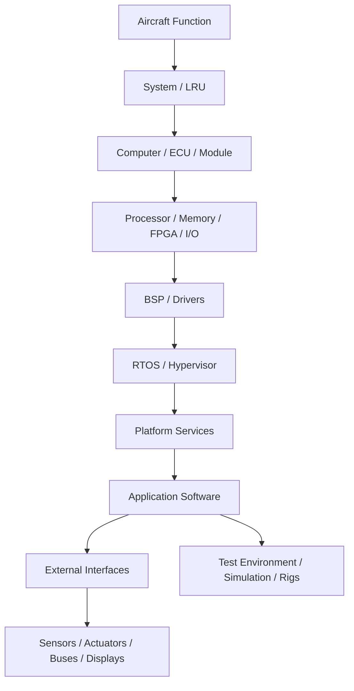

### Layered Interpretation

| Layer | Meaning | Verification Concern |
|---|---|---|
| Aircraft function | End-user operational capability | System intent and failure effect |
| LRU | Replaceable system element | Installation, interface, operational modes |
| Computer/ECU | Computing hardware running software | Resource constraints, built-in test, interfaces |
| Hardware | CPU, memory, IO, buses | Hardware/software assumptions |
| BSP/Drivers | Hardware abstraction and peripheral control | Register access correctness, timing, startup order |
| RTOS/Hypervisor | Scheduling, memory, partitioning | Determinism, partition separation |
| Application | Functional behavior | Requirements correctness, mode logic |
| Interfaces | Bus messaging, discrete/analog interaction | Data integrity, freshness, conversion |
| Test environment | Labs, SIL/HIL, rigs | Fidelity, calibration, representativeness |

### Architecture Deep-Dive Matrix

| Concept | What It Means | Why Avionics Requires It | Lifecycle Stage | Artifacts | How Engineers Perform It | Evidence Produced | What Can Go Wrong | Review/Audit Focus | DO-178C Relation | Realistic Example | Interview Question |
|---|---|---|---|---|---|---|---|---|---|---|---|
| LRU | Line Replaceable Unit, field-swappable aircraft equipment | Maintenance and fault isolation depend on clear boundaries | System architecture, integration | ICD, system architecture docs, installation data | Define physical and logical interfaces, power-up behavior, maintenance interactions | Approved ICDs, integration test results | Interface ambiguity, power assumptions mismatch | Configuration-controlled interface baselines | External interfaces and high-level requirements feed software lifecycle | FMS LRU sends target data to display processor via AFDX | “Why does LRU boundary definition matter to verification?” |
| BSP/Drivers | Software layer controlling hardware peripherals | Safe startup and deterministic I/O depend on it | Low-level design, coding, integration | LLD, source code, hardware interface specs | Implement register access, initialization sequences, interrupt handling | Code reviews, driver tests, board bring-up logs | Race conditions, wrong register maps, endian defects | Evidence that hardware assumptions are verified | Part of software design/code and verification data | ARINC 429 driver mislabels parity error as valid word | “How would you verify a new UART/ARINC driver?” |
| RTOS | Real-time operating system handling tasks, timing, IPC | Deterministic execution and bounded latency are mandatory | Platform integration | Platform requirements, configuration, schedule tables | Configure priorities, periods, partitions, health monitoring | Timing analysis, integration test logs | Priority inversion, missed deadlines | Proof that scheduling assumptions are valid | Supports software architecture and integration verification | A 20 ms control task slips due to excessive lower-priority blocking | “What evidence would you request for RTOS scheduling confidence?” |
| Test environment | Tooling and rigs used to stimulate/observe avionics software | Objective evidence depends on trustworthy test means | Verification | Test environment qualification records, procedures | Build SIL/HIL benches, automate captures, calibrate equipment | Test logs, tool outputs, environment configuration records | Nonrepresentative bus timing, stale simulator models | Tool confidence and environment fidelity | Verification process depends on representative means | HIL rig uses ideal sensor model and misses noisy transition bug | “How do you justify that a bench is representative enough?” |

---

## 1.8 Common Avionics Interfaces

### Interface Comparison Table

| Interface | Typical Use | Data Model | Strengths | Verification Challenges |
|---|---|---|---|---|
| ARINC 429 | Point-to-point avionics data transfer | 32-bit words with labels/SDI/SSM | Mature, deterministic, simple | Label mapping, refresh rate, parity, sign/status semantics |
| ARINC 664 / AFDX | Deterministic switched Ethernet | Virtual links, BAG, frames | High bandwidth, redundant networks | VL config, redundancy management, latency/jitter |
| CAN / CAN Aerospace | Distributed control/status messaging | Framed messages with arbitration | Robust, efficient | ID conflicts, bus loading, error handling |
| MIL-STD-1553 | Command/response mission and avionics bus | Bus controller / remote terminal | Deterministic, robust | Schedule verification, retry behavior, message timing |
| RS-422/485 | Serial communication | Byte streams/protocol defined above physical layer | Simple, rugged | Framing, noise susceptibility, custom protocol edge cases |
| Ethernet | General platform/data connectivity | Frames/packets | Flexible, common tooling | Nondeterminism unless constrained, protocol interactions |
| Discrete I/O | Binary status/command signals | Voltage/high-low state | Simple and direct | Debounce, polarity, timing, stuck-at faults |
| Analog I/O | Sensor or command voltages/currents | Continuous electrical values | Sensor proximity, legacy compatibility | Calibration, scaling, noise, ADC resolution |

### Interface Concepts Deep-Dive Matrix

| Concept | What It Means | Why Required | Lifecycle | Artifacts | Execution | Evidence | Failure Modes | Audit Focus | DO-178C Relation | Example | Interview Question |
|---|---|---|---|---|---|---|---|---|---|---|---|
| ARINC 429 label | Encoded identifier for data meaning | Consumers must decode exactly the right parameter | Requirements, integration, test | ICD, data dictionary, test vectors | Stimulate exact labels with good/bad SSM, parity, update rates | Bus captures, decoded logs, test reports | Label swap, wrong BNR/BCD interpretation, stale data accepted | Requirements-to-test consistency | Interface requirements must be verified | Label 203 expected as baro altitude but interpreted as radio altitude | “How would you detect an ARINC label mapping error?” |
| AFDX virtual link | Predefined unidirectional logical channel with bounded timing | Deterministic network behavior requires config discipline | System integration, platform verification | Network config tables, ICD, switch config | Verify BAG, frame size, redundancy, latency, consumer behavior | Packet captures, latency measurements, configuration review records | Wrong VL assignment, oversubscription, latent failover defect | Controlled configuration and timing proof | Supports integration verification and robustness testing | Loss on network A should still preserve data via network B | “What does BAG verification demonstrate?” |
| Discrete input | Binary electrical input representing switch or status | Many safety interlocks depend on simple signals | Requirements to HIL integration | ICD, wiring docs, requirements, tests | Inject transitions, stuck-high/low, chatter, invalid timing | Oscilloscope traces, HIL logs, test results | Debounce not implemented, polarity reversed | Hardware/software interface verification | External interface behavior must satisfy requirements | Weight-on-wheels discrete inverted causing gear inhibit defect | “How do you verify a discrete interlock thoroughly?” |

---

## 1.9 Realistic Signal-Flow Examples

### Example 1: Air Data to Display and Autopilot

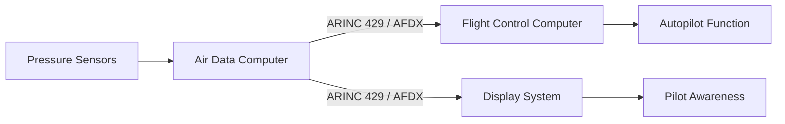

#### Verification Focus

- sensor conversion accuracy bounds
- label/VL mapping correctness
- freshness monitoring
- invalid/stale flags propagation
- display annunciation when source fails
- autopilot behavior when data invalid

### Example 2: FMS Guidance to Autopilot

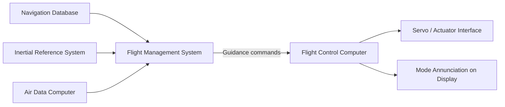

#### Verification Focus

- mode transition logic
- cross-side consistency
- command limits
- lateral/vertical guidance integrity
- annunciation of active/armed modes
- sensor source failover behavior

### Example 3: FADEC Control Loop

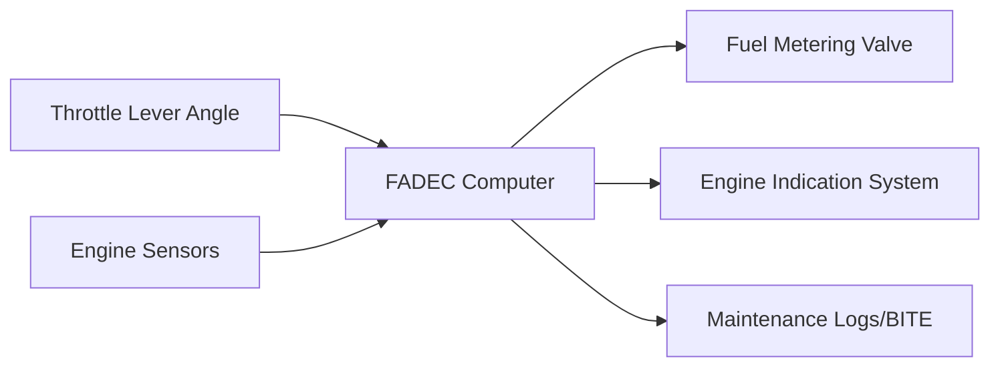

#### Verification Focus

- command-to-actuation latency
- protection logic priority over pilot command
- channel synchronization
- fault detection and reversionary behavior
- maintenance fault code generation

---

## 1.10 Production Workflow for an Avionics Integration Engineer

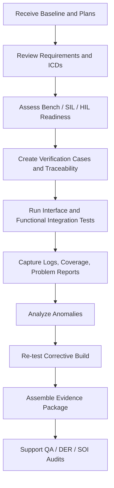

### Practical Reality

Lead engineers spend significant time on:

- baseline control
- reproducibility of anomalies
- requirements interpretation disputes
- bench representativeness concerns
- late ICD churn
- defect triage and severity classification
- audit preparation

---

## 1.11 Engineering Artifacts Used in Fundamentals Phase

- System architecture document
- Software architecture document
- Interface Control Documents (ICDs)
- Data dictionaries / bus mapping documents
- Hardware/software interface descriptions
- Platform configuration records
- Lab/bench configuration sheets
- Signal mapping tables
- Requirements baseline references
- Initial integration test matrix

### Template: Interface Verification Matrix

```text
Interface Name:
Producer LRU:
Consumer LRU:
Physical Medium:
Protocol:
Signals / Labels / Messages:
Nominal Update Rate:
Timeout Threshold:
Invalidity Encoding:
Power-Up Behavior:
Failure Modes to Test:
Required Bench Assets:
Pass/Fail Criteria:
Objective Evidence to Capture:
```

### Template: Signal-Flow Review Checklist

```text
[ ] Producer and consumer identified
[ ] Unit/scaling/sign convention defined
[ ] Data validity and freshness defined
[ ] Startup/default value behavior defined
[ ] Failover source logic defined
[ ] Time synchronization assumptions documented
[ ] Maintenance/BITE visibility defined
[ ] Bus loading / schedule assumptions documented
[ ] Negative tests identified
[ ] Traceability to requirements established
```

---

## 1.12 Common Mistakes

- Treating ICDs as implementation suggestions instead of controlled requirements inputs
- Testing only nominal interface data and not invalidity/status semantics
- Ignoring startup, reset, and power transient behavior
- Assuming bench bus timing matches aircraft timing
- Missing engineering unit conversion defects
- Verifying message presence but not end-to-end effect
- Failing to verify downstream annunciation and crew impact

## 1.13 Failure Scenarios

1. **Stale airspeed accepted as fresh** because timeout counter reset on invalid frames.
2. **Landing gear interlock inverted** due to discrete polarity misunderstanding.
3. **AFDX failover works in lab but not aircraft** because switch redundancy configuration differs.
4. **Display shows valid-looking but flagged-invalid data** because SSM interpretation lost during middleware translation.

## 1.14 Troubleshooting Guide

| Symptom | Likely Causes | Troubleshooting Actions |
|---|---|---|
| Message visible on bus but function not active | Wrong label/VL, wrong scaling, mode inhibit | Check ICD mapping, mode logic, validity bits |
| Function works on SIL not HIL | Timing difference, hardware driver issue, electrical thresholds | Compare timestamps, inspect driver behavior, validate IO levels |
| Intermittent integration failures | Race condition, scheduling jitter, harness/connectivity | Correlate logs with task timing and bench wiring |
| Crew display mismatch | Consumer formatting issue, stale cache, source arbitration defect | Trace end-to-end producer→middleware→display path |

---

## 1.15 Case Study

### Case Study: Autopilot Refuses to Engage Above 10,000 ft During Bench Regression

**Situation:** Bench regression reports autopilot engagement failure only in one scenario set.  
**Investigation:** Guidance logic correct. FMS outputs valid commands. FCC receives air data label, but sign/status matrix shows “no computed data” during brief initialization window. Bench script starts engage command before ADC validity transitions complete.  
**Root Cause:** Test environment sequence not aligned with aircraft startup assumptions.  
**Why Important:** Verification must represent operational sequencing; otherwise false failures or false confidence result.  
**Evidence:** Bench logs, ARINC captures, startup timing analysis, updated procedure, regression rerun.  
**Audit Lesson:** Show how environment assumptions are controlled and reviewed.

---

## 1.16 Interview Questions

### Beginner

- What is an LRU?
- What is the difference between ARINC 429 and CAN?
- Why is determinism important in avionics?

### Intermediate

- How would you verify an Air Data Computer to display interface?
- What are the risks of relying solely on software-in-the-loop testing?
- Explain the layers between hardware and application software in an avionics computer.

### Senior

- Describe how you would build an end-to-end integration strategy for FMS guidance to FCC to display annunciation.
- How do you ensure interface test completeness beyond nominal bus traffic?
- What evidence would you require before trusting a HIL bench for certification credit?

### Lead

- How would you resolve conflict between system engineering and software teams over ambiguous ICD semantics late in certification?
- What criteria would you use to accept residual integration risk before a certification test campaign?
- How would you defend interface verification sufficiency during an SOI audit?

---

## 1.17 Exercises

1. Build an interface verification checklist for a landing gear discrete input set.
2. Create a signal-flow from sensor to cockpit display for barometric altitude.
3. Identify five failure modes for an AFDX-guided mode command path.
4. Compare verification needs for ARINC 429 vs MIL-STD-1553 in one aircraft function.

## 1.18 Mini-Project

**Mini-Project:** Develop an integration readiness package for an Air Data Computer to Display System interface.

### Deliverables

- Interface verification matrix
- Startup sequence assumptions
- Nominal and robustness test list
- Failure injection matrix
- Evidence capture plan
- Review checklist

### Acceptance Criteria

- All message semantics defined
- Validity/freshness behavior covered
- Bench assumptions documented
- Traceability to input requirements present

## 1.19 Assessment

**Written Assessment Prompts**

1. Explain why interface verification in avionics must cover both data transport and functional effect.
2. Describe the architectural layers from aircraft function to BSP and identify verification concerns at each.
3. Propose a fault-focused test strategy for one bus interface and one discrete interface.

**Self-Check Rubric**

- Can you describe an aircraft signal path without hand-waving?  
- Can you identify where evidence must be captured?  
- Can you distinguish bus presence from valid system behavior?  
- Can you explain why test-environment fidelity matters to certification?  

---
---

# MODULE 2 — SAFETY-CRITICAL SOFTWARE FUNDAMENTALS

## 2.1 Learning Objectives

By the end of this module, an engineer should be able to:

- Explain the core properties of safety-critical avionics software.
- Compare fail-safe and fail-operational strategies in realistic systems.
- Explain why ordinary commercial software testing is insufficient.
- Apply concepts such as partitioning, independence, fault containment, and defensive programming to verification planning.
- Translate safety-critical expectations into concrete review, test, and evidence activities.

## 2.2 Prerequisites

- Module 1 fundamentals
- Basic reliability terminology
- Basic software development lifecycle understanding

---

## 2.3 Core Safety-Critical Concepts

### Master Comparison Table

| Concept | What It Means | Why Avionics Requires It | Lifecycle Stage | Artifacts | How Engineers Perform It | Evidence Produced | What Can Go Wrong | Review/Audit Focus | DO-178C Relation | Realistic Example | Interview Question |
|---|---|---|---|---|---|---|---|---|---|---|---|
| Determinism | Same inputs and state lead to bounded, predictable behavior in time and output | Crews and control laws cannot depend on variable or surprising timing | Requirements, design, implementation, integration, verification | Timing requirements, design data, scheduling data, tests | Define rates/deadlines, avoid uncontrolled dynamic behavior, test worst-case timing | Timing test logs, analysis, schedule review records | Jitter, race conditions, mode delays | Evidence of bounded timing and known assumptions | Supports requirements/design/code/test objectives | Flight control task must run every 10 ms within deadline | “How do you verify deterministic behavior in a partitioned system?” |
| Reliability | Probability of performing intended function over time/conditions | Repeated correct operation is necessary across missions and faults | All lifecycle phases | Requirements, design, problem reports, reliability analyses | Robust design, fault handling, regression, stress testing, configuration control | Reliability growth data, defect metrics, regression history | Hidden intermittent defects, config drift | Trend of defect closure and repeatability | DO-178C emphasizes correctness/evidence, supporting reliability | A display processor must not sporadically freeze under valid traffic bursts | “How is reliability supported by verification evidence?” |
| Fault tolerance | Continued correct or acceptably degraded behavior despite faults | Aircraft must withstand component/data faults without unsafe outcome | Architecture, design, integration, safety assessment | FHA/PSSA-derived requirements, design, tests | Inject faults, verify detection/isolation/reconfiguration | Fault-injection results, FDIR reports | Single fault causes unsafe control action | Traceability from safety requirements to tests | Verification of derived/robustness requirements | Dual-channel FCC uses cross-monitoring after sensor disagreement | “What is the difference between fault tolerance and redundancy?” |
| Fail-safe | On fault, system goes to a state that is safe even if function is lost | Prevents unsafe actuation or misleading outputs | Safety requirements, design, test | Safety requirements, state machine design, test procedures | Define safe state, inhibit output, annunciate failure | State transition logs, fail-safe tests | System shuts down too late or not at all | Clear definition of safe state and trigger conditions | Verification of fault responses and safety requirements | Faulty landing gear command channel inhibits retraction | “Give an example of fail-safe behavior in avionics.” |
| Fail-operational | System continues providing necessary function after certain faults | Some functions cannot simply shut off in flight | Architecture, design, integration | Redundancy design, reconfiguration logic, tests | Verify switchover, lane isolation, degraded mode performance | Reversionary mode tests, latency results | Split-brain behavior, unsynchronized channels | Proof that continued operation remains controlled | Supports high-assurance behavior for critical functions | Autopilot lane A fails, lane B continues within limits | “When is fail-operational required instead of fail-safe?” |
| Redundancy | Multiple elements performing same or backup function | Removes single points of failure | System and software architecture | Architecture docs, allocation, synchronization requirements | Cross-channel checks, voting, switchover tests | Cross-monitor logs, fault-injection data | Common-mode failure defeats redundancy | Independence/common-cause analysis | DAL allocation and verification rigor often affected | Triplex sensor voting for air data inputs | “Why is redundant design not automatically safe?” |
| Partitioning | Isolation of functions so one cannot adversely affect another | Mixed criticality sharing requires containment | Platform design, integration, verification | Partition schedules, memory maps, platform requirements | Verify time/memory partitioning, robustness, error containment | Partition tests, platform evidence | Memory bleed, CPU starvation across partitions | Objective proof of isolation mechanisms | Especially relevant with IMA and supplements | DAL A display partition must not be corrupted by maintenance partition | “How would you verify partition integrity?” |
| Independence | Verification activities performed by someone other than the originator where required | Prevents self-approval and increases objectivity | Planning and verification | Plans, review records, organization charts | Separate reviewers/verifiers, controlled approvals | Signed reviews, independence matrix | Same developer silently approves own work | Role clarity and approval evidence | DO-178C independence objectives vary by DAL | Independent tester rejects ambiguous requirement overlooked by developer | “What activities usually require independence at DAL A/B?” |
| Defensive programming | Code written assuming interfaces may fail or misbehave | Real hardware/data faults must be contained | Design, coding, code review | Coding standards, source, review records | Range checks, state validation, timeout handling, sanity monitoring | Review checklists, unit/integration tests | Overdefensive masking of design defect, latent dead paths | Whether defensive logic is requirement-backed and tested | Supports robustness and low-level correctness | Reject impossible airspeed jump instead of using it | “What are the dangers of defensive code without requirements?” |
| Defensive testing | Tests deliberately inject invalid/unexpected conditions | Nominal-only tests do not prove safe behavior | Verification | Test cases, procedures, anomaly reports | Invalid inputs, noise, stale data, boundary values, fault insertion | Robustness test results | Incomplete negative testing, unrealistic injections | Adequacy of abnormal-case coverage | Strongly aligned with robustness verification | Inject parity errors and stale ARINC words | “How do defensive tests differ from normal functional tests?” |
| Fault containment | Preventing faults from propagating beyond a boundary | Limits impact and simplifies recovery | Architecture, integration | Interface design, health management logic | Boundaries, watchdogs, validity flags, reset domains | Fault propagation analysis, tests | Error in one partition corrupts another | Clear containment boundaries and proof | Supports partitioning/integration assurance | Display application fault must not affect flight guidance partition | “How do you prove a fault was contained?” |
| Error detection | Recognizing abnormal conditions | Recovery depends on timely detection | Requirements, design, verification | Detection requirements, tests, logs | Limit checks, CRC, parity, monitor counters, reasonableness tests | Detector test records, logs | Detector too insensitive or too noisy | Threshold rationale and test adequacy | Verified as functional requirements | CRC failure must trigger message rejection | “What makes an error detector certifiable?” |
| Error recovery | Restoring safe/usable operation after detection | Aircraft must handle transient faults and continue if possible | Design, integration, test | Recovery logic design, procedures, tests | Retry, reset, channel switchover, degraded modes | Recovery timing logs, mode-transition evidence | Endless reset loops, loss of state, unsafe re-enable | Defined recovery path and bounded behavior | Must be requirements-based and verified | Failed sensor source is deselected, backup selected | “How would you verify recovery without masking a root cause?” |

---

## 2.4 Why Ordinary Web/Enterprise Testing Is Insufficient

### Fundamental Differences

| Dimension | Typical Web/Product Software | Safety-Critical Avionics Software |
|---|---|---|
| Failure effect | User inconvenience, business loss | Possible injury, hull loss, certification impact |
| Downtime tolerance | Minutes to hours may be acceptable | Milliseconds may matter, some functions must continue |
| Update model | Frequent patching | Highly controlled baselines |
| Testing strategy | Risk-based, market-driven | Objective-based, certification-driven |
| Undefined behavior | Sometimes acceptable if rare | Unacceptable where unsafe outcome possible |
| Traceability | Usually partial | End-to-end mandatory |
| Evidence standard | Team confidence | Independent, auditable objective evidence |
| Fault injection | Often limited | Essential |
| Timing analysis | Often best-effort | Mandatory for many functions |
| Environment fidelity | Simulated enough | Representativeness must be justified |

### Why This Matters

A senior avionics engineer must reject arguments like:

- “It worked in our simulator.”
- “Users will notice if it breaks.”
- “We can patch it later.”
- “No one has seen this edge case before.”

In avionics, absence of observed failure is not proof. **Objective evidence** is the standard.

---

## 2.5 Normal Software Development vs Safety-Critical Avionics Development

### Lifecycle Comparison Table

| Area | Normal Software | Safety-Critical Avionics |
|---|---|---|
| Requirements | Can be evolving/backlog-driven | Baseline-controlled, reviewable, testable |
| Design | Sometimes lightweight | Explicit, reviewable, traceable |
| Coding | Primary value creation focus | One implementation step among many controlled activities |
| Testing | Often demonstrates expected behavior | Demonstrates requirements satisfaction and robustness |
| Reviews | Helpful practice | Structured verification activity |
| Configuration management | Source versioning | Full lifecycle baseline control |
| Quality assurance | Team-managed | Independent process oversight common |
| Release criteria | Product readiness | Objective completion plus certification confidence |
| Defect handling | Agile prioritization | Formal problem reporting and impact assessment |
| Change impact | Usually feature/regression based | Safety/certification/traceability impact based |

### Mindset Comparison

| Question | Normal Software Answer | Avionics Answer |
|---|---|---|
| “Does it work?” | Often enough | Need evidence it works under defined conditions |
| “Can we fix later?” | Sometimes yes | Often no; unsafe or uncertified state unacceptable |
| “Who verified this?” | Team or automation | Defined verifier, sometimes independent |
| “Where is requirement source?” | Ticket/story | Controlled requirement and trace linkage |
| “What if input is invalid?” | Return error/log | Must detect, contain, annunciate, recover safely |

---

## 2.6 Safety-Critical Process Flow

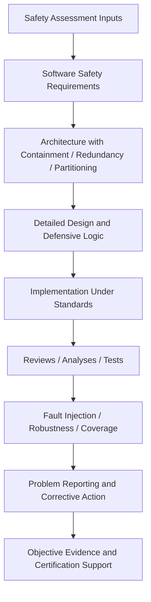

---

## 2.7 Production Workflow

1. Receive safety-derived software requirements and failure-condition context.
2. Confirm derived requirements are captured and reviewed.
3. Verify architecture implements independence, containment, and recovery intent.
4. Build abnormal-case verification matrix before execution.
5. Execute nominal, boundary, and injected-fault scenarios.
6. Assess not just outputs, but timing, annunciation, and downstream effect.
7. Record anomalies with reproducible configuration and safety impact.
8. Confirm corrective action does not weaken containment or determinism.

---

## 2.8 Engineering Artifacts

- Safety-related software requirements
- Fault handling requirements
- Mode/state tables
- Partition and scheduling configuration data
- Robustness test specifications
- Fault injection procedures
- Watchdog/reset behavior descriptions
- Problem reports and root cause analyses
- Independence matrices and approval records

### Template: Fault-Handling Requirement Review

```text
Requirement ID:
Hazard / Failure Condition Link:
Fault Trigger:
Detection Mechanism:
Response Required:
Timing Bound:
Crew Annunciation Expected:
Downstream Consumer Impact:
Recovery Behavior:
Verification Method:
Independence Required?:
Objective Evidence Expected:
```

### Template: Robustness Test Case

```text
Test ID:
Requirement(s):
Preconditions:
Injected Abnormal Condition:
Stimulus Method:
Expected Detection:
Expected System Response:
Expected Annunciation / Maintenance Output:
Pass/Fail Criteria:
Captured Logs / Measurements:
Reviewer / Independent Verifier:
```

---

## 2.9 Common Mistakes

- Confusing “redundant” with “independent”
- Adding defensive logic without requirements or verification basis
- Treating resets as acceptable recovery without proving safe state transitions
- Ignoring common-mode failures in redundant channels
- Verifying only detection and not recovery path completion
- Assuming partitioning exists because platform vendor claims it
- Accepting non-deterministic test results as “just bench noise”

## 2.10 Failure Scenarios

1. **Fail-safe defined incorrectly** — software inhibits function, but no annunciation occurs, increasing crew confusion.
2. **Redundant channels share same bad input** — common-mode fault defeats safety intent.
3. **Partition breach under overload** — maintenance partition floods CPU and delays guidance partition.
4. **Defensive code masks design defect** — system silently clamps invalid value, preventing root cause detection.

## 2.11 Troubleshooting

| Problem | Likely Cause | Action |
|---|---|---|
| Recovery works inconsistently | Uninitialized state, race during switchover | Trace exact state machine transitions and task timing |
| Fault detector too noisy | Thresholds unrealistic, sensor model mismatch | Revisit requirements rationale and operational data |
| Partition performance anomalies | Misconfigured scheduling, excessive logging | Inspect partition tables, instrumentation overhead |
| Reset loops in lab | Fault latch/reset criteria unclear | Review recovery requirements and cooldown logic |

---

## 2.12 Case Study

### Case Study: Dual-Lane Flight Guidance Reversion Failure

**Scenario:** Lane A injected with internal monitor fault. Requirement states Lane B shall assume command authority within bounded time.  
**Observed:** Lane B takes control, but display annunciation continues showing Lane A active for 1.8 seconds.  
**Why Serious:** Functional recovery occurred, but crew awareness lag created hazardous confusion potential.  
**Root Cause:** Control authority path and display authority path used different health-state propagation timing.  
**Evidence Needed:** Event timeline, bus traces, requirements trace, design review record, corrected test rerun, impact analysis on related modes.  
**Lead Lesson:** Safety-critical verification must cover **functional control**, **annunciation**, and **timing coherence** together.

---

## 2.13 Interview Questions

### Beginner

- What is fail-safe?
- What is the purpose of redundancy?
- What do we mean by determinism?

### Intermediate

- How do fail-safe and fail-operational differ?
- Why is defensive testing important in avionics?
- What is the difference between fault detection and fault containment?

### Senior

- How would you verify partitioning claims on an IMA platform?
- How do you assess whether defensive logic is legitimate or masking a requirements gap?
- Describe a verification strategy for reversionary mode logic after channel failure.

### Lead

- How would you challenge a design team that claims “reset is our recovery strategy” for a DAL A function?
- How do you balance fault sensitivity against nuisance trips in certification evidence?
- How would you argue robustness sufficiency to an auditor or DER?

---

## 2.14 Exercises

1. Create a table distinguishing fail-safe and fail-operational behavior for FCC, display, and maintenance functions.
2. List 10 negative tests for an ARINC 429 sensor input path.
3. Describe how you would verify time and space partitioning without access to source code for the platform.
4. Identify common-mode fault risks in a redundant ADC architecture.

## 2.15 Mini-Project

**Mini-Project:** Build a safety-critical verification concept package for a dual-lane autopilot mode manager.

### Deliverables

- Safety concept summary
- Fault containment map
- Reversionary mode test matrix
- Independence matrix for reviews/tests
- Robustness evidence checklist

### Assessment Criteria

- Clear safe-state definitions
- Detection/recovery logic traceable to requirements
- Negative testing covers realistic operational faults
- Evidence package would withstand audit questioning

## 2.16 Assessment

**Prompts**

1. Explain why ordinary product-quality testing cannot be repurposed directly for safety-critical avionics certification.
2. Describe how partitioning, independence, and fault containment interact.
3. Compare a fail-safe strategy and a fail-operational strategy for a flight-critical function.

---
---

# MODULE 3 — DO-178B/C COMPLETE FOUNDATION

## 3.1 Learning Objectives

By the end of this module, an engineer should be able to:

- Explain the purpose and scope of DO-178C and the historical role of DO-178B.
- Describe all major lifecycle processes defined by DO-178C.
- Identify and explain the purpose of each key lifecycle artifact.
- Explain how traceability links requirements, design, code, tests, coverage, problem reports, and certification evidence.
- Support planning, execution, and audit preparation for a certification program.

## 3.2 Prerequisites

- Modules 1 and 2
- Basic understanding of software lifecycle models
- Awareness of certification/regulatory environment

---

## 3.3 DO-178B vs DO-178C Context

### What DO-178C Is

DO-178C is the industry standard guidance for software considerations in airborne systems and equipment certification. It defines objectives for planning, development, verification, configuration management, quality assurance, and certification liaison for airborne software.

### Why It Exists

Regulators and applicants need a disciplined, objective means to show that airborne software performs its intended function with a level of confidence appropriate to failure condition severity.

### DO-178B to DO-178C

- **DO-178B** was the long-standing baseline used by many legacy programs.
- **DO-178C** clarified ambiguities, updated terminology, and introduced technology supplements (e.g., formal methods, model-based development, object-oriented technology).

For many organizations, “DO-178” may still be used colloquially to refer to both, but engineers must know which revision governs the program.

---

## 3.4 Core DO-178C Processes

### Lifecycle Overview Diagram

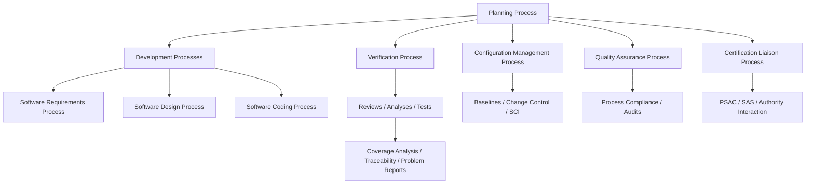

### Process Deep-Dive Matrix

| Process | What It Means | Why Avionics Requires It | Lifecycle Position | Primary Artifacts | How Performed | Evidence | What Can Go Wrong | Audit Focus | DO-178C Role | Example | Interview Question |
|---|---|---|---|---|---|---|---|---|---|---|---|
| Planning | Define how objectives will be met | Certification requires agreed methods before execution | Program start and maintained through lifecycle | PSAC, SDP, SVP, SCMP, SQAP | Produce plans, standards, methods, responsibilities, independence | Approved plans, review records | Vague plans, missing independence, mismatched methods | Plan completeness and consistency | Foundation for all lifecycle execution | SVP omits robustness strategy for interface testing | “Why must planning artifacts exist before substantive verification?” |
| Requirements process | Transform system needs into software requirements | All downstream work must be based on correct, testable requirements | Early development | HLR/LLR, trace matrices | Author, review, baseline, trace | Reviewed requirements, trace links | Ambiguity, non-testability, omitted derived requirements | Requirement quality and traceability | Development objective area | Timing requirement missing acceptance criterion | “What makes a software requirement verifiable?” |
| Design process | Define architecture and detailed behavior implementing requirements | Verification cannot rely on code alone | Development | Software design data | Architectural decomposition, interfaces, states, algorithms | Design reviews, trace matrices | Hidden derived behavior, missing interface assumptions | Design adequacy to requirements | Development objective area | Health monitor state machine defined in design | “How much design detail is enough for certification?” |
| Coding process | Implement source/object code consistent with design and standards | Source must be controlled and reviewable | Development | Source code, coding standards, build records | Implement under CM with reviews, analyses, tests | Code review records, static results, builds | Dead code, unintended function, noncompliant constructs | Conformance to low-level req/design and standards | Development objectives plus later verification | Pointer misuse creates latent overflow risk | “Why is executable object code also a certification concern?” |
| Verification | Confirm outputs satisfy inputs and no unintended functionality exists | Objective evidence is mandatory | Throughout lifecycle | Review records, test procedures/results, coverage, anomaly reports | Reviews, analyses, tests, trace checks | Signed reviews, test reports, coverage reports | Self-verification, incomplete robustness, weak trace | Objective closure and independence | Central assurance mechanism | Requirement reviewed but not exercised or covered | “How do you prove no unintended function?” |
| Configuration management | Control baselines and reproducibility | Certification depends on exact known versions | Entire lifecycle | SCMP, SCI, change records | Identify items, baseline, control changes/releases | CM logs, version records, SCI | Wrong baseline tested, missing release contents | Reproducibility and integrity | Mandatory supporting process | Test run used incorrect ICD revision | “Why is SCI important to a verifier?” |
| Quality assurance | Ensure processes are followed and deviations handled | Confidence in evidence depends on process adherence | Entire lifecycle | SQAP records, audit reports | Audit process/product compliance, track findings | QA audit reports, corrective actions | Unapproved process deviations | Independence and closure of findings | Required supporting process | QA finds unsigned independent review records | “How does QA differ from verification?” |
| Certification liaison | Manage coordination with certification authority/DER | Authority confidence must be built progressively | Entire lifecycle | PSAC, SAS, SOI data, issue logs | Present plans, answer findings, provide status and evidence | Approval comments, action items, SAS | Late surprises, unclosed issues | Consistency and readiness for SOIs | Formal external-facing process | DER questions robustness coverage rationale | “What is the purpose of the SAS?” |

---

## 3.5 Key Lifecycle Artifacts

### Artifact Overview Table

| Artifact | Full Name | Purpose | Typical Owner | Lifecycle Timing |
|---|---|---|---|---|
| PSAC | Plan for Software Aspects of Certification | Explains software approach to certification | Certification lead / software lead | Early planning |
| SDP | Software Development Plan | Defines development methods and activities | Development lead | Early planning |
| SVP | Software Verification Plan | Defines reviews, analyses, tests, coverage, independence | Verification lead | Early planning |
| SCMP | Software Configuration Management Plan | Defines control of baselines and releases | CM lead | Early planning |
| SQAP | Software Quality Assurance Plan | Defines audits and process assurance | QA lead | Early planning |
| SAS | Software Accomplishment Summary | Summarizes completed lifecycle and objective closure | Program/software cert lead | End of lifecycle |
| SCI | Software Configuration Index | Identifies exact software configuration and components | CM | Release/baseline milestones |
| Software Requirements Data | HLR/LLR and related data | Basis for design and verification | Systems/software engineering | Development |
| Design Data | Architecture and detailed design | Basis for code and verification | Software engineering | Development |
| Source Code | Implementation | Executable basis | Software engineering | Development |
| Executable Object Code | Loadable software | Aircraft-installed or bench-executed deliverable | Build/release team | Build/release |
| Test Procedures | Step-by-step verification definition | Repeatable execution | Verification | Verification |
| Test Results | Objective outcome records | Evidence of execution and pass/fail | Verification | Verification |
| Coverage Analysis | Structural coverage data/assessment | Completeness evidence | Verification | After test execution |
| Problem Reports | Formal anomaly records | Defect control and closure | All disciplines / CCB | Entire lifecycle |

### Artifact Relationships Diagram

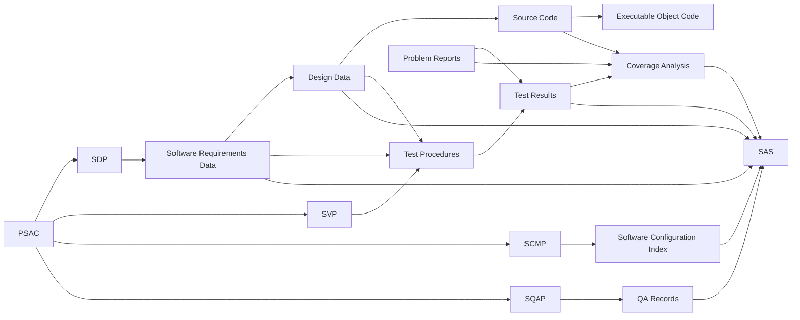

---

## 3.6 Detailed Artifact Foundation

### PSAC

| Dimension | Detail |
|---|---|
| What it means | Top-level certification approach for software |
| Why needed | Aligns applicant, QA, engineering, and authority on scope/methods/objectives |
| Where in lifecycle | Created early, maintained as needed |
| Inputs/outputs | Inputs: system certification basis, architecture, DALs. Outputs: commitment framework for software lifecycle |
| How engineers use it | To understand scope, standards, deliverables, independence, supplements, SOI expectations |
| Evidence | Approved PSAC, review comments, revisions |
| What can go wrong | Underdefined scope, wrong DAL assumptions, omitted tool strategy |
| Audit review | Auditors check consistency between plan promises and actual execution |
| DO-178C relation | Central planning artifact |
| Example | PSAC states DAL B application hosted on IMA platform with model-based supplement usage |
| Interview question | “What would you expect in a PSAC beyond a simple lifecycle summary?” |

### SDP

| Dimension | Detail |
|---|---|
| What it means | Plan describing how software will be developed |
| Why needed | Ensures repeatable engineering and alignment with certification objectives |
| Lifecycle | Early planning and maintained |
| Artifacts touched | Requirements standards, design standards, coding standards, lifecycle descriptions |
| How performed | Define processes, methods, languages, reviews, tools, interfaces between teams |
| Evidence | Approved plan and compliance records |
| Risks | Overly generic plan, mismatch to actual program architecture |
| Audit focus | Whether actual development follows documented plan |
| DO-178C relation | Required planning data |
| Example | SDP defines Ada for application, C for BSP, peer review rules, derived requirement handling |
| Interview question | “How would you detect if an SDP is too generic to be useful?” |

### SVP

| Dimension | Detail |
|---|---|
| What it means | Plan for verification activities |
| Why needed | Verification must be systematic, independent where required, and complete |
| Lifecycle | Early planning |
| Artifacts | Reviews, analyses, tests, coverage, traceability, tool use |
| How performed | Define methods, levels, responsibilities, entry/exit criteria, anomaly handling |
| Evidence | Approved plan, verification procedures, independence matrix |
| Risks | Missing robustness, vague pass/fail criteria, unaddressed object code concerns |
| Audit focus | Adequacy and plan conformance |
| DO-178C relation | Primary verification planning artifact |
| Example | SVP defines requirements review checklists, HIL campaign, MC/DC method |
| Interview question | “What would make you reject an SVP during review?” |

### SCMP / SQAP / SAS / SCI

| Artifact | What It Means | Why Needed | Evidence / Audit Notes |
|---|---|---|---|
| SCMP | Defines how software items are identified and controlled | Without CM, evidence cannot be tied to exact configuration | Auditors look for baseline integrity, change control, release discipline |
| SQAP | Defines quality assurance oversight | Process confidence requires independent surveillance | Auditors examine findings, closure evidence, independence |
| SAS | Final summary that objectives were met and lifecycle data complete | Provides concise certification closure package | Must accurately reflect actual evidence and unresolved issues |
| SCI | Index of exact software configuration and its components | Reproducibility and release integrity | Critical when tracing test results to executable and source baseline |

---

## 3.7 Complete Traceability Model

### End-to-End Traceability Diagram

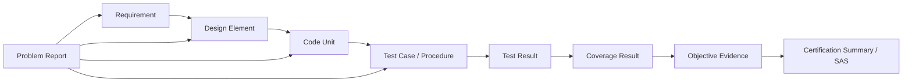

### Traceability Expectations

| Link | Purpose | What Auditors Expect |
|---|---|---|
| Requirement → Design | Show design implements intended behavior | No orphan design logic |
| Design → Code | Show implementation derives from approved design | No major unintended code blocks |
| Requirement/Design → Test | Show each behavior is verified | Complete, unambiguous verification coverage |
| Test → Result | Show execution occurred and outcome known | Reproducible pass/fail record |
| Code → Coverage | Show structure exercised to required level | Gaps explained and resolved |
| Problem Report → Affected Items | Show anomalies are controlled and impact understood | No silent known issues |
| Evidence → SAS | Show certification closure uses exact lifecycle data | Accurate summary, no hidden open items |

### Traceability Failure Modes

- Requirement verified by no test
- Test exists but not linked to requirement
- Code implements behavior absent from requirements/design
- Coverage gap left unexplained
- Problem report closed without retest trace
- Baseline used for test not matched to SCI

---

## 3.8 Production Workflow Under DO-178C

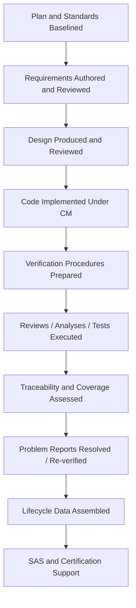

---

## 3.9 Engineering Artifact Templates

### Template: PSAC Review Checklist

```text
[ ] Software scope clearly defined
[ ] DAL allocation identified
[ ] Applicable supplements identified if used
[ ] Lifecycle processes and plans referenced
[ ] Independence strategy described
[ ] Tool usage and qualification approach addressed
[ ] Certification deliverables listed
[ ] SOI support approach described
[ ] Applicant / supplier responsibilities defined
```

### Template: Traceability Review Record

```text
Baseline:
Requirement Set Reviewed:
Design Set Reviewed:
Code Baseline:
Test Baseline:
Coverage Baseline:
Open Gaps:
Problem Reports Referenced:
Reviewer(s):
Independent Verifier:
Disposition:
```

### Template: Problem Report Essentials

```text
PR ID:
Configuration / SCI Reference:
Discovery Phase:
Requirement(s) Affected:
Observed Behavior:
Expected Behavior:
Safety / Certification Impact:
Reproducibility Steps:
Root Cause:
Corrective Action:
Regression Scope:
Closure Evidence:
```

---

## 3.10 Common Mistakes

- Treating documents as compliance paperwork instead of engineering controls
- Allowing requirements, design, and tests to evolve out of sync
- Weak traceability ownership between systems, software, and verification teams
- Delaying coverage analysis until the end
- Confusing QA audit evidence with verification evidence
- Failing to baseline tool versions and bench configurations
- Writing SAS before objective closure truly exists

## 3.11 Failure Scenarios

1. **SVP promises MC/DC but tooling/process cannot support justified analysis.**
2. **SCI omits generated configuration tables; reproduced test results do not match aircraft load.**
3. **Derived requirement implemented in code but never reviewed at requirements level.**
4. **Open problem report excluded from SAS impact discussion, discovered during audit.**

## 3.12 Troubleshooting

| Problem | Likely Cause | Recovery Strategy |
|---|---|---|
| Trace matrix inconsistent | Baseline mismatch, manual update lag | Reconcile by configuration, automate checks where possible |
| Auditor asks for evidence not found | Poor lifecycle indexing | Use SCI/document index discipline and evidence cross-reference table |
| Coverage gap persists | Unreachable/deactivated/dead code confusion | Perform code/design review, classify correctly, add tests or remove logic |
| Plan/process mismatch | Program evolved without plan updates | Revise plans formally and document rationale |

---

## 3.13 Case Study

### Case Study: Untraceable Reversion Logic Found at SOI

**Scenario:** During an audit, authority representative asks for requirement trace to code handling autopilot disengage under bus invalidity.  
**Finding:** Code and tests exist, but requirement exists only as design note; no controlled software requirement or derived requirement record.  
**Impact:** Certification schedule hit, corrective action across requirements, design, tests, reviews, and SAS narrative.  
**Lesson:** Good engineering behavior is not enough; certifiable engineering requires controlled lifecycle data and traceability.

---

## 3.14 Interview Questions

### Beginner

- What is the purpose of DO-178C?
- What is PSAC?
- What is SCI?

### Intermediate

- How do SDP and SVP differ?
- Why is traceability necessary from requirements to coverage?
- What is the difference between configuration management and quality assurance?

### Senior

- How would you explain the relationship among PSAC, SVP, SCI, coverage analysis, and SAS to a new team member?
- What types of lifecycle data gaps most often delay certification?
- How would you verify that no unintended functionality exists?

### Lead

- How would you recover a program where plans were approved but actual practice diverged for six months?
- What arguments would you make if an auditor challenges the completeness of problem report impact analysis?
- How would you structure certification evidence packaging to survive personnel turnover and late audits?

---

## 3.15 Exercises

1. Draw a traceability chain for one failure-detection requirement from requirement through test and coverage.
2. Create an artifact relationship map for a hypothetical DAL B display application.
3. Identify which lifecycle artifacts would be impacted by a newly discovered derived requirement.
4. Compare QA findings versus verification findings using examples.

## 3.16 Mini-Project

**Mini-Project:** Build a certification data map for a hypothetical DAL A flight guidance function.

### Deliverables

- Artifact inventory
- Traceability model
- Review and test evidence matrix
- Problem report workflow
- SAS input checklist

### Acceptance Criteria

- Every major DO-178C process represented
- Artifact relationships coherent
- Audit questions answerable from package
- Configuration identification explicit

## 3.17 Assessment

**Assessment Prompts**

1. Explain the purpose of each major DO-178C process and how they interact.
2. Describe what would make a traceability model audit-ready.
3. Explain how SCI, coverage, and problem reports contribute to the SAS.

---
---

# MODULE 4 — DESIGN ASSURANCE LEVELS (DAL)

## 4.1 Learning Objectives

By the end of this module, an engineer should be able to:

- Explain DAL A through DAL E and their relationship to failure conditions.
- Distinguish assurance rigor expectations for DAL A, B, and C in practical terms.
- Understand independence, coverage, documentation, and test depth differences across DALs.
- Evaluate realistic software examples and infer likely DAL rationale.
- Plan verification effort consistent with design assurance expectations.

## 4.2 Prerequisites

- Modules 1-3
- Familiarity with safety assessment terms such as catastrophic, hazardous, major, minor, no effect

---

## 4.3 DAL Overview

### Failure Condition to DAL Mapping (Typical)

| DAL | Typical Failure Condition Classification | High-Level Consequence |
|---|---|---|
| A | Catastrophic | Prevents continued safe flight and landing; may cause multiple fatalities |
| B | Hazardous / Severe-Major | Large reduction in safety margin, serious or fatal injuries possible to small number, high crew workload |
| C | Major | Significant reduction in safety margin, increased crew workload, passenger discomfort/injuries possible |
| D | Minor | Slight reduction in safety margin, manageable crew workload increase |
| E | No Effect | No effect on operational capability or safety |

### Critical Principle

DAL is **not** a statement of product quality; it is a statement of the rigor needed in development assurance to provide confidence commensurate with failure consequence.

---

## 4.4 DAL Deep-Dive Matrix

| DAL | What It Means | Why Avionics Uses It | Lifecycle Impact | Artifacts / Evidence Implications | Verification Expectations | Independence Expectations | Coverage Expectations | Documentation Depth | Example | Interview Question |
|---|---|---|---|---|---|---|---|---|---|---|
| A | Highest assurance for catastrophic failure conditions | Unsafe failure consequence is unacceptable | Maximum rigor across planning, development, verification | Very strong objective evidence and closure discipline | Exhaustive requirements/design/code verification with robustness | Significant independence required | MC/DC plus statement/decision expectations as applicable | Extensive and highly reviewable | Primary flight control law software | “Why is MC/DC associated with DAL A?” |
| B | High assurance for hazardous/severe-major conditions | Serious safety reduction requires strong confidence | High rigor but less than DAL A in some objectives | Strong documentation and controlled anomaly closure | Deep verification, robustness, integration, traceability | Independence required for many activities | Decision coverage typically expected (with statement); no MC/DC requirement per baseline objectives | Extensive | Autopilot mode manager or engine indication warning logic depending architecture | “How does DAL B differ practically from DAL A?” |
| C | Moderate-high assurance for major conditions | Major crew impact still requires disciplined lifecycle | Structured lifecycle and verification | Complete but somewhat lower rigor than A/B | Requirements-based testing, reviews, analyses | Independence expectations reduced relative to A/B | Statement coverage typically expected | Controlled but less intensive than A/B | Maintenance display or non-primary nav support function depending safety assessment | “What is usually sufficient structurally for DAL C?” |
| D | Lower assurance for minor effects | Some confidence needed, lower safety consequence | Simplified relative rigor | Basic planning/development/verification evidence | Functional verification still required | Limited independence | Minimal structural expectations compared to higher DALs | Reduced | Cabin maintenance advisory function | “Why still have discipline at DAL D?” |
| E | No safety effect | No software assurance credit needed for safety | Minimal from airworthiness perspective | Often outside DO-178C objectives for certification of safety-critical software | Business/program dependent | N/A | N/A | N/A | Passenger entertainment app | “Would DAL E still benefit from engineering discipline?” |

---

## 4.5 Detailed Comparison: DAL A vs B vs C

### Development Assurance and Verification Rigor

| Topic | DAL A | DAL B | DAL C |
|---|---|---|---|
| Failure effect concern | Catastrophic | Hazardous / Severe-major | Major |
| Tolerance for ambiguity | Extremely low | Very low | Low |
| Review thoroughness | Maximum, tightly controlled | Very high | High |
| Derived requirement scrutiny | Intense | Strong | Strong |
| Robustness testing | Extensive and safety-focused | Extensive | Significant |
| Structural coverage | Includes MC/DC objective level | Includes decision/statement objective level | Includes statement objective level |
| Independence | Broad across verification activities | Broad but slightly less demanding | More limited |
| Certification scrutiny | Highest | Very high | High |
| Problem report closure bar | Extremely high with strong impact analysis | Very high | High |

### Documentation Expectations

| Area | DAL A | DAL B | DAL C |
|---|---|---|---|
| Requirement precision | Must be highly testable and unambiguous | Highly testable | Clearly testable |
| Design depth | Detailed and reviewable down to critical behavior | Detailed | Clear, sufficient for implementation/verification |
| Traceability | Comprehensive, rigorously maintained | Comprehensive | Complete |
| Coverage rationale | Detailed justifications for gaps essential | Detailed | Clear but less intense |
| Independence records | Strongly evidenced | Evidenced | As required by objectives |

### Testing Expectations

| Test Dimension | DAL A | DAL B | DAL C |
|---|---|---|---|
| Nominal testing | Mandatory | Mandatory | Mandatory |
| Boundary testing | Extensive | Extensive | Significant |
| Robustness/abnormal | Extensive | Extensive | Required to support requirements-based confidence |
| Integration testing | Deep system interaction focus | Deep interaction focus | Strong functional interaction focus |
| Timing verification | Tight margins and evidence | Strong evidence | Evidence aligned to requirements |
| Structural coverage closure | Highly scrutinized | Strongly scrutinized | Scrutinized |

---

## 4.6 Realistic Software Examples by DAL

| Software Function | Likely DAL | Rationale |
|---|---|---|
| Primary fly-by-wire flight control law computation | A | Unsafe malfunction could be catastrophic |
| Brake-by-wire anti-skid command logic | A/B depending system architecture | Could create hazardous/catastrophic effects |
| Autopilot engagement/disengagement mode logic | B | Hazardous confusion/control issues possible |
| Flight management lateral path planning display support | C/B depending use | May create major or hazardous downstream effects |
| Engine indication warning aggregation | B/C depending function and annunciation role | Could elevate crew workload during critical phases |
| Maintenance report formatter | D/C | Usually minor/major operational effect |
| Cabin service logging | E/D | No direct flight safety effect |

### Important Caution

Do not assign DAL from intuition alone. Always reference system safety assessment outputs such as FHA/PSSA/SSA and allocation assumptions.

---

## 4.7 DAL-Driven Verification Flow

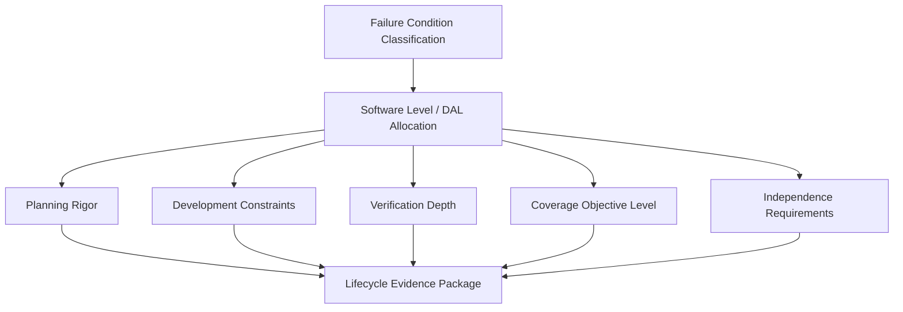

---

## 4.8 Concept Deep-Dive

| Concept | What It Means | Why Required | Lifecycle | Artifacts | Execution | Evidence | Risks | Audit Focus | DO-178C Relation | Example | Interview Question |
|---|---|---|---|---|---|---|---|---|---|---|---|
| Development assurance | Confidence-building process rigor, not runtime reliability guarantee by itself | Higher failure severity demands stronger confidence | Entire lifecycle | All plans, reviews, tests, CM/QA data | Apply objective-specific rigor per DAL | Objective closure records | Misreading DAL as only testing depth | Whether rigor matches allocated level | Central organizing principle of standard | DAL A needs more than “more tests”; it needs stronger process/evidence | “What is development assurance actually assuring?” |
| Independence | Separation between creator and verifier where required | Reduces confirmation bias | Planning, reviews, tests | SVP, org charts, review/test records | Assign independent reviewers/testers/approvers | Approval signatures, role records | Token independence only on paper | Real authority and technical objectivity | DAL-dependent objectives | Independent reviewer catches derived requirement omission | “How do you demonstrate meaningful independence?” |
| Coverage expectation | Required structural evidence depth grows with DAL | Need increasing confidence no logic escaped verification | Test/analysis phase | Coverage reports, source/object maps | Measure, analyze gaps, add tests or justify removal | Coverage closure reports | Confusing dead vs deactivated code | Justification quality and closure | Objective-based by DAL | DAL A logic branch needs MC/DC evidence | “Why isn’t 100% statement coverage enough for DAL A?” |

---

## 4.9 Production Workflow for DAL-Based Planning

1. Obtain approved safety allocation and assumptions.
2. Confirm software boundaries and hosted functions.
3. Map DAL to required objectives, independence, and coverage strategy.
4. Calibrate review checklists and evidence expectations accordingly.
5. Ensure benches, tools, and staffing support that rigor.
6. Track anomalies with safety impact awareness.
7. Escalate any proposal to reduce rigor through formal change control.

---

## 4.10 Engineering Artifacts and Templates

### Template: DAL Impact Assessment

```text
Software Item:
Allocated DAL:
Failure Condition Source:
Architecture Assumptions:
Independence Requirements:
Coverage Target:
Verification Environments Required:
Key Abnormal Behaviors to Verify:
Documentation Depth Needed:
Certification Risks:
```

### Checklist: DAL-Driven Verification Readiness

```text
[ ] DAL allocation formally approved
[ ] Safety assumptions available to software/verification team
[ ] Verification independence staffed appropriately
[ ] Coverage method/tool defined
[ ] Bench fidelity adequate to item criticality
[ ] Robustness strategy documented
[ ] Problem report escalation criteria aligned with DAL
[ ] Review checklists calibrated to DAL rigor
```

---

## 4.11 Common Mistakes

- Assuming all “important” software is DAL A
- Underestimating documentation rigor differences between B and C
- Treating MC/DC as a test-only problem rather than design-for-testability issue
- Failing to align bench/tool capability with DAL expectations
- Allowing independence to erode under schedule pressure
- Ignoring safety assumptions that justify level allocation

## 4.12 Failure Scenarios

1. **DAL B software verified with DAL C mindset** — nominal testing done, but decision logic robustness and independence evidence weak.
2. **DAL allocation correct, partition assumption wrong** — hosted lower-criticality function interferes with higher-criticality partition, invalidating safety basis.
3. **Coverage strategy decided too late** — code structure makes MC/DC closure impractical without redesign.

## 4.13 Troubleshooting

| Symptom | Likely Cause | Action |
|---|---|---|
| Audit says evidence depth insufficient | DAL expectations underestimated | Re-map objectives to actual evidence and fill gaps |
| Coverage closure stalls | Complex coupled conditions | Simplify logic, improve test design, justify structure changes |
| Independence questioned | Same person authored and approved | Rework review/test approvals with true independent personnel |
| Safety assumptions unavailable | Weak systems/software interface | Obtain approved safety data and assess impact immediately |

---

## 4.14 Case Study

### Case Study: DAL C Process Applied to DAL B Mode Logic

**Situation:** An autopilot mode manager was historically treated like a display function because output was “only annunciation plus mode commands.”  
**Discovery:** Safety assessment showed incorrect engagement/disengagement behavior could create hazardous flight path consequences. Actual allocation should be DAL B.  
**Gap Found:** Structural coverage and independence evidence only matched DAL C expectations.  
**Recovery Actions:** Re-planning, re-review of requirements/design, expanded abnormal testing, decision coverage closure, updated SAS narrative.  
**Lesson:** DAL mistakes are not administrative—they reshape the entire verification burden.

---

## 4.15 Interview Questions

### Beginner

- What do DAL A to E represent?
- What failure condition is typically associated with DAL A?
- Does DAL measure product complexity?

### Intermediate

- How do verification activities differ between DAL B and DAL C?
- Why is independence more important at higher DALs?
- What is the relationship between safety assessment and DAL allocation?

### Senior

- How would you build a verification strategy for a DAL A function hosted on shared computing hardware?
- What program risks arise if DAL is discovered to be too low late in development?
- How do coverage expectations influence design decisions?

### Lead

- How would you challenge a proposed DAL downgrade or upgrade from a program risk perspective?
- How do you defend adequacy of DAL-driven evidence when using supplier-developed software components?
- What organizational changes are needed to sustain DAL A/B independence at scale?

---

## 4.16 Exercises

1. Assign tentative DALs to ten aircraft software functions and justify assumptions.
2. Compare evidence packages for a DAL B autopilot mode manager and a DAL C maintenance function.
3. Draft a verification independence matrix for a mixed DAL platform.
4. Explain why MC/DC planning should begin during design, not after coding.

## 4.17 Mini-Project

**Mini-Project:** Create a DAL-based verification strategy for a hypothetical flight guidance subsystem containing DAL A control law computation, DAL B mode logic, and DAL C maintenance support.

### Deliverables

- Function-to-DAL mapping
- Verification rigor comparison
- Independence staffing proposal
- Coverage strategy summary
- Risk register for late certification issues

## 4.18 Assessment

**Assessment Prompts**

1. Explain the practical differences between DAL A, B, and C from a verification lead perspective.
2. Describe how failure condition classification drives lifecycle rigor.
3. Defend why coverage, documentation, and independence expectations must scale with DAL.

---
---

# MODULE 5 — DO-178C VERIFICATION PROCESS

## 5.1 Learning Objectives

By the end of this module, an engineer should be able to:

- Explain DO-178C verification objectives in operational detail.
- Differentiate reviews, analyses, and testing and know when each is appropriate.
- Verify requirements, design, code, integration behavior, structural coverage, and traceability.
- Apply verification independence correctly.
- Distinguish developer testing from independent verification evidence.
- Prepare evidence packages that auditors and DERs expect.

## 5.2 Prerequisites

- Modules 1-4
- Familiarity with requirements, design, and source code reviews
- Basic understanding of structural coverage concepts

---

## 5.3 Verification Objectives Overview

Verification under DO-178C exists to show that:

1. Requirements are correct, complete, and verifiable.
2. Design correctly implements requirements.
3. Code correctly implements design and low-level requirements.
4. Executable behavior satisfies requirements under normal and abnormal conditions.
5. No unintended functionality exists to the extent required by lifecycle objectives.
6. Traceability is complete and consistent.
7. Structural coverage confirms adequacy of requirements-based testing.
8. Problems are identified, corrected, and re-verified under configuration control.

### Verification Process Flow

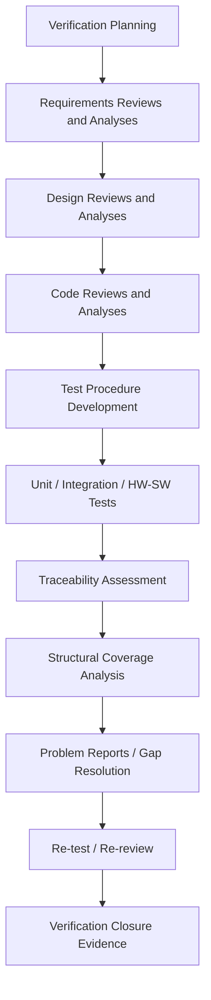

---

## 5.4 Reviews, Analyses, and Testing

### Comparison Table

| Method | What It Is | Why Used | Typical Targets | Evidence | Risks if Weak |
|---|---|---|---|---|---|
| Review | Human examination against criteria/checklists | Finds ambiguity, inconsistency, omission early | Plans, requirements, design, code, tests, results | Review records, comments, approvals | Superficial sign-off, missed ambiguity |
| Analysis | Technical reasoning, trace evaluation, timing/resource/coverage assessment | Some properties cannot be shown by execution alone | Traceability, timing, stack, data coupling, coverage gaps | Analysis reports, worksheets, tool outputs | Unsupported assumptions, math/model errors |
| Testing | Executing software with controlled stimuli and observing outputs | Shows actual behavior under defined conditions | Requirements verification, integration, robustness, object code behavior | Procedures, logs, pass/fail results | Nominal-only testing, poor environment fidelity |

### Verification Method Selection Logic

- Use **reviews** to assess correctness and quality of lifecycle data.
- Use **analyses** where completeness, structural, temporal, or relational evidence is needed.
- Use **tests** to demonstrate behavioral compliance and robustness.
- Production-grade programs use all three, not one in place of the others.

---

## 5.5 Requirements Verification

### Objectives

- Correctness
- Completeness
- Consistency
- Feasibility
- Verifiability
- Traceability
- No ambiguity in operational modes, abnormal cases, units, ranges, timing, or interfaces

### Requirements Verification Deep-Dive Matrix

| Concept | What It Means | Why Avionics Requires It | Lifecycle | Artifacts | How Performed | Evidence | What Can Go Wrong | Audit Focus | DO-178C Relation | Example | Interview Question |
|---|---|---|---|---|---|---|---|---|---|---|---|
| Correctness | Requirement expresses intended need accurately | Wrong requirement verified perfectly is still unsafe | Requirements phase | HLR/LLR, safety inputs | Review against system intent, interface specs, safety assumptions | Review comments/dispositions | Requirement contradicts aircraft behavior | Review rigor and stakeholder alignment | Core verification objective | “Autopilot shall engage when commanded” missing inhibit conditions | “How do you verify requirement correctness if software has not been built?” |
| Completeness | All needed behavior defined, including off-nominal | Gaps force implicit implementation and unintended logic | Requirements, design entry | Requirement sets, mode tables | Review by scenarios, interfaces, failures, startup/shutdown | Checklist records, scenario coverage matrix | Missing fault response or startup default | Presence of abnormal-case requirements | Core objective | Missing stale-data timeout requirement | “What are signs a requirement set is incomplete?” |
| Verifiability | Requirement can be objectively checked | Certification needs pass/fail evidence | Requirements and test planning | Requirements, draft tests | Ensure measurable conditions and outcomes | Testability review results | “Fast,” “appropriate,” or vague terms | Precision and objective criteria | Core objective | “Respond promptly” should specify timing bound | “Give examples of unverifiable wording.” |
| Traceability | Requirement linked to source and downstream evidence | Prevents orphan logic and verification gaps | Entire lifecycle | Trace matrices, tools | Build bidirectional links | Trace reports | Orphan tests or code | Bidirectional consistency | Core objective | Requirement traced to design, code, tests, coverage | “Why is bidirectional trace valuable?” |

### Requirements Review Checklist

```text
[ ] Requirement has unique identifier
[ ] Source / parent linkage defined
[ ] Units, ranges, tolerances specified
[ ] Timing constraints stated where needed
[ ] Valid/invalid/fault behavior defined
[ ] Initialization and reset behavior defined
[ ] Mode dependencies defined
[ ] Interface semantics defined
[ ] Acceptance criteria objectively measurable
[ ] No conflicting requirement found
```

---

## 5.6 Design Verification

### Focus Areas

- Architecture consistency with requirements
- Interface correctness
- Partitioning / scheduling assumptions
- State-machine behavior
- Failure detection and recovery logic
- Data/control flow clarity
- No hidden derived behavior

### Design Verification Table

| Topic | What to Verify | Evidence |
|---|---|---|
| Architecture | Components and interfaces implement requirement allocation | Design review records, trace matrices |
| State behavior | Modes, transitions, guards, priorities | State tables, design review comments |
| Timing model | Tasking/rates support requirements | Timing analysis, design assumptions review |
| Fault handling | Detection/recovery paths explicit and safe | Design review, fault scenario matrix |
| External interfaces | Message semantics, invalidity propagation | ICD/design cross-review |

### Example

A DAL B autopilot design may meet nominal engagement requirements but fail design verification if the transition priority between “go-around” and “approach hold” is ambiguous under simultaneous events.

---

## 5.7 Code Verification

### What Code Verification Must Address

- Compliance to standards
- Correct implementation of low-level requirements/design
- Accuracy of algorithms and boundary handling
- Control/data coupling awareness
- Robustness logic behavior
- Absence of obvious dead code/unintended constructs
- Compatibility between source and generated object behavior assumptions

### Code Verification Methods

- Peer review / independent code review
- Static analysis (where appropriate and controlled)
- Trace review from LLR/design to source
- Unit-level tests where program architecture uses them
- Integration tests exposing compiled behavior

### Code Review Checklist

```text
[ ] Every code segment traceable to requirement/design or justified infrastructure
[ ] Data types and scaling appropriate
[ ] Boundary/limit checks implemented as required
[ ] Error handling consistent and deterministic
[ ] No hidden mode/state dependencies
[ ] No suspicious unreachable or unused logic
[ ] Interfaces respect endian/range/format assumptions
[ ] Timing/resource-impacting constructs justified
[ ] Comments do not contradict code or requirements
```

---

## 5.8 Integration Verification

### Scope

Integration verification confirms correct behavior when software components, partitions, drivers, platforms, and external interfaces operate together.

### Areas to Cover

- internal software component integration
- software to RTOS/platform integration
- hardware/software integration
- interface protocol correctness
- end-to-end functional behavior
- startup/shutdown/reset behavior
- failure propagation and containment
- performance/timing under integrated load

### Developer Testing vs Independent Verification Example

| Activity | Developer Testing | Independent Verification |
|---|---|---|
| Purpose | Rapid feedback during implementation | Objective evidence for lifecycle closure |
| Baseline | Often local or feature branch | Controlled baseline under CM |
| Documentation | Lightweight notes/logs possible | Approved procedures and formal results |
| Scope | Focused on code just changed | Requirements-based, integrated, and auditable |
| Independence | Usually none | Required per DAL/objectives |
| Credit for certification | Limited unless process/evidence align | Intended as certification evidence |

### Important Principle

Developer tests are useful and necessary, but not automatically certification creditable. Evidence quality, configuration control, procedure approval, and independence matter.

---

## 5.9 Structural Coverage

### Purpose

Structural coverage checks whether requirements-based tests have exercised the software structure to the required degree for the software level.

### Coverage Hierarchy (High Level)

| Coverage Type | Intent |
|---|---|
| Statement coverage | Each statement executed |
| Decision coverage | Each decision outcome exercised |
| MC/DC | Each condition shown to independently affect decision outcome |

### Why Coverage Exists

Coverage is not to “test the code directly.” It is to assess whether requirements-based testing sufficiently exercised implemented structure and to reveal possible missing requirements, extraneous logic, or incomplete tests.

### Coverage Closure Questions

- Is uncovered code dead, deactivated, or just untested?
- Does uncovered logic indicate missing requirement-based tests?
- Does complex logic need design simplification?
- Is object code introducing additional behavior needing assessment?

---

## 5.10 Verification Independence

### What It Means

Independence means the person verifying an item has sufficient separation from its creation to provide objective assessment, according to the applicable software level and objective.

### Practical Independence Signals

- separate reviewer/verifier identity
- authority to reject and require correction
- controlled approval workflow
- no rubber-stamp culture
- traceable records of who created and who verified

### Independence Matrix Template

```text
Artifact / Activity | Author | Verifier | Independent? | Evidence Record
Requirements         |        |          |              |
Design               |        |          |              |
Code Review          |        |          |              |
Test Procedure       |        |          |              |
Test Execution       |        |          |              |
Coverage Analysis    |        |          |              |
PR Closure Review    |        |          |              |
```

---

## 5.11 What Evidence Auditors Expect

### Evidence Categories

- Approved verification plans and standards
- Review records with findings and closure
- Requirements/design/code traceability
- Test procedures with controlled versions
- Test execution results tied to exact baseline
- Structural coverage reports and closure rationale
- Problem reports with retest evidence
- Independence records
- QA findings and resolution status
- SCI references linking software item contents

### Audit Questions Commonly Asked

- Which requirement does this test verify?
- Who approved this review and were they independent?
- Show the exact software configuration used for this result.
- How was this anomaly dispositioned and retested?
- Why is this uncovered code acceptable?
- How do you know this environment is representative?
- Where is the evidence that unintended functionality was assessed?

---

## 5.12 Verification Process Diagram — Detailed

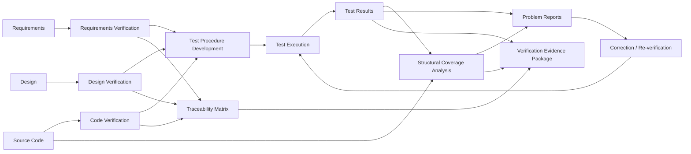

---

## 5.13 Production Workflow for Verification Teams

1. Review approved plans, standards, and baseline scope.
2. Qualify verification entry criteria: requirements maturity, design maturity, environment readiness.
3. Perform lifecycle data reviews before execution-heavy testing.
4. Build requirement-to-test trace before running regression.
5. Execute nominal, boundary, abnormal, and integration scenarios.
6. Run structural coverage and investigate gaps.
7. Raise problem reports with exact reproducibility and configuration references.
8. Re-verify fixes and regression impact.
9. Assemble closure package for QA, management, DER, or authority review.

---

## 5.14 Templates and Checklists

### Template: Verification Case Specification

```text
Verification Case ID:
Requirement(s):
Verification Method: Review / Analysis / Test
Environment:
Configuration / SCI Ref:
Preconditions:
Stimulus / Steps:
Expected Results:
Pass/Fail Criteria:
Evidence to Capture:
Independence Required?:
Reviewer / Verifier:
```

### Template: Coverage Gap Analysis

```text
Code Element:
Coverage Gap Type:
Related Requirement(s):
Related Test(s):
Reason for Gap:
Classification: Dead / Deactivated / Untested / Tool Issue / Other
Corrective Action:
Additional Verification Required:
Closure Evidence:
Approver:
```

### Verification Readiness Checklist

```text
[ ] Baseline identified and released
[ ] Requirements/design sufficiently mature
[ ] Test environment configuration recorded
[ ] Test procedures reviewed and approved
[ ] Traceability links available
[ ] Expected results objective and measurable
[ ] Independence staffing confirmed
[ ] Logging/measurement tools verified
[ ] Problem reporting path active
```

---

## 5.15 Common Mistakes

- Confusing test execution volume with verification completeness
- Skipping requirements reviews and relying on “test will catch it”
- Writing tests before clarifying ambiguous expected behavior
- Accepting pass/fail without exact baseline identification
- Treating coverage gaps as tool nuisances instead of engineering signals
- Allowing developer debug tests to substitute for formal evidence
- Verifying outputs but not timing, mode state, or annunciation side effects

## 5.16 Failure Scenarios

1. **Requirement ambiguity survives review** and creates inconsistent test or code interpretations.
2. **Integration test passes nominally** but fails under realistic bus timeout condition never injected.
3. **Coverage gap explained incorrectly as dead code**, but later found to be hidden fault-recovery path.
4. **Independent verification invalidated** because same developer authored expected results and approved final results.

## 5.17 Troubleshooting

| Symptom | Possible Causes | Actions |
|---|---|---|
| Test result difficult to reproduce | Uncontrolled environment, missing config reference, timing sensitivity | Record SCI, bench config, timestamps, stimulus files |
| Review findings repeat across artifacts | Poor standards, rushed reviews, insufficient training | Strengthen checklists and reviewer calibration |
| Coverage tool shows unexpected branch | Compiler optimization/object code difference | Investigate build settings and object/source relationship |
| Too many late problem reports | Entry criteria weak, requirements/design reviews insufficient | Shift verification left and tighten readiness gates |

---

## 5.18 Case Study

### Case Study: Formal Test Passed, Coverage Revealed Hidden Logic

**Scenario:** DAL B bus manager passed all planned interface tests. Statement and decision coverage then revealed an unexecuted branch in error recovery logic.  
**Investigation:** Branch triggered only when parity error coincided with timeout counter saturation. No requirement explicitly described combined-fault behavior.  
**Outcome:** Requirement set updated, design clarified, new robustness test added, code corrected, coverage closed.  
**Lesson:** Structural coverage is not a bureaucratic tail activity; it detects missing verification intent and sometimes missing requirements.

---

## 5.19 Interview Questions

### Beginner

- What are the main types of verification activity under DO-178C?
- Why are reviews important if we already test software?
- What is structural coverage?

### Intermediate

- How do you verify that a requirement is testable?
- What is the difference between developer testing and formal verification evidence?
- Why is traceability essential in verification?

### Senior

- Describe how you would verify a DAL B interface manager from requirements review through coverage closure.
- How do you decide whether a coverage gap indicates dead code, deactivated code, or a missing test?
- How would you demonstrate verification independence on a small team?

### Lead

- How would you recover a verification campaign where formal tests were executed before requirements baseline stability?
- What evidence package would you prepare for a DER reviewing unresolved problem reports near closure?
- How would you handle disagreement between developers and independent verification over expected fault-response behavior?

---

## 5.20 Exercises

1. Review a sample requirement and rewrite it to be objectively verifiable.
2. Build a verification case for stale-data timeout handling on ARINC 429 input.
3. Draft a coverage gap analysis for an unexecuted recovery branch.
4. Create an independence matrix for a DAL B project team.

## 5.21 Mini-Project

**Mini-Project:** Develop a verification package for a hypothetical DAL B Air Data input manager.

### Required Deliverables

- Requirements review checklist with findings
- Design verification notes
- Code review checklist
- Formal test procedure set
- Abnormal/robustness test matrix
- Traceability table
- Coverage gap analysis template populated with sample issue
- Problem report and retest record

### Success Criteria

- Requirements are unambiguous and testable
- Test suite covers nominal and abnormal behavior
- Evidence is configuration-controlled
- Coverage is analyzed, not merely reported
- Independence is documented

## 5.22 Assessment

**Assessment Prompts**

1. Explain how reviews, analyses, and testing complement each other in DO-178C verification.
2. Describe the evidence chain from requirement review to structural coverage closure.
3. Compare developer testing and independent verification from a certification-credit perspective.
4. Explain how you would prepare for an audit of a completed verification campaign.

---

# PART 1 WRAP-UP

Modules 1-5 establish the foundation expected of a Senior/Lead Avionics Software Verification & Integration Engineer:

- aircraft/system/software architecture awareness
- safety-critical engineering principles
- DO-178C lifecycle fluency
- DAL-driven rigor judgment
- verification evidence, independence, and audit readiness

A strong engineer at this level should be able to translate requirements and safety intent into a certifiable verification strategy, detect lifecycle weaknesses early, and defend objective evidence under technical and regulatory scrutiny.

---

# Suggested Next-Step Topics for Part 2

- Requirements engineering and derived requirements in avionics
- Low-level design, coding standards, and object code concerns
- Structural coverage in depth including MC/DC strategy
- Tool qualification and verification automation in DO-330 contexts
- Hardware/software integration, rigs, SIL/HIL, and environmental testing
- Problem reporting, change impact analysis, and certification audits/SOIs
