# Avionics Software Verification & Integration Study Material — Part 2

**Audience:** Senior / Lead Avionics Software Verification Engineers, Integration Engineers, Certification Engineers, and Test Leads  
**Domain:** Safety-critical airborne software under **DO-178C** with realistic application to flight controls, display systems, mission computers, I/O concentrators, engine control support software, and federated/integrated modular avionics environments.

---

## Table of Contents

- [Module 6 — Requirements-Based Testing](#module-6--requirements-based-testing)
- [Module 7 — Software Test Strategy and Test Plan](#module-7--software-test-strategy-and-test-plan)
- [Module 8 — Software Integration](#module-8--software-integration)
- [Module 9 — HSIT (Hardware Software Integration Test)](#module-9--hsit-hardware-software-integration-test)
- [Module 10 — SWIT / Simulation / Test Benches](#module-10--swit--simulation--test-benches)

---

# Module 6 — Requirements-Based Testing

## 6.1 Learning Objectives

By the end of this module, the learner should be able to:

1. Derive production-grade avionics test objectives from high-level and low-level requirements.
2. Distinguish functional, interface, timing, performance, and safety requirements from a verification standpoint.
3. Design requirements-based tests for normal, abnormal, boundary, invalid, out-of-range, corrupted, and failure-mode conditions.
4. Build auditable traceability from requirement to evidence.
5. Produce reviewable test cases, procedures, expected results, execution records, and anomaly reports suitable for certification evidence.
6. Explain how requirements-based testing supports DO-178C verification objectives and complements structural coverage.

## 6.2 Prerequisites

- Familiarity with airborne system and software development lifecycle.
- Understanding of HLR/LLR decomposition.
- Basic knowledge of DO-178C terminology: software level, verification independence, configuration index, problem report, baseline.
- Exposure to avionics interfaces such as ARINC 429, AFDX/ARINC 664, CAN, discrete I/O, analog I/O, sensor buses.

## 6.3 Why Requirements-Based Testing Is Central in DO-178C

In avionics, testing is not performed to “see if software works” in a generic sense. It is performed to demonstrate that:

- the software satisfies its **defined requirements**,
- no unintended functionality escapes undetected,
- abnormal conditions are handled predictably,
- timing and interface assumptions are verified on the appropriate platform,
- evidence is objective, repeatable, reviewable, and configuration-controlled.

Requirements-based testing is critical because certification credit is not granted for exploratory or ad hoc tests alone. The verification argument must be traceable to approved requirements and to the software level assigned by the safety assessment.

## 6.4 Lifecycle Placement

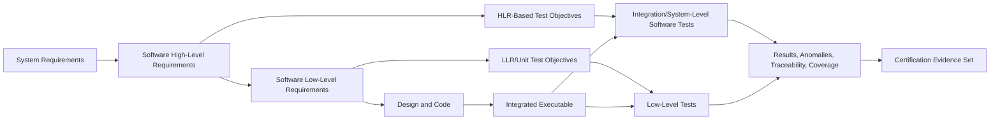

## 6.5 Core Concepts — Deep-Dive Reference

> Use this table as an interview and project reference. Each row answers **What / Why avionics requires it / Where in lifecycle / Which artifacts / How performed / Evidence / What can go wrong / Audit focus / DO-178C relation / Example / Interview question**.

| Concept | What | Why avionics requires it | Where in lifecycle | Key artifacts | How performed | Evidence produced | What can go wrong | Review / audit focus | DO-178C relation | Realistic example | Interview question |
|---|---|---|---|---|---|---|---|---|---|---|---|
| High-Level Requirements (HLR) testing | Verification that software behavior satisfies externally visible software requirements allocated from system requirements. | Aircraft functions must be shown to satisfy intended behavior at the operational level, especially safety-related functions and crew-visible behavior. | Primarily software integration and target-level verification after build is executable in representative environment. | System requirements, software requirements data, interface control documents, verification cases/procedures, test results. | Derive test objectives from each HLR, identify nominal/off-nominal scenarios, define environmental assumptions, stimulate software through external interfaces. | Test procedures, logs, pass/fail records, trace matrix, anomaly reports, environment configuration records. | HLR ambiguity, untestable wording, hidden design assumptions, missing failure responses, unverified mode logic. | Requirement clarity, bidirectional traceability, independence of review, evidence reproducibility, correct environment fidelity. | Supports software verification objectives by showing compliance of executable software to requirements and producing objective evidence. | Flight guidance mode annunciation shall switch from HDG to NAV within 200 ms after valid capture. | “Why should an HLR test avoid checking internal variables unless explicitly required?” |
| Low-Level Requirements (LLR) testing | Verification that detailed software requirements driving design/code logic are correct and implemented. | In Level A/B software, subtle low-level logic defects can create hazardous behavior long before system-level symptoms are obvious. | Unit/component verification before or during early integration. | LLR set, design description, source code, unit test procedures, stubs/drivers, code review records. | Derive logic-oriented tests including decision paths, data ranges, initialization, local interfaces, fault handling. | Unit test logs, harness output, review records, trace to code and LLR, anomaly reports. | LLR missing derived behavior, duplicated code assumptions, impossible-to-trigger branches, dead defensive logic. | Consistency among LLR, design, and code; verification independence; tool qualification if automation replaces manual steps. | Supports verification of software outputs at detailed level and helps justify later structural coverage analysis. | Numeric filter coefficient update logic for air-data smoothing function. | “How do LLR tests differ from structural coverage-driven retests?” |
| Functional requirements testing | Confirms required function or service is performed correctly for defined inputs and modes. | Aircraft software must deliver deterministic behavior for mode logic, control laws, fault management, and crew functions. | All levels, but strongest at component and integration levels. | Functional requirements, mode/state diagrams, procedures, expected-result sheets. | Use input/output-based procedures covering modes, transitions, resets, inhibition, and degraded operation. | Execution traces, mode transition logs, plots, screenshots, bus captures. | Only nominal path tested; degraded states omitted; mode preconditions misunderstood. | Mode completeness, transition coverage, abnormal states, reset/restart effects. | Requirements-based testing emphasis. | Autopilot lateral mode shall reject NAV capture if source invalid. | “How would you prove a mode transition requirement is fully verified?” |
| Interface requirements testing | Validates data format, endianess, range, timing, label mapping, validity bits, checksums, and protocol behavior at software interfaces. | Many avionics failures arise at partitions, LRUs, buses, sensors, and actuators rather than pure algorithms. | Integration, HSIT, system test. | ICDs, bus maps, data dictionaries, timing budgets, network configuration, bench scripts. | Inject valid and invalid interface traffic, verify parsing, timeout behavior, freshness checks, fault responses, startup sequencing. | Bus logs, captures, protocol analyzer records, target logs, discrepancy reports. | Label mismatch, scaling mismatch, stale-data acceptance, CRC not checked, timeout thresholds wrong. | Exact conformance to ICD and version control of interface baselines. | Supports verification of external coupling and correct software behavior in real integration context. | ARINC 429 label 203 airspeed with SSM fail state must be rejected and flagged invalid. | “What evidence do you expect for interface verification beyond a passing test summary?” |
| Timing requirements testing | Verifies response time, latency, throughput, periodicity, deadline compliance, startup time, and timeout behavior. | Airborne functions depend on bounded timing; late equals wrong for many control and display functions. | SIL/SWIT/HSIT/target integration, especially on representative hardware. | Timing budgets, scheduler design, WCET data, execution traces, time-stamped logs. | Instrument task activation/completion, generate load conditions, measure worst-case, test deadline miss handling. | Timing plots, trace captures, benchmark reports, overload test records. | Measuring in nonrepresentative environment, ignoring interference, false confidence from average values only. | Time source accuracy, synchronization, worst-case conditions, repeatability, margin to budget. | Required where temporal behavior is part of requirement; related to verification rigor and hardware-representative evidence. | FCC shall output elevator command within 20 ms of valid sensor frame arrival. | “Why is average latency evidence insufficient for avionics certification?” |
| Performance requirements testing | Verifies computational accuracy, resource margins, throughput, queue depth behavior, and sustained operation under load. | Functions must remain correct under operational worst case, not only bench-friendly steady-state conditions. | Integration and performance qualification activities. | Performance requirements, resource budgets, memory/CPU budgets, load profiles. | Drive worst-case input rates, verify numerical behavior, memory growth, CPU loading, data loss, backlog recovery. | Trend plots, memory/CPU reports, soak-test logs, profiler output, anomalies. | Load cases unrealistic, no sustained-duration tests, resource leak hidden by short runs. | Validity of load profiles, representativeness, threshold rationale, pass/fail margins. | Part of requirements verification when performance constraints are specified. | Maintenance bus flood shall not delay essential control-law processing beyond 5% CPU margin. | “How do you define a certification-relevant performance test profile?” |
| Safety requirements testing | Demonstrates software responses that mitigate or control hazards, including fault detection, annunciation, transition to safe state, and integrity checks. | Safety assessment allocates mitigation expectations to software; failure handling must be demonstrated, not assumed. | All levels, especially integration, HSIT, and system safety verification. | FHA/PSSA-derived requirements, fault management requirements, monitoring thresholds, safety case inputs. | Verify trigger conditions, monitor safe-state behavior, ensure no hazardous latent path, inject faults at realistic interfaces. | Fault-injection records, annunciation evidence, safe-state timing records, review findings, trace matrix. | Fault injection not representative, only single faults considered, independence missing on critical cases. | Hazard linkage, safe-state timing, latent fault handling, robustness of evidence. | Essential for showing compliance of safety-related software requirements allocated under system safety process. | Dual sensor disagree > threshold shall remove autopilot engagement authority and annunciate SENSOR MISCOMPARE. | “How would you verify a safety requirement that depends on both timing and data integrity?” |

## 6.6 Industry Terminology

| Term | Meaning in avionics verification context |
|---|---|
| Test Objective | Precise verification intent derived from one or more requirements. |
| Test Procedure | Ordered executable steps to realize the objective. |
| Test Case | Specific condition, inputs, preconditions, and expected results. |
| Expected Result | Objective outcome traceable to requirement, not engineer intuition. |
| Actual Result | What was observed in execution, with timestamp and evidence links. |
| Robustness Test | Test of invalid, unexpected, or adverse input behavior within defined assumptions. |
| Anomaly / Problem Report | Formal record of discrepancy in requirement, procedure, environment, or software. |
| Independence | Verification performed/reviewed by authorized personnel independent to the required level. |
| Test Readiness Review (TRR) | Formal check that environment, procedures, tools, and artifacts are ready. |
| Witnessed Test | Execution observed by QA, DER, certification rep, lead verifier, or customer authority. |

## 6.7 Requirements-to-Evidence Traceability Model

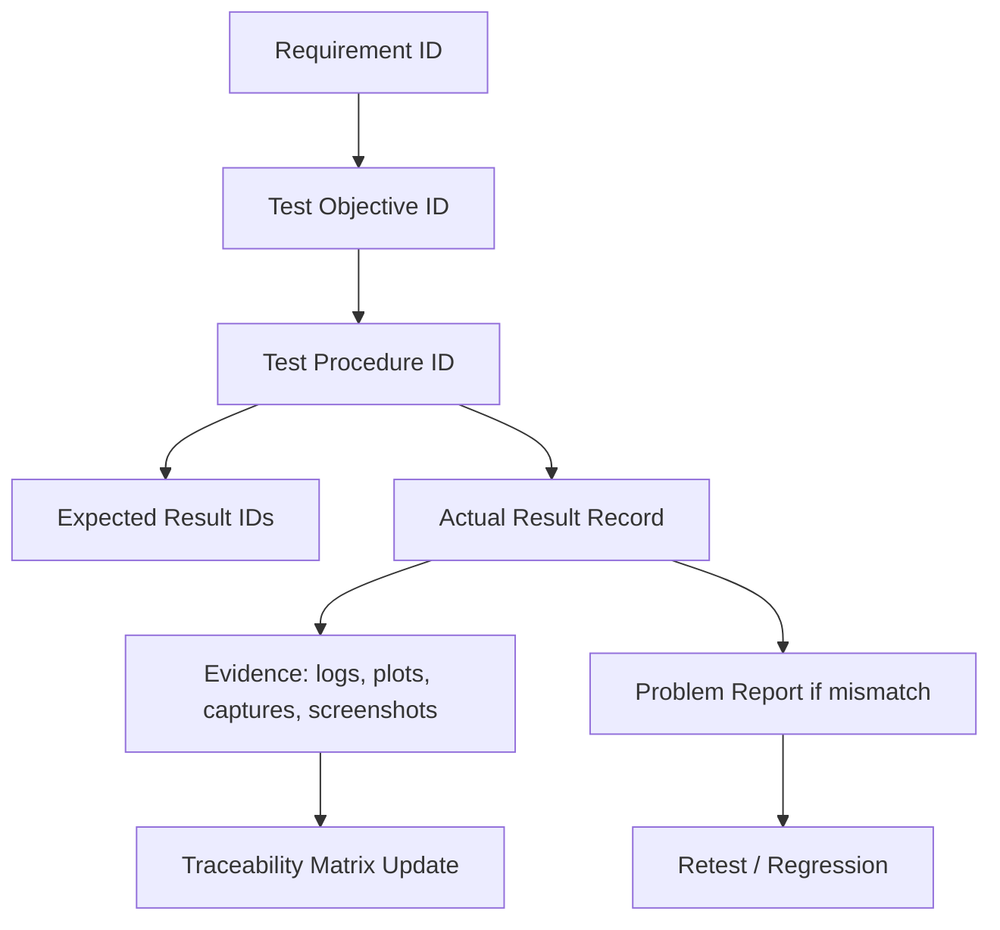

### Traceability Chain Template

| Requirement ID | Requirement Statement | Test Objective ID | Test Procedure ID | Expected Result ID | Actual Result Ref | Evidence Ref | Status |
|---|---|---|---|---|---|---|---|
| HLR-FCS-120 | FCC shall reject invalid airspeed input and flag ADR invalid within 100 ms. | TO-FCS-120-01 | TP-FCS-120-A | ER-FCS-120-A1 | TR-2026-0817-044 | LOG-429-122 / PLOT-88 | Pass |

## 6.8 Professional Test Case Template

```text
Test Case ID: TC-FCS-HLR-001
Title: Reject invalid ARINC 429 airspeed SSM state
Requirement(s): HLR-FCS-120, ICD-ADR-429-203
Software Build: fcc_app_3.14.7
Configuration Baseline: CB-2026-08-15-R2
Test Level: Software Integration / HSIT
Objective:
  Verify that invalid SSM for airspeed causes data rejection, ADR invalid status set,
  and no control-law use of stale or invalid value.
Preconditions:
  - FCC powered and in Normal Mode
  - Valid airspeed stream present for >=5 seconds
  - No active maintenance inhibit
  - Bench time synchronized to IRIG-B source
Stimulus:
  1. Transmit label 203 with valid data for stabilization
  2. Change SSM to Failure Warning for 3 consecutive frames
  3. Maintain all other parameters nominal
Expected Results:
  ER1: FCC stops using airspeed channel within 100 ms
  ER2: ADR_INVALID status bit set
  ER3: Event log contains fault code FCS_ADR_A_INVALID
  ER4: Control output remains bounded by fallback law requirements
  ER5: No reset, crash, or queue overflow observed
Observed Data / Evidence:
  - Bus capture file
  - Event log file
  - Telemetry trend plot
  - Video/screenshot if HMI indication is required
Pass/Fail Criteria:
  Pass only if all expected results satisfied with objective evidence.
Anomalies:
  Record any deviation via problem report; do not overwrite raw evidence.
Reviewer Sign-off:
  Test author / Independent reviewer / QA witness
```

## 6.9 Avionics Test Design Heuristics

### Coverage dimensions expected in mature projects

- **Requirement coverage:** every verifiable requirement mapped to one or more tests or analyses.
- **Condition coverage at requirement level:** nominal, boundary, invalid, degraded, reset/recovery, timing, interface, data integrity.
- **Operational coverage:** startup, mode transition, steady state, maintenance mode, shutdown, reconfiguration.
- **Fault coverage:** sensor fail, stale data, bus silence, checksum error, range exceedance, disagreement, actuator feedback loss.
- **Configuration coverage:** compile-time options, LRU variants, network tables, calibration sets, partition schedules.

## 6.10 Detailed Avionics Test Case Examples

> The following examples are intentionally realistic and written at a level expected in senior verification roles.

### Test Case 1 — Normal Operation: Valid Airspeed Processing

| Field | Content |
|---|---|
| ID | TC-FCS-001 |
| Requirement Type | Functional + Interface |
| Requirement | FCC shall compute filtered airspeed from valid ADR A input and publish to control law every major frame. |
| Why avionics cares | Control law stability depends on valid periodic data with correct freshness and scaling. |
| Lifecycle location | Software integration / HSIT |
| Artifacts | HLR, ICD, signal dictionary, procedure, bench config |
| Procedure summary | Inject nominal ARINC 429 airspeed from 120 to 180 kt ramp; verify filtered output and update rate. |
| Evidence | Bus captures, internal telemetry, timing plot |
| What can go wrong | Wrong label decode, wrong BNR scaling, stale data accepted, filter reset every frame. |
| Audit focus | Signal baseline version, expected-result derivation, calibrated tolerance. |
| DO-178C relation | Requirements-based verification of external functional behavior. |
| Example expected result | Output tracks input within ±2 kt after transient, update every 20 ms. |
| Interview question | “How do you derive tolerance for a filtered output requirement?” |

### Test Case 2 — Boundary Condition: Maximum Valid Airspeed

| Field | Content |
|---|---|
| ID | TC-FCS-002 |
| Requirement Type | Boundary / Performance |
| Requirement | FCC shall accept airspeed values from 30 to 450 kt inclusive. |
| Why avionics cares | Edge-of-envelope behavior must not saturate unexpectedly or wrap numerically. |
| Procedure summary | Inject 449.9 kt, 450.0 kt, 450.1 kt with valid status. |
| Expected result | 449.9 and 450.0 accepted; 450.1 rejected or faulted per requirement. |
| Evidence | Input/output log, fault status bits, event history |
| Failure risk | Off-by-one, float conversion, rounding causing unsafe acceptance or rejection. |
| Interview question | “What boundary values would you add beyond the stated min/max?” |

### Test Case 3 — Invalid Input: Illegal Mode Command

| Field | Content |
|---|---|
| ID | TC-FMS-003 |
| Requirement Type | Interface + Robustness |
| Requirement | Software shall reject undefined autopilot mode command values from the maintenance bus. |
| Why avionics cares | Invalid enumerations can trigger unintended functions if not bounded. |
| Procedure summary | Send command values 0x07 and 0xFF where only 0x00-0x04 are valid. |
| Expected result | Request rejected, command ignored, maintenance log entry created, no active mode change. |
| Evidence | Command trace, status word, event log |
| What can go wrong | Default case falls through to active mode, latent debug path enabled. |
| Interview question | “What is the difference between invalid input and out-of-range input in test design?” |

### Test Case 4 — Out-of-Range Input: Sensor Angle Beyond Physical Limit

| Field | Content |
|---|---|
| ID | TC-ADC-004 |
| Requirement Type | Safety + Data validation |
| Requirement | AOA values outside -10 to +35 deg shall be declared invalid. |
| Why avionics cares | Impossible values can destabilize protection functions or trigger false stall logic. |
| Procedure summary | Inject -15 deg, +40 deg, and alternating nominal/out-of-range sequence. |
| Expected result | Invalid flagged within defined detection window; last good use must follow requirement, not assumption. |
| Evidence | Trend plot, status transitions, detection latency measurement |
| Failure scenario | Wraparound to unsigned integer creates apparently valid positive angle. |
| Interview question | “Would you keep last-good-value or force no-data? What decides?” |

### Test Case 5 — Failure Mode: Sensor Timeout

| Field | Content |
|---|---|
| ID | TC-FCS-005 |
| Requirement Type | Timing + Safety |
| Requirement | Loss of ADR update for >80 ms shall trigger ADR timeout and reversionary control law. |
| Why avionics cares | Silent interfaces are common and can be more dangerous than explicit invalid flags. |
| Procedure summary | Provide nominal data, then stop transmission for 100 ms and 500 ms cases. |
| Expected result | Timeout set after threshold, fallback law active, appropriate fault code issued, no oscillatory toggling. |
| Evidence | Bus silence capture, state machine log, timing stamps |
| What can go wrong | Timeout based on task count not synchronized to actual frame arrival; mode chatter near threshold. |
| Interview question | “How do you verify timeout deterministically on a jittery bench?” |

### Test Case 6 — Timing Violation: Late Command Output

| Field | Content |
|---|---|
| ID | TC-FCS-006 |
| Requirement Type | Timing |
| Requirement | Elevator command shall be published within 20 ms of completing sensor validity set. |
| Why avionics cares | Late control output can be operationally equivalent to lost control authority. |
| Procedure summary | Apply high CPU load and worst-case sensor burst while measuring end-to-end latency over 10,000 frames. |
| Expected result | Worst-case latency <=20 ms with margin; no deadline miss counter increment. |
| Evidence | Execution trace, scheduler log, latency histogram |
| Failure risk | Bench instrumentation alters timing; only mean latency reported. |
| Interview question | “Why is percentile reporting not enough for hard timing requirements?” |

### Test Case 7 — Data Corruption: CRC / Checksum Failure

| Field | Content |
|---|---|
| ID | TC-COMM-007 |
| Requirement Type | Interface + Safety |
| Requirement | Corrupted AFDX payloads shall be discarded and counted. |
| Why avionics cares | Data integrity must be enforced before safety-critical consumption. |
| Procedure summary | Inject frames with valid sequence number but bad frame CRC/application checksum. |
| Expected result | Frame discarded, integrity counter incremented, no downstream state update. |
| Evidence | Network capture, application log, counter readback |
| What can go wrong | Lower layer validates transport CRC but application payload not checked. |
| Interview question | “What is the difference between transport integrity and application data validity?” |

### Test Case 8 — Communication Failure: Label Mapping Mismatch

| Field | Content |
|---|---|
| ID | TC-IO-008 |
| Requirement Type | Interface |
| Requirement | FCC shall reject unexpected ARINC 429 source label mapping per ICD. |
| Why avionics cares | Wrong source can be valid-looking but semantically unsafe. |
| Procedure summary | Send altitude label on expected airspeed channel pin/source combination. |
| Expected result | Data not accepted as airspeed; interface fault recorded. |
| Evidence | Wiring/config record, bus capture, parser status |
| Failure risk | Acceptance based only on label, not source or channel mapping. |
| Interview question | “How do you prove a bench wiring mistake is not a software defect?” |

### Test Case 9 — Sensor Failure: Stuck-at Value

| Field | Content |
|---|---|
| ID | TC-SNS-009 |
| Requirement Type | Safety / Monitoring |
| Requirement | Sensor monitor shall detect airspeed stuck-at condition if value remains constant beyond monitor threshold while aircraft acceleration estimate is nonzero. |
| Why avionics cares | Frozen sensors can look valid and defeat naive validity checking. |
| Procedure summary | Freeze airspeed while changing inertial acceleration profile; observe monitor behavior. |
| Expected result | Miscompare/stuck fault asserted according to monitor logic; law transitions per requirement. |
| Evidence | Correlated sensor plots, monitor state, event log |
| Failure risk | Monitor disabled in one mode, threshold derived from unrealistic dynamics. |
| Interview question | “Why are stuck-at tests often more valuable than simple timeout tests?” |

### Test Case 10 — Failure Recovery: Power-Up BIT Failure and Reset

| Field | Content |
|---|---|
| ID | TC-BIT-010 |
| Requirement Type | Safety + Startup |
| Requirement | If RAM BIT fails at startup, partition shall inhibit operational mode and expose maintenance status. |
| Why avionics cares | Unsafe initialization must be contained before flight-critical operation begins. |
| Procedure summary | Inject RAM BIT fail signature during startup; then clear and reboot. |
| Expected result | Operational functions inhibited on failure; clean recovery on subsequent healthy restart; no partial mode entry. |
| Evidence | Startup log, status words, reset history, maintenance page capture |
| Failure risk | Fault latched incorrectly across reboot; operational outputs briefly enabled before inhibit. |
| Interview question | “What makes startup requirements tricky to verify compared with steady-state ones?” |

## 6.11 Additional Scenario Library

| Scenario category | Example avionics test objective |
|---|---|
| Normal operation | Verify valid dual-ADR voting produces selected airspeed source according to priority logic. |
| Boundary condition | Verify queue depth behavior at exactly maximum configured message burst. |
| Invalid input | Verify undefined discrete combination does not trigger maintenance mode entry. |
| Out-of-range input | Verify flap position feedback > physical max is rejected and annunced. |
| Failure mode | Verify partition restart counter increments and inhibits after repeated crash threshold. |
| Timing violation | Verify overrun monitor logs execution deadline miss and drops nonessential task. |
| Data corruption | Verify sequence gap plus checksum fail does not corrupt state estimator. |
| Communication failure | Verify loss of AFDX virtual link transitions to NO COMM within requirement time. |
| Sensor failure | Verify dual-resolver disagreement causes degraded mode, not total shutdown. |
| Recovery / reset | Verify recovery from transient bus restore does not require full aircraft power cycle unless specified. |

## 6.12 Practical Example — Requirement Decomposition to Test

### Requirement Set

- **HLR-FCS-120:** FCC shall reject invalid airspeed input and flag ADR invalid within 100 ms.
- **LLR-FCS-120A:** Invalid airspeed is declared when SSM indicates failure, freshness exceeds 80 ms, or decoded value lies outside 30..450 kt.
- **LLR-FCS-120B:** Upon invalid airspeed, ADR invalid discrete shall set and control law shall use fallback schedule.

### Derived Test Objectives

| Test Objective ID | Objective |
|---|---|
| TO-120-01 | Verify rejection of SSM invalid condition. |
| TO-120-02 | Verify rejection of stale airspeed after freshness timeout. |
| TO-120-03 | Verify rejection of out-of-range value. |
| TO-120-04 | Verify ADR invalid status and fallback law activation. |
| TO-120-05 | Verify no use of stale data after invalid declaration. |

### Procedure Flow

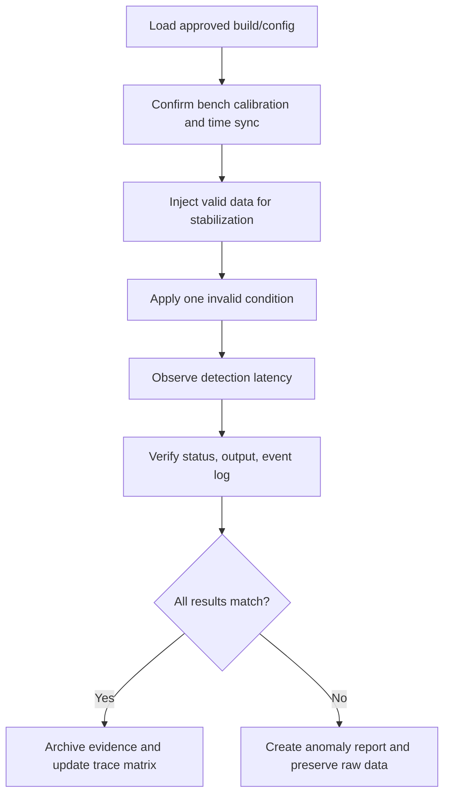

## 6.13 Review and Audit Expectations

### What reviewers look for

1. Requirement wording is verifiable and unambiguous.
2. Test objectives fully cover requirement intent including failure behavior.
3. Expected results are objective, quantitative, and requirement-derived.
4. Test environment limitations are known and do not invalidate evidence.
5. Traceability is complete and maintained after anomalies and retests.
6. Independence is satisfied where required.
7. Regression impact is documented when requirement, code, or environment changes.

### Audit questions typically asked by QA / DER / certification authority

- Which exact requirement version was verified?
- How do you know the bench timing accuracy was sufficient?
- Why is this robustness case considered representative?
- If this test failed once and later passed, what changed and where is the approval?
- Is there any requirement without verification credit or any test without trace to a requirement?
- What ensures the script or tool generating pass/fail is trustworthy?

## 6.14 Required Artifacts

| Artifact | Purpose |
|---|---|
| Software Requirements Data | Source of verification intent. |
| Test Cases / Procedures | Executable verification definition. |
| Test Environment Specification | Defines hardware, software, tools, versions, bench topology. |
| Test Readiness Review Record | Confirms execution readiness. |
| Test Results Report | Summarizes objective evidence and anomalies. |
| Raw Evidence Package | Logs, captures, plots, screenshots, command history, timestamps. |
| Traceability Matrix | Maps requirements to objectives, procedures, results, anomalies. |
| Problem Reports | Controlled record of unexpected results. |
| Regression Record | Shows re-execution after fixes or changes. |

## 6.15 Templates

### Test Procedure Header Template

| Section | Expected content |
|---|---|
| Purpose | Requirement-derived objective in one paragraph. |
| References | Requirement IDs, ICD, build number, environment spec, tool versions. |
| Preconditions | Bench state, software state, external equipment state, data initialization. |
| Limitations | Any known bench fidelity limits or assumptions. |
| Steps | Numbered and reproducible. |
| Expected Results | Step-specific and measurable. |
| Data Collection | Which logs/captures/plots/screenshots must be saved. |
| Pass/Fail Rule | Criteria requiring all expected results or allowable tolerances. |
| Anomaly Handling | Stop/continue conditions, PR creation, witness notification. |

### Test Result Record Template

| Field | Example |
|---|---|
| Test Run ID | TR-HSIT-2026-0817-17 |
| Date / Time | 2026-08-17 14:22 UTC |
| Operator | V. Engineer |
| Independent Witness | QA-12 |
| Build / Config | fcc_3.14.7 / cfg_7B |
| Environment | HSIT Bench B3 |
| Status | Pass / Fail / Blocked |
| Actual Results Summary | ADR invalid asserted at +68 ms; fallback law active at next frame. |
| Evidence Links | CAP-429-998, LOG-5412, PLOT-991 |
| Problem Report | PR-2481 |

## 6.16 Checklists

### Requirements-Based Test Design Checklist

- [ ] Requirement uniquely identified and baselined.
- [ ] Requirement wording reviewed for ambiguity.
- [ ] Nominal path covered.
- [ ] Boundary values covered.
- [ ] Invalid and out-of-range conditions covered.
- [ ] Timing aspects covered if applicable.
- [ ] Safety reactions covered if applicable.
- [ ] Interface assumptions explicitly tested.
- [ ] Expected results measurable and objective.
- [ ] Evidence collection defined before execution.
- [ ] Traceability matrix updated.
- [ ] Independent review complete.

### Test Execution Checklist

- [ ] Correct build, config, and calibration loaded.
- [ ] Bench time synchronized.
- [ ] Data recording started before stimulus.
- [ ] Procedure revision matches approved baseline.
- [ ] Any deviations approved and recorded.
- [ ] Raw evidence archived read-only after run.
- [ ] Anomalies documented without data loss.

## 6.17 Common Mistakes

1. Treating requirement testing like generic black-box QA without safety context.
2. Writing test steps that depend on engineer interpretation rather than objective limits.
3. Verifying interface decoding only with valid frames.
4. Ignoring startup, reconfiguration, and degraded modes.
5. Using nonrepresentative timing platforms for timing claims.
6. Confusing robustness tests with requirements-based tests when no requirement rationale exists.
7. Failing to preserve raw data for failed runs.
8. Updating expected results after execution to match behavior.

## 6.18 Failure Scenarios

| Failure scenario | Likely root cause | Detection path | Corrective action |
|---|---|---|---|
| Test passed in SIL but fails on target for timeout | Scheduler jitter or I/O latency not modeled | HSIT timing traces | Re-budget timeout, verify execution path, update simulation assumptions |
| Invalid sensor value accepted as valid | Range check missing or scaling mismatch | Boundary/out-of-range test | Fix decode logic, add regression suite, assess safety impact |
| Requirement cannot be tested objectively | Requirement ambiguous or incomplete | Review before execution | Raise requirement issue; do not force subjective pass/fail |
| Repeated intermittent failure with no software logs | Test bench sync issue or hardware line noise | Bench diagnostics + independent capture | Stabilize bench instrumentation, isolate channel, repeat witnessed test |

## 6.19 Case Study — Flight Control ADR Invalid Handling

### Situation
During integrated FCC verification, a requirement states that invalid ADR input shall trigger fallback law within 100 ms. SIL results showed 45 ms detection. HSIT occasionally showed 130–150 ms.

### Investigation

- Checked software change history: no algorithm difference.
- Reviewed ICD and source timing: ADR frames arrive at 40 ms period with jitter.
- Bench timestamps were generated on injection PC, not target-synchronized clock.
- Further measurement using IRIG-B synchronized timestamps showed actual software response of 72 ms; previous 130–150 ms was bench measurement skew.

### Lessons

- Evidence quality matters as much as software behavior.
- Timing verification in avionics is inseparable from time-source credibility.
- Reviewers will challenge measurement chain, not only the software result.

## 6.20 Exercises

1. Derive five test objectives from a requirement: “On dual-ADR disagree greater than 12 kt for 500 ms, FCC shall annunciate AIR DATA MISCOMPARE and inhibit autopilot engagement.”
2. Write boundary tests for a range-limited radio altitude requirement.
3. Identify missing negative tests in a nominal-only ARINC 429 procedure.
4. Create traceability chain from requirement to evidence for a timeout requirement.

## 6.21 Mini-Project

**Project:** Build a verification package for an air-data validation module.

### Deliverables

- 8 HLR-derived test objectives
- 12 detailed test cases
- Traceability matrix
- Test procedure template populated for 3 cases
- Execution evidence checklist
- Review checklist
- Short anomaly report for one failed case

### Expected senior-level outcome

A package that could survive internal QA audit and a DER-style walkthrough without requiring verbal clarification to understand intent, method, or evidence.

## 6.22 Assessment

### Beginner
1. What is the difference between HLR and LLR testing?
2. Why must expected results be requirement-derived?
3. What evidence is typically required for interface tests?

### Intermediate
4. How do you design a timing test for a 20 ms deadline?
5. How would you verify a stale-data monitor?
6. What traceability elements are mandatory in a mature verification package?

### Senior / Lead
7. How would you defend a robustness test set during certification audit?
8. When should a failed test result in requirement change versus code change versus bench change?
9. How do you ensure requirements-based testing and structural coverage complement rather than duplicate each other?

---

# Module 7 — Software Test Strategy and Test Plan

## 7.1 Learning Objectives

1. Create a production-grade **Software Verification Strategy** and **Software Verification/Test Plan** for airborne software.
2. Define scope, objectives, levels, methods, environments, independence, coverage strategy, and evidence expectations.
3. Tailor plan content for a realistic flight control software component.
4. Explain how planning artifacts drive executable verification and certification readiness.

## 7.2 Prerequisites

- Understanding of software lifecycle planning under DO-178C.
- Familiarity with software levels and independence needs.
- Exposure to verification methods: review, analysis, test, coverage, tool assessment.

## 7.3 Strategy vs Plan

| Item | Software Verification Strategy | Software Verification/Test Plan |
|---|---|---|
| Purpose | Explains overall verification philosophy, approach, rigor, and allocation of methods. | Defines concrete execution framework, resources, responsibilities, criteria, and deliverables. |
| Tone | Directional and policy-level. | Operational and project-specific. |
| Audience | Program leadership, certification interface, verification leads. | Verification team, QA, CM, developers, auditors, certification stakeholders. |
| Typical contents | Verification objectives, independence approach, level mapping, method selection, evidence model. | Detailed test levels, environments, tools, procedures, schedules, entry/exit, pass/fail, reporting, anomalies. |

## 7.4 Lifecycle Role


## 7.5 Core Planning Concepts — Deep-Dive Reference

| Concept | What | Why avionics requires it | Where used | Artifacts | How performed | Evidence produced | What can go wrong | Review / audit focus | DO-178C relation | Realistic example | Interview question |
|---|---|---|---|---|---|---|---|---|---|---|---|
| Verification Strategy | Top-level verification philosophy defining methods, depth, independence, and evidence approach. | Safety-critical projects need a coherent rationale showing why the chosen verification mix is sufficient for the software level. | Early planning; refined as architecture and risks mature. | Strategy document, PSAC inputs, safety data, lifecycle standards. | Identify product risks, software levels, verification methods, environment fidelity needs, independence model. | Approved strategy baseline, review records. | Strategy vague, not level-specific, no linkage to safety drivers. | Is approach risk-based, consistent, and executable? | Planning objectives and verification process expectations. | Flight control strategy prioritizes target-level timing verification and independent review for DAL A logic. | “What belongs in strategy versus detailed plan?” |
| Scope | Defines software items, builds, functions, interfaces, modes, and excluded items. | Prevents silent gaps in critical functions or misunderstandings on what evidence the project is claiming. | Strategy and plan. | Scope section, item lists, configuration index. | Enumerate software components, target platforms, variants, excluded functions with rationale. | Controlled scope statement. | Unstated exclusions, mixed baselines, ignored variants. | Are exclusions justified and approved? | Ensures verification claims are bounded and auditable. | Flight control component excludes actuator hardware compliance testing but includes command interface verification. | “How do you handle optional feature variants in plan scope?” |
| Objectives | Specific outcomes the verification effort must demonstrate. | Evidence must be goal-driven, not activity-driven. | Strategy and plan. | Objectives section, requirement coverage map. | Define objectives for requirements satisfaction, interface correctness, timing, robustness, coverage, regression, anomaly closure. | Objective list tied to deliverables and metrics. | Generic objectives like “ensure quality” without measurable meaning. | Are objectives testable, observable, and linked to evidence? | Aligns with verification objectives of the standard. | Demonstrate all FCS HLRs satisfied on representative target environment. | “What makes a verification objective auditable?” |
| Verification Methods | Reviews, analyses, tests, traceability checks, coverage analysis, tool assessments. | Avionics relies on complementary methods; not every objective is best met by testing alone. | Throughout lifecycle. | Method matrix, standards, procedures. | Allocate best method per requirement type and lifecycle output. | Method justification matrix, review records, test evidence. | Over-reliance on test; missing analysis for infeasible cases. | Method suitability and independence. | Reflects required verification activities. | Use analysis for numeric precision bound, test for mode transition timing. | “When is analysis better than test?” |
| Environment | Definition of SIL/SWIT/HSIT/target benches, tools, lab infrastructure, clocks, instrumentation. | Evidence validity depends on environment fidelity and control. | Plan and execution. | Environment specs, bench topology, calibration records. | Define each environment, purpose, limitations, supported claims. | Approved environment descriptions and readiness records. | Target timing claimed from nonrepresentative SIL bench. | Environment suitability and limitations. | Verification evidence must be appropriate to objective. | HSIT Bench B3 with target FCC, ARINC cards, IRIG-B timebase. | “How do you justify using SIL evidence for some requirements but not timing ones?” |
| Test Levels | Unit, component, subsystem, software-hardware, system. | Clear level allocation avoids duplication and gaps. | Plan. | Level matrix, verification matrix. | Map each requirement category to the most effective level. | Level allocation matrix. | Same requirement partially tested at many levels with no closure rule. | Completeness and non-overlap. | Supports orderly verification process. | Range checks at unit level, bus timeout at HSIT, annunciation at system level. | “How do you split verification across levels for one safety requirement?” |
| Tools | Tools used for scripting, logging, analysis, coverage, requirements management, traceability. | Tool outputs may influence certification credit and may require qualification depending on use. | Plan, execution, evidence review. | Tool list, tool operational requirements, qualification data if needed. | Identify tool purpose, failure impact, operational constraints, version control. | Tool inventory, qualification rationale, tool records. | Blind trust in automation, unversioned scripts, unqualified pass/fail logic. | Tool control, role in objective evidence, qualification decision. | Section 11 tool considerations. | Python parser generates pass/fail latency verdict from raw trace. | “When does a test script tool need qualification?” |
| Test Data | Stimulus files, parameter sets, network configs, fault patterns, expected-result datasets. | Controlled data is essential to reproducibility and variant management. | Plan and execution. | Data library, baseline record, checksum records. | Define sources, ownership, approval, storage, change control. | Data baseline and run-specific references. | Uncontrolled edited data files invalidate evidence. | Data provenance and consistency. | Part of configuration-controlled verification environment. | Airspeed stimulus profile set ADS-VAL-04 Rev C. | “Why should test data be configuration controlled?” |
| Responsibilities | Ownership for authoring, reviewing, executing, witnessing, anomaly disposition, CM, QA, certification interface. | Independence and accountability are certification-critical. | Strategy and plan. | RACI matrix, org chart, role descriptions. | Assign by activity and authority boundaries. | Approved responsibility matrix. | Developer executes and approves critical tests without independence. | Independence, segregation of duties, approval authority. | Verification independence expectations. | Verification lead owns strategy; independent tester executes DAL A target tests. | “How do you document independence in a lean team?” |
| Entry / Exit Criteria | Conditions for starting and completing verification phases. | Prevents invalid evidence from immature software or broken benches. | Plan and phase gates. | Criteria sections, readiness checklists. | Define baseline maturity, defect thresholds, environment readiness, document approvals. | TRR/closure records, phase completion records. | Testing starts before requirements baseline stable. | Rigor of gates and waiver control. | Supports orderly, controlled verification process. | HSIT entry requires approved build, bench calibration current, all procedures reviewed. | “What is a good exit criterion for a regression cycle?” |
| Pass / Fail Criteria | Objective acceptance rules for each test and campaign. | Safety projects cannot rely on subjective engineer judgement. | Plan, procedures, reports. | Criteria definitions, tolerances, threshold sheets. | Specify all-or-nothing or threshold-based rules with anomaly handling. | Verdict records and disposition logs. | Hidden informal exceptions; changing tolerances after execution. | Objectivity and stability of criteria. | Requirements-based evidence integrity. | “Pass if all timing samples <=20 ms and no missed frame flag set.” | “How do you handle a test that mostly passes but one data point is out?” |
| Defect Handling | Formal anomaly/problem report lifecycle. | Certification requires controlled discrepancy management with impact assessment and closure evidence. | Execution and regression. | PR process, anomaly log, causal analysis. | Create PRs, classify severity, trace impact, verify fix, close with evidence. | Problem reports, retest evidence, impact assessments. | Failing tests informally ignored; duplicate PRs obscure true status. | Closure quality and trace to retest. | Verification anomaly control expectation. | Interface timeout defect linked to ICD mismatch and corrected in config + code. | “What must be in a good avionics problem report?” |
| Configuration Control | Control of requirements, code, scripts, benches, data, tool versions, results. | Evidence is only meaningful if exact configuration is reproducible years later. | Whole lifecycle. | CI, SCM, build records, bench config lists. | Baseline every item contributing to result. | Configuration index, hashes, change records. | Test rerun on different build with same report ID. | Reproducibility and baselining discipline. | Integral to all certified data control. | Result references build SHA, linker map, config CRC, script version. | “What configuration items are often forgotten in verification?” |
| Regression Strategy | Defines when and how to rerun verification after change or anomaly fix. | Small changes can have large safety effects; regression scope must be justified. | Execution and maintenance. | Regression matrix, impact analysis, rerun records. | Use requirement/code/interface impact analysis to select regression. | Regression justification and results. | Regression too narrow, timing regressions skipped after unrelated scheduler change. | Impact rationale and closure completeness. | Supports continued validity of evidence. | Re-run timeout, load, and mode-transition suites after scheduler modification. | “How do you scope regression for a compiler update?” |
| Coverage Strategy | Plan for requirement coverage, interface coverage, robustness coverage, and structural coverage coordination. | Higher assurance levels require systematic evidence that verification is complete. | Strategy and plan. | Coverage matrix, analysis approach, tool plan. | Define coverage dimensions, measurement methods, closure rules, relation to test levels. | Coverage reports and closure records. | Coverage treated only as code metric; missing requirement closure. | Completeness, gaps, justification of unexecuted items. | Verification completeness expectations. | Requirements tested at integration, structural coverage closed at unit/integration with analysis. | “How do you avoid writing tests only to hit code coverage?” |
| Metrics | Quantitative view of verification progress and quality. | Programs need early warning on verification health, instability, and certification risk. | Project monitoring. | Metrics dashboard, weekly reports. | Track requirement coverage, test execution status, anomaly aging, pass rate, rerun rate, bench availability. | Trend reports, management reviews. | Vanity metrics obscure real closure risk. | Metric meaning and decision usefulness. | Planning/management support to verification objectives. | 98% test execution complete but 12 open high-severity anomalies blocks release. | “Which metrics matter most late in certification?” |
| Certification Evidence | Final organized package supporting compliance argument. | Auditors and authorities assess objective evidence, not team confidence. | End of project and stage gates. | Summary reports, trace matrices, PR closures, environment specs, tool records. | Define evidence tree early so execution artifacts are certification-ready by default. | Evidence index, verification summary, archives. | Missing raw evidence, broken links, inconsistent versions. | Completeness, accessibility, trace consistency. | Central outcome of the verification process. | Flight control evidence package with verified requirements, traces, anomalies, coverage, tool rationale. | “How would you structure evidence for a DER walkthrough?” |

## 7.6 Example — Verification Strategy for Flight Control Software Component

### Component Context

**Software Item:** Flight Control Computer (FCC) lateral/longitudinal command function  
**Criticality Context:** Safety-critical flight control mode management and control output generation  
**Representative Concerns:** deterministic timing, mode transition integrity, sensor validity handling, actuator command limits, robust fault management.

### Example Strategy Statement

1. **Verification philosophy:** Use layered verification combining LLR reviews and unit tests, HLR integration tests, target-level timing verification, HSIT for interface and I/O behavior, and system-level confirmation for aircraft-level interactions.
2. **Independence:** DAL A/B critical tests to be reviewed and executed with required independence; pass/fail criteria independently reviewed before execution.
3. **Environment hierarchy:** SIL for algorithm and early regression, SWIT for integrated executable with simulated I/O, HSIT for target timing and real bus behavior, system rig/iron-bird for cross-LRU interactions.
4. **Safety focus:** Explicit fault injection campaign for invalid/stale/corrupted sensor data and command-path interface faults.
5. **Coverage approach:** Trace every HLR to integration/HSIT/system evidence; use structural coverage as completeness analysis, not as requirement substitute.
6. **Evidence approach:** Every executed test produces run identifier, baseline, raw logs, timestamps, anomaly links, and traceability update.

## 7.7 Example — Software Verification/Test Plan Outline

### 1. Scope

- FCC application software build `fcc_app_*`
- Boot/startup support logic relevant to operational readiness
- ARINC 429 sensor interfaces, AFDX maintenance interface, discrete actuator enable outputs
- Excludes actuator hardware qualification and aircraft-level handling qualities assessment

### 2. Objectives

- Verify satisfaction of all allocated software requirements
- Verify correct handling of invalid, stale, and disagreeing sensor data
- Verify timing and deadline compliance on representative target hardware
- Verify interface conformance to approved ICD versions
- Provide auditable certification evidence

### 3. Verification Methods Matrix

| Requirement class | Primary method | Secondary method |
|---|---|---|
| Algorithmic detailed logic | Review + unit/component test | Structural coverage analysis |
| Mode transitions | Integration test | Review of state model |
| Interface formatting | HSIT | Static interface review |
| Timing | HSIT / target instrumentation | Load analysis |
| Safety fault response | HSIT + system test | Review against safety requirements |

### 4. Environment

| Environment | Purpose | Limitations |
|---|---|---|
| SIL | Early functional regression | Nonrepresentative timing and drivers |
| SWIT | Integrated software executable with simulated aircraft environment | Limited electrical realism |
| HSIT | Real target + real I/O hardware | Bench-only aircraft dynamics |
| System rig | Cross-LRU interaction | Lower observability than software-level benches |

### 5. Test Levels

- Component / LLR verification
- Software integration
- HSIT
- System support verification (for allocated software behaviors)

### 6. Tools

- Requirements management tool
- Traceability/reporting tool
- Bus stimulus and monitoring tool
- Script execution framework
- Time-synchronized data acquisition
- Coverage analysis tool

### 7. Data Management

- Controlled stimulus libraries
- Fault-injection profiles
- Expected-result data sets
- Bench configuration files
- Versioned ICD reference set

### 8. Responsibilities

| Role | Responsibilities |
|---|---|
| Verification Lead | Approves strategy, plan, priorities, and closure rationale |
| Test Engineer | Authors procedures, executes assigned tests, records evidence |
| Independent Reviewer | Reviews procedures/results for critical items |
| Configuration Manager | Baselines builds, scripts, data, and reports |
| QA | Audits process compliance and anomaly handling |

### 9. Entry Criteria

- Approved requirement baseline
- Approved build and release note
- Bench ready and calibration current
- Procedures reviewed and released
- Tool versions verified

### 10. Exit Criteria

- All planned tests executed or dispositioned
- Open anomalies within accepted threshold and approved
- Requirement coverage complete
- Raw evidence archived
- Summary report reviewed and approved

### 11. Pass/Fail Criteria

- Each test step passes only if all expected results are met within defined tolerances.
- Any deviation creates anomaly or approved test incident record.
- Re-runs do not overwrite failed evidence.

### 12. Defect Handling

- Formal PR creation within 1 business day for failed requirement verification.
- Impact assessment includes affected requirements, builds, environments, and previously passed tests.
- Closure requires corrective evidence and regression rationale.

### 13. Configuration Control

- Build ID, compiler version, linker map, target load file hash
- Script version, stimulus data checksum, bench config revision
- Test report revision and evidence archive path

### 14. Regression Strategy

- Triggered by software changes, tool changes affecting verdict logic, interface config changes, compiler changes, and requirement changes.
- Risk-based regression matrix maintained per software component.

### 15. Coverage Strategy

- HLR coverage closed at integration/HSIT/system as appropriate.
- LLR coverage closed at component/unit level.
- Structural coverage analyzed after requirements-based test execution.
- Robustness and fault-response coverage tracked separately.

### 16. Metrics

| Metric | Use |
|---|---|
| Requirement verification completion | Progress to closure |
| Test execution pass rate | Stability indication |
| Open anomaly aging | Program risk |
| Retest churn | Design or environment instability |
| Bench availability | Execution capacity risk |
| Coverage closure rate | Certification readiness |

### 17. Certification Evidence

- Verification plan and approved changes
- Procedure set and result records
- Trace matrices
- Environment specs and readiness records
- Tool and script configuration records
- Coverage reports
- Anomaly logs and closures
- Verification summary report

## 7.8 Process Flow

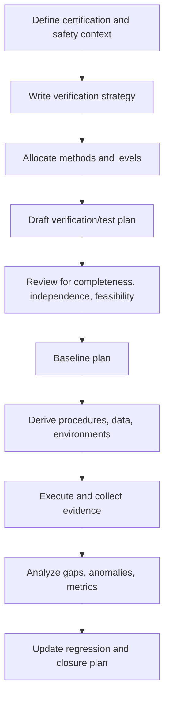

## 7.9 Industry Terminology

| Term | Meaning |
|---|---|
| Verification Strategy | High-level method and rigor definition. |
| VTP / SVP | Verification/Test Plan / Software Verification Plan; naming varies by organization. |
| TRR | Test Readiness Review. |
| Witness Matrix | Mapping of tests requiring independent witness or QA presence. |
| Evidence Tree | Structured organization of artifacts supporting compliance claims. |
| Impact Analysis | Assessment of verification impact caused by change or anomaly. |

## 7.10 Templates

### Verification Strategy Template

```text
1. Purpose and Scope
2. Software Item Description and Safety Context
3. Verification Objectives
4. Verification Principles
5. Verification Methods and Allocation
6. Independence Approach
7. Environment Strategy
8. Tool Usage and Qualification Approach
9. Coverage Strategy
10. Anomaly and Regression Strategy
11. Metrics and Reporting
12. Certification Evidence Model
13. Assumptions / Constraints / Risks
```

### Verification/Test Plan Template

```text
1. Document Control
2. Scope
3. Referenced Documents
4. Software Configuration Covered
5. Verification Objectives
6. Verification Levels and Methods
7. Test Environment(s)
8. Tools and Utilities
9. Test Data Management
10. Responsibilities and Independence
11. Entry Criteria
12. Exit Criteria
13. Pass / Fail Criteria
14. Anomaly Reporting and Resolution
15. Configuration Control
16. Regression Strategy
17. Coverage Strategy
18. Metrics and Reporting
19. Deliverables / Certification Evidence
20. Review and Approval Signatures
```

## 7.11 Checklists

### Strategy Review Checklist

- [ ] Verification approach aligns with software level and safety context.
- [ ] Methods selected are justified, not copied from previous program without rationale.
- [ ] Independence requirements defined.
- [ ] Environment fidelity boundaries explicitly stated.
- [ ] Coverage strategy includes requirements and structural coverage coordination.
- [ ] Tool role and qualification impact considered.
- [ ] Evidence structure defined early.

### Plan Review Checklist

- [ ] Scope includes all variants and exclusions with rationale.
- [ ] Entry/exit criteria are measurable.
- [ ] Pass/fail criteria are objective.
- [ ] Responsibilities avoid independence conflicts.
- [ ] Regression triggers are complete.
- [ ] Metrics are decision-useful.
- [ ] Certification evidence list is complete and configuration controlled.

## 7.12 Common Mistakes

1. Copy-pasting a generic test plan with no aircraft or software context.
2. Treating “test environment” as a tool list rather than a controlled evidence source.
3. Failing to distinguish target timing evidence from SIL evidence.
4. No explicit strategy for anomaly re-test and regression.
5. No tool qualification assessment for scripts that produce verdicts.
6. Too many metrics, none tied to release or certification risk.

## 7.13 Failure Scenarios

| Scenario | Planning deficiency | Consequence | Fix |
|---|---|---|---|
| Target timing failure found late | Plan assumed SIL timing sufficient | Major schedule slip | Add explicit target timing strategy and gating early |
| Audit finds untraceable test results | Evidence model not defined in plan | Rework and credibility loss | Build evidence tree and naming rules into plan |
| Critical tests executed by developers | Independence not planned | Potential noncompliance | Define role segregation and review authorization |
| Bench scripts changed mid-campaign | Configuration control weak | Results not reproducible | Baseline scripts and record hashes per run |

## 7.14 Case Study — Flight Control Verification Plan Rescue

A flight control team reused a plan from a display unit program. The reused plan had no HSIT timing strategy, weak sensor fault coverage, and no witness rules for critical tests. During internal audit, the team could not justify how control-law latency would be verified.

### Recovery Actions

- Rewrote strategy around safety-driven timing and interface risk.
- Added environment matrix showing claims each bench could support.
- Introduced mandatory HSIT timing and fault-injection campaign.
- Baseline-controlled all stimulus data and bus scripts.

### Result

The updated plan became executable, auditable, and significantly reduced late discovery risk.

## 7.15 Exercises

1. Write entry/exit criteria for an HSIT campaign.
2. Define a regression strategy after an RTOS patch.
3. Create a coverage strategy paragraph differentiating requirements and structural coverage.
4. Build a simple RACI matrix for verification independence.

## 7.16 Mini-Project

**Project:** Draft a Software Verification/Test Plan for a flight control mode manager.

### Include

- Scope and exclusions
- Method allocation matrix
- Environment matrix
- Independence model
- Entry/exit criteria
- Regression and anomaly handling
- Metrics dashboard proposal
- Certification evidence index

## 7.17 Assessment

### Beginner
1. What is the difference between a strategy and a plan?
2. Why are entry criteria important?
3. What belongs in pass/fail criteria?

### Intermediate
4. How do you define environment limitations in a plan?
5. What regression would you require for an ICD change?
6. How do tools affect certification planning?

### Senior / Lead
7. How would you tailor a verification strategy for DAL A flight controls versus DAL C maintenance software?
8. What plan content most often determines whether evidence is certification-ready or not?
9. How do you manage independence on a resource-constrained program?

---

# Module 8 — Software Integration

## 8.1 Learning Objectives

1. Explain unit, component, subsystem, software-hardware, and system integration in avionics context.
2. Select bottom-up, top-down, incremental, or continuous integration strategy for a safety-critical program.
3. Control the build pipeline from source to target evidence.
4. Diagnose integration defects such as interface mismatch, timing, initialization, memory, and configuration issues.
5. Produce integration evidence and debug narratives suitable for audits.

## 8.2 Prerequisites

- Understanding of software architecture and interfaces.
- Familiarity with executable generation and target load process.
- Exposure to lab benches, buses, startup sequencing, and logging.

## 8.3 Integration Levels

| Level | What | Why avionics requires it | Lifecycle placement | Key artifacts | How performed | Evidence | Risks / what can go wrong | Review / audit focus | DO-178C relation | Example | Interview question |
|---|---|---|---|---|---|---|---|---|---|---|---|
| Unit Integration | Combining code modules or functions inside a component/harness. | Catches interface and initialization issues before target cost increases. | Early development verification. | Source, stubs, unit harness, LLR tests. | Compile/link small sets, exercise local interfaces. | Harness logs, build logs, LLR traces. | Wrong assumptions hidden by stubs. | Interface assumptions and completeness. | Supports verification of low-level implementation. | Sensor decode module linked with monitor module. | “What defects escape unit integration but appear later?” |
| Component Integration | Combining related modules into a deployable software component. | Reveals dataflow, scheduling, and mode logic defects. | Before subsystem / full integration. | Component design, local ICDs, build scripts. | Build component executable with simulated drivers. | Component test reports, logs, interface traces. | Initialization order bugs, config mismatch. | Component boundary definition and evidence. | Verification of integrated software outputs. | Flight guidance mode manager with sensor abstraction layer. | “How do you know a component is ready for subsystem integration?” |
| Subsystem Integration | Combining multiple software components within an LRU or partition set. | Many avionics failures emerge at partition and service boundaries. | Mid/late integration. | Partition configs, IPC definitions, schedulers, ICDs. | Integrate communication paths, startup sequence, shared services, watchdog behavior. | Partition trace, CPU/memory reports, integration results. | Partition schedule clash, queue overflow, service startup race. | Realistic environment and configuration control. | Supports integrated behavior verification. | FCC application + health monitor + comm stack. | “What evidence shows a partition schedule issue?” |
| Software-Hardware Integration | Running software on target hardware with real processors, buses, memory, and I/O. | Timing, endianess, drivers, hardware errata, electrical behavior can invalidate bench-only assumptions. | HSIT / target integration. | Target load file, BSP, hardware config, calibration records. | Load executable, stimulate real I/O, verify startup, timing, interrupts, bus behavior. | Target logs, analyzer traces, oscilloscope captures, load record. | Driver timing issue, DMA bug, stack overflow, interrupt storm. | Hardware representativeness and reproducibility. | Critical for hardware-related verification claims. | FCC on target processor with real ARINC 429 cards. | “Why is software-hardware integration not just another test environment?” |
| System Integration | Combining software item with other LRUs and aircraft-level environment. | Aircraft behavior depends on cross-system interactions, not isolated correctness. | Late verification / system test. | System ICDs, bench topology, aircraft scenarios. | Execute end-to-end use cases, failures, reversion modes, startup/shutdown sequences. | Cross-LRU logs, system reports, observed annunciations. | Assumption mismatch between suppliers, timing chains, configuration drift. | End-to-end traceability and ownership boundaries. | Confirms allocated software behavior in system context. | FCC with air-data, autopilot panel, actuator electronics, displays. | “How do you separate system defect from local software defect?” |

## 8.4 Integration Strategies

| Strategy | Description | Strengths | Weaknesses | Best avionics use |
|---|---|---|---|---|
| Bottom-up | Start from lower-level modules/services and integrate upward. | Good for infrastructure stability, driver and service confidence. | Late visibility of full function behavior. | BSP, I/O services, utility libraries, health monitoring. |
| Top-down | Start from high-level control flow with stubs beneath. | Early functional demonstration. | Can hide low-level realism issues. | Early algorithm/mode validation with incomplete services. |
| Incremental | Add one interface/component at a time with frequent evidence capture. | Best defect isolation, strong audit trail. | Slower planning overhead. | Preferred for safety-critical LRUs. |
| Continuous Integration | Frequent automated build/test pipeline. | Fast feedback and integration discipline. | Can create false confidence if target/HSIT gaps ignored. | Daily build, static checks, SIL regression complementing formal target integration. |

## 8.5 Build Management Flow


### Build Control Expectations

| Step | Typical controls |
|---|---|
| Source | Versioned commit / baseline tag / approved change set |
| Build | Compiler version, options, warnings policy, environment reproducibility |
| Link | Linker script, memory map, symbol map, checksum |
| Executable | Binary hash, load manifest, release note |
| Load | Target ID, loader version, load verification result |
| Test | Procedure revision, data revision, bench config revision |
| Evidence | Run ID, timestamps, archive path, access control |

## 8.6 Integration Flow Example

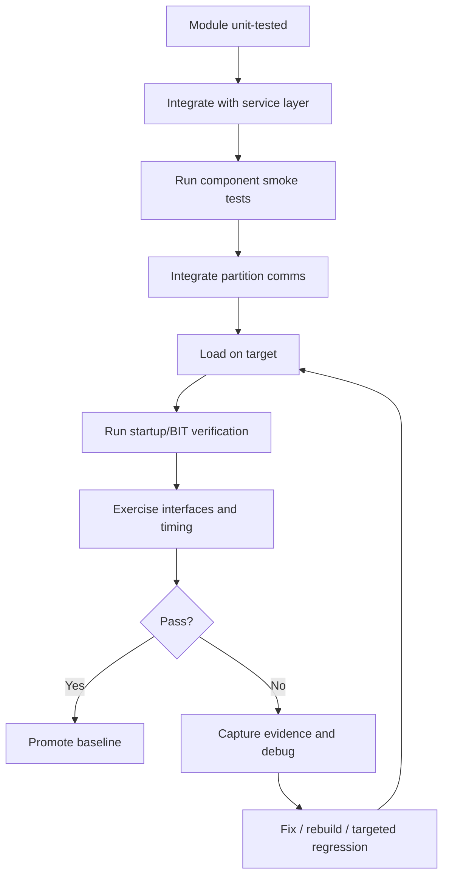

## 8.7 Integration Problem Catalogue

| Problem | Why serious in avionics | Symptoms | Detection / how performed | Evidence | Common root cause | Review / audit focus | DO-178C relevance | Realistic example | Interview question |
|---|---|---|---|---|---|---|---|---|---|
| Interface mismatch | Valid-looking data can drive wrong behavior. | No response, wrong value, unexpected fault. | Compare ICD vs bus traces vs parser behavior. | Captures, decode logs, ICD review. | Wrong label/map/version. | Baseline consistency. | Interface verification of integrated software. | Altitude label routed where airspeed expected. | “How would you isolate bench mapping error from parser defect?” |
| Data type mismatch | Scaling/sign errors can create silent hazards. | Saturated values, negative becomes large positive. | Inject boundary patterns and inspect decode. | Raw frame + interpreted value. | Signed/unsigned or float/int mismatch. | Type definitions and endianess control. | Requirements and interface correctness. | 16-bit signed angle parsed as unsigned. | “What boundary patterns expose signedness bugs fastest?” |
| Timing issue | Late data or outputs may break control loop safety. | Missed deadlines, watchdog trips, stale data flags. | Trace timestamps under load. | Time trace, CPU profile. | Scheduling or blocking I/O. | Worst-case evidence and margin. | Temporal requirement verification. | Command output slips under maintenance traffic burst. | “How do you reproduce intermittent timing failures?” |
| Initialization failure | Unsafe startup can enable wrong mode or invalid outputs. | Fault on boot, output not initialized, mode stuck. | Power-cycle tests, BIT observation, startup logs. | Boot trace, discrete captures. | Sequence dependency or uninitialized memory. | Startup requirements and reset handling. | Verification of initialization requirements. | Watchdog starts before comm task ready. | “Which startup transitions deserve explicit tests?” |
| Memory corruption | Can lead to latent, random, or catastrophic behavior. | Sporadic resets, wrong status, corrupted logs. | Instrument stack/heap guards, pattern checks, stress tests. | Memory dump, guard violations, crash log. | Buffer overrun, DMA overlap. | Memory maps and defensive design evidence. | Integrated software robustness. | AFDX receive buffer overwrites status table. | “What evidence would convince you corruption is fixed?” |
| Stack overflow | Often intermittent and load-dependent. | Resets, trap handlers, corrupted return paths. | High-load + instrumentation. | Stack watermark report, crash trace. | Deep recursion, large local buffers. | Worst-case task stack analysis. | Resource-related verification. | Fault logging task overflows during burst anomalies. | “Why can stack issues hide in nominal testing?” |
| Configuration mismatch | Right code with wrong tables behaves wrongly. | Wrong source selection, wrong timeout, wrong mode map. | Compare config CRC/version against plan. | Config dump, checksum records. | Old parameter file or wrong variant. | Config control rigor. | Evidence validity depends on exact config. | FCC code updated but old ICD mapping table loaded. | “How do you verify configuration as part of integration?” |
| Version mismatch | Supplier components may be individually correct but incompatible. | Build/link errors or runtime protocol faults. | Dependency check, compatibility matrix, runtime signature check. | Build logs, version manifest. | Mixed baseline promotion. | End-to-end baseline discipline. | Configuration and integration control. | Comm library v2 with app expecting v1 structure size. | “What belongs in an integration compatibility matrix?” |
| HW/SW incompatibility | Software assumptions may violate actual silicon or board behavior. | Driver hangs, interrupts missing, timing drift. | Bench instrumentation, hardware errata review, alternate board comparison. | Scope traces, BSP logs, errata references. | New PCB spin or CPU stepping. | Hardware revision tracking. | Hardware-representative verification claims. | New board revision changes ARINC interrupt polarity. | “How do you prove defect is HW/SW compatibility rather than pure software?” |

## 8.8 Realistic Debugging Scenarios

### Scenario A — Initialization Race on Flight Control Startup

**Symptom:** On cold boot, FCC sometimes announces “sensor invalid” for 2 seconds, then recovers.

**Investigation path**
1. Reproduce only on target, not SIL.
2. Compare startup task traces.
3. Find comm receiver starts after validity monitor timer begins.
4. Monitor raises timeout before first valid frame.

**Fix**
- Gate validity monitor start until first interface-ready event or startup grace timer per requirement.
- Add regression for cold and warm boot.

### Scenario B — Signedness Bug in Actuator Feedback

**Symptom:** Negative feedback angles appear as high positive values above 32000.

**Root cause:** ICD defined 16-bit signed value; decode layer used unsigned type after interface library update.

**Evidence**
- Raw frame value correct.
- Application decoded trend wrong.
- Unit tests had only positive values.

**Lead lesson:** Integration tests must include negative and boundary data even when unit tests passed.

### Scenario C — Timing Slip Only with Logging Enabled

**Symptom:** Control output deadline missed only on debug builds.

**Root cause:** Synchronous fault logging to slow storage path blocked high-priority task during anomaly burst.

**Lesson:** Build flavor and instrumentation can change timing behavior; control exactly which build is certified evidence.

## 8.9 Industry Terminology

| Term | Meaning |
|---|---|
| Smoke Test | Minimal integration confirmation before deep verification. |
| Bring-up | First successful execution on target hardware. |
| Loadable | Executable and configuration package deployable to target. |
| BSP | Board Support Package. |
| ICD | Interface Control Document. |
| Major Frame / Minor Frame | Time-partitioned scheduling intervals relevant to execution timing. |
| Watermark | Peak resource usage marker, often for stack. |

## 8.10 Artifacts

| Artifact | Purpose |
|---|---|
| Integration Plan / Sequence | Order and scope of integration steps. |
| Build Manifest | Defines exact build ingredients and outputs. |
| Linker Map / Memory Map | Supports memory and resource analysis. |
| Load Record | Shows what was loaded onto which target and when. |
| Integration Test Procedures | Repeatable interface/timing/startup verification. |
| Integration Logs / Traces | Raw debug and verification evidence. |
| Compatibility Matrix | Approved versions of software, config, libraries, boards. |
| Debug Report / Root Cause Note | Captures investigations and closure rationale. |

## 8.11 Templates

### Integration Readiness Checklist Template

- [ ] Source baseline approved.
- [ ] Compiler and linker versions verified.
- [ ] Linker map reviewed for expected memory placement.
- [ ] Configuration tables match target variant.
- [ ] Interface versions compatible.
- [ ] Bench equipment calibrated and connected.
- [ ] Startup / smoke procedures approved.
- [ ] Rollback package available.

### Debug Report Template

```text
Issue ID:
Observed Symptom:
Environment / Build / Config:
First Failing Run ID:
Reproducibility:
Impact:
Evidence Reviewed:
Hypotheses Considered:
Root Cause:
Corrective Action:
Regression Performed:
Residual Risk / Follow-up:
Reviewer Approval:
```

## 8.12 Common Mistakes

1. Promoting a build to target without frozen configuration tables.
2. Treating successful link as successful integration.
3. Failing to record board revision or FPGA image version.
4. Using debug-only instrumentation to make certification timing claims.
5. Skipping startup and reset tests because steady-state looks good.

## 8.13 Failure Scenarios

| Scenario | Consequence | Preventive control |
|---|---|---|
| Wrong linker script places stack over critical data | Intermittent resets on load peaks | Linker map review + stack margin verification |
| Old network config on bench | False communication failures | Config CRC check in test setup |
| Mixed library versions in build | Runtime structure misinterpretation | Compatibility matrix and automated manifest checks |
| Hardware revision undocumented | Nonreproducible interface failures | Board/firmware version logging per run |

## 8.14 Case Study — ARINC 429 Label Miswire During HSIT

The software parser was blamed for invalid airspeed handling failures. Investigation showed the bench transmitted correct label but on the wrong channel pair due to cable swap. The software correctly rejected the source.

### Lessons

- Preserve physical connection evidence.
- Integration debugging must include bench, wiring, and source mapping before changing code.
- Good anomaly reports distinguish software defect from environment defect.

## 8.15 Exercises

1. Create an incremental integration sequence for a sensor processing partition.
2. Propose debug steps for intermittent startup BIT failure.
3. Write a compatibility matrix for application, BSP, FPGA image, and config table.
4. Identify which defects are best found at component integration versus HSIT.

## 8.16 Mini-Project

**Project:** Build an integration strategy and debug package for an FCC sensor interface subsystem.

### Deliverables

- Integration flow diagram
- Version compatibility matrix
- Startup smoke procedure
- 6 integration test cases
- 2 debug reports from simulated defects

## 8.17 Assessment

### Beginner
1. What is the difference between component and subsystem integration?
2. Why is target bring-up important?
3. What is a build manifest?

### Intermediate
4. How do you isolate version mismatch from interface mismatch?
5. Why are startup and reset tests part of integration?
6. Which evidence supports a timing-related integration issue?

### Senior / Lead
7. How would you design an incremental integration sequence for a DAL A flight control partition?
8. What integration risks are commonly underestimated by software-only teams?
9. How do you maintain evidence credibility during fast CI and slower formal integration campaigns?

---

# Module 9 — HSIT (Hardware Software Integration Test)

## 9.1 Learning Objectives

1. Define HSIT architecture and its role in airborne software verification.
2. Design stimulus, monitoring, logging, and instrumentation for real-target testing.
3. Plan fault injection, synchronization, and timing verification on an HSIT bench.
4. Diagnose failures across test bench, hardware, software, and interface layers.
5. Produce production-grade HSIT evidence and root-cause records.

## 9.2 Prerequisites

- Understanding of target hardware and I/O interfaces.
- Familiarity with real-time measurements and lab instrumentation.
- Exposure to software integration and interface verification.

## 9.3 What HSIT Is

HSIT verifies the integrated software **running on representative or actual target hardware** with real or representative electrical/logical interfaces. It is where many avionics claims become credible for:

- timing,
- startup behavior,
- driver behavior,
- interrupt handling,
- real bus interactions,
- fault handling with real I/O paths,
- hardware/software compatibility.

## 9.4 HSIT Architecture Concepts — Deep-Dive Reference

| Concept | What | Why avionics requires it | Where in lifecycle | Artifacts | How performed | Evidence | What can go wrong | Review / audit focus | DO-178C relation | Example | Interview question |
|---|---|---|---|---|---|---|---|---|---|---|---|
| Target computer | Real processor, memory, board support, I/O hardware executing loadable software. | Target timing, interrupt, memory, and hardware interaction cannot be fully proven in pure simulation. | Late integration / formal verification. | Load file, board revision, BSP version, hardware config. | Load software to target, run stimulus and monitoring. | Load record, target logs, hardware IDs. | Wrong board rev, hidden debug config, thermal effects. | Representativeness and config control. | Hardware-related verification evidence. | FCC target with PowerPC CPU and ARINC I/O mezzanine. | “Which claims require real target evidence?” |
| Real hardware I/O interfaces | Physical ARINC, AFDX, CAN, RS-422, analog/discrete lines. | Protocol edge cases and electrical behavior influence software correctness. | HSIT. | ICDs, pin maps, bus configs, calibration records. | Drive physical interfaces with controlled equipment. | Bus analyzer captures, scope traces. | Wiring swaps, polarity errors, electrical noise. | Physical setup traceability. | External interface verification. | ARINC 429 transmitter and receiver with label scheduler. | “Why is logical simulation not enough for some interface faults?” |
| Stimulus generation | Controlled production of bus traffic, discretes, analog values, timing patterns, fault sequences. | Safety-critical tests need repeatable and representative stimuli. | HSIT planning and execution. | Stimulus scripts, profile files, timing profiles. | Use generators/scripts to inject nominal and fault conditions. | Stimulus files, execution logs. | Script wrong version, stimulus timing inaccurate. | Script control and timing validity. | Verification method execution integrity. | Inject stale AFDX packets at exact interval boundary. | “How do you validate the validity of your stimulus source itself?” |
| Monitoring | Observation of outputs, internal telemetry, bus traffic, event logs, discretes, timing pins. | One source of observation is rarely enough in avionics root-cause work. | HSIT. | Monitoring plan, signal map, log config. | Correlate multiple channels with synchronized timebase. | Captures, plots, traces. | Unsynchronized monitors, dropped samples. | End-to-end observability and timestamp accuracy. | Objective evidence quality. | Observe command output, event log, and bus receive status together. | “Why are multiple observation points essential in HSIT?” |
| Instrumentation | Software hooks, trace points, external probes, logic analyzers, timing pins. | Need insight into real-time behavior without invalidating it. | HSIT debug and formal timing tests. | Instrumentation description, build config, calibration. | Use minimal-impact instrumentation or external probes. | Trace files, calibration records. | Instrumentation changes timing or behavior. | Intrusiveness and representativeness. | Evidence suitability for timing claims. | GPIO pulse around control law execution to measure WCET. | “How do you prove instrumentation did not mask the defect?” |
| Test scripts | Automated orchestration of setup, stimulus, capture, verdict, and archival. | Repeatability and scale are essential, but automation must be controlled. | HSIT campaigns. | Script repository, version record, operational requirements. | Launch bench actions, collect artifacts, compute preliminary verdicts. | Run logs, script version, generated reports. | Hidden logic errors create false pass/fail. | Qualification need, script review, version control. | Tool considerations if used for credit. | Python harness starts capture, injects timeout fault, archives data. | “When does an HSIT automation framework need qualification?” |
| Logging | Persistent recording of events, faults, telemetry, bench actions, timestamps. | Certification and debug both depend on raw immutable evidence. | Execution and triage. | Logging configuration, storage paths, naming convention. | Record raw + processed data with synchronized clock. | Log files, metadata manifests. | Logs roll over, time skew, missing correlation IDs. | Completeness and immutability of raw evidence. | Verification evidence preservation. | Event log shows timeout at T0+82 ms aligned with bus silence. | “What should never be omitted from a certification-relevant log set?” |
| Fault injection | Deliberate creation of error conditions: invalid bits, silence, jitter, corruption, stuck-at, power or reset events. | Safety requirements and robustness cannot be trusted without representative failure demonstration. | HSIT and system safety verification. | Fault matrix, injection scripts, safety constraints. | Inject one fault at a time or defined combinations; measure safe response. | Fault campaign report, traces, anomalies. | Unrealistic faults, nonrepresentative injection layer, unsafe lab procedure. | Representativeness and safety of method. | Supports verification of fault handling requirements. | Force invalid SSM plus stale recovery case on air-data stream. | “How do you justify a fault injection method to an auditor?” |
| Synchronization | Common timebase across target, bench controllers, analyzers, cameras, and logs. | Without trustworthy timing alignment, latency and causality claims are weak. | HSIT planning and execution. | Time sync architecture, calibration records. | Use IRIG-B/PTP/GPS-disciplined clocks or equivalent approved scheme. | Sync status logs, drift checks. | Timestamp drift, different epoch bases. | Accuracy, drift, verification of sync health. | Essential for timing evidence credibility. | Bench PC and target aligned to IRIG-B. | “What is your confidence argument for timestamp accuracy?” |
| Timing verification | Measurement of latency, periodicity, jitter, and deadline behavior on target. | Hard or bounded real-time behavior is central to many avionics functions. | HSIT formal verification. | Timing requirements, budgets, trace procedure. | Stress target, capture worst-case measurements, verify margins and timeout actions. | Histograms, max-latency records, trace snapshots. | Only average measured; load not representative. | Worst-case realism and measurement chain. | Target-level requirements verification. | 20 ms elevator command deadline under max traffic load. | “What load cases do you use for target timing verification?” |

## 9.5 Example HSIT Bench Architecture

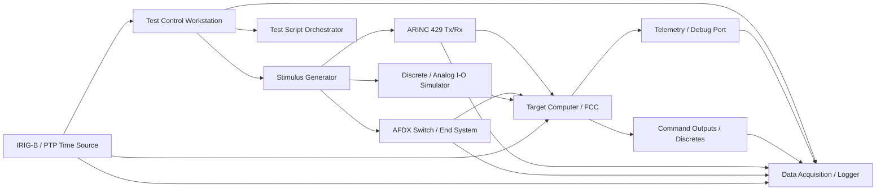

## 9.6 HSIT Process Flow

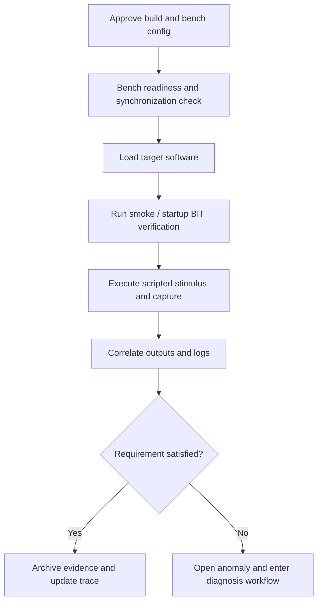

## 9.7 Diagnosis Workflow

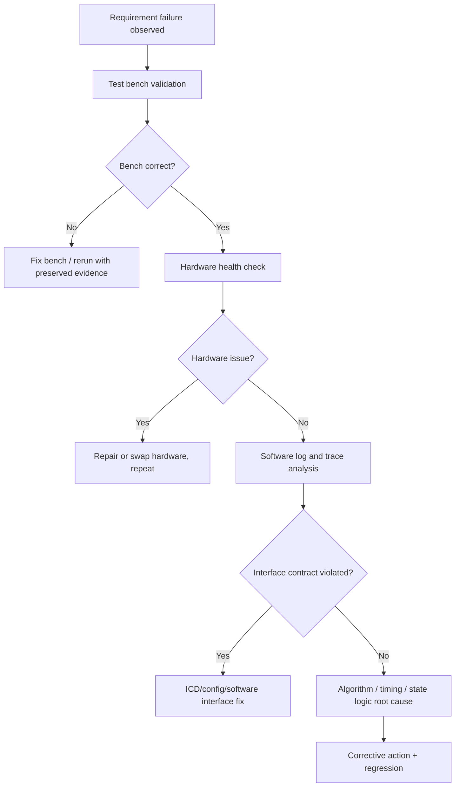

## 9.8 Practical HSIT Topics

### Stimulus Generation

- Use representative update rates, not human-paced test inputs.
- Include startup transients, data dropouts, burst traffic, and jitter.
- Validate the generator output independently with analyzer traces.

### Monitoring and Correlation

A lead verifier should never trust a single observation channel for critical failures. Typical correlation set:

- bus receive capture,
- target event log,
- target telemetry or health monitor output,
- discrete output capture,
- timing probe or trace marker.

### Instrumentation Rules

- Distinguish **debug instrumentation** from **formal verification instrumentation**.
- Document intrusiveness and build differences.
- For timing, prefer external timing markers or hardware trace where possible.

### Fault Injection

Typical HSIT fault-injection campaigns include:

- stale data,
- missing frames,
- bad status bits,
- checksum corruption,
- jitter beyond contract,
- power cycling peripheral module,
- discrete stuck high/low,
- invalid mode command value,
- queue flood from maintenance interface.

## 9.9 Realistic HSIT Failure Scenarios and Resolution

### Scenario 1 — False Timeout Due to Bench Jitter

**Observed:** Requirement says timeout after 80 ms silence. Failure reported at 60–65 ms equivalent.

**Diagnosis:** Bench generator had irregular frame interval caused by non-real-time host scheduling. The target software was correct.

**Resolution:** Moved stimulus timing source to hardware scheduler card; reran with synchronized capture.

**Lesson:** HSIT can fail because the bench is not deterministic enough.

### Scenario 2 — Startup BIT Passes on Warm Boot, Fails on Cold Boot

**Observed:** Cold power cycle triggers RAM BIT failure intermittently.

**Diagnosis:** Memory device required longer stabilization; startup software sampled too early. Hardware data sheet and oscilloscope trace confirmed power ramp issue.

**Resolution:** Adjusted startup delay and requirement clarification for stabilization window; repeated power-cycle campaign.

### Scenario 3 — Corrupted AFDX Frame Accepted

**Observed:** Software updated state on corrupted message once every few thousand injections.

**Diagnosis:** Transport layer integrity checked, but application sequence/validity cross-check bypassed on wrap boundary.

**Resolution:** Fixed application validation path, added targeted regression with wrap-around conditions.

### Scenario 4 — Stack Overflow During Fault Storm

**Observed:** Under injected sensor fault storm, target resets.

**Diagnosis:** Fault-reporting path allocated large local structures in nested handlers. Stack watermark confirmed overflow.

**Resolution:** Refactored logging path, increased stack only after analysis justified margin, reran worst-case campaign.

## 9.10 Industry Terminology

| Term | Meaning |
|---|---|
| Iron Bird | Integrated aircraft rig often used for system-level integration. |
| Bench Fidelity | Degree to which bench matches intended target/system behavior. |
| Bring-up Script | Automation for load, initialization, and smoke test. |
| Fault Campaign | Planned set of injected faults and expected responses. |
| Time Correlation | Alignment of data sources to a common trusted timebase. |
| Golden Run | Known-good baseline run used for comparison. |

## 9.11 Artifacts

| Artifact | Purpose |
|---|---|
| HSIT Environment Specification | Bench architecture, supported claims, limits, calibration, interfaces. |
| HSIT Procedure Set | Executable target-level tests. |
| Stimulus Library | Controlled nominal and fault scenarios. |
| Logging/Instrumentation Plan | Defines what is observed, where, and with what accuracy. |
| Load Manifest | Exact binary/config loaded to target. |
| Run Metadata Manifest | Correlates test ID, build, bench, script, target, timestamps, evidence. |
| Anomaly Reports | Failure records with diagnostic evidence. |
| Root Cause Reports | Technical closure package for major defects. |

## 9.12 Templates

### HSIT Run Manifest Template

| Field | Example |
|---|---|
| HSIT Run ID | HSIT-B3-2026-08-17-04 |
| Bench | B3 FCC Target Rig |
| Target Serial | FCC-TGT-017 |
| Board Revision | Rev F |
| BSP Version | bsp_5.2.1 |
| Software Build | fcc_app_3.14.7 |
| Config CRC | 0x9A7742C1 |
| Script Version | hsit_timeout_suite.py @ 1f84c0 |
| Stimulus Data | adr_timeout_profile_revC.csv |
| Time Source | IRIG-B Sync Rack 2 |
| Operator / Witness | Eng-24 / QA-12 |
| Evidence Files | LOG-5541, CAP-214, TRACE-112 |

### HSIT Debug Triage Checklist

- [ ] Preserve raw evidence before rerun.
- [ ] Validate bench wiring, calibration, and script version.
- [ ] Confirm target serial, board revision, and configuration CRC.
- [ ] Check if failure reproduces on same bench and alternate bench.
- [ ] Correlate at least two independent observation channels.
- [ ] Separate software defect, hardware defect, and bench defect hypotheses.
- [ ] Document time-source accuracy and drift status.
- [ ] Perform targeted regression after fix.

## 9.13 Common Mistakes

1. Making timing claims with unsynchronized logs.
2. Running fault injections that do not match realistic failure mechanisms.
3. Assuming target hardware is “correct” without revision/config traceability.
4. Over-instrumenting the code and then trusting altered timing behavior.
5. Losing failed raw evidence after re-run.

## 9.14 Failure Scenarios

| Scenario | Typical hidden cause | Prevention |
|---|---|---|
| Requirement failure only on one bench | Bench-specific script or hardware config | Bench baseline control and cross-bench comparison |
| Logs disagree on event ordering | Time sync drift | Common time architecture and periodic sync checks |
| Pass in debug build, fail in release build | Timing and optimization differences | Formal evidence on intended build flavor |
| Fault injection unsafe for hardware | Inadequate lab safety review | Injection safety procedure and limits |

## 9.15 Case Study — Autopilot Engage Inhibit Misbehavior

During HSIT, the FCC occasionally permitted autopilot engage despite dual-sensor disagree. Initial suspicion fell on application logic. The root cause was an AFDX maintenance message clearing the disagree flag due to stale configuration mapping from previous baseline.

### Final Fixes

- Corrected configuration table versioning.
- Added startup configuration CRC cross-check.
- Added HSIT regression combining disagree fault with maintenance traffic.

### Lead takeaway

Many “software defects” in HSIT are integration configuration defects with real safety consequence.

## 9.16 Exercises

1. Design an HSIT architecture for verifying ARINC 429 sensor validation.
2. Define a synchronization approach for a bench measuring 10 ms deadlines.
3. Write a triage plan for intermittent corrupted-frame acceptance.
4. Propose a fault campaign for startup BIT behavior.

## 9.17 Mini-Project

**Project:** Create an HSIT package for a target FCC sensor-input channel.

### Deliverables

- Bench architecture diagram
- Stimulus and monitoring plan
- 8 HSIT test cases including 3 fault injections
- Run manifest template
- Triage checklist
- Root-cause report for one simulated failure

## 9.18 Assessment

### Beginner
1. What is HSIT?
2. Why is synchronization necessary?
3. What types of evidence are common in HSIT?

### Intermediate
4. How do you validate a stimulus source?
5. Why can a bench create false failures?
6. What is the role of instrumentation in timing verification?

### Senior / Lead
7. How do you argue that an HSIT bench is representative enough for certification claims?
8. How would you structure fault injection for a DAL A flight control function?
9. How do you separate bench, hardware, software, and ICD root causes under schedule pressure without losing rigor?

---

# Module 10 — SWIT / Simulation / Test Benches

## 10.1 Learning Objectives

1. Differentiate MIL, SIL, SWIT, HIL, and HSIT in terms of architecture, purpose, evidence value, and limitations.
2. Design simulation and bench environments for airborne software verification.
3. Select the right environment for requirement, timing, interface, and fault-response verification.
4. Understand virtual target and simulated aircraft environment tradeoffs.
5. Build a layered verification strategy using multiple environments without over-claiming evidence.

## 10.2 Prerequisites

- Understanding of software integration and HSIT.
- Familiarity with models, compiled software, and target execution.
- Exposure to test environment control and traceability.

## 10.3 Environment Definitions

| Environment | What | Why avionics uses it | Lifecycle location | Artifacts | How performed | Evidence produced | Limitations / what can go wrong | Review / audit focus | DO-178C relation | Example | Interview question |
|---|---|---|---|---|---|---|---|---|---|---|---|
| MIL (Model-in-the-Loop) | Executable system/software models tested in simulation. | Early validation of algorithms, control logic, and requirement intent before code maturity. | Early development. | Models, model test cases, scenario libraries. | Simulate plant and environment around model. | Simulation logs, plots, model test reports. | Not code, not target timing, model fidelity limits. | Assumptions and correlation to later stages. | Useful supporting evidence but not substitute for code verification. | Control law model tested against aircraft dynamics model. | “What can MIL prove and what can it not prove?” |
| SIL (Software-in-the-Loop) | Compiled software executes in host/simulated environment with virtual drivers. | Fast regression and integrated software behavior without target hardware cost. | Development and regression. | Host executable, simulation harness, scripted tests. | Run software with simulated interfaces and scenarios. | Logs, reports, coverage, fault-response traces. | Host timing differs, driver realism limited. | Scope of claims and model/interface realism. | Strong for requirements on logic; limited for hardware-timing claims. | Sensor processing software running on Linux harness. | “Why should SIL timing evidence be treated carefully?” |
| SWIT (Software Integration Test) | Integrated software verification focused on software interactions, often using simulated or partial-real environments. | Bridges unit/component tests and full hardware integration; ideal for interface and mode logic before HSIT. | Mid integration. | Integrated build, simulated I/O, test procedures, environment spec. | Execute integrated executable with controlled interface simulation and fault cases. | Integration logs, traces, reports. | May hide hardware/driver/electrical issues. | Which requirements are legitimately closed here. | Valuable for software integration verification. | FCC integrated with simulated ARINC/AFDX and aircraft state model. | “How is SWIT different from generic SIL?” |
| HIL (Hardware-in-the-Loop) | Real hardware components tested against real-time simulator/plant environment. | Validates control interactions with realistic plant and external system behavior. | Integration/system validation. | Real-time simulator config, plant models, hardware setup. | Connect hardware/software item to simulator and execute scenarios. | Real-time traces, scenario reports. | Plant model limitations, expensive setup, observability gaps. | Fidelity of plant and I/O timing. | Supports system-context evidence where appropriate. | FCC connected to real-time aircraft dynamics simulator. | “What does HIL add beyond SWIT?” |
| HSIT | Real target software-hardware integration verification with real interfaces. | Establishes target timing, driver, startup, and real I/O behavior credibility. | Late integration/formal verification. | Target load, bench spec, scripts, calibration. | Load target and test with real I/O generators/monitors. | Target logs, captures, timing evidence. | Less aircraft behavior realism than HIL; bench complexity. | Hardware representativeness and traceability. | Key target-level verification environment. | FCC target with ARINC and discrete I/O bench. | “When do you choose HSIT over HIL?” |

## 10.4 Comparison Table — MIL vs SIL vs SWIT vs HIL vs HSIT

| Aspect | MIL | SIL | SWIT | HIL | HSIT |
|---|---|---|---|---|---|
| Primary object under test | Model | Compiled software | Integrated software executable | Real hardware/software in plant loop | Real target software + hardware interfaces |
| Real target CPU | No | Usually no | Usually no | Often yes for target hardware item | Yes |
| Real I/O electronics | No | No | Usually simulated | Often partial/yes | Yes / representative |
| Plant / aircraft dynamics | Full simulation | Simulated | Simulated / partial | Real-time simulator | Usually limited or scripted |
| Timing fidelity | Low for target claims | Low/medium | Medium for logic, low for hard real-time | High for closed-loop system timing | High for software-hardware timing |
| Interface realism | Low/medium | Medium | Medium/high logically | High | High electrically/logically |
| Debuggability | Very high | High | High | Medium | Medium/low |
| Execution speed | Fast | Fast | Medium | Real-time | Real-time / near real-time |
| Typical use | Algorithm validation | Regression and integration logic | Software interaction verification | Closed-loop behavior validation | Target bring-up, timing, driver/interface verification |
| Certification caution | Not code evidence | Do not over-claim timing/hardware behavior | Must define claim boundary | Plant fidelity must be justified | Bench fidelity and sync must be justified |

## 10.5 Advantages and Limitations

### MIL

**Advantages**
- Earliest defect discovery.
- Excellent scenario sweep capability.
- Cheap and highly observable.

**Limitations**
- No direct proof of compiled code correctness.
- Timing and hardware assumptions weak.

### SIL

**Advantages**
- Fast automation and broad regression coverage.
- Good for mode logic, fault logic, and dataflow verification.
- Easier introspection than target benches.

**Limitations**
- Host OS and processor do not represent target timing.
- Drivers and low-level services may be simplified.

### SWIT

**Advantages**
- Strong software interaction visibility.
- Good bridge between component verification and target tests.
- Efficient for interface and mode-integration defect removal.

**Limitations**
- Can miss target driver, electrical, and interrupt behavior.
- May over-simplify startup sequencing and low-level timing.

### HIL

**Advantages**
- Real-time closed-loop realism.
- Useful for aircraft/plant interaction and system behavior.

**Limitations**
- Expensive, harder to debug, plant model credibility needed.
- Not always ideal for low-level software introspection.

### HSIT

**Advantages**
- Best for target timing, startup, drivers, and real interface validation.
- High credibility for hardware-related software claims.

**Limitations**
- Usually less flexible for full aircraft dynamics.
- Bench complexity and synchronization challenges.

## 10.6 Architecture Diagrams

### MIL Architecture

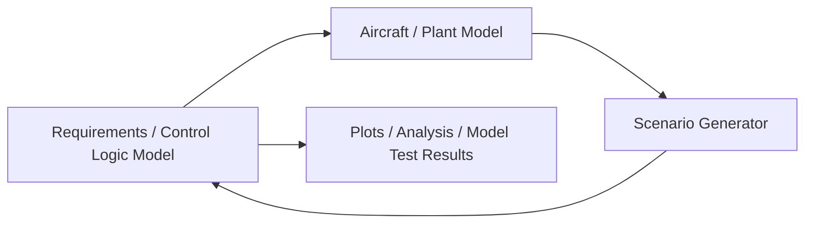

### SIL Architecture

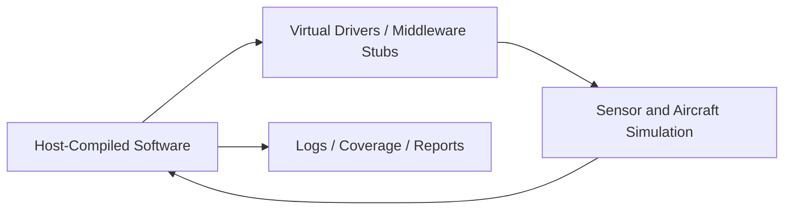

### SWIT Architecture

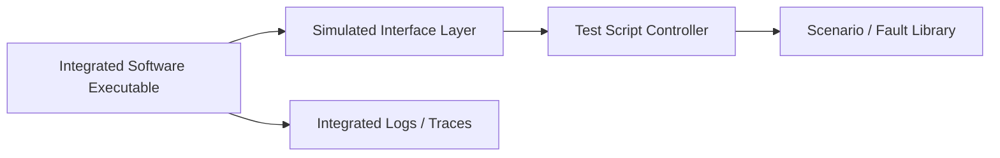

### HIL Architecture

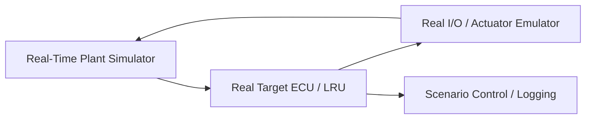

### HSIT Architecture

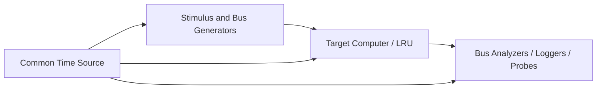

## 10.7 Simulation Environment Design Guidance

### Virtual Target

A **virtual target** emulates target CPU, memory map, peripherals, or RTOS behavior to varying fidelity.

| Topic | Guidance |
|---|---|
| Best use | Early software integration, startup flow exploration, fault handling, some timing trend insight. |
| Strength | Better realism than plain host SIL for startup/peripheral interactions. |
| Limitation | Still needs justification before using for hard target timing or electrical I/O claims. |
| Review focus | Fidelity assumptions, peripheral model accuracy, unsupported features. |

### Real Target vs Virtual Target

| Aspect | Virtual Target | Real Target |
|---|---|---|
| Timing credibility | Limited / model-dependent | High |
| Debug access | Very high | Medium |
| Hardware errata exposure | None / partial | Full |
| Repeatability | High | Medium |
| Cost per run | Low | Higher |

### Simulated Sensors and Aircraft Environment

A mature avionics simulation environment typically includes:

- sensor truth generation,
- latency and noise models,
- bus encoding layer,
- failure injection layer,
- aircraft state/environmental model,
- scenario control and replay,
- synchronized logging.

## 10.8 Selecting the Right Environment

| Verification need | Best primary environment | Why |
|---|---|---|
| Early algorithm tuning | MIL | Fast, observable, model-rich |
| Large regression after logic changes | SIL / SWIT | Fast and automatable |
| Integrated software mode and interface behavior | SWIT | Good balance of realism and visibility |
| Closed-loop aircraft response | HIL | Plant and real-time interaction |
| Target startup, drivers, real bus timing | HSIT | Real hardware/software interaction |
| Certification-strength deadline proof | HSIT (possibly with supporting analysis/HIL) | Highest credibility for target timing |

## 10.9 Industry Terminology

| Term | Meaning |
|---|---|
| Plant Model | Dynamic representation of aircraft/system physics. |
| Virtual Platform | CPU/peripheral emulation environment for software execution. |
| Scenario Replay | Repeatable playback of previously captured or generated mission data. |
| Fidelity | Degree of representativeness to real target/system. |
| Bench Claim Boundary | Explicit statement of what evidence from an environment may validly support. |

## 10.10 Artifacts

| Artifact | Purpose |
|---|---|
| Environment Specification | Defines architecture, interfaces, versions, and supported claims. |
| Scenario Library | Reusable nominal and fault scenarios. |
| Model Validation Record | Justifies simulation fidelity where relevant. |
| Test Bench Configuration Record | Hardware/software topology and versions. |
| Environment Limitation Log | Controlled statement of known fidelity limits. |
| Correlation Report | Shows relationship between environments, e.g., SIL vs HSIT behavior. |

## 10.11 Templates

### Environment Specification Template

```text
1. Purpose and Supported Verification Claims
2. Architecture Overview
3. Hardware Elements
4. Software Elements
5. Models / Simulations Used
6. Interface Definitions
7. Time Synchronization Method
8. Stimulus and Monitoring Capabilities
9. Known Limitations / Unsupported Claims
10. Configuration Control Method
11. Calibration / Validation Requirements
12. Evidence Generated
```

### Environment Selection Checklist

- [ ] Requirement class identified.
- [ ] Need for target timing evidence assessed.
- [ ] Need for real electrical/protocol behavior assessed.
- [ ] Need for aircraft closed-loop dynamics assessed.
- [ ] Environment limitations documented.
- [ ] Tool and model credibility considered.
- [ ] Correlation to other environments planned.

## 10.12 Common Mistakes

1. Calling every simulated environment “SIL” without clarifying scope.
2. Treating SWIT and HSIT as interchangeable.
3. Using HIL success to claim low-level driver correctness without evidence.
4. No documented boundary on what an environment can or cannot prove.
5. Failing to correlate virtual environment results with target evidence.

## 10.13 Failure Scenarios

| Scenario | Root cause | Prevention |
|---|---|---|
| SIL passes, HSIT fails timing | Host execution not representative | Explicit claim boundary and early target timing tests |
| HIL looks stable but interface defect remains | Plant model masks protocol edge case | Separate HSIT/interface campaign |
| Virtual target startup works, real target crashes | Peripheral model incomplete | Correlate startup behavior on actual target early |
| Bench results nonreproducible across labs | Environment control weak | Configuration-managed environment spec and validation |

## 10.14 Case Study — Choosing the Wrong Bench for a Timing Claim

A team attempted to close a 15 ms response-time requirement using SWIT because the integrated simulation bench was highly observable and repeatable. Internal review rejected the claim because CPU scheduling, interrupt latency, and bus driver effects were absent. The requirement was later closed properly in HSIT with synchronized timing instrumentation.

### Lead lesson

High observability does not equal high certification credibility. Choose the bench based on the claim, not convenience.

## 10.15 Exercises

1. Classify 10 sample requirements by best verification environment.
2. Define claim boundaries for SIL, SWIT, and HSIT on a flight control project.
3. Create a correlation plan between SIL and HSIT for a sensor timeout requirement.
4. Draw an environment architecture for a virtual-target-based integration bench.

## 10.16 Mini-Project

**Project:** Develop a layered bench strategy for a flight control software item.

### Deliverables

- Environment comparison table tailored to project needs
- Architecture diagrams for SIL, SWIT, HSIT, and HIL use on the project
- Environment claim-boundary statements
- Correlation strategy from simulation to target
- Risk list for environment misuse

## 10.17 Assessment

### Beginner
1. What is the difference between SIL and SWIT?
2. Why is HSIT stronger for target timing evidence?
3. What is a virtual target?

### Intermediate
4. When is HIL preferable to HSIT?
5. What limitations should always be documented in a simulation environment?
6. How would you correlate SIL and HSIT results?

### Senior / Lead
7. How would you build an evidence strategy using MIL, SIL, SWIT, HIL, and HSIT without double-counting or over-claiming?
8. Which environment misuses most often create certification risk?
9. How do you decide whether a virtual target is good enough for a particular verification objective?

---

# Final Senior/Lead Review Notes Across Modules 6–10

## Cross-Module Themes

1. **Traceability is non-negotiable.** Requirement → objective → procedure → expected result → actual result → evidence → anomaly/retest must remain intact.
2. **Environment credibility matters.** A passing result on the wrong bench may have little certification value.
3. **Timing evidence requires discipline.** Common timebase, representative load, and controlled instrumentation are essential.
4. **Integration defects are often configuration or interface defects.** Good leads investigate bench, build, config, and ICD before blaming algorithms.
5. **Requirements-based verification is the backbone.** Structural coverage, robustness, and debug evidence support it; they do not replace it.
6. **Production-grade documentation is part of the engineering work.** In avionics, undocumented rigor is often treated as missing rigor.

## Capstone Interview Prompts

1. How would you construct a verification argument for a DAL A flight control function from HLR through HSIT?
2. What evidence would you present first in an audit for a timing requirement failure that was later closed?
3. How do you separate requirement defect, bench defect, software defect, and hardware defect under schedule pressure?
4. How do you ensure CI/SIL speed does not erode certification-grade integration discipline?
5. What makes a senior verification engineer different from a lead verification engineer in avionics?

## Suggested Self-Evaluation Rubric

| Level | Expected capability |
|---|---|
| Beginner | Can read requirements, execute procedures, and explain basic evidence. |
| Intermediate | Can derive tests, manage traceability, and debug bench/software issues with guidance. |
| Senior | Can design verification approaches, defend evidence quality, and lead root-cause analysis. |
| Lead | Can shape strategy, allocate environments, manage independence and certification expectations, and coach teams through audits. |

---

**End of Part 2 — Modules 6 to 10**
