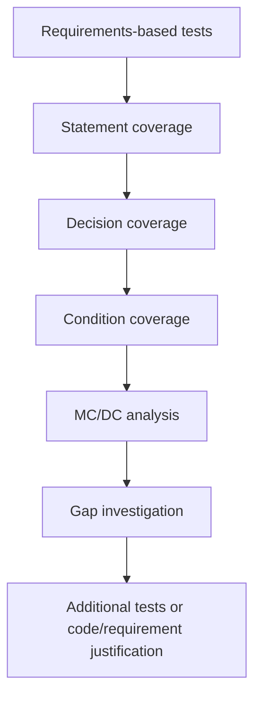
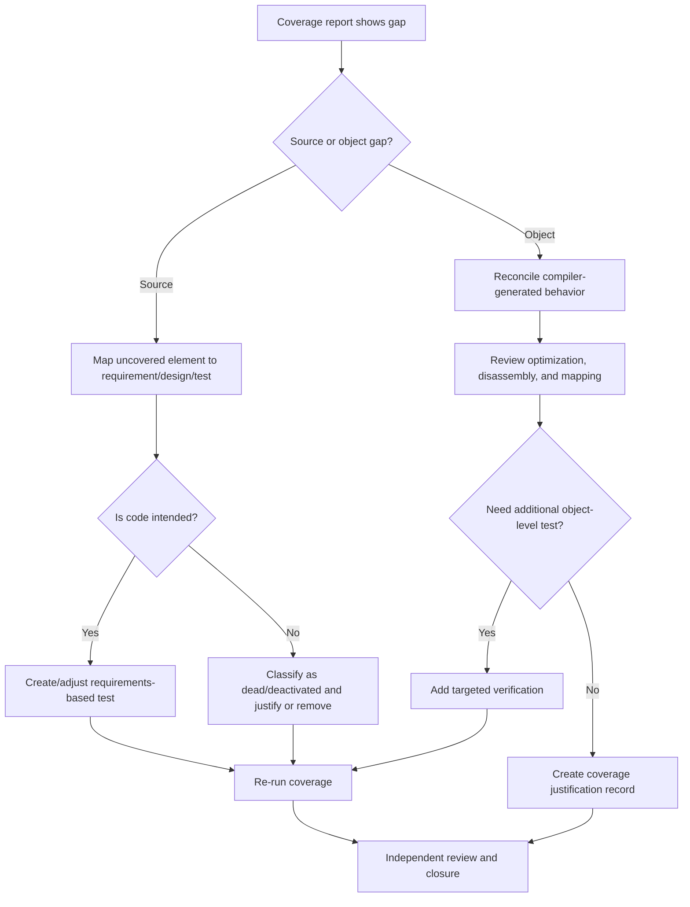
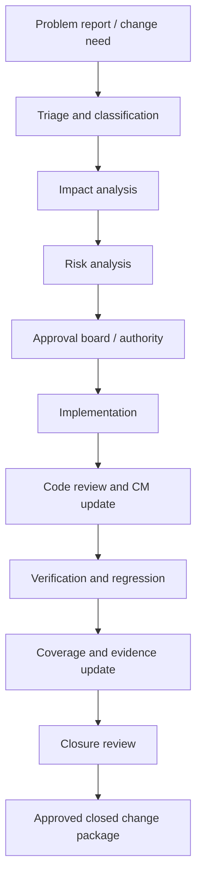

# Avionics Software Verification & Integration Study Material — Part 3 (Modules 11-15)


This part is written for **senior and lead avionics software verification/integration engineers** working in a **DO-178C** environment. The focus is production-grade practice: requirements-based testing, structural coverage, MC/DC mastery, configuration management, and controlled change management under certification scrutiny.

---

## MODULE 11 — Test Case & Procedure Engineering


### Learning objectives
- Engineer executable, reviewable, certification-ready test cases and test procedures.
- Distinguish test intent from test procedure mechanics and evidence capture.
- Select the right test type for avionics failure modes, interfaces, timing, and robustness risks.
- Produce objective pass/fail criteria that survive audits, reruns, and regression campaigns.
- Link every procedure to requirements, configuration, logs, anomalies, and closure evidence.

### Prerequisites
- DO-178C verification process knowledge.
- Familiarity with high-level and low-level requirements, software architecture, and integration environments.
- Working knowledge of avionics buses, target/host test environments, and anomaly reporting.

### Theory
Test case engineering answers **what must be demonstrated**; test procedure engineering answers **exactly how it will be demonstrated and repeated**. In avionics, that distinction matters because requirements-based verification must be **objective, deterministic, repeatable, and independently reviewable**. A weak procedure may still find bugs, but it cannot reliably support certification because the auditor cannot reconstruct execution context, data set, tool chain, hardware load, or evidence trail.

A production-grade avionics test procedure therefore does all of the following:
1. States the requirement(s) under verification.
2. Defines environmental and configuration assumptions.
3. Specifies stimuli and exact operator or script actions.
4. Separates **expected** from **observed** results.
5. Names evidence artifacts and retention locations.
6. Records anomalies, rerun conditions, and post-test system state.

### Terminology

| Term | Meaning in avionics verification |
| --- | --- |
| Test case | Logical verification intent derived from one or more requirements. |
| Test procedure | Step-by-step executable method to realize the test case. |
| Test script | Automated implementation of all or part of a procedure. |
| Test oracle | Rule or artifact used to determine pass/fail. |
| Configuration record | Definition of software, hardware, tools, and data used during execution. |
| Observed result | Actual measured or recorded behavior under the configured test run. |
| Anomaly/Problem report | Formal record of unexpected behavior, procedure issue, or environment issue. |
| Regression set | Controlled subset or full set rerun after change. |


### Core concepts


| Concept | What | Why avionics requires it | Where in lifecycle | Which artifacts | How performed | Evidence | What can go wrong | Review/audit | DO-178C relation | Example | Interview question |
| --- | --- | --- | --- | --- | --- | --- | --- | --- | --- | --- | --- |
| Test case | Verification intent tied to requirement(s). | Avionics certification requires objective requirements-based evidence. | Planning, verification design, execution. | SVP, test specifications, RTM, procedures. | Derive from normal/abnormal/boundary behavior and interface contracts. | Trace matrix entries, approved test spec. | Ambiguous scope or requirement drift. | Check bidirectional traceability and requirement coverage. | DO-178C verification objectives for requirements-based testing. | Autopilot engage allowed only with weight-off-wheels false. | How do you prove a test case is requirement-based and not code-based? |
| Test procedure | Executable steps, inputs, expected results, and evidence plan. | Repeatability and independence are mandatory under audit. | Verification design and execution. | Procedure, script, setup records. | Write exact preconditions, data loads, commands, and observations. | Reviewed procedure and execution record. | Missing setup details cause non-repeatable failures. | Review field completeness and pass/fail objectivity. | Supports execution evidence expected by DO-178C verification process. | Inject ARINC 429 label with parity error and observe reject path. | What makes a procedure certification-ready rather than merely useful? |
| Expected result | Objective outcome linked to requirement text. | Subjective expectations fail independence and auditability. | Procedure authoring and review. | Requirements, procedure, oracle definition. | Use measurable values, events, tolerances, timing bounds. | Screenshots, logs, counters, traces. | “System behaves correctly” is not auditable. | Confirm measurable thresholds and tolerances. | Ties to objective verification evidence. | “Alert asserted within 150 ms ±10 ms.” | How do you write expected results for timing behavior? |
| Evidence set | Logs, traces, screenshots, bench captures, tool reports. | Certification credit depends on retained objective evidence. | Execution and closure. | Execution record, bench logs, anomaly report. | Name each artifact and store under controlled path. | Immutable log package, review sign-off. | Lost raw logs make rerun or closure impossible. | Audit evidence retention, naming, completeness. | Life-cycle data and verification record retention. | Oscilloscope capture plus test harness log. | What evidence do you retain when a test fails? |
| Regression procedure | Re-execution after change with controlled scope. | Safety impact of change must be bounded and demonstrated. | Change verification. | Change package, impacted tests, regression report. | Select by impact analysis, interfaces, timing, structural effects. | Regression matrix and result summary. | Scope too narrow misses coupled behavior. | Review impact assumptions and omitted areas. | Supports changed software reverification under DO-178C. | Re-run VNAV descent inhibit tests after mode-logic change. | How do you defend a reduced regression set? |


### Professional procedure anatomy

| Field | Expectation for production-grade avionics procedure |
| --- | --- |
| Test ID | Unique identifier under configuration control; stable across reruns. |
| Requirement ID | Exact HLR/LLR identifiers; multiple allowed if justified. |
| Objective | What capability or constraint is being verified. |
| Preconditions | Bench state, mode state, memory state, network state, power-up assumptions. |
| Configuration | Software build, loadable part number, test data set, tool versions, hardware identifiers. |
| Inputs | Numeric values, bus messages, discrete states, file loads, pilot commands. |
| Stimulus | Precise event/action causing system evaluation. |
| Steps | Ordered procedure actions including wait conditions and measurements. |
| Expected results | Observable and measurable outcomes with tolerances and timing. |
| Observed results | Execution-time actual behavior; never prefilled in real execution records. |
| Pass/fail | Objective verdict tied only to expected vs observed results. |
| Evidence | Named logs, traces, screenshots, captures, run IDs. |
| Logs | Exact log sources and retention path. |
| Postconditions | Required cleanup/reset actions and expected final state. |


### Lifecycle placement


### Test types and when they matter

| Test type | Purpose | Typical avionics driver | Primary evidence |
| --- | --- | --- | --- |
| Functional | Show required behavior is correct. | Mode logic, calculations, annunciations. | Procedure results, trace logs. |
| Performance | Show throughput/resource behavior within limits. | Startup budget, route-load time, CPU budget. | Timing logs, profiler/report. |
| Boundary | Exercise limits and transitions. | Thresholds, range limits, saturation behavior. | Input/output tables, edge-value evidence. |
| Robustness | Show stable handling of off-nominal but plausible inputs. | Bus jitter, stale data, delayed messages. | Fault logs, graceful degradation evidence. |
| Negative | Show invalid inputs are rejected or handled safely. | CRC error, bad configuration file, unsupported mode. | Error paths, reject counters. |
| Fault injection | Demonstrate failure detection/isolation/annunciation. | Sensor disagree, channel failure, memory error. | BIT logs, maintenance word, fail-safe mode. |
| Stress | Demonstrate endurance under repeated or peak usage. | Burst message rates, repeated mode changes. | Long-run logs, resource trend charts. |
| Timing | Verify response latency and sequencing. | Alert latency, debounce, inter-frame timing. | Timestamped traces. |
| Interface | Verify protocol/data contract behavior. | ARINC 429, AFDX, CAN, discretes. | Bus monitor capture, ICD trace. |
| Regression | Confirm no adverse change. | Change implementation and re-verification. | Regression report and delta analysis. |


### Detailed reusable procedure template

| Field | Template text |
| --- | --- |
| Test ID | `TP-<subsystem>-<number>-<revision>` |
| Requirement ID | `HLR-xxx`, `LLR-yyy` |
| Objective | Verify that <system> shall <behavior> when <condition>. |
| Preconditions | Bench powered, build loaded, NVM cleared, bus simulators active, time source synchronized. |
| Configuration | SW PN/rev, HW serial, harness version, test data checksum, tool versions. |
| Inputs | Enumerate all controlled inputs and initial values. |
| Stimulus | Describe initiating command/event/message transition. |
| Steps | 1..n atomic actions; include waits and observation points. |
| Expected results | Measurable result, timing tolerance, state transitions, logs. |
| Observed results | To be completed at execution with measured values and notes. |
| Pass/fail | Pass only if every expected result is satisfied without unexplained anomaly. |
| Evidence | List filenames, capture IDs, screenshots, and run identifiers. |
| Logs | Bench log path, bus monitor export, target console, hardware trace. |
| Postconditions | Return bench to safe idle state and archive evidence package. |

### Ten complete example avionics test procedures

#### 11.1 Functional Test Procedure — Autopilot engage permissive

| Field | Example content |
| --- | --- |
| Test ID | TP-AP-001 |
| Requirement ID | HLR-AP-014 |
| Objective | Verify autopilot engages only when weight-on-wheels is false and no AP fault is active. |
| Preconditions | Aircraft simulation in cruise; AP channel available; WOW=false; AP fault bit=false. |
| Configuration | SW Build FCS-3.8.12; FCC-A SN1042; I/O rig v2.4; harness H-AP-07; toolchain BUSSIM 5.1. |
| Inputs | WOW=false, AP_PUSH=1, AP_FAULT=false, IAS=250 kt, pitch/roll within engage envelope. |
| Stimulus | Pilot presses AP ENGAGE discrete. |
| Steps | 1. Confirm AP disengaged. 2. Load nominal cruise state. 3. Apply AP ENGAGE for 200 ms. 4. Monitor AP mode word and cockpit annunciation for 1 s. |
| Expected results | Within 250 ms AP status becomes ENGAGED; green AP annunciation illuminates; no fault logged. |
| Observed results | Measured engage latency 112 ms; AP mode word transitioned to ENGAGED; green AP annunciation observed; no new fault records. |
| Pass/fail | PASS |
| Evidence | run_11_1.log, ap_bus_11_1.csv, screenshot_ap_11_1.png |
| Logs | bench/AP/run_11_1.log; bus/ap_bus_11_1.csv |
| Postconditions | Return AP ENGAGE discrete to 0 and reset sim state. |

#### 11.2 Performance Test Procedure — FMS route load time

| Field | Example content |
| --- | --- |
| Test ID | TP-FMS-014 |
| Requirement ID | HLR-FMS-077 |
| Objective | Verify loading a 250-waypoint company route completes within 2.0 s without UI lockup. |
| Preconditions | FMS at route page; SSD wear leveling idle; route database loaded. |
| Configuration | SW Build FMS-5.2.0; target CPU rev C; DB AIRAC 2610; data loader 3.0. |
| Inputs | Route file CRTE_250A with 250 waypoints and 18 discontinuities. |
| Stimulus | Operator presses LOAD ROUTE and confirms import. |
| Steps | 1. Clear active flight plan. 2. Start timestamp capture. 3. Trigger route load. 4. Stop timing when route page shows “LOAD COMPLETE”. 5. Observe task watchdog and UI responsiveness. |
| Expected results | Completion time <=2.0 s; no watchdog expiration; route count =250; discontinuities preserved. |
| Observed results | Completion time 1.41 s; watchdog count unchanged; route count 250; discontinuities matched baseline. |
| Pass/fail | PASS |
| Evidence | fms_perf_11_2.csv, ui_trace_11_2.json, video_11_2.mp4 |
| Logs | perf/fms_perf_11_2.csv; traces/ui_trace_11_2.json |
| Postconditions | Clear active route and archive performance capture. |

#### 11.3 Boundary Test Procedure — Overspeed alert threshold

| Field | Example content |
| --- | --- |
| Test ID | TP-EICAS-021 |
| Requirement ID | LLR-EICAS-203 |
| Objective | Verify overspeed caution asserts at VMO+0 kt and clears only below VMO-2 kt hysteresis point. |
| Preconditions | Simulation stable at FL250; no existing cautions. |
| Configuration | SW Build DISP-7.4.1; alert tables checksum 84AF. |
| Inputs | VMO=320 kt; test IAS sweep values 319, 320, 321, 318 kt. |
| Stimulus | Increment IAS in 1 kt steps then reduce. |
| Steps | 1. Stabilize at 319 kt. 2. Increase to 320 kt and hold 2 s. 3. Increase to 321 kt and hold 2 s. 4. Reduce to 319 then 318 kt while monitoring alert status. |
| Expected results | Alert absent at 319 kt; present at 320 and 321 kt; remains set at 319 kt on descent; clears at 318 kt. |
| Observed results | Observed exactly as expected; alert transition timestamps captured. |
| Pass/fail | PASS |
| Evidence | eicas_boundary_11_3.log, plot_11_3.png |
| Logs | alerts/eicas_boundary_11_3.log |
| Postconditions | Restore IAS to 280 kt. |

#### 11.4 Robustness Test Procedure — ARINC 429 label jitter handling

| Field | Example content |
| --- | --- |
| Test ID | TP-ADC-033 |
| Requirement ID | HLR-ADC-045 |
| Objective | Verify ADC consumer continues using last valid value when airspeed label arrival jitter remains within tolerance window. |
| Preconditions | Consumer task running; bus healthy; previous valid IAS=245 kt. |
| Configuration | SW Build ADC-2.9.4; ARINC generator 4.2; ICD rev 19. |
| Inputs | Inject IAS label with 40 ms nominal period and ±8 ms jitter for 60 s. |
| Stimulus | Start jittered transmission profile. |
| Steps | 1. Arm bus monitor. 2. Start jitter profile. 3. Observe decoded IAS, stale-data flag, and consumer fault counter for 60 s. |
| Expected results | No stale-data flag; displayed IAS tracks transmitted values; fault counter unchanged. |
| Observed results | No stale-data flag asserted; IAS tracked with max lag 1 frame; fault counter remained 0. |
| Pass/fail | PASS |
| Evidence | adc_jitter_11_4.csv, bus429_11_4.csv |
| Logs | bus/adc_jitter_11_4.csv |
| Postconditions | Stop generator and reload nominal bus profile. |

#### 11.5 Negative Test Procedure — Reject corrupted navigation database chunk

| Field | Example content |
| --- | --- |
| Test ID | TP-DL-008 |
| Requirement ID | HLR-DL-012 |
| Objective | Verify data loader rejects a navigation database block with invalid CRC and preserves previous approved database. |
| Preconditions | Approved database AIRAC 2610 active; loader idle. |
| Configuration | SW Build DL-1.6.9; navdb media image MD5 91e...; loader harness H-DL-02. |
| Inputs | Corrupted block 17 with forced CRC mismatch. |
| Stimulus | Initiate database load from maintenance port. |
| Steps | 1. Record active database ID. 2. Start load with corrupted image. 3. Observe CRC validation result. 4. Check active database ID after abort. |
| Expected results | Load aborted with explicit CRC error; maintenance log records block 17 failure; previously approved database remains active. |
| Observed results | Abort occurred at block 17; CRC-ERR-17 logged; active database remained AIRAC 2610. |
| Pass/fail | PASS |
| Evidence | loader_neg_11_5.log, maint_11_5.txt |
| Logs | loader/loader_neg_11_5.log |
| Postconditions | Return loader to idle and clear maintenance alert. |

#### 11.6 Fault Injection Test Procedure — Dual air-data disagree

| Field | Example content |
| --- | --- |
| Test ID | TP-FDIR-019 |
| Requirement ID | HLR-FDIR-031 |
| Objective | Verify air-data disagree fault is declared when channel difference exceeds threshold for persistence period. |
| Preconditions | ADC1=250 kt, ADC2=250 kt, fault-free state. |
| Configuration | SW Build FDIR-4.0.3; threshold table rev 8. |
| Inputs | Inject ADC2 step to 268 kt while ADC1 stays 250 kt; persistence 3 s. |
| Stimulus | Apply ADC2 offset at t0. |
| Steps | 1. Start synchronized capture. 2. Hold channels equal for 5 s baseline. 3. Step ADC2 to 268 kt. 4. Continue for 5 s. 5. Observe disagree flag, annunciation, and maintenance word. |
| Expected results | No declare before 3 s persistence; declare after 3 s ±100 ms; maintenance word bit set; caution annunciation active. |
| Observed results | Declare at 3.04 s; maintenance word bit set; caution active; no early transient declare. |
| Pass/fail | PASS |
| Evidence | fdir_11_6.csv, caution_11_6.png |
| Logs | fdir/fdir_11_6.csv |
| Postconditions | Remove injected offset and verify fault clears per separate recovery test. |

#### 11.7 Stress Test Procedure — Repeated lateral mode toggling

| Field | Example content |
| --- | --- |
| Test ID | TP-FG-041 |
| Requirement ID | HLR-FG-088 |
| Objective | Verify flight guidance mode manager remains stable across 500 rapid HDG/NAV toggles. |
| Preconditions | Guidance computer in cruise with both modes available. |
| Configuration | SW Build FG-6.1.0; script runner 2.8. |
| Inputs | 500 mode toggle commands at 2 Hz. |
| Stimulus | Automated script alternates mode select commands. |
| Steps | 1. Start CPU/memory monitor. 2. Execute toggle script. 3. Record command acceptance, mode annunciation, queue depth, and fault logs. 4. Review final mode consistency. |
| Expected results | No reset, deadlock, queue overflow, or invalid combined mode; final mode equals last command. |
| Observed results | 500/500 commands accepted; no reset; queue depth max 2; final mode NAV as commanded. |
| Pass/fail | PASS |
| Evidence | stress_11_7.log, cpu_11_7.csv |
| Logs | stress/stress_11_7.log |
| Postconditions | Stop script and clear mode commands. |

#### 11.8 Timing Test Procedure — Engine fire alert latency

| Field | Example content |
| --- | --- |
| Test ID | TP-WARN-027 |
| Requirement ID | HLR-WARN-062 |
| Objective | Verify engine fire master warning asserts within 150 ms of validated fire discrete. |
| Preconditions | No active warnings; discretes sampled at nominal task rate. |
| Configuration | SW Build WARN-9.0.1; discrete stimulator DS-4. |
| Inputs | FIRE_DISC rises from 0 to 1 and remains asserted for 500 ms. |
| Stimulus | Apply fire discrete transition. |
| Steps | 1. Arm logic analyzer and software trace. 2. Apply rising edge. 3. Measure time to master warning output and EICAS alert display. |
| Expected results | Master warning output and alert display each assert within 150 ms; sequence order per design: output then display within same frame. |
| Observed results | Master warning output at 48 ms; display at 71 ms; order correct. |
| Pass/fail | PASS |
| Evidence | timing_11_8.sal, warn_trace_11_8.log |
| Logs | timing/warn_trace_11_8.log |
| Postconditions | Remove fire discrete and acknowledge warning per shutdown procedure. |

#### 11.9 Interface Test Procedure — AFDX sequence gap recovery

| Field | Example content |
| --- | --- |
| Test ID | TP-AFDX-012 |
| Requirement ID | HLR-NET-055 |
| Objective | Verify receiver discards out-of-sequence packet and resynchronizes on next valid packet without stale publish. |
| Preconditions | Receiver subscribed and healthy; publisher active. |
| Configuration | SW Build NET-3.3.7; switch config RC2; ICD 3.1. |
| Inputs | Transmit sequence numbers 101, 102, 104, 105 with valid CRC. |
| Stimulus | Inject gap by omitting sequence 103. |
| Steps | 1. Start network capture. 2. Send packets 101 and 102 nominally. 3. Omit 103 and send 104. 4. Send 105. 5. Observe discard counter and published payload IDs. |
| Expected results | Packet 104 discarded as sequence error; counter increments by 1; receiver resynchronizes and accepts 105 per design rule. |
| Observed results | Discard counter incremented once on 104; 105 accepted; no stale publish of 104 payload. |
| Pass/fail | PASS |
| Evidence | afdx_11_9.pcap, rxlog_11_9.log |
| Logs | net/afdx_11_9.pcap |
| Postconditions | Restore nominal packet stream. |

#### 11.10 Regression Test Procedure — VNAV descent inhibit fix

| Field | Example content |
| --- | --- |
| Test ID | TP-VNAV-054 |
| Requirement ID | PR-4821 / HLR-VNAV-102 |
| Objective | Verify corrected logic still inhibits VNAV descent when radio altitude invalid during approach. |
| Preconditions | Change package PR-4821 loaded; approach state simulated. |
| Configuration | SW Build VNAV-8.7.3-rc2; regression baseline RB-2026-08-15. |
| Inputs | RA validity=false, approach armed=true, path capture pending=true. |
| Stimulus | Transition to descent capture point with invalid RA. |
| Steps | 1. Load regression scenario. 2. Advance scenario to descent capture point. 3. Observe VNAV mode command, advisory, and log message. 4. Compare with pre-change defect evidence. |
| Expected results | VNAV descent command inhibited; advisory displayed; log records inhibit reason RA_INVALID; no unintended mode transition. |
| Observed results | Behavior matched expected corrected logic; prior unintended descent command absent. |
| Pass/fail | PASS |
| Evidence | vnav_reg_11_10.log, compare_11_10.html |
| Logs | regression/vnav_reg_11_10.log |
| Postconditions | Unload scenario and restore baseline data set. |


### Authoring checklist
- Requirement reference is exact and current revision is identified.
- Preconditions fully define aircraft state, bench state, and data state.
- Expected results are measurable, not interpretive.
- Each step is atomic enough that another engineer can repeat it without tribal knowledge.
- Evidence filenames, log sources, and screenshot expectations are defined.
- Pass/fail does not depend on undocumented analyst judgment.
- Postconditions prevent contamination of the next test.
- Procedure hazards are identified for target benches or hardware-in-the-loop rigs.

### Review checklist
- Is the procedure requirement-based rather than code-structure-based?
- Does the test inadvertently combine multiple objectives and hide failure diagnosis?
- Are timing tolerances justified by requirement/design data?
- Is observed-result space separated from preauthored content?
- Are anomaly handling and rerun criteria defined?
- Is configuration reproducible six months later?

### Common mistakes
- Using “verify system works correctly” as expected result text.
- Omitting data set checksums and tool versions.
- Assuming operator knowledge for message injection or bus setup.
- Failing to distinguish environment issues from software anomalies.
- Combining nominal and abnormal behaviors in one pass/fail verdict.
- Forgetting evidence for rejected or aborted tests.

### Practical examples
- Converting a requirement into three procedures: nominal engage, inhibit, and recovery.
- Splitting one overloaded test into deterministic atomic cases for easier anomaly isolation.
- Rewriting a script-only test to include human-readable execution intent and audit-ready evidence mapping.

### Artifacts
- Test case specification
- Test procedure specification
- Automated test script and script review record
- Requirements traceability matrix updates
- Execution records and evidence bundle
- Problem reports and retest records
- Verification summary input data

### Templates
#### Minimal execution record template

| Field | Entry example |
| --- | --- |
| Execution run ID | RUN-2026-08-17-AP-001 |
| Procedure revision | TP-AP-001 Rev C |
| Executor / reviewer | A. Engineer / B. Independent Reviewer |
| Date/time | 2026-08-17T09:42Z |
| Bench | SIL-Bench-02 |
| Outcome | PASS / FAIL / BLOCKED / ABORTED |
| Anomaly references | PR-4821, ENV-77 |
| Evidence package | vault://verification/AP/RUN-2026-08-17-AP-001 |


### Interview questions
**Junior**
- What is the difference between a test case and a test procedure?
- Why must expected results be measurable?
- What belongs in preconditions versus configuration?

**Mid-level**
- How do you derive negative and boundary tests from a single requirement?
- How do you structure evidence so the test is reproducible?
- What is the danger of combining many objectives in one procedure?

**Senior/Lead**
- How do you defend procedure adequacy during a certification audit?
- How do you separate environment-caused failures from software-caused failures at scale?
- How do you decide whether an automated script is sufficient or needs a human-readable wrapper procedure?
- How do you define regression scope after a logic change affecting multiple operational modes?

### Case study
A flight warning procedure intermittently failed on the target bench. Investigation showed the procedure omitted a requirement to synchronize the external timestamp source before test start. The software was correct; the evidence was not trustworthy. The corrective action was to update preconditions, make time sync measurable, and add a review item that any timing test must declare time-base authority. This is a classic avionics lesson: a weak procedure can manufacture false software failures.

### Exercises
1. Rewrite a vague expected result into a measurable one with timing tolerance.
2. Derive five test procedures from a mode-engagement requirement: nominal, inhibit, recovery, boundary, and robustness.
3. Review a peer procedure and identify missing evidence fields.
4. Convert a script log into a complete execution record.

### Mini-project
Build a complete procedure set for an **autothrottle disconnect warning** feature:
- 6 functional tests
- 2 timing tests
- 2 negative tests
- 1 interface test
- full template population
- review checklist and evidence naming convention

### Assessment
- Can the learner derive objective procedures from ambiguous requirements?
- Can the learner define complete configuration and evidence metadata?
- Can the learner distinguish failure, anomaly, blocked test, and environment issue?
- Can the learner produce audit-ready regression procedures?

---

## MODULE 12 — Structural Coverage (DEEP MODULE)


### Learning objectives
- Explain statement, decision, condition, and MC/DC coverage in both mathematical and practical avionics terms.
- Perform complete MC/DC analysis on realistic C/C++ decisions.
- Diagnose why 100% coverage was not achieved and determine whether the gap is test, requirement, code, or build related.
- Evaluate unreachable, defensive, deactivated, and object-code-only behavior under DO-178C.
- Prepare structural coverage evidence that survives DER/auditor review.

### Prerequisites
- Confident reading of C/C++ control logic.
- Understanding of low-level requirements, requirements-based tests, and traceability.
- Familiarity with Level A/B/C verification expectations.

### Structural coverage theory
Requirements-based testing tells you that implemented behavior satisfies requirements. Structural coverage tells you **which parts of the implementation were actually exercised while doing that verification**. In avionics, structural coverage is not a substitute for requirements-based testing; it is a **completeness analysis** over the executed implementation. The higher the software level criticality, the stronger the coverage objective.

Coverage hierarchy used in DO-178C practice:
1. **Statement coverage** — every executable statement has been executed.
2. **Decision coverage** — each decision has taken all outcomes.
3. **Condition coverage** — each atomic condition has evaluated True and False.
4. **MC/DC** — each condition has been shown to independently affect the decision outcome.

### Terminology

| Term | Meaning |
| --- | --- |
| Statement | Executable source element such as assignment, call, or return path. |
| Decision | Boolean expression controlling flow, e.g., if/while/for/?:. |
| Condition | Atomic boolean term within a decision. |
| MC/DC | Modified Condition/Decision Coverage: every condition independently affects the decision outcome. |
| Independence pair | Two tests where only the target condition changes, all others remain fixed, and the decision outcome changes. |
| Coverage gap | Any statement/decision/condition not exercised by requirements-based tests. |
| Defensive code | Code added to protect against abnormal conditions, often requiring justification and tests. |
| Deactivated code | Code intentionally disabled by configuration or compilation and excluded with justification. |
| Object code coverage | Additional coverage analysis at object level when source coverage is insufficient to explain execution. |
| Instrumentation | Technique/tooling that records execution of statements/branches/conditions. |


### Core concepts


| Concept | What | Why avionics requires it | Where in lifecycle | Which artifacts | How performed | Evidence | What can go wrong | Review/audit | DO-178C relation | Example | Interview question |
| --- | --- | --- | --- | --- | --- | --- | --- | --- | --- | --- | --- |
| Statement coverage | Each executable statement runs at least once. | Undemonstrated statements may hide unverified behavior. | Requirements-based test execution, coverage analysis. | Coverage report, source listing, trace matrix. | Instrument code or analyze execution trace. | Statement hit map. | Dead paths remain hidden if only branches are checked superficially. | Review uncovered statements against requirements and design. | Required structural coverage objective depending on level. | Error counter increment path executed once. | Why is statement coverage alone insufficient for Level A logic? |
| Decision coverage | Each decision evaluates both True and False. | Avionics mode logic often fails on untested outcome paths. | Integration and low-level verification. | Coverage report, procedure records. | Select tests that force both decision outcomes. | True/False branch hits. | A condition can still be masked while decision coverage is 100%. | Check both outcomes and branch side effects. | Part of structural coverage objectives. | Engage allowed and engage inhibited branches. | Can you have 100% decision coverage but miss a fault? |
| Condition coverage | Each atomic condition becomes True and False. | Sensor validity, inhibit bits, and interface status flags are often combined. | Low-level verification and structural analysis. | Coverage data, truth tables. | Exercise each atomic condition state. | Per-condition T/F report. | Condition toggles may not prove independence. | Audit condition decomposition and short-circuit semantics. | Intermediate structural rigor before MC/DC. | WOW flag seen as both 0 and 1. | Why does condition coverage not imply MC/DC? |
| MC/DC | Each condition independently changes the decision outcome. | Level A avionics demands evidence that every condition matters and is verified. | Detailed verification closure and gap analysis. | Truth tables, independence pairs, coverage report, review record. | Construct independence pairs and minimal test sets. | MC/DC matrix and reviewed rationale. | Incorrect pair selection, masked conditions, short-circuit misconceptions. | Review row pairs, fixed non-target conditions, and execution evidence. | DO-178C Level A structural coverage objective. | AP engage = cmd && valid && !fault. | How do you choose a valid MC/DC independence pair? |
| Object code coverage | Coverage of compiled instructions not visible from source behavior alone. | Optimization, inlining, and compiler-generated logic can create extra object behavior. | Late verification closure when source report is insufficient. | Disassembly review, object coverage tool output. | Map object instructions back to source or justify compiler artifacts. | Object/source reconciliation record. | Assuming source coverage proves optimized object behavior. | Audit compiler options and object/source mapping. | DO-178C expects resolution when object code cannot be fully explained by source analysis. | Merged compare/setcc sequence introduced by compiler. | When do you escalate from source to object code coverage? |


### Mathematical view of MC/DC
For a decision \(D = f(c_1, c_2, ..., c_n)\), MC/DC requires that for each condition \(c_i\) there exist two test vectors \(t_a\) and \(t_b\) such that:
1. \(c_i(t_a) \neq c_i(t_b)\)
2. For all \(j \neq i\), \(c_j(t_a) = c_j(t_b)\)
3. \(D(t_a) \neq D(t_b)\)

The pair \((t_a, t_b)\) is the **independence pair** for condition \(c_i\).

Practical translation for avionics engineers:
- Freeze every non-target factor.
- Toggle exactly one condition.
- Prove the overall decision changes.
- Retain execution evidence that the pair was actually run on the configured build/environment.

### Why MC/DC matters in avionics practice
Complex inhibit/engage logic is where hazardous software defects hide. A decision can have full statement, decision, and even condition coverage while a safety-significant condition never truly demonstrates influence because it is always masked by another term. MC/DC is designed to expose that gap.

### Coverage relationship



### Ten detailed C/C++ examples with complete MC/DC analysis

### 12.1 Example 1 — Two-condition inhibit

Simple baseline: statement/decision coverage are easy, but MC/DC still demands one independence pair per condition.

```c
bool engage = engage_cmd && valid_data;
```

**Decision under analysis:** `(A && B)`

**Condition mapping**

| Symbol | Meaning |
| --- | --- |
| A | engage_cmd |
| B | valid_data |

**Truth table**

| Row | A | B | Decision |
| --- | --- | --- | --- |
| R1 | 0 | 0 | 0 |
| R2 | 0 | 1 | 0 |
| R3 | 1 | 0 | 0 |
| R4 | 1 | 1 | 1 |

**Independence pairs**

- **A (engage_cmd)**: R2/R4
- **B (valid_data)**: R3/R4

**Minimum MC/DC test set**

- R2 = [0 1 | 0]
- R3 = [1 0 | 0]
- R4 = [1 1 | 1]

**Coverage result**
- Statement/branch intent: Y (both decision outcomes exercised)
- Decision coverage: Y
- Condition coverage: A=Y, B=Y
- MC/DC: Y

**Detailed solution explanation**

The selected set is minimal for this decision and demonstrates each condition independently affecting the outcome. A is shown independent by pair R2/R4. B is shown independent by pair R3/R4. In avionics reviews, verify the pair rows keep every non-target condition fixed, that both True and False decision outcomes occur, and that the test procedure ties each vector back to a low-level requirement and execution evidence.

### 12.2 Example 2 — Inhibit flag in OR tail

Classic case where decision coverage can be achieved while A or B remains partially masked by C.

```c
bool issue_cmd = (pilot_cmd && sensors_valid) || maintenance_override;
```

**Decision under analysis:** `((A && B) || C)`

**Condition mapping**

| Symbol | Meaning |
| --- | --- |
| A | pilot_cmd |
| B | sensors_valid |
| C | maintenance_override |

**Truth table**

| Row | A | B | C | Decision |
| --- | --- | --- | --- | --- |
| R1 | 0 | 0 | 0 | 0 |
| R2 | 0 | 0 | 1 | 1 |
| R3 | 0 | 1 | 0 | 0 |
| R4 | 0 | 1 | 1 | 1 |
| R5 | 1 | 0 | 0 | 0 |
| R6 | 1 | 0 | 1 | 1 |
| R7 | 1 | 1 | 0 | 1 |
| R8 | 1 | 1 | 1 | 1 |

**Independence pairs**

- **A (pilot_cmd)**: R3/R7
- **B (sensors_valid)**: R5/R7
- **C (maintenance_override)**: R3/R4

**Minimum MC/DC test set**

- R3 = [0 1 0 | 0]
- R4 = [0 1 1 | 1]
- R5 = [1 0 0 | 0]
- R7 = [1 1 0 | 1]

**Coverage result**
- Statement/branch intent: Y (both decision outcomes exercised)
- Decision coverage: Y
- Condition coverage: A=Y, B=Y, C=Y
- MC/DC: Y

**Detailed solution explanation**

The selected set is minimal for this decision and demonstrates each condition independently affecting the outcome. A is shown independent by pair R3/R7. B is shown independent by pair R5/R7. C is shown independent by pair R3/R4. In avionics reviews, verify the pair rows keep every non-target condition fixed, that both True and False decision outcomes occur, and that the test procedure ties each vector back to a low-level requirement and execution evidence.

### 12.3 Example 3 — Mixed AND/OR gate

Representative engage permissive logic with one primary gate and redundant enabling channels.

```c
bool ap_allowed = wow_false && (hyd_ok || elec_ok);
```

**Decision under analysis:** `(A && (B || C))`

**Condition mapping**

| Symbol | Meaning |
| --- | --- |
| A | wow_false |
| B | hyd_ok |
| C | elec_ok |

**Truth table**

| Row | A | B | C | Decision |
| --- | --- | --- | --- | --- |
| R1 | 0 | 0 | 0 | 0 |
| R2 | 0 | 0 | 1 | 0 |
| R3 | 0 | 1 | 0 | 0 |
| R4 | 0 | 1 | 1 | 0 |
| R5 | 1 | 0 | 0 | 0 |
| R6 | 1 | 0 | 1 | 1 |
| R7 | 1 | 1 | 0 | 1 |
| R8 | 1 | 1 | 1 | 1 |

**Independence pairs**

- **A (wow_false)**: R2/R6
- **B (hyd_ok)**: R5/R7
- **C (elec_ok)**: R5/R6

**Minimum MC/DC test set**

- R2 = [0 0 1 | 0]
- R5 = [1 0 0 | 0]
- R6 = [1 0 1 | 1]
- R7 = [1 1 0 | 1]

**Coverage result**
- Statement/branch intent: Y (both decision outcomes exercised)
- Decision coverage: Y
- Condition coverage: A=Y, B=Y, C=Y
- MC/DC: Y

**Detailed solution explanation**

The selected set is minimal for this decision and demonstrates each condition independently affecting the outcome. A is shown independent by pair R2/R6. B is shown independent by pair R5/R7. C is shown independent by pair R5/R6. In avionics reviews, verify the pair rows keep every non-target condition fixed, that both True and False decision outcomes occur, and that the test procedure ties each vector back to a low-level requirement and execution evidence.

### 12.4 Example 4 — Range and validity

Shows how negated conditions are still independent atomic conditions in MC/DC analysis.

```c
bool accept = data_valid && !stale && in_range;
```

**Decision under analysis:** `(A && !B && C)`

**Condition mapping**

| Symbol | Meaning |
| --- | --- |
| A | data_valid |
| B | stale |
| C | in_range |

**Truth table**

| Row | A | B | C | Decision |
| --- | --- | --- | --- | --- |
| R1 | 0 | 0 | 0 | 0 |
| R2 | 0 | 0 | 1 | 0 |
| R3 | 0 | 1 | 0 | 0 |
| R4 | 0 | 1 | 1 | 0 |
| R5 | 1 | 0 | 0 | 0 |
| R6 | 1 | 0 | 1 | 1 |
| R7 | 1 | 1 | 0 | 0 |
| R8 | 1 | 1 | 1 | 0 |

**Independence pairs**

- **A (data_valid)**: R2/R6
- **B (stale)**: R6/R8
- **C (in_range)**: R5/R6

**Minimum MC/DC test set**

- R2 = [0 0 1 | 0]
- R5 = [1 0 0 | 0]
- R6 = [1 0 1 | 1]
- R8 = [1 1 1 | 0]

**Coverage result**
- Statement/branch intent: Y (both decision outcomes exercised)
- Decision coverage: Y
- Condition coverage: A=Y, B=Y, C=Y
- MC/DC: Y

**Detailed solution explanation**

The selected set is minimal for this decision and demonstrates each condition independently affecting the outcome. A is shown independent by pair R2/R6. B is shown independent by pair R6/R8. C is shown independent by pair R5/R6. In avionics reviews, verify the pair rows keep every non-target condition fixed, that both True and False decision outcomes occur, and that the test procedure ties each vector back to a low-level requirement and execution evidence.

### 12.5 Example 5 — Pointer defensive short-circuit

A defensive decision must still be analyzed even though short-circuit evaluation protects later dereferences.

```c
if (ptr != NULL && len > 0 && index < len) { use(ptr[index]); }
```

**Decision under analysis:** `(A && B && C)`

**Condition mapping**

| Symbol | Meaning |
| --- | --- |
| A | ptr != NULL |
| B | len > 0 |
| C | index < len |

**Truth table**

| Row | A | B | C | Decision |
| --- | --- | --- | --- | --- |
| R1 | 0 | 0 | 0 | 0 |
| R2 | 0 | 0 | 1 | 0 |
| R3 | 0 | 1 | 0 | 0 |
| R4 | 0 | 1 | 1 | 0 |
| R5 | 1 | 0 | 0 | 0 |
| R6 | 1 | 0 | 1 | 0 |
| R7 | 1 | 1 | 0 | 0 |
| R8 | 1 | 1 | 1 | 1 |

**Independence pairs**

- **A (ptr != NULL)**: R4/R8
- **B (len > 0)**: R6/R8
- **C (index < len)**: R7/R8

**Minimum MC/DC test set**

- R4 = [0 1 1 | 0]
- R6 = [1 0 1 | 0]
- R7 = [1 1 0 | 0]
- R8 = [1 1 1 | 1]

**Coverage result**
- Statement/branch intent: Y (both decision outcomes exercised)
- Decision coverage: Y
- Condition coverage: A=Y, B=Y, C=Y
- MC/DC: Y

**Detailed solution explanation**

The selected set is minimal for this decision and demonstrates each condition independently affecting the outcome. A is shown independent by pair R4/R8. B is shown independent by pair R6/R8. C is shown independent by pair R7/R8. In avionics reviews, verify the pair rows keep every non-target condition fixed, that both True and False decision outcomes occur, and that the test procedure ties each vector back to a low-level requirement and execution evidence.

### 12.6 Example 6 — Mode with dual inhibits

Common approach mode logic: a negative inhibit bit often causes missed pairs if authors focus only on nominal paths.

```c
bool vnav_capture = (armed && capture_ready) && !ra_invalid;
```

**Decision under analysis:** `((A && B) && !C)`

**Condition mapping**

| Symbol | Meaning |
| --- | --- |
| A | armed |
| B | capture_ready |
| C | ra_invalid |

**Truth table**

| Row | A | B | C | Decision |
| --- | --- | --- | --- | --- |
| R1 | 0 | 0 | 0 | 0 |
| R2 | 0 | 0 | 1 | 0 |
| R3 | 0 | 1 | 0 | 0 |
| R4 | 0 | 1 | 1 | 0 |
| R5 | 1 | 0 | 0 | 0 |
| R6 | 1 | 0 | 1 | 0 |
| R7 | 1 | 1 | 0 | 1 |
| R8 | 1 | 1 | 1 | 0 |

**Independence pairs**

- **A (armed)**: R3/R7
- **B (capture_ready)**: R5/R7
- **C (ra_invalid)**: R7/R8

**Minimum MC/DC test set**

- R3 = [0 1 0 | 0]
- R5 = [1 0 0 | 0]
- R7 = [1 1 0 | 1]
- R8 = [1 1 1 | 0]

**Coverage result**
- Statement/branch intent: Y (both decision outcomes exercised)
- Decision coverage: Y
- Condition coverage: A=Y, B=Y, C=Y
- MC/DC: Y

**Detailed solution explanation**

The selected set is minimal for this decision and demonstrates each condition independently affecting the outcome. A is shown independent by pair R3/R7. B is shown independent by pair R5/R7. C is shown independent by pair R7/R8. In avionics reviews, verify the pair rows keep every non-target condition fixed, that both True and False decision outcomes occur, and that the test procedure ties each vector back to a low-level requirement and execution evidence.

### 12.7 Example 7 — Four-condition composite

A realistic integration decision with two channel health gates and alternate data paths.

```c
bool compute = chan_a_ok && chan_b_ok && (speed_valid || alt_valid);
```

**Decision under analysis:** `(A && B && (C || D))`

**Condition mapping**

| Symbol | Meaning |
| --- | --- |
| A | chan_a_ok |
| B | chan_b_ok |
| C | speed_valid |
| D | alt_valid |

**Truth table**

| Row | A | B | C | D | Decision |
| --- | --- | --- | --- | --- | --- |
| R1 | 0 | 0 | 0 | 0 | 0 |
| R2 | 0 | 0 | 0 | 1 | 0 |
| R3 | 0 | 0 | 1 | 0 | 0 |
| R4 | 0 | 0 | 1 | 1 | 0 |
| R5 | 0 | 1 | 0 | 0 | 0 |
| R6 | 0 | 1 | 0 | 1 | 0 |
| R7 | 0 | 1 | 1 | 0 | 0 |
| R8 | 0 | 1 | 1 | 1 | 0 |
| R9 | 1 | 0 | 0 | 0 | 0 |
| R10 | 1 | 0 | 0 | 1 | 0 |
| R11 | 1 | 0 | 1 | 0 | 0 |
| R12 | 1 | 0 | 1 | 1 | 0 |
| R13 | 1 | 1 | 0 | 0 | 0 |
| R14 | 1 | 1 | 0 | 1 | 1 |
| R15 | 1 | 1 | 1 | 0 | 1 |
| R16 | 1 | 1 | 1 | 1 | 1 |

**Independence pairs**

- **A (chan_a_ok)**: R6/R14
- **B (chan_b_ok)**: R10/R14
- **C (speed_valid)**: R13/R15
- **D (alt_valid)**: R13/R14

**Minimum MC/DC test set**

- R6 = [0 1 0 1 | 0]
- R10 = [1 0 0 1 | 0]
- R13 = [1 1 0 0 | 0]
- R14 = [1 1 0 1 | 1]
- R15 = [1 1 1 0 | 1]

**Coverage result**
- Statement/branch intent: Y (both decision outcomes exercised)
- Decision coverage: Y
- Condition coverage: A=Y, B=Y, C=Y, D=Y
- MC/DC: Y

**Detailed solution explanation**

The selected set is minimal for this decision and demonstrates each condition independently affecting the outcome. A is shown independent by pair R6/R14. B is shown independent by pair R10/R14. C is shown independent by pair R13/R15. D is shown independent by pair R13/R14. In avionics reviews, verify the pair rows keep every non-target condition fixed, that both True and False decision outcomes occur, and that the test procedure ties each vector back to a low-level requirement and execution evidence.

### 12.8 Example 8 — Cross-channel failover

Demonstrates how independent path pairs must avoid both sides masking one another.

```c
bool use_data = (left_valid && left_selected) || (right_valid && right_selected);
```

**Decision under analysis:** `((A && B) || (C && D))`

**Condition mapping**

| Symbol | Meaning |
| --- | --- |
| A | left_valid |
| B | left_selected |
| C | right_valid |
| D | right_selected |

**Truth table**

| Row | A | B | C | D | Decision |
| --- | --- | --- | --- | --- | --- |
| R1 | 0 | 0 | 0 | 0 | 0 |
| R2 | 0 | 0 | 0 | 1 | 0 |
| R3 | 0 | 0 | 1 | 0 | 0 |
| R4 | 0 | 0 | 1 | 1 | 1 |
| R5 | 0 | 1 | 0 | 0 | 0 |
| R6 | 0 | 1 | 0 | 1 | 0 |
| R7 | 0 | 1 | 1 | 0 | 0 |
| R8 | 0 | 1 | 1 | 1 | 1 |
| R9 | 1 | 0 | 0 | 0 | 0 |
| R10 | 1 | 0 | 0 | 1 | 0 |
| R11 | 1 | 0 | 1 | 0 | 0 |
| R12 | 1 | 0 | 1 | 1 | 1 |
| R13 | 1 | 1 | 0 | 0 | 1 |
| R14 | 1 | 1 | 0 | 1 | 1 |
| R15 | 1 | 1 | 1 | 0 | 1 |
| R16 | 1 | 1 | 1 | 1 | 1 |

**Independence pairs**

- **A (left_valid)**: R6/R14
- **B (left_selected)**: R10/R14
- **C (right_valid)**: R6/R8
- **D (right_selected)**: R7/R8

**Minimum MC/DC test set**

- R6 = [0 1 0 1 | 0]
- R7 = [0 1 1 0 | 0]
- R8 = [0 1 1 1 | 1]
- R10 = [1 0 0 1 | 0]
- R14 = [1 1 0 1 | 1]

**Coverage result**
- Statement/branch intent: Y (both decision outcomes exercised)
- Decision coverage: Y
- Condition coverage: A=Y, B=Y, C=Y, D=Y
- MC/DC: Y

**Detailed solution explanation**

The selected set is minimal for this decision and demonstrates each condition independently affecting the outcome. A is shown independent by pair R6/R14. B is shown independent by pair R10/R14. C is shown independent by pair R6/R8. D is shown independent by pair R7/R8. In avionics reviews, verify the pair rows keep every non-target condition fixed, that both True and False decision outcomes occur, and that the test procedure ties each vector back to a low-level requirement and execution evidence.

### 12.9 Example 9 — Compiler-optimization sensitive source logic

Source MC/DC may be complete while object code still needs review if the compiler folds compares or reorders branches.

```c
bool output = (sensor_ok && !inhibit) || test_mode;
```

**Decision under analysis:** `((A && !B) || C)`

**Condition mapping**

| Symbol | Meaning |
| --- | --- |
| A | sensor_ok |
| B | inhibit |
| C | test_mode |

**Truth table**

| Row | A | B | C | Decision |
| --- | --- | --- | --- | --- |
| R1 | 0 | 0 | 0 | 0 |
| R2 | 0 | 0 | 1 | 1 |
| R3 | 0 | 1 | 0 | 0 |
| R4 | 0 | 1 | 1 | 1 |
| R5 | 1 | 0 | 0 | 1 |
| R6 | 1 | 0 | 1 | 1 |
| R7 | 1 | 1 | 0 | 0 |
| R8 | 1 | 1 | 1 | 1 |

**Independence pairs**

- **A (sensor_ok)**: R1/R5
- **B (inhibit)**: R5/R7
- **C (test_mode)**: R1/R2

**Minimum MC/DC test set**

- R1 = [0 0 0 | 0]
- R2 = [0 0 1 | 1]
- R5 = [1 0 0 | 1]
- R7 = [1 1 0 | 0]

**Coverage result**
- Statement/branch intent: Y (both decision outcomes exercised)
- Decision coverage: Y
- Condition coverage: A=Y, B=Y, C=Y
- MC/DC: Y

**Detailed solution explanation**

The selected set is minimal for this decision and demonstrates each condition independently affecting the outcome. A is shown independent by pair R1/R5. B is shown independent by pair R5/R7. C is shown independent by pair R1/R2. In avionics reviews, verify the pair rows keep every non-target condition fixed, that both True and False decision outcomes occur, and that the test procedure ties each vector back to a low-level requirement and execution evidence.

### 12.10 Example 10 — Five-condition dispatch gate

Near-real deployment logic that often fails to reach 100% because one data channel or inhibit is never isolated.

```c
bool dispatch = power_ok && task_ok && (bus_a_valid || bus_b_valid) && !maintenance_lock;
```

**Decision under analysis:** `(A && B && (C || D) && !E)`

**Condition mapping**

| Symbol | Meaning |
| --- | --- |
| A | power_ok |
| B | task_ok |
| C | bus_a_valid |
| D | bus_b_valid |
| E | maintenance_lock |

**Truth table**

| Row | A | B | C | D | E | Decision |
| --- | --- | --- | --- | --- | --- | --- |
| R1 | 0 | 0 | 0 | 0 | 0 | 0 |
| R2 | 0 | 0 | 0 | 0 | 1 | 0 |
| R3 | 0 | 0 | 0 | 1 | 0 | 0 |
| R4 | 0 | 0 | 0 | 1 | 1 | 0 |
| R5 | 0 | 0 | 1 | 0 | 0 | 0 |
| R6 | 0 | 0 | 1 | 0 | 1 | 0 |
| R7 | 0 | 0 | 1 | 1 | 0 | 0 |
| R8 | 0 | 0 | 1 | 1 | 1 | 0 |
| R9 | 0 | 1 | 0 | 0 | 0 | 0 |
| R10 | 0 | 1 | 0 | 0 | 1 | 0 |
| R11 | 0 | 1 | 0 | 1 | 0 | 0 |
| R12 | 0 | 1 | 0 | 1 | 1 | 0 |
| R13 | 0 | 1 | 1 | 0 | 0 | 0 |
| R14 | 0 | 1 | 1 | 0 | 1 | 0 |
| R15 | 0 | 1 | 1 | 1 | 0 | 0 |
| R16 | 0 | 1 | 1 | 1 | 1 | 0 |
| R17 | 1 | 0 | 0 | 0 | 0 | 0 |
| R18 | 1 | 0 | 0 | 0 | 1 | 0 |
| R19 | 1 | 0 | 0 | 1 | 0 | 0 |
| R20 | 1 | 0 | 0 | 1 | 1 | 0 |
| R21 | 1 | 0 | 1 | 0 | 0 | 0 |
| R22 | 1 | 0 | 1 | 0 | 1 | 0 |
| R23 | 1 | 0 | 1 | 1 | 0 | 0 |
| R24 | 1 | 0 | 1 | 1 | 1 | 0 |
| R25 | 1 | 1 | 0 | 0 | 0 | 0 |
| R26 | 1 | 1 | 0 | 0 | 1 | 0 |
| R27 | 1 | 1 | 0 | 1 | 0 | 1 |
| R28 | 1 | 1 | 0 | 1 | 1 | 0 |
| R29 | 1 | 1 | 1 | 0 | 0 | 1 |
| R30 | 1 | 1 | 1 | 0 | 1 | 0 |
| R31 | 1 | 1 | 1 | 1 | 0 | 1 |
| R32 | 1 | 1 | 1 | 1 | 1 | 0 |

**Independence pairs**

- **A (power_ok)**: R11/R27
- **B (task_ok)**: R19/R27
- **C (bus_a_valid)**: R25/R29
- **D (bus_b_valid)**: R25/R27
- **E (maintenance_lock)**: R27/R28

**Minimum MC/DC test set**

- R11 = [0 1 0 1 0 | 0]
- R19 = [1 0 0 1 0 | 0]
- R25 = [1 1 0 0 0 | 0]
- R27 = [1 1 0 1 0 | 1]
- R28 = [1 1 0 1 1 | 0]
- R29 = [1 1 1 0 0 | 1]

**Coverage result**
- Statement/branch intent: Y (both decision outcomes exercised)
- Decision coverage: Y
- Condition coverage: A=Y, B=Y, C=Y, D=Y, E=Y
- MC/DC: Y

**Detailed solution explanation**

The selected set is minimal for this decision and demonstrates each condition independently affecting the outcome. A is shown independent by pair R11/R27. B is shown independent by pair R19/R27. C is shown independent by pair R25/R29. D is shown independent by pair R25/R27. E is shown independent by pair R27/R28. In avionics reviews, verify the pair rows keep every non-target condition fixed, that both True and False decision outcomes occur, and that the test procedure ties each vector back to a low-level requirement and execution evidence.


### Coverage gaps and what they mean
#### 1. Statement coverage gap
Possible causes:
- Missing nominal or abnormal test scenario.
- Feature unreachable because preconditions were never configured correctly.
- Dead or deactivated code not identified.
- Instrumentation mismatch with optimized build.

#### 2. Decision coverage gap
Possible causes:
- No test drove the false outcome because setup always satisfied prerequisites.
- Error handling path exists but fault injection was absent.
- Integration harness cannot stimulate the required interface state.

#### 3. Condition coverage gap
Possible causes:
- One atomic condition is hidden behind short-circuit behavior.
- Requirement set never considered a realistic false/true combination.
- Environment cannot independently control coupled inputs.

#### 4. MC/DC gap
Possible causes:
- Tests changed more than one condition at a time.
- A condition is always masked by another term.
- Selected vectors satisfy condition coverage but not independence.
- The software structure is more complex than the requirement decomposition.

### Unreachable, defensive, and deactivated code
- **Unreachable code**: cannot execute in the delivered configuration. In avionics, this requires rigorous justification and usually triggers code cleanup pressure because unreachable code suggests design drift or obsolete behavior.
- **Defensive code**: deliberately handles abnormal states (null pointers, range faults, invalid messages). It still needs requirements or derived requirements, verification intent, and coverage treatment.
- **Deactivated code**: intentionally not active in a configuration (for example compile-time option disabled for this product baseline). This must be controlled by configuration management and justified, not simply ignored.

### Object code coverage
Escalate to object code coverage analysis when:
- compiler optimizations create object branches not obvious in source,
- source instrumentation disturbs timing or control flow,
- inlined library or generated code behavior cannot be fully reconciled at source,
- certification authority or DER requests reconciliation of untraced object instructions.

Typical object-code issues:
- compare-and-branch sequences added for range protection,
- table jump generation for switch statements,
- short-circuit implementation details,
- exception tables or startup/runtime support.

### Compiler optimization and instrumentation considerations
- Use the qualified or approved coverage toolchain defined by plans.
- Know whether instrumentation occurs at source or object level.
- Record compiler switches, especially optimization and inlining settings.
- Reconcile any mismatch between analysis build and delivered build.
- If optimization removes apparently uncovered source, justify with compiler output and review records.

### How engineers investigate “why are we not at 100%?”


#### Practical failure-investigation checklist
1. Confirm you are looking at the correct build, options, and instrumentation configuration.
2. Isolate the exact uncovered source line/decision/condition/object branch.
3. Trace it back to requirement(s), design logic, and intended operational mode.
4. Determine whether the gap is due to missing test, infeasible environment control, unreachable code, or tool effect.
5. Add or revise only **requirements-based** tests; do not invent code-based tests without requirement rationale.
6. Re-run, re-baseline the report, and record closure rationale.
7. Obtain independent review of the analysis package.

### Artifacts
- Structural coverage analysis plan section
- Coverage tool setup/configuration records
- Statement/decision/condition/MC/DC reports
- Truth tables and independence-pair analyses
- Coverage gap analysis records
- Object/source reconciliation notes
- Review sign-offs and closure package

### Templates
#### MC/DC analysis worksheet

| Field | Content |
| --- | --- |
| Decision ID | Unique reference to source location/function. |
| Source expression | Exact boolean source text. |
| Atomic conditions | A, B, C... with semantic meaning. |
| Truth table | All relevant combinations or justified reduced set with mapping. |
| Independence pairs | One accepted pair per condition, referenced to test vectors. |
| Selected test set | Minimum or justified non-minimum executable set. |
| Execution evidence | Procedure IDs, run IDs, logs, screenshots, trace exports. |
| Coverage result | Statement / decision / condition / MC/DC status. |
| Open issues | Masking, short-circuit, tool limitations, unresolved gaps. |
| Reviewer sign-off | Independent verification reviewer approval. |


### Common mistakes
- Treating condition coverage as MC/DC.
- Using pairs where another condition also changed.
- Ignoring short-circuit semantics in execution evidence discussion.
- Claiming unreachable code without design/configuration justification.
- Running coverage on a non-representative build and trying to certify the result.
- Forgetting object-code reconciliation when compiler behavior is not transparent.

### Interview questions
**Junior**
- What is the difference between decision coverage and condition coverage?
- Why is MC/DC stronger than condition coverage?

**Mid-level**
- How do you select independence pairs for `A && (B || C)`?
- Why can 100% decision coverage still miss a defect?
- What is defensive code and how do you justify it?

**Senior/Lead**
- How do you investigate an MC/DC gap that appears impossible to close?
- When do you require object code coverage analysis?
- How do optimization settings affect certification credit for coverage reports?
- How do you prevent teams from writing code-structure-driven tests instead of requirement-based tests?

### Case study
A Level A mode manager reported 100% decision coverage and 100% condition coverage, yet a DER rejected the MC/DC claim because the “maintenance override” condition was always toggled together with a mode-validity condition. The test author had proven both conditions changed state, but never independently changed the decision outcome. The resolution was to design an additional controlled stimulus that held mode-validity fixed while toggling maintenance override and re-run the full trace package.

### Exercises
1. For `A && (B || C)`, derive a valid MC/DC minimum set and explain why each pair is valid.
2. Analyze a defensive null-pointer check and explain short-circuit implications.
3. Given a coverage report with one uncovered false branch, determine whether a requirement-based test or code cleanup is needed.
4. Review a tool report and identify whether the claim is statement, decision, condition, or MC/DC.

### Mini-project
Perform structural coverage analysis for a small **flight guidance mode arbitration module** containing 8 decisions:
- create the decision inventory,
- decompose conditions,
- write MC/DC tables,
- define executable tests,
- identify one unreachable or deactivated path and justify or remove it,
- produce a closure memo.

### Assessment
- Can the learner mathematically define MC/DC?
- Can the learner construct valid independence pairs without masking errors?
- Can the learner explain object code coverage triggers?
- Can the learner diagnose a 100% coverage failure using disciplined root-cause analysis?

---

## MODULE 13 — Advanced MC/DC Practice


### Learning objectives
- Build speed and accuracy in manual MC/DC derivation.
- Recognize common masking traps in compound decisions.
- Handle short-circuit style code, defensive conditions, and function-call predicates.
- Select minimum valid test sets and explain them clearly in reviews.

### Prerequisites
- Module 12 completed.
- Comfortable reading truth tables and C boolean expressions.

### Theory
The fastest way to become effective at avionics MC/DC reviews is repetition. This module deliberately mixes clean textbook expressions with production-style C decisions involving validity flags, mode gates, function calls, and defensive checks. The goal is not just to “get the answer,” but to build the habit of proving every independence pair rigorously.

### Terminology

| Term | Meaning |
| --- | --- |
| Target decision | Specific boolean decision under MC/DC analysis. |
| Coverage vector | Specific row of condition values and resulting decision value. |
| Minimum test set | Smallest subset found here that achieves MC/DC for the decision. |
| Masking | Situation where another condition prevents the target condition from affecting the decision. |
| Short-circuit note | Execution nuance where later terms may not be evaluated, though decision logic still defines independence analysis. |


### Core concepts


| Concept | What | Why avionics requires it | Where in lifecycle | Which artifacts | How performed | Evidence | What can go wrong | Review/audit | DO-178C relation | Example | Interview question |
| --- | --- | --- | --- | --- | --- | --- | --- | --- | --- | --- | --- |
| Independence pair | Two vectors proving one condition changes the decision. | Reviewers need objective proof every condition matters. | Verification analysis and peer review. | MC/DC worksheet, procedure set. | Find rows with only one condition changed and opposite decision. | Pair mapping in analysis record. | Accidentally changing multiple conditions invalidates the claim. | Audit row-by-row and map to executed tests. | Central to Level A MC/DC objective. | R2/R6 proves A. | How do you show a pair is invalid? |
| Minimum test set | Smallest executable set covering all conditions. | Reduces campaign cost while preserving rigor. | Test design and optimization. | Procedure list, regression pack. | Search or derive pairs and reuse rows strategically. | Selected set with justification. | Over-minimization can drop a required pair. | Review pair reuse logic. | Supports efficient yet complete Level A verification. | 4 tests for a 3-condition expression. | When would you accept a non-minimum set? |
| Short-circuit decision | Decision implemented with `&&` / `||` evaluation order. | Later conditions may not be executed unless setup reaches them. | Code review, test authoring, coverage interpretation. | Source code, traces, coverage report. | Design tests that both prove logic and reach evaluation points when needed. | Trace showing path execution. | Assuming truth-table sufficiency without execution feasibility. | Review execution reachability and instrumentation detail. | Important for structural coverage closure. | `ptr && ptr->valid && cmd`. | How do short-circuit semantics affect evidence planning? |
| Defensive condition | Guard against invalid pointers, lengths, modes, or ranges. | Safety software must fail safely under abnormal inputs. | Low-level design, testing, structural analysis. | Derived requirements, code, tests, coverage report. | Justify guard purpose and test both safe and nominal paths. | Derived requirement plus test evidence. | Unspecified defensive code becomes certification debt. | Check derived requirement approval and coverage. | Must be justified within DO-178C life-cycle data. | Range guard before array access. | How do you certify defensive code with no requirement? |


### MC/DC practice workflow


### Beginner problems (20)

#### 13.B1 — Simple AND gate

### Simple AND gate

Basic two-condition AND.

**Decision under analysis:** `A && B`

**Condition mapping**

| Symbol | Meaning |
| --- | --- |
| A | cmd_valid |
| B | power_ok |

**Truth table**

| Row | A | B | Decision |
| --- | --- | --- | --- |
| R1 | 0 | 0 | 0 |
| R2 | 0 | 1 | 0 |
| R3 | 1 | 0 | 0 |
| R4 | 1 | 1 | 1 |

**Independence pairs**

- **A (cmd_valid)**: R2/R4
- **B (power_ok)**: R3/R4

**Minimum MC/DC test set**

- R2 = [0 1 | 0]
- R3 = [1 0 | 0]
- R4 = [1 1 | 1]

**Coverage result**
- Statement/branch intent: Y (both decision outcomes exercised)
- Decision coverage: Y
- Condition coverage: A=Y, B=Y
- MC/DC: Y

**Detailed solution explanation**

The selected set is minimal for this decision and demonstrates each condition independently affecting the outcome. A is shown independent by pair R2/R4. B is shown independent by pair R3/R4. In avionics reviews, verify the pair rows keep every non-target condition fixed, that both True and False decision outcomes occur, and that the test procedure ties each vector back to a low-level requirement and execution evidence.

#### 13.B2 — Simple OR gate

### Simple OR gate

Basic two-condition OR.

**Decision under analysis:** `A || B`

**Condition mapping**

| Symbol | Meaning |
| --- | --- |
| A | pilot_cmd |
| B | maintenance_override |

**Truth table**

| Row | A | B | Decision |
| --- | --- | --- | --- |
| R1 | 0 | 0 | 0 |
| R2 | 0 | 1 | 1 |
| R3 | 1 | 0 | 1 |
| R4 | 1 | 1 | 1 |

**Independence pairs**

- **A (pilot_cmd)**: R1/R3
- **B (maintenance_override)**: R1/R2

**Minimum MC/DC test set**

- R1 = [0 0 | 0]
- R2 = [0 1 | 1]
- R3 = [1 0 | 1]

**Coverage result**
- Statement/branch intent: Y (both decision outcomes exercised)
- Decision coverage: Y
- Condition coverage: A=Y, B=Y
- MC/DC: Y

**Detailed solution explanation**

The selected set is minimal for this decision and demonstrates each condition independently affecting the outcome. A is shown independent by pair R1/R3. B is shown independent by pair R1/R2. In avionics reviews, verify the pair rows keep every non-target condition fixed, that both True and False decision outcomes occur, and that the test procedure ties each vector back to a low-level requirement and execution evidence.

#### 13.B3 — AND with negation

### AND with negation

Negated inhibit bit.

**Decision under analysis:** `A && !B`

**Condition mapping**

| Symbol | Meaning |
| --- | --- |
| A | data_valid |
| B | fault_active |

**Truth table**

| Row | A | B | Decision |
| --- | --- | --- | --- |
| R1 | 0 | 0 | 0 |
| R2 | 0 | 1 | 0 |
| R3 | 1 | 0 | 1 |
| R4 | 1 | 1 | 0 |

**Independence pairs**

- **A (data_valid)**: R1/R3
- **B (fault_active)**: R3/R4

**Minimum MC/DC test set**

- R1 = [0 0 | 0]
- R3 = [1 0 | 1]
- R4 = [1 1 | 0]

**Coverage result**
- Statement/branch intent: Y (both decision outcomes exercised)
- Decision coverage: Y
- Condition coverage: A=Y, B=Y
- MC/DC: Y

**Detailed solution explanation**

The selected set is minimal for this decision and demonstrates each condition independently affecting the outcome. A is shown independent by pair R1/R3. B is shown independent by pair R3/R4. In avionics reviews, verify the pair rows keep every non-target condition fixed, that both True and False decision outcomes occur, and that the test procedure ties each vector back to a low-level requirement and execution evidence.

#### 13.B4 — OR with negation

### OR with negation

Inhibit released or test mode.

**Decision under analysis:** `!A || B`

**Condition mapping**

| Symbol | Meaning |
| --- | --- |
| A | wow_true |
| B | ground_test_mode |

**Truth table**

| Row | A | B | Decision |
| --- | --- | --- | --- |
| R1 | 0 | 0 | 1 |
| R2 | 0 | 1 | 1 |
| R3 | 1 | 0 | 0 |
| R4 | 1 | 1 | 1 |

**Independence pairs**

- **A (wow_true)**: R1/R3
- **B (ground_test_mode)**: R3/R4

**Minimum MC/DC test set**

- R1 = [0 0 | 1]
- R3 = [1 0 | 0]
- R4 = [1 1 | 1]

**Coverage result**
- Statement/branch intent: Y (both decision outcomes exercised)
- Decision coverage: Y
- Condition coverage: A=Y, B=Y
- MC/DC: Y

**Detailed solution explanation**

The selected set is minimal for this decision and demonstrates each condition independently affecting the outcome. A is shown independent by pair R1/R3. B is shown independent by pair R3/R4. In avionics reviews, verify the pair rows keep every non-target condition fixed, that both True and False decision outcomes occur, and that the test procedure ties each vector back to a low-level requirement and execution evidence.

#### 13.B5 — Three-way AND

### Three-way AND

All enables required.

**Decision under analysis:** `A && B && C`

**Condition mapping**

| Symbol | Meaning |
| --- | --- |
| A | cmd |
| B | sensor_ok |
| C | no_fault |

**Truth table**

| Row | A | B | C | Decision |
| --- | --- | --- | --- | --- |
| R1 | 0 | 0 | 0 | 0 |
| R2 | 0 | 0 | 1 | 0 |
| R3 | 0 | 1 | 0 | 0 |
| R4 | 0 | 1 | 1 | 0 |
| R5 | 1 | 0 | 0 | 0 |
| R6 | 1 | 0 | 1 | 0 |
| R7 | 1 | 1 | 0 | 0 |
| R8 | 1 | 1 | 1 | 1 |

**Independence pairs**

- **A (cmd)**: R4/R8
- **B (sensor_ok)**: R6/R8
- **C (no_fault)**: R7/R8

**Minimum MC/DC test set**

- R4 = [0 1 1 | 0]
- R6 = [1 0 1 | 0]
- R7 = [1 1 0 | 0]
- R8 = [1 1 1 | 1]

**Coverage result**
- Statement/branch intent: Y (both decision outcomes exercised)
- Decision coverage: Y
- Condition coverage: A=Y, B=Y, C=Y
- MC/DC: Y

**Detailed solution explanation**

The selected set is minimal for this decision and demonstrates each condition independently affecting the outcome. A is shown independent by pair R4/R8. B is shown independent by pair R6/R8. C is shown independent by pair R7/R8. In avionics reviews, verify the pair rows keep every non-target condition fixed, that both True and False decision outcomes occur, and that the test procedure ties each vector back to a low-level requirement and execution evidence.

#### 13.B6 — Three-way OR

### Three-way OR

Any source can satisfy decision.

**Decision under analysis:** `A || B || C`

**Condition mapping**

| Symbol | Meaning |
| --- | --- |
| A | left_valid |
| B | right_valid |
| C | synthetic_valid |

**Truth table**

| Row | A | B | C | Decision |
| --- | --- | --- | --- | --- |
| R1 | 0 | 0 | 0 | 0 |
| R2 | 0 | 0 | 1 | 1 |
| R3 | 0 | 1 | 0 | 1 |
| R4 | 0 | 1 | 1 | 1 |
| R5 | 1 | 0 | 0 | 1 |
| R6 | 1 | 0 | 1 | 1 |
| R7 | 1 | 1 | 0 | 1 |
| R8 | 1 | 1 | 1 | 1 |

**Independence pairs**

- **A (left_valid)**: R1/R5
- **B (right_valid)**: R1/R3
- **C (synthetic_valid)**: R1/R2

**Minimum MC/DC test set**

- R1 = [0 0 0 | 0]
- R2 = [0 0 1 | 1]
- R3 = [0 1 0 | 1]
- R5 = [1 0 0 | 1]

**Coverage result**
- Statement/branch intent: Y (both decision outcomes exercised)
- Decision coverage: Y
- Condition coverage: A=Y, B=Y, C=Y
- MC/DC: Y

**Detailed solution explanation**

The selected set is minimal for this decision and demonstrates each condition independently affecting the outcome. A is shown independent by pair R1/R5. B is shown independent by pair R1/R3. C is shown independent by pair R1/R2. In avionics reviews, verify the pair rows keep every non-target condition fixed, that both True and False decision outcomes occur, and that the test procedure ties each vector back to a low-level requirement and execution evidence.

#### 13.B7 — AND-OR mix

### AND-OR mix

Classic override structure.

**Decision under analysis:** `(A && B) || C`

**Condition mapping**

| Symbol | Meaning |
| --- | --- |
| A | pilot_cmd |
| B | ap_ready |
| C | maintenance_override |

**Truth table**

| Row | A | B | C | Decision |
| --- | --- | --- | --- | --- |
| R1 | 0 | 0 | 0 | 0 |
| R2 | 0 | 0 | 1 | 1 |
| R3 | 0 | 1 | 0 | 0 |
| R4 | 0 | 1 | 1 | 1 |
| R5 | 1 | 0 | 0 | 0 |
| R6 | 1 | 0 | 1 | 1 |
| R7 | 1 | 1 | 0 | 1 |
| R8 | 1 | 1 | 1 | 1 |

**Independence pairs**

- **A (pilot_cmd)**: R3/R7
- **B (ap_ready)**: R5/R7
- **C (maintenance_override)**: R3/R4

**Minimum MC/DC test set**

- R3 = [0 1 0 | 0]
- R4 = [0 1 1 | 1]
- R5 = [1 0 0 | 0]
- R7 = [1 1 0 | 1]

**Coverage result**
- Statement/branch intent: Y (both decision outcomes exercised)
- Decision coverage: Y
- Condition coverage: A=Y, B=Y, C=Y
- MC/DC: Y

**Detailed solution explanation**

The selected set is minimal for this decision and demonstrates each condition independently affecting the outcome. A is shown independent by pair R3/R7. B is shown independent by pair R5/R7. C is shown independent by pair R3/R4. In avionics reviews, verify the pair rows keep every non-target condition fixed, that both True and False decision outcomes occur, and that the test procedure ties each vector back to a low-level requirement and execution evidence.

#### 13.B8 — OR inside AND

### OR inside AND

Primary gate with alternate sources.

**Decision under analysis:** `A && (B || C)`

**Condition mapping**

| Symbol | Meaning |
| --- | --- |
| A | wow_false |
| B | hyd_ok |
| C | elec_ok |

**Truth table**

| Row | A | B | C | Decision |
| --- | --- | --- | --- | --- |
| R1 | 0 | 0 | 0 | 0 |
| R2 | 0 | 0 | 1 | 0 |
| R3 | 0 | 1 | 0 | 0 |
| R4 | 0 | 1 | 1 | 0 |
| R5 | 1 | 0 | 0 | 0 |
| R6 | 1 | 0 | 1 | 1 |
| R7 | 1 | 1 | 0 | 1 |
| R8 | 1 | 1 | 1 | 1 |

**Independence pairs**

- **A (wow_false)**: R2/R6
- **B (hyd_ok)**: R5/R7
- **C (elec_ok)**: R5/R6

**Minimum MC/DC test set**

- R2 = [0 0 1 | 0]
- R5 = [1 0 0 | 0]
- R6 = [1 0 1 | 1]
- R7 = [1 1 0 | 1]

**Coverage result**
- Statement/branch intent: Y (both decision outcomes exercised)
- Decision coverage: Y
- Condition coverage: A=Y, B=Y, C=Y
- MC/DC: Y

**Detailed solution explanation**

The selected set is minimal for this decision and demonstrates each condition independently affecting the outcome. A is shown independent by pair R2/R6. B is shown independent by pair R5/R7. C is shown independent by pair R5/R6. In avionics reviews, verify the pair rows keep every non-target condition fixed, that both True and False decision outcomes occur, and that the test procedure ties each vector back to a low-level requirement and execution evidence.

#### 13.B9 — OR-AND mix

### OR-AND mix

Selector gate after source choice.

**Decision under analysis:** `(A || B) && C`

**Condition mapping**

| Symbol | Meaning |
| --- | --- |
| A | nav1_valid |
| B | nav2_valid |
| C | selector_auto |

**Truth table**

| Row | A | B | C | Decision |
| --- | --- | --- | --- | --- |
| R1 | 0 | 0 | 0 | 0 |
| R2 | 0 | 0 | 1 | 0 |
| R3 | 0 | 1 | 0 | 0 |
| R4 | 0 | 1 | 1 | 1 |
| R5 | 1 | 0 | 0 | 0 |
| R6 | 1 | 0 | 1 | 1 |
| R7 | 1 | 1 | 0 | 0 |
| R8 | 1 | 1 | 1 | 1 |

**Independence pairs**

- **A (nav1_valid)**: R2/R6
- **B (nav2_valid)**: R2/R4
- **C (selector_auto)**: R3/R4

**Minimum MC/DC test set**

- R2 = [0 0 1 | 0]
- R3 = [0 1 0 | 0]
- R4 = [0 1 1 | 1]
- R6 = [1 0 1 | 1]

**Coverage result**
- Statement/branch intent: Y (both decision outcomes exercised)
- Decision coverage: Y
- Condition coverage: A=Y, B=Y, C=Y
- MC/DC: Y

**Detailed solution explanation**

The selected set is minimal for this decision and demonstrates each condition independently affecting the outcome. A is shown independent by pair R2/R6. B is shown independent by pair R2/R4. C is shown independent by pair R3/R4. In avionics reviews, verify the pair rows keep every non-target condition fixed, that both True and False decision outcomes occur, and that the test procedure ties each vector back to a low-level requirement and execution evidence.

#### 13.B10 — OR with conjunctive tail

### OR with conjunctive tail

Alternate direct enable plus normal path.

**Decision under analysis:** `A || (B && C)`

**Condition mapping**

| Symbol | Meaning |
| --- | --- |
| A | test_mode |
| B | cmd |
| C | ready |

**Truth table**

| Row | A | B | C | Decision |
| --- | --- | --- | --- | --- |
| R1 | 0 | 0 | 0 | 0 |
| R2 | 0 | 0 | 1 | 0 |
| R3 | 0 | 1 | 0 | 0 |
| R4 | 0 | 1 | 1 | 1 |
| R5 | 1 | 0 | 0 | 1 |
| R6 | 1 | 0 | 1 | 1 |
| R7 | 1 | 1 | 0 | 1 |
| R8 | 1 | 1 | 1 | 1 |

**Independence pairs**

- **A (test_mode)**: R2/R6
- **B (cmd)**: R2/R4
- **C (ready)**: R3/R4

**Minimum MC/DC test set**

- R2 = [0 0 1 | 0]
- R3 = [0 1 0 | 0]
- R4 = [0 1 1 | 1]
- R6 = [1 0 1 | 1]

**Coverage result**
- Statement/branch intent: Y (both decision outcomes exercised)
- Decision coverage: Y
- Condition coverage: A=Y, B=Y, C=Y
- MC/DC: Y

**Detailed solution explanation**

The selected set is minimal for this decision and demonstrates each condition independently affecting the outcome. A is shown independent by pair R2/R6. B is shown independent by pair R2/R4. C is shown independent by pair R3/R4. In avionics reviews, verify the pair rows keep every non-target condition fixed, that both True and False decision outcomes occur, and that the test procedure ties each vector back to a low-level requirement and execution evidence.

#### 13.B11 — Mixed negation 1

### Mixed negation 1

Nominal path plus bypass.

**Decision under analysis:** `(A && !B) || C`

**Condition mapping**

| Symbol | Meaning |
| --- | --- |
| A | sensor_ok |
| B | inhibit |
| C | manual_bypass |

**Truth table**

| Row | A | B | C | Decision |
| --- | --- | --- | --- | --- |
| R1 | 0 | 0 | 0 | 0 |
| R2 | 0 | 0 | 1 | 1 |
| R3 | 0 | 1 | 0 | 0 |
| R4 | 0 | 1 | 1 | 1 |
| R5 | 1 | 0 | 0 | 1 |
| R6 | 1 | 0 | 1 | 1 |
| R7 | 1 | 1 | 0 | 0 |
| R8 | 1 | 1 | 1 | 1 |

**Independence pairs**

- **A (sensor_ok)**: R1/R5
- **B (inhibit)**: R5/R7
- **C (manual_bypass)**: R1/R2

**Minimum MC/DC test set**

- R1 = [0 0 0 | 0]
- R2 = [0 0 1 | 1]
- R5 = [1 0 0 | 1]
- R7 = [1 1 0 | 0]

**Coverage result**
- Statement/branch intent: Y (both decision outcomes exercised)
- Decision coverage: Y
- Condition coverage: A=Y, B=Y, C=Y
- MC/DC: Y

**Detailed solution explanation**

The selected set is minimal for this decision and demonstrates each condition independently affecting the outcome. A is shown independent by pair R1/R5. B is shown independent by pair R5/R7. C is shown independent by pair R1/R2. In avionics reviews, verify the pair rows keep every non-target condition fixed, that both True and False decision outcomes occur, and that the test procedure ties each vector back to a low-level requirement and execution evidence.

#### 13.B12 — Mixed negation 2

### Mixed negation 2

Ground-only enable plus override.

**Decision under analysis:** `(!A && B) || C`

**Condition mapping**

| Symbol | Meaning |
| --- | --- |
| A | wow_true |
| B | test_enable |
| C | maintenance_override |

**Truth table**

| Row | A | B | C | Decision |
| --- | --- | --- | --- | --- |
| R1 | 0 | 0 | 0 | 0 |
| R2 | 0 | 0 | 1 | 1 |
| R3 | 0 | 1 | 0 | 1 |
| R4 | 0 | 1 | 1 | 1 |
| R5 | 1 | 0 | 0 | 0 |
| R6 | 1 | 0 | 1 | 1 |
| R7 | 1 | 1 | 0 | 0 |
| R8 | 1 | 1 | 1 | 1 |

**Independence pairs**

- **A (wow_true)**: R3/R7
- **B (test_enable)**: R1/R3
- **C (maintenance_override)**: R1/R2

**Minimum MC/DC test set**

- R1 = [0 0 0 | 0]
- R2 = [0 0 1 | 1]
- R3 = [0 1 0 | 1]
- R7 = [1 1 0 | 0]

**Coverage result**
- Statement/branch intent: Y (both decision outcomes exercised)
- Decision coverage: Y
- Condition coverage: A=Y, B=Y, C=Y
- MC/DC: Y

**Detailed solution explanation**

The selected set is minimal for this decision and demonstrates each condition independently affecting the outcome. A is shown independent by pair R3/R7. B is shown independent by pair R1/R3. C is shown independent by pair R1/R2. In avionics reviews, verify the pair rows keep every non-target condition fixed, that both True and False decision outcomes occur, and that the test procedure ties each vector back to a low-level requirement and execution evidence.

#### 13.B13 — AND with OR-negated input

### AND with OR-negated input

Ready gate on a freshness rule.

**Decision under analysis:** `(A || !B) && C`

**Condition mapping**

| Symbol | Meaning |
| --- | --- |
| A | cached_value |
| B | data_stale |
| C | consumer_ready |

**Truth table**

| Row | A | B | C | Decision |
| --- | --- | --- | --- | --- |
| R1 | 0 | 0 | 0 | 0 |
| R2 | 0 | 0 | 1 | 1 |
| R3 | 0 | 1 | 0 | 0 |
| R4 | 0 | 1 | 1 | 0 |
| R5 | 1 | 0 | 0 | 0 |
| R6 | 1 | 0 | 1 | 1 |
| R7 | 1 | 1 | 0 | 0 |
| R8 | 1 | 1 | 1 | 1 |

**Independence pairs**

- **A (cached_value)**: R4/R8
- **B (data_stale)**: R2/R4
- **C (consumer_ready)**: R1/R2

**Minimum MC/DC test set**

- R1 = [0 0 0 | 0]
- R2 = [0 0 1 | 1]
- R4 = [0 1 1 | 0]
- R8 = [1 1 1 | 1]

**Coverage result**
- Statement/branch intent: Y (both decision outcomes exercised)
- Decision coverage: Y
- Condition coverage: A=Y, B=Y, C=Y
- MC/DC: Y

**Detailed solution explanation**

The selected set is minimal for this decision and demonstrates each condition independently affecting the outcome. A is shown independent by pair R4/R8. B is shown independent by pair R2/R4. C is shown independent by pair R1/R2. In avionics reviews, verify the pair rows keep every non-target condition fixed, that both True and False decision outcomes occur, and that the test procedure ties each vector back to a low-level requirement and execution evidence.

#### 13.B14 — AND with negated alternate

### AND with negated alternate

Alternate source or confirmed failure.

**Decision under analysis:** `A && (B || !C)`

**Condition mapping**

| Symbol | Meaning |
| --- | --- |
| A | dispatch_enable |
| B | bus_a |
| C | bus_b_failed |

**Truth table**

| Row | A | B | C | Decision |
| --- | --- | --- | --- | --- |
| R1 | 0 | 0 | 0 | 0 |
| R2 | 0 | 0 | 1 | 0 |
| R3 | 0 | 1 | 0 | 0 |
| R4 | 0 | 1 | 1 | 0 |
| R5 | 1 | 0 | 0 | 1 |
| R6 | 1 | 0 | 1 | 0 |
| R7 | 1 | 1 | 0 | 1 |
| R8 | 1 | 1 | 1 | 1 |

**Independence pairs**

- **A (dispatch_enable)**: R1/R5
- **B (bus_a)**: R6/R8
- **C (bus_b_failed)**: R5/R6

**Minimum MC/DC test set**

- R1 = [0 0 0 | 0]
- R5 = [1 0 0 | 1]
- R6 = [1 0 1 | 0]
- R8 = [1 1 1 | 1]

**Coverage result**
- Statement/branch intent: Y (both decision outcomes exercised)
- Decision coverage: Y
- Condition coverage: A=Y, B=Y, C=Y
- MC/DC: Y

**Detailed solution explanation**

The selected set is minimal for this decision and demonstrates each condition independently affecting the outcome. A is shown independent by pair R1/R5. B is shown independent by pair R6/R8. C is shown independent by pair R5/R6. In avionics reviews, verify the pair rows keep every non-target condition fixed, that both True and False decision outcomes occur, and that the test procedure ties each vector back to a low-level requirement and execution evidence.

#### 13.B15 — Released inhibit

### Released inhibit

Power plus lock release logic.

**Decision under analysis:** `(!A || B) && C`

**Condition mapping**

| Symbol | Meaning |
| --- | --- |
| A | maintenance_lock |
| B | override_key |
| C | power_ok |

**Truth table**

| Row | A | B | C | Decision |
| --- | --- | --- | --- | --- |
| R1 | 0 | 0 | 0 | 0 |
| R2 | 0 | 0 | 1 | 1 |
| R3 | 0 | 1 | 0 | 0 |
| R4 | 0 | 1 | 1 | 1 |
| R5 | 1 | 0 | 0 | 0 |
| R6 | 1 | 0 | 1 | 0 |
| R7 | 1 | 1 | 0 | 0 |
| R8 | 1 | 1 | 1 | 1 |

**Independence pairs**

- **A (maintenance_lock)**: R2/R6
- **B (override_key)**: R6/R8
- **C (power_ok)**: R1/R2

**Minimum MC/DC test set**

- R1 = [0 0 0 | 0]
- R2 = [0 0 1 | 1]
- R6 = [1 0 1 | 0]
- R8 = [1 1 1 | 1]

**Coverage result**
- Statement/branch intent: Y (both decision outcomes exercised)
- Decision coverage: Y
- Condition coverage: A=Y, B=Y, C=Y
- MC/DC: Y

**Detailed solution explanation**

The selected set is minimal for this decision and demonstrates each condition independently affecting the outcome. A is shown independent by pair R2/R6. B is shown independent by pair R6/R8. C is shown independent by pair R1/R2. In avionics reviews, verify the pair rows keep every non-target condition fixed, that both True and False decision outcomes occur, and that the test procedure ties each vector back to a low-level requirement and execution evidence.

#### 13.B16 — OR with negative subpath

### OR with negative subpath

Fallback allowed only if primary invalid.

**Decision under analysis:** `A || (!B && C)`

**Condition mapping**

| Symbol | Meaning |
| --- | --- |
| A | test_mode |
| B | primary_valid |
| C | backup_valid |

**Truth table**

| Row | A | B | C | Decision |
| --- | --- | --- | --- | --- |
| R1 | 0 | 0 | 0 | 0 |
| R2 | 0 | 0 | 1 | 1 |
| R3 | 0 | 1 | 0 | 0 |
| R4 | 0 | 1 | 1 | 0 |
| R5 | 1 | 0 | 0 | 1 |
| R6 | 1 | 0 | 1 | 1 |
| R7 | 1 | 1 | 0 | 1 |
| R8 | 1 | 1 | 1 | 1 |

**Independence pairs**

- **A (test_mode)**: R1/R5
- **B (primary_valid)**: R2/R4
- **C (backup_valid)**: R1/R2

**Minimum MC/DC test set**

- R1 = [0 0 0 | 0]
- R2 = [0 0 1 | 1]
- R4 = [0 1 1 | 0]
- R5 = [1 0 0 | 1]

**Coverage result**
- Statement/branch intent: Y (both decision outcomes exercised)
- Decision coverage: Y
- Condition coverage: A=Y, B=Y, C=Y
- MC/DC: Y

**Detailed solution explanation**

The selected set is minimal for this decision and demonstrates each condition independently affecting the outcome. A is shown independent by pair R1/R5. B is shown independent by pair R2/R4. C is shown independent by pair R1/R2. In avionics reviews, verify the pair rows keep every non-target condition fixed, that both True and False decision outcomes occur, and that the test procedure ties each vector back to a low-level requirement and execution evidence.

#### 13.B17 — Nominal plus alternate

### Nominal plus alternate

Reinforces basic pairing practice.

**Decision under analysis:** `(A && B) || C`

**Condition mapping**

| Symbol | Meaning |
| --- | --- |
| A | cmd |
| B | envelope_ok |
| C | force_enable |

**Truth table**

| Row | A | B | C | Decision |
| --- | --- | --- | --- | --- |
| R1 | 0 | 0 | 0 | 0 |
| R2 | 0 | 0 | 1 | 1 |
| R3 | 0 | 1 | 0 | 0 |
| R4 | 0 | 1 | 1 | 1 |
| R5 | 1 | 0 | 0 | 0 |
| R6 | 1 | 0 | 1 | 1 |
| R7 | 1 | 1 | 0 | 1 |
| R8 | 1 | 1 | 1 | 1 |

**Independence pairs**

- **A (cmd)**: R3/R7
- **B (envelope_ok)**: R5/R7
- **C (force_enable)**: R3/R4

**Minimum MC/DC test set**

- R3 = [0 1 0 | 0]
- R4 = [0 1 1 | 1]
- R5 = [1 0 0 | 0]
- R7 = [1 1 0 | 1]

**Coverage result**
- Statement/branch intent: Y (both decision outcomes exercised)
- Decision coverage: Y
- Condition coverage: A=Y, B=Y, C=Y
- MC/DC: Y

**Detailed solution explanation**

The selected set is minimal for this decision and demonstrates each condition independently affecting the outcome. A is shown independent by pair R3/R7. B is shown independent by pair R5/R7. C is shown independent by pair R3/R4. In avionics reviews, verify the pair rows keep every non-target condition fixed, that both True and False decision outcomes occur, and that the test procedure ties each vector back to a low-level requirement and execution evidence.

#### 13.B18 — OR then inhibit

### OR then inhibit

Two sources plus inhibit.

**Decision under analysis:** `(A || B) && !C`

**Condition mapping**

| Symbol | Meaning |
| --- | --- |
| A | src1 |
| B | src2 |
| C | fault |

**Truth table**

| Row | A | B | C | Decision |
| --- | --- | --- | --- | --- |
| R1 | 0 | 0 | 0 | 0 |
| R2 | 0 | 0 | 1 | 0 |
| R3 | 0 | 1 | 0 | 1 |
| R4 | 0 | 1 | 1 | 0 |
| R5 | 1 | 0 | 0 | 1 |
| R6 | 1 | 0 | 1 | 0 |
| R7 | 1 | 1 | 0 | 1 |
| R8 | 1 | 1 | 1 | 0 |

**Independence pairs**

- **A (src1)**: R1/R5
- **B (src2)**: R1/R3
- **C (fault)**: R3/R4

**Minimum MC/DC test set**

- R1 = [0 0 0 | 0]
- R3 = [0 1 0 | 1]
- R4 = [0 1 1 | 0]
- R5 = [1 0 0 | 1]

**Coverage result**
- Statement/branch intent: Y (both decision outcomes exercised)
- Decision coverage: Y
- Condition coverage: A=Y, B=Y, C=Y
- MC/DC: Y

**Detailed solution explanation**

The selected set is minimal for this decision and demonstrates each condition independently affecting the outcome. A is shown independent by pair R1/R5. B is shown independent by pair R1/R3. C is shown independent by pair R3/R4. In avionics reviews, verify the pair rows keep every non-target condition fixed, that both True and False decision outcomes occur, and that the test procedure ties each vector back to a low-level requirement and execution evidence.

#### 13.B19 — Double negated prerequisites

### Double negated prerequisites

Abnormal ground path plus override.

**Decision under analysis:** `(!A && !B) || C`

**Condition mapping**

| Symbol | Meaning |
| --- | --- |
| A | wow_true |
| B | airborne_mode |
| C | maintenance_override |

**Truth table**

| Row | A | B | C | Decision |
| --- | --- | --- | --- | --- |
| R1 | 0 | 0 | 0 | 1 |
| R2 | 0 | 0 | 1 | 1 |
| R3 | 0 | 1 | 0 | 0 |
| R4 | 0 | 1 | 1 | 1 |
| R5 | 1 | 0 | 0 | 0 |
| R6 | 1 | 0 | 1 | 1 |
| R7 | 1 | 1 | 0 | 0 |
| R8 | 1 | 1 | 1 | 1 |

**Independence pairs**

- **A (wow_true)**: R1/R5
- **B (airborne_mode)**: R1/R3
- **C (maintenance_override)**: R3/R4

**Minimum MC/DC test set**

- R1 = [0 0 0 | 1]
- R3 = [0 1 0 | 0]
- R4 = [0 1 1 | 1]
- R5 = [1 0 0 | 0]

**Coverage result**
- Statement/branch intent: Y (both decision outcomes exercised)
- Decision coverage: Y
- Condition coverage: A=Y, B=Y, C=Y
- MC/DC: Y

**Detailed solution explanation**

The selected set is minimal for this decision and demonstrates each condition independently affecting the outcome. A is shown independent by pair R1/R5. B is shown independent by pair R1/R3. C is shown independent by pair R3/R4. In avionics reviews, verify the pair rows keep every non-target condition fixed, that both True and False decision outcomes occur, and that the test procedure ties each vector back to a low-level requirement and execution evidence.

#### 13.B20 — Operator precedence drill

### Operator precedence drill

Tests precedence awareness.

**Decision under analysis:** `A || (B && !C)`

**Condition mapping**

| Symbol | Meaning |
| --- | --- |
| A | direct_enable |
| B | cmd |
| C | fault |

**Truth table**

| Row | A | B | C | Decision |
| --- | --- | --- | --- | --- |
| R1 | 0 | 0 | 0 | 0 |
| R2 | 0 | 0 | 1 | 0 |
| R3 | 0 | 1 | 0 | 1 |
| R4 | 0 | 1 | 1 | 0 |
| R5 | 1 | 0 | 0 | 1 |
| R6 | 1 | 0 | 1 | 1 |
| R7 | 1 | 1 | 0 | 1 |
| R8 | 1 | 1 | 1 | 1 |

**Independence pairs**

- **A (direct_enable)**: R1/R5
- **B (cmd)**: R1/R3
- **C (fault)**: R3/R4

**Minimum MC/DC test set**

- R1 = [0 0 0 | 0]
- R3 = [0 1 0 | 1]
- R4 = [0 1 1 | 0]
- R5 = [1 0 0 | 1]

**Coverage result**
- Statement/branch intent: Y (both decision outcomes exercised)
- Decision coverage: Y
- Condition coverage: A=Y, B=Y, C=Y
- MC/DC: Y

**Detailed solution explanation**

The selected set is minimal for this decision and demonstrates each condition independently affecting the outcome. A is shown independent by pair R1/R5. B is shown independent by pair R1/R3. C is shown independent by pair R3/R4. In avionics reviews, verify the pair rows keep every non-target condition fixed, that both True and False decision outcomes occur, and that the test procedure ties each vector back to a low-level requirement and execution evidence.


### Intermediate problems (20)

#### 13.I1 — Dual AND branches

### Dual AND branches

Two symmetric branches.

**Decision under analysis:** `(A && B) || (C && D)`

**Condition mapping**

| Symbol | Meaning |
| --- | --- |
| A | left_valid |
| B | left_selected |
| C | right_valid |
| D | right_selected |

**Truth table**

| Row | A | B | C | D | Decision |
| --- | --- | --- | --- | --- | --- |
| R1 | 0 | 0 | 0 | 0 | 0 |
| R2 | 0 | 0 | 0 | 1 | 0 |
| R3 | 0 | 0 | 1 | 0 | 0 |
| R4 | 0 | 0 | 1 | 1 | 1 |
| R5 | 0 | 1 | 0 | 0 | 0 |
| R6 | 0 | 1 | 0 | 1 | 0 |
| R7 | 0 | 1 | 1 | 0 | 0 |
| R8 | 0 | 1 | 1 | 1 | 1 |
| R9 | 1 | 0 | 0 | 0 | 0 |
| R10 | 1 | 0 | 0 | 1 | 0 |
| R11 | 1 | 0 | 1 | 0 | 0 |
| R12 | 1 | 0 | 1 | 1 | 1 |
| R13 | 1 | 1 | 0 | 0 | 1 |
| R14 | 1 | 1 | 0 | 1 | 1 |
| R15 | 1 | 1 | 1 | 0 | 1 |
| R16 | 1 | 1 | 1 | 1 | 1 |

**Independence pairs**

- **A (left_valid)**: R6/R14
- **B (left_selected)**: R10/R14
- **C (right_valid)**: R6/R8
- **D (right_selected)**: R7/R8

**Minimum MC/DC test set**

- R6 = [0 1 0 1 | 0]
- R7 = [0 1 1 0 | 0]
- R8 = [0 1 1 1 | 1]
- R10 = [1 0 0 1 | 0]
- R14 = [1 1 0 1 | 1]

**Coverage result**
- Statement/branch intent: Y (both decision outcomes exercised)
- Decision coverage: Y
- Condition coverage: A=Y, B=Y, C=Y, D=Y
- MC/DC: Y

**Detailed solution explanation**

The selected set is minimal for this decision and demonstrates each condition independently affecting the outcome. A is shown independent by pair R6/R14. B is shown independent by pair R10/R14. C is shown independent by pair R6/R8. D is shown independent by pair R7/R8. In avionics reviews, verify the pair rows keep every non-target condition fixed, that both True and False decision outcomes occur, and that the test procedure ties each vector back to a low-level requirement and execution evidence.

#### 13.I2 — Dual OR branches

### Dual OR branches

Cross-product logic.

**Decision under analysis:** `(A || B) && (C || D)`

**Condition mapping**

| Symbol | Meaning |
| --- | --- |
| A | src1 |
| B | src2 |
| C | pwr1 |
| D | pwr2 |

**Truth table**

| Row | A | B | C | D | Decision |
| --- | --- | --- | --- | --- | --- |
| R1 | 0 | 0 | 0 | 0 | 0 |
| R2 | 0 | 0 | 0 | 1 | 0 |
| R3 | 0 | 0 | 1 | 0 | 0 |
| R4 | 0 | 0 | 1 | 1 | 0 |
| R5 | 0 | 1 | 0 | 0 | 0 |
| R6 | 0 | 1 | 0 | 1 | 1 |
| R7 | 0 | 1 | 1 | 0 | 1 |
| R8 | 0 | 1 | 1 | 1 | 1 |
| R9 | 1 | 0 | 0 | 0 | 0 |
| R10 | 1 | 0 | 0 | 1 | 1 |
| R11 | 1 | 0 | 1 | 0 | 1 |
| R12 | 1 | 0 | 1 | 1 | 1 |
| R13 | 1 | 1 | 0 | 0 | 0 |
| R14 | 1 | 1 | 0 | 1 | 1 |
| R15 | 1 | 1 | 1 | 0 | 1 |
| R16 | 1 | 1 | 1 | 1 | 1 |

**Independence pairs**

- **A (src1)**: R2/R10
- **B (src2)**: R2/R6
- **C (pwr1)**: R5/R7
- **D (pwr2)**: R5/R6

**Minimum MC/DC test set**

- R2 = [0 0 0 1 | 0]
- R5 = [0 1 0 0 | 0]
- R6 = [0 1 0 1 | 1]
- R7 = [0 1 1 0 | 1]
- R10 = [1 0 0 1 | 1]

**Coverage result**
- Statement/branch intent: Y (both decision outcomes exercised)
- Decision coverage: Y
- Condition coverage: A=Y, B=Y, C=Y, D=Y
- MC/DC: Y

**Detailed solution explanation**

The selected set is minimal for this decision and demonstrates each condition independently affecting the outcome. A is shown independent by pair R2/R10. B is shown independent by pair R2/R6. C is shown independent by pair R5/R7. D is shown independent by pair R5/R6. In avionics reviews, verify the pair rows keep every non-target condition fixed, that both True and False decision outcomes occur, and that the test procedure ties each vector back to a low-level requirement and execution evidence.

#### 13.I3 — Nested release

### Nested release

Nested plus override.

**Decision under analysis:** `(A && (B || C)) || D`

**Condition mapping**

| Symbol | Meaning |
| --- | --- |
| A | cmd |
| B | hyd_ok |
| C | elec_ok |
| D | maint_override |

**Truth table**

| Row | A | B | C | D | Decision |
| --- | --- | --- | --- | --- | --- |
| R1 | 0 | 0 | 0 | 0 | 0 |
| R2 | 0 | 0 | 0 | 1 | 1 |
| R3 | 0 | 0 | 1 | 0 | 0 |
| R4 | 0 | 0 | 1 | 1 | 1 |
| R5 | 0 | 1 | 0 | 0 | 0 |
| R6 | 0 | 1 | 0 | 1 | 1 |
| R7 | 0 | 1 | 1 | 0 | 0 |
| R8 | 0 | 1 | 1 | 1 | 1 |
| R9 | 1 | 0 | 0 | 0 | 0 |
| R10 | 1 | 0 | 0 | 1 | 1 |
| R11 | 1 | 0 | 1 | 0 | 1 |
| R12 | 1 | 0 | 1 | 1 | 1 |
| R13 | 1 | 1 | 0 | 0 | 1 |
| R14 | 1 | 1 | 0 | 1 | 1 |
| R15 | 1 | 1 | 1 | 0 | 1 |
| R16 | 1 | 1 | 1 | 1 | 1 |

**Independence pairs**

- **A (cmd)**: R3/R11
- **B (hyd_ok)**: R9/R13
- **C (elec_ok)**: R9/R11
- **D (maint_override)**: R3/R4

**Minimum MC/DC test set**

- R3 = [0 0 1 0 | 0]
- R4 = [0 0 1 1 | 1]
- R9 = [1 0 0 0 | 0]
- R11 = [1 0 1 0 | 1]
- R13 = [1 1 0 0 | 1]

**Coverage result**
- Statement/branch intent: Y (both decision outcomes exercised)
- Decision coverage: Y
- Condition coverage: A=Y, B=Y, C=Y, D=Y
- MC/DC: Y

**Detailed solution explanation**

The selected set is minimal for this decision and demonstrates each condition independently affecting the outcome. A is shown independent by pair R3/R11. B is shown independent by pair R9/R13. C is shown independent by pair R9/R11. D is shown independent by pair R3/R4. In avionics reviews, verify the pair rows keep every non-target condition fixed, that both True and False decision outcomes occur, and that the test procedure ties each vector back to a low-level requirement and execution evidence.

#### 13.I4 — Selector then route

### Selector then route

Selection with route gate.

**Decision under analysis:** `((A || B) && C) || D`

**Condition mapping**

| Symbol | Meaning |
| --- | --- |
| A | nav1 |
| B | nav2 |
| C | route_valid |
| D | direct_mode |

**Truth table**

| Row | A | B | C | D | Decision |
| --- | --- | --- | --- | --- | --- |
| R1 | 0 | 0 | 0 | 0 | 0 |
| R2 | 0 | 0 | 0 | 1 | 1 |
| R3 | 0 | 0 | 1 | 0 | 0 |
| R4 | 0 | 0 | 1 | 1 | 1 |
| R5 | 0 | 1 | 0 | 0 | 0 |
| R6 | 0 | 1 | 0 | 1 | 1 |
| R7 | 0 | 1 | 1 | 0 | 1 |
| R8 | 0 | 1 | 1 | 1 | 1 |
| R9 | 1 | 0 | 0 | 0 | 0 |
| R10 | 1 | 0 | 0 | 1 | 1 |
| R11 | 1 | 0 | 1 | 0 | 1 |
| R12 | 1 | 0 | 1 | 1 | 1 |
| R13 | 1 | 1 | 0 | 0 | 0 |
| R14 | 1 | 1 | 0 | 1 | 1 |
| R15 | 1 | 1 | 1 | 0 | 1 |
| R16 | 1 | 1 | 1 | 1 | 1 |

**Independence pairs**

- **A (nav1)**: R3/R11
- **B (nav2)**: R3/R7
- **C (route_valid)**: R5/R7
- **D (direct_mode)**: R3/R4

**Minimum MC/DC test set**

- R3 = [0 0 1 0 | 0]
- R4 = [0 0 1 1 | 1]
- R5 = [0 1 0 0 | 0]
- R7 = [0 1 1 0 | 1]
- R11 = [1 0 1 0 | 1]

**Coverage result**
- Statement/branch intent: Y (both decision outcomes exercised)
- Decision coverage: Y
- Condition coverage: A=Y, B=Y, C=Y, D=Y
- MC/DC: Y

**Detailed solution explanation**

The selected set is minimal for this decision and demonstrates each condition independently affecting the outcome. A is shown independent by pair R3/R11. B is shown independent by pair R3/R7. C is shown independent by pair R5/R7. D is shown independent by pair R3/R4. In avionics reviews, verify the pair rows keep every non-target condition fixed, that both True and False decision outcomes occur, and that the test procedure ties each vector back to a low-level requirement and execution evidence.

#### 13.I5 — Triple enable plus override

### Triple enable plus override

Three enables and one override.

**Decision under analysis:** `(A && B && C) || D`

**Condition mapping**

| Symbol | Meaning |
| --- | --- |
| A | armed |
| B | capture_ready |
| C | sensor_ok |
| D | test_enable |

**Truth table**

| Row | A | B | C | D | Decision |
| --- | --- | --- | --- | --- | --- |
| R1 | 0 | 0 | 0 | 0 | 0 |
| R2 | 0 | 0 | 0 | 1 | 1 |
| R3 | 0 | 0 | 1 | 0 | 0 |
| R4 | 0 | 0 | 1 | 1 | 1 |
| R5 | 0 | 1 | 0 | 0 | 0 |
| R6 | 0 | 1 | 0 | 1 | 1 |
| R7 | 0 | 1 | 1 | 0 | 0 |
| R8 | 0 | 1 | 1 | 1 | 1 |
| R9 | 1 | 0 | 0 | 0 | 0 |
| R10 | 1 | 0 | 0 | 1 | 1 |
| R11 | 1 | 0 | 1 | 0 | 0 |
| R12 | 1 | 0 | 1 | 1 | 1 |
| R13 | 1 | 1 | 0 | 0 | 0 |
| R14 | 1 | 1 | 0 | 1 | 1 |
| R15 | 1 | 1 | 1 | 0 | 1 |
| R16 | 1 | 1 | 1 | 1 | 1 |

**Independence pairs**

- **A (armed)**: R7/R15
- **B (capture_ready)**: R11/R15
- **C (sensor_ok)**: R13/R15
- **D (test_enable)**: R7/R8

**Minimum MC/DC test set**

- R7 = [0 1 1 0 | 0]
- R8 = [0 1 1 1 | 1]
- R11 = [1 0 1 0 | 0]
- R13 = [1 1 0 0 | 0]
- R15 = [1 1 1 0 | 1]

**Coverage result**
- Statement/branch intent: Y (both decision outcomes exercised)
- Decision coverage: Y
- Condition coverage: A=Y, B=Y, C=Y, D=Y
- MC/DC: Y

**Detailed solution explanation**

The selected set is minimal for this decision and demonstrates each condition independently affecting the outcome. A is shown independent by pair R7/R15. B is shown independent by pair R11/R15. C is shown independent by pair R13/R15. D is shown independent by pair R7/R8. In avionics reviews, verify the pair rows keep every non-target condition fixed, that both True and False decision outcomes occur, and that the test procedure ties each vector back to a low-level requirement and execution evidence.

#### 13.I6 — Deep tail

### Deep tail

Nested alternate path.

**Decision under analysis:** `A && (B || (C && D))`

**Condition mapping**

| Symbol | Meaning |
| --- | --- |
| A | power_ok |
| B | bus_a |
| C | bus_b |
| D | bus_b_sync |

**Truth table**

| Row | A | B | C | D | Decision |
| --- | --- | --- | --- | --- | --- |
| R1 | 0 | 0 | 0 | 0 | 0 |
| R2 | 0 | 0 | 0 | 1 | 0 |
| R3 | 0 | 0 | 1 | 0 | 0 |
| R4 | 0 | 0 | 1 | 1 | 0 |
| R5 | 0 | 1 | 0 | 0 | 0 |
| R6 | 0 | 1 | 0 | 1 | 0 |
| R7 | 0 | 1 | 1 | 0 | 0 |
| R8 | 0 | 1 | 1 | 1 | 0 |
| R9 | 1 | 0 | 0 | 0 | 0 |
| R10 | 1 | 0 | 0 | 1 | 0 |
| R11 | 1 | 0 | 1 | 0 | 0 |
| R12 | 1 | 0 | 1 | 1 | 1 |
| R13 | 1 | 1 | 0 | 0 | 1 |
| R14 | 1 | 1 | 0 | 1 | 1 |
| R15 | 1 | 1 | 1 | 0 | 1 |
| R16 | 1 | 1 | 1 | 1 | 1 |

**Independence pairs**

- **A (power_ok)**: R4/R12
- **B (bus_a)**: R10/R14
- **C (bus_b)**: R10/R12
- **D (bus_b_sync)**: R11/R12

**Minimum MC/DC test set**

- R4 = [0 0 1 1 | 0]
- R10 = [1 0 0 1 | 0]
- R11 = [1 0 1 0 | 0]
- R12 = [1 0 1 1 | 1]
- R14 = [1 1 0 1 | 1]

**Coverage result**
- Statement/branch intent: Y (both decision outcomes exercised)
- Decision coverage: Y
- Condition coverage: A=Y, B=Y, C=Y, D=Y
- MC/DC: Y

**Detailed solution explanation**

The selected set is minimal for this decision and demonstrates each condition independently affecting the outcome. A is shown independent by pair R4/R12. B is shown independent by pair R10/R14. C is shown independent by pair R10/R12. D is shown independent by pair R11/R12. In avionics reviews, verify the pair rows keep every non-target condition fixed, that both True and False decision outcomes occur, and that the test procedure ties each vector back to a low-level requirement and execution evidence.

#### 13.I7 — OR inside AND tail

### OR inside AND tail

Must keep tail gate fixed.

**Decision under analysis:** `(A || (B && C)) && D`

**Condition mapping**

| Symbol | Meaning |
| --- | --- |
| A | test_mode |
| B | cmd |
| C | ready |
| D | no_fault |

**Truth table**

| Row | A | B | C | D | Decision |
| --- | --- | --- | --- | --- | --- |
| R1 | 0 | 0 | 0 | 0 | 0 |
| R2 | 0 | 0 | 0 | 1 | 0 |
| R3 | 0 | 0 | 1 | 0 | 0 |
| R4 | 0 | 0 | 1 | 1 | 0 |
| R5 | 0 | 1 | 0 | 0 | 0 |
| R6 | 0 | 1 | 0 | 1 | 0 |
| R7 | 0 | 1 | 1 | 0 | 0 |
| R8 | 0 | 1 | 1 | 1 | 1 |
| R9 | 1 | 0 | 0 | 0 | 0 |
| R10 | 1 | 0 | 0 | 1 | 1 |
| R11 | 1 | 0 | 1 | 0 | 0 |
| R12 | 1 | 0 | 1 | 1 | 1 |
| R13 | 1 | 1 | 0 | 0 | 0 |
| R14 | 1 | 1 | 0 | 1 | 1 |
| R15 | 1 | 1 | 1 | 0 | 0 |
| R16 | 1 | 1 | 1 | 1 | 1 |

**Independence pairs**

- **A (test_mode)**: R4/R12
- **B (cmd)**: R4/R8
- **C (ready)**: R6/R8
- **D (no_fault)**: R7/R8

**Minimum MC/DC test set**

- R4 = [0 0 1 1 | 0]
- R6 = [0 1 0 1 | 0]
- R7 = [0 1 1 0 | 0]
- R8 = [0 1 1 1 | 1]
- R12 = [1 0 1 1 | 1]

**Coverage result**
- Statement/branch intent: Y (both decision outcomes exercised)
- Decision coverage: Y
- Condition coverage: A=Y, B=Y, C=Y, D=Y
- MC/DC: Y

**Detailed solution explanation**

The selected set is minimal for this decision and demonstrates each condition independently affecting the outcome. A is shown independent by pair R4/R12. B is shown independent by pair R4/R8. C is shown independent by pair R6/R8. D is shown independent by pair R7/R8. In avionics reviews, verify the pair rows keep every non-target condition fixed, that both True and False decision outcomes occur, and that the test procedure ties each vector back to a low-level requirement and execution evidence.

#### 13.I8 — Lead branch then final gate

### Lead branch then final gate

Final gate often masks all else.

**Decision under analysis:** `((A && B) || C) && D`

**Condition mapping**

| Symbol | Meaning |
| --- | --- |
| A | pilot_cmd |
| B | ap_ok |
| C | override |
| D | pwr_ok |

**Truth table**

| Row | A | B | C | D | Decision |
| --- | --- | --- | --- | --- | --- |
| R1 | 0 | 0 | 0 | 0 | 0 |
| R2 | 0 | 0 | 0 | 1 | 0 |
| R3 | 0 | 0 | 1 | 0 | 0 |
| R4 | 0 | 0 | 1 | 1 | 1 |
| R5 | 0 | 1 | 0 | 0 | 0 |
| R6 | 0 | 1 | 0 | 1 | 0 |
| R7 | 0 | 1 | 1 | 0 | 0 |
| R8 | 0 | 1 | 1 | 1 | 1 |
| R9 | 1 | 0 | 0 | 0 | 0 |
| R10 | 1 | 0 | 0 | 1 | 0 |
| R11 | 1 | 0 | 1 | 0 | 0 |
| R12 | 1 | 0 | 1 | 1 | 1 |
| R13 | 1 | 1 | 0 | 0 | 0 |
| R14 | 1 | 1 | 0 | 1 | 1 |
| R15 | 1 | 1 | 1 | 0 | 0 |
| R16 | 1 | 1 | 1 | 1 | 1 |

**Independence pairs**

- **A (pilot_cmd)**: R6/R14
- **B (ap_ok)**: R10/R14
- **C (override)**: R6/R8
- **D (pwr_ok)**: R7/R8

**Minimum MC/DC test set**

- R6 = [0 1 0 1 | 0]
- R7 = [0 1 1 0 | 0]
- R8 = [0 1 1 1 | 1]
- R10 = [1 0 0 1 | 0]
- R14 = [1 1 0 1 | 1]

**Coverage result**
- Statement/branch intent: Y (both decision outcomes exercised)
- Decision coverage: Y
- Condition coverage: A=Y, B=Y, C=Y, D=Y
- MC/DC: Y

**Detailed solution explanation**

The selected set is minimal for this decision and demonstrates each condition independently affecting the outcome. A is shown independent by pair R6/R14. B is shown independent by pair R10/R14. C is shown independent by pair R6/R8. D is shown independent by pair R7/R8. In avionics reviews, verify the pair rows keep every non-target condition fixed, that both True and False decision outcomes occur, and that the test procedure ties each vector back to a low-level requirement and execution evidence.

#### 13.I9 — Nested plus simple tail

### Nested plus simple tail

Alternate channels with mode override.

**Decision under analysis:** `(A && (B || C)) || D`

**Condition mapping**

| Symbol | Meaning |
| --- | --- |
| A | engage_cmd |
| B | left_chan |
| C | right_chan |
| D | maint_mode |

**Truth table**

| Row | A | B | C | D | Decision |
| --- | --- | --- | --- | --- | --- |
| R1 | 0 | 0 | 0 | 0 | 0 |
| R2 | 0 | 0 | 0 | 1 | 1 |
| R3 | 0 | 0 | 1 | 0 | 0 |
| R4 | 0 | 0 | 1 | 1 | 1 |
| R5 | 0 | 1 | 0 | 0 | 0 |
| R6 | 0 | 1 | 0 | 1 | 1 |
| R7 | 0 | 1 | 1 | 0 | 0 |
| R8 | 0 | 1 | 1 | 1 | 1 |
| R9 | 1 | 0 | 0 | 0 | 0 |
| R10 | 1 | 0 | 0 | 1 | 1 |
| R11 | 1 | 0 | 1 | 0 | 1 |
| R12 | 1 | 0 | 1 | 1 | 1 |
| R13 | 1 | 1 | 0 | 0 | 1 |
| R14 | 1 | 1 | 0 | 1 | 1 |
| R15 | 1 | 1 | 1 | 0 | 1 |
| R16 | 1 | 1 | 1 | 1 | 1 |

**Independence pairs**

- **A (engage_cmd)**: R3/R11
- **B (left_chan)**: R9/R13
- **C (right_chan)**: R9/R11
- **D (maint_mode)**: R3/R4

**Minimum MC/DC test set**

- R3 = [0 0 1 0 | 0]
- R4 = [0 0 1 1 | 1]
- R9 = [1 0 0 0 | 0]
- R11 = [1 0 1 0 | 1]
- R13 = [1 1 0 0 | 1]

**Coverage result**
- Statement/branch intent: Y (both decision outcomes exercised)
- Decision coverage: Y
- Condition coverage: A=Y, B=Y, C=Y, D=Y
- MC/DC: Y

**Detailed solution explanation**

The selected set is minimal for this decision and demonstrates each condition independently affecting the outcome. A is shown independent by pair R3/R11. B is shown independent by pair R9/R13. C is shown independent by pair R9/R11. D is shown independent by pair R3/R4. In avionics reviews, verify the pair rows keep every non-target condition fixed, that both True and False decision outcomes occur, and that the test procedure ties each vector back to a low-level requirement and execution evidence.

#### 13.I10 — Negated source in second branch

### Negated source in second branch

One negated term in second branch.

**Decision under analysis:** `(A || B) && (C || !D)`

**Condition mapping**

| Symbol | Meaning |
| --- | --- |
| A | src_a |
| B | src_b |
| C | cfg_ok |
| D | inhibit |

**Truth table**

| Row | A | B | C | D | Decision |
| --- | --- | --- | --- | --- | --- |
| R1 | 0 | 0 | 0 | 0 | 0 |
| R2 | 0 | 0 | 0 | 1 | 0 |
| R3 | 0 | 0 | 1 | 0 | 0 |
| R4 | 0 | 0 | 1 | 1 | 0 |
| R5 | 0 | 1 | 0 | 0 | 1 |
| R6 | 0 | 1 | 0 | 1 | 0 |
| R7 | 0 | 1 | 1 | 0 | 1 |
| R8 | 0 | 1 | 1 | 1 | 1 |
| R9 | 1 | 0 | 0 | 0 | 1 |
| R10 | 1 | 0 | 0 | 1 | 0 |
| R11 | 1 | 0 | 1 | 0 | 1 |
| R12 | 1 | 0 | 1 | 1 | 1 |
| R13 | 1 | 1 | 0 | 0 | 1 |
| R14 | 1 | 1 | 0 | 1 | 0 |
| R15 | 1 | 1 | 1 | 0 | 1 |
| R16 | 1 | 1 | 1 | 1 | 1 |

**Independence pairs**

- **A (src_a)**: R1/R9
- **B (src_b)**: R1/R5
- **C (cfg_ok)**: R6/R8
- **D (inhibit)**: R5/R6

**Minimum MC/DC test set**

- R1 = [0 0 0 0 | 0]
- R5 = [0 1 0 0 | 1]
- R6 = [0 1 0 1 | 0]
- R8 = [0 1 1 1 | 1]
- R9 = [1 0 0 0 | 1]

**Coverage result**
- Statement/branch intent: Y (both decision outcomes exercised)
- Decision coverage: Y
- Condition coverage: A=Y, B=Y, C=Y, D=Y
- MC/DC: Y

**Detailed solution explanation**

The selected set is minimal for this decision and demonstrates each condition independently affecting the outcome. A is shown independent by pair R1/R9. B is shown independent by pair R1/R5. C is shown independent by pair R6/R8. D is shown independent by pair R5/R6. In avionics reviews, verify the pair rows keep every non-target condition fixed, that both True and False decision outcomes occur, and that the test procedure ties each vector back to a low-level requirement and execution evidence.

#### 13.I11 — Ground-test exception

### Ground-test exception

Ground exception plus nominal branch.

**Decision under analysis:** `(!A && B) || (C && D)`

**Condition mapping**

| Symbol | Meaning |
| --- | --- |
| A | wow_true |
| B | test_enable |
| C | pilot_cmd |
| D | ready |

**Truth table**

| Row | A | B | C | D | Decision |
| --- | --- | --- | --- | --- | --- |
| R1 | 0 | 0 | 0 | 0 | 0 |
| R2 | 0 | 0 | 0 | 1 | 0 |
| R3 | 0 | 0 | 1 | 0 | 0 |
| R4 | 0 | 0 | 1 | 1 | 1 |
| R5 | 0 | 1 | 0 | 0 | 1 |
| R6 | 0 | 1 | 0 | 1 | 1 |
| R7 | 0 | 1 | 1 | 0 | 1 |
| R8 | 0 | 1 | 1 | 1 | 1 |
| R9 | 1 | 0 | 0 | 0 | 0 |
| R10 | 1 | 0 | 0 | 1 | 0 |
| R11 | 1 | 0 | 1 | 0 | 0 |
| R12 | 1 | 0 | 1 | 1 | 1 |
| R13 | 1 | 1 | 0 | 0 | 0 |
| R14 | 1 | 1 | 0 | 1 | 0 |
| R15 | 1 | 1 | 1 | 0 | 0 |
| R16 | 1 | 1 | 1 | 1 | 1 |

**Independence pairs**

- **A (wow_true)**: R6/R14
- **B (test_enable)**: R2/R6
- **C (pilot_cmd)**: R2/R4
- **D (ready)**: R3/R4

**Minimum MC/DC test set**

- R2 = [0 0 0 1 | 0]
- R3 = [0 0 1 0 | 0]
- R4 = [0 0 1 1 | 1]
- R6 = [0 1 0 1 | 1]
- R14 = [1 1 0 1 | 0]

**Coverage result**
- Statement/branch intent: Y (both decision outcomes exercised)
- Decision coverage: Y
- Condition coverage: A=Y, B=Y, C=Y, D=Y
- MC/DC: Y

**Detailed solution explanation**

The selected set is minimal for this decision and demonstrates each condition independently affecting the outcome. A is shown independent by pair R6/R14. B is shown independent by pair R2/R6. C is shown independent by pair R2/R4. D is shown independent by pair R3/R4. In avionics reviews, verify the pair rows keep every non-target condition fixed, that both True and False decision outcomes occur, and that the test procedure ties each vector back to a low-level requirement and execution evidence.

#### 13.I12 — Freshness and readiness

### Freshness and readiness

Multi-branch consumer gate.

**Decision under analysis:** `(A || !B) && (C || D)`

**Condition mapping**

| Symbol | Meaning |
| --- | --- |
| A | cache_ok |
| B | data_stale |
| C | consumer1 |
| D | consumer2 |

**Truth table**

| Row | A | B | C | D | Decision |
| --- | --- | --- | --- | --- | --- |
| R1 | 0 | 0 | 0 | 0 | 0 |
| R2 | 0 | 0 | 0 | 1 | 1 |
| R3 | 0 | 0 | 1 | 0 | 1 |
| R4 | 0 | 0 | 1 | 1 | 1 |
| R5 | 0 | 1 | 0 | 0 | 0 |
| R6 | 0 | 1 | 0 | 1 | 0 |
| R7 | 0 | 1 | 1 | 0 | 0 |
| R8 | 0 | 1 | 1 | 1 | 0 |
| R9 | 1 | 0 | 0 | 0 | 0 |
| R10 | 1 | 0 | 0 | 1 | 1 |
| R11 | 1 | 0 | 1 | 0 | 1 |
| R12 | 1 | 0 | 1 | 1 | 1 |
| R13 | 1 | 1 | 0 | 0 | 0 |
| R14 | 1 | 1 | 0 | 1 | 1 |
| R15 | 1 | 1 | 1 | 0 | 1 |
| R16 | 1 | 1 | 1 | 1 | 1 |

**Independence pairs**

- **A (cache_ok)**: R6/R14
- **B (data_stale)**: R2/R6
- **C (consumer1)**: R1/R3
- **D (consumer2)**: R1/R2

**Minimum MC/DC test set**

- R1 = [0 0 0 0 | 0]
- R2 = [0 0 0 1 | 1]
- R3 = [0 0 1 0 | 1]
- R6 = [0 1 0 1 | 0]
- R14 = [1 1 0 1 | 1]

**Coverage result**
- Statement/branch intent: Y (both decision outcomes exercised)
- Decision coverage: Y
- Condition coverage: A=Y, B=Y, C=Y, D=Y
- MC/DC: Y

**Detailed solution explanation**

The selected set is minimal for this decision and demonstrates each condition independently affecting the outcome. A is shown independent by pair R6/R14. B is shown independent by pair R2/R6. C is shown independent by pair R1/R3. D is shown independent by pair R1/R2. In avionics reviews, verify the pair rows keep every non-target condition fixed, that both True and False decision outcomes occur, and that the test procedure ties each vector back to a low-level requirement and execution evidence.

#### 13.I13 — Negated inhibit in inner branch

### Negated inhibit in inner branch

Inhibit can be released by bypass or test mode.

**Decision under analysis:** `(A && (!B || C)) || D`

**Condition mapping**

| Symbol | Meaning |
| --- | --- |
| A | cmd |
| B | inhibit |
| C | bypass |
| D | test_mode |

**Truth table**

| Row | A | B | C | D | Decision |
| --- | --- | --- | --- | --- | --- |
| R1 | 0 | 0 | 0 | 0 | 0 |
| R2 | 0 | 0 | 0 | 1 | 1 |
| R3 | 0 | 0 | 1 | 0 | 0 |
| R4 | 0 | 0 | 1 | 1 | 1 |
| R5 | 0 | 1 | 0 | 0 | 0 |
| R6 | 0 | 1 | 0 | 1 | 1 |
| R7 | 0 | 1 | 1 | 0 | 0 |
| R8 | 0 | 1 | 1 | 1 | 1 |
| R9 | 1 | 0 | 0 | 0 | 1 |
| R10 | 1 | 0 | 0 | 1 | 1 |
| R11 | 1 | 0 | 1 | 0 | 1 |
| R12 | 1 | 0 | 1 | 1 | 1 |
| R13 | 1 | 1 | 0 | 0 | 0 |
| R14 | 1 | 1 | 0 | 1 | 1 |
| R15 | 1 | 1 | 1 | 0 | 1 |
| R16 | 1 | 1 | 1 | 1 | 1 |

**Independence pairs**

- **A (cmd)**: R1/R9
- **B (inhibit)**: R9/R13
- **C (bypass)**: R13/R15
- **D (test_mode)**: R1/R2

**Minimum MC/DC test set**

- R1 = [0 0 0 0 | 0]
- R2 = [0 0 0 1 | 1]
- R9 = [1 0 0 0 | 1]
- R13 = [1 1 0 0 | 0]
- R15 = [1 1 1 0 | 1]

**Coverage result**
- Statement/branch intent: Y (both decision outcomes exercised)
- Decision coverage: Y
- Condition coverage: A=Y, B=Y, C=Y, D=Y
- MC/DC: Y

**Detailed solution explanation**

The selected set is minimal for this decision and demonstrates each condition independently affecting the outcome. A is shown independent by pair R1/R9. B is shown independent by pair R9/R13. C is shown independent by pair R13/R15. D is shown independent by pair R1/R2. In avionics reviews, verify the pair rows keep every non-target condition fixed, that both True and False decision outcomes occur, and that the test procedure ties each vector back to a low-level requirement and execution evidence.

#### 13.I14 — Opposed branches

### Opposed branches

Mixed nominal and failure-based selection.

**Decision under analysis:** `(A && B) || (!C && D)`

**Condition mapping**

| Symbol | Meaning |
| --- | --- |
| A | left_ok |
| B | left_sel |
| C | right_fail |
| D | right_sel |

**Truth table**

| Row | A | B | C | D | Decision |
| --- | --- | --- | --- | --- | --- |
| R1 | 0 | 0 | 0 | 0 | 0 |
| R2 | 0 | 0 | 0 | 1 | 1 |
| R3 | 0 | 0 | 1 | 0 | 0 |
| R4 | 0 | 0 | 1 | 1 | 0 |
| R5 | 0 | 1 | 0 | 0 | 0 |
| R6 | 0 | 1 | 0 | 1 | 1 |
| R7 | 0 | 1 | 1 | 0 | 0 |
| R8 | 0 | 1 | 1 | 1 | 0 |
| R9 | 1 | 0 | 0 | 0 | 0 |
| R10 | 1 | 0 | 0 | 1 | 1 |
| R11 | 1 | 0 | 1 | 0 | 0 |
| R12 | 1 | 0 | 1 | 1 | 0 |
| R13 | 1 | 1 | 0 | 0 | 1 |
| R14 | 1 | 1 | 0 | 1 | 1 |
| R15 | 1 | 1 | 1 | 0 | 1 |
| R16 | 1 | 1 | 1 | 1 | 1 |

**Independence pairs**

- **A (left_ok)**: R5/R13
- **B (left_sel)**: R9/R13
- **C (right_fail)**: R6/R8
- **D (right_sel)**: R5/R6

**Minimum MC/DC test set**

- R5 = [0 1 0 0 | 0]
- R6 = [0 1 0 1 | 1]
- R8 = [0 1 1 1 | 0]
- R9 = [1 0 0 0 | 0]
- R13 = [1 1 0 0 | 1]

**Coverage result**
- Statement/branch intent: Y (both decision outcomes exercised)
- Decision coverage: Y
- Condition coverage: A=Y, B=Y, C=Y, D=Y
- MC/DC: Y

**Detailed solution explanation**

The selected set is minimal for this decision and demonstrates each condition independently affecting the outcome. A is shown independent by pair R5/R13. B is shown independent by pair R9/R13. C is shown independent by pair R6/R8. D is shown independent by pair R5/R6. In avionics reviews, verify the pair rows keep every non-target condition fixed, that both True and False decision outcomes occur, and that the test procedure ties each vector back to a low-level requirement and execution evidence.

#### 13.I15 — Three-source gate with final enable

### Three-source gate with final enable

Three sources behind one enable.

**Decision under analysis:** `(A || B || C) && D`

**Condition mapping**

| Symbol | Meaning |
| --- | --- |
| A | src1 |
| B | src2 |
| C | src3 |
| D | enable |

**Truth table**

| Row | A | B | C | D | Decision |
| --- | --- | --- | --- | --- | --- |
| R1 | 0 | 0 | 0 | 0 | 0 |
| R2 | 0 | 0 | 0 | 1 | 0 |
| R3 | 0 | 0 | 1 | 0 | 0 |
| R4 | 0 | 0 | 1 | 1 | 1 |
| R5 | 0 | 1 | 0 | 0 | 0 |
| R6 | 0 | 1 | 0 | 1 | 1 |
| R7 | 0 | 1 | 1 | 0 | 0 |
| R8 | 0 | 1 | 1 | 1 | 1 |
| R9 | 1 | 0 | 0 | 0 | 0 |
| R10 | 1 | 0 | 0 | 1 | 1 |
| R11 | 1 | 0 | 1 | 0 | 0 |
| R12 | 1 | 0 | 1 | 1 | 1 |
| R13 | 1 | 1 | 0 | 0 | 0 |
| R14 | 1 | 1 | 0 | 1 | 1 |
| R15 | 1 | 1 | 1 | 0 | 0 |
| R16 | 1 | 1 | 1 | 1 | 1 |

**Independence pairs**

- **A (src1)**: R2/R10
- **B (src2)**: R2/R6
- **C (src3)**: R2/R4
- **D (enable)**: R3/R4

**Minimum MC/DC test set**

- R2 = [0 0 0 1 | 0]
- R3 = [0 0 1 0 | 0]
- R4 = [0 0 1 1 | 1]
- R6 = [0 1 0 1 | 1]
- R10 = [1 0 0 1 | 1]

**Coverage result**
- Statement/branch intent: Y (both decision outcomes exercised)
- Decision coverage: Y
- Condition coverage: A=Y, B=Y, C=Y, D=Y
- MC/DC: Y

**Detailed solution explanation**

The selected set is minimal for this decision and demonstrates each condition independently affecting the outcome. A is shown independent by pair R2/R10. B is shown independent by pair R2/R6. C is shown independent by pair R2/R4. D is shown independent by pair R3/R4. In avionics reviews, verify the pair rows keep every non-target condition fixed, that both True and False decision outcomes occur, and that the test procedure ties each vector back to a low-level requirement and execution evidence.

#### 13.I16 — Single gate with three alternates

### Single gate with three alternates

Equivalent to many real dispatch decisions.

**Decision under analysis:** `A && (B || C || D)`

**Condition mapping**

| Symbol | Meaning |
| --- | --- |
| A | cmd |
| B | path1 |
| C | path2 |
| D | path3 |

**Truth table**

| Row | A | B | C | D | Decision |
| --- | --- | --- | --- | --- | --- |
| R1 | 0 | 0 | 0 | 0 | 0 |
| R2 | 0 | 0 | 0 | 1 | 0 |
| R3 | 0 | 0 | 1 | 0 | 0 |
| R4 | 0 | 0 | 1 | 1 | 0 |
| R5 | 0 | 1 | 0 | 0 | 0 |
| R6 | 0 | 1 | 0 | 1 | 0 |
| R7 | 0 | 1 | 1 | 0 | 0 |
| R8 | 0 | 1 | 1 | 1 | 0 |
| R9 | 1 | 0 | 0 | 0 | 0 |
| R10 | 1 | 0 | 0 | 1 | 1 |
| R11 | 1 | 0 | 1 | 0 | 1 |
| R12 | 1 | 0 | 1 | 1 | 1 |
| R13 | 1 | 1 | 0 | 0 | 1 |
| R14 | 1 | 1 | 0 | 1 | 1 |
| R15 | 1 | 1 | 1 | 0 | 1 |
| R16 | 1 | 1 | 1 | 1 | 1 |

**Independence pairs**

- **A (cmd)**: R2/R10
- **B (path1)**: R9/R13
- **C (path2)**: R9/R11
- **D (path3)**: R9/R10

**Minimum MC/DC test set**

- R2 = [0 0 0 1 | 0]
- R9 = [1 0 0 0 | 0]
- R10 = [1 0 0 1 | 1]
- R11 = [1 0 1 0 | 1]
- R13 = [1 1 0 0 | 1]

**Coverage result**
- Statement/branch intent: Y (both decision outcomes exercised)
- Decision coverage: Y
- Condition coverage: A=Y, B=Y, C=Y, D=Y
- MC/DC: Y

**Detailed solution explanation**

The selected set is minimal for this decision and demonstrates each condition independently affecting the outcome. A is shown independent by pair R2/R10. B is shown independent by pair R9/R13. C is shown independent by pair R9/R11. D is shown independent by pair R9/R10. In avionics reviews, verify the pair rows keep every non-target condition fixed, that both True and False decision outcomes occur, and that the test procedure ties each vector back to a low-level requirement and execution evidence.

#### 13.I17 — Two gates then final pair

### Two gates then final pair

Final gates often dominate missing pairs.

**Decision under analysis:** `(A || B) && C && D`

**Condition mapping**

| Symbol | Meaning |
| --- | --- |
| A | nav1 |
| B | nav2 |
| C | align_ok |
| D | power_ok |

**Truth table**

| Row | A | B | C | D | Decision |
| --- | --- | --- | --- | --- | --- |
| R1 | 0 | 0 | 0 | 0 | 0 |
| R2 | 0 | 0 | 0 | 1 | 0 |
| R3 | 0 | 0 | 1 | 0 | 0 |
| R4 | 0 | 0 | 1 | 1 | 0 |
| R5 | 0 | 1 | 0 | 0 | 0 |
| R6 | 0 | 1 | 0 | 1 | 0 |
| R7 | 0 | 1 | 1 | 0 | 0 |
| R8 | 0 | 1 | 1 | 1 | 1 |
| R9 | 1 | 0 | 0 | 0 | 0 |
| R10 | 1 | 0 | 0 | 1 | 0 |
| R11 | 1 | 0 | 1 | 0 | 0 |
| R12 | 1 | 0 | 1 | 1 | 1 |
| R13 | 1 | 1 | 0 | 0 | 0 |
| R14 | 1 | 1 | 0 | 1 | 0 |
| R15 | 1 | 1 | 1 | 0 | 0 |
| R16 | 1 | 1 | 1 | 1 | 1 |

**Independence pairs**

- **A (nav1)**: R4/R12
- **B (nav2)**: R4/R8
- **C (align_ok)**: R6/R8
- **D (power_ok)**: R7/R8

**Minimum MC/DC test set**

- R4 = [0 0 1 1 | 0]
- R6 = [0 1 0 1 | 0]
- R7 = [0 1 1 0 | 0]
- R8 = [0 1 1 1 | 1]
- R12 = [1 0 1 1 | 1]

**Coverage result**
- Statement/branch intent: Y (both decision outcomes exercised)
- Decision coverage: Y
- Condition coverage: A=Y, B=Y, C=Y, D=Y
- MC/DC: Y

**Detailed solution explanation**

The selected set is minimal for this decision and demonstrates each condition independently affecting the outcome. A is shown independent by pair R4/R12. B is shown independent by pair R4/R8. C is shown independent by pair R6/R8. D is shown independent by pair R7/R8. In avionics reviews, verify the pair rows keep every non-target condition fixed, that both True and False decision outcomes occur, and that the test procedure ties each vector back to a low-level requirement and execution evidence.

#### 13.I18 — Single or dual source plus path

### Single or dual source plus path

Watch masking from OR tail.

**Decision under analysis:** `(A && B) || (C || D)`

**Condition mapping**

| Symbol | Meaning |
| --- | --- |
| A | cmd |
| B | ready |
| C | override1 |
| D | override2 |

**Truth table**

| Row | A | B | C | D | Decision |
| --- | --- | --- | --- | --- | --- |
| R1 | 0 | 0 | 0 | 0 | 0 |
| R2 | 0 | 0 | 0 | 1 | 1 |
| R3 | 0 | 0 | 1 | 0 | 1 |
| R4 | 0 | 0 | 1 | 1 | 1 |
| R5 | 0 | 1 | 0 | 0 | 0 |
| R6 | 0 | 1 | 0 | 1 | 1 |
| R7 | 0 | 1 | 1 | 0 | 1 |
| R8 | 0 | 1 | 1 | 1 | 1 |
| R9 | 1 | 0 | 0 | 0 | 0 |
| R10 | 1 | 0 | 0 | 1 | 1 |
| R11 | 1 | 0 | 1 | 0 | 1 |
| R12 | 1 | 0 | 1 | 1 | 1 |
| R13 | 1 | 1 | 0 | 0 | 1 |
| R14 | 1 | 1 | 0 | 1 | 1 |
| R15 | 1 | 1 | 1 | 0 | 1 |
| R16 | 1 | 1 | 1 | 1 | 1 |

**Independence pairs**

- **A (cmd)**: R5/R13
- **B (ready)**: R9/R13
- **C (override1)**: R5/R7
- **D (override2)**: R5/R6

**Minimum MC/DC test set**

- R5 = [0 1 0 0 | 0]
- R6 = [0 1 0 1 | 1]
- R7 = [0 1 1 0 | 1]
- R9 = [1 0 0 0 | 0]
- R13 = [1 1 0 0 | 1]

**Coverage result**
- Statement/branch intent: Y (both decision outcomes exercised)
- Decision coverage: Y
- Condition coverage: A=Y, B=Y, C=Y, D=Y
- MC/DC: Y

**Detailed solution explanation**

The selected set is minimal for this decision and demonstrates each condition independently affecting the outcome. A is shown independent by pair R5/R13. B is shown independent by pair R9/R13. C is shown independent by pair R5/R7. D is shown independent by pair R5/R6. In avionics reviews, verify the pair rows keep every non-target condition fixed, that both True and False decision outcomes occur, and that the test procedure ties each vector back to a low-level requirement and execution evidence.

#### 13.I19 — Nested negate with gate

### Nested negate with gate

Good review exercise for final gate masking.

**Decision under analysis:** `((A && !B) || C) && D`

**Condition mapping**

| Symbol | Meaning |
| --- | --- |
| A | sensor_ok |
| B | fault |
| C | test_mode |
| D | task_ok |

**Truth table**

| Row | A | B | C | D | Decision |
| --- | --- | --- | --- | --- | --- |
| R1 | 0 | 0 | 0 | 0 | 0 |
| R2 | 0 | 0 | 0 | 1 | 0 |
| R3 | 0 | 0 | 1 | 0 | 0 |
| R4 | 0 | 0 | 1 | 1 | 1 |
| R5 | 0 | 1 | 0 | 0 | 0 |
| R6 | 0 | 1 | 0 | 1 | 0 |
| R7 | 0 | 1 | 1 | 0 | 0 |
| R8 | 0 | 1 | 1 | 1 | 1 |
| R9 | 1 | 0 | 0 | 0 | 0 |
| R10 | 1 | 0 | 0 | 1 | 1 |
| R11 | 1 | 0 | 1 | 0 | 0 |
| R12 | 1 | 0 | 1 | 1 | 1 |
| R13 | 1 | 1 | 0 | 0 | 0 |
| R14 | 1 | 1 | 0 | 1 | 0 |
| R15 | 1 | 1 | 1 | 0 | 0 |
| R16 | 1 | 1 | 1 | 1 | 1 |

**Independence pairs**

- **A (sensor_ok)**: R2/R10
- **B (fault)**: R10/R14
- **C (test_mode)**: R2/R4
- **D (task_ok)**: R3/R4

**Minimum MC/DC test set**

- R2 = [0 0 0 1 | 0]
- R3 = [0 0 1 0 | 0]
- R4 = [0 0 1 1 | 1]
- R10 = [1 0 0 1 | 1]
- R14 = [1 1 0 1 | 0]

**Coverage result**
- Statement/branch intent: Y (both decision outcomes exercised)
- Decision coverage: Y
- Condition coverage: A=Y, B=Y, C=Y, D=Y
- MC/DC: Y

**Detailed solution explanation**

The selected set is minimal for this decision and demonstrates each condition independently affecting the outcome. A is shown independent by pair R2/R10. B is shown independent by pair R10/R14. C is shown independent by pair R2/R4. D is shown independent by pair R3/R4. In avionics reviews, verify the pair rows keep every non-target condition fixed, that both True and False decision outcomes occur, and that the test procedure ties each vector back to a low-level requirement and execution evidence.

#### 13.I20 — Override plus inhibit

### Override plus inhibit

Mixed precedence with final gate.

**Decision under analysis:** `(A || (B && !C)) && D`

**Condition mapping**

| Symbol | Meaning |
| --- | --- |
| A | override |
| B | cmd |
| C | fault |
| D | power_ok |

**Truth table**

| Row | A | B | C | D | Decision |
| --- | --- | --- | --- | --- | --- |
| R1 | 0 | 0 | 0 | 0 | 0 |
| R2 | 0 | 0 | 0 | 1 | 0 |
| R3 | 0 | 0 | 1 | 0 | 0 |
| R4 | 0 | 0 | 1 | 1 | 0 |
| R5 | 0 | 1 | 0 | 0 | 0 |
| R6 | 0 | 1 | 0 | 1 | 1 |
| R7 | 0 | 1 | 1 | 0 | 0 |
| R8 | 0 | 1 | 1 | 1 | 0 |
| R9 | 1 | 0 | 0 | 0 | 0 |
| R10 | 1 | 0 | 0 | 1 | 1 |
| R11 | 1 | 0 | 1 | 0 | 0 |
| R12 | 1 | 0 | 1 | 1 | 1 |
| R13 | 1 | 1 | 0 | 0 | 0 |
| R14 | 1 | 1 | 0 | 1 | 1 |
| R15 | 1 | 1 | 1 | 0 | 0 |
| R16 | 1 | 1 | 1 | 1 | 1 |

**Independence pairs**

- **A (override)**: R2/R10
- **B (cmd)**: R2/R6
- **C (fault)**: R6/R8
- **D (power_ok)**: R5/R6

**Minimum MC/DC test set**

- R2 = [0 0 0 1 | 0]
- R5 = [0 1 0 0 | 0]
- R6 = [0 1 0 1 | 1]
- R8 = [0 1 1 1 | 0]
- R10 = [1 0 0 1 | 1]

**Coverage result**
- Statement/branch intent: Y (both decision outcomes exercised)
- Decision coverage: Y
- Condition coverage: A=Y, B=Y, C=Y, D=Y
- MC/DC: Y

**Detailed solution explanation**

The selected set is minimal for this decision and demonstrates each condition independently affecting the outcome. A is shown independent by pair R2/R10. B is shown independent by pair R2/R6. C is shown independent by pair R6/R8. D is shown independent by pair R5/R6. In avionics reviews, verify the pair rows keep every non-target condition fixed, that both True and False decision outcomes occur, and that the test procedure ties each vector back to a low-level requirement and execution evidence.


### Advanced problems (20)

#### 13.A1 — Five-condition OR-of-ANDs

### Five-condition OR-of-ANDs

Complex alternate-source decision.

**Decision under analysis:** `((A && B) || (C && D) || E)`

**Condition mapping**

| Symbol | Meaning |
| --- | --- |
| A | left_valid |
| B | left_sel |
| C | right_valid |
| D | right_sel |
| E | maint_override |

**Truth table**

| Row | A | B | C | D | E | Decision |
| --- | --- | --- | --- | --- | --- | --- |
| R1 | 0 | 0 | 0 | 0 | 0 | 0 |
| R2 | 0 | 0 | 0 | 0 | 1 | 1 |
| R3 | 0 | 0 | 0 | 1 | 0 | 0 |
| R4 | 0 | 0 | 0 | 1 | 1 | 1 |
| R5 | 0 | 0 | 1 | 0 | 0 | 0 |
| R6 | 0 | 0 | 1 | 0 | 1 | 1 |
| R7 | 0 | 0 | 1 | 1 | 0 | 1 |
| R8 | 0 | 0 | 1 | 1 | 1 | 1 |
| R9 | 0 | 1 | 0 | 0 | 0 | 0 |
| R10 | 0 | 1 | 0 | 0 | 1 | 1 |
| R11 | 0 | 1 | 0 | 1 | 0 | 0 |
| R12 | 0 | 1 | 0 | 1 | 1 | 1 |
| R13 | 0 | 1 | 1 | 0 | 0 | 0 |
| R14 | 0 | 1 | 1 | 0 | 1 | 1 |
| R15 | 0 | 1 | 1 | 1 | 0 | 1 |
| R16 | 0 | 1 | 1 | 1 | 1 | 1 |
| R17 | 1 | 0 | 0 | 0 | 0 | 0 |
| R18 | 1 | 0 | 0 | 0 | 1 | 1 |
| R19 | 1 | 0 | 0 | 1 | 0 | 0 |
| R20 | 1 | 0 | 0 | 1 | 1 | 1 |
| R21 | 1 | 0 | 1 | 0 | 0 | 0 |
| R22 | 1 | 0 | 1 | 0 | 1 | 1 |
| R23 | 1 | 0 | 1 | 1 | 0 | 1 |
| R24 | 1 | 0 | 1 | 1 | 1 | 1 |
| R25 | 1 | 1 | 0 | 0 | 0 | 1 |
| R26 | 1 | 1 | 0 | 0 | 1 | 1 |
| R27 | 1 | 1 | 0 | 1 | 0 | 1 |
| R28 | 1 | 1 | 0 | 1 | 1 | 1 |
| R29 | 1 | 1 | 1 | 0 | 0 | 1 |
| R30 | 1 | 1 | 1 | 0 | 1 | 1 |
| R31 | 1 | 1 | 1 | 1 | 0 | 1 |
| R32 | 1 | 1 | 1 | 1 | 1 | 1 |

**Independence pairs**

- **A (left_valid)**: R11/R27
- **B (left_sel)**: R19/R27
- **C (right_valid)**: R11/R15
- **D (right_sel)**: R13/R15
- **E (maint_override)**: R11/R12

**Minimum MC/DC test set**

- R11 = [0 1 0 1 0 | 0]
- R12 = [0 1 0 1 1 | 1]
- R13 = [0 1 1 0 0 | 0]
- R15 = [0 1 1 1 0 | 1]
- R19 = [1 0 0 1 0 | 0]
- R27 = [1 1 0 1 0 | 1]

**Coverage result**
- Statement/branch intent: Y (both decision outcomes exercised)
- Decision coverage: Y
- Condition coverage: A=Y, B=Y, C=Y, D=Y, E=Y
- MC/DC: Y

**Detailed solution explanation**

The selected set is minimal for this decision and demonstrates each condition independently affecting the outcome. A is shown independent by pair R11/R27. B is shown independent by pair R19/R27. C is shown independent by pair R11/R15. D is shown independent by pair R13/R15. E is shown independent by pair R11/R12. In avionics reviews, verify the pair rows keep every non-target condition fixed, that both True and False decision outcomes occur, and that the test procedure ties each vector back to a low-level requirement and execution evidence.

#### 13.A2 — Two OR groups with final enable

### Two OR groups with final enable

Representative power and source gating.

**Decision under analysis:** `((A || B) && (C || D) && E)`

**Condition mapping**

| Symbol | Meaning |
| --- | --- |
| A | src1 |
| B | src2 |
| C | pwr1 |
| D | pwr2 |
| E | master_enable |

**Truth table**

| Row | A | B | C | D | E | Decision |
| --- | --- | --- | --- | --- | --- | --- |
| R1 | 0 | 0 | 0 | 0 | 0 | 0 |
| R2 | 0 | 0 | 0 | 0 | 1 | 0 |
| R3 | 0 | 0 | 0 | 1 | 0 | 0 |
| R4 | 0 | 0 | 0 | 1 | 1 | 0 |
| R5 | 0 | 0 | 1 | 0 | 0 | 0 |
| R6 | 0 | 0 | 1 | 0 | 1 | 0 |
| R7 | 0 | 0 | 1 | 1 | 0 | 0 |
| R8 | 0 | 0 | 1 | 1 | 1 | 0 |
| R9 | 0 | 1 | 0 | 0 | 0 | 0 |
| R10 | 0 | 1 | 0 | 0 | 1 | 0 |
| R11 | 0 | 1 | 0 | 1 | 0 | 0 |
| R12 | 0 | 1 | 0 | 1 | 1 | 1 |
| R13 | 0 | 1 | 1 | 0 | 0 | 0 |
| R14 | 0 | 1 | 1 | 0 | 1 | 1 |
| R15 | 0 | 1 | 1 | 1 | 0 | 0 |
| R16 | 0 | 1 | 1 | 1 | 1 | 1 |
| R17 | 1 | 0 | 0 | 0 | 0 | 0 |
| R18 | 1 | 0 | 0 | 0 | 1 | 0 |
| R19 | 1 | 0 | 0 | 1 | 0 | 0 |
| R20 | 1 | 0 | 0 | 1 | 1 | 1 |
| R21 | 1 | 0 | 1 | 0 | 0 | 0 |
| R22 | 1 | 0 | 1 | 0 | 1 | 1 |
| R23 | 1 | 0 | 1 | 1 | 0 | 0 |
| R24 | 1 | 0 | 1 | 1 | 1 | 1 |
| R25 | 1 | 1 | 0 | 0 | 0 | 0 |
| R26 | 1 | 1 | 0 | 0 | 1 | 0 |
| R27 | 1 | 1 | 0 | 1 | 0 | 0 |
| R28 | 1 | 1 | 0 | 1 | 1 | 1 |
| R29 | 1 | 1 | 1 | 0 | 0 | 0 |
| R30 | 1 | 1 | 1 | 0 | 1 | 1 |
| R31 | 1 | 1 | 1 | 1 | 0 | 0 |
| R32 | 1 | 1 | 1 | 1 | 1 | 1 |

**Independence pairs**

- **A (src1)**: R4/R20
- **B (src2)**: R4/R12
- **C (pwr1)**: R10/R14
- **D (pwr2)**: R10/R12
- **E (master_enable)**: R11/R12

**Minimum MC/DC test set**

- R4 = [0 0 0 1 1 | 0]
- R10 = [0 1 0 0 1 | 0]
- R11 = [0 1 0 1 0 | 0]
- R12 = [0 1 0 1 1 | 1]
- R14 = [0 1 1 0 1 | 1]
- R20 = [1 0 0 1 1 | 1]

**Coverage result**
- Statement/branch intent: Y (both decision outcomes exercised)
- Decision coverage: Y
- Condition coverage: A=Y, B=Y, C=Y, D=Y, E=Y
- MC/DC: Y

**Detailed solution explanation**

The selected set is minimal for this decision and demonstrates each condition independently affecting the outcome. A is shown independent by pair R4/R20. B is shown independent by pair R4/R12. C is shown independent by pair R10/R14. D is shown independent by pair R10/R12. E is shown independent by pair R11/R12. In avionics reviews, verify the pair rows keep every non-target condition fixed, that both True and False decision outcomes occur, and that the test procedure ties each vector back to a low-level requirement and execution evidence.

#### 13.A3 — Paired OR groups under primary and final gate

### Paired OR groups under primary and final gate

Two alternate pairs under one command.

**Decision under analysis:** `A && (B || C) && (D || E)`

**Condition mapping**

| Symbol | Meaning |
| --- | --- |
| A | cmd |
| B | hyd_ok |
| C | elec_ok |
| D | channel_a |
| E | channel_b |

**Truth table**

| Row | A | B | C | D | E | Decision |
| --- | --- | --- | --- | --- | --- | --- |
| R1 | 0 | 0 | 0 | 0 | 0 | 0 |
| R2 | 0 | 0 | 0 | 0 | 1 | 0 |
| R3 | 0 | 0 | 0 | 1 | 0 | 0 |
| R4 | 0 | 0 | 0 | 1 | 1 | 0 |
| R5 | 0 | 0 | 1 | 0 | 0 | 0 |
| R6 | 0 | 0 | 1 | 0 | 1 | 0 |
| R7 | 0 | 0 | 1 | 1 | 0 | 0 |
| R8 | 0 | 0 | 1 | 1 | 1 | 0 |
| R9 | 0 | 1 | 0 | 0 | 0 | 0 |
| R10 | 0 | 1 | 0 | 0 | 1 | 0 |
| R11 | 0 | 1 | 0 | 1 | 0 | 0 |
| R12 | 0 | 1 | 0 | 1 | 1 | 0 |
| R13 | 0 | 1 | 1 | 0 | 0 | 0 |
| R14 | 0 | 1 | 1 | 0 | 1 | 0 |
| R15 | 0 | 1 | 1 | 1 | 0 | 0 |
| R16 | 0 | 1 | 1 | 1 | 1 | 0 |
| R17 | 1 | 0 | 0 | 0 | 0 | 0 |
| R18 | 1 | 0 | 0 | 0 | 1 | 0 |
| R19 | 1 | 0 | 0 | 1 | 0 | 0 |
| R20 | 1 | 0 | 0 | 1 | 1 | 0 |
| R21 | 1 | 0 | 1 | 0 | 0 | 0 |
| R22 | 1 | 0 | 1 | 0 | 1 | 1 |
| R23 | 1 | 0 | 1 | 1 | 0 | 1 |
| R24 | 1 | 0 | 1 | 1 | 1 | 1 |
| R25 | 1 | 1 | 0 | 0 | 0 | 0 |
| R26 | 1 | 1 | 0 | 0 | 1 | 1 |
| R27 | 1 | 1 | 0 | 1 | 0 | 1 |
| R28 | 1 | 1 | 0 | 1 | 1 | 1 |
| R29 | 1 | 1 | 1 | 0 | 0 | 0 |
| R30 | 1 | 1 | 1 | 0 | 1 | 1 |
| R31 | 1 | 1 | 1 | 1 | 0 | 1 |
| R32 | 1 | 1 | 1 | 1 | 1 | 1 |

**Independence pairs**

- **A (cmd)**: R6/R22
- **B (hyd_ok)**: R18/R26
- **C (elec_ok)**: R18/R22
- **D (channel_a)**: R21/R23
- **E (channel_b)**: R21/R22

**Minimum MC/DC test set**

- R6 = [0 0 1 0 1 | 0]
- R18 = [1 0 0 0 1 | 0]
- R21 = [1 0 1 0 0 | 0]
- R22 = [1 0 1 0 1 | 1]
- R23 = [1 0 1 1 0 | 1]
- R26 = [1 1 0 0 1 | 1]

**Coverage result**
- Statement/branch intent: Y (both decision outcomes exercised)
- Decision coverage: Y
- Condition coverage: A=Y, B=Y, C=Y, D=Y, E=Y
- MC/DC: Y

**Detailed solution explanation**

The selected set is minimal for this decision and demonstrates each condition independently affecting the outcome. A is shown independent by pair R6/R22. B is shown independent by pair R18/R26. C is shown independent by pair R18/R22. D is shown independent by pair R21/R23. E is shown independent by pair R21/R22. In avionics reviews, verify the pair rows keep every non-target condition fixed, that both True and False decision outcomes occur, and that the test procedure ties each vector back to a low-level requirement and execution evidence.

#### 13.A4 — AND of OR-branches then final enable

### AND of OR-branches then final enable

Final gate plus two branches.

**Decision under analysis:** `((A && B) || (C && D)) && E`

**Condition mapping**

| Symbol | Meaning |
| --- | --- |
| A | path1_valid |
| B | path1_sel |
| C | path2_valid |
| D | path2_sel |
| E | dispatch_ok |

**Truth table**

| Row | A | B | C | D | E | Decision |
| --- | --- | --- | --- | --- | --- | --- |
| R1 | 0 | 0 | 0 | 0 | 0 | 0 |
| R2 | 0 | 0 | 0 | 0 | 1 | 0 |
| R3 | 0 | 0 | 0 | 1 | 0 | 0 |
| R4 | 0 | 0 | 0 | 1 | 1 | 0 |
| R5 | 0 | 0 | 1 | 0 | 0 | 0 |
| R6 | 0 | 0 | 1 | 0 | 1 | 0 |
| R7 | 0 | 0 | 1 | 1 | 0 | 0 |
| R8 | 0 | 0 | 1 | 1 | 1 | 1 |
| R9 | 0 | 1 | 0 | 0 | 0 | 0 |
| R10 | 0 | 1 | 0 | 0 | 1 | 0 |
| R11 | 0 | 1 | 0 | 1 | 0 | 0 |
| R12 | 0 | 1 | 0 | 1 | 1 | 0 |
| R13 | 0 | 1 | 1 | 0 | 0 | 0 |
| R14 | 0 | 1 | 1 | 0 | 1 | 0 |
| R15 | 0 | 1 | 1 | 1 | 0 | 0 |
| R16 | 0 | 1 | 1 | 1 | 1 | 1 |
| R17 | 1 | 0 | 0 | 0 | 0 | 0 |
| R18 | 1 | 0 | 0 | 0 | 1 | 0 |
| R19 | 1 | 0 | 0 | 1 | 0 | 0 |
| R20 | 1 | 0 | 0 | 1 | 1 | 0 |
| R21 | 1 | 0 | 1 | 0 | 0 | 0 |
| R22 | 1 | 0 | 1 | 0 | 1 | 0 |
| R23 | 1 | 0 | 1 | 1 | 0 | 0 |
| R24 | 1 | 0 | 1 | 1 | 1 | 1 |
| R25 | 1 | 1 | 0 | 0 | 0 | 0 |
| R26 | 1 | 1 | 0 | 0 | 1 | 1 |
| R27 | 1 | 1 | 0 | 1 | 0 | 0 |
| R28 | 1 | 1 | 0 | 1 | 1 | 1 |
| R29 | 1 | 1 | 1 | 0 | 0 | 0 |
| R30 | 1 | 1 | 1 | 0 | 1 | 1 |
| R31 | 1 | 1 | 1 | 1 | 0 | 0 |
| R32 | 1 | 1 | 1 | 1 | 1 | 1 |

**Independence pairs**

- **A (path1_valid)**: R12/R28
- **B (path1_sel)**: R20/R28
- **C (path2_valid)**: R12/R16
- **D (path2_sel)**: R14/R16
- **E (dispatch_ok)**: R15/R16

**Minimum MC/DC test set**

- R12 = [0 1 0 1 1 | 0]
- R14 = [0 1 1 0 1 | 0]
- R15 = [0 1 1 1 0 | 0]
- R16 = [0 1 1 1 1 | 1]
- R20 = [1 0 0 1 1 | 0]
- R28 = [1 1 0 1 1 | 1]

**Coverage result**
- Statement/branch intent: Y (both decision outcomes exercised)
- Decision coverage: Y
- Condition coverage: A=Y, B=Y, C=Y, D=Y, E=Y
- MC/DC: Y

**Detailed solution explanation**

The selected set is minimal for this decision and demonstrates each condition independently affecting the outcome. A is shown independent by pair R12/R28. B is shown independent by pair R20/R28. C is shown independent by pair R12/R16. D is shown independent by pair R14/R16. E is shown independent by pair R15/R16. In avionics reviews, verify the pair rows keep every non-target condition fixed, that both True and False decision outcomes occur, and that the test procedure ties each vector back to a low-level requirement and execution evidence.

#### 13.A5 — Triple tail OR under dual gate

### Triple tail OR under dual gate

Three alternate buses after two gates.

**Decision under analysis:** `A && B && (C || D || E)`

**Condition mapping**

| Symbol | Meaning |
| --- | --- |
| A | power_ok |
| B | task_ok |
| C | bus_a |
| D | bus_b |
| E | bus_c |

**Truth table**

| Row | A | B | C | D | E | Decision |
| --- | --- | --- | --- | --- | --- | --- |
| R1 | 0 | 0 | 0 | 0 | 0 | 0 |
| R2 | 0 | 0 | 0 | 0 | 1 | 0 |
| R3 | 0 | 0 | 0 | 1 | 0 | 0 |
| R4 | 0 | 0 | 0 | 1 | 1 | 0 |
| R5 | 0 | 0 | 1 | 0 | 0 | 0 |
| R6 | 0 | 0 | 1 | 0 | 1 | 0 |
| R7 | 0 | 0 | 1 | 1 | 0 | 0 |
| R8 | 0 | 0 | 1 | 1 | 1 | 0 |
| R9 | 0 | 1 | 0 | 0 | 0 | 0 |
| R10 | 0 | 1 | 0 | 0 | 1 | 0 |
| R11 | 0 | 1 | 0 | 1 | 0 | 0 |
| R12 | 0 | 1 | 0 | 1 | 1 | 0 |
| R13 | 0 | 1 | 1 | 0 | 0 | 0 |
| R14 | 0 | 1 | 1 | 0 | 1 | 0 |
| R15 | 0 | 1 | 1 | 1 | 0 | 0 |
| R16 | 0 | 1 | 1 | 1 | 1 | 0 |
| R17 | 1 | 0 | 0 | 0 | 0 | 0 |
| R18 | 1 | 0 | 0 | 0 | 1 | 0 |
| R19 | 1 | 0 | 0 | 1 | 0 | 0 |
| R20 | 1 | 0 | 0 | 1 | 1 | 0 |
| R21 | 1 | 0 | 1 | 0 | 0 | 0 |
| R22 | 1 | 0 | 1 | 0 | 1 | 0 |
| R23 | 1 | 0 | 1 | 1 | 0 | 0 |
| R24 | 1 | 0 | 1 | 1 | 1 | 0 |
| R25 | 1 | 1 | 0 | 0 | 0 | 0 |
| R26 | 1 | 1 | 0 | 0 | 1 | 1 |
| R27 | 1 | 1 | 0 | 1 | 0 | 1 |
| R28 | 1 | 1 | 0 | 1 | 1 | 1 |
| R29 | 1 | 1 | 1 | 0 | 0 | 1 |
| R30 | 1 | 1 | 1 | 0 | 1 | 1 |
| R31 | 1 | 1 | 1 | 1 | 0 | 1 |
| R32 | 1 | 1 | 1 | 1 | 1 | 1 |

**Independence pairs**

- **A (power_ok)**: R10/R26
- **B (task_ok)**: R18/R26
- **C (bus_a)**: R25/R29
- **D (bus_b)**: R25/R27
- **E (bus_c)**: R25/R26

**Minimum MC/DC test set**

- R10 = [0 1 0 0 1 | 0]
- R18 = [1 0 0 0 1 | 0]
- R25 = [1 1 0 0 0 | 0]
- R26 = [1 1 0 0 1 | 1]
- R27 = [1 1 0 1 0 | 1]
- R29 = [1 1 1 0 0 | 1]

**Coverage result**
- Statement/branch intent: Y (both decision outcomes exercised)
- Decision coverage: Y
- Condition coverage: A=Y, B=Y, C=Y, D=Y, E=Y
- MC/DC: Y

**Detailed solution explanation**

The selected set is minimal for this decision and demonstrates each condition independently affecting the outcome. A is shown independent by pair R10/R26. B is shown independent by pair R18/R26. C is shown independent by pair R25/R29. D is shown independent by pair R25/R27. E is shown independent by pair R25/R26. In avionics reviews, verify the pair rows keep every non-target condition fixed, that both True and False decision outcomes occur, and that the test procedure ties each vector back to a low-level requirement and execution evidence.

#### 13.A6 — OR then nested AND tail

### OR then nested AND tail

Nested fallback data path.

**Decision under analysis:** `(A || B) && (C || (D && E))`

**Condition mapping**

| Symbol | Meaning |
| --- | --- |
| A | mode1 |
| B | mode2 |
| C | data_fast |
| D | data_slow |
| E | data_valid |

**Truth table**

| Row | A | B | C | D | E | Decision |
| --- | --- | --- | --- | --- | --- | --- |
| R1 | 0 | 0 | 0 | 0 | 0 | 0 |
| R2 | 0 | 0 | 0 | 0 | 1 | 0 |
| R3 | 0 | 0 | 0 | 1 | 0 | 0 |
| R4 | 0 | 0 | 0 | 1 | 1 | 0 |
| R5 | 0 | 0 | 1 | 0 | 0 | 0 |
| R6 | 0 | 0 | 1 | 0 | 1 | 0 |
| R7 | 0 | 0 | 1 | 1 | 0 | 0 |
| R8 | 0 | 0 | 1 | 1 | 1 | 0 |
| R9 | 0 | 1 | 0 | 0 | 0 | 0 |
| R10 | 0 | 1 | 0 | 0 | 1 | 0 |
| R11 | 0 | 1 | 0 | 1 | 0 | 0 |
| R12 | 0 | 1 | 0 | 1 | 1 | 1 |
| R13 | 0 | 1 | 1 | 0 | 0 | 1 |
| R14 | 0 | 1 | 1 | 0 | 1 | 1 |
| R15 | 0 | 1 | 1 | 1 | 0 | 1 |
| R16 | 0 | 1 | 1 | 1 | 1 | 1 |
| R17 | 1 | 0 | 0 | 0 | 0 | 0 |
| R18 | 1 | 0 | 0 | 0 | 1 | 0 |
| R19 | 1 | 0 | 0 | 1 | 0 | 0 |
| R20 | 1 | 0 | 0 | 1 | 1 | 1 |
| R21 | 1 | 0 | 1 | 0 | 0 | 1 |
| R22 | 1 | 0 | 1 | 0 | 1 | 1 |
| R23 | 1 | 0 | 1 | 1 | 0 | 1 |
| R24 | 1 | 0 | 1 | 1 | 1 | 1 |
| R25 | 1 | 1 | 0 | 0 | 0 | 0 |
| R26 | 1 | 1 | 0 | 0 | 1 | 0 |
| R27 | 1 | 1 | 0 | 1 | 0 | 0 |
| R28 | 1 | 1 | 0 | 1 | 1 | 1 |
| R29 | 1 | 1 | 1 | 0 | 0 | 1 |
| R30 | 1 | 1 | 1 | 0 | 1 | 1 |
| R31 | 1 | 1 | 1 | 1 | 0 | 1 |
| R32 | 1 | 1 | 1 | 1 | 1 | 1 |

**Independence pairs**

- **A (mode1)**: R4/R20
- **B (mode2)**: R4/R12
- **C (data_fast)**: R10/R14
- **D (data_slow)**: R10/R12
- **E (data_valid)**: R11/R12

**Minimum MC/DC test set**

- R4 = [0 0 0 1 1 | 0]
- R10 = [0 1 0 0 1 | 0]
- R11 = [0 1 0 1 0 | 0]
- R12 = [0 1 0 1 1 | 1]
- R14 = [0 1 1 0 1 | 1]
- R20 = [1 0 0 1 1 | 1]

**Coverage result**
- Statement/branch intent: Y (both decision outcomes exercised)
- Decision coverage: Y
- Condition coverage: A=Y, B=Y, C=Y, D=Y, E=Y
- MC/DC: Y

**Detailed solution explanation**

The selected set is minimal for this decision and demonstrates each condition independently affecting the outcome. A is shown independent by pair R4/R20. B is shown independent by pair R4/R12. C is shown independent by pair R10/R14. D is shown independent by pair R10/R12. E is shown independent by pair R11/R12. In avionics reviews, verify the pair rows keep every non-target condition fixed, that both True and False decision outcomes occur, and that the test procedure ties each vector back to a low-level requirement and execution evidence.

#### 13.A7 — Nested right branch with final override

### Nested right branch with final override

Short-circuit style nested readiness.

**Decision under analysis:** `(A && (B || (C && D))) || E`

**Condition mapping**

| Symbol | Meaning |
| --- | --- |
| A | cmd |
| B | primary_ready |
| C | backup_ready |
| D | backup_sync |
| E | force_enable |

**Truth table**

| Row | A | B | C | D | E | Decision |
| --- | --- | --- | --- | --- | --- | --- |
| R1 | 0 | 0 | 0 | 0 | 0 | 0 |
| R2 | 0 | 0 | 0 | 0 | 1 | 1 |
| R3 | 0 | 0 | 0 | 1 | 0 | 0 |
| R4 | 0 | 0 | 0 | 1 | 1 | 1 |
| R5 | 0 | 0 | 1 | 0 | 0 | 0 |
| R6 | 0 | 0 | 1 | 0 | 1 | 1 |
| R7 | 0 | 0 | 1 | 1 | 0 | 0 |
| R8 | 0 | 0 | 1 | 1 | 1 | 1 |
| R9 | 0 | 1 | 0 | 0 | 0 | 0 |
| R10 | 0 | 1 | 0 | 0 | 1 | 1 |
| R11 | 0 | 1 | 0 | 1 | 0 | 0 |
| R12 | 0 | 1 | 0 | 1 | 1 | 1 |
| R13 | 0 | 1 | 1 | 0 | 0 | 0 |
| R14 | 0 | 1 | 1 | 0 | 1 | 1 |
| R15 | 0 | 1 | 1 | 1 | 0 | 0 |
| R16 | 0 | 1 | 1 | 1 | 1 | 1 |
| R17 | 1 | 0 | 0 | 0 | 0 | 0 |
| R18 | 1 | 0 | 0 | 0 | 1 | 1 |
| R19 | 1 | 0 | 0 | 1 | 0 | 0 |
| R20 | 1 | 0 | 0 | 1 | 1 | 1 |
| R21 | 1 | 0 | 1 | 0 | 0 | 0 |
| R22 | 1 | 0 | 1 | 0 | 1 | 1 |
| R23 | 1 | 0 | 1 | 1 | 0 | 1 |
| R24 | 1 | 0 | 1 | 1 | 1 | 1 |
| R25 | 1 | 1 | 0 | 0 | 0 | 1 |
| R26 | 1 | 1 | 0 | 0 | 1 | 1 |
| R27 | 1 | 1 | 0 | 1 | 0 | 1 |
| R28 | 1 | 1 | 0 | 1 | 1 | 1 |
| R29 | 1 | 1 | 1 | 0 | 0 | 1 |
| R30 | 1 | 1 | 1 | 0 | 1 | 1 |
| R31 | 1 | 1 | 1 | 1 | 0 | 1 |
| R32 | 1 | 1 | 1 | 1 | 1 | 1 |

**Independence pairs**

- **A (cmd)**: R7/R23
- **B (primary_ready)**: R19/R27
- **C (backup_ready)**: R19/R23
- **D (backup_sync)**: R21/R23
- **E (force_enable)**: R7/R8

**Minimum MC/DC test set**

- R7 = [0 0 1 1 0 | 0]
- R8 = [0 0 1 1 1 | 1]
- R19 = [1 0 0 1 0 | 0]
- R21 = [1 0 1 0 0 | 0]
- R23 = [1 0 1 1 0 | 1]
- R27 = [1 1 0 1 0 | 1]

**Coverage result**
- Statement/branch intent: Y (both decision outcomes exercised)
- Decision coverage: Y
- Condition coverage: A=Y, B=Y, C=Y, D=Y, E=Y
- MC/DC: Y

**Detailed solution explanation**

The selected set is minimal for this decision and demonstrates each condition independently affecting the outcome. A is shown independent by pair R7/R23. B is shown independent by pair R19/R27. C is shown independent by pair R19/R23. D is shown independent by pair R21/R23. E is shown independent by pair R7/R8. In avionics reviews, verify the pair rows keep every non-target condition fixed, that both True and False decision outcomes occur, and that the test procedure ties each vector back to a low-level requirement and execution evidence.

#### 13.A8 — Dual OR blocks with override

### Dual OR blocks with override

Two capability groups plus override.

**Decision under analysis:** `((A || B) && (C || D)) || E`

**Condition mapping**

| Symbol | Meaning |
| --- | --- |
| A | nav1 |
| B | nav2 |
| C | att1 |
| D | att2 |
| E | maintenance_override |

**Truth table**

| Row | A | B | C | D | E | Decision |
| --- | --- | --- | --- | --- | --- | --- |
| R1 | 0 | 0 | 0 | 0 | 0 | 0 |
| R2 | 0 | 0 | 0 | 0 | 1 | 1 |
| R3 | 0 | 0 | 0 | 1 | 0 | 0 |
| R4 | 0 | 0 | 0 | 1 | 1 | 1 |
| R5 | 0 | 0 | 1 | 0 | 0 | 0 |
| R6 | 0 | 0 | 1 | 0 | 1 | 1 |
| R7 | 0 | 0 | 1 | 1 | 0 | 0 |
| R8 | 0 | 0 | 1 | 1 | 1 | 1 |
| R9 | 0 | 1 | 0 | 0 | 0 | 0 |
| R10 | 0 | 1 | 0 | 0 | 1 | 1 |
| R11 | 0 | 1 | 0 | 1 | 0 | 1 |
| R12 | 0 | 1 | 0 | 1 | 1 | 1 |
| R13 | 0 | 1 | 1 | 0 | 0 | 1 |
| R14 | 0 | 1 | 1 | 0 | 1 | 1 |
| R15 | 0 | 1 | 1 | 1 | 0 | 1 |
| R16 | 0 | 1 | 1 | 1 | 1 | 1 |
| R17 | 1 | 0 | 0 | 0 | 0 | 0 |
| R18 | 1 | 0 | 0 | 0 | 1 | 1 |
| R19 | 1 | 0 | 0 | 1 | 0 | 1 |
| R20 | 1 | 0 | 0 | 1 | 1 | 1 |
| R21 | 1 | 0 | 1 | 0 | 0 | 1 |
| R22 | 1 | 0 | 1 | 0 | 1 | 1 |
| R23 | 1 | 0 | 1 | 1 | 0 | 1 |
| R24 | 1 | 0 | 1 | 1 | 1 | 1 |
| R25 | 1 | 1 | 0 | 0 | 0 | 0 |
| R26 | 1 | 1 | 0 | 0 | 1 | 1 |
| R27 | 1 | 1 | 0 | 1 | 0 | 1 |
| R28 | 1 | 1 | 0 | 1 | 1 | 1 |
| R29 | 1 | 1 | 1 | 0 | 0 | 1 |
| R30 | 1 | 1 | 1 | 0 | 1 | 1 |
| R31 | 1 | 1 | 1 | 1 | 0 | 1 |
| R32 | 1 | 1 | 1 | 1 | 1 | 1 |

**Independence pairs**

- **A (nav1)**: R3/R19
- **B (nav2)**: R3/R11
- **C (att1)**: R9/R13
- **D (att2)**: R9/R11
- **E (maintenance_override)**: R3/R4

**Minimum MC/DC test set**

- R3 = [0 0 0 1 0 | 0]
- R4 = [0 0 0 1 1 | 1]
- R9 = [0 1 0 0 0 | 0]
- R11 = [0 1 0 1 0 | 1]
- R13 = [0 1 1 0 0 | 1]
- R19 = [1 0 0 1 0 | 1]

**Coverage result**
- Statement/branch intent: Y (both decision outcomes exercised)
- Decision coverage: Y
- Condition coverage: A=Y, B=Y, C=Y, D=Y, E=Y
- MC/DC: Y

**Detailed solution explanation**

The selected set is minimal for this decision and demonstrates each condition independently affecting the outcome. A is shown independent by pair R3/R19. B is shown independent by pair R3/R11. C is shown independent by pair R9/R13. D is shown independent by pair R9/R11. E is shown independent by pair R3/R4. In avionics reviews, verify the pair rows keep every non-target condition fixed, that both True and False decision outcomes occur, and that the test procedure ties each vector back to a low-level requirement and execution evidence.

#### 13.A9 — Split nominal/failure paths

### Split nominal/failure paths

Nominal path plus failover path.

**Decision under analysis:** `(A && !B && C) || (D && E)`

**Condition mapping**

| Symbol | Meaning |
| --- | --- |
| A | sensor_ok |
| B | inhibit |
| C | cmd |
| D | fallback_ok |
| E | fallback_sel |

**Truth table**

| Row | A | B | C | D | E | Decision |
| --- | --- | --- | --- | --- | --- | --- |
| R1 | 0 | 0 | 0 | 0 | 0 | 0 |
| R2 | 0 | 0 | 0 | 0 | 1 | 0 |
| R3 | 0 | 0 | 0 | 1 | 0 | 0 |
| R4 | 0 | 0 | 0 | 1 | 1 | 1 |
| R5 | 0 | 0 | 1 | 0 | 0 | 0 |
| R6 | 0 | 0 | 1 | 0 | 1 | 0 |
| R7 | 0 | 0 | 1 | 1 | 0 | 0 |
| R8 | 0 | 0 | 1 | 1 | 1 | 1 |
| R9 | 0 | 1 | 0 | 0 | 0 | 0 |
| R10 | 0 | 1 | 0 | 0 | 1 | 0 |
| R11 | 0 | 1 | 0 | 1 | 0 | 0 |
| R12 | 0 | 1 | 0 | 1 | 1 | 1 |
| R13 | 0 | 1 | 1 | 0 | 0 | 0 |
| R14 | 0 | 1 | 1 | 0 | 1 | 0 |
| R15 | 0 | 1 | 1 | 1 | 0 | 0 |
| R16 | 0 | 1 | 1 | 1 | 1 | 1 |
| R17 | 1 | 0 | 0 | 0 | 0 | 0 |
| R18 | 1 | 0 | 0 | 0 | 1 | 0 |
| R19 | 1 | 0 | 0 | 1 | 0 | 0 |
| R20 | 1 | 0 | 0 | 1 | 1 | 1 |
| R21 | 1 | 0 | 1 | 0 | 0 | 1 |
| R22 | 1 | 0 | 1 | 0 | 1 | 1 |
| R23 | 1 | 0 | 1 | 1 | 0 | 1 |
| R24 | 1 | 0 | 1 | 1 | 1 | 1 |
| R25 | 1 | 1 | 0 | 0 | 0 | 0 |
| R26 | 1 | 1 | 0 | 0 | 1 | 0 |
| R27 | 1 | 1 | 0 | 1 | 0 | 0 |
| R28 | 1 | 1 | 0 | 1 | 1 | 1 |
| R29 | 1 | 1 | 1 | 0 | 0 | 0 |
| R30 | 1 | 1 | 1 | 0 | 1 | 0 |
| R31 | 1 | 1 | 1 | 1 | 0 | 0 |
| R32 | 1 | 1 | 1 | 1 | 1 | 1 |

**Independence pairs**

- **A (sensor_ok)**: R6/R22
- **B (inhibit)**: R22/R30
- **C (cmd)**: R18/R22
- **D (fallback_ok)**: R6/R8
- **E (fallback_sel)**: R7/R8

**Minimum MC/DC test set**

- R6 = [0 0 1 0 1 | 0]
- R7 = [0 0 1 1 0 | 0]
- R8 = [0 0 1 1 1 | 1]
- R18 = [1 0 0 0 1 | 0]
- R22 = [1 0 1 0 1 | 1]
- R30 = [1 1 1 0 1 | 0]

**Coverage result**
- Statement/branch intent: Y (both decision outcomes exercised)
- Decision coverage: Y
- Condition coverage: A=Y, B=Y, C=Y, D=Y, E=Y
- MC/DC: Y

**Detailed solution explanation**

The selected set is minimal for this decision and demonstrates each condition independently affecting the outcome. A is shown independent by pair R6/R22. B is shown independent by pair R22/R30. C is shown independent by pair R18/R22. D is shown independent by pair R6/R8. E is shown independent by pair R7/R8. In avionics reviews, verify the pair rows keep every non-target condition fixed, that both True and False decision outcomes occur, and that the test procedure ties each vector back to a low-level requirement and execution evidence.

#### 13.A10 — Negated source inside dual OR group

### Negated source inside dual OR group

Data freshness and consumer readiness.

**Decision under analysis:** `(A || !B) && (C || D) && E`

**Condition mapping**

| Symbol | Meaning |
| --- | --- |
| A | cached_ok |
| B | stale |
| C | consumer1 |
| D | consumer2 |
| E | scheduler_ok |

**Truth table**

| Row | A | B | C | D | E | Decision |
| --- | --- | --- | --- | --- | --- | --- |
| R1 | 0 | 0 | 0 | 0 | 0 | 0 |
| R2 | 0 | 0 | 0 | 0 | 1 | 0 |
| R3 | 0 | 0 | 0 | 1 | 0 | 0 |
| R4 | 0 | 0 | 0 | 1 | 1 | 1 |
| R5 | 0 | 0 | 1 | 0 | 0 | 0 |
| R6 | 0 | 0 | 1 | 0 | 1 | 1 |
| R7 | 0 | 0 | 1 | 1 | 0 | 0 |
| R8 | 0 | 0 | 1 | 1 | 1 | 1 |
| R9 | 0 | 1 | 0 | 0 | 0 | 0 |
| R10 | 0 | 1 | 0 | 0 | 1 | 0 |
| R11 | 0 | 1 | 0 | 1 | 0 | 0 |
| R12 | 0 | 1 | 0 | 1 | 1 | 0 |
| R13 | 0 | 1 | 1 | 0 | 0 | 0 |
| R14 | 0 | 1 | 1 | 0 | 1 | 0 |
| R15 | 0 | 1 | 1 | 1 | 0 | 0 |
| R16 | 0 | 1 | 1 | 1 | 1 | 0 |
| R17 | 1 | 0 | 0 | 0 | 0 | 0 |
| R18 | 1 | 0 | 0 | 0 | 1 | 0 |
| R19 | 1 | 0 | 0 | 1 | 0 | 0 |
| R20 | 1 | 0 | 0 | 1 | 1 | 1 |
| R21 | 1 | 0 | 1 | 0 | 0 | 0 |
| R22 | 1 | 0 | 1 | 0 | 1 | 1 |
| R23 | 1 | 0 | 1 | 1 | 0 | 0 |
| R24 | 1 | 0 | 1 | 1 | 1 | 1 |
| R25 | 1 | 1 | 0 | 0 | 0 | 0 |
| R26 | 1 | 1 | 0 | 0 | 1 | 0 |
| R27 | 1 | 1 | 0 | 1 | 0 | 0 |
| R28 | 1 | 1 | 0 | 1 | 1 | 1 |
| R29 | 1 | 1 | 1 | 0 | 0 | 0 |
| R30 | 1 | 1 | 1 | 0 | 1 | 1 |
| R31 | 1 | 1 | 1 | 1 | 0 | 0 |
| R32 | 1 | 1 | 1 | 1 | 1 | 1 |

**Independence pairs**

- **A (cached_ok)**: R12/R28
- **B (stale)**: R4/R12
- **C (consumer1)**: R2/R6
- **D (consumer2)**: R2/R4
- **E (scheduler_ok)**: R3/R4

**Minimum MC/DC test set**

- R2 = [0 0 0 0 1 | 0]
- R3 = [0 0 0 1 0 | 0]
- R4 = [0 0 0 1 1 | 1]
- R6 = [0 0 1 0 1 | 1]
- R12 = [0 1 0 1 1 | 0]
- R28 = [1 1 0 1 1 | 1]

**Coverage result**
- Statement/branch intent: Y (both decision outcomes exercised)
- Decision coverage: Y
- Condition coverage: A=Y, B=Y, C=Y, D=Y, E=Y
- MC/DC: Y

**Detailed solution explanation**

The selected set is minimal for this decision and demonstrates each condition independently affecting the outcome. A is shown independent by pair R12/R28. B is shown independent by pair R4/R12. C is shown independent by pair R2/R6. D is shown independent by pair R2/R4. E is shown independent by pair R3/R4. In avionics reviews, verify the pair rows keep every non-target condition fixed, that both True and False decision outcomes occur, and that the test procedure ties each vector back to a low-level requirement and execution evidence.

#### 13.A11 — Defensive pointer/length/index/data guard

### Defensive pointer/length/index/data guard

Defensive short-circuit guard before dereference and use.

```c
if (ptr != NULL && len > 0 && index < len && buffer_crc_ok) { sample = ptr[index]; }
```

**Decision under analysis:** `A && B && C && D`

**Condition mapping**

| Symbol | Meaning |
| --- | --- |
| A | ptr != NULL |
| B | len > 0 |
| C | index < len |
| D | buffer_crc_ok |

**Truth table**

| Row | A | B | C | D | Decision |
| --- | --- | --- | --- | --- | --- |
| R1 | 0 | 0 | 0 | 0 | 0 |
| R2 | 0 | 0 | 0 | 1 | 0 |
| R3 | 0 | 0 | 1 | 0 | 0 |
| R4 | 0 | 0 | 1 | 1 | 0 |
| R5 | 0 | 1 | 0 | 0 | 0 |
| R6 | 0 | 1 | 0 | 1 | 0 |
| R7 | 0 | 1 | 1 | 0 | 0 |
| R8 | 0 | 1 | 1 | 1 | 0 |
| R9 | 1 | 0 | 0 | 0 | 0 |
| R10 | 1 | 0 | 0 | 1 | 0 |
| R11 | 1 | 0 | 1 | 0 | 0 |
| R12 | 1 | 0 | 1 | 1 | 0 |
| R13 | 1 | 1 | 0 | 0 | 0 |
| R14 | 1 | 1 | 0 | 1 | 0 |
| R15 | 1 | 1 | 1 | 0 | 0 |
| R16 | 1 | 1 | 1 | 1 | 1 |

**Independence pairs**

- **A (ptr != NULL)**: R8/R16
- **B (len > 0)**: R12/R16
- **C (index < len)**: R14/R16
- **D (buffer_crc_ok)**: R15/R16

**Minimum MC/DC test set**

- R8 = [0 1 1 1 | 0]
- R12 = [1 0 1 1 | 0]
- R14 = [1 1 0 1 | 0]
- R15 = [1 1 1 0 | 0]
- R16 = [1 1 1 1 | 1]

**Coverage result**
- Statement/branch intent: Y (both decision outcomes exercised)
- Decision coverage: Y
- Condition coverage: A=Y, B=Y, C=Y, D=Y
- MC/DC: Y

**Detailed solution explanation**

The selected set is minimal for this decision and demonstrates each condition independently affecting the outcome. A is shown independent by pair R8/R16. B is shown independent by pair R12/R16. C is shown independent by pair R14/R16. D is shown independent by pair R15/R16. In avionics reviews, verify the pair rows keep every non-target condition fixed, that both True and False decision outcomes occur, and that the test procedure ties each vector back to a low-level requirement and execution evidence.

#### 13.A12 — Short-circuit sensor dispatch

### Short-circuit sensor dispatch

Execution order matters for evidence planning.

```c
if (frame_valid && (adc1_ok || adc2_ok) && scheduler_slot_open && output_enabled) { publish(); }
```

**Decision under analysis:** `A && (B || C) && D && E`

**Condition mapping**

| Symbol | Meaning |
| --- | --- |
| A | frame_valid |
| B | adc1_ok |
| C | adc2_ok |
| D | scheduler_slot_open |
| E | output_enabled |

**Truth table**

| Row | A | B | C | D | E | Decision |
| --- | --- | --- | --- | --- | --- | --- |
| R1 | 0 | 0 | 0 | 0 | 0 | 0 |
| R2 | 0 | 0 | 0 | 0 | 1 | 0 |
| R3 | 0 | 0 | 0 | 1 | 0 | 0 |
| R4 | 0 | 0 | 0 | 1 | 1 | 0 |
| R5 | 0 | 0 | 1 | 0 | 0 | 0 |
| R6 | 0 | 0 | 1 | 0 | 1 | 0 |
| R7 | 0 | 0 | 1 | 1 | 0 | 0 |
| R8 | 0 | 0 | 1 | 1 | 1 | 0 |
| R9 | 0 | 1 | 0 | 0 | 0 | 0 |
| R10 | 0 | 1 | 0 | 0 | 1 | 0 |
| R11 | 0 | 1 | 0 | 1 | 0 | 0 |
| R12 | 0 | 1 | 0 | 1 | 1 | 0 |
| R13 | 0 | 1 | 1 | 0 | 0 | 0 |
| R14 | 0 | 1 | 1 | 0 | 1 | 0 |
| R15 | 0 | 1 | 1 | 1 | 0 | 0 |
| R16 | 0 | 1 | 1 | 1 | 1 | 0 |
| R17 | 1 | 0 | 0 | 0 | 0 | 0 |
| R18 | 1 | 0 | 0 | 0 | 1 | 0 |
| R19 | 1 | 0 | 0 | 1 | 0 | 0 |
| R20 | 1 | 0 | 0 | 1 | 1 | 0 |
| R21 | 1 | 0 | 1 | 0 | 0 | 0 |
| R22 | 1 | 0 | 1 | 0 | 1 | 0 |
| R23 | 1 | 0 | 1 | 1 | 0 | 0 |
| R24 | 1 | 0 | 1 | 1 | 1 | 1 |
| R25 | 1 | 1 | 0 | 0 | 0 | 0 |
| R26 | 1 | 1 | 0 | 0 | 1 | 0 |
| R27 | 1 | 1 | 0 | 1 | 0 | 0 |
| R28 | 1 | 1 | 0 | 1 | 1 | 1 |
| R29 | 1 | 1 | 1 | 0 | 0 | 0 |
| R30 | 1 | 1 | 1 | 0 | 1 | 0 |
| R31 | 1 | 1 | 1 | 1 | 0 | 0 |
| R32 | 1 | 1 | 1 | 1 | 1 | 1 |

**Independence pairs**

- **A (frame_valid)**: R8/R24
- **B (adc1_ok)**: R20/R28
- **C (adc2_ok)**: R20/R24
- **D (scheduler_slot_open)**: R22/R24
- **E (output_enabled)**: R23/R24

**Minimum MC/DC test set**

- R8 = [0 0 1 1 1 | 0]
- R20 = [1 0 0 1 1 | 0]
- R22 = [1 0 1 0 1 | 0]
- R23 = [1 0 1 1 0 | 0]
- R24 = [1 0 1 1 1 | 1]
- R28 = [1 1 0 1 1 | 1]

**Coverage result**
- Statement/branch intent: Y (both decision outcomes exercised)
- Decision coverage: Y
- Condition coverage: A=Y, B=Y, C=Y, D=Y, E=Y
- MC/DC: Y

**Detailed solution explanation**

The selected set is minimal for this decision and demonstrates each condition independently affecting the outcome. A is shown independent by pair R8/R24. B is shown independent by pair R20/R28. C is shown independent by pair R20/R24. D is shown independent by pair R22/R24. E is shown independent by pair R23/R24. In avionics reviews, verify the pair rows keep every non-target condition fixed, that both True and False decision outcomes occur, and that the test procedure ties each vector back to a low-level requirement and execution evidence.

#### 13.A13 — Function-call style readiness gate

### Function-call style readiness gate

Function predicates treated as atomic conditions.

```c
if (isPowerStable() && isTaskHealthy() && (isLeftBusValid() || isRightBusValid()) && isOutputPermitted()) { dispatch(); }
```

**Decision under analysis:** `A && B && (C || D) && E`

**Condition mapping**

| Symbol | Meaning |
| --- | --- |
| A | isPowerStable() |
| B | isTaskHealthy() |
| C | isLeftBusValid() |
| D | isRightBusValid() |
| E | isOutputPermitted() |

**Truth table**

| Row | A | B | C | D | E | Decision |
| --- | --- | --- | --- | --- | --- | --- |
| R1 | 0 | 0 | 0 | 0 | 0 | 0 |
| R2 | 0 | 0 | 0 | 0 | 1 | 0 |
| R3 | 0 | 0 | 0 | 1 | 0 | 0 |
| R4 | 0 | 0 | 0 | 1 | 1 | 0 |
| R5 | 0 | 0 | 1 | 0 | 0 | 0 |
| R6 | 0 | 0 | 1 | 0 | 1 | 0 |
| R7 | 0 | 0 | 1 | 1 | 0 | 0 |
| R8 | 0 | 0 | 1 | 1 | 1 | 0 |
| R9 | 0 | 1 | 0 | 0 | 0 | 0 |
| R10 | 0 | 1 | 0 | 0 | 1 | 0 |
| R11 | 0 | 1 | 0 | 1 | 0 | 0 |
| R12 | 0 | 1 | 0 | 1 | 1 | 0 |
| R13 | 0 | 1 | 1 | 0 | 0 | 0 |
| R14 | 0 | 1 | 1 | 0 | 1 | 0 |
| R15 | 0 | 1 | 1 | 1 | 0 | 0 |
| R16 | 0 | 1 | 1 | 1 | 1 | 0 |
| R17 | 1 | 0 | 0 | 0 | 0 | 0 |
| R18 | 1 | 0 | 0 | 0 | 1 | 0 |
| R19 | 1 | 0 | 0 | 1 | 0 | 0 |
| R20 | 1 | 0 | 0 | 1 | 1 | 0 |
| R21 | 1 | 0 | 1 | 0 | 0 | 0 |
| R22 | 1 | 0 | 1 | 0 | 1 | 0 |
| R23 | 1 | 0 | 1 | 1 | 0 | 0 |
| R24 | 1 | 0 | 1 | 1 | 1 | 0 |
| R25 | 1 | 1 | 0 | 0 | 0 | 0 |
| R26 | 1 | 1 | 0 | 0 | 1 | 0 |
| R27 | 1 | 1 | 0 | 1 | 0 | 0 |
| R28 | 1 | 1 | 0 | 1 | 1 | 1 |
| R29 | 1 | 1 | 1 | 0 | 0 | 0 |
| R30 | 1 | 1 | 1 | 0 | 1 | 1 |
| R31 | 1 | 1 | 1 | 1 | 0 | 0 |
| R32 | 1 | 1 | 1 | 1 | 1 | 1 |

**Independence pairs**

- **A (isPowerStable())**: R12/R28
- **B (isTaskHealthy())**: R20/R28
- **C (isLeftBusValid())**: R26/R30
- **D (isRightBusValid())**: R26/R28
- **E (isOutputPermitted())**: R27/R28

**Minimum MC/DC test set**

- R12 = [0 1 0 1 1 | 0]
- R20 = [1 0 0 1 1 | 0]
- R26 = [1 1 0 0 1 | 0]
- R27 = [1 1 0 1 0 | 0]
- R28 = [1 1 0 1 1 | 1]
- R30 = [1 1 1 0 1 | 1]

**Coverage result**
- Statement/branch intent: Y (both decision outcomes exercised)
- Decision coverage: Y
- Condition coverage: A=Y, B=Y, C=Y, D=Y, E=Y
- MC/DC: Y

**Detailed solution explanation**

The selected set is minimal for this decision and demonstrates each condition independently affecting the outcome. A is shown independent by pair R12/R28. B is shown independent by pair R20/R28. C is shown independent by pair R26/R30. D is shown independent by pair R26/R28. E is shown independent by pair R27/R28. In avionics reviews, verify the pair rows keep every non-target condition fixed, that both True and False decision outcomes occur, and that the test procedure ties each vector back to a low-level requirement and execution evidence.

#### 13.A14 — Inhibit release under dual source and lockout

### Inhibit release under dual source and lockout

Frequent Level A pattern with final lockout.

**Decision under analysis:** `(A || B) && C && D && !E`

**Condition mapping**

| Symbol | Meaning |
| --- | --- |
| A | src1 |
| B | src2 |
| C | cfg_ok |
| D | task_ok |
| E | maint_lock |

**Truth table**

| Row | A | B | C | D | E | Decision |
| --- | --- | --- | --- | --- | --- | --- |
| R1 | 0 | 0 | 0 | 0 | 0 | 0 |
| R2 | 0 | 0 | 0 | 0 | 1 | 0 |
| R3 | 0 | 0 | 0 | 1 | 0 | 0 |
| R4 | 0 | 0 | 0 | 1 | 1 | 0 |
| R5 | 0 | 0 | 1 | 0 | 0 | 0 |
| R6 | 0 | 0 | 1 | 0 | 1 | 0 |
| R7 | 0 | 0 | 1 | 1 | 0 | 0 |
| R8 | 0 | 0 | 1 | 1 | 1 | 0 |
| R9 | 0 | 1 | 0 | 0 | 0 | 0 |
| R10 | 0 | 1 | 0 | 0 | 1 | 0 |
| R11 | 0 | 1 | 0 | 1 | 0 | 0 |
| R12 | 0 | 1 | 0 | 1 | 1 | 0 |
| R13 | 0 | 1 | 1 | 0 | 0 | 0 |
| R14 | 0 | 1 | 1 | 0 | 1 | 0 |
| R15 | 0 | 1 | 1 | 1 | 0 | 1 |
| R16 | 0 | 1 | 1 | 1 | 1 | 0 |
| R17 | 1 | 0 | 0 | 0 | 0 | 0 |
| R18 | 1 | 0 | 0 | 0 | 1 | 0 |
| R19 | 1 | 0 | 0 | 1 | 0 | 0 |
| R20 | 1 | 0 | 0 | 1 | 1 | 0 |
| R21 | 1 | 0 | 1 | 0 | 0 | 0 |
| R22 | 1 | 0 | 1 | 0 | 1 | 0 |
| R23 | 1 | 0 | 1 | 1 | 0 | 1 |
| R24 | 1 | 0 | 1 | 1 | 1 | 0 |
| R25 | 1 | 1 | 0 | 0 | 0 | 0 |
| R26 | 1 | 1 | 0 | 0 | 1 | 0 |
| R27 | 1 | 1 | 0 | 1 | 0 | 0 |
| R28 | 1 | 1 | 0 | 1 | 1 | 0 |
| R29 | 1 | 1 | 1 | 0 | 0 | 0 |
| R30 | 1 | 1 | 1 | 0 | 1 | 0 |
| R31 | 1 | 1 | 1 | 1 | 0 | 1 |
| R32 | 1 | 1 | 1 | 1 | 1 | 0 |

**Independence pairs**

- **A (src1)**: R7/R23
- **B (src2)**: R7/R15
- **C (cfg_ok)**: R11/R15
- **D (task_ok)**: R13/R15
- **E (maint_lock)**: R15/R16

**Minimum MC/DC test set**

- R7 = [0 0 1 1 0 | 0]
- R11 = [0 1 0 1 0 | 0]
- R13 = [0 1 1 0 0 | 0]
- R15 = [0 1 1 1 0 | 1]
- R16 = [0 1 1 1 1 | 0]
- R23 = [1 0 1 1 0 | 1]

**Coverage result**
- Statement/branch intent: Y (both decision outcomes exercised)
- Decision coverage: Y
- Condition coverage: A=Y, B=Y, C=Y, D=Y, E=Y
- MC/DC: Y

**Detailed solution explanation**

The selected set is minimal for this decision and demonstrates each condition independently affecting the outcome. A is shown independent by pair R7/R23. B is shown independent by pair R7/R15. C is shown independent by pair R11/R15. D is shown independent by pair R13/R15. E is shown independent by pair R15/R16. In avionics reviews, verify the pair rows keep every non-target condition fixed, that both True and False decision outcomes occur, and that the test procedure ties each vector back to a low-level requirement and execution evidence.

#### 13.A15 — Multiple-decision snippet target D1

### Multiple-decision snippet target D1

Treat this as target decision D1 within a larger routine.

```c
if ((pilot_cmd && ap_ready) || (reengage_path && (left_chan_ok || right_chan_ok))) { engage(); }
if (engaged && trim_ok) { trim(); }
```

**Decision under analysis:** `(A && B) || (C && (D || E))`

**Condition mapping**

| Symbol | Meaning |
| --- | --- |
| A | pilot_cmd |
| B | ap_ready |
| C | reengage_path |
| D | left_chan_ok |
| E | right_chan_ok |

**Truth table**

| Row | A | B | C | D | E | Decision |
| --- | --- | --- | --- | --- | --- | --- |
| R1 | 0 | 0 | 0 | 0 | 0 | 0 |
| R2 | 0 | 0 | 0 | 0 | 1 | 0 |
| R3 | 0 | 0 | 0 | 1 | 0 | 0 |
| R4 | 0 | 0 | 0 | 1 | 1 | 0 |
| R5 | 0 | 0 | 1 | 0 | 0 | 0 |
| R6 | 0 | 0 | 1 | 0 | 1 | 1 |
| R7 | 0 | 0 | 1 | 1 | 0 | 1 |
| R8 | 0 | 0 | 1 | 1 | 1 | 1 |
| R9 | 0 | 1 | 0 | 0 | 0 | 0 |
| R10 | 0 | 1 | 0 | 0 | 1 | 0 |
| R11 | 0 | 1 | 0 | 1 | 0 | 0 |
| R12 | 0 | 1 | 0 | 1 | 1 | 0 |
| R13 | 0 | 1 | 1 | 0 | 0 | 0 |
| R14 | 0 | 1 | 1 | 0 | 1 | 1 |
| R15 | 0 | 1 | 1 | 1 | 0 | 1 |
| R16 | 0 | 1 | 1 | 1 | 1 | 1 |
| R17 | 1 | 0 | 0 | 0 | 0 | 0 |
| R18 | 1 | 0 | 0 | 0 | 1 | 0 |
| R19 | 1 | 0 | 0 | 1 | 0 | 0 |
| R20 | 1 | 0 | 0 | 1 | 1 | 0 |
| R21 | 1 | 0 | 1 | 0 | 0 | 0 |
| R22 | 1 | 0 | 1 | 0 | 1 | 1 |
| R23 | 1 | 0 | 1 | 1 | 0 | 1 |
| R24 | 1 | 0 | 1 | 1 | 1 | 1 |
| R25 | 1 | 1 | 0 | 0 | 0 | 1 |
| R26 | 1 | 1 | 0 | 0 | 1 | 1 |
| R27 | 1 | 1 | 0 | 1 | 0 | 1 |
| R28 | 1 | 1 | 0 | 1 | 1 | 1 |
| R29 | 1 | 1 | 1 | 0 | 0 | 1 |
| R30 | 1 | 1 | 1 | 0 | 1 | 1 |
| R31 | 1 | 1 | 1 | 1 | 0 | 1 |
| R32 | 1 | 1 | 1 | 1 | 1 | 1 |

**Independence pairs**

- **A (pilot_cmd)**: R10/R26
- **B (ap_ready)**: R18/R26
- **C (reengage_path)**: R10/R14
- **D (left_chan_ok)**: R13/R15
- **E (right_chan_ok)**: R13/R14

**Minimum MC/DC test set**

- R10 = [0 1 0 0 1 | 0]
- R13 = [0 1 1 0 0 | 0]
- R14 = [0 1 1 0 1 | 1]
- R15 = [0 1 1 1 0 | 1]
- R18 = [1 0 0 0 1 | 0]
- R26 = [1 1 0 0 1 | 1]

**Coverage result**
- Statement/branch intent: Y (both decision outcomes exercised)
- Decision coverage: Y
- Condition coverage: A=Y, B=Y, C=Y, D=Y, E=Y
- MC/DC: Y

**Detailed solution explanation**

The selected set is minimal for this decision and demonstrates each condition independently affecting the outcome. A is shown independent by pair R10/R26. B is shown independent by pair R18/R26. C is shown independent by pair R10/R14. D is shown independent by pair R13/R15. E is shown independent by pair R13/R14. In avionics reviews, verify the pair rows keep every non-target condition fixed, that both True and False decision outcomes occur, and that the test procedure ties each vector back to a low-level requirement and execution evidence.

#### 13.A16 — Multiple-decision snippet target D2

### Multiple-decision snippet target D2

Target the second complex gate in a multi-decision snippet.

```c
if ((nav1 || nav2) && ((gps_ok && gps_aligned) || irs_ok)) { select_nav(); }
if (selected && monitor_ok) { publish(); }
```

**Decision under analysis:** `(A || B) && ((C && D) || E)`

**Condition mapping**

| Symbol | Meaning |
| --- | --- |
| A | nav1 |
| B | nav2 |
| C | gps_ok |
| D | gps_aligned |
| E | irs_ok |

**Truth table**

| Row | A | B | C | D | E | Decision |
| --- | --- | --- | --- | --- | --- | --- |
| R1 | 0 | 0 | 0 | 0 | 0 | 0 |
| R2 | 0 | 0 | 0 | 0 | 1 | 0 |
| R3 | 0 | 0 | 0 | 1 | 0 | 0 |
| R4 | 0 | 0 | 0 | 1 | 1 | 0 |
| R5 | 0 | 0 | 1 | 0 | 0 | 0 |
| R6 | 0 | 0 | 1 | 0 | 1 | 0 |
| R7 | 0 | 0 | 1 | 1 | 0 | 0 |
| R8 | 0 | 0 | 1 | 1 | 1 | 0 |
| R9 | 0 | 1 | 0 | 0 | 0 | 0 |
| R10 | 0 | 1 | 0 | 0 | 1 | 1 |
| R11 | 0 | 1 | 0 | 1 | 0 | 0 |
| R12 | 0 | 1 | 0 | 1 | 1 | 1 |
| R13 | 0 | 1 | 1 | 0 | 0 | 0 |
| R14 | 0 | 1 | 1 | 0 | 1 | 1 |
| R15 | 0 | 1 | 1 | 1 | 0 | 1 |
| R16 | 0 | 1 | 1 | 1 | 1 | 1 |
| R17 | 1 | 0 | 0 | 0 | 0 | 0 |
| R18 | 1 | 0 | 0 | 0 | 1 | 1 |
| R19 | 1 | 0 | 0 | 1 | 0 | 0 |
| R20 | 1 | 0 | 0 | 1 | 1 | 1 |
| R21 | 1 | 0 | 1 | 0 | 0 | 0 |
| R22 | 1 | 0 | 1 | 0 | 1 | 1 |
| R23 | 1 | 0 | 1 | 1 | 0 | 1 |
| R24 | 1 | 0 | 1 | 1 | 1 | 1 |
| R25 | 1 | 1 | 0 | 0 | 0 | 0 |
| R26 | 1 | 1 | 0 | 0 | 1 | 1 |
| R27 | 1 | 1 | 0 | 1 | 0 | 0 |
| R28 | 1 | 1 | 0 | 1 | 1 | 1 |
| R29 | 1 | 1 | 1 | 0 | 0 | 0 |
| R30 | 1 | 1 | 1 | 0 | 1 | 1 |
| R31 | 1 | 1 | 1 | 1 | 0 | 1 |
| R32 | 1 | 1 | 1 | 1 | 1 | 1 |

**Independence pairs**

- **A (nav1)**: R4/R20
- **B (nav2)**: R4/R12
- **C (gps_ok)**: R11/R15
- **D (gps_aligned)**: R13/R15
- **E (irs_ok)**: R11/R12

**Minimum MC/DC test set**

- R4 = [0 0 0 1 1 | 0]
- R11 = [0 1 0 1 0 | 0]
- R12 = [0 1 0 1 1 | 1]
- R13 = [0 1 1 0 0 | 0]
- R15 = [0 1 1 1 0 | 1]
- R20 = [1 0 0 1 1 | 1]

**Coverage result**
- Statement/branch intent: Y (both decision outcomes exercised)
- Decision coverage: Y
- Condition coverage: A=Y, B=Y, C=Y, D=Y, E=Y
- MC/DC: Y

**Detailed solution explanation**

The selected set is minimal for this decision and demonstrates each condition independently affecting the outcome. A is shown independent by pair R4/R20. B is shown independent by pair R4/R12. C is shown independent by pair R11/R15. D is shown independent by pair R13/R15. E is shown independent by pair R11/R12. In avionics reviews, verify the pair rows keep every non-target condition fixed, that both True and False decision outcomes occur, and that the test procedure ties each vector back to a low-level requirement and execution evidence.

#### 13.A17 — Defensive divide-by-zero guard

### Defensive divide-by-zero guard

Derived defensive requirement style logic.

```c
if (denom != 0 && scale_in_range && (cmd_valid || maintenance_bypass)) { ratio = num / denom; }
```

**Decision under analysis:** `A && B && (C || D)`

**Condition mapping**

| Symbol | Meaning |
| --- | --- |
| A | denom != 0 |
| B | scale_in_range |
| C | cmd_valid |
| D | maintenance_bypass |

**Truth table**

| Row | A | B | C | D | Decision |
| --- | --- | --- | --- | --- | --- |
| R1 | 0 | 0 | 0 | 0 | 0 |
| R2 | 0 | 0 | 0 | 1 | 0 |
| R3 | 0 | 0 | 1 | 0 | 0 |
| R4 | 0 | 0 | 1 | 1 | 0 |
| R5 | 0 | 1 | 0 | 0 | 0 |
| R6 | 0 | 1 | 0 | 1 | 0 |
| R7 | 0 | 1 | 1 | 0 | 0 |
| R8 | 0 | 1 | 1 | 1 | 0 |
| R9 | 1 | 0 | 0 | 0 | 0 |
| R10 | 1 | 0 | 0 | 1 | 0 |
| R11 | 1 | 0 | 1 | 0 | 0 |
| R12 | 1 | 0 | 1 | 1 | 0 |
| R13 | 1 | 1 | 0 | 0 | 0 |
| R14 | 1 | 1 | 0 | 1 | 1 |
| R15 | 1 | 1 | 1 | 0 | 1 |
| R16 | 1 | 1 | 1 | 1 | 1 |

**Independence pairs**

- **A (denom != 0)**: R6/R14
- **B (scale_in_range)**: R10/R14
- **C (cmd_valid)**: R13/R15
- **D (maintenance_bypass)**: R13/R14

**Minimum MC/DC test set**

- R6 = [0 1 0 1 | 0]
- R10 = [1 0 0 1 | 0]
- R13 = [1 1 0 0 | 0]
- R14 = [1 1 0 1 | 1]
- R15 = [1 1 1 0 | 1]

**Coverage result**
- Statement/branch intent: Y (both decision outcomes exercised)
- Decision coverage: Y
- Condition coverage: A=Y, B=Y, C=Y, D=Y
- MC/DC: Y

**Detailed solution explanation**

The selected set is minimal for this decision and demonstrates each condition independently affecting the outcome. A is shown independent by pair R6/R14. B is shown independent by pair R10/R14. C is shown independent by pair R13/R15. D is shown independent by pair R13/R14. In avionics reviews, verify the pair rows keep every non-target condition fixed, that both True and False decision outcomes occur, and that the test procedure ties each vector back to a low-level requirement and execution evidence.

#### 13.A18 — Complex short-circuit readiness

### Complex short-circuit readiness

Nominal triple path with fallback pair.

**Decision under analysis:** `(A && B && C) || (D && E)`

**Condition mapping**

| Symbol | Meaning |
| --- | --- |
| A | sensor1_ok |
| B | sensor2_ok |
| C | fusion_ok |
| D | fallback_computed |
| E | fallback_authorized |

**Truth table**

| Row | A | B | C | D | E | Decision |
| --- | --- | --- | --- | --- | --- | --- |
| R1 | 0 | 0 | 0 | 0 | 0 | 0 |
| R2 | 0 | 0 | 0 | 0 | 1 | 0 |
| R3 | 0 | 0 | 0 | 1 | 0 | 0 |
| R4 | 0 | 0 | 0 | 1 | 1 | 1 |
| R5 | 0 | 0 | 1 | 0 | 0 | 0 |
| R6 | 0 | 0 | 1 | 0 | 1 | 0 |
| R7 | 0 | 0 | 1 | 1 | 0 | 0 |
| R8 | 0 | 0 | 1 | 1 | 1 | 1 |
| R9 | 0 | 1 | 0 | 0 | 0 | 0 |
| R10 | 0 | 1 | 0 | 0 | 1 | 0 |
| R11 | 0 | 1 | 0 | 1 | 0 | 0 |
| R12 | 0 | 1 | 0 | 1 | 1 | 1 |
| R13 | 0 | 1 | 1 | 0 | 0 | 0 |
| R14 | 0 | 1 | 1 | 0 | 1 | 0 |
| R15 | 0 | 1 | 1 | 1 | 0 | 0 |
| R16 | 0 | 1 | 1 | 1 | 1 | 1 |
| R17 | 1 | 0 | 0 | 0 | 0 | 0 |
| R18 | 1 | 0 | 0 | 0 | 1 | 0 |
| R19 | 1 | 0 | 0 | 1 | 0 | 0 |
| R20 | 1 | 0 | 0 | 1 | 1 | 1 |
| R21 | 1 | 0 | 1 | 0 | 0 | 0 |
| R22 | 1 | 0 | 1 | 0 | 1 | 0 |
| R23 | 1 | 0 | 1 | 1 | 0 | 0 |
| R24 | 1 | 0 | 1 | 1 | 1 | 1 |
| R25 | 1 | 1 | 0 | 0 | 0 | 0 |
| R26 | 1 | 1 | 0 | 0 | 1 | 0 |
| R27 | 1 | 1 | 0 | 1 | 0 | 0 |
| R28 | 1 | 1 | 0 | 1 | 1 | 1 |
| R29 | 1 | 1 | 1 | 0 | 0 | 1 |
| R30 | 1 | 1 | 1 | 0 | 1 | 1 |
| R31 | 1 | 1 | 1 | 1 | 0 | 1 |
| R32 | 1 | 1 | 1 | 1 | 1 | 1 |

**Independence pairs**

- **A (sensor1_ok)**: R14/R30
- **B (sensor2_ok)**: R22/R30
- **C (fusion_ok)**: R26/R30
- **D (fallback_computed)**: R14/R16
- **E (fallback_authorized)**: R15/R16

**Minimum MC/DC test set**

- R14 = [0 1 1 0 1 | 0]
- R15 = [0 1 1 1 0 | 0]
- R16 = [0 1 1 1 1 | 1]
- R22 = [1 0 1 0 1 | 0]
- R26 = [1 1 0 0 1 | 0]
- R30 = [1 1 1 0 1 | 1]

**Coverage result**
- Statement/branch intent: Y (both decision outcomes exercised)
- Decision coverage: Y
- Condition coverage: A=Y, B=Y, C=Y, D=Y, E=Y
- MC/DC: Y

**Detailed solution explanation**

The selected set is minimal for this decision and demonstrates each condition independently affecting the outcome. A is shown independent by pair R14/R30. B is shown independent by pair R22/R30. C is shown independent by pair R26/R30. D is shown independent by pair R14/R16. E is shown independent by pair R15/R16. In avionics reviews, verify the pair rows keep every non-target condition fixed, that both True and False decision outcomes occur, and that the test procedure ties each vector back to a low-level requirement and execution evidence.

#### 13.A19 — Nested negation with alternate branch

### Nested negation with alternate branch

Three-branch decision with negated inhibit.

**Decision under analysis:** `(A && !B) || (C && D) || E`

**Condition mapping**

| Symbol | Meaning |
| --- | --- |
| A | data_ok |
| B | inhibit |
| C | backup_ok |
| D | backup_sel |
| E | test_mode |

**Truth table**

| Row | A | B | C | D | E | Decision |
| --- | --- | --- | --- | --- | --- | --- |
| R1 | 0 | 0 | 0 | 0 | 0 | 0 |
| R2 | 0 | 0 | 0 | 0 | 1 | 1 |
| R3 | 0 | 0 | 0 | 1 | 0 | 0 |
| R4 | 0 | 0 | 0 | 1 | 1 | 1 |
| R5 | 0 | 0 | 1 | 0 | 0 | 0 |
| R6 | 0 | 0 | 1 | 0 | 1 | 1 |
| R7 | 0 | 0 | 1 | 1 | 0 | 1 |
| R8 | 0 | 0 | 1 | 1 | 1 | 1 |
| R9 | 0 | 1 | 0 | 0 | 0 | 0 |
| R10 | 0 | 1 | 0 | 0 | 1 | 1 |
| R11 | 0 | 1 | 0 | 1 | 0 | 0 |
| R12 | 0 | 1 | 0 | 1 | 1 | 1 |
| R13 | 0 | 1 | 1 | 0 | 0 | 0 |
| R14 | 0 | 1 | 1 | 0 | 1 | 1 |
| R15 | 0 | 1 | 1 | 1 | 0 | 1 |
| R16 | 0 | 1 | 1 | 1 | 1 | 1 |
| R17 | 1 | 0 | 0 | 0 | 0 | 1 |
| R18 | 1 | 0 | 0 | 0 | 1 | 1 |
| R19 | 1 | 0 | 0 | 1 | 0 | 1 |
| R20 | 1 | 0 | 0 | 1 | 1 | 1 |
| R21 | 1 | 0 | 1 | 0 | 0 | 1 |
| R22 | 1 | 0 | 1 | 0 | 1 | 1 |
| R23 | 1 | 0 | 1 | 1 | 0 | 1 |
| R24 | 1 | 0 | 1 | 1 | 1 | 1 |
| R25 | 1 | 1 | 0 | 0 | 0 | 0 |
| R26 | 1 | 1 | 0 | 0 | 1 | 1 |
| R27 | 1 | 1 | 0 | 1 | 0 | 0 |
| R28 | 1 | 1 | 0 | 1 | 1 | 1 |
| R29 | 1 | 1 | 1 | 0 | 0 | 0 |
| R30 | 1 | 1 | 1 | 0 | 1 | 1 |
| R31 | 1 | 1 | 1 | 1 | 0 | 1 |
| R32 | 1 | 1 | 1 | 1 | 1 | 1 |

**Independence pairs**

- **A (data_ok)**: R3/R19
- **B (inhibit)**: R19/R27
- **C (backup_ok)**: R3/R7
- **D (backup_sel)**: R5/R7
- **E (test_mode)**: R3/R4

**Minimum MC/DC test set**

- R3 = [0 0 0 1 0 | 0]
- R4 = [0 0 0 1 1 | 1]
- R5 = [0 0 1 0 0 | 0]
- R7 = [0 0 1 1 0 | 1]
- R19 = [1 0 0 1 0 | 1]
- R27 = [1 1 0 1 0 | 0]

**Coverage result**
- Statement/branch intent: Y (both decision outcomes exercised)
- Decision coverage: Y
- Condition coverage: A=Y, B=Y, C=Y, D=Y, E=Y
- MC/DC: Y

**Detailed solution explanation**

The selected set is minimal for this decision and demonstrates each condition independently affecting the outcome. A is shown independent by pair R3/R19. B is shown independent by pair R19/R27. C is shown independent by pair R3/R7. D is shown independent by pair R5/R7. E is shown independent by pair R3/R4. In avionics reviews, verify the pair rows keep every non-target condition fixed, that both True and False decision outcomes occur, and that the test procedure ties each vector back to a low-level requirement and execution evidence.

#### 13.A20 — Five-condition dispatch with paired sources

### Five-condition dispatch with paired sources

Full production-style dispatch gate.

```c
if (power_ok && task_ok && (bus_a_valid || bus_b_valid) && !maintenance_lock) { dispatch_frame(); }
```

**Decision under analysis:** `A && B && (C || D) && !E`

**Condition mapping**

| Symbol | Meaning |
| --- | --- |
| A | power_ok |
| B | task_ok |
| C | bus_a_valid |
| D | bus_b_valid |
| E | maintenance_lock |

**Truth table**

| Row | A | B | C | D | E | Decision |
| --- | --- | --- | --- | --- | --- | --- |
| R1 | 0 | 0 | 0 | 0 | 0 | 0 |
| R2 | 0 | 0 | 0 | 0 | 1 | 0 |
| R3 | 0 | 0 | 0 | 1 | 0 | 0 |
| R4 | 0 | 0 | 0 | 1 | 1 | 0 |
| R5 | 0 | 0 | 1 | 0 | 0 | 0 |
| R6 | 0 | 0 | 1 | 0 | 1 | 0 |
| R7 | 0 | 0 | 1 | 1 | 0 | 0 |
| R8 | 0 | 0 | 1 | 1 | 1 | 0 |
| R9 | 0 | 1 | 0 | 0 | 0 | 0 |
| R10 | 0 | 1 | 0 | 0 | 1 | 0 |
| R11 | 0 | 1 | 0 | 1 | 0 | 0 |
| R12 | 0 | 1 | 0 | 1 | 1 | 0 |
| R13 | 0 | 1 | 1 | 0 | 0 | 0 |
| R14 | 0 | 1 | 1 | 0 | 1 | 0 |
| R15 | 0 | 1 | 1 | 1 | 0 | 0 |
| R16 | 0 | 1 | 1 | 1 | 1 | 0 |
| R17 | 1 | 0 | 0 | 0 | 0 | 0 |
| R18 | 1 | 0 | 0 | 0 | 1 | 0 |
| R19 | 1 | 0 | 0 | 1 | 0 | 0 |
| R20 | 1 | 0 | 0 | 1 | 1 | 0 |
| R21 | 1 | 0 | 1 | 0 | 0 | 0 |
| R22 | 1 | 0 | 1 | 0 | 1 | 0 |
| R23 | 1 | 0 | 1 | 1 | 0 | 0 |
| R24 | 1 | 0 | 1 | 1 | 1 | 0 |
| R25 | 1 | 1 | 0 | 0 | 0 | 0 |
| R26 | 1 | 1 | 0 | 0 | 1 | 0 |
| R27 | 1 | 1 | 0 | 1 | 0 | 1 |
| R28 | 1 | 1 | 0 | 1 | 1 | 0 |
| R29 | 1 | 1 | 1 | 0 | 0 | 1 |
| R30 | 1 | 1 | 1 | 0 | 1 | 0 |
| R31 | 1 | 1 | 1 | 1 | 0 | 1 |
| R32 | 1 | 1 | 1 | 1 | 1 | 0 |

**Independence pairs**

- **A (power_ok)**: R11/R27
- **B (task_ok)**: R19/R27
- **C (bus_a_valid)**: R25/R29
- **D (bus_b_valid)**: R25/R27
- **E (maintenance_lock)**: R27/R28

**Minimum MC/DC test set**

- R11 = [0 1 0 1 0 | 0]
- R19 = [1 0 0 1 0 | 0]
- R25 = [1 1 0 0 0 | 0]
- R27 = [1 1 0 1 0 | 1]
- R28 = [1 1 0 1 1 | 0]
- R29 = [1 1 1 0 0 | 1]

**Coverage result**
- Statement/branch intent: Y (both decision outcomes exercised)
- Decision coverage: Y
- Condition coverage: A=Y, B=Y, C=Y, D=Y, E=Y
- MC/DC: Y

**Detailed solution explanation**

The selected set is minimal for this decision and demonstrates each condition independently affecting the outcome. A is shown independent by pair R11/R27. B is shown independent by pair R19/R27. C is shown independent by pair R25/R29. D is shown independent by pair R25/R27. E is shown independent by pair R27/R28. In avionics reviews, verify the pair rows keep every non-target condition fixed, that both True and False decision outcomes occur, and that the test procedure ties each vector back to a low-level requirement and execution evidence.


### Artifacts
- Practice workbook with solved truth tables
- Peer review record for independence-pair correctness
- Reusable MC/DC derivation cheat sheet
- Traceable mapping from solved vectors to executable tests

### Templates
#### Rapid MC/DC derivation template

| Step | Prompt |
| --- | --- |
| 1 | Write the exact decision and list atomic conditions A..N. |
| 2 | Build the truth table. |
| 3 | Mark rows where decision=True and decision=False. |
| 4 | For each condition, find row pairs differing only in that condition. |
| 5 | Select the smallest combined set covering all conditions. |
| 6 | Translate each row into an executable avionics test stimulus. |
| 7 | Record evidence sources for each executed vector. |


### Common mistakes
- Reusing a pair for the wrong condition.
- Forgetting that `!B` still means **B** is the condition.
- Ignoring operator precedence and building the wrong truth table.
- Failing to notice a final gate masks all earlier conditions.
- Confusing logical sufficiency with practical executability on a target bench.

### Interview questions
**Junior**
- How do you know a pair is valid for one condition but not another?
- What is the minimum test set for a 2-condition AND?

**Mid-level**
- Derive MC/DC for `(A && B) || C`.
- How do you handle a negated condition in the analysis?
- What is the impact of a final `&& D` gate on pair selection?

**Senior/Lead**
- How do you review another engineer’s MC/DC analysis quickly but rigorously?
- When do you accept a non-minimum set and why?
- How do you translate a truth-table vector into a real bench procedure when inputs are coupled?

### Case study
A team repeatedly failed DER review because they generated perfect paper truth tables but could not map them to executable target stimuli. Two conditions were driven by the same sensor simulation profile, so independence pairs were not physically realizable as written. The lesson: MC/DC analysis must remain connected to actual controllability in the verification environment.

### Exercises
1. Pick any five advanced problems and convert the selected vectors into concrete bench-level stimuli.
2. Identify which problems have a final gate that most strongly risks masking earlier conditions.
3. For three short-circuit examples, explain which vectors require explicit evidence that later terms were evaluated.
4. Have a peer review your chosen independence pairs and challenge every fixed-condition assumption.

### Mini-project
Create a complete MC/DC review package for a **flight-mode manager** with 12 decisions. Include decision inventory, truth tables, minimum sets, executable test vectors, and peer-review records.

### Assessment
- 60/60 solved tables with valid independence pairs.
- Ability to explain every selected pair aloud without notes.
- Ability to map at least 10 vectors into realistic avionics test procedures.
- Ability to identify masking and non-executable vectors during peer review.

---

## MODULE 14 — Configuration Management


### Learning objectives
- Define and control software configuration items, baselines, approved builds, and evidence sets in a DO-178C program.
- Design practical Git-based workflows that still satisfy avionics CM rigor.
- Control software, hardware, tools, test assets, and data as certification-relevant configuration.
- Plan and perform configuration audits with objective evidence.

### Prerequisites
- Familiarity with software life-cycle data, builds, test environments, and verification evidence.
- Working knowledge of Git fundamentals.

### Theory
In avionics, configuration management (CM) is not just version control. It is the discipline that ensures every certified claim can be tied to an **approved, reproducible, uniquely identified configuration**. That means source code, requirements, design data, test procedures, test results, scripts, tools, hardware setup, loadable parts, and release records must all align.

A mature avionics CM system answers these questions immediately:
- What exact source baseline produced this loadable software part?
- Which compiler and options were used?
- Which requirements, tests, and reviews apply to that baseline?
- Which hardware bench and data set were used during verification?
- Who approved the baseline and what changed since the prior release?

### Terminology

| Term | Meaning |
| --- | --- |
| Configuration item (CI) | Any controlled item whose identity and revision must be managed. |
| Baseline | Formally approved snapshot used for development, verification, release, or audit. |
| Build ID | Unique identifier of a build output tied to exact source/tool/configuration. |
| Release ID | Approved distribution identifier for an external or internal release. |
| Change control | Formal process governing modifications to baselined items. |
| Configuration audit | Verification that configuration records and actual content match. |
| Approved configuration | Configuration authorized for a defined purpose such as test, qualification, or release candidate. |


### Core concepts


| Concept | What | Why avionics requires it | Where in lifecycle | Which artifacts | How performed | Evidence | What can go wrong | Review/audit | DO-178C relation | Example | Interview question |
| --- | --- | --- | --- | --- | --- | --- | --- | --- | --- | --- | --- |
| Configuration item | Controlled entity such as source, requirement, tool config, script, or bench setup. | Certification evidence is only meaningful if its inputs are controlled. | All life-cycle phases. | Source repo, plans, requirements DB, scripts, bench records. | Assign unique IDs, owners, and revision rules. | CI list and revision history. | Uncontrolled scripts or data invalidate repeatability. | Audit CI list against actual storage. | DO-178C Section 7 configuration identification intent. | Bus simulator profile file under version control. | What should be a configuration item in a SIL/HIL environment? |
| Baseline | Approved snapshot frozen for a purpose. | Auditors need to know exactly what was verified or released. | Milestones: review, test, release, certification. | Baseline record, tag, build manifest. | Freeze item versions and approval signatures. | Baseline index and manifest. | Testing against moving targets. | Check completeness and approval authority. | Supports configuration control objectives. | RB-2026-08-15 verification baseline. | How do you define a verification baseline? |
| Build ID | Unique identity of compiled output. | Multiple binaries from same source can differ by tools/options/data. | Build and release. | Build manifest, binary, checksum. | Generate deterministic ID from source, tools, options, and pipeline record. | Manifest, checksum, signed artifact. | Cannot reproduce certified binary. | Audit source/tool option linkage. | Supports reproducibility under DO-178C CM. | FCS-3.8.12+gcc12.3-O2-B1234. | What must a build ID encode? |
| Tool version control | Control of compiler, linker, coverage tool, script versions. | Tool differences can change behavior and evidence. | Planning, build, verification. | Tool list, installation record, qualification data. | Baseline tool versions and approved host environment. | Tool manifest and approval log. | Silent tool upgrades invalidate comparability. | Audit installed vs approved versions. | CM and tool-qualification related objectives. | Coverage tool v5.1 approved for project. | How do you control tool drift in CI/CD? |
| Configuration audit | Independent check that records match actual items. | Safety-critical releases need objective confirmation. | Before release and periodically. | Audit checklist, manifest, release note. | Sample or full compare of tags, binaries, evidence, approvals. | Audit report and discrepancies. | Missing tag, wrong binary, stale evidence package. | Independent CM/QA review. | Supports DO-178C CM and QA closure. | Release candidate audit before flight test. | What is the difference between a functional and physical configuration audit? |


### CM workflow with Git and formal baselines


### Realistic configuration items to control
- Requirements baselines and derived requirement approvals
- Source code and generated code
- Build scripts and compiler/linker options
- Third-party libraries and their approved versions
- Tool configuration files
- Test procedures, scripts, stubs, harnesses
- Test data sets and simulation scenarios
- Hardware part numbers, serial numbers, FPGA loads, switch configs
- Coverage settings and report generation scripts
- Release notes, manifests, checksums, approval records

### Git practices adapted for avionics
- Use protected main/integration branches.
- Create immutable annotated tags for approved baselines and releases.
- Tie every merge to an approved change request/problem report.
- Require reproducible build metadata in pipeline output.
- Prevent force-push on controlled branches.
- Archive submodule or dependency revisions explicitly.
- Treat generated deliverables and manifests as controlled artifacts when needed.

### Example baseline naming scheme
- `BL_DEV_2026_08_17_01` — development baseline
- `BL_VER_2026_08_17_RC1` — verification baseline candidate
- `REL_FMS_5_2_0_RC2` — release candidate
- `REL_FMS_5_2_0` — approved released configuration

### Configuration audits
#### Functional configuration audit (FCA)
Confirms the item satisfies its documented functional requirements and that verification records correspond to the baseline being claimed.

#### Physical configuration audit (PCA)
Confirms the actual contents of the configuration — files, binaries, part numbers, versions, labels, manifests, and evidence — match the approved records.

### DO-178C CM objectives and how to satisfy them
- **Identification**: define what is controlled and how each item is uniquely identified.
- **Control**: no change to baselined items without formal authorization.
- **Status accounting**: maintain current and historical visibility of item revisions and approvals.
- **Problem reporting linkage**: connect anomalies and changes to affected baselines.
- **Archive/retrieval**: ensure exact retrieval of prior approved configurations and their evidence.

Practical satisfaction pattern:
1. CI list under project CM plan.
2. Protected repository with baseline/tag policy.
3. Deterministic build pipeline generating manifest/checksum.
4. Controlled evidence repository tied to build/release IDs.
5. Audit checklist and sign-off before approval.

### Artifacts
- Software Configuration Management Plan (SCMP)
- Configuration item list / index
- Build and release manifests
- Tag and branch policy
- Audit checklists and audit reports
- Tool version manifest
- Baseline approval records
- Status accounting reports

### Templates
#### Build manifest template

| Field | Example |
| --- | --- |
| Build ID | FCS-3.8.12-B1234 |
| Git commit/tag | a1b2c3d / BL_VER_2026_08_17_RC1 |
| Compiler/linker | gcc 12.3 / ld 2.40 |
| Build options | -O2 -fno-strict-aliasing ... |
| Input data sets | DB AIRAC 2610 checksum 84AF |
| Third-party components | libxyz 2.1.0 approved |
| Generated outputs | fcc_app.bin SHA256 ... |
| Approval status | Verification baseline candidate |
| Operator/pipeline ID | CI-PROD-17 / run 99123 |


#### Configuration audit checklist

| Check | Pass criteria |
| --- | --- |
| Tag immutability | Approved baseline tag exists and points to audited commit. |
| Binary match | Checksums match manifest and archived artifact. |
| Tool match | Installed/used tool versions equal approved versions. |
| Requirements/test linkage | Evidence package references the same baseline IDs. |
| Hardware match | Bench/HW serials and loads match configuration record. |
| Change linkage | Every delta since previous baseline maps to approved CR/PR. |
| Archive completeness | All source, manifests, evidence, approvals retrievable. |


### Common mistakes
- Treating Git alone as full CM.
- Failing to baseline test data, harnesses, and tool configuration.
- Allowing release builds from developer workstations without reproducible manifests.
- Using mutable tags or rewritten history on controlled branches.
- Forgetting hardware and bench configuration in verification evidence.

### Interview questions
**Junior**
- What is a configuration item?
- Why is a Git commit not sufficient by itself for an approved avionics baseline?

**Mid-level**
- What belongs in a build manifest?
- How do you control tool versions used for verification?
- What is the difference between a baseline and a branch?

**Senior/Lead**
- How do you design a Git workflow that meets CM rigor without paralyzing development?
- How do you audit evidence reproducibility across multiple benches and tool hosts?
- How do you manage deactivated features across product variants under the same code base?
- What CM data would you present to a DER during a release audit?

### Case study
A release candidate passed verification, but the delivered binary failed checksum audit because the final build had been regenerated after a silent compiler patch upgrade on the CI host. The source commit was identical; the tool configuration was not. The organization corrected the issue by treating the build container image and compiler package hash as controlled configuration items and blocking unapproved tool drift.

### Exercises
1. Define a CI list for a flight-warning subsystem including software, tools, and bench items.
2. Create a baseline approval package for a verification release candidate.
3. Draft a configuration audit checklist for a hardware-in-the-loop environment.
4. Map Git tags, build IDs, and release IDs into one status accounting report.

### Mini-project
Design the CM scheme for a **dual-channel flight control computer software line**:
- CI taxonomy
- branch/tag model
- build manifest format
- audit process
- release candidate approval flow
- evidence archive and retrieval concept

### Assessment
- Can the learner distinguish source control from full CM?
- Can the learner define reproducible build identity?
- Can the learner design and execute a configuration audit?
- Can the learner connect CM evidence to DO-178C objectives?

---

## MODULE 15 — Change Management


### Learning objectives
- Manage software changes in a certification-sensitive, evidence-driven way.
- Perform impact analysis from requirement through certification evidence.
- Define approval, implementation, verification, and closure criteria for changes and problem reports.
- Build disciplined workflows that distinguish software correction, requirement clarification, environment issue, and process escape.

### Prerequisites
- Requirements, design, code, verification, and CM fundamentals.
- Awareness of anomaly/problem reporting and baseline control.

### Theory
Change management in avionics is the controlled conversion of a **problem, need, or improvement** into an **approved, implemented, verified, and closed change** with complete traceability. The change itself is only half the job. The other half is the evidence chain showing that nothing unsafe or uncertified was introduced.

### Terminology

| Term | Meaning |
| --- | --- |
| Problem Report (PR) | Record of observed anomaly, defect, or unexpected behavior. |
| Change Request (CR) | Formal request to modify a baselined item. |
| Impact analysis | Assessment of affected requirements, design, code, tests, coverage, and documents. |
| Risk analysis | Evaluation of safety, technical, schedule, and certification risk introduced by the change. |
| Regression | Re-execution of impacted and confidence-building verification after the change. |
| Closure | Formal confirmation that implementation, verification, and documentation are complete. |


### Core concepts


| Concept | What | Why avionics requires it | Where in lifecycle | Which artifacts | How performed | Evidence | What can go wrong | Review/audit | DO-178C relation | Example | Interview question |
| --- | --- | --- | --- | --- | --- | --- | --- | --- | --- | --- | --- |
| Problem report | Formal anomaly record with reproduction evidence. | Safety programs cannot rely on informal defect tracking. | Execution, review, maintenance. | PR database entry, logs, screenshots, coverage gaps. | Capture observed behavior, expected behavior, environment, severity, reproducibility. | Approved PR record. | Poor problem statements cause wrong fixes or endless retest. | Review reproduction quality and classification. | Supports verification/CM/problem reporting objectives. | VNAV descended with invalid RA. | What distinguishes a useful PR from noise? |
| Change request | Authorized proposal to modify baselined items. | No uncontrolled change to certified baselines is acceptable. | After triage and analysis. | CR form, linked PRs, impacted CI list. | Define reason, scope, affected baselines, approval path. | Approved CR and workflow history. | Implementing before approval breaks process integrity. | Audit approval authority and linked baselines. | Supports DO-178C controlled change expectations. | CR to correct mode inhibit logic. | Who must approve a Level A logic change? |
| Impact analysis | Trace effect across requirements, design, code, tests, coverage, docs. | A local code fix can have system-wide certification effects. | Before implementation and before closure. | Impact matrix, RTM delta, regression plan. | Walk the full chain and identify affected evidence. | Reviewed impact report. | Underscoping regression or missing certification artifacts. | Audit omitted areas and rationale. | Essential for reverification under DO-178C. | Requirement change affects mode logic and MC/DC evidence. | How do you prove your impact analysis is complete? |
| Risk analysis | Safety/technical/certification risk assessment for the change. | Some changes are simple code edits but high certification risk. | Triage and approval. | Risk matrix, safety notes, rollout plan. | Classify hazard exposure, complexity, coupling, schedule risk. | Approved risk record. | Low technical complexity can still be high process risk. | Review assumptions and mitigations. | Supports disciplined approval and release decisions. | Toolchain upgrade for a minor bug fix. | What makes a small patch high risk in avionics? |
| Regression/closure | Verification and formal completion of the change package. | Need proof that the defect is fixed and no new one introduced. | After implementation. | Test results, coverage delta, closure memo. | Run targeted plus confidence-building regression and close linked records. | Regression report and closure sign-off. | Declaring closure without evidence or with open anomalies. | Audit closure criteria and unresolved items. | Supports continuing compliance after change. | Re-run impacted VNAV, timing, and MC/DC tests. | How do you justify reduced regression? |


### Change workflow


### Required impact chain
Requirement change → Design impact → Code impact → Test impact → Coverage impact → Certification evidence impact


### How to perform impact analysis professionally
1. **Requirement impact**: Which HLRs/LLRs change, are added, or are clarified?
2. **Design impact**: Which interfaces, algorithms, modes, or data flows change?
3. **Code impact**: Which files, functions, decisions, and defensive paths are modified?
4. **Test impact**: Which procedures, scripts, data sets, and benches are affected?
5. **Coverage impact**: Which statement/decision/MC/DC evidence is invalidated or needs rerun?
6. **Certification evidence impact**: Which review records, traceability, summaries, manifests, or approvals must be updated?

### Realistic worked example — RA-invalid VNAV inhibit correction
**Problem report**: During approach simulation, VNAV descent engaged with radio altitude invalid. Expected behavior: inhibit descent capture and annunciate RA invalid advisory.

**Change request summary**
- Update low-level requirement to explicitly state RA validity is an inhibit for descent capture.
- Update design decision logic and advisory behavior description.
- Modify `vnav_capture.cpp` decision.
- Add requirements-based tests for nominal inhibit and recovery.
- Re-run MC/DC on changed decision.
- Re-run impacted integration and regression scenarios.
- Update verification summary input set and release manifest.

**Impact analysis snapshot**

| Area | Impact |
| --- | --- |
| Requirement impact | HLR-VNAV-102 clarified; LLR-VNAV-332 modified; derived advisory requirement added. |
| Design impact | Capture gating state machine and advisory output behavior updated. |
| Code impact | `vnav_capture.cpp`, `vnav_alerts.cpp`, unit stub for RA validity source. |
| Test impact | Existing TP-VNAV-054 revised; two new negative tests; one regression scenario updated. |
| Coverage impact | MC/DC for descent-capture decision invalidated and rerun; one new independence pair needed. |
| Certification evidence impact | RTM, review record, regression report, structural coverage appendix, change closure memo updated. |


### Problem report template

| Field | Template content |
| --- | --- |
| PR ID | PR-<number> |
| Title | Short anomaly statement |
| Observed behavior | What happened, where, under what conditions |
| Expected behavior | Requirement or expected operational behavior |
| Environment/configuration | Build ID, bench, hardware, data set, tool versions |
| Reproduction steps | Deterministic sequence to reproduce |
| Evidence | Logs, screenshots, traces, coverage snippet |
| Severity / safety significance | Project-defined classification |
| Initial disposition | Software defect / requirement issue / environment issue / cannot reproduce |
| Linked items | Requirements, tests, commits, CRs |


### Change request template

| Field | Template content |
| --- | --- |
| CR ID | CR-<number> |
| Reason for change | Defect correction, requirement change, safety issue, improvement |
| Linked PR(s) | PR-xxxx |
| Affected baselines | Current released/verification baseline IDs |
| Scope | Requirements, design, code, tests, documents affected |
| Impact summary | Concise statement of affected artifacts and functions |
| Risk summary | Safety/technical/certification/schedule risk |
| Approval required from | Engineering lead, verification lead, CM, QA, safety, certification as applicable |
| Implementation plan | Files/modules/owners |
| Verification/regression plan | Targeted tests, coverage rerun, reviews |
| Closure criteria | Evidence needed before close |


### Verification and regression strategy after change
- Re-run changed low-level tests.
- Re-run impacted integration scenarios.
- Reassess structural coverage for changed decisions/functions.
- Revisit any timing, resource, or interface behavior touched indirectly.
- Update or regenerate evidence identifiers and archive links.
- Ensure independent review of the closure rationale.

### Common mistakes
- Fixing code before performing impact analysis.
- Treating a requirement clarification as “documentation only” when it changes verification intent.
- Underestimating coverage and traceability impact.
- Closing PR/CR records with open environment anomalies.
- Running only defect-reproduction tests and calling that regression.

### Artifacts
- Problem report database entries
- Change requests and approval records
- Impact and risk analysis reports
- Updated requirements/design/code review records
- Verification delta plan and regression report
- Coverage delta analysis
- Closure memo and updated baseline manifest

### Checklists
#### Change review checklist

| Check | Question |
| --- | --- |
| Scope | Does the change package identify every affected requirement, design item, code unit, test, and document? |
| Risk | Are safety and certification risks explicitly assessed? |
| Approval | Was implementation authorized before baseline modification? |
| Verification | Are targeted tests and regression scope justified? |
| Coverage | Has structural coverage impact been assessed for changed logic? |
| CM | Are build/release/baseline records updated? |
| Closure | Are all linked PR/CR items closed with evidence? |


### Interview questions
**Junior**
- What is the difference between a problem report and a change request?
- Why do you need impact analysis before changing code?

**Mid-level**
- How do you choose regression scope for a localized logic fix?
- What artifacts are typically updated by a requirement change?
- Why can a requirement clarification invalidate previous verification evidence?

**Senior/Lead**
- How do you defend reduced regression after a high-criticality change?
- How do you manage disagreement between software, verification, and safety on change risk?
- What is your approach when the fix is small but the certification evidence impact is large?
- How do you prevent uncontrolled “quick fixes” in a flight-test support environment?

### Case study
A minor one-line change corrected a false caution but also changed a shared decision used in three display contexts. The team initially re-ran only the reproducing test and missed a now-uncovered false branch in a second context. During audit, the gap was traced to incomplete impact analysis, not coding error. The corrected process required every change review to include affected decisions/functions and structural coverage implications.

### Exercises
1. Write a complete PR and CR for a failed parity-check handling defect.
2. Build an impact chain for a requirement change affecting startup timing.
3. Define a justified reduced regression set for a local advisory-text change.
4. Identify what certification evidence becomes obsolete after a logic change to a Level A decision.

### Mini-project
Manage a full change package for an **autopilot engage inhibit defect**:
- create PR and CR,
- perform impact and risk analysis,
- define implementation and verification plan,
- define regression scope,
- identify coverage rerun needs,
- prepare closure checklist and evidence index.

### Assessment
- Can the learner produce a complete impact chain?
- Can the learner distinguish technical fix scope from certification evidence scope?
- Can the learner justify regression and coverage rerun decisions?
- Can the learner close a change with audit-ready evidence and CM linkage?
