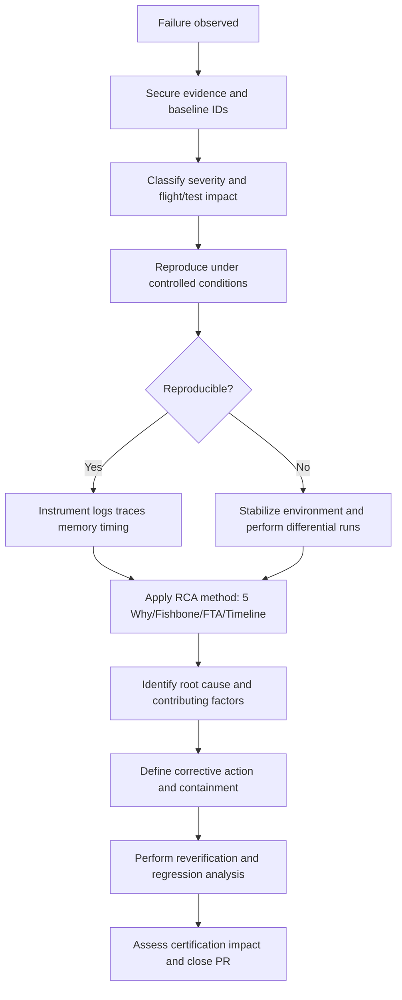
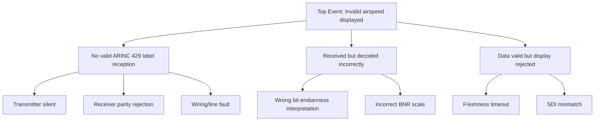
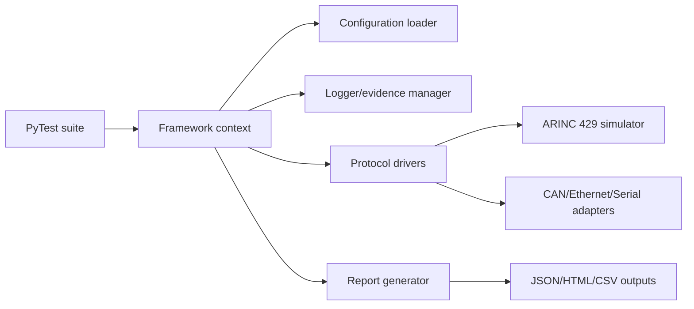
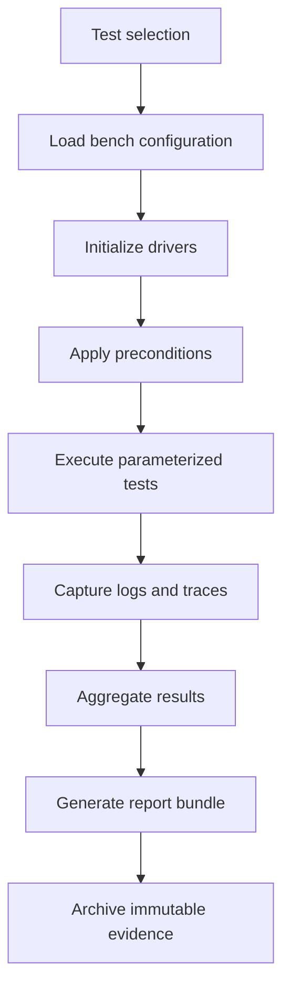
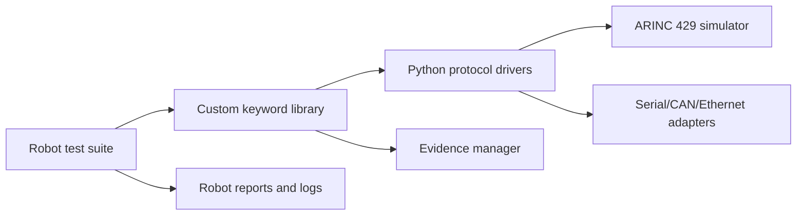
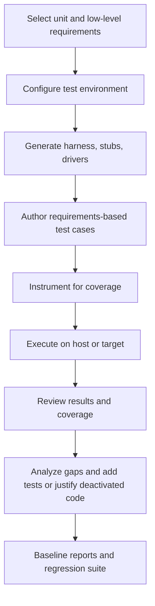
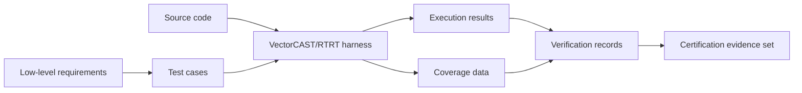
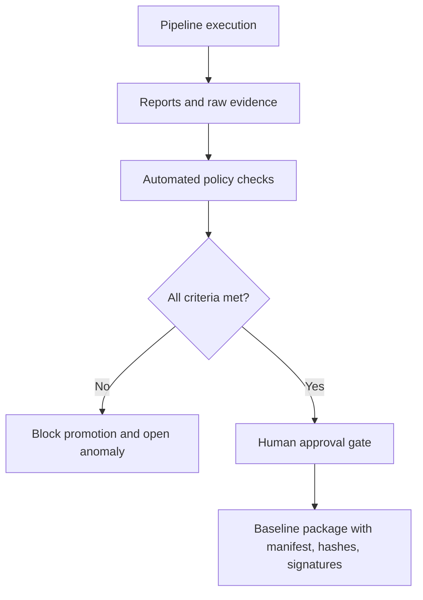

# Avionics Software Verification & Integration Study Material — Part 4

**Scope:** Modules 16-20 for senior/lead avionics software verification, integration, and certification practitioners operating in DO-178C, ARP4754A, ARP4761, DO-254, DO-330, and configuration-controlled environments.

**Audience:** Verification leads, integration leads, software leads, test architects, certification coordinators, and principal verification engineers.

---

# MODULE 16 — Root Cause Analysis & Debugging

## 16.1 Learning Objectives
- Apply structured root cause analysis (RCA) in a certification-controlled avionics environment.
- Distinguish symptom, proximate cause, contributing cause, and root cause.
- Select appropriate RCA methods for intermittent, deterministic, timing, interface, and hardware/software integration failures.
- Classify failures across requirement, design, code, integration, configuration, test, hardware, environment, and tool categories.
- Produce certification-ready investigation evidence, corrective action rationale, and regression impact assessments.
- Drive closure of anomalies without invalidating prior verification credit.

## 16.2 Prerequisites
- Working knowledge of DO-178C lifecycle objectives and verification independence.
- Familiarity with embedded debugging, interface protocols, and avionics data buses.
- Experience with software integration testing, HW/SW integration testing (HSIT), and software verification cases/procedures.
- Ability to read requirements, low-level design, source code, test scripts, logs, traces, and timing measurements.

## 16.3 Theory

### 16.3.1 RCA in avionics is not generic defect triage
In avionics programs, RCA is not merely about fixing a bug. It must answer:
1. **What failed?** Functional, timing, robustness, integrity, determinism, or verification expectation.
2. **Why did it fail?** Requirement gap, design flaw, coding error, integration mismatch, environment issue, or tool problem.
3. **What evidence proves the cause?** Reproducible traces, configuration baselines, log correlation, memory maps, interface captures, and requirement/test linkage.
4. **What is the certification implication?** Whether derived requirements, reverification, structural coverage reanalysis, or problem report updates are required.
5. **How do we prevent recurrence?** Corrective actions in process, design, code review, tool usage, or integration strategy.

### 16.3.2 Core RCA methods

#### 5 Why
Best for deterministic failures with a clear symptom chain. In avionics, every “why” should map to objective evidence, not opinion. Stop only when the answer reaches a controllable lifecycle cause.

#### Fishbone / Ishikawa
Useful when failures may emerge from combined factors such as software, hardware, procedure, environment, tools, or configuration. Particularly effective for integration benches and intermittent failures.

#### Fault Tree Analysis (FTA)
Top-down logic decomposition from undesired event to contributing events. Excellent for safety-relevant failure decomposition, especially where multiple latent conditions must align.

#### Timeline analysis
Used when the order of events matters: initialization races, timeouts, bus startup ordering, mode transitions, or fault insertion tests.

#### Log analysis
Correlates timestamps, sequence counters, status words, watchdogs, BIT results, and task execution logs. For avionics, logs must be tied to exact software load and bench configuration.

#### Reproduction strategy
A failure not reproducible under controlled conditions is difficult to certify closed. Good practice is to move from field symptom -> bench reproduction -> instrumented reproduction -> minimal reproducer.

#### Binary search / divide-and-conquer isolation
Useful for isolating failures to build version, configuration delta, feature flag, task group, label set, or bench equipment.

#### Differential testing
Run same stimulus against: old/new baseline, sim/target, board A/board B, nominal/faulted sensor, or configuration A/B. Differences localize the cause.

#### Trace analysis
Uses program traces, interface traces, scheduler traces, or memory access traces. In safety-critical debugging, traceability of the trace configuration itself matters.

### 16.3.3 Failure classification model
A strong RCA package explicitly classifies the defect. One failure may have one primary class and several contributing classes.

| Class | Definition | Typical Evidence |
|---|---|---|
| Requirement defect | Requirement ambiguous, missing, incorrect, or non-verifiable | Requirement review records, contradictory system specs, test oracle conflicts |
| Design defect | Architecture or detailed design fails to satisfy requirements | Design models, state diagrams, sequencing analysis |
| Code defect | Implementation does not realize approved design | Source diff, static analysis, debugger, unit test evidence |
| Integration defect | Interfaces between items are mismatched or incorrectly orchestrated | ICD mismatch, init ordering, data scaling, signal routing |
| Configuration defect | Wrong load, parameter set, build option, or calibration | CRC mismatch, manifest, baseline records |
| Test defect | Fault lies in procedure, script, oracle, or expected result | Script review, instrument misinterpretation, stale expected data |
| Hardware defect | Physical component or board issue | Swap test, environmental stress, manufacturing trace |
| Test-environment defect | Bench harness, power profile, simulator, timing source, or lab setup issue | Bench recreation, wiring diagrams, equipment logs |
| Tool defect | Compiler, coverage tool, test tool, or script framework malfunctions | Tool incident report, reproducer, qualified tool behavior analysis |

### 16.3.4 DO-178C perspective on debugging
DO-178C does not prescribe a debugging technique, but it does require controlled verification evidence. Therefore RCA outputs should normally include:
- anomaly/problem report ID;
- affected baselines (software, requirements, tests, tools, bench assets);
- reproducibility conditions;
- impact to requirements-based tests and structural coverage;
- independence considerations for reverification;
- configuration control records for the fix;
- closure evidence showing problem is resolved and no unintended effects were introduced.

## 16.4 Terminology
- **Anomaly:** Any condition that deviates from expected behavior, including suspected test, bench, or tool issues.
- **Containment:** Immediate action limiting operational or verification impact before permanent fix.
- **Corrective action:** Change that removes the root cause.
- **Compensating control:** Temporary mechanism reducing risk before full correction.
- **Regression scope:** Explicit set of re-tests, analyses, and reviews required after fix.
- **Failure mode:** Observable manifestation of a fault.
- **Latent defect:** Existing defect not yet activated under tested conditions.
- **Non-reproducible failure:** Failure lacking deterministic replay under current setup.
- **Problem report:** Configuration-controlled record tracking anomaly lifecycle.
- **Suspect set:** Finite list of plausible causes after initial triage.

## 16.5 Mermaid Diagrams

### 16.5.1 Avionics RCA flow


### 16.5.2 Fault tree example for loss of valid air data on display


## 16.6 Practical Examples
- Isolating an ARINC 429 label decode issue using captured words, parity statistics, and ICD comparison.
- Reproducing an intermittent scheduler overrun by freezing task phasing and replaying sensor bursts.
- Proving that a failed integration test originates from a stale calibration file rather than source code.
- Distinguishing a simulator bug from target software defect using differential execution on target hardware.

## 16.7 Required Artifacts for Production-Grade RCA
- Problem report / anomaly report.
- Reproduction procedure with exact bench setup.
- Software and hardware baseline identifiers.
- Raw evidence: bus captures, logs, traces, screenshots, lab notes.
- Analysis package: hypothesis log, eliminated causes, final cause chain.
- Corrective action request/change request.
- Verification rerun results.
- Regression matrix and certification impact memo.

## 16.8 Templates

### 16.8.1 RCA record template
| Field | Content |
|---|---|
| Problem Report ID |  |
| Detection Phase | Unit / Integration / HSIT / SWIT / Regression / Flight test |
| Affected CI |  |
| Software Load / CRC |  |
| Bench Configuration |  |
| Failure Summary |  |
| Safety / Operational Impact |  |
| Reproduction Steps |  |
| Evidence Collected |  |
| RCA Method Used |  |
| Root Cause |  |
| Contributing Causes |  |
| Corrective Action |  |
| Verification Evidence |  |
| Regression Scope |  |
| Certification Impact |  |

### 16.8.2 Regression impact template
| Area | Impact | Required Action |
|---|---|---|
| Requirements | Modified / None | Update/review/reverify |
| Low-level design | Modified / None | Review |
| Code | Modified / None | Static analysis / unit test |
| Integration tests | Affected / Not affected | Rerun subset/full |
| Coverage | Affected / Not affected | MC/DC re-run |
| Tool outputs | Affected / Not affected | Rebaseline |

## 16.9 Checklists

### 16.9.1 Investigation checklist
- [ ] Baseline identifiers captured before retest.
- [ ] Bench wiring / simulator version / power profile recorded.
- [ ] Failure reproduced or non-reproducibility formally documented.
- [ ] Time synchronization across logs established.
- [ ] Hypotheses logged and objectively eliminated.
- [ ] Root cause reaches lifecycle origin, not merely symptom.
- [ ] Corrective action addresses recurrence, not only immediate manifestation.
- [ ] Regression scope justified.
- [ ] Certification liaison informed if requirement/design changes are involved.

### 16.9.2 Closure checklist
- [ ] Fix reviewed and configuration-controlled.
- [ ] Verification repeated on affected levels.
- [ ] Negative/fault-handling paths checked.
- [ ] No unrelated deltas included.
- [ ] Problem report linked to evidence package.
- [ ] Tool issue formally tracked if tool behavior contributed.

## 16.10 Common Mistakes
- Treating the first reproducible code issue as the root cause without assessing upstream requirements or design flaws.
- Failing to capture exact test environment versions, making the failure impossible to replay.
- Closing issues with “cannot reproduce” when environment instability remains unresolved.
- Using logs with unsynchronized timestamps.
- Fixing only nominal path behavior while leaving robustness defects intact.
- Omitting certification impact assessment for requirement or design changes.
- Not challenging the test itself; many late-stage failures are actually test/oracle defects.

## 16.11 Fifteen Realistic Avionics Failure Scenarios with Complete RCA

### Scenario 1 — ARINC 429 airspeed label rejected after software load update
**System context:** Air data computer transmits label 203 (airspeed) to display processing computer over ARINC 429 low-speed bus.

**Symptoms:** Display flags airspeed invalid within 200 ms of startup on software baseline `PFD_SW_4.12.7`; prior load was nominal.

**Investigation steps:**
1. Captured bus words at receiver input and verified transmitter was active.
2. Compared label, SDI, SSM, parity, and transmission rate to ICD.
3. Replayed same stream into prior display build; prior build accepted the data.
4. Reviewed decode change set for recent data normalization refactor.
5. Instrumented receiver to log raw word and post-decode validity reason.

**Root cause:** **Code defect** caused by bitfield extraction change: SDI bits were shifted as bits 8-9 instead of 9-10 for one decode path, so label 203 from SDI 01 was rejected as source mismatch.

**Corrective action:** Restore approved bit mapping, add unit tests for SDI extraction across all supported labels, and lock decoder bitfield helpers behind a reviewed utility API.

**Verification:** Re-executed unit tests, ARINC interface tests, and startup validity tests on target; captured accepted words and nominal display behavior.

**Regression scope:** All ARINC 429 labels using shared decoder helper, plus source-selection logic and invalid-data annunciation tests.

**Certification impact:** Software-only change; low-level requirements unchanged; unit/integration reverification and structural coverage delta analysis required. Problem report linked to code review evidence.

### Scenario 2 — HSIT failure during FCC-to-actuator engagement sequence
**System context:** Flight control computer commands electro-hydraulic actuator control electronics via discrete arm/engage lines and serial status bus.

**Symptoms:** Engagement command occasionally fails on first attempt during HSIT; second attempt succeeds.

**Investigation steps:**
1. Built event timeline from FCC task log, discrete capture, and actuator status feedback.
2. Verified command ordering against interface control document.
3. Compared power-on-reset timing between bench and system integration rig.
4. Inserted microsecond-resolution timestamping around engage command sequencing.
5. Performed A/B testing with delayed status polling.

**Root cause:** **Integration defect**: FCC polled actuator-ready status 15 ms earlier than the agreed integration timing budget after an unrelated scheduler optimization. Hardware needed 25 ms longer after arm assertion.

**Corrective action:** Reinstate interface stabilization delay per ICD and convert timing assumption into explicit low-level requirement.

**Verification:** Repeated 500 engagement cycles across temperature and power profiles; no recurrence.

**Regression scope:** All engage/disengage sequences, startup mode transitions, and watchdog supervision timing.

**Certification impact:** Requirement/design clarification required because timing margin was previously implicit; impacted interface requirement trace and HSIT procedures.

### Scenario 3 — Navigation processor watchdog resets during map redraw
**System context:** Mission display application executes on partitioned processor under cyclic scheduler.

**Symptoms:** Rare watchdog reset when panning map while simultaneous weather overlay updates occur.

**Investigation steps:**
1. Collected scheduler trace and watchdog service timestamps.
2. Reproduced using recorded pilot interaction plus maximum overlay burst.
3. Performed binary search across feature flags to isolate overlay processing path.
4. Profiled worst-case execution time by task.
5. Compared measured execution against design budget.

**Root cause:** **Design defect**: shared rendering task violated partition time budget under worst-case overlay burst because design assumed average packet rate, not bounded peak rate.

**Corrective action:** Split overlay decode from render phase, rate-limit queue consumption per major frame, and update schedulability analysis.

**Verification:** Worst-case burst campaign, WCET measurements, and watchdog margin analysis completed successfully.

**Regression scope:** All display timing tests, partition budgets, and overload robustness tests.

**Certification impact:** Design data updated; timing analysis artifact requires reapproval; derived requirement added for overlay burst handling.

### Scenario 4 — Intermittent memory corruption in maintenance port service
**System context:** Maintenance application receives variable-length messages over UART while primary avionics tasks continue.

**Symptoms:** After long-duration robustness testing, unrelated status table values become corrupted.

**Investigation steps:**
1. Enabled stack canaries and heap guards in debug build.
2. Reproduced with fuzzed maintenance frames.
3. Trace analysis linked corruption onset to malformed message with oversized payload length.
4. Reviewed parser boundary checks against low-level requirements.
5. Confirmed corruption by observing write beyond receive buffer into adjacent configuration object.

**Root cause:** **Code defect**: length validation occurred after payload copy rather than before.

**Corrective action:** Validate frame header and payload length prior to copy, add defensive zeroization, and create robustness tests for malformed lengths.

**Verification:** Negative tests, static analysis, boundary-value tests, and 24-hour stress run passed.

**Regression scope:** All serial parsing modules and memory-safety-focused unit tests.

**Certification impact:** Potential robustness/safety concern; document as software anomaly with emphasis on abnormal input handling and rerun affected robustness test procedures.

### Scenario 5 — Pressure sensor channel appears failed only on one integration bench
**System context:** Engine indication subsystem reads dual analog pressure sensors through ADC front end.

**Symptoms:** Channel B saturates high only on Bench 3; software BIT flags sensor failure.

**Investigation steps:**
1. Verified source code and calibration file matched known-good benches.
2. Swapped processing LRU: issue remained on Bench 3.
3. Swapped sensor simulator channel: failure moved with bench harness input.
4. Reviewed bench wiring diagram and measured reference grounding.
5. Found incorrect harness pin termination causing floating low reference.

**Root cause:** **Test-environment defect** with hardware manifestation: miswired bench harness reference return.

**Corrective action:** Correct harness build, update bench acceptance checklist, and segregate software anomaly from bench discrepancy.

**Verification:** Electrical continuity check and repeated analog acquisition tests passed.

**Regression scope:** Bench 3 dependent tests only; no software regression required once bench certified healthy.

**Certification impact:** No airborne software change; anomaly reclassified as environment issue; prior failed runs invalidated, not credited.

### Scenario 6 — CAN gateway transmits wrong discrete bit to maintenance recorder
**System context:** Avionics gateway maps ARINC discretes into CAN status frame for maintenance subsystem.

**Symptoms:** Weight-on-wheels discrete inverted in maintenance logs although cockpit functions are unaffected.

**Investigation steps:**
1. Compared system requirement, ICD, mapping table, and generated signal database.
2. Captured source ARINC label and resulting CAN frame.
3. Checked if inversion occurred in source producer or gateway consumer.
4. Reviewed generation scripts and mapping configuration commit history.
5. Found maintenance signal configured as active-low in YAML mapping but ICD defined active-high.

**Root cause:** **Configuration defect** in mapping data, not code.

**Corrective action:** Correct configuration file, add schema rule requiring polarity field review, and require dual review for generated signal packs.

**Verification:** Regenerated artifacts, replayed captures, and validated recorder decoding.

**Regression scope:** All generated gateway mappings and maintenance recorder discretes.

**Certification impact:** Configuration item rebaseline; software binary unchanged if data-driven, but verification evidence must reflect corrected configuration baseline.

### Scenario 7 — Altitude freshness timeout during burst traffic
**System context:** Integrated modular avionics application receives ARINC 429 altitude and publishes to internal Ethernet service.

**Symptoms:** Consumers report stale altitude during simultaneous maintenance dump over Ethernet.

**Investigation steps:**
1. Timeline analysis of 429 receive interrupt, queue service, and Ethernet DMA completion.
2. Compared CPU load under nominal vs dump traffic.
3. Instrumented queue depth and dropped packet counters.
4. Disabled maintenance dump; problem disappeared.
5. Analyzed locking in shared buffer manager.

**Root cause:** **Design defect**: high-priority Ethernet buffer recycling held a mutex needed by the altitude publisher, creating blocking long enough to violate freshness threshold.

**Corrective action:** Remove blocking shared mutex from real-time path, introduce lock-free single-producer/single-consumer ring for altitude publication.

**Verification:** Stress under max maintenance traffic with timing monitors; no stale data detected.

**Regression scope:** Real-time data publication paths, priority inversion analysis, and CPU load margin tests.

**Certification impact:** Design and code updates; concurrency rationale and timing verification evidence updated.

### Scenario 8 — BIT falsely reports gyro failure after cold start
**System context:** AHRS BIT logic validates gyro stability within first 2 seconds after power-on.

**Symptoms:** False fail only at low temperature during environmental chamber tests.

**Investigation steps:**
1. Correlated temperature profile with sensor stabilization time.
2. Compared sensor vendor startup data sheet to software assumption.
3. Reviewed system requirement wording for sensor-ready criteria.
4. Reproduced across multiple hardware units.
5. Determined software timeout shorter than hardware worst-case spec at cold conditions.

**Root cause:** **Requirement defect**: startup validation timing requirement omitted low-temperature stabilization allowance.

**Corrective action:** Update requirement to reflect qualified sensor startup envelope; revise BIT logic and test procedures.

**Verification:** Chamber retest across qualified temperature range with updated timing limits.

**Regression scope:** Power-up BIT, dispatch inhibit logic, maintenance indications.

**Certification impact:** Requirement change with downstream test and design updates; certification review needed because abnormal indication criteria changed.

### Scenario 9 — Differential GPS data rejected after library upgrade
**System context:** Navigation application parses Ethernet UDP DGPS corrections using shared checksum library.

**Symptoms:** All correction packets rejected after integration of common services library v6.4.

**Investigation steps:**
1. Differential-tested old and new builds with identical recorded packets.
2. Verified network captures were bit-identical.
3. Compared checksum intermediate values.
4. Reviewed library change log.
5. Found byte-order conversion added for another consumer but incorrectly enabled for DGPS parser path.

**Root cause:** **Integration defect** caused by incompatible shared-library behavior introduced without interface impact analysis.

**Corrective action:** Add API contract tests for checksum library consumers and isolate endianness conversion to caller-specific adapters.

**Verification:** Packet replay campaign and library regression suite passed.

**Regression scope:** All applications using the shared checksum service.

**Certification impact:** Shared software component change requires multi-program impact review if component is reused across projects.

### Scenario 10 — Structural coverage tool reports uncovered defensive code unexpectedly
**System context:** Level A flight-control module verified with qualified coverage instrumentation.

**Symptoms:** MC/DC report shows previously covered decision now uncovered after build-system cleanup.

**Investigation steps:**
1. Compared compilation flags, instrumentation switches, and object map files.
2. Confirmed tests themselves were unchanged.
3. Reviewed build script change.
4. Reproduced on isolated machine.
5. Determined one object was linked from stale non-instrumented archive due to cache path precedence.

**Root cause:** **Tool/configuration defect** in build orchestration: stale archive selection invalidated coverage data.

**Corrective action:** Make build directories immutable per configuration, add manifest verification for instrumented objects, and clean caches on coverage runs.

**Verification:** Rebuilt from clean environment, validated object provenance, reran coverage suite.

**Regression scope:** All coverage builds and toolchain scripts.

**Certification impact:** Prior coverage evidence under affected build invalid; regenerate and rebaseline coverage data.

### Scenario 11 — Flight plan upload fails only with maximum waypoint count
**System context:** FMS accepts route uploads over Ethernet from mission planning station.

**Symptoms:** Upload rejected with generic “format error” only when route contains 99 waypoints.

**Investigation steps:**
1. Reproduced using incremental waypoint counts.
2. Binary search isolated failure boundary at 65+ waypoints.
3. Inspected parser and internal route object limits.
4. Cross-checked low-level requirement and interface spec.
5. Discovered internal index stored in 6-bit field though requirement permitted 99 waypoints.

**Root cause:** **Design defect** with implementation consequence: internal data representation incompatible with approved requirement capacity.

**Corrective action:** Expand index field, update serialization checks, add boundary-value tests at max route size.

**Verification:** Route upload tests at 0, 1, 64, 65, 98, and 99 waypoints passed.

**Regression scope:** Route editing, storage, recall, and erase functions.

**Certification impact:** Design and code data changed; boundary requirement compliance evidence updated.

### Scenario 12 — Spurious mode transition during dual-sensor disagreement
**System context:** Engine control display selects primary source based on sensor validity and confidence monitors.

**Symptoms:** Mode flips from normal to reversionary during fast throttle movement despite both sensors being healthy.

**Investigation steps:**
1. Captured sensor values, validity bits, and disagreement monitor output.
2. Replayed analog traces offline.
3. Examined filter time constants and hysteresis requirements.
4. Identified disagreement comparator used unfiltered value on one channel and filtered value on the other.
5. Confirmed transient mismatch exceeded threshold for 1 frame.

**Root cause:** **Code defect** in comparator path selection.

**Corrective action:** Use consistent filtered data paths and add transient-throttle regression tests.

**Verification:** Dynamic sensor profile tests with accelerated throttle traces passed.

**Regression scope:** Sensor monitor logic, source selection, and display mode transitions.

**Certification impact:** Software reverification with emphasis on abnormal handling and human-factors-adjacent indications.

### Scenario 13 — Integration test failure due to stale test oracle
**System context:** Autopilot mode annunciation software changed requirement wording from “ARM” to “ARMED” on maintenance page only.

**Symptoms:** Automated regression fails string comparison on maintenance Ethernet telemetry; cockpit HMI remains correct.

**Investigation steps:**
1. Reviewed change request and affected requirements.
2. Verified source output matched updated requirement.
3. Inspected regression oracle dataset.
4. Found expected-value file still contained old token `ARM`.
5. Confirmed no airborne behavior defect.

**Root cause:** **Test defect**: outdated automated oracle.

**Corrective action:** Update test data under configuration control and require test asset impact review on textual requirement changes.

**Verification:** Reran regression with corrected oracle; pass confirmed.

**Regression scope:** Only affected maintenance page telemetry tests.

**Certification impact:** No software change; verification artifact update only. Failed test run cannot be counted until oracle corrected and rerun.

### Scenario 14 — HSIT serial link drops data every 256 frames
**System context:** Mission computer sends binary packets over RS-422 to stores management unit.

**Symptoms:** Receiver drops frame 256, 512, 768, etc., causing mission inventory mismatch.

**Investigation steps:**
1. Captured serial traffic and receiver diagnostics.
2. Counted sequence behavior around failing frames.
3. Ran differential test against simulator and actual SMU.
4. Reviewed packet counter implementation.
5. Found sequence counter wrap from 255 to 0 was legal by ICD, but receiver acceptance logic rejected zero as “uninitialized.”

**Root cause:** **Requirement/design defect** in receiver component: ICD interpretation failed to define wrap acceptance, and implementation encoded an invalid assumption.

**Corrective action:** Clarify ICD/requirement, accept modulo-256 wrap, and add interface conformance tests.

**Verification:** Long-run transfer over 5000 frames on real hardware passed.

**Regression scope:** All serial sequencing, startup initialization, and resynchronization paths.

**Certification impact:** Interface requirement clarification required across both sending and receiving LRUs.

### Scenario 15 — Tool-generated ARINC label table omits one label after CSV update
**System context:** Build process generates decode tables from controlled ICD CSV for mission data processor.

**Symptoms:** One optional maintenance label is never decoded in new build; generated source lacks entry.

**Investigation steps:**
1. Compared CSV versions and generated outputs.
2. Re-ran generator with verbose logging.
3. Inspected parser behavior for empty optional field in new CSV row.
4. Determined generator stopped processing row when optional “comment” column contained embedded comma without quoting.
5. Since generator was unqualified, downstream review had not detected missing table row.

**Root cause:** Primary **tool defect** and secondary **process defect** (insufficient output verification for unqualified generator).

**Corrective action:** Fix parser, add generator regression tests, and add independent review/checksum of generated label counts against ICD.

**Verification:** Regenerated tables, compared row counts, reran maintenance label tests.

**Regression scope:** All generated protocol tables and build-generation scripts.

**Certification impact:** If tool is not qualified, output verification must be strengthened. Potential need to reassess previously generated artifacts for similar omissions.

## 16.12 Case Studies

### Case Study A — Intermittent startup race across federated LRUs
A distributed display/mission system showed one failed startup in approximately 40 cycles. Independent teams first suspected software instability, but a cross-LRU timeline revealed Ethernet link establishment, NTP sync, and source-selection deadlines were sequenced differently across rigs. The real root cause was an integration requirement gap: startup data-valid deadlines assumed all sources were synchronized before the display declared operational. Corrective action was not merely to add retries, but to define explicit startup states, validity grace periods, and synchronized interface readiness conditions.

### Case Study B — False software blame during mixed HW/SW anomaly
An actuator health monitor repeatedly reported overcurrent. Software engineers prepared a threshold change, but Fishbone analysis forced examination of power supply, harness, environmental setup, software thresholds, and data acquisition equipment. Eventually, a lab supply transient during mode switching induced the current spike. The case demonstrates why avionics RCA must remain evidence-led and why changing airborne software to mask a bench defect is unacceptable.

## 16.13 Exercises
1. Given a log set with unsynchronized clocks, define a normalization approach before conducting timeline analysis.
2. Build a Fishbone diagram for intermittent ARINC 429 parity failures.
3. Write a regression scope for a defect fix that changes buffer ownership in a high-priority receive task.
4. For Scenario 10, define the evidence needed to invalidate and regenerate structural coverage credit.

## 16.14 Mini-Project
Create a full RCA package for a simulated “stale altitude on display” problem. Include:
- problem report;
- reproduction procedure;
- timeline analysis table;
- at least two rejected hypotheses;
- final root cause classification;
- corrective action;
- regression matrix;
- certification impact note.

## 16.15 Assessment
- Explain why “cannot reproduce” is not an acceptable closure statement without environment disposition.
- Compare 5 Why and Fault Tree Analysis for a multi-contributing avionics integration anomaly.
- Define the minimum evidence set required to credit a debug investigation in a DO-178C program.
- Describe how you would protect prior verification credit while fixing a shared library defect.

---

# MODULE 17 — Test Automation

## 17.1 Learning Objectives
- Build production-grade Python automation for avionics verification campaigns.
- Apply PyTest fixtures, parametrization, reporting, logging, and configuration control to interface verification.
- Structure automation to support determinism, traceability, and evidence capture suitable for certification projects.
- Integrate simulated drivers for ARINC 429, CAN, Ethernet, and serial-based verification.
- Separate framework code, drivers, test data, reports, logs, and utilities to support scalable regression.

## 17.2 Prerequisites
- Python fundamentals: modules, classes, typing, exceptions, context managers, dataclasses.
- Familiarity with PyTest concepts.
- Understanding of avionics interfaces, ICDs, and verification procedures.
- Knowledge of DO-178C verification evidence and configuration control.

## 17.3 Theory

### 17.3.1 Why avionics automation differs from generic QA automation
Avionics automation must demonstrate:
- deterministic stimulus and observation;
- controlled test data and versions;
- reproducible environment setup;
- reliable timestamps and synchronized logs;
- traceability from test to requirement;
- clear pass/fail criteria with certification-friendly artifacts.

Typical web/app testing patterns are insufficient because avionics test systems interact with embedded targets, bus simulators, benches, and timing constraints. Test scripts often need to preserve evidence chains rather than merely signal pass/fail.

### 17.3.2 Python automation building blocks
- **PyTest:** execution model, fixtures, markers, parametrization, assertion introspection.
- **Robot Framework basics:** keyword-driven readability for procedure-like flows.
- **Logging:** structured, timestamped, run-scoped evidence capture.
- **Test data:** immutable, versioned input vectors and expected outcomes.
- **Configuration:** bench IDs, load IDs, interface settings, timing tolerances.
- **Fixtures:** session/module/function scoped resources with setup/teardown discipline.
- **Reporting:** machine-readable JSON plus human-readable HTML/Markdown/PDF-compatible summaries.
- **Regression management:** subsets by platform, interface, severity, requirement tags, and change impact.

### 17.3.3 Production-grade framework architecture
```text
tests/
framework/
drivers/
configuration/
reports/
logs/
utilities/
```

**Recommended responsibilities**
- `tests/`: requirement-based test cases and suite organization.
- `framework/`: base classes, context, evidence management, common assertions.
- `drivers/`: protocol and hardware abstractions.
- `configuration/`: YAML/JSON/TOML inputs, schema checks, environment definitions.
- `reports/`: result serialization and report rendering.
- `logs/`: per-run raw logs and captures.
- `utilities/`: retry, timing, conversion, CRC, file helpers.

### 17.3.4 Automation lifecycle in a DO-178C context
1. Baseline test assets.
2. Verify tool/environment suitability.
3. Prepare deterministic setup.
4. Run tests with traceable IDs and version stamps.
5. Capture raw evidence and processed reports.
6. Review failed tests for software vs test/bench/tool cause.
7. Re-run affected subsets after correction.
8. Archive immutable artifacts.

## 17.4 Terminology
- **Harness:** Code coordinating setup, stimulus, observation, and teardown.
- **Fixture:** Reusable PyTest setup/teardown object.
- **Oracle:** Logic or dataset deciding expected result.
- **Stimulus profile:** Defined sequence of commands, inputs, or bus frames.
- **Test vector:** Controlled input/output expectation set.
- **Evidence package:** Results, logs, captures, and configuration proving execution.
- **Trace ID:** Unique identifier linking test execution to artifacts.

## 17.5 Mermaid Diagrams

### 17.5.1 Automation architecture


### 17.5.2 Regression execution flow


## 17.6 Practical Examples
- Automating ARINC 429 transmit/receive validation with parity, SDI, and freshness checks.
- Running a serial maintenance robustness suite with malformed frames.
- Parameterizing tests across nominal and abnormal sensor values.
- Producing JSON and Markdown summary reports for anomaly review boards.

## 17.7 Artifacts
- Test automation framework design description.
- Version-controlled configuration files.
- Requirement-to-test mapping.
- Execution logs, bus captures, and reports.
- Tool operational requirements if framework outputs are used as verification evidence.

## 17.8 Templates

### 17.8.1 Test case metadata template
| Field | Example |
|---|---|
| Test ID | ITF-ARINC-203-001 |
| Requirement IDs | LLR-ARINC-DEC-045, HLR-ADC-012 |
| Bench ID | BENCH-HSIT-04 |
| Load ID | PFD_SW_4.12.7 |
| Precondition | Receiver initialized, bus idle |
| Stimulus | Send label 203 with SDI 01 at 100 Hz |
| Expected Result | Data accepted, value within tolerance, no invalid flag |

### 17.8.2 Automation readiness checklist
- [ ] Bench configuration file approved.
- [ ] Test data versioned and checksummed.
- [ ] Driver simulation limits documented.
- [ ] Logging path and retention policy defined.
- [ ] Report schema stable and reviewed.
- [ ] Retry rules do not mask deterministic failures.

## 17.9 Production-Quality Python Code Examples (500+ lines)

### 17.9.1 `framework/logging_manager.py`
```python
from __future__ import annotations

import json
import logging
import logging.handlers
from dataclasses import asdict, dataclass
from datetime import datetime, timezone
from pathlib import Path
from typing import Any, Dict, Optional


@dataclass(frozen=True)
class ExecutionMetadata:
    run_id: str
    bench_id: str
    software_load: str
    project: str
    operator: str
    started_at_utc: str


class JsonLineFormatter(logging.Formatter):
    def format(self, record: logging.LogRecord) -> str:
        payload: Dict[str, Any] = {
            "timestamp": datetime.now(timezone.utc).isoformat(),
            "level": record.levelname,
            "logger": record.name,
            "message": record.getMessage(),
            "module": record.module,
            "line": record.lineno,
        }
        if hasattr(record, "context"):
            payload["context"] = getattr(record, "context")
        if record.exc_info:
            payload["exception"] = self.formatException(record.exc_info)
        return json.dumps(payload, sort_keys=True)


class LoggingManager:
    def __init__(self, output_dir: Path, metadata: ExecutionMetadata) -> None:
        self.output_dir = output_dir
        self.metadata = metadata
        self.output_dir.mkdir(parents=True, exist_ok=True)
        self._root_logger = logging.getLogger(f"avionics.{metadata.run_id}")
        self._root_logger.setLevel(logging.DEBUG)
        self._root_logger.propagate = False
        self._configured = False

    def configure(self) -> logging.Logger:
        if self._configured:
            return self._root_logger

        for handler in list(self._root_logger.handlers):
            self._root_logger.removeHandler(handler)

        text_handler = logging.handlers.RotatingFileHandler(
            self.output_dir / "execution.log",
            maxBytes=5_000_000,
            backupCount=3,
            encoding="utf-8",
        )
        text_handler.setLevel(logging.INFO)
        text_handler.setFormatter(
            logging.Formatter(
                "%(asctime)s %(levelname)s %(name)s %(message)s",
                datefmt="%Y-%m-%dT%H:%M:%S",
            )
        )

        json_handler = logging.handlers.RotatingFileHandler(
            self.output_dir / "execution.jsonl",
            maxBytes=5_000_000,
            backupCount=3,
            encoding="utf-8",
        )
        json_handler.setLevel(logging.DEBUG)
        json_handler.setFormatter(JsonLineFormatter())

        console_handler = logging.StreamHandler()
        console_handler.setLevel(logging.INFO)
        console_handler.setFormatter(
            logging.Formatter("%(levelname)s %(name)s %(message)s")
        )

        self._root_logger.addHandler(text_handler)
        self._root_logger.addHandler(json_handler)
        self._root_logger.addHandler(console_handler)
        self._write_metadata()
        self._configured = True
        return self._root_logger

    def child(self, name: str) -> logging.Logger:
        if not self._configured:
            self.configure()
        return self._root_logger.getChild(name)

    def _write_metadata(self) -> None:
        metadata_path = self.output_dir / "run_metadata.json"
        metadata_path.write_text(
            json.dumps(asdict(self.metadata), indent=2, sort_keys=True),
            encoding="utf-8",
        )

    def bind_context(
        self,
        logger: logging.Logger,
        **context: Any,
    ) -> logging.LoggerAdapter:
        return logging.LoggerAdapter(logger, extra={"context": context})

    @staticmethod
    def utc_now() -> str:
        return datetime.now(timezone.utc).isoformat()

    @staticmethod
    def from_values(
        output_dir: Path,
        run_id: str,
        bench_id: str,
        software_load: str,
        project: str,
        operator: str,
    ) -> "LoggingManager":
        metadata = ExecutionMetadata(
            run_id=run_id,
            bench_id=bench_id,
            software_load=software_load,
            project=project,
            operator=operator,
            started_at_utc=LoggingManager.utc_now(),
        )
        manager = LoggingManager(output_dir=output_dir, metadata=metadata)
        manager.configure()
        return manager
```

### 17.9.2 `framework/test_context.py`
```python
from __future__ import annotations

import hashlib
import json
from dataclasses import dataclass, field
from pathlib import Path
from typing import Any, Dict, List, Optional

from framework.logging_manager import LoggingManager


@dataclass
class EvidenceItem:
    name: str
    category: str
    path: str
    description: str
    checksum_sha256: Optional[str] = None


@dataclass
class RequirementTrace:
    test_id: str
    requirement_ids: List[str]


@dataclass
class TestContext:
    run_id: str
    bench_id: str
    software_load: str
    output_dir: Path
    logger_manager: LoggingManager
    environment: Dict[str, Any]
    traces: List[RequirementTrace] = field(default_factory=list)
    evidence: List[EvidenceItem] = field(default_factory=list)
    annotations: Dict[str, Any] = field(default_factory=dict)

    def register_requirement_trace(
        self,
        test_id: str,
        requirement_ids: List[str],
    ) -> None:
        self.traces.append(
            RequirementTrace(test_id=test_id, requirement_ids=requirement_ids)
        )
        self.logger_manager.child("trace").info(
            "Registered requirement trace for %s -> %s",
            test_id,
            requirement_ids,
        )

    def add_annotation(self, key: str, value: Any) -> None:
        self.annotations[key] = value
        self.logger_manager.child("context").debug(
            "Annotation updated: %s=%r",
            key,
            value,
        )

    def add_evidence(
        self,
        name: str,
        category: str,
        path: Path,
        description: str,
        checksum: bool = True,
    ) -> EvidenceItem:
        item = EvidenceItem(
            name=name,
            category=category,
            path=str(path),
            description=description,
            checksum_sha256=self._checksum(path) if checksum else None,
        )
        self.evidence.append(item)
        self.logger_manager.child("evidence").info(
            "Added evidence item %s (%s)",
            name,
            category,
        )
        return item

    def persist_manifest(self) -> Path:
        manifest_path = self.output_dir / "evidence_manifest.json"
        payload = {
            "run_id": self.run_id,
            "bench_id": self.bench_id,
            "software_load": self.software_load,
            "environment": self.environment,
            "annotations": self.annotations,
            "traces": [trace.__dict__ for trace in self.traces],
            "evidence": [item.__dict__ for item in self.evidence],
        }
        manifest_path.write_text(
            json.dumps(payload, indent=2, sort_keys=True),
            encoding="utf-8",
        )
        return manifest_path

    def create_run_subdirectory(self, relative_name: str) -> Path:
        directory = self.output_dir / relative_name
        directory.mkdir(parents=True, exist_ok=True)
        return directory

    @staticmethod
    def _checksum(path: Path) -> str:
        digest = hashlib.sha256()
        with path.open("rb") as handle:
            for chunk in iter(lambda: handle.read(8192), b""):
                digest.update(chunk)
        return digest.hexdigest()
```

### 17.9.3 `framework/base_test.py`
```python
from __future__ import annotations

import json
import time
from dataclasses import dataclass
from pathlib import Path
from typing import Any, Dict, Iterable, List, Protocol

from framework.test_context import TestContext


class SupportsHealthCheck(Protocol):
    def health_check(self) -> Dict[str, Any]:
        ...


@dataclass
class RequirementBasedTestMetadata:
    test_id: str
    title: str
    requirement_ids: List[str]
    objective: str
    level: str


class BaseAvionicsTest:
    def __init__(self, context: TestContext, metadata: RequirementBasedTestMetadata) -> None:
        self.context = context
        self.metadata = metadata
        self.logger = self.context.logger_manager.child(self.metadata.test_id)
        self.context.register_requirement_trace(
            test_id=self.metadata.test_id,
            requirement_ids=self.metadata.requirement_ids,
        )

    def verify_dependencies(self, *resources: SupportsHealthCheck) -> None:
        for resource in resources:
            status = resource.health_check()
            self.logger.info("Dependency health check: %s", status)
            if not status.get("healthy", False):
                raise RuntimeError(f"Dependency unhealthy: {status}")

    def step(self, description: str) -> None:
        self.logger.info("STEP %s", description)

    def attach_json(self, name: str, payload: Dict[str, Any]) -> Path:
        attachment_dir = self.context.create_run_subdirectory("attachments")
        output_path = attachment_dir / f"{name}.json"
        output_path.write_text(
            json.dumps(payload, indent=2, sort_keys=True),
            encoding="utf-8",
        )
        self.context.add_evidence(
            name=name,
            category="json_attachment",
            path=output_path,
            description=f"Structured attachment for {self.metadata.test_id}",
        )
        return output_path

    def wait_until(
        self,
        predicate,
        timeout_s: float,
        poll_interval_s: float = 0.05,
        description: str = "condition",
    ) -> None:
        deadline = time.monotonic() + timeout_s
        while time.monotonic() < deadline:
            if predicate():
                return
            time.sleep(poll_interval_s)
        raise TimeoutError(f"Timed out waiting for {description}")

    def assert_within_tolerance(
        self,
        actual: float,
        expected: float,
        tolerance: float,
        label: str,
    ) -> None:
        delta = abs(actual - expected)
        self.logger.info(
            "Asserting %s actual=%s expected=%s tolerance=%s delta=%s",
            label,
            actual,
            expected,
            tolerance,
            delta,
        )
        assert delta <= tolerance, (
            f"{label} out of tolerance: actual={actual} expected={expected} "
            f"tolerance={tolerance} delta={delta}"
        )

    def assert_all(self, checks: Iterable[tuple[bool, str]]) -> None:
        failures = [message for passed, message in checks if not passed]
        if failures:
            for failure in failures:
                self.logger.error("CHECK FAILED %s", failure)
            raise AssertionError("; ".join(failures))

    def record_timing_sample(self, name: str, elapsed_ms: float) -> None:
        self.logger.info("Timing sample %s=%0.3f ms", name, elapsed_ms)
        self.context.add_annotation(f"timing.{name}", elapsed_ms)
```

### 17.9.4 `drivers/arinc429.py`
```python
from __future__ import annotations

import queue
import random
import threading
import time
from dataclasses import dataclass
from typing import Dict, Iterable, List, Optional


@dataclass(frozen=True)
class Arinc429Word:
    label: int
    sdi: int
    data: int
    ssm: int
    parity: int

    def to_int(self) -> int:
        word = 0
        word |= self._reverse_label_bits(self.label) & 0xFF
        word |= (self.sdi & 0b11) << 8
        word |= (self.data & 0x7FFFF) << 10
        word |= (self.ssm & 0b11) << 29
        word |= (self.parity & 0b1) << 31
        return word

    @staticmethod
    def _reverse_label_bits(value: int) -> int:
        result = 0
        for index in range(8):
            if value & (1 << index):
                result |= 1 << (7 - index)
        return result

    @classmethod
    def from_int(cls, raw: int) -> "Arinc429Word":
        raw_label = raw & 0xFF
        label = cls._reverse_label_bits(raw_label)
        sdi = (raw >> 8) & 0b11
        data = (raw >> 10) & 0x7FFFF
        ssm = (raw >> 29) & 0b11
        parity = (raw >> 31) & 0b1
        return cls(label=label, sdi=sdi, data=data, ssm=ssm, parity=parity)

    def has_valid_odd_parity(self) -> bool:
        raw = self.to_int()
        return bin(raw).count("1") % 2 == 1


@dataclass
class CaptureRecord:
    timestamp_s: float
    channel: str
    direction: str
    raw_word: int


class Arinc429SimulatedDriver:
    def __init__(self, channel_name: str, speed_bps: int = 12_500) -> None:
        self.channel_name = channel_name
        self.speed_bps = speed_bps
        self._rx_queue: "queue.Queue[int]" = queue.Queue()
        self._captures: List[CaptureRecord] = []
        self._lock = threading.Lock()
        self._healthy = True
        self._running = False
        self._tx_delay_s = 0.0
        self._drop_labels: set[int] = set()
        self._parity_error_labels: set[int] = set()
        self._random_seed = 42
        self._rng = random.Random(self._random_seed)

    def health_check(self) -> Dict[str, object]:
        return {
            "healthy": self._healthy,
            "channel": self.channel_name,
            "speed_bps": self.speed_bps,
            "running": self._running,
        }

    def start(self) -> None:
        self._running = True

    def stop(self) -> None:
        self._running = False

    def reset(self) -> None:
        with self._lock:
            while not self._rx_queue.empty():
                try:
                    self._rx_queue.get_nowait()
                except queue.Empty:
                    break
            self._captures.clear()
            self._drop_labels.clear()
            self._parity_error_labels.clear()
            self._tx_delay_s = 0.0
        self._running = False

    def configure_fault_injection(
        self,
        *,
        drop_labels: Optional[Iterable[int]] = None,
        parity_error_labels: Optional[Iterable[int]] = None,
        tx_delay_s: float = 0.0,
    ) -> None:
        with self._lock:
            self._drop_labels = set(drop_labels or [])
            self._parity_error_labels = set(parity_error_labels or [])
            self._tx_delay_s = tx_delay_s

    def send_word(self, word: Arinc429Word) -> None:
        if not self._running:
            raise RuntimeError("ARINC 429 driver not started")

        time.sleep(self._tx_delay_s)
        raw = word.to_int()
        with self._lock:
            if word.label in self._drop_labels:
                self._captures.append(
                    CaptureRecord(
                        timestamp_s=time.monotonic(),
                        channel=self.channel_name,
                        direction="drop",
                        raw_word=raw,
                    )
                )
                return
            if word.label in self._parity_error_labels:
                raw ^= 1 << 31
            self._captures.append(
                CaptureRecord(
                    timestamp_s=time.monotonic(),
                    channel=self.channel_name,
                    direction="tx",
                    raw_word=raw,
                )
            )
            self._rx_queue.put(raw)

    def send_bnr(
        self,
        *,
        label: int,
        value: float,
        resolution: float,
        sdi: int = 0,
        ssm: int = 0,
    ) -> None:
        scaled = int(round(value / resolution))
        masked = scaled & 0x7FFFF
        word = Arinc429Word(
            label=label,
            sdi=sdi,
            data=masked,
            ssm=ssm,
            parity=0,
        )
        parity = self._compute_odd_parity(word.to_int() & ~(1 << 31))
        final_word = Arinc429Word(
            label=word.label,
            sdi=word.sdi,
            data=word.data,
            ssm=word.ssm,
            parity=parity,
        )
        self.send_word(final_word)

    def receive_word(self, timeout_s: float = 0.5) -> Arinc429Word:
        if not self._running:
            raise RuntimeError("ARINC 429 driver not started")
        raw = self._rx_queue.get(timeout=timeout_s)
        with self._lock:
            self._captures.append(
                CaptureRecord(
                    timestamp_s=time.monotonic(),
                    channel=self.channel_name,
                    direction="rx",
                    raw_word=raw,
                )
            )
        return Arinc429Word.from_int(raw)

    def receive_label(self, label: int, timeout_s: float = 1.0) -> Arinc429Word:
        deadline = time.monotonic() + timeout_s
        while time.monotonic() < deadline:
            word = self.receive_word(timeout_s=timeout_s)
            if word.label == label:
                return word
        raise TimeoutError(f"Timed out waiting for label {label}")

    def drain_captures(self) -> List[CaptureRecord]:
        with self._lock:
            captures = list(self._captures)
            self._captures.clear()
        return captures

    def get_capture_summary(self) -> Dict[str, int]:
        with self._lock:
            summary: Dict[str, int] = {"tx": 0, "rx": 0, "drop": 0}
            for record in self._captures:
                summary[record.direction] = summary.get(record.direction, 0) + 1
            return summary

    def publish_periodic_bnr(
        self,
        *,
        label: int,
        values: Iterable[float],
        resolution: float,
        period_s: float,
        stop_after_frames: Optional[int] = None,
    ) -> int:
        frames_sent = 0
        for value in values:
            if stop_after_frames is not None and frames_sent >= stop_after_frames:
                break
            self.send_bnr(
                label=label,
                value=value,
                resolution=resolution,
            )
            frames_sent += 1
            time.sleep(period_s)
        return frames_sent

    def inject_random_bus_noise(
        self,
        *,
        frame_count: int,
        label_range: range = range(1, 256),
    ) -> None:
        for _ in range(frame_count):
            label = self._rng.choice(list(label_range))
            data = self._rng.randint(0, 0x7FFFF)
            sdi = self._rng.randint(0, 3)
            ssm = self._rng.randint(0, 3)
            word = Arinc429Word(label=label, sdi=sdi, data=data, ssm=ssm, parity=0)
            parity = self._compute_odd_parity(word.to_int() & ~(1 << 31))
            final_word = Arinc429Word(
                label=word.label,
                sdi=word.sdi,
                data=word.data,
                ssm=word.ssm,
                parity=parity,
            )
            self.send_word(final_word)

    @staticmethod
    def decode_bnr_value(word: Arinc429Word, resolution: float) -> float:
        data = word.data
        if data & (1 << 18):
            data -= 1 << 19
        return data * resolution

    @staticmethod
    def _compute_odd_parity(raw_without_parity: int) -> int:
        return 0 if bin(raw_without_parity).count("1") % 2 == 1 else 1
```

### 17.9.5 `configuration/config_loader.py`
```python
from __future__ import annotations

import json
from dataclasses import dataclass
from pathlib import Path
from typing import Any, Dict, List, Optional

import yaml


@dataclass(frozen=True)
class BenchInterfaceConfig:
    arinc_channel: str
    arinc_speed_bps: int
    serial_port: str
    ethernet_interface: str
    can_channel: str


@dataclass(frozen=True)
class TimingConfig:
    default_timeout_s: float
    freshness_limit_ms: float
    startup_delay_s: float


@dataclass(frozen=True)
class ProjectConfig:
    project_name: str
    bench_id: str
    software_load: str
    operator: str
    interfaces: BenchInterfaceConfig
    timing: TimingConfig
    requirement_map: Dict[str, List[str]]


class ConfigurationError(RuntimeError):
    pass


class ConfigLoader:
    REQUIRED_TOP_LEVEL_KEYS = {
        "project_name",
        "bench_id",
        "software_load",
        "operator",
        "interfaces",
        "timing",
        "requirement_map",
    }

    def __init__(self, config_path: Path) -> None:
        self.config_path = config_path

    def load(self) -> ProjectConfig:
        raw = self._read_config_file()
        self._validate_top_level(raw)
        interfaces = self._parse_interfaces(raw["interfaces"])
        timing = self._parse_timing(raw["timing"])
        requirement_map = self._parse_requirement_map(raw["requirement_map"])
        return ProjectConfig(
            project_name=str(raw["project_name"]),
            bench_id=str(raw["bench_id"]),
            software_load=str(raw["software_load"]),
            operator=str(raw["operator"]),
            interfaces=interfaces,
            timing=timing,
            requirement_map=requirement_map,
        )

    def _read_config_file(self) -> Dict[str, Any]:
        if not self.config_path.exists():
            raise ConfigurationError(f"Configuration file missing: {self.config_path}")
        content = self.config_path.read_text(encoding="utf-8")
        if self.config_path.suffix in {".yaml", ".yml"}:
            return yaml.safe_load(content)
        if self.config_path.suffix == ".json":
            return json.loads(content)
        raise ConfigurationError(
            f"Unsupported configuration extension: {self.config_path.suffix}"
        )

    def _validate_top_level(self, raw: Dict[str, Any]) -> None:
        missing = self.REQUIRED_TOP_LEVEL_KEYS - raw.keys()
        if missing:
            raise ConfigurationError(
                f"Missing required configuration keys: {sorted(missing)}"
            )

    def _parse_interfaces(self, raw: Dict[str, Any]) -> BenchInterfaceConfig:
        required = {
            "arinc_channel",
            "arinc_speed_bps",
            "serial_port",
            "ethernet_interface",
            "can_channel",
        }
        missing = required - raw.keys()
        if missing:
            raise ConfigurationError(f"Missing interface keys: {sorted(missing)}")
        return BenchInterfaceConfig(
            arinc_channel=str(raw["arinc_channel"]),
            arinc_speed_bps=int(raw["arinc_speed_bps"]),
            serial_port=str(raw["serial_port"]),
            ethernet_interface=str(raw["ethernet_interface"]),
            can_channel=str(raw["can_channel"]),
        )

    def _parse_timing(self, raw: Dict[str, Any]) -> TimingConfig:
        required = {"default_timeout_s", "freshness_limit_ms", "startup_delay_s"}
        missing = required - raw.keys()
        if missing:
            raise ConfigurationError(f"Missing timing keys: {sorted(missing)}")
        return TimingConfig(
            default_timeout_s=float(raw["default_timeout_s"]),
            freshness_limit_ms=float(raw["freshness_limit_ms"]),
            startup_delay_s=float(raw["startup_delay_s"]),
        )

    def _parse_requirement_map(self, raw: Dict[str, Any]) -> Dict[str, List[str]]:
        requirement_map: Dict[str, List[str]] = {}
        for test_id, req_ids in raw.items():
            if not isinstance(req_ids, list) or not all(
                isinstance(item, str) for item in req_ids
            ):
                raise ConfigurationError(
                    f"Requirement map for {test_id} must be a list of strings"
                )
            requirement_map[str(test_id)] = req_ids
        return requirement_map

    @staticmethod
    def create_example(path: Path) -> None:
        payload = {
            "project_name": "PFD Integration Automation",
            "bench_id": "BENCH-HSIT-04",
            "software_load": "PFD_SW_4.12.7",
            "operator": "automation-user",
            "interfaces": {
                "arinc_channel": "A429_RX_1",
                "arinc_speed_bps": 12500,
                "serial_port": "/dev/ttyS4",
                "ethernet_interface": "eth0",
                "can_channel": "can0",
            },
            "timing": {
                "default_timeout_s": 1.0,
                "freshness_limit_ms": 120.0,
                "startup_delay_s": 0.5,
            },
            "requirement_map": {
                "ITF-ARINC-203-001": ["LLR-ARINC-DEC-045", "HLR-ADC-012"],
                "ITF-ARINC-203-002": ["LLR-ARINC-DEC-046"],
            },
        }
        path.write_text(yaml.safe_dump(payload, sort_keys=False), encoding="utf-8")
```

### 17.9.6 `reports/report_generator.py`
```python
from __future__ import annotations

import json
from dataclasses import asdict, dataclass, field
from datetime import datetime, timezone
from pathlib import Path
from typing import Any, Dict, List

from framework.test_context import TestContext


@dataclass
class TestResultRecord:
    test_id: str
    title: str
    status: str
    duration_s: float
    requirements: List[str]
    comments: List[str] = field(default_factory=list)


@dataclass
class ExecutionReport:
    run_id: str
    generated_at_utc: str
    bench_id: str
    software_load: str
    summary: Dict[str, int]
    results: List[TestResultRecord]
    evidence_manifest: str


class ReportGenerator:
    def __init__(self, output_dir: Path) -> None:
        self.output_dir = output_dir
        self.output_dir.mkdir(parents=True, exist_ok=True)

    def generate_json_report(
        self,
        context: TestContext,
        results: List[TestResultRecord],
    ) -> Path:
        manifest_path = context.persist_manifest()
        summary = self._summarize(results)
        report = ExecutionReport(
            run_id=context.run_id,
            generated_at_utc=datetime.now(timezone.utc).isoformat(),
            bench_id=context.bench_id,
            software_load=context.software_load,
            summary=summary,
            results=results,
            evidence_manifest=str(manifest_path),
        )
        report_path = self.output_dir / "execution_report.json"
        report_path.write_text(
            json.dumps(asdict(report), indent=2, sort_keys=True),
            encoding="utf-8",
        )
        context.add_evidence(
            name="execution_report",
            category="report",
            path=report_path,
            description="Primary JSON execution report",
        )
        return report_path

    def generate_markdown_report(
        self,
        context: TestContext,
        results: List[TestResultRecord],
    ) -> Path:
        summary = self._summarize(results)
        lines = [
            f"# Execution Report - {context.run_id}",
            "",
            f"- Bench: {context.bench_id}",
            f"- Software Load: {context.software_load}",
            f"- Generated UTC: {datetime.now(timezone.utc).isoformat()}",
            "",
            "## Summary",
            "",
            f"- Passed: {summary['passed']}",
            f"- Failed: {summary['failed']}",
            f"- Error: {summary['error']}",
            f"- Skipped: {summary['skipped']}",
            "",
            "## Results",
            "",
            "| Test ID | Title | Status | Duration (s) | Requirements |",
            "|---|---|---|---:|---|",
        ]
        for result in results:
            lines.append(
                "| {test_id} | {title} | {status} | {duration:.3f} | {reqs} |".format(
                    test_id=result.test_id,
                    title=result.title,
                    status=result.status,
                    duration=result.duration_s,
                    reqs=", ".join(result.requirements),
                )
            )
            for comment in result.comments:
                lines.append(f"|  | Comment |  |  | {comment} |")
        report_path = self.output_dir / "execution_report.md"
        report_path.write_text("
".join(lines) + "
", encoding="utf-8")
        context.add_evidence(
            name="execution_report_markdown",
            category="report",
            path=report_path,
            description="Human-readable markdown report",
        )
        return report_path

    def generate_csv_summary(
        self,
        context: TestContext,
        results: List[TestResultRecord],
    ) -> Path:
        lines = ["test_id,title,status,duration_s,requirements"]
        for result in results:
            requirements = "|".join(result.requirements)
            safe_title = result.title.replace(",", " ")
            lines.append(
                f"{result.test_id},{safe_title},{result.status},{result.duration_s:.3f},{requirements}"
            )
        report_path = self.output_dir / "execution_summary.csv"
        report_path.write_text("
".join(lines) + "
", encoding="utf-8")
        context.add_evidence(
            name="execution_summary_csv",
            category="report",
            path=report_path,
            description="CSV summary for dashboards and archival import",
        )
        return report_path

    @staticmethod
    def _summarize(results: List[TestResultRecord]) -> Dict[str, int]:
        summary = {"passed": 0, "failed": 0, "error": 0, "skipped": 0}
        for result in results:
            key = result.status.lower()
            if key == "passed":
                summary["passed"] += 1
            elif key == "failed":
                summary["failed"] += 1
            elif key == "error":
                summary["error"] += 1
            elif key == "skipped":
                summary["skipped"] += 1
            else:
                raise ValueError(f"Unsupported status: {result.status}")
        return summary
```

### 17.9.7 `utilities/time_utils.py`
```python
from __future__ import annotations

import time
from contextlib import contextmanager
from dataclasses import dataclass
from typing import Iterator


@dataclass
class TimingMeasurement:
    name: str
    start_s: float
    end_s: float

    @property
    def elapsed_s(self) -> float:
        return self.end_s - self.start_s

    @property
    def elapsed_ms(self) -> float:
        return self.elapsed_s * 1000.0


@contextmanager
def measure_time(name: str) -> Iterator[TimingMeasurement]:
    measurement = TimingMeasurement(name=name, start_s=time.perf_counter(), end_s=0.0)
    try:
        yield measurement
    finally:
        measurement.end_s = time.perf_counter()
```

### 17.9.8 `utilities/retry.py`
```python
from __future__ import annotations

import time
from typing import Callable, Iterable, Tuple, Type


class RetryTimeoutError(RuntimeError):
    pass


def retry_until(
    action: Callable[[], bool],
    *,
    timeout_s: float,
    interval_s: float = 0.1,
    exceptions: Tuple[Type[BaseException], ...] = tuple(),
) -> None:
    deadline = time.monotonic() + timeout_s
    last_error: BaseException | None = None
    while time.monotonic() < deadline:
        try:
            if action():
                return
        except exceptions as error:
            last_error = error
        time.sleep(interval_s)
    if last_error is not None:
        raise RetryTimeoutError(f"Timed out after error: {last_error}") from last_error
    raise RetryTimeoutError("Timed out waiting for success condition")
```

### 17.9.9 `conftest.py`
```python
from __future__ import annotations

from datetime import datetime, timezone
from pathlib import Path
from typing import Dict, Generator

import pytest

from configuration.config_loader import ConfigLoader, ProjectConfig
from drivers.arinc429 import Arinc429SimulatedDriver
from framework.logging_manager import LoggingManager
from framework.test_context import TestContext
from reports.report_generator import ReportGenerator, TestResultRecord


@pytest.fixture(scope="session")
def project_root() -> Path:
    return Path(__file__).resolve().parent


@pytest.fixture(scope="session")
def project_config(project_root: Path) -> ProjectConfig:
    config_path = project_root / "configuration" / "bench_config.yaml"
    return ConfigLoader(config_path).load()


@pytest.fixture(scope="session")
def run_id() -> str:
    return datetime.now(timezone.utc).strftime("RUN-%Y%m%d-%H%M%S")


@pytest.fixture(scope="session")
def run_output_dir(project_root: Path, run_id: str) -> Path:
    path = project_root / "reports" / run_id
    path.mkdir(parents=True, exist_ok=True)
    return path


@pytest.fixture(scope="session")
def logging_manager(
    run_output_dir: Path,
    run_id: str,
    project_config: ProjectConfig,
) -> LoggingManager:
    manager = LoggingManager.from_values(
        output_dir=run_output_dir / "logs",
        run_id=run_id,
        bench_id=project_config.bench_id,
        software_load=project_config.software_load,
        project=project_config.project_name,
        operator=project_config.operator,
    )
    return manager


@pytest.fixture(scope="session")
def test_context(
    run_id: str,
    run_output_dir: Path,
    project_config: ProjectConfig,
    logging_manager: LoggingManager,
) -> TestContext:
    return TestContext(
        run_id=run_id,
        bench_id=project_config.bench_id,
        software_load=project_config.software_load,
        output_dir=run_output_dir,
        logger_manager=logging_manager,
        environment={
            "project_name": project_config.project_name,
            "operator": project_config.operator,
            "arinc_channel": project_config.interfaces.arinc_channel,
            "arinc_speed_bps": project_config.interfaces.arinc_speed_bps,
            "serial_port": project_config.interfaces.serial_port,
            "ethernet_interface": project_config.interfaces.ethernet_interface,
            "can_channel": project_config.interfaces.can_channel,
        },
    )


@pytest.fixture(scope="function")
def arinc_driver(project_config: ProjectConfig) -> Generator[Arinc429SimulatedDriver, None, None]:
    driver = Arinc429SimulatedDriver(
        channel_name=project_config.interfaces.arinc_channel,
        speed_bps=project_config.interfaces.arinc_speed_bps,
    )
    driver.start()
    yield driver
    driver.stop()
    driver.reset()


@pytest.fixture(scope="session")
def result_bucket() -> list[TestResultRecord]:
    return []


@pytest.fixture(scope="session", autouse=True)
def generate_final_reports(
    request: pytest.FixtureRequest,
    test_context: TestContext,
    result_bucket: list[TestResultRecord],
) -> Generator[None, None, None]:
    yield
    generator = ReportGenerator(test_context.output_dir)
    generator.generate_json_report(test_context, result_bucket)
    generator.generate_markdown_report(test_context, result_bucket)
    generator.generate_csv_summary(test_context, result_bucket)


@pytest.hookimpl(hookwrapper=True)
def pytest_runtest_makereport(item: pytest.Item, call: pytest.CallInfo):
    outcome = yield
    report = outcome.get_result()
    setattr(item, f"rep_{report.when}", report)


@pytest.fixture(autouse=True)
def collect_test_result(
    request: pytest.FixtureRequest,
    result_bucket: list[TestResultRecord],
    project_config: ProjectConfig,
):
    yield
    if request.node.get_closest_marker("no_result_record"):
        return
    call_report = getattr(request.node, "rep_call", None)
    if call_report is None:
        status = "error"
        duration = 0.0
        comments = ["Test did not produce a call report"]
    else:
        status = "passed" if call_report.passed else "failed" if call_report.failed else "skipped"
        duration = float(call_report.duration)
        comments = []
    requirement_ids = project_config.requirement_map.get(request.node.name, [])
    result_bucket.append(
        TestResultRecord(
            test_id=request.node.name,
            title=request.node.name.replace("_", " "),
            status=status,
            duration_s=duration,
            requirements=requirement_ids,
            comments=comments,
        )
    )
```

### 17.9.10 `tests/test_arinc429_interface.py`
```python
from __future__ import annotations

import pytest

from drivers.arinc429 import Arinc429SimulatedDriver, Arinc429Word
from framework.base_test import BaseAvionicsTest, RequirementBasedTestMetadata
from framework.test_context import TestContext
from utilities.time_utils import measure_time


@pytest.mark.interface
@pytest.mark.arinc429
def test_label_203_nominal_reception(
    test_context: TestContext,
    arinc_driver: Arinc429SimulatedDriver,
) -> None:
    metadata = RequirementBasedTestMetadata(
        test_id="ITF-ARINC-203-001",
        title="Nominal airspeed label reception",
        requirement_ids=["LLR-ARINC-DEC-045", "HLR-ADC-012"],
        objective="Verify label 203 is received, parity-valid, and decoded within tolerance",
        level="integration",
    )
    test = BaseAvionicsTest(test_context, metadata)
    test.verify_dependencies(arinc_driver)
    test.step("Transmit nominal airspeed label 203 at 250 knots")

    with measure_time("label_203_roundtrip") as timing:
        arinc_driver.send_bnr(label=0o203, value=250.0, resolution=0.5, sdi=1)
        received = arinc_driver.receive_label(0o203)

    decoded = arinc_driver.decode_bnr_value(received, resolution=0.5)
    test.record_timing_sample(timing.name, timing.elapsed_ms)
    test.assert_all(
        [
            (received.has_valid_odd_parity(), "Received word parity invalid"),
            (received.sdi == 1, f"Unexpected SDI {received.sdi}"),
        ]
    )
    test.assert_within_tolerance(decoded, 250.0, 0.5, "airspeed")
    test.attach_json(
        "label_203_nominal_capture",
        {
            "raw_word": received.to_int(),
            "decoded": decoded,
            "timing_ms": timing.elapsed_ms,
        },
    )


@pytest.mark.interface
@pytest.mark.arinc429
@pytest.mark.parametrize(
    ("airspeed_knots", "resolution", "expected_data"),
    [
        (0.0, 0.5, 0),
        (100.0, 0.5, 200),
        (250.0, 0.5, 500),
        (399.5, 0.5, 799),
    ],
)
def test_label_203_parameterized_scaling(
    test_context: TestContext,
    arinc_driver: Arinc429SimulatedDriver,
    airspeed_knots: float,
    resolution: float,
    expected_data: int,
) -> None:
    metadata = RequirementBasedTestMetadata(
        test_id="ITF-ARINC-203-002",
        title="Label 203 BNR scaling",
        requirement_ids=["LLR-ARINC-DEC-046"],
        objective="Verify BNR encoding scales to expected integer payload",
        level="integration",
    )
    test = BaseAvionicsTest(test_context, metadata)
    test.step(f"Transmit {airspeed_knots} knots with resolution {resolution}")
    arinc_driver.send_bnr(label=0o203, value=airspeed_knots, resolution=resolution, sdi=0)
    received = arinc_driver.receive_label(0o203)
    test.assert_all(
        [
            (received.data == expected_data, f"Expected data {expected_data}, got {received.data}"),
            (received.has_valid_odd_parity(), "Parity invalid"),
        ]
    )


@pytest.mark.interface
@pytest.mark.arinc429
def test_label_203_parity_rejection(
    test_context: TestContext,
    arinc_driver: Arinc429SimulatedDriver,
) -> None:
    metadata = RequirementBasedTestMetadata(
        test_id="ITF-ARINC-203-003",
        title="Reject invalid parity on label 203",
        requirement_ids=["LLR-ARINC-DEC-047"],
        objective="Verify invalid parity is detectable by the verification harness",
        level="integration",
    )
    test = BaseAvionicsTest(test_context, metadata)
    arinc_driver.configure_fault_injection(parity_error_labels=[0o203])
    arinc_driver.send_bnr(label=0o203, value=210.0, resolution=0.5, sdi=2)
    received = arinc_driver.receive_label(0o203)
    assert not received.has_valid_odd_parity()
    test.attach_json(
        "label_203_parity_error",
        {"raw_word": received.to_int(), "label": received.label, "sdi": received.sdi},
    )


@pytest.mark.interface
@pytest.mark.arinc429
def test_label_203_capture_summary(
    test_context: TestContext,
    arinc_driver: Arinc429SimulatedDriver,
) -> None:
    metadata = RequirementBasedTestMetadata(
        test_id="ITF-ARINC-203-004",
        title="Capture summary generation",
        requirement_ids=["LLR-ARINC-DEC-048"],
        objective="Verify simulator provides deterministic capture accounting",
        level="integration",
    )
    test = BaseAvionicsTest(test_context, metadata)
    for value in (110.0, 111.0, 112.0):
        arinc_driver.send_bnr(label=0o203, value=value, resolution=0.5)
        _ = arinc_driver.receive_label(0o203)
    summary = arinc_driver.get_capture_summary()
    test.assert_all(
        [
            (summary["tx"] == 3, f"Unexpected TX count {summary['tx']}"),
            (summary["rx"] == 3, f"Unexpected RX count {summary['rx']}"),
        ]
    )


@pytest.mark.interface
@pytest.mark.arinc429
@pytest.mark.parametrize("drop_enabled", [True, False])
def test_label_203_fault_injection_modes(
    test_context: TestContext,
    arinc_driver: Arinc429SimulatedDriver,
    drop_enabled: bool,
) -> None:
    metadata = RequirementBasedTestMetadata(
        test_id="ITF-ARINC-203-005",
        title="Fault injection for dropped labels",
        requirement_ids=["LLR-ARINC-DEC-049"],
        objective="Verify label drop injection behaves deterministically",
        level="integration",
    )
    test = BaseAvionicsTest(test_context, metadata)
    if drop_enabled:
        arinc_driver.configure_fault_injection(drop_labels=[0o203])
    arinc_driver.send_bnr(label=0o203, value=180.0, resolution=0.5)
    if drop_enabled:
        with pytest.raises(TimeoutError):
            arinc_driver.receive_label(0o203, timeout_s=0.05)
    else:
        word = arinc_driver.receive_label(0o203)
        assert word.label == 0o203
    summary = arinc_driver.get_capture_summary()
    expected_drop = 1 if drop_enabled else 0
    assert summary.get("drop", 0) == expected_drop
```

### 17.9.11 `tests/test_serial_robustness_patterns.py`
```python
from __future__ import annotations

from dataclasses import dataclass
from pathlib import Path
from typing import Iterable, List

import pytest

from framework.base_test import BaseAvionicsTest, RequirementBasedTestMetadata
from framework.test_context import TestContext


@dataclass(frozen=True)
class SerialFrame:
    payload: bytes
    expected_acceptance: bool
    rationale: str


class SerialMaintenanceSimulator:
    def __init__(self) -> None:
        self._healthy = True
        self.accepted_frames: List[bytes] = []
        self.rejected_frames: List[bytes] = []

    def health_check(self):
        return {"healthy": self._healthy, "component": "serial-maintenance-simulator"}

    def submit(self, frame: SerialFrame) -> bool:
        if len(frame.payload) < 4:
            self.rejected_frames.append(frame.payload)
            return False
        declared_len = frame.payload[1]
        body = frame.payload[2:-1]
        checksum = frame.payload[-1]
        computed = sum(body) % 256
        if declared_len != len(body) or checksum != computed:
            self.rejected_frames.append(frame.payload)
            return False
        self.accepted_frames.append(frame.payload)
        return True


@pytest.fixture
def serial_simulator() -> SerialMaintenanceSimulator:
    return SerialMaintenanceSimulator()


@pytest.mark.interface
@pytest.mark.serial
@pytest.mark.parametrize(
    "frame",
    [
        SerialFrame(payload=bytes([0xAA, 0x02, 0x01, 0x02, 0x03]), expected_acceptance=True, rationale="Nominal short frame"),
        SerialFrame(payload=bytes([0xAA, 0x03, 0x01, 0x02, 0x03, 0x06]), expected_acceptance=True, rationale="Nominal medium frame"),
        SerialFrame(payload=bytes([0xAA, 0x03, 0x01, 0x02, 0x03, 0x07]), expected_acceptance=False, rationale="Checksum mismatch"),
        SerialFrame(payload=bytes([0xAA, 0x05, 0x01, 0x02, 0x03, 0x06]), expected_acceptance=False, rationale="Length mismatch"),
        SerialFrame(payload=bytes([0xAA, 0x01, 0x01]), expected_acceptance=False, rationale="Too short to be valid"),
    ],
)
def test_serial_frame_acceptance(
    test_context: TestContext,
    serial_simulator: SerialMaintenanceSimulator,
    frame: SerialFrame,
) -> None:
    metadata = RequirementBasedTestMetadata(
        test_id="ITF-SERIAL-ROB-001",
        title="Serial maintenance frame validation",
        requirement_ids=["LLR-SER-ROB-011", "LLR-SER-ROB-013"],
        objective="Verify malformed maintenance frames are rejected deterministically",
        level="integration",
    )
    test = BaseAvionicsTest(test_context, metadata)
    test.verify_dependencies(serial_simulator)
    accepted = serial_simulator.submit(frame)
    assert accepted == frame.expected_acceptance, frame.rationale
    evidence_dir = test_context.create_run_subdirectory("serial")
    output_path = evidence_dir / f"{frame.rationale.replace(' ', '_').lower()}.txt"
    output_path.write_text(frame.payload.hex(), encoding="utf-8")
    test_context.add_evidence(
        name=f"serial_{frame.rationale.replace(' ', '_').lower()}",
        category="serial_frame",
        path=output_path,
        description=frame.rationale,
    )
```

### 17.9.12 `configuration/bench_config.yaml`
```yaml
project_name: PFD Integration Automation
bench_id: BENCH-HSIT-04
software_load: PFD_SW_4.12.7
operator: automation-user
interfaces:
  arinc_channel: A429_RX_1
  arinc_speed_bps: 12500
  serial_port: /dev/ttyS4
  ethernet_interface: eth0
  can_channel: can0
timing:
  default_timeout_s: 1.0
  freshness_limit_ms: 120.0
  startup_delay_s: 0.5
requirement_map:
  test_label_203_nominal_reception:
    - LLR-ARINC-DEC-045
    - HLR-ADC-012
  test_label_203_parameterized_scaling:
    - LLR-ARINC-DEC-046
  test_label_203_parity_rejection:
    - LLR-ARINC-DEC-047
  test_label_203_capture_summary:
    - LLR-ARINC-DEC-048
  test_label_203_fault_injection_modes:
    - LLR-ARINC-DEC-049
  test_serial_frame_acceptance:
    - LLR-SER-ROB-011
    - LLR-SER-ROB-013
```

## 17.10 Framework Design Notes
- Keep driver APIs narrow and deterministic; all non-determinism must be configurable and visible.
- Test scripts should not embed uncontrolled sleeps when event-driven waits or monitored conditions are possible.
- Reports should separate raw evidence from derived summaries.
- Parameterized tests are valuable, but avoid obscuring requirement coverage granularity.
- Logging should be structured enough to support RCA without manually parsing free-text logs.

## 17.11 PyTest Usage Guidance
- Use markers such as `@pytest.mark.interface`, `@pytest.mark.hsint`, `@pytest.mark.robustness`, `@pytest.mark.requirement("LLR-...")` where appropriate.
- Prefer fixture scopes aligned with physical setup cost and isolation needs.
- Fail fast on health-check problems; do not continue on invalid bench conditions.
- Record configuration manifest at session start.

## 17.12 Common Mistakes
- Mixing test logic, protocol logic, and report rendering in the same file.
- Hiding intermittent issues behind overly aggressive retries.
- Using live timestamps as expected values in golden-file comparisons.
- Failing to version control configuration and expected data.
- Not distinguishing simulator limitations from target behavior.

## 17.13 Interview Questions

### Junior
- What is a PyTest fixture and why is it useful in interface testing?
- How would you parameterize an ARINC 429 scaling test?

### Mid-Level
- How do you design a test oracle for a protocol decoder?
- How do you keep automation deterministic when interacting with asynchronous hardware?

### Senior
- How would you structure evidence capture so automation results can support certification reviews?
- When would you consider parts of a test framework a tool requiring qualification or enhanced output verification?

### Lead
- How would you define framework operational requirements for a reusable avionics automation stack?
- How do you prevent automation architecture from undermining verification independence?

## 17.14 Case Studies

### Case Study A — Regression suite scaled from 50 to 2,000 interface tests
A team initially wrote monolithic scripts with hard-coded COM ports and timing sleeps. Failures became untriageable. A refactor introduced configuration-driven benches, structured evidence manifests, reusable drivers, and report schemas. The result was not just speed, but significantly better anomaly closure and audit readiness.

### Case Study B — False failures caused by simulator timing assumptions
A Python Ethernet simulator emitted bursts faster than qualified hardware could. Tests “found” stale data defects that disappeared on target. The lesson: automation tools must represent physical timing envelopes accurately or declare their limits explicitly.

## 17.15 Exercises
1. Extend the ARINC driver to support SSM fault injection and write tests.
2. Add a requirement marker and export requirement coverage summary.
3. Create a CAN driver interface mirroring the ARINC driver API.
4. Implement per-test artifact bundles with hash manifests.

## 17.16 Mini-Project
Build an avionics regression harness that:
- loads a YAML bench configuration;
- initializes ARINC and serial simulators;
- executes at least five parameterized tests;
- writes JSON, CSV, and Markdown reports;
- generates a traceable evidence manifest.

## 17.17 Assessment
- Explain how you would defend the credibility of automated results during a Stage of Involvement audit.
- Compare function-scoped and session-scoped fixtures for HSIT benches.
- Describe how to manage configuration drift across multiple automation benches.

---

# MODULE 18 — Robot Framework

## 18.1 Learning Objectives
- Use Robot Framework to express procedure-like avionics verification flows.
- Design readable keywords for interface stimulus, mode transitions, and result validation.
- Integrate custom Python libraries for protocol-specific behavior.
- Structure suites, variables, setup/teardown, tags, and reporting for maintainable regression execution.

## 18.2 Prerequisites
- Basic understanding of Robot Framework syntax.
- Familiarity with Python libraries and PyTest or similar automation concepts.
- Knowledge of avionics test procedures and bench operations.

## 18.3 Theory
Robot Framework is valuable when verification stakeholders want executable procedures that are readable by engineers, reviewers, and integration/test personnel. In avionics, it is strongest when used for:
- procedural integration tests;
- acceptance/regression checks on controlled benches;
- keyword-driven sequences with clearly reviewable setup and teardown;
- coordination across multiple drivers and support tools.

It is less suitable when sub-millisecond timing or high-volume data processing is the dominant concern; in such cases, custom Python layers should absorb the complexity and expose stable keywords.

### 18.3.1 Key concepts
- **Keywords:** Reusable actions or assertions.
- **Test Suites:** Group related verification procedures.
- **Variables:** Centralize configuration and expected values.
- **Libraries:** Bind Python functionality into executable keywords.
- **Setup/Teardown:** Ensure deterministic bench state before and after tests.
- **Tags:** Support selection by interface, requirement family, level, or campaign.
- **Reports/Logs:** Provide procedural trace and screenshots/artifacts where applicable.

## 18.4 Terminology
- **Keyword library:** Python module exposing Robot keywords.
- **Suite setup:** Actions executed once before a suite.
- **Test setup:** Actions executed before each test case.
- **Embedded argument keyword:** Keyword name containing variable placeholders.
- **Listener:** Hook mechanism for extending logging and reporting.

## 18.5 Mermaid Diagrams


## 18.6 Practical Examples
- Procedure-style bus interface testing.
- Bench power cycle setup and teardown.
- Reusable keywords for label transmission, freshness checks, and annunciation validation.
- Integration with Python drivers developed in Module 17.

## 18.7 Artifacts
- `.robot` suites and resource files.
- Custom Python keyword libraries.
- Variable files and environment-specific argument files.
- Robot output.xml, log.html, report.html plus archived raw evidence.

## 18.8 Templates

### 18.8.1 Suite header template
```robot
*** Settings ***
Documentation     <suite purpose>
Library           libraries/AvionicsArincKeywords.py
Resource          resources/CommonKeywords.resource
Suite Setup       Initialize Bench
Suite Teardown    Shutdown Bench
Test Setup        Prepare Test Preconditions
Test Teardown     Collect Test Evidence
```

## 18.9 Complete Avionics-Specific Examples

### 18.9.1 `testsuites/Arinc429_Airspeed.robot`
```robot
*** Settings ***
Documentation     Verify ARINC 429 airspeed label handling on display processor
Library           libraries/AvionicsArincKeywords.py    configuration/bench_config.yaml
Resource          resources/CommonKeywords.resource
Suite Setup       Initialize Bench
Suite Teardown    Shutdown Bench
Test Setup        Prepare Interface Test
Test Teardown     Collect Interface Evidence
Test Tags         avionics    arinc429    integration

*** Variables ***
${AIRSPEED_LABEL}         203
${AIRSPEED_RESOLUTION}    0.5
${FRESHNESS_LIMIT_MS}     120

*** Test Cases ***
Nominal Airspeed Label Acceptance
    [Documentation]    Verify nominal label reception, decode, and validity propagation
    [Tags]    req:LLR-ARINC-DEC-045    req:HLR-ADC-012
    Send BNR Label    ${AIRSPEED_LABEL}    250.0    ${AIRSPEED_RESOLUTION}    sdi=1
    ${result}=    Receive Label And Decode    ${AIRSPEED_LABEL}    ${AIRSPEED_RESOLUTION}
    Should Be Equal As Integers    ${result}[sdi]    1
    Should Be True    ${result}[parity_valid]
    Should Be Equal As Numbers    ${result}[decoded_value]    250.0    precision=0.5
    Freshness Should Be Below    ${result}[age_ms]    ${FRESHNESS_LIMIT_MS}

Invalid Parity Shall Be Rejected
    [Documentation]    Verify parity-faulted data is identified by the protocol layer
    [Tags]    req:LLR-ARINC-DEC-047    robustness
    Enable Parity Error Injection For Label    ${AIRSPEED_LABEL}
    Send BNR Label    ${AIRSPEED_LABEL}    210.0    ${AIRSPEED_RESOLUTION}    sdi=2
    ${result}=    Receive Label And Decode    ${AIRSPEED_LABEL}    ${AIRSPEED_RESOLUTION}
    Should Not Be True    ${result}[parity_valid]
    Disable All Fault Injection

Dropped Label Generates Timeout Event
    [Documentation]    Verify controlled timeout when label is intentionally dropped
    [Tags]    req:LLR-ARINC-DEC-049    negative
    Enable Label Drop Injection For Label    ${AIRSPEED_LABEL}
    Send BNR Label    ${AIRSPEED_LABEL}    180.0    ${AIRSPEED_RESOLUTION}
    Run Keyword And Expect Error    *Timed out*    Receive Label And Decode    ${AIRSPEED_LABEL}    ${AIRSPEED_RESOLUTION}
    Disable All Fault Injection
```

### 18.9.2 `resources/CommonKeywords.resource`
```robot
*** Keywords ***
Initialize Bench
    Log To Console    Initializing avionics bench resources
    Initialize Driver Stack

Shutdown Bench
    Log To Console    Stopping avionics bench resources
    Shutdown Driver Stack

Prepare Interface Test
    Reset Driver State
    Clear Evidence Bucket

Collect Interface Evidence
    Export Latest Evidence Bundle
```

### 18.9.3 `libraries/AvionicsArincKeywords.py`
```python
from __future__ import annotations

import time
from pathlib import Path
from typing import Any, Dict

from robot.api.deco import keyword, library

from configuration.config_loader import ConfigLoader
from drivers.arinc429 import Arinc429SimulatedDriver


@library(scope="SUITE")
class AvionicsArincKeywords:
    def __init__(self, config_path: str) -> None:
        self.config = ConfigLoader(Path(config_path)).load()
        self.driver = Arinc429SimulatedDriver(
            channel_name=self.config.interfaces.arinc_channel,
            speed_bps=self.config.interfaces.arinc_speed_bps,
        )
        self.last_send_time = 0.0

    @keyword
    def initialize_driver_stack(self) -> None:
        self.driver.start()

    @keyword
    def shutdown_driver_stack(self) -> None:
        self.driver.stop()
        self.driver.reset()

    @keyword
    def reset_driver_state(self) -> None:
        self.driver.reset()
        self.driver.start()

    @keyword
    def clear_evidence_bucket(self) -> None:
        # Placeholder for integration with report/evidence manager.
        return None

    @keyword
    def export_latest_evidence_bundle(self) -> None:
        # Placeholder for report publishing.
        return None

    @keyword
    def send_bnr_label(self, label: int, value: float, resolution: float, sdi: int = 0) -> None:
        self.last_send_time = time.monotonic()
        self.driver.send_bnr(label=label, value=value, resolution=resolution, sdi=sdi)

    @keyword
    def receive_label_and_decode(self, label: int, resolution: float) -> Dict[str, Any]:
        word = self.driver.receive_label(label)
        now = time.monotonic()
        return {
            "label": word.label,
            "sdi": word.sdi,
            "decoded_value": self.driver.decode_bnr_value(word, resolution),
            "parity_valid": word.has_valid_odd_parity(),
            "age_ms": (now - self.last_send_time) * 1000.0,
        }

    @keyword
    def freshness_should_be_below(self, actual_ms: float, threshold_ms: float) -> None:
        if actual_ms > threshold_ms:
            raise AssertionError(
                f"Freshness exceeded threshold: actual={actual_ms} threshold={threshold_ms}"
            )

    @keyword
    def enable_parity_error_injection_for_label(self, label: int) -> None:
        self.driver.configure_fault_injection(parity_error_labels=[label])

    @keyword
    def enable_label_drop_injection_for_label(self, label: int) -> None:
        self.driver.configure_fault_injection(drop_labels=[label])

    @keyword
    def disable_all_fault_injection(self) -> None:
        self.driver.configure_fault_injection(drop_labels=[], parity_error_labels=[])
```

### 18.9.4 Additional suite for serial robustness
```robot
*** Settings ***
Documentation     Validate serial maintenance robustness behavior
Library           libraries/SerialMaintenanceKeywords.py
Suite Setup       Initialize Serial Bench
Suite Teardown    Shutdown Serial Bench

*** Test Cases ***
Reject Checksum Mismatch Frame
    ${result}=    Submit Maintenance Frame    AA 03 01 02 03 07
    Should Be Equal    ${result}    REJECTED

Reject Short Frame
    ${result}=    Submit Maintenance Frame    AA 01 01
    Should Be Equal    ${result}    REJECTED
```

## 18.10 Reporting Strategy
- Use Robot logs for procedural visibility, but preserve protocol captures separately.
- Attach requirement tags to test cases or suite metadata.
- Export output.xml and transform into project-specific traceability views if needed.
- Treat keyword library logs as part of the evidence chain.

## 18.11 Checklists
- [ ] Custom libraries version-controlled and reviewed.
- [ ] Setup/teardown leaves bench in known state.
- [ ] Suites parameterized by controlled variables, not hard-coded bench values.
- [ ] Keyword names align with verification procedure language.
- [ ] Timing-sensitive operations delegated to Python, not Robot loops.

## 18.12 Common Mistakes
- Encoding protocol complexity directly in `.robot` files rather than in Python libraries.
- Overusing generic keywords like `Click`/`Wait` style patterns in embedded test domains.
- Failing to reset simulator fault injection between tests.
- Treating Robot reports as sufficient without raw interface evidence.

## 18.13 Interview Questions
- What are the advantages of keyword-driven testing for avionics integration teams?
- When would you choose PyTest over Robot Framework, or use both together?
- How would you integrate requirement traceability into Robot execution artifacts?
- How do you stop high-level keyword readability from hiding important timing assumptions?

## 18.14 Case Studies
- A verification team used Robot suites to mirror formal integration procedures reviewed by DERs, while Python libraries handled all timing-critical bus interactions.
- Another team failed because keyword libraries bypassed logging/evidence capture, producing readable reports but weak debug traceability.

## 18.15 Exercises
1. Add a keyword for asserting SSM value and create a negative test.
2. Implement a Robot listener that appends bench metadata to each suite execution.
3. Convert one procedural integration test from prose into a Robot suite with reusable resources.

## 18.16 Mini-Project
Create a Robot-based avionics interface package containing:
- one ARINC 429 suite;
- one serial robustness suite;
- one common resource file;
- one custom Python keyword library;
- setup/teardown that records evidence and resets bench state.

## 18.17 Assessment
- Explain how Robot Framework can support, but not replace, disciplined evidence capture.
- Show how you would separate high-level procedure readability from low-level driver complexity.

---

# MODULE 19 — VectorCAST / RTRT

## 19.1 Learning Objectives
- Understand how VectorCAST and IBM Rational Test RealTime (RTRT) support unit verification in DO-178C projects.
- Apply workflows for harness generation, stub control, driver usage, instrumentation, and coverage collection.
- Position unit verification outputs within requirements-based testing, structural coverage, and regression control.
- Evaluate tool qualification and output verification strategies.

## 19.2 Prerequisites
- Knowledge of unit-level verification, low-level requirements, and structural coverage concepts.
- Familiarity with compiler/linker behavior and target/cross build environments.
- Awareness of MC/DC obligations for Level A software.

## 19.3 Theory
VectorCAST and RTRT are commonly used because they reduce manual effort for unit test harness construction, stub management, instrumentation, and coverage collection. In certified programs, however, their value comes only when integrated into a disciplined process.

### 19.3.1 Core capabilities
- **Unit test harness generation** from source interfaces.
- **Stub generation and control** for dependencies.
- **Driver generation** for unit entry-point stimulation.
- **Coverage instrumentation** including statement/decision/MC/DC as toolchain supports.
- **Regression execution** across code or test changes.
- **Report generation** with traceability-friendly outputs.

### 19.3.2 DO-178C fit
These tools support verification objectives; they do not satisfy them automatically. Engineers must still ensure:
- tests are derived from requirements, not source only;
- low-level requirements are complete and verifiable;
- robustness cases are justified;
- coverage gaps are analyzed and resolved;
- test environments and compiler options are representative or justified.

## 19.4 Terminology
- **Harness:** Executable wrapper around a unit under test.
- **Stub:** Replacement for called dependency.
- **Driver:** Code that invokes the unit under test.
- **Instrumentation:** Extra code inserted to measure execution/coverage.
- **Probe point:** Injection/observation point used by tool to control behavior.
- **Environment file:** Tool configuration describing source, compiler, include paths, target, and options.

## 19.5 Mermaid Workflow Diagrams

### 19.5.1 VectorCAST/RTRT unit workflow


### 19.5.2 Tool data flow in a DO-178C context


## 19.6 Practical Workflows

### 19.6.1 VectorCAST conceptual workflow
1. Create environment for unit `AirspeedDecoder.c` with production compiler options.
2. Import header dependencies and define stubs for bus/OS services.
3. Generate harness and baseline empty test environment.
4. Create test cases from low-level requirements: nominal decode, invalid parity, SDI mismatch, out-of-range values.
5. Run unit tests on host or target.
6. Review statement/decision/MC/DC coverage.
7. Resolve uncovered code with added tests or structural coverage analysis.
8. Export reports and baseline regression suite.

### 19.6.2 RTRT conceptual workflow
1. Configure TDP/project and source under test.
2. Auto-generate test script skeletons and harness.
3. Define stubs for scheduler, interface, and fault-monitor dependencies.
4. Implement requirement-based test procedures, expected values, and robustness tests.
5. Instrument for coverage and execute.
6. Review execution trace and coverage matrix.
7. Archive reports with configuration identifiers.

## 19.7 Example Test Configuration Snippets

### VectorCAST environment checklist
- Unit under test: `AltitudeFilter.c`
- Compiler: exact project compiler and version
- Preprocessor symbols: identical to production or justified subset
- Includes: controlled project headers only
- Stubs: ADC driver read, health monitor callback, event logger
- Coverage mode: statement + decision + MC/DC
- Target mode: host for logic debug, target for representative execution where required

### RTRT environment checklist
- TDP with compiler/linker integration validated
- Unit list and dependency graph frozen for baseline
- Test scripts under CM control
- Instrumentation settings reviewed for timing/memory effect
- Stub behavior traceably linked to assumptions

## 19.8 Tool Qualification Considerations
Tool qualification depends on how outputs are used and whether errors could escape other verification activities.

### Key questions
- Is the tool output directly used to eliminate or reduce manual verification?
- Are tool-generated harnesses/stubs independently reviewed or otherwise verified?
- Is the coverage data relied upon without sufficient cross-checks?
- Is the tool chain operational environment controlled?

### Practical guidance
- If a unit test tool auto-generates harness code, the program should define output review/verification rules.
- If coverage reports are taken as primary evidence, operational requirements and tool confidence rationale should be explicit.
- If the tool is not qualified, compensate with output verification, spot checks, review, and controlled usage constraints.

## 19.9 Artifacts
- Tool environment configuration files.
- Unit test cases and expected results.
- Stub definitions and assumptions.
- Coverage reports and gap analyses.
- Regression baselines.
- Tool incident/problem reports when applicable.

## 19.10 Templates

### 19.10.1 Unit verification review sheet
| Field | Example |
|---|---|
| Unit under test | AirspeedDecoder.c |
| LLR IDs | LLR-DEC-001..009 |
| Tool | VectorCAST 24.x / RTRT 8.x |
| Compiler profile | PPC-e500 GCC 10.2 |
| Host/Target | Host logic + target confirmation |
| Stub assumptions | ADC_Read returns injected values |
| Coverage objective | MC/DC |
| Review result | Accept / Rework |

## 19.11 Checklists
- [ ] Environment matches approved compiler configuration.
- [ ] Test cases derived from requirements, not reverse-engineered from source only.
- [ ] Stub behavior justified and reviewed.
- [ ] Coverage gaps dispositioned.
- [ ] Tool version and environment baseline captured.
- [ ] Regression suite re-executable from controlled environment.

## 19.12 Common Mistakes
- Treating auto-generated tests as sufficient requirements-based verification.
- Using host-only execution without addressing target representativeness.
- Allowing stubs to diverge from actual interface contracts.
- Confusing structural coverage achievement with requirement coverage completeness.
- Ignoring instrumentation side effects on timing or memory.

## 19.13 Interview Questions
- How would you explain MC/DC evidence from VectorCAST to a certification auditor?
- When is host-based unit testing insufficient for avionics software?
- How would you decide whether tool qualification is needed for a unit test environment?
- What controls do you place on stub behavior in safety-critical unit tests?

## 19.14 Case Studies

### Case Study A — High coverage, poor requirements coverage
A team achieved near-100% MC/DC using a tool-generated campaign, but later found key robustness requirements were never tested. The lesson: structural coverage closes a different objective than requirements-based verification.

### Case Study B — Shared stub invalidated integration assumptions
A stub returned instantaneous sensor readiness, masking a startup sequencing issue later seen in integration. Unit test stubs must be reviewed for behavioral realism relative to the requirement being tested.

## 19.15 Exercises
1. Define a stub strategy for a decoder that depends on OS time and ADC sampling.
2. Create an MC/DC-focused test set for a three-condition fault monitor decision.
3. Explain how you would baseline and review auto-generated harness code.

## 19.16 Mini-Project
Prepare a conceptual VectorCAST or RTRT verification package for an `AirspeedDecoder` unit. Include:
- environment definition;
- stub map;
- at least 8 requirements-based unit tests;
- coverage goal and gap handling plan;
- tool qualification/output verification approach.

## 19.17 Assessment
- Distinguish requirement-based test completeness from coverage completeness.
- Describe a regression strategy when a low-level requirement changes but interface stubs do not.

---

# MODULE 20 — CI/CD for Safety-Critical Software

## 20.1 Learning Objectives
- Design CI/CD pipelines that support certification evidence, not just software delivery speed.
- Adapt standard DevOps practices to controlled, auditable, safety-critical workflows.
- Implement reproducible builds, immutable artifacts, access control, and approval gates.
- Understand where containerization helps and where it must be carefully constrained.
- Create Jenkins pipelines that preserve traceability across build, test, coverage, and baseline stages.

## 20.2 Prerequisites
- Familiarity with Jenkins, Git, build systems, and test automation.
- Understanding of software baselines, configuration management, and verification evidence.
- Knowledge of DO-178C/DO-330 concerns affecting tool and environment control.

## 20.3 Theory

### 20.3.1 Why ordinary DevOps must be adapted
Ordinary DevOps optimizes for speed, ephemerality, and continuous deployment. Safety-critical avionics programs optimize for correctness, traceability, repeatability, and controlled release. Therefore:
- not every successful build becomes deployable airborne software;
- pipeline tools and environments must be controlled;
- build inputs must be reproducible and attributable;
- approvals and baselines matter as much as pass/fail status.

### 20.3.2 Target production-grade pipeline
`Git -> Jenkins -> Static Analysis -> Build -> Unit Test -> Integration Test -> SWIT -> Coverage -> Reports -> Artifact Repository -> Approval -> Baseline`

### 20.3.3 Required controls
- **Build reproducibility:** Same commit + same toolchain + same configuration => same output or explainable equivalent.
- **Immutable artifacts:** Published outputs are content-addressed and never overwritten.
- **Controlled environments:** Tool versions and host settings are fixed and auditable.
- **Audit trails:** Every pipeline action leaves attributable metadata.
- **Access control:** Limited promotion rights, segregated duties where required.
- **Baseline management:** Releases are configuration items, not merely tags.

## 20.4 Terminology
- **Promotion:** Controlled movement of artifacts from build to verification to release candidate status.
- **Immutable artifact:** Artifact whose content cannot be altered after publication.
- **Provenance:** Metadata describing origin, inputs, and transformation steps.
- **Baseline:** Approved set of configuration items forming a release or milestone state.
- **Controlled runner:** Locked-down build executor with approved tools and settings.
- **Approval gate:** Manual or scripted decision point enforcing process criteria.

## 20.5 Mermaid Pipeline Diagrams

### 20.5.1 Safety-critical CI pipeline

```mermaid
flowchart LR
    A[Git commit / merge request] --> B[Jenkins pipeline trigger]
    B --> C[Static analysis]
    C --> D[Deterministic build]
    D --> E[Unit tests]
    E --> F[Integration tests]
    F --> G[SWIT / HSIT]
    G --> H[Coverage collection]
    H --> I[Report assembly]
    I --> J[Immutable artifact repository]
    J --> K[Engineering approval]
    K --> L[Baseline creation]
```


### 20.5.2 Evidence and approval flow


## 20.6 Practical Design Guidance

### 20.6.1 Repository strategy
- Separate development branches from baseline/release management.
- Require reviewed merges for controlled branches.
- Protect scripts, build manifests, and requirements/test configuration files with stricter review rules.

### 20.6.2 Jenkins architecture
- Use controlled agents labeled by toolchain and target.
- Pin tool versions and resolve them from an approved manifest.
- Archive raw test outputs in addition to summaries.
- Fail pipeline on evidence generation failures, not just test failures.

### 20.6.3 Artifact management
Each pipeline run should publish:
- source commit/branch/merge metadata;
- build manifest with compiler, linker, libraries, generator versions;
- executable binaries and symbol files;
- static analysis outputs;
- unit/integration/SWIT results;
- coverage data and gap analyses;
- checksums and signatures.

## 20.7 Complete Jenkinsfile Example — Controlled Verification Pipeline
```groovy
pipeline {
    agent none
    options {
        timestamps()
        disableConcurrentBuilds()
        buildDiscarder(logRotator(numToKeepStr: '50'))
        skipDefaultCheckout(true)
    }
    parameters {
        string(name: 'BASELINE_NAME', defaultValue: '', description: 'Optional baseline identifier for approved runs')
        booleanParam(name: 'RUN_HSIT', defaultValue: true, description: 'Run hardware/software integration tests')
        booleanParam(name: 'RUN_COVERAGE', defaultValue: true, description: 'Collect coverage after verification stages')
    }
    environment {
        PROJECT_NAME = 'FlightDisplay'
        ARTIFACT_ROOT = 'artifacts'
        REPORT_ROOT = 'reports'
        TOOL_MANIFEST = 'ci/tool-manifest.json'
        PYTHONUNBUFFERED = '1'
    }
    stages {
        stage('Checkout') {
            agent { label 'controlled-linux' }
            steps {
                checkout scm
                sh 'git --no-pager rev-parse HEAD > GIT_SHA.txt'
                sh 'python ci/write_build_manifest.py --tool-manifest ${TOOL_MANIFEST} --output build_manifest.json'
                archiveArtifacts artifacts: 'GIT_SHA.txt,build_manifest.json', fingerprint: true
            }
        }
        stage('Static Analysis') {
            agent { label 'controlled-linux' }
            steps {
                sh 'python ci/run_static_analysis.py --config ci/static-analysis.yaml --output ${REPORT_ROOT}/static-analysis'
            }
            post {
                always {
                    archiveArtifacts artifacts: '${REPORT_ROOT}/static-analysis/**', fingerprint: true
                }
            }
        }
        stage('Build') {
            agent { label 'controlled-linux' }
            steps {
                sh 'python ci/run_build.py --config ci/build.yaml --output ${ARTIFACT_ROOT}/build'
                sh 'python ci/create_checksums.py ${ARTIFACT_ROOT}/build > ${ARTIFACT_ROOT}/build/SHA256SUMS.txt'
            }
            post {
                always {
                    archiveArtifacts artifacts: '${ARTIFACT_ROOT}/build/**', fingerprint: true
                }
            }
        }
        stage('Unit Test') {
            agent { label 'controlled-linux' }
            steps {
                sh 'python ci/run_unit_tests.py --config ci/unit-test.yaml --output ${REPORT_ROOT}/unit'
            }
            post {
                always {
                    junit testResults: '${REPORT_ROOT}/unit/junit.xml', allowEmptyResults: false
                    archiveArtifacts artifacts: '${REPORT_ROOT}/unit/**', fingerprint: true
                }
            }
        }
        stage('Integration Test') {
            agent { label 'controlled-linux' }
            steps {
                sh 'python -m pytest tests/integration -m "interface or integration" --junitxml=${REPORT_ROOT}/integration/junit.xml'
            }
            post {
                always {
                    junit testResults: '${REPORT_ROOT}/integration/junit.xml', allowEmptyResults: false
                    archiveArtifacts artifacts: '${REPORT_ROOT}/integration/**,reports/**/logs/**', fingerprint: true
                }
            }
        }
        stage('SWIT / HSIT') {
            when {
                expression { return params.RUN_HSIT }
            }
            agent { label 'hsit-rig-04' }
            steps {
                sh 'python ci/validate_bench.py --bench hsit-rig-04'
                sh 'python -m pytest tests/hsit -m hsit --junitxml=${REPORT_ROOT}/hsit/junit.xml'
            }
            post {
                always {
                    junit testResults: '${REPORT_ROOT}/hsit/junit.xml', allowEmptyResults: false
                    archiveArtifacts artifacts: '${REPORT_ROOT}/hsit/**', fingerprint: true
                }
            }
        }
        stage('Coverage') {
            when {
                expression { return params.RUN_COVERAGE }
            }
            agent { label 'controlled-linux' }
            steps {
                sh 'python ci/collect_coverage.py --config ci/coverage.yaml --output ${REPORT_ROOT}/coverage'
                sh 'python ci/verify_coverage_manifest.py --input ${REPORT_ROOT}/coverage'
            }
            post {
                always {
                    archiveArtifacts artifacts: '${REPORT_ROOT}/coverage/**', fingerprint: true
                }
            }
        }
        stage('Assemble Evidence Bundle') {
            agent { label 'controlled-linux' }
            steps {
                sh 'python ci/assemble_evidence_bundle.py --artifacts ${ARTIFACT_ROOT} --reports ${REPORT_ROOT} --output release_candidate_bundle'
                sh 'python ci/create_checksums.py release_candidate_bundle > release_candidate_bundle/SHA256SUMS.txt'
            }
            post {
                always {
                    archiveArtifacts artifacts: 'release_candidate_bundle/**', fingerprint: true
                }
            }
        }
        stage('Policy Gate') {
            agent { label 'controlled-linux' }
            steps {
                sh 'python ci/policy_gate.py --bundle release_candidate_bundle --required unit integration ${RUN_HSIT:+hsit} ${RUN_COVERAGE:+coverage}'
            }
        }
        stage('Approval') {
            agent none
            steps {
                input message: 'Approve baseline candidate for configuration-controlled archival?', ok: 'Approve'
            }
        }
        stage('Baseline') {
            agent { label 'controlled-linux' }
            steps {
                sh 'python ci/create_baseline.py --bundle release_candidate_bundle --name ${BASELINE_NAME:-UNAPPROVED-CANDIDATE}'
                archiveArtifacts artifacts: 'baseline/**', fingerprint: true
            }
        }
    }
    post {
        always {
            cleanWs(deleteDirs: true, disableDeferredWipeout: true)
        }
    }
}
```

## 20.8 Secondary Jenkinsfile Example — Reproducible Containerized Analysis Stage
```groovy
pipeline {
    agent { label 'controlled-linux' }
    options { timestamps() }
    stages {
        stage('Static Analysis In Controlled Container') {
            steps {
                script {
                    docker.image('registry.company.local/avionics/static-analysis:2026.04').inside('--user 1000:1000 --network none') {
                        sh 'python ci/run_static_analysis.py --config ci/static-analysis.yaml --output reports/static-analysis'
                    }
                }
            }
        }
        stage('Verify Container Provenance') {
            steps {
                sh 'python ci/verify_container_digest.py --image registry.company.local/avionics/static-analysis:2026.04'
            }
        }
    }
}
```

## 20.9 Docker Considerations for Safety-Critical Builds
Containers can improve repeatability, but only if used under control.

### Benefits
- Toolchain consistency.
- Easier recreation of historical environments.
- Cleaner dependency isolation.
- Reproducible build and analysis stages.

### Risks / caveats
- Container image drift if tags are mutable.
- Hidden host dependencies (kernel, mounted filesystems, clocks, device pass-through).
- Hardware access limitations for target flashing or HSIT benches.
- Licensing daemons and dongles may complicate controlled execution.
- Qualification and operational requirements may extend to image build process.

### Good practices
- Use immutable image digests, not floating tags.
- Version-control Dockerfiles and image build manifests.
- Separate containerized analysis/build stages from hardware-attached verification stages.
- Record image digest in every evidence bundle.
- Restrict network access for deterministic builds where feasible.

## 20.10 Controlled Environment Strategy
- Approved tool manifest with explicit versions.
- Managed Jenkins agents with configuration drift monitoring.
- Time synchronization and provenance logging.
- Least-privilege credentials for repository and artifact access.
- Periodic environment qualification or re-verification after changes.

## 20.11 Baseline Management
A baseline is more than a successful run. It should contain:
- exact source revision;
- approved change set/PR references;
- requirements and test baselines;
- binaries and symbols;
- evidence reports;
- coverage records;
- review and approval metadata;
- manifest and cryptographic checksums.

## 20.12 Checklists

### Pipeline readiness checklist
- [ ] Jenkins agents controlled and versioned.
- [ ] Tool versions pinned and auditable.
- [ ] Builds reproducible from baseline inputs.
- [ ] Evidence bundle includes raw logs and processed summaries.
- [ ] Artifact repository prevents overwrite.
- [ ] Approval gate enforces process, not only technical pass status.

### Certification-oriented release checklist
- [ ] All anomalies dispositioned or accepted under approved process.
- [ ] Requirement, design, code, and test baselines aligned.
- [ ] Coverage objectives satisfied or gap analysis approved.
- [ ] Build manifest, hashes, and provenance complete.
- [ ] Access approvals and sign-offs recorded.

## 20.13 Common Mistakes
- Adopting generic CI templates without considering traceability/evidence requirements.
- Treating successful tests as equivalent to release readiness.
- Allowing mutable artifact names or overwritten reports.
- Running hardware tests on uncontrolled shared agents.
- Ignoring pipeline script changes as configuration items.
- Using Docker tags like `latest` in certified flows.

## 20.14 Interview Questions

### Junior
- What is an immutable artifact and why is it important?
- Why should a CI pipeline archive raw logs?

### Mid-Level
- How would you separate build, integration, and HSIT stages in Jenkins?
- What additional controls are needed for avionics CI compared to web software CI?

### Senior
- How do you design a reproducible build strategy across years of certification maintenance?
- When might CI tooling or scripts require qualification or compensating verification?

### Lead
- How would you introduce DevOps practices into a DO-178C program without weakening certification evidence?
- How do you govern approvals, access control, and baseline creation across globally distributed teams?

## 20.15 Case Studies

### Case Study A — Fast pipeline, poor provenance
A team could build and test in 12 minutes, but identical commits occasionally produced different binaries because host libraries drifted between agents. Certification concern was not speed, but loss of reproducibility. The fix involved containerized build environments, manifest stamping, and blocking unapproved agent changes.

### Case Study B — Successful build, unusable baseline
Another program archived only JUnit summaries and binaries. During audit, reviewers requested exact toolchain, coverage source data, and raw integration captures. None were retrievable. The lesson: pipeline outputs must be designed around future evidence use, not immediate convenience.

## 20.16 Exercises
1. Define a provenance schema for pipeline-produced avionics binaries.
2. Identify which pipeline stages can safely run in containers and which require controlled hardware agents.
3. Draft approval criteria for baseline promotion from “candidate” to “released for verification credit.”

## 20.17 Mini-Project
Design a Jenkins-based safety-critical pipeline package containing:
- controlled agent definitions;
- a build manifest generator;
- static analysis, unit, integration, HSIT, and coverage stages;
- artifact publication rules;
- approval and baseline scripts;
- container governance note.

## 20.18 Assessment
- Explain why “continuous deployment” is usually inappropriate terminology for airborne software baselines.
- Describe how you would prove that a pipeline-generated binary is traceable, reproducible, and approved.
- Compare immutable artifact storage with ordinary build workspace retention.

---

# Final Guidance for Modules 16-20
- Treat every failure investigation, automation asset, unit test tool, and pipeline stage as part of a controlled evidence ecosystem.
- In avionics, technical correctness and process correctness are inseparable.
- Senior/lead engineers are expected to defend not only *what* passed or failed, but *why the evidence is credible*.
