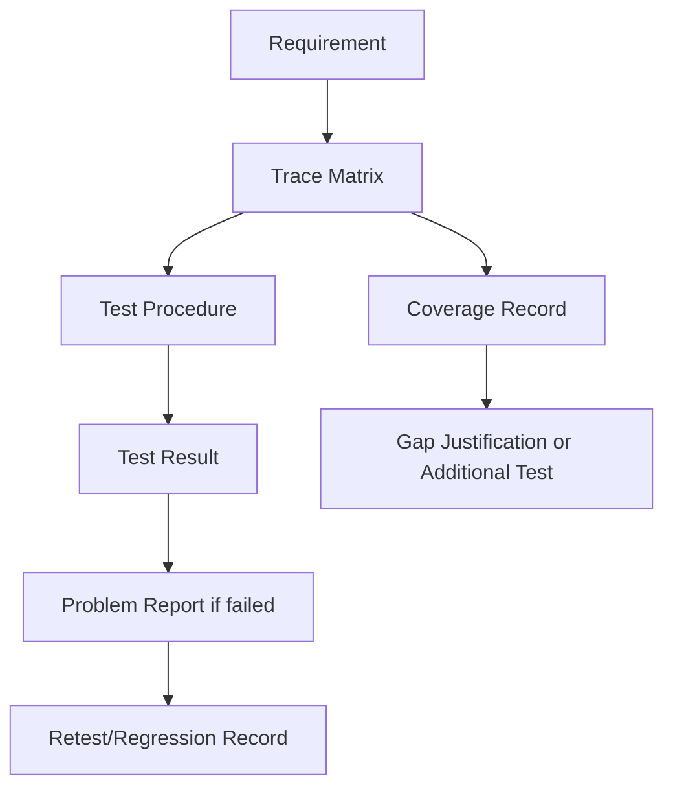
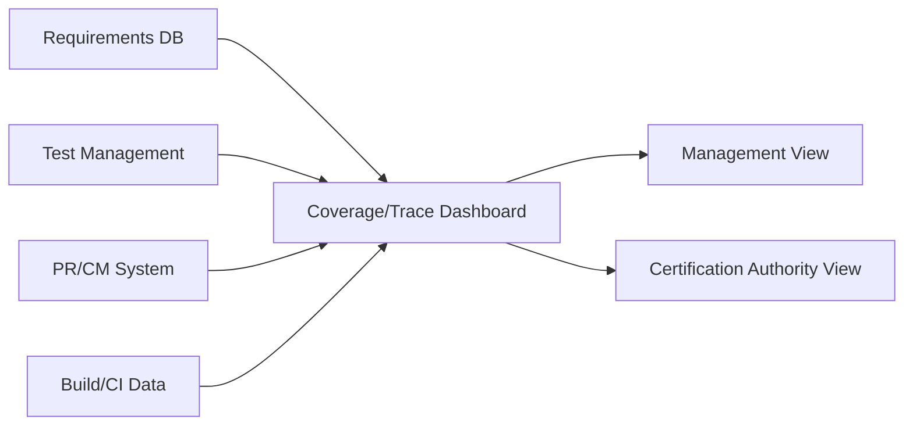
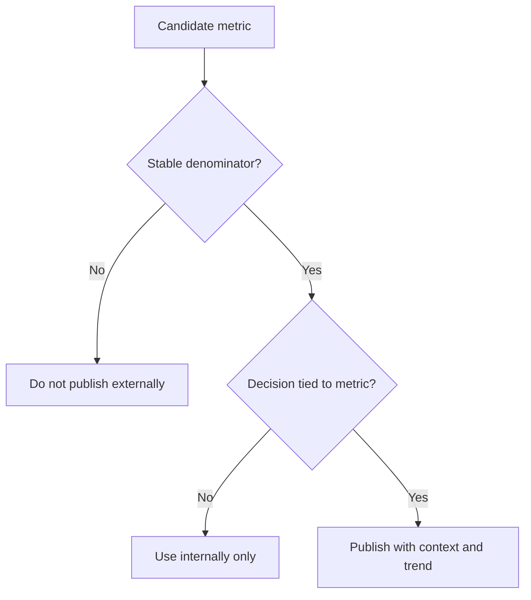
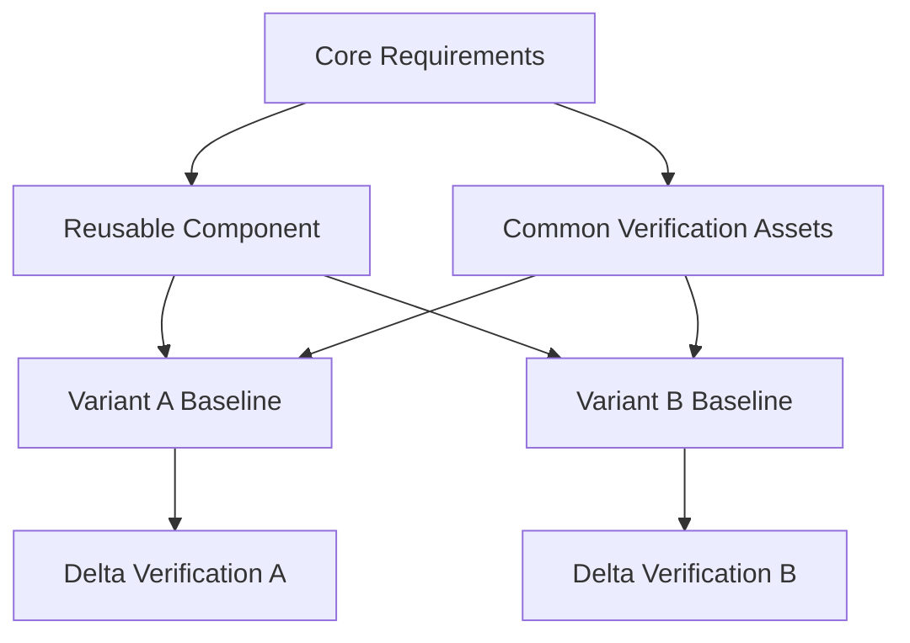
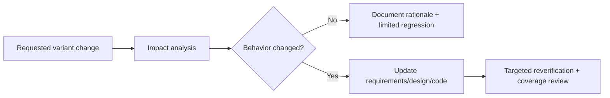
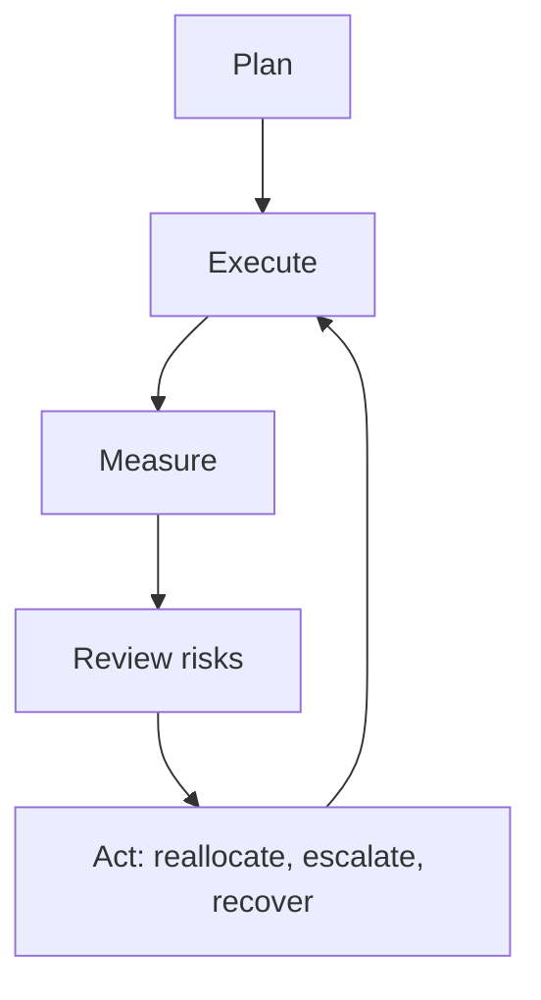
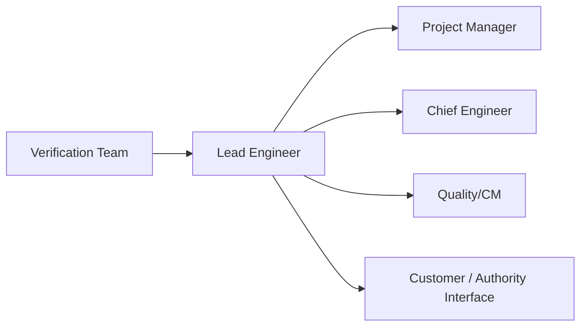
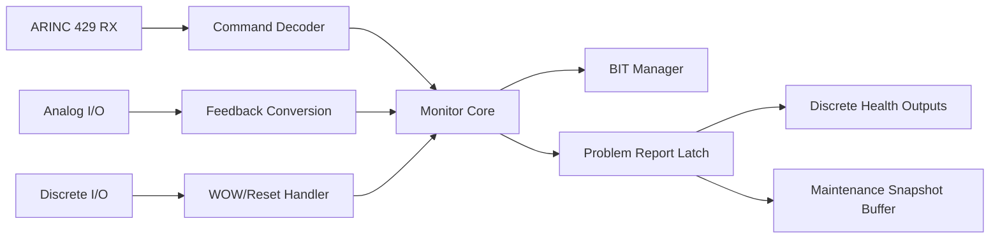
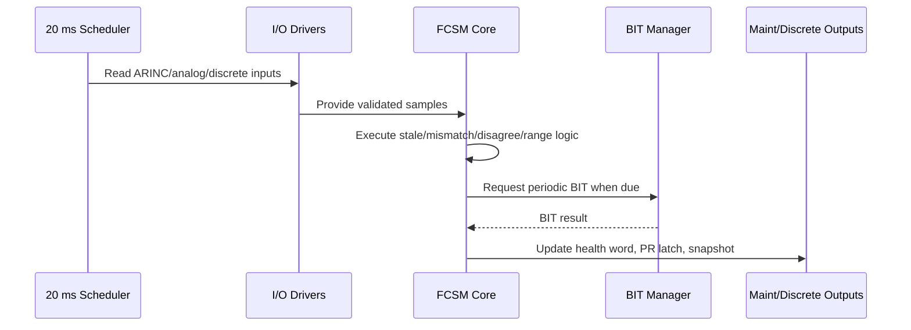
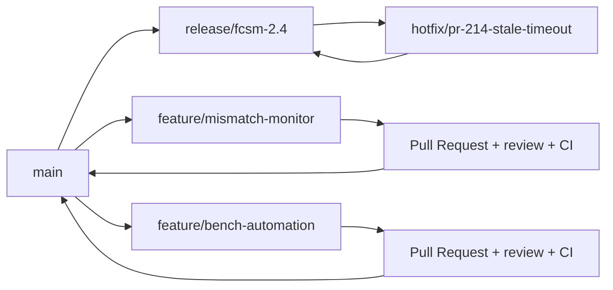

# AVIONICS SOFTWARE VERIFICATION & INTEGRATION — PART 5 (MODULES 21-25)

This part is written for Senior/Lead avionics verification and integration engineers working in DO-178C programs, with emphasis on certification credibility, verification rigor, reuse strategy, and leadership under audit and schedule pressure.

---

# MODULE 21 — SOI Certification Audits

## Learning objectives
- Understand the intent, entry criteria, and evidence expectations for SOI-1 through SOI-4.
- Lead SOI-3 and SOI-4 preparation using baseline control, readiness reviews, and dry-run audits.
- Answer certification auditor questions with objective evidence rather than narrative alone.
- Anticipate common findings in verification, traceability, coverage, CM, and anomaly management.

## Prerequisites
- Working knowledge of DO-178C lifecycle data.
- Familiarity with PSAC, SDP, SVP, SCMP, SQAP, SCI, SAS, and verification records.
- Experience with requirements-based testing, reviews, structural coverage, CM, and problem reporting.

## Theory
### Purpose of the SOI audit series
Stage of Involvement (SOI) audits are structured authority/applicant reviews intended to determine whether the project’s plans, standards, implementation, verification evidence, and configuration records support certification credit. The audits are cumulative: weak process definition in SOI-1 often becomes an SOI-3 evidence problem, and unresolved SOI-3 gaps often become SOI-4 closure risks.

### SOI-1 — Planning process review
**Before the audit**
- Freeze and internally approve planning baselines.
- Confirm consistency across PSAC, SDP, SVP, SCMP, SQAP, and development/verification standards.
- Prepare organizational roles, independence matrix, tool strategy, and lifecycle description.
- Conduct internal plan compliance review against DO-178C objectives and project conventions.

**During the audit**
- Walk the authority through lifecycle approach, DAL assumptions, software levels, and means of compliance.
- Demonstrate how planning data define reviews, tests, coverage, CM, supplier control, and problem reporting.
- Resolve ambiguities on independence, reuse, tool qualification, and verification completion criteria.

**After the audit**
- Record action items and update plans under change control.
- Communicate changed expectations to all execution teams.
- Trace audit actions into working procedures and checklists.

### SOI-2 — Development standards and process implementation review
**Before the audit**
- Baseline requirements standards, design standards, code standards, and review checklists.
- Prepare representative examples of requirements, design artifacts, source code, and review evidence.
- Ensure derived requirements flow and interface control approach are demonstrated.

**During the audit**
- Show that project standards are specific, enforceable, and actually used.
- Demonstrate requirement characteristics, design decomposition, traceability, coding-rule compliance, and review rigor.
- Show how anomalies are raised from reviews and how independence is maintained.

**After the audit**
- Tighten ambiguous standards immediately; vague standards become inconsistent execution later.
- Update training material and review templates if the authority identified weak enforcement language.

### SOI-3 — Verification process and evidence review
SOI-3 is usually the decisive audit for verification teams because it tests whether the program can convert plans into credible evidence.

**Before the audit**
- Freeze an auditable verification baseline: requirements, tests, procedures, expected results, environments, tool records, coverage data, reviews, PRs, and trace matrices.
- Validate that every evidence item is attributable to the exact software baseline under review.
- Run mock trace drills from system requirement → software requirement → design/code → test → result → PR → coverage.
- Review structural coverage gaps and ensure every gap has a technically defensible disposition.
- Create an evidence index with owner, revision, status, and storage location.

**During the audit**
- Expect deep sampling of requirements-based tests, review records, coverage closure, environment credibility, and anomaly closure.
- Auditors may choose arbitrary requirements or source files and ask the team to trace them live.
- Be prepared to explain why each verification method was selected and how independence was achieved.
- Demonstrate configuration control of test procedures, data sets, target loads, and lab setup.
- Show how failed results become controlled PRs and how rerun evidence proves closure.

**After the audit**
- Triage findings immediately into documentation fix, trace repair, missing verification, or process gap.
- If the issue affects baseline coherence, rebuild the evidence package rather than patch isolated files.
- Update readiness criteria so the same weakness is not repeated at SOI-4.

### SOI-4 — Final certification credit review
SOI-4 focuses on completion, closure, and confidence that no unresolved software evidence gaps remain.

**Before the audit**
- Ensure submitted evidence reflects the final or certification-intended baseline.
- Reconcile all open PRs, waivers, deviations, coverage gaps, and action items.
- Confirm final status accounting for all lifecycle data.
- Prepare concise summaries for residual issues, including rationale for any acceptable open item.

**During the audit**
- Authorities typically focus on whether the executed lifecycle matched the approved plans and whether unresolved issues undermine certification credit.
- Expect drill-downs on structural coverage closure, anomaly aging, previously raised SOI findings, CM integrity, and final document consistency.
- The most effective responses are short, evidence-first, and baseline-specific.

**After the audit**
- Close authority action items quickly and with objective evidence.
- Preserve the final certification baseline, including submitted evidence and response packages.
- Capture organizational lessons learned for the next program.

## Terminology
- **SOI:** Stage of Involvement audit conducted by the certification authority or delegated representatives.
- **Audit baseline:** The exact controlled set of lifecycle data presented for audit.
- **Readiness review:** Internal review confirming entry criteria, evidence completeness, and team preparedness.
- **Trace drill:** Live demonstration linking requirement, design/code, verification evidence, anomalies, and closure status.
- **Disposition:** Technical and process rationale used to explain unresolved or non-applicable evidence items.
- **Status accounting:** CM activity showing current state, revision, approval status, and baseline membership of items.

## Mermaid diagrams
### SOI audit lifecycle


### SOI-3 evidence drill-down


## Practical examples
### Example 1 — Strong SOI-3 preparation
A DAL B monitoring application froze a verification baseline two weeks before audit, ran three mock drills, and discovered 14 missing links between expected results and requirement IDs. The team corrected the procedures, re-reviewed them, reran impacted tests, and entered the audit with no hidden gaps.

### Example 2 — Weak SOI-4 preparation
A team brought a “latest” evidence set in which test results used build 2.8.14 while coverage used build 2.8.16. Even though both builds were close, the authority raised a major CM coherence issue because certification credit must be tied to one auditable configuration.

## Templates
### SOI readiness template
| Item | Owner | Baseline ID | Status | Notes |
| --- | --- | --- | --- | --- |
| Verification evidence index | Verification lead | VER-BL-042 | Ready | All artifact links checked |
| Traceability matrix | Requirements lead | TRACE-BL-042 | Ready | Bidirectional review complete |
| Structural coverage report | Coverage lead | COV-BL-042 | Ready with 3 approved justifications | Independent review signed |
| Open PR review board summary | QA lead | PR-BL-042 | Ready | No blocking severity 1/2 items |

### Auditor response template
- **Question:**
- **Short answer:**
- **Objective evidence reference:**
- **Baseline/version:**
- **Follow-up risks/limitations:**

## 50+ certification audit questions with detailed answers
1. **Q:** Show the verification evidence index for the current baseline.
   **A:** Provide a controlled index that maps each verification artifact to document number, revision, status, and storage location. A strong answer also shows the baseline tag or release label proving the evidence belongs to the audited configuration.
2. **Q:** How do you know every high-level requirement has at least one verification activity?
   **A:** Demonstrate a bidirectional trace matrix from HLR to test, analysis, or review records. Then show that uncovered rows are zero for the audited baseline and explain any approved verification-by-analysis cases.
3. **Q:** How do you prove low-level requirements are complete and testable?
   **A:** Show the LLR standard, review checklist, and review records identifying atomicity, determinism, interface clarity, and expected behavior. Support this with examples where ambiguous wording was corrected through peer review.
4. **Q:** Which requirements are verified by analysis instead of test, and why?
   **A:** Identify each requirement, the selected verification method, and the technical rationale. The answer is strong when analysis is justified by determinism, infeasibility of dynamic stimulation, or structural reasoning, and when the analysis report contains acceptance criteria.
5. **Q:** How do you demonstrate traceability from system requirements to source code?
   **A:** Walk from a system requirement to derived software requirements, architecture elements, source files, and verification cases. The evidence should be bidirectional and controlled under configuration management.
6. **Q:** What is your process for handling derived requirements?
   **A:** Show how derived requirements are identified, reviewed for correctness and safety impact, communicated to system stakeholders, and incorporated into traceability. A strong answer includes examples where system assumptions were fed back to system engineering.
7. **Q:** How do you know tests were run on the correct software version?
   **A:** Present test records containing executable checksum, build identifier, configuration label, and environment version. Tie those to the CM baseline and release manifest used for the verification campaign.
8. **Q:** Explain how you assess requirements-based test completeness.
   **A:** Explain that completeness is assessed by tracing each requirement to normal, boundary, robustness, and negative cases where applicable. Use requirement intent and interface behavior rather than code structure as the primary driver.
9. **Q:** Show evidence that verification independence was maintained.
   **A:** Provide the project independence matrix, role assignments, and review/test approvals showing the verifier was not the original author where independence is required. If tooling supported reviews, show audit logs of reviewer identity and approvals.
10. **Q:** How do you control problem reports found during verification?
   **A:** Show the problem reporting workflow, severity scheme, linkage from anomalies to failed test or review records, and evidence that closures were verified. Auditors expect to see no silent fixes outside the PR system.
11. **Q:** How do you ensure closed problem reports do not regress?
   **A:** Link each closed PR to change requests, regression tests, and closure rationale. Strong evidence includes targeted rerun results and, for high-impact fixes, impacted-area regression analysis.
12. **Q:** What structural coverage shortfalls remain and why?
   **A:** Present the current statement/decision/MC/DC results, list uncovered code items, and classify each as deactivated, defensive, dead, or pending additional tests. A strong answer includes approved dispositions with traceability.
13. **Q:** How was dead code ruled out or removed?
   **A:** Explain that code reviews, static analysis, and coverage investigations were used to identify unreachable logic. Then show either code removal with re-verification or formal justification if the code is actually deactivated logic, not dead code.
14. **Q:** How do you distinguish deactivated code from dead code?
   **A:** State that deactivated code is intentionally not exercised in a configuration or mode and is justified by requirements or architecture, whereas dead code is unintended and has no operational path. Show configuration rationale and activation conditions for deactivated logic.
15. **Q:** How was MC/DC achieved for the Level A/B applicable logic in this baseline?
   **A:** Show the specific decisions requiring MC/DC, the condition combinations used, and the coverage report tied back to procedures. A strong answer explains why each condition independently affects the outcome.
16. **Q:** What do you do when structural coverage reveals missing requirements?
   **A:** Treat it as a verification finding, investigate the source of the uncovered logic, and then either add requirements/tests or remove unintended logic. The answer should emphasize that coverage closes the loop on requirements completeness rather than replacing requirements-based testing.
17. **Q:** How do you qualify your test environment, if qualification is needed?
   **A:** Start by classifying whether the environment could fail to detect errors or insert errors. If qualification is required, show the qualification plan, operational requirements, test cases, results, and configuration control for the environment.
18. **Q:** Which tools were assessed for DO-330 qualification, and what was the outcome?
   **A:** Provide the tool assessment list, intended use, failure condition, qualification criteria, and resulting TQL or rationale for no qualification. Strong answers separate productivity tools from tools whose outputs are not independently verified.
19. **Q:** How do you verify tool outputs when the tool is not qualified?
   **A:** Show the independent review or downstream verification steps that detect incorrect tool outputs before certification credit is taken. The key is proving the tool cannot silently introduce or mask errors without detection.
20. **Q:** Explain your configuration management baseline at SOI-3.
   **A:** Describe the exact set of requirements, code, tests, procedures, environment definitions, and verification results frozen for the audit. Provide the baseline identifier and change history leading into the audit.
21. **Q:** How do you control test procedures and expected results?
   **A:** Show they are versioned, reviewed, uniquely identified, and tied to requirements. Expected results should be objective and measurable, not left to operator interpretation.
22. **Q:** How do you ensure verification procedures are repeatable across sites?
   **A:** Use controlled procedures, environment manifests, calibrated data sets, and standardized result capture formats. The best answers also mention environment qualification or conformance checks before execution.
23. **Q:** What evidence shows documentation completeness?
   **A:** Provide the document checklist against PSAC/SDP/SVP/SCMP/SQAP/SCI and lifecycle data, with status by baseline. Then demonstrate that released documents reference the same software version used during verification.
24. **Q:** How are review findings recorded and closed?
   **A:** Show review records with defect IDs, dispositions, responsible owners, and closure evidence. Certification authorities look for objective evidence that review comments were tracked to completion, not merely noted in email.
25. **Q:** How do you know the code implements only intended behavior?
   **A:** Use bidirectional traceability, code review records, and coverage analysis outcomes to show there is no unexplained logic. Strong answers also mention restrictions on debug hooks and how they are removed or justified.
26. **Q:** Show an example of a failed test and its complete closure trail.
   **A:** Walk through the failed run, linked anomaly report, impact assessment, fix change set, review, rerun evidence, and regression result. This demonstrates disciplined closure and CM integrity.
27. **Q:** How are robustness tests selected?
   **A:** Base them on interface assumptions, range limits, timing tolerances, invalid labels, stale data, and fault conditions identified in requirements and safety analysis. They must be traceable to explicit robustness intent, not added ad hoc.
28. **Q:** How do you verify partitioning or interface protection assumptions?
   **A:** Show architectural requirements and tests or analyses that confirm interface constraints, timing budgets, data validity checks, and fault containment behavior. Evidence should reflect the actual deployment environment, not just unit tests.
29. **Q:** How are external interface values validated in software verification?
   **A:** Show tests for label correctness, SSM/SDI handling, scaling, timing, timeout behavior, and invalid or noisy inputs. Expected results should tie back to interface control documents and software requirements.
30. **Q:** What is your approach to review documentation for completeness before SOI-2/SOI-3?
   **A:** Run a readiness review using a document compliance checklist, close all major comments, confirm signatures/approvals, and verify cross-references and revision consistency. A strong answer includes dry-run audits.
31. **Q:** How are open waivers or deviations presented to auditors?
   **A:** List them transparently with rationale, risk, approving authority, impacted artifacts, and planned closure if temporary. Never hide them; auditors respond better to controlled exceptions than surprises.
32. **Q:** How do you handle obsolete evidence discovered before an audit?
   **A:** Quarantine it from the audit package, regenerate or relink the correct evidence, perform impact assessment, and update the index. The answer should stress that evidence packages must represent one coherent baseline.
33. **Q:** How is regression effectiveness measured after changes?
   **A:** Show the change impact analysis, selected regression set, pass/fail results, and whether historical defect classes were re-exercised. Good answers use defect escape and reopened-issue data to validate the regression strategy.
34. **Q:** What is the auditor likely to inspect during a live traceability drill-down?
   **A:** Expect them to pick any requirement and ask for linked design, code, tests, results, anomalies, and coverage. The best preparation is a fast, reproducible trace path rather than a manually curated demo.
35. **Q:** How do you ensure test data sets are controlled?
   **A:** Treat input vectors, golden outputs, bus recordings, and simulator configurations as controlled artifacts with version identifiers and review records. If generated automatically, retain the generation method and seed or source data.
36. **Q:** Explain the difference between verification closure and certification closure.
   **A:** Verification closure means planned verification tasks for a baseline are objectively complete and anomalies are dispositioned. Certification closure also requires authority acceptance of the submitted evidence and resolution of audit actions.
37. **Q:** How are outsourced verification activities controlled?
   **A:** Use the same plans, standards, independence rules, CM baselines, and objective evidence requirements as internal teams. Auditors will expect supplier evidence to integrate cleanly into the applicant’s lifecycle data set.
38. **Q:** How do you prove the reviewed source code matches the object code used for test?
   **A:** Show build reproducibility, compiler version/configuration, checksum or binary fingerprint, and CM trace from source baseline to executable. For sensitive areas, include build logs and release manifests.
39. **Q:** What is your policy for temporary test hooks or instrumentation?
   **A:** Control them as configuration items, review them for side effects, and remove or disable them from the certification baseline unless explicitly justified. Evidence must show test results are representative of the delivered software.
40. **Q:** How do you assess whether a test harness needs qualification?
   **A:** Determine whether the harness could mask failures, alter outputs, or become the sole acceptance mechanism without independent verification. If yes, qualify it or add independent checks that remove the need for qualification.
41. **Q:** How are review and test procedures updated after requirement changes?
   **A:** Use change impact analysis to identify all affected procedures, expected results, traces, and checklists. The CM record should show none of these artifacts lag behind approved requirement revisions.
42. **Q:** What is the strongest way to answer when an auditor finds a trace gap?
   **A:** Acknowledge it immediately, reproduce the gap, explain whether it is data, process, or real lifecycle missing content, and present a time-bound containment and correction plan. Defensive or vague responses weaken confidence.
43. **Q:** How do you demonstrate documentation consistency across plans and standards?
   **A:** Show a cross-reference matrix between lifecycle processes, roles, reviews, outputs, and acceptance criteria. Inconsistencies between PSAC, SVP, and executed practice are a common audit concern.
44. **Q:** How are software loads and installation media controlled for verification?
   **A:** Use signed or checksummed packages, release manifests, part numbers, and installation instructions under CM. Test records should identify exactly which load was installed on which target or lab bench.
45. **Q:** How do you justify open problem reports at SOI-4?
   **A:** Classify each open item by certification impact, operational effect, workaround, and closure plan. Only non-blocking items with approved disposition and no unresolved safety/certification impact should remain open.
46. **Q:** How do you show independence for coverage analysis?
   **A:** Provide procedure ownership and review approvals showing that coverage results and justifications were independently assessed from the developer who wrote the code or original tests. Tool outputs alone are not enough.
47. **Q:** What are the most common weaknesses in requirements-based testing?
   **A:** Typical weaknesses are vague expected results, poor boundary selection, overreliance on nominal tests, and hidden dependence on code knowledge. Strong teams use requirement intent, interface constraints, and safety concerns to shape test depth.
48. **Q:** How do you prepare staff for auditor interviews?
   **A:** Run mock audits, teach them to answer from objective evidence, keep answers precise, and escalate when unsure rather than speculate. Consistency between different team members is as important as technical correctness.
49. **Q:** Show how configuration status accounting supports the certification package.
   **A:** Provide current status of each lifecycle artifact, its revision, approval state, open changes, and baseline membership. This proves the certification package is complete, current, and reproducible.
50. **Q:** How do you ensure problem report severity is assigned consistently?
   **A:** Use published criteria tied to safety, operational impact, and verification blockage, then perform review-board calibration. Auditors often sample several PRs to see whether severity and closure rigor are aligned.
51. **Q:** How are authority action items tracked after an SOI audit?
   **A:** Record each action item with owner, due date, impacted artifact, closure evidence, and applicant/internal review status. Closure must be objective and reflected in the updated baseline or response package.

## SOI preparation checklists
### SOI-1 checklist
- [ ] PSAC reflects current architecture, DAL assumptions, and lifecycle scope.
- [ ] SDP/SVP/SCMP/SQAP roles and independence expectations are consistent.
- [ ] Tool strategy includes qualification assessment or independent output verification.
- [ ] Supplier and multi-site responsibilities are defined.
- [ ] Entry/exit criteria for reviews, tests, PR closure, and coverage are objective.

### SOI-2 checklist
- [ ] Requirements/design/code standards are approved and in active use.
- [ ] Review checklists exist and align with the standards.
- [ ] Representative artifacts show conformance to atomicity, correctness, and traceability expectations.
- [ ] Derived requirements process is operational and evidenced.
- [ ] Interface control data are under configuration management.

### SOI-3 checklist
- [ ] Verification baseline is frozen and uniquely labeled.
- [ ] Every requirement has an approved verification method and trace target.
- [ ] Tests, expected results, and datasets are version-controlled.
- [ ] Coverage data tie to the same executable baseline as the test results.
- [ ] Tool and environment qualification decisions are documented.
- [ ] Open PR list is current, severity-ranked, and certification-impact assessed.
- [ ] Mock trace drills completed successfully.
- [ ] Independent review evidence is easy to retrieve live.

### SOI-4 checklist
- [ ] All prior SOI findings are closed or dispositioned with authority visibility.
- [ ] Final status accounting is complete for lifecycle data.
- [ ] Residual open issues are non-blocking, justified, and tracked.
- [ ] Final coverage closure is approved.
- [ ] Release manifest, build records, and installation evidence match the certification baseline.

## Common audit findings and how to address them
| Finding | Why it matters | Strong corrective action |
| --- | --- | --- |
| Trace gaps between requirement and expected result | Weakens requirements-based test credibility | Repair the trace, review all similar procedures, rerun affected tests if acceptance criteria changed |
| Coverage report tied to wrong build | Invalidates coverage credit | Rebaseline, regenerate coverage on the certified executable, and update the evidence index |
| Review records missing independence evidence | DO-178C objective may be unmet | Reassign review, document independence matrix, and retrain leads on approval rules |
| PR closure without rerun evidence | Fix was not objectively verified | Link fix to targeted rerun/regression evidence and update closure checklist |
| Tool rationale absent or weak | Unclear whether tool output can be trusted | Perform formal tool assessment and define qualification or independent verification steps |
| Test environment version not captured | Test results may be non-reproducible | Add environment manifest to every test record and control bench configuration items |
| Open severity mismatch PR at SOI-4 | Final evidence not complete | Reassess severity, certification impact, workaround, and closure plan; do not hide it |

## Case study
### Case study — SOI-3 recovery on a DAL B actuator monitor
A program entered mock SOI-3 with 96% requirement coverage, but the remaining 4% exposed three different root causes: one obsolete requirement, two missing robustness tests, and one uncovered diagnostic branch with no requirement. The lead verifier split the problem by evidence type instead of by engineer preference. Obsolete content was retired by change control, robustness procedures were added and executed, and the unexplained branch was removed after confirming it was legacy debug logic. The audit result improved from “not ready” to “ready with minor observations” in ten days.

## Exercises
1. Build a one-page SOI-3 readiness dashboard for a DAL B component with 220 requirements, 310 tests, 14 open PRs, and 97.8% statement coverage.
2. Create a live trace drill from a stale-data requirement to design, code, test results, anomaly, and regression evidence.
3. Write a disposition for a coverage gap caused by deactivated maintenance-only logic.

## Assessment
- Explain why SOI-3 usually exposes planning weaknesses from SOI-1.
- Distinguish dead code, deactivated code, and unverified defensive code.
- Describe how you would answer an auditor who questions the credibility of an unqualified test harness.
- Define the minimum contents of an SOI-4 closure pack.

---

# MODULE 22 — Verification Metrics

## Learning objectives
- Select verification metrics that drive action rather than vanity reporting.
- Compute, interpret, and present metrics for engineering leadership and certification authorities.
- Detect misleading metric usage and correct it before it distorts decision-making.
- Build verification dashboards tied to program exit criteria.

## Prerequisites
- Experience with reviews, test execution, coverage analysis, and PR tracking.
- Familiarity with configuration baselines and change impact analysis.

## Theory
Metrics are useful only when they are tied to a stable scope, a decision to be made, and an agreed interpretation. On avionics programs, the highest-value metrics tend to be those that reflect objective completion criteria: requirement verification status, structural coverage closure, high-severity PR aging, and reproducibility of baselines. Metrics become misleading when used without context, when numerator and denominator change midstream, or when teams optimize the number rather than the engineering outcome.

### Core metric catalog
| Metric | Formula | Useful interpretation | Common misuse |
| --- | --- | --- | --- |
| Test execution % | Executed tests / planned tests x 100 | Useful for schedule visibility when tied to a frozen scope. | Misleading if planned scope keeps changing or includes obsolete tests. |
| Pass/fail rate | Passed runs / executed runs x 100 | Useful for current campaign health and stabilization trends. | Misleading when reruns inflate pass counts or expected-fail tests are mixed in. |
| Requirements coverage | Requirements with verified status / total applicable requirements | Primary completeness metric for requirements-based verification. | Weak if coverage counts traces without assessing adequacy of cases. |
| Structural coverage | Covered structure items / total applicable items | Shows remaining code exposure after requirements-based tests. | Dangerous when used alone as a quality proxy. |
| MC/DC coverage | MC/DC-satisfied decisions / applicable decisions | Important for Level A and still informative for complex DAL B logic. | Misleading if decisions are simplified artificially to improve the percentage. |
| Defect density | Confirmed defects / KLOC or function points | Useful for trend comparison within similar components. | Poor for cross-team comparison when complexity differs. |
| Open problem reports | Count by severity and age | Best leading indicator of verification closure risk. | Raw total alone hides severity mix and stale blockers. |
| Regression effectiveness | Regression defects found / total defects found after change | Good check of impact analysis and suite relevance. | Can be gamed by broad reruns without analyzing defect classes. |
| Automation % | Automated procedures / repeatable procedures | Useful for repeatability and cycle-time planning. | Not a quality metric; automation of weak tests is still weak verification. |
| Build stability | Successful baseline builds / attempted builds | Useful for integration maturity and CI reliability. | Misleading if failed builds are filtered out manually. |
| Escaped defects | Defects found after planned verification closure | Powerful lagging metric for process effectiveness. | Need normalization and severity weighting to be meaningful. |
| Verification progress | Weighted completion of reviews, tests, coverage, PR closure | Best executive metric when based on exit criteria. | Bad if reduced to a subjective single color without evidence. |

### Useful vs misleading metrics
**Usually useful**
- Requirements coverage by verification method and software baseline.
- Structural coverage closure by file/function, with explicit justification categories.
- Open PRs by severity, age, and certification impact.
- Regression effectiveness tied to change classes.
- Verification progress measured against exit criteria, not raw calendar percentage.

**Often misleading unless heavily qualified**
- Total tests written.
- Automation percentage alone.
- Defect density compared across unrelated components.
- Aggregate pass rate without failed-first-run data.
- Green/red dashboards with no drill-down path.

## Terminology
- **Leading metric:** Indicates likely future outcome (for example, aging open blockers).
- **Lagging metric:** Describes outcome already experienced (for example, escaped defects).
- **Metric denominator control:** Agreement on what counts as “total planned” or “applicable.”
- **Confidence band:** Range acknowledging measurement limits or pending baseline changes.

## Mermaid diagrams
### Verification dashboard data flow


### Metric maturity filter


## Practical examples
### Calculation example 1 — Test execution %
- Planned procedures in frozen baseline: 240
- Obsolete after change control: 10
- Applicable total: 230
- Executed procedures: 184
- **Execution % = 184 / 230 x 100 = 80.0%**

### Calculation example 2 — Pass/fail rate
- Total executions this week: 96
- First-pass successes: 74
- Pass after rerun: 12
- Fails still open: 10
- **First-pass pass rate = 74 / 96 = 77.1%**
- **Final pass rate after rerun = 86 / 96 = 89.6%**

Use both numbers. The first-pass rate reveals product and environment stability; the final rate reflects campaign closure.

### Calculation example 3 — Requirements coverage
- Applicable requirements: 212
- Verified and approved: 205
- Pending due to open test anomalies: 5
- No approved method assigned: 2
- **Coverage complete = 205 / 212 = 96.7%**

### Calculation example 4 — Defect density
- Confirmed software defects in integration test: 18
- Component size: 14.4 KLOC
- **Defect density = 18 / 14.4 = 1.25 defects/KLOC**

Useful for this component’s own trend across releases, not for comparing to a vastly different module with different complexity.

## Dashboard examples
### Executive dashboard example
| Metric | Current | Trend | Threshold | Action |
| --- | --- | --- | --- | --- |
| Verification progress | 78% | Up | >=80% by week 32 | Add second reviewer for PR closure |
| Requirements coverage | 96.7% | Flat | 100% before SOI-3 | Close 2 missing-method gaps |
| MC/DC closure (complex decisions) | 91% | Up | 100% before audit | Complete 3 remaining decision investigations |
| Open Sev-1/2 PRs | 3 | Down | 0 before SOI-4 | Daily triage with chief engineer |
| Build stability | 88% | Down | >=95% | Investigate intermittent environment failures |

### Certification authority dashboard example
| Focus area | Preferred metric view |
| --- | --- |
| Requirements completeness | Applicable vs verified requirements, by method |
| Coverage closure | Statement/decision/MC/DC with justification categories |
| Anomaly closure | Open PRs by severity, age, certification impact |
| Baseline integrity | Evidence generated on audited software version |
| Independence | % of reviews/tests approved by independent personnel where required |

## Templates
### Metric definition template
- **Metric name:**
- **Purpose/decision supported:**
- **Formula:**
- **Denominator control rule:**
- **Refresh cadence:**
- **Data source:**
- **Owner:**
- **Known limitations:**

### Weekly verification review template
- Scope changes since last review
- Requirements coverage delta
- Test execution delta
- First-pass and final-pass rates
- Coverage closure delta
- Open blocker PRs and age
- CI/build stability issues
- Recovery actions and owners

## Checklists
- [ ] Denominator is stable and documented.
- [ ] Metric supports a decision, not just reporting.
- [ ] Trend is shown with baseline change notes.
- [ ] Severity split is used for PR counts.
- [ ] First-pass results are retained; not hidden by reruns.
- [ ] Coverage percentages are accompanied by raw uncovered items.
- [ ] Authority-facing metrics are traceable to objective evidence.

## Common mistakes
- Reporting 100% test execution while 15% of expected results are still under review.
- Combining obsolete and applicable requirements in the same denominator.
- Showing one defect-density number without distinguishing environment, documentation, and software defects.
- Treating automation percentage as a surrogate for verification quality.
- Using a green dashboard even though one open severity-1 PR blocks certification credit.

## Interview questions
1. Which verification metric do you trust first when a program claims it is “90% done,” and why?
2. How would you explain to management why pass rate improved while build stability worsened?
3. When can MC/DC percentage be misleading even when the number is high?
4. How do you present open PR metrics without creating panic or hiding risk?
5. What metric would you use to validate whether your regression strategy is working?

## Case study
A product team proudly reported 98% test execution and 95% pass rate before SOI-3. During internal review, the lead verifier found that the denominator still included 46 obsolete procedures and that 12 of the “passes” were reruns after fixing environment issues. After redefining the metrics, actual status was 83% execution and 76% first-pass success. The corrected metrics triggered a better recovery plan and avoided misleading audit preparation claims.

## Exercises
1. Create a defect-aging chart split by severity and explain how you would use it in an SOI-4 readiness review.
2. Recalculate verification progress when five new requirements are added late and eight obsolete tests are retired.
3. Design a management dashboard that does not hide certification risk behind a single overall percentage.

## Assessment
- Compute requirements coverage, first-pass rate, and verification progress from a supplied data set.
- Identify two useful and two misleading metrics for a DAL B integration campaign.
- Explain how you would defend a metric definition to a DER or certification auditor.

---

# MODULE 23 — Product Line Architecture & Component-Based Engineering

## Learning objectives
- Apply DO-178C verification principles to product lines and reusable software components.
- Define delta verification strategies for feature variants and configuration changes.
- Manage CM, traceability, and audit evidence across reusable baselines.
- Evaluate when previously verified component evidence can be reused for certification credit.

## Prerequisites
- Understanding of software architecture, component interfaces, CM, and requirements traceability.
- Familiarity with reuse concepts and DO-178C lifecycle evidence.

## Theory
Product line engineering in avionics can reduce schedule and defect risk, but it only helps certification when reuse is disciplined. Reuse never eliminates the need to show that the reused component, in its actual configuration and operational context, still satisfies system and software requirements. The authority will focus on what changed, what did not change, and how you know the reused evidence is still valid.

### Product line architecture concepts
- **Core assets:** Shared requirements, architecture patterns, reusable code, tests, and tools.
- **Variation points:** Controlled differences in features, interfaces, thresholds, or platform services.
- **Variant baseline:** Specific configuration selected for one aircraft/program/release.
- **Delta verification:** Verification targeted at what changed in configuration, context, or implementation.

### How reuse affects DO-178C verification
Reuse may reduce rework only when the applicant can show:
1. The reused component baseline is known and controlled.
2. Prior lifecycle data are available and trustworthy.
3. Assumptions and constraints of prior verification still hold.
4. New interfaces, timing, platform, and safety context changes have been assessed.
5. Delta verification is sufficient for all impacts.

### Credit for previously verified components
Prior credit is strongest when the component is reused without source changes, on a comparable target/platform, with unchanged requirements and interfaces, and with accessible evidence packages. Credit weakens quickly when platform services, compiler, timing, interface semantics, or feature configuration change.

### Delta verification strategies
| Change type | Typical delta verification |
| --- | --- |
| Requirement wording clarified but behavior unchanged | Review traces, update linked documentation, limited regression |
| Threshold/calibration change | Boundary-value regression, interface checks, updated expected results |
| Feature toggle disabled/enabled | Variant analysis, deactivated-code assessment, coverage/trace updates |
| Platform/compiler change | Build reproducibility review, target regression, timing and coverage review |
| Interface protocol update | Interface tests, robustness tests, ICD review, anomaly history review |
| Reused component source modification | Full impact analysis, affected requirements regression, coverage reassessment |

## Terminology
- **Reusable component:** Software element intentionally used across multiple systems or variants.
- **Variant matrix:** Mapping of product features/options to specific baselines.
- **Compatibility envelope:** Range of assumptions under which reused evidence remains valid.
- **Delta analysis:** Structured assessment of differences between source and target reuse context.

## Mermaid diagrams
### Product line asset model


### Configuration variant decision path


## Practical examples
### Example 1 — Reusing a bus decoding component
A previously verified ARINC decoder is reused in three programs. Program 1 and 2 use identical labels and timing assumptions, so most evidence is reused with limited interface regression. Program 3 introduces different SSM handling and a new compiler version, triggering new robustness tests, build reproducibility checks, and a partial coverage reassessment.

### Example 2 — Feature-variant pitfall
A maintenance feature is compile-time disabled in a simplified product variant. The team assumed no new verification was needed. During audit, the authority asked for evidence that the disabled logic was deactivated by design and that no dead code remained. The team then had to produce variant-specific build analysis and coverage justification.

## Templates
### Reuse assessment template
- **Reused component ID:**
- **Source baseline:**
- **Target baseline:**
- **Prior DAL / target DAL:**
- **Assumptions carried over:**
- **Changed interfaces/platform/toolchain/features:**
- **Available prior evidence:**
- **Required delta verification:**
- **Residual risk / open items:**

### Variant CM template
| Variant | Feature set | Source baseline | Delta package | Regression suite | Approval status |
| --- | --- | --- | --- | --- | --- |
| A320-STD | Dual sensors, maint reset | CORE-6.2 | DELTA-STD-04 | REG-STD-B | Approved |
| A320-LITE | Single sensor, no maint UI | CORE-6.2 | DELTA-LITE-02 | REG-LITE-B | In review |

## Checklists
- [ ] Reused component assumptions are explicit and reviewed.
- [ ] Variant selection is reproducible from CM data alone.
- [ ] Prior evidence belongs to an identified baseline and is accessible.
- [ ] Delta verification covers interfaces, timing, configuration, and platform changes.
- [ ] Coverage justifications distinguish deactivated variant logic from dead code.
- [ ] PR history for the reused component is reviewed for recurrence risk.

## Common mistakes
- Assuming prior verification credit transfers automatically to a new program.
- Reusing requirements traces without rechecking changed interfaces or system assumptions.
- Mixing variant-specific evidence into a common baseline.
- Treating compile-time-disabled logic as harmless without proving it is intentionally deactivated.
- Forgetting CM impact of common-component fixes on multiple active releases.

## Interview questions
1. What conditions must be true before you claim certification credit for a previously verified component?
2. How would you define delta verification for a product variant that changes only thresholds and feature flags?
3. What CM structure would you use to separate core assets from variant-specific evidence?
4. Why is reuse often a bigger audit topic at SOI-3 than at SOI-1?
5. How do you prevent one common-component fix from destabilizing multiple releases?

## Case study
A flight-deck indication library was reused across three aircraft variants. The library had excellent prior evidence, but one variant introduced a different graphics middleware and different refresh timing. The lead verifier reused most functional test cases but added timing conformance tests, interface robustness tests, and refreshed the coverage analysis on the new target. This limited but targeted delta verification preserved certification credibility and avoided a wasteful full reverification.

## Exercises
1. Build a reuse impact matrix for a component moving from dual-sensor to single-sensor configuration.
2. Define a delta verification suite for an ARINC label mapping change.
3. Create a CM model showing core baselines, variant baselines, and hotfix branches.

## Assessment
- Explain how product-line reuse changes traceability obligations under DO-178C.
- Distinguish reuse credit, delta verification, and full reverification.
- Identify top CM risks in component-based avionics product lines.

---

# MODULE 24 — Leadership & Project Management

## Learning objectives
- Plan, estimate, and govern verification activities for senior/lead roles.
- Lead teams through schedule pressure, certification risk, failed integration, and stakeholder escalation.
- Make sound technical decisions while preserving process integrity and audit readiness.
- Mentor engineers and coordinate across sites, suppliers, and customers.

## Prerequisites
- Hands-on verification and integration experience.
- Familiarity with lifecycle planning, reviews, PR management, and stakeholder communication.

## Theory
Lead verification engineers operate at two levels simultaneously: deep technical credibility and program-level control. A strong lead knows when to dive into test data, when to escalate a systemic issue, and when to protect the team from bad decisions driven by schedule pressure.

### Planning verification activities
- Build plans around exit criteria, not just task lists.
- Estimate by artifact type: requirements reviews, procedure development, execution, anomaly closure, coverage closure, and audit prep.
- Reserve explicit budget for rework, dry runs, and evidence repackaging.
- Plan staffing by specialization: requirements, system integration, automation, coverage, CM, and audit support.

### Resource allocation
- Put senior staff on risk-dense interfaces, high-criticality decisions, and audit-facing evidence.
- Use automation engineers to remove repeatability bottlenecks, not to hide unstable manual logic.
- Maintain backup ownership for every critical evidence stream.

### Risk management
- Maintain a verification risk register with likelihood, impact, trigger, and response plan.
- Treat open blocker PR aging, unstable benches, and coverage closure stalls as certification risks, not just engineering nuisances.
- Escalate early when schedule recovery would otherwise require violating independence or compressing review depth.

### Technical leadership behaviors
- Make evidence-based decisions under pressure.
- Separate product risk, process risk, and infrastructure risk.
- Communicate uncertainty honestly.
- Mentor through review feedback, dry-run audits, and structured root-cause analysis.

## Terminology
- **TRR:** Test readiness review.
- **Recovery plan:** Time-bound plan to restore technical or schedule performance.
- **Escalation threshold:** Predefined trigger for leadership or customer notification.
- **RCA:** Root cause analysis.
- **Decision log:** Controlled record of significant technical or process decisions.

## Mermaid diagrams
### Lead verification control loop


### Stakeholder communication model


## Practical examples
### Estimation example
A DAL B module with 180 HLR/LLR items and 220 test procedures was estimated using: 0.5 hour per requirement review, 1.5 hours per new procedure, 0.8 hours per automated rerun, 1.2 hours per PR closure, and 80 hours reserved for coverage closure and audit prep. The reserve proved essential when 14 late requirement changes arrived after integration started.

### Review management example
A lead noticed review defect density dropped to almost zero on one team while PR escape rate increased. Rather than celebrating, the lead sampled review records and found checklist use had become superficial. He retrained reviewers, paired juniors with seniors, and restored review effectiveness.

## Templates
### Verification risk register template
| ID | Risk | Likelihood | Impact | Trigger | Response | Owner |
| --- | --- | --- | --- | --- | --- | --- |
| VR-01 | Coverage closure stalls due to missing target instrumentation | Medium | High | Coverage <90% at T-4 weeks to SOI-3 | Add instrumentation support and start dry-run analysis | Coverage lead |
| VR-02 | Shared bench instability delays regression | High | Medium | Build stability <90% for 3 days | Split bench ownership and quarantine flaky hardware | Integration lead |

### Weekly lead review template
- Top 5 certification risks
- Blocked requirements/tests/PRs
- Coverage closure status
- Lab/environment issues
- Supplier or cross-site dependencies
- Upcoming stakeholder decisions
- Escalations required this week

## Checklists
- [ ] Exit criteria exist for every major verification phase.
- [ ] Estimates include rework and audit prep.
- [ ] Independence is protected in staffing assignments.
- [ ] Escalation thresholds are documented.
- [ ] Cross-site execution standards are aligned.
- [ ] Customer communications are accurate and evidence-based.
- [ ] Decision log captures major technical trade-offs.

## Common mistakes
- Promising schedule recovery without reducing scope or adding resources.
- Measuring team activity instead of evidence completion.
- Letting senior engineers bypass process “just this once.”
- Escalating too late because early status was softened.
- Treating customer communication as project-manager-only territory.

## Realistic leadership scenarios
### Scenario 1 — Schedule pressure before TRR
- **Situation:** A partner program advances the integration test readiness review by three weeks while 18% of procedures remain unexecuted.
- **Challenge:** Protect certification-critical scope without losing management confidence.
- **Approach:** Re-baseline the plan by separating must-close DAL B evidence from deferrable efficiency tasks, add daily blocker review, assign experienced engineers to the highest-risk interfaces, and publish objective entry/exit criteria.
- **Resolution:** The team completed all mandatory requirements-based tests, deferred low-value automation refactoring, and entered TRR with transparent residual risk.
- **Lessons learned:** Leads must reduce scope intelligently, not uniformly.

### Scenario 2 — Failed testing in hardware lab
- **Situation:** HSIT detects intermittent ARINC label corruption only on one bench after six hours of runtime.
- **Challenge:** Determine whether the issue is software, harness, or bench-induced while protecting schedule.
- **Approach:** Contain the bench, compare logs across benches, create a time-synchronized fault tree, assign one engineer to software reproduction and another to bench diagnostics, and avoid broad code churn until evidence converges.
- **Resolution:** The root cause was a flaky receiver card; software added improved stale-data diagnostics but certification scope remained stable.
- **Lessons learned:** Separate product defects from infrastructure defects quickly.

### Scenario 3 — Certification deadline slip risk
- **Situation:** SOI-3 is four weeks away and coverage closure is 72% with many justifications still draft.
- **Challenge:** Recover audit readiness without producing low-quality dispositions.
- **Approach:** Launch a structured coverage war room, pair developers with independent verifiers, classify each gap into missing test, deactivated code, or unintended logic, and review justifications through DER-style dry runs.
- **Resolution:** Coverage reached closure with defensible evidence and only two minor follow-up actions from the mock audit.
- **Lessons learned:** Coverage investigations need disciplined categorization and independent review.

### Scenario 4 — Missing requirements during integration
- **Situation:** A disagreement monitor exists in code but no approved HLR describes the behavior.
- **Challenge:** Resolve the issue without invalidating existing evidence.
- **Approach:** Freeze further implementation changes, assess operational impact, raise a derived requirement or corrective change request, update traces, and rerun affected tests after requirement approval.
- **Resolution:** The missing behavior became an approved derived requirement with updated tests and no unexplained code remained.
- **Lessons learned:** Untraced logic is a certification issue even if technically useful.

### Scenario 5 — Team conflict on independence
- **Situation:** A senior developer wants to approve reviews for code he previously authored because the schedule is tight.
- **Challenge:** Maintain independence while keeping delivery moving.
- **Approach:** Escalate to project leadership, reassign review ownership, and explain that violating independence now creates larger audit risk later. Shift the developer to support evidence prep instead.
- **Resolution:** Independence was preserved and the developer still added value through analysis support and defect triage.
- **Lessons learned:** Lead engineers protect process integrity under pressure.

### Scenario 6 — Customer escalation on defect backlog
- **Situation:** The customer sees 42 open PRs and assumes the software is unstable.
- **Challenge:** Provide accurate status without minimizing risk.
- **Approach:** Reframe the backlog by severity, certification impact, and aging; show closure trend, blocked items, and how many are documentation or tooling issues versus product defects.
- **Resolution:** The customer accepted the recovery plan after seeing only three high-severity items affected flight-worthy evidence.
- **Lessons learned:** Context matters more than raw counts.

### Scenario 7 — Regression explosion after architecture change
- **Situation:** A reusable I/O service update touches multiple product variants and triples the regression candidate list.
- **Challenge:** Find a credible regression subset fast.
- **Approach:** Use change impact analysis based on interfaces, feature toggles, and prior defect history; preserve mandatory smoke, safety, and interface tests across all affected variants.
- **Resolution:** Execution time dropped by 45% while preserving defect-detection effectiveness.
- **Lessons learned:** Impact analysis beats brute force when release windows are narrow.

### Scenario 8 — Multiple releases share one verification team
- **Situation:** A sustaining release and a new feature release overlap, both needing formal evidence review.
- **Challenge:** Prevent evidence contamination and resource burnout.
- **Approach:** Split baselines, dedicate leads per release, define shared reusable evidence boundaries, and use a common triage board to avoid double-counting defects.
- **Resolution:** Both releases closed with distinct evidence packages and no CM mix-ups.
- **Lessons learned:** Baseline separation is a leadership responsibility, not just a tool feature.

### Scenario 9 — Cross-site collaboration breakdown
- **Situation:** An offshore test team executes procedures differently from the primary site, causing inconsistent results.
- **Challenge:** Restore repeatability and trust.
- **Approach:** Standardize environment manifests, add calibration checks, hold joint dry runs, and require evidence packages to include exact build IDs and lab configuration.
- **Resolution:** Result variability disappeared and the sites aligned on a common execution playbook.
- **Lessons learned:** Repeatability requires process detail, not assumptions.

### Scenario 10 — Late safety analysis change
- **Situation:** System safety analysis introduces a new latent failure detection requirement after detailed testing is underway.
- **Challenge:** Integrate the change without destabilizing the release.
- **Approach:** Run impact analysis across requirements, architecture, code, tests, coverage, and user documentation; negotiate priority with stakeholders; reserve one change board dedicated to safety-driven work.
- **Resolution:** The new requirement was incorporated with targeted regression and clear management visibility of schedule impact.
- **Lessons learned:** Safety-driven changes need explicit governance and transparent trade-offs.


## Interview questions
1. How do you recover an SOI-3 plan when coverage is far behind but management wants a green status?
2. What do you do when the fastest engineer is also the person blocking independence rules?
3. How do you communicate an unavoidable schedule slip to a customer without losing trust?
4. How would you balance two overlapping releases that share one verification team?
5. What metrics would you personally review every day in the month before an audit?

## Case study
A lead engineer inherited a program with fragmented ownership across three sites, no clear readiness criteria, and repeated customer escalations. She introduced a weekly evidence-based review using requirements coverage, blocker PR aging, and coverage closure as the only primary health metrics. She also created a single baseline manifest per release and stopped mixing shared artifacts informally. Within six weeks, the team’s execution became predictable enough to support a credible certification recovery plan.

## Exercises
1. Draft a two-week recovery plan for a failed HSIT campaign with unstable benches and five severity-1 PRs.
2. Build a staffing plan for simultaneous sustaining and feature releases.
3. Write a customer update for a late safety-analysis-driven requirement change.

## Assessment
- Create a verification risk register for a DAL B integration phase.
- Describe when to escalate versus when to solve locally.
- Explain how mentoring and review discipline affect audit outcomes.

---

# MODULE 25 — Complete Capstone Project

## Project overview
**Project:** Flight Control Surface Monitoring Software (FCSM)  
**Purpose:** Monitor left/right flight control surface commanded position and feedback position, detect disagreement/stale/range faults, support maintenance reporting, and provide deterministic health status to aircraft systems.

## Learning objectives
- Demonstrate end-to-end DO-178C thinking from requirements through code, tests, coverage, PRs, CM, and audit prep.
- Practice DAL B verification planning and integration strategy.
- Build a realistic evidence set that could be expanded into a formal certification package.

## Prerequisites
- Familiarity with avionics interfaces (ARINC 429, discrete I/O, analog I/O).
- Experience with requirements, C implementation, tests, CI, and defect management.

## DAL classification and justification
**Assigned DAL:** **DAL B**

**Justification:** The software monitors flight control surface behavior and provides fault/status information that could contribute to hazardous or severe-major aircraft/system effects if incorrect, especially by failing to detect a real surface-monitoring fault or by generating persistent misleading status that causes inappropriate crew/maintenance action. However, it is not the primary control law executor and is assumed to be part of an architecture with monitoring redundancy and higher-level mitigation; therefore DAL B is appropriate for this study case.

## System requirements
| ID | Requirement |
| --- | --- |
| SYS-FCSM-001 | The software shall monitor left and right flight-control surface position feedback at 20 ms intervals. |
| SYS-FCSM-002 | The software shall receive commanded position from the flight control computer over ARINC 429. |
| SYS-FCSM-003 | The software shall acquire independent analog feedback channels for each surface. |
| SYS-FCSM-004 | The software shall detect command/feedback mismatch exceeding 2.0 degrees for more than 120 ms. |
| SYS-FCSM-005 | The software shall detect disagreement between redundant feedback channels exceeding 1.0 degree for more than 80 ms. |
| SYS-FCSM-006 | The software shall detect stale ARINC command data older than 100 ms. |
| SYS-FCSM-007 | The software shall detect analog input out-of-range and open-circuit indications. |
| SYS-FCSM-008 | The software shall set maintenance fault indications for detected monitor failures. |
| SYS-FCSM-009 | The software shall output surface health status to the central maintenance computer via discrete outputs. |
| SYS-FCSM-010 | The software shall perform power-up BIT and periodic BIT on monitoring interfaces. |
| SYS-FCSM-011 | The software shall inhibit nuisance faults during the first 500 ms after power-up. |
| SYS-FCSM-012 | The software shall support on-ground maintenance reset of latched faults. |
| SYS-FCSM-013 | The software shall record a snapshot of key monitoring data when a fault is latched. |
| SYS-FCSM-014 | The software shall operate correctly with either single-channel or dual-channel analog configurations. |
| SYS-FCSM-015 | The software shall provide bounded execution time compatible with a 20 ms partition budget. |
| SYS-FCSM-016 | The software shall not generate a dispatch-inhibiting status due solely to one transient sample error. |

## Software high-level requirements (HLR)
| ID | Requirement |
| --- | --- |
| HLR-001 | The application shall execute one monitor cycle every 20 ms using a cyclic executive callback. |
| HLR-002 | The application shall decode ARINC 429 labels 203 and 204 for left and right commanded surface position. |
| HLR-003 | The application shall reject ARINC words with invalid parity or unexpected SSM combinations. |
| HLR-004 | The application shall convert analog feedback voltages to engineering units using calibrated slope and offset constants. |
| HLR-005 | The application shall bound valid feedback positions to the surface range -25.0 to +25.0 degrees. |
| HLR-006 | The application shall declare a command/feedback mismatch fault after six consecutive mismatching samples. |
| HLR-007 | The application shall declare a sensor disagreement fault after four consecutive disagreeing samples when dual sensors are enabled. |
| HLR-008 | The application shall declare stale command data when no valid command is received for five monitor cycles. |
| HLR-009 | The application shall declare an analog range fault when a configured sensor sample is outside calibrated electrical limits for three consecutive cycles. |
| HLR-010 | The application shall declare a stuck sensor fault when feedback delta remains below 0.05 degrees for 2 s while command delta exceeds 3.0 degrees. |
| HLR-011 | The application shall inhibit mismatch and stuck-sensor monitoring during the power-up grace period. |
| HLR-012 | The application shall latch maintenance problem reports until an on-ground reset command is accepted. |
| HLR-013 | The application shall reject maintenance reset commands while the aircraft is in air mode. |
| HLR-014 | The application shall capture commanded position, voted feedback, and sensor raw values when latching a fault. |
| HLR-015 | The application shall provide a summarized health word for each surface. |
| HLR-016 | The application shall support compile-time configuration for single- or dual-sensor installations. |
| HLR-017 | The application shall execute startup BIT within the first 200 ms after initialization. |
| HLR-018 | The application shall execute periodic BIT every 1 s during operation. |
| HLR-019 | The application shall report BIT failure separately from operational surface faults. |
| HLR-020 | The application shall preserve the last valid command for comparison until stale-data timeout expires. |
| HLR-021 | The application shall prevent numeric overflow by saturating engineering-unit computations. |
| HLR-022 | The application shall timestamp snapshots with a free-running monotonic counter. |
| HLR-023 | The application shall expose internal monitor state for integration test instrumentation through a controlled test interface. |
| HLR-024 | The application shall initialize all latched fault states to cleared at power-up. |
| HLR-025 | The application shall complete the monitor cycle within 5 ms on target hardware. |

## Software low-level requirements (LLR)
| ID | Requirement |
| --- | --- |
| LLR-001 | fcsm_execute shall increment cycle_count once per invocation before any monitor logic. |
| LLR-002 | decode_arinc_command shall treat parity_ok false as invalid data and increment the stale counter. |
| LLR-003 | decode_arinc_command shall map label 203 to SURFACE_LEFT and 204 to SURFACE_RIGHT. |
| LLR-004 | convert_feedback_deg shall compute degrees = clamp((voltage * slope) + offset, -25.0, 25.0). |
| LLR-005 | analog sample validity shall require voltage within 0.25 V to 4.75 V inclusive. |
| LLR-006 | update_stale_monitor shall set PR_STALE_CMD when stale_count >= 5. |
| LLR-007 | update_cmd_fb_monitor shall compare absolute(command - feedback) > 2.0 degrees. |
| LLR-008 | update_cmd_fb_monitor shall clear the mismatch persistence counter when mismatch is false. |
| LLR-009 | update_sensor_disagree shall be skipped when dual_sensor_enabled is false. |
| LLR-010 | update_sensor_disagree shall compare absolute(sensor_a - sensor_b) > 1.0 degree. |
| LLR-011 | update_sensor_range shall raise PR_SENSOR_A_RANGE after three consecutive invalid samples on sensor A. |
| LLR-012 | update_sensor_range shall raise PR_SENSOR_B_RANGE after three consecutive invalid samples on sensor B when enabled. |
| LLR-013 | update_stuck_sensor shall accumulate quiet feedback time only when command movement exceeds 3.0 degrees. |
| LLR-014 | update_stuck_sensor shall clear quiet feedback accumulation when voted feedback delta >= 0.05 degrees. |
| LLR-015 | capture_snapshot shall copy raw voltages before converted engineering values are rounded for output formatting. |
| LLR-016 | maintenance_reset shall clear latched PR bits only when wow_ground is true and reset_request is true. |
| LLR-017 | periodic_bit_countdown shall reload to 50 cycles after each successful periodic BIT execution. |
| LLR-018 | startup_bit shall verify configuration CRC before enabling normal monitoring. |
| LLR-019 | surface health word bit 0 shall indicate any operational fault for that surface. |
| LLR-020 | surface health word bit 1 shall indicate BIT fault for that surface. |
| LLR-021 | surface health word bit 2 shall indicate stale command fault for that surface. |
| LLR-022 | surface health word bit 3 shall indicate command/feedback mismatch fault for that surface. |
| LLR-023 | surface health word bit 4 shall indicate sensor disagreement fault for that surface. |
| LLR-024 | surface health word bit 5 shall indicate stuck sensor fault for that surface. |
| LLR-025 | fcsm_init shall zeroize all counters, latched words, snapshots, and last samples. |

## Architecture
### Functional overview
- **Input acquisition layer:** Reads ARINC 429 command words, analog sensor voltages, WOW discrete, and maintenance reset discrete.
- **Validation layer:** Performs parity/SSM/label checks, analog range checks, and configuration checks.
- **Monitoring layer:** Computes stale data, command/feedback mismatch, sensor disagreement, and stuck sensor conditions.
- **BIT layer:** Executes startup and periodic BIT.
- **Reporting layer:** Latches PRs, captures snapshots, and drives health/discrete outputs.

### Mermaid architecture diagram


### Data/control view


## Interfaces
### ARINC 429
- **Label 203:** Left surface commanded position (BNR, degrees, SSM=Normal or Functional Test)
- **Label 204:** Right surface commanded position (BNR, degrees, SSM=Normal or Functional Test)
- **Update rate:** 20 ms nominal; stale threshold 100 ms
- **Validity checks:** Parity, label match, SSM validity, age

### Discrete I/O
- **WOW_GROUND:** Weight-on-wheels indication used to authorize maintenance reset
- **MAINT_RESET_REQ:** Ground-maintenance reset request
- **LEFT_HEALTH_OUT / RIGHT_HEALTH_OUT:** Discrete summary outputs to maintenance/CMC

### Analog I/O
- **LEFT_FB_A / LEFT_FB_B:** Redundant left-surface feedback sensors
- **RIGHT_FB_A / RIGHT_FB_B:** Redundant right-surface feedback sensors
- **Electrical range:** 0.25 V to 4.75 V valid
- **Engineering range:** -25.0 to +25.0 degrees after calibration

## C implementation (realistic reference design, >300 lines)
```c
#include <stdint.h>
#include <stdbool.h>
#include <string.h>
#include <math.h>

#define FCSM_SURFACE_COUNT            (2U)
#define FCSM_SENSOR_COUNT             (2U)
#define FCSM_CYCLE_MS                 (20U)
#define FCSM_POWERUP_INHIBIT_CYCLES   (25U)
#define FCSM_PERIODIC_BIT_CYCLES      (50U)
#define FCSM_STALE_LIMIT_CYCLES       (5U)
#define FCSM_MISMATCH_LIMIT_CYCLES    (6U)
#define FCSM_DISAGREE_LIMIT_CYCLES    (4U)
#define FCSM_RANGE_LIMIT_CYCLES       (3U)
#define FCSM_STUCK_LIMIT_CYCLES       (100U)
#define FCSM_INVALID_VOLT_LOW         (0.25f)
#define FCSM_INVALID_VOLT_HIGH        (4.75f)
#define FCSM_SURFACE_MIN_DEG          (-25.0f)
#define FCSM_SURFACE_MAX_DEG          (25.0f)
#define FCSM_MISMATCH_THRESHOLD_DEG   (2.0f)
#define FCSM_DISAGREE_THRESHOLD_DEG   (1.0f)
#define FCSM_STUCK_FEEDBACK_DELTA     (0.05f)
#define FCSM_STUCK_COMMAND_DELTA      (3.0f)

typedef enum
{
    SURFACE_LEFT = 0,
    SURFACE_RIGHT = 1
} SurfaceId;

typedef enum
{
    SENSOR_A = 0,
    SENSOR_B = 1
} SensorId;

typedef enum
{
    PR_NONE              = 0x0000U,
    PR_STALE_CMD         = 0x0001U,
    PR_CMD_FB_MISMATCH   = 0x0002U,
    PR_SENSOR_DISAGREE   = 0x0004U,
    PR_SENSOR_A_RANGE    = 0x0008U,
    PR_SENSOR_B_RANGE    = 0x0010U,
    PR_STUCK_SENSOR      = 0x0020U,
    PR_STARTUP_BIT       = 0x0040U,
    PR_PERIODIC_BIT      = 0x0080U
} ProblemReportBits;

typedef struct
{
    uint8_t label;
    bool parity_ok;
    uint8_t ssm;
    float value_deg;
    uint32_t age_cycles;
} Arinc429Word;

typedef struct
{
    float raw_voltage[FCSM_SENSOR_COUNT];
    bool valid[FCSM_SENSOR_COUNT];
} AnalogInputFrame;

typedef struct
{
    float slope;
    float offset;
} AnalogCalibration;

typedef struct
{
    bool dual_sensor_enabled;
    AnalogCalibration calib[FCSM_SURFACE_COUNT][FCSM_SENSOR_COUNT];
    uint32_t configuration_crc;
} FcsmConfig;

typedef struct
{
    uint32_t timestamp_cycles;
    float command_deg;
    float voted_feedback_deg;
    float raw_voltage_a;
    float raw_voltage_b;
    uint16_t latched_pr;
} FaultSnapshot;

typedef struct
{
    float command_deg;
    float last_command_deg;
    float feedback_deg[FCSM_SENSOR_COUNT];
    float last_feedback_voted_deg;
    float voted_feedback_deg;
    uint8_t stale_count;
    uint8_t mismatch_count;
    uint8_t disagree_count;
    uint8_t invalid_count[FCSM_SENSOR_COUNT];
    uint16_t stuck_quiet_count;
    uint16_t active_pr;
    uint16_t latched_pr;
    uint8_t health_word;
    FaultSnapshot snapshot;
} SurfaceMonitorState;

typedef struct
{
    FcsmConfig config;
    SurfaceMonitorState surface[FCSM_SURFACE_COUNT];
    uint32_t cycle_count;
    uint32_t powerup_inhibit_count;
    uint32_t periodic_bit_countdown;
    bool wow_ground;
    bool reset_request;
    bool startup_bit_complete;
    bool startup_bit_passed;
} FcsmContext;

static float clampf(float value, float low, float high)
{
    if (value < low)
    {
        return low;
    }
    if (value > high)
    {
        return high;
    }
    return value;
}

static float absf_local(float value)
{
    return (value < 0.0f) ? -value : value;
}

static bool is_valid_voltage(float value)
{
    return (value >= FCSM_INVALID_VOLT_LOW) && (value <= FCSM_INVALID_VOLT_HIGH);
}

static float convert_feedback_deg(float voltage, const AnalogCalibration *calibration)
{
    float degrees = (voltage * calibration->slope) + calibration->offset;
    return clampf(degrees, FCSM_SURFACE_MIN_DEG, FCSM_SURFACE_MAX_DEG);
}

static void set_pr(uint16_t *word, ProblemReportBits bit)
{
    *word = (uint16_t)(*word | (uint16_t)bit);
}

static void clear_pr(uint16_t *word, ProblemReportBits bit)
{
    *word = (uint16_t)(*word & (uint16_t)(~((uint16_t)bit)));
}

static bool is_operational_pr(uint16_t word)
{
    uint16_t mask = (uint16_t)(PR_STALE_CMD |
                               PR_CMD_FB_MISMATCH |
                               PR_SENSOR_DISAGREE |
                               PR_SENSOR_A_RANGE |
                               PR_SENSOR_B_RANGE |
                               PR_STUCK_SENSOR);
    return (word & mask) != 0U;
}

static void capture_snapshot(SurfaceMonitorState *state,
                             const AnalogInputFrame *analog,
                             uint32_t timestamp)
{
    state->snapshot.timestamp_cycles = timestamp;
    state->snapshot.command_deg = state->command_deg;
    state->snapshot.voted_feedback_deg = state->voted_feedback_deg;
    state->snapshot.raw_voltage_a = analog->raw_voltage[SENSOR_A];
    state->snapshot.raw_voltage_b = analog->raw_voltage[SENSOR_B];
    state->snapshot.latched_pr = state->latched_pr;
}

static void update_health_word(SurfaceMonitorState *state)
{
    uint8_t word = 0U;

    if (is_operational_pr(state->latched_pr))
    {
        word |= 0x01U;
    }
    if ((state->latched_pr & (uint16_t)(PR_STARTUP_BIT | PR_PERIODIC_BIT)) != 0U)
    {
        word |= 0x02U;
    }
    if ((state->latched_pr & (uint16_t)PR_STALE_CMD) != 0U)
    {
        word |= 0x04U;
    }
    if ((state->latched_pr & (uint16_t)PR_CMD_FB_MISMATCH) != 0U)
    {
        word |= 0x08U;
    }
    if ((state->latched_pr & (uint16_t)PR_SENSOR_DISAGREE) != 0U)
    {
        word |= 0x10U;
    }
    if ((state->latched_pr & (uint16_t)PR_STUCK_SENSOR) != 0U)
    {
        word |= 0x20U;
    }

    state->health_word = word;
}

static float vote_feedback(const FcsmConfig *config,
                           SurfaceId surface,
                           const AnalogInputFrame *analog,
                           SurfaceMonitorState *state)
{
    bool a_valid = analog->valid[SENSOR_A];
    bool b_valid = config->dual_sensor_enabled && analog->valid[SENSOR_B];

    if (a_valid && b_valid)
    {
        float a = state->feedback_deg[SENSOR_A];
        float b = state->feedback_deg[SENSOR_B];
        return (a + b) * 0.5f;
    }

    if (a_valid)
    {
        return state->feedback_deg[SENSOR_A];
    }

    if (b_valid)
    {
        return state->feedback_deg[SENSOR_B];
    }

    (void)surface;
    return state->last_feedback_voted_deg;
}

static void update_range_monitor(const FcsmConfig *config,
                                 SurfaceMonitorState *state,
                                 const AnalogInputFrame *analog)
{
    for (uint32_t sensor = 0U; sensor < FCSM_SENSOR_COUNT; ++sensor)
    {
        bool sensor_enabled = (sensor == SENSOR_A) || config->dual_sensor_enabled;
        if (!sensor_enabled)
        {
            state->invalid_count[sensor] = 0U;
            continue;
        }

        if (analog->valid[sensor])
        {
            state->invalid_count[sensor] = 0U;
        }
        else if (state->invalid_count[sensor] < 255U)
        {
            state->invalid_count[sensor]++;
        }

        if ((sensor == SENSOR_A) && (state->invalid_count[sensor] >= FCSM_RANGE_LIMIT_CYCLES))
        {
            set_pr(&state->active_pr, PR_SENSOR_A_RANGE);
        }

        if ((sensor == SENSOR_B) && (state->invalid_count[sensor] >= FCSM_RANGE_LIMIT_CYCLES))
        {
            set_pr(&state->active_pr, PR_SENSOR_B_RANGE);
        }
    }
}

static void update_stale_monitor(SurfaceMonitorState *state, bool valid_command_received)
{
    if (valid_command_received)
    {
        state->stale_count = 0U;
        clear_pr(&state->active_pr, PR_STALE_CMD);
    }
    else
    {
        if (state->stale_count < 255U)
        {
            state->stale_count++;
        }
        if (state->stale_count >= FCSM_STALE_LIMIT_CYCLES)
        {
            set_pr(&state->active_pr, PR_STALE_CMD);
        }
    }
}

static void update_mismatch_monitor(SurfaceMonitorState *state, bool inhibit_faults)
{
    float error_deg = absf_local(state->command_deg - state->voted_feedback_deg);
    bool mismatch = error_deg > FCSM_MISMATCH_THRESHOLD_DEG;

    if (inhibit_faults)
    {
        state->mismatch_count = 0U;
        clear_pr(&state->active_pr, PR_CMD_FB_MISMATCH);
        return;
    }

    if (mismatch)
    {
        if (state->mismatch_count < 255U)
        {
            state->mismatch_count++;
        }
    }
    else
    {
        state->mismatch_count = 0U;
        clear_pr(&state->active_pr, PR_CMD_FB_MISMATCH);
    }

    if (state->mismatch_count >= FCSM_MISMATCH_LIMIT_CYCLES)
    {
        set_pr(&state->active_pr, PR_CMD_FB_MISMATCH);
    }
}

static void update_disagree_monitor(const FcsmConfig *config,
                                    SurfaceMonitorState *state,
                                    bool inhibit_faults)
{
    if (!config->dual_sensor_enabled)
    {
        state->disagree_count = 0U;
        clear_pr(&state->active_pr, PR_SENSOR_DISAGREE);
        return;
    }

    if (inhibit_faults)
    {
        state->disagree_count = 0U;
        clear_pr(&state->active_pr, PR_SENSOR_DISAGREE);
        return;
    }

    bool both_valid = (state->invalid_count[SENSOR_A] == 0U) &&
                      (state->invalid_count[SENSOR_B] == 0U);
    float delta = absf_local(state->feedback_deg[SENSOR_A] - state->feedback_deg[SENSOR_B]);

    if (both_valid && (delta > FCSM_DISAGREE_THRESHOLD_DEG))
    {
        if (state->disagree_count < 255U)
        {
            state->disagree_count++;
        }
    }
    else
    {
        state->disagree_count = 0U;
        clear_pr(&state->active_pr, PR_SENSOR_DISAGREE);
    }

    if (state->disagree_count >= FCSM_DISAGREE_LIMIT_CYCLES)
    {
        set_pr(&state->active_pr, PR_SENSOR_DISAGREE);
    }
}

static void update_stuck_monitor(SurfaceMonitorState *state, bool inhibit_faults)
{
    float command_delta = absf_local(state->command_deg - state->last_command_deg);
    float feedback_delta = absf_local(state->voted_feedback_deg - state->last_feedback_voted_deg);

    if (inhibit_faults)
    {
        state->stuck_quiet_count = 0U;
        clear_pr(&state->active_pr, PR_STUCK_SENSOR);
        return;
    }

    if (command_delta > FCSM_STUCK_COMMAND_DELTA)
    {
        if (feedback_delta < FCSM_STUCK_FEEDBACK_DELTA)
        {
            if (state->stuck_quiet_count < 65535U)
            {
                state->stuck_quiet_count++;
            }
        }
        else
        {
            state->stuck_quiet_count = 0U;
            clear_pr(&state->active_pr, PR_STUCK_SENSOR);
        }
    }
    else
    {
        state->stuck_quiet_count = 0U;
        clear_pr(&state->active_pr, PR_STUCK_SENSOR);
    }

    if (state->stuck_quiet_count >= FCSM_STUCK_LIMIT_CYCLES)
    {
        set_pr(&state->active_pr, PR_STUCK_SENSOR);
    }
}

static bool decode_arinc_command(const Arinc429Word *word, SurfaceId surface, float *command_deg)
{
    uint8_t expected_label = (surface == SURFACE_LEFT) ? 203U : 204U;
    bool label_match = word->label == expected_label;
    bool ssm_valid = (word->ssm == 0U) || (word->ssm == 3U);

    if (!word->parity_ok || !label_match || !ssm_valid || (word->age_cycles > FCSM_STALE_LIMIT_CYCLES))
    {
        return false;
    }

    *command_deg = clampf(word->value_deg, FCSM_SURFACE_MIN_DEG, FCSM_SURFACE_MAX_DEG);
    return true;
}

static bool verify_configuration_crc(const FcsmConfig *config)
{
    uint32_t expected_crc = 0xC0DEFACEU;
    return config->configuration_crc == expected_crc;
}

static void run_startup_bit(FcsmContext *context)
{
    bool passed = true;

    if (!verify_configuration_crc(&context->config))
    {
        passed = false;
    }

    for (uint32_t surface = 0U; surface < FCSM_SURFACE_COUNT; ++surface)
    {
        if (!passed)
        {
            set_pr(&context->surface[surface].latched_pr, PR_STARTUP_BIT);
        }
    }

    context->startup_bit_complete = true;
    context->startup_bit_passed = passed;
}

static void run_periodic_bit(FcsmContext *context)
{
    bool passed = context->startup_bit_passed;

    for (uint32_t surface = 0U; surface < FCSM_SURFACE_COUNT; ++surface)
    {
        if (!passed)
        {
            set_pr(&context->surface[surface].latched_pr, PR_PERIODIC_BIT);
        }
    }

    context->periodic_bit_countdown = FCSM_PERIODIC_BIT_CYCLES;
}

void fcsm_init(FcsmContext *context, const FcsmConfig *config)
{
    memset(context, 0, sizeof(*context));
    context->config = *config;
    context->powerup_inhibit_count = FCSM_POWERUP_INHIBIT_CYCLES;
    context->periodic_bit_countdown = FCSM_PERIODIC_BIT_CYCLES;
    run_startup_bit(context);
}

static void clear_resettable_faults(FcsmContext *context)
{
    if (!(context->wow_ground && context->reset_request))
    {
        return;
    }

    for (uint32_t surface = 0U; surface < FCSM_SURFACE_COUNT; ++surface)
    {
        uint16_t preserved = (uint16_t)(PR_STARTUP_BIT | PR_PERIODIC_BIT);
        context->surface[surface].latched_pr &= preserved;
        context->surface[surface].active_pr = PR_NONE;
        context->surface[surface].mismatch_count = 0U;
        context->surface[surface].disagree_count = 0U;
        context->surface[surface].stale_count = 0U;
        context->surface[surface].stuck_quiet_count = 0U;
    }
}

void fcsm_execute(FcsmContext *context,
                  const Arinc429Word arinc[FCSM_SURFACE_COUNT],
                  const AnalogInputFrame analog[FCSM_SURFACE_COUNT],
                  bool wow_ground,
                  bool reset_request)
{
    context->cycle_count++;
    context->wow_ground = wow_ground;
    context->reset_request = reset_request;

    clear_resettable_faults(context);

    if ((context->cycle_count > 0U) && (context->periodic_bit_countdown > 0U))
    {
        context->periodic_bit_countdown--;
        if (context->periodic_bit_countdown == 0U)
        {
            run_periodic_bit(context);
        }
    }

    bool inhibit_faults = context->powerup_inhibit_count > 0U;
    if (context->powerup_inhibit_count > 0U)
    {
        context->powerup_inhibit_count--;
    }

    for (uint32_t surface = 0U; surface < FCSM_SURFACE_COUNT; ++surface)
    {
        SurfaceMonitorState *state = &context->surface[surface];
        state->active_pr = PR_NONE;
        state->last_command_deg = state->command_deg;
        state->last_feedback_voted_deg = state->voted_feedback_deg;

        bool valid_command = decode_arinc_command(&arinc[surface], (SurfaceId)surface, &state->command_deg);
        if (!valid_command)
        {
            state->command_deg = state->last_command_deg;
        }

        update_stale_monitor(state, valid_command);

        for (uint32_t sensor = 0U; sensor < FCSM_SENSOR_COUNT; ++sensor)
        {
            bool sensor_enabled = (sensor == SENSOR_A) || context->config.dual_sensor_enabled;
            bool valid_voltage = sensor_enabled && is_valid_voltage(analog[surface].raw_voltage[sensor]);
            state->feedback_deg[sensor] = convert_feedback_deg(
                analog[surface].raw_voltage[sensor],
                &context->config.calib[surface][sensor]);
            ((AnalogInputFrame *)&analog[surface])->valid[sensor] = valid_voltage;
        }

        update_range_monitor(&context->config, state, &analog[surface]);
        state->voted_feedback_deg = vote_feedback(&context->config, (SurfaceId)surface, &analog[surface], state);
        update_mismatch_monitor(state, inhibit_faults);
        update_disagree_monitor(&context->config, state, inhibit_faults);
        update_stuck_monitor(state, inhibit_faults);

        if (state->active_pr != PR_NONE)
        {
            uint16_t new_bits = (uint16_t)(state->active_pr & (uint16_t)(~state->latched_pr));
            state->latched_pr |= state->active_pr;
            if (new_bits != 0U)
            {
                capture_snapshot(state, &analog[surface], context->cycle_count);
            }
        }

        update_health_word(state);
    }
}

uint16_t fcsm_get_latched_pr(const FcsmContext *context, SurfaceId surface)
{
    return context->surface[surface].latched_pr;
}

uint8_t fcsm_get_health_word(const FcsmContext *context, SurfaceId surface)
{
    return context->surface[surface].health_word;
}

float fcsm_get_voted_feedback(const FcsmContext *context, SurfaceId surface)
{
    return context->surface[surface].voted_feedback_deg;
}

FaultSnapshot fcsm_get_snapshot(const FcsmContext *context, SurfaceId surface)
{
    return context->surface[surface].snapshot;
}

#ifdef FCSM_SELF_TEST
#include <stdio.h>

static AnalogInputFrame make_analog(float a, float b)
{
    AnalogInputFrame frame;
    frame.raw_voltage[SENSOR_A] = a;
    frame.raw_voltage[SENSOR_B] = b;
    frame.valid[SENSOR_A] = false;
    frame.valid[SENSOR_B] = false;
    return frame;
}

static Arinc429Word make_word(uint8_t label, float value, bool parity_ok)
{
    Arinc429Word word;
    word.label = label;
    word.parity_ok = parity_ok;
    word.ssm = 0U;
    word.value_deg = value;
    word.age_cycles = 0U;
    return word;
}

int main(void)
{
    FcsmConfig config = {0};
    FcsmContext context;
    config.dual_sensor_enabled = true;
    config.configuration_crc = 0xC0DEFACEU;

    for (uint32_t surface = 0U; surface < FCSM_SURFACE_COUNT; ++surface)
    {
        for (uint32_t sensor = 0U; sensor < FCSM_SENSOR_COUNT; ++sensor)
        {
            config.calib[surface][sensor].slope = 12.5f;
            config.calib[surface][sensor].offset = -25.0f;
        }
    }

    fcsm_init(&context, &config);

    for (uint32_t cycle = 0U; cycle < 40U; ++cycle)
    {
        Arinc429Word cmd[2];
        AnalogInputFrame analog[2];

        cmd[SURFACE_LEFT] = make_word(203U, 8.0f, true);
        cmd[SURFACE_RIGHT] = make_word(204U, -3.0f, true);
        analog[SURFACE_LEFT] = make_analog(2.65f, 2.64f);
        analog[SURFACE_RIGHT] = make_analog(1.76f, 1.78f);

        if (cycle > 30U)
        {
            analog[SURFACE_LEFT] = make_analog(2.10f, 2.10f);
        }

        fcsm_execute(&context, cmd, analog, true, false);
    }

    printf("LEFT PR=0x%04X\n", fcsm_get_latched_pr(&context, SURFACE_LEFT));
    printf("RIGHT PR=0x%04X\n", fcsm_get_latched_pr(&context, SURFACE_RIGHT));
    return 0;
}
#endif
```

## Test strategy
### Verification approach
- **Reviews:** HLR review, LLR review, code review, test procedure review, PR review.
- **Requirements-based testing:** Unit-level, software integration test (SWIT), and hardware/software integration test (HSIT).
- **Robustness testing:** Invalid ARINC parity, stale data, analog range violations, reset misuse, and sensor disagreement.
- **Structural coverage:** Statement and decision coverage for all DAL B code; MC/DC analysis on complex decisions used as a quality enhancer even though DAL B does not mandate MC/DC.
- **Regression:** Risk-based regression triggered by code, requirements, interface, or configuration changes.

## Test plan outline
1. Scope and objectives
2. Referenced documents and baselines
3. Test items and software configuration
4. Test environment and bench architecture
5. Roles and independence
6. Requirement-to-test trace method
7. Procedure development rules
8. Test data and expected result control
9. Pass/fail criteria
10. Problem report workflow
11. Regression entry/exit criteria
12. Coverage collection and closure process
13. HSIT and SWIT responsibilities
14. Reporting and archival rules

## Detailed test cases
### TC-001 — Nominal left surface tracking
- **Preconditions:** Nominal ARINC label 203 and valid dual analog inputs configured.
- **Procedure:**
  1. Initialize software in ground mode.
  2. Inject command 5.0 deg, feedback A 5.1 deg, feedback B 5.0 deg for 10 cycles.
  3. Observe health word and PR log.
- **Expected result:** No PR set; voted feedback within tolerance and health word operational-fault bit remains 0.

### TC-002 — Command/feedback mismatch latch
- **Preconditions:** Grace period expired.
- **Procedure:**
  1. Inject command 10.0 deg with feedback fixed at 5.0 deg for 6 cycles.
  2. Continue one more cycle.
  3. Read PR and snapshot.
- **Expected result:** Mismatch PR set on cycle 6, snapshot captures command near 10 deg and feedback near 5 deg.

### TC-003 — Mismatch not latched on transient
- **Preconditions:** Grace period expired.
- **Procedure:**
  1. Inject one cycle of 3 deg mismatch followed by nominal data.
  2. Review PR state.
- **Expected result:** No mismatch PR due to persistence filter.

### TC-004 — Sensor disagreement detection
- **Preconditions:** Dual-sensor mode enabled.
- **Procedure:**
  1. Inject feedback A 3.0 deg and feedback B 4.5 deg for 4 cycles while command tracks 3.5 deg.
  2. Read health word.
- **Expected result:** Sensor disagreement PR set and health word disagree bit asserted.

### TC-005 — Single-sensor configuration behavior
- **Preconditions:** Build configured with sensor B disabled.
- **Procedure:**
  1. Inject valid sensor A data only.
  2. Run 20 cycles.
  3. Check PR for sensor B.
- **Expected result:** No sensor B range/disagree faults generated.

### TC-006 — Stale ARINC detection
- **Preconditions:** Valid command received for first 2 cycles.
- **Procedure:**
  1. Stop ARINC updates for 5 cycles.
  2. Observe stale counter and PR state.
- **Expected result:** Stale PR sets on fifth missed cycle; last valid command retained until timeout expiry.

### TC-007 — Analog range detection
- **Preconditions:** Grace period expired.
- **Procedure:**
  1. Inject sensor A voltage 4.9 V for 3 consecutive cycles.
  2. Review PR and snapshot.
- **Expected result:** Sensor A range PR latched after third invalid sample.

### TC-008 — Power-up inhibition
- **Preconditions:** Software just initialized.
- **Procedure:**
  1. During first 10 cycles inject command/feedback mismatch larger than threshold.
  2. Observe fault state before and after grace period.
- **Expected result:** No mismatch PR during grace period; fault allowed after inhibition expires.

### TC-009 — Maintenance reset on ground
- **Preconditions:** At least one PR latched.
- **Procedure:**
  1. Set wow_ground true and reset_request true for one cycle.
  2. Read PR word next cycle.
- **Expected result:** Latched operational PRs cleared; BIT PRs remain only if failure persists.

### TC-010 — Maintenance reset rejected in air
- **Preconditions:** At least one PR latched.
- **Procedure:**
  1. Set wow_ground false and reset_request true.
  2. Read PR word.
- **Expected result:** No PR cleared; reset command ignored.

### TC-011 — Periodic BIT execution
- **Preconditions:** Software initialized with valid configuration.
- **Procedure:**
  1. Run 50 monitor cycles with nominal data.
  2. Inspect BIT status counters.
- **Expected result:** Periodic BIT executed once and countdown reloaded.

### TC-012 — Snapshot integrity
- **Preconditions:** Force mismatch PR latch.
- **Procedure:**
  1. After PR latch, change inputs drastically.
  2. Read stored snapshot.
- **Expected result:** Snapshot preserves values from the latching cycle, not later cycles.

### TC-013 — Stuck sensor detection
- **Preconditions:** Grace period expired.
- **Procedure:**
  1. Move command from 0 to 8 deg while holding feedback nearly constant for 2 s equivalent cycles.
  2. Read PR state.
- **Expected result:** Stuck sensor PR latched after quiet-feedback timer reaches threshold.

### TC-014 — Interface parity rejection
- **Preconditions:** ARINC command stream active.
- **Procedure:**
  1. Inject label 203 with invalid parity for 5 cycles.
  2. Observe stale behavior and command update.
- **Expected result:** Invalid words are rejected; stale PR eventually sets; command value not updated by bad data.

### TC-015 — Execution time budget
- **Preconditions:** Target hardware instrumentation enabled.
- **Procedure:**
  1. Run worst-case data pattern for 1000 cycles.
  2. Capture max execution time.
- **Expected result:** Maximum observed execution time <= 5 ms with margin recorded in report.


## Python automation framework skeleton
```python
from dataclasses import dataclass
from typing import List, Dict, Any
import time

@dataclass
class ArincWord:
    label: int
    value_deg: float
    parity_ok: bool = True
    ssm: int = 0

@dataclass
class AnalogFrame:
    left_a: float
    left_b: float
    right_a: float
    right_b: float

class BenchInterface:
    def load_software(self, build_id: str) -> None:
        raise NotImplementedError

    def send_arinc(self, words: List[ArincWord]) -> None:
        raise NotImplementedError

    def write_analog(self, frame: AnalogFrame) -> None:
        raise NotImplementedError

    def write_discrete(self, name: str, value: bool) -> None:
        raise NotImplementedError

    def read_outputs(self) -> Dict[str, Any]:
        raise NotImplementedError

class FcsmTestRunner:
    def __init__(self, bench: BenchInterface):
        self.bench = bench

    def initialize(self, build_id: str) -> None:
        self.bench.load_software(build_id)
        self.bench.write_discrete("WOW_GROUND", True)
        self.bench.write_discrete("MAINT_RESET_REQ", False)

    def run_cycles(self, cycles: int, words: List[ArincWord], frame: AnalogFrame) -> Dict[str, Any]:
        for _ in range(cycles):
            self.bench.send_arinc(words)
            self.bench.write_analog(frame)
            time.sleep(0.02)
        return self.bench.read_outputs()

    def verify_mismatch_latch(self) -> None:
        words = [ArincWord(203, 10.0), ArincWord(204, 0.0)]
        frame = AnalogFrame(2.40, 2.40, 2.50, 2.50)
        outputs = self.run_cycles(6, words, frame)
        assert outputs["LEFT_PR"] & 0x0002, "Expected mismatch PR on left surface"
```

## Robot Framework suite example
```robot
*** Settings ***
Library    Collections
Library    OperatingSystem
Resource   bench_keywords.resource

*** Test Cases ***
Nominal Surface Tracking
    Load Software    build_fcsm_2.4.1
    Set WOW Ground   ${TRUE}
    Send ARINC Word  203  5.0  ${TRUE}  0
    Send ARINC Word  204  -3.0  ${TRUE}  0
    Set Analog Frame  2.60  2.61  1.76  1.77
    Run Cycles       10
    ${health}=       Read Health Word    LEFT
    Should Be Equal As Integers    ${health}    0

Stale Command Detection
    Load Software    build_fcsm_2.4.1
    Set WOW Ground   ${TRUE}
    Send ARINC Word  203  7.0  ${TRUE}  0
    Set Analog Frame  2.72  2.72  1.76  1.76
    Run Cycles       2
    Stop ARINC Stream
    Run Cycles       5
    ${pr}=           Read Problem Report    LEFT
    Should Not Be Equal As Integers    ${pr} & 0x0001    0
```

## SWIT / HSIT approach
### SWIT
- Verify software component integration with simulated ARINC/analog/discrete drivers.
- Focus on decoding, conversion, persistence logic, maintenance reset gating, and snapshot capture.
- Use deterministic vector sets for requirement coverage and robustness testing.

### HSIT
- Execute on representative processor/I/O hardware with actual interface timing.
- Verify sensor electrical range behavior, discrete propagation, scheduler timing margin, and build/install correctness.
- Capture evidence for execution-time margin, power-up behavior, and environment-specific anomalies.

## Fault injection scenarios
- ARINC parity corruption on commanded-position word
- ARINC stale-data timeout due to bus silence
- Analog sensor A hard-over high voltage
- Analog sensor B open-circuit low voltage
- Sensor A frozen with moving command
- Sensor A/B disagreement caused by calibration drift
- Discrete WOW input toggling during maintenance reset
- Configuration CRC corruption at startup
- Monotonic counter wraparound during long-duration run
- Output discrete stuck-high simulation to maintenance computer

## Structural coverage analysis examples with MC/DC-style reasoning
### Decision example 1
Decision: `if (!word->parity_ok || !label_match || !ssm_valid || (word->age_cycles > limit))`

| Test | parity_ok | label_match | ssm_valid | age>limit | Decision |
| --- | --- | --- | --- | --- | --- |
| D1-1 | F | T | T | F | T |
| D1-2 | T | T | T | F | F |
| D1-3 | T | F | T | F | T |
| D1-4 | T | T | F | F | T |
| D1-5 | T | T | T | T | T |

Each condition independently changes the outcome while other conditions are held constant, demonstrating MC/DC-style adequacy.

### Decision example 2
Decision: `if (both_valid && (delta > disagree_threshold))`

| Test | both_valid | delta>thr | Decision |
| --- | --- | --- | --- |
| D2-1 | T | T | T |
| D2-2 | T | F | F |
| D2-3 | F | T | F |

### Decision example 3
Decision: `if (wow_ground && reset_request)`

| Test | wow_ground | reset_request | Decision |
| --- | --- | --- | --- |
| D3-1 | T | T | T |
| D3-2 | T | F | F |
| D3-3 | F | T | F |

## Git workflow and branching strategy


**Branching rules**
- `main` holds integrated development baseline.
- `release/*` branches hold certification candidate baselines.
- `feature/*` branches require linked change request, review, and CI evidence.
- `hotfix/*` branches are limited to approved sustaining fixes with mandatory regression impact analysis.

## Jenkins pipeline definition
```groovy
pipeline {
    agent any
    options {
        timestamps()
        buildDiscarder(logRotator(numToKeepStr: '20'))
    }
    stages {
        stage('Checkout') {
            steps {
                checkout scm
            }
        }
        stage('Static Checks') {
            steps {
                sh 'python -m py_compile automation/fcsm_runner.py'
            }
        }
        stage('Build') {
            steps {
                sh 'make fcsm_app'
            }
        }
        stage('Unit/SWIT') {
            steps {
                sh 'ctest --output-on-failure -L swit'
            }
        }
        stage('Robot Smoke') {
            steps {
                sh 'robot tests/robot/fcsm_smoke.robot'
            }
        }
        stage('Archive Evidence') {
            steps {
                archiveArtifacts artifacts: 'build/**,reports/**,coverage/**', fingerprint: true
            }
        }
    }
    post {
        always {
            junit 'reports/junit/*.xml'
        }
        failure {
            mail to: 'verification-leads@example.com',
                 subject: "FCSM pipeline failed: ${env.BUILD_TAG}",
                 body: 'Review Jenkins console output and archived artifacts.'
        }
    }
}
```

## Problem report examples
| PR ID | Title | Severity | Discovery phase | Root cause summary | Closure evidence |
| --- | --- | --- | --- | --- | --- |
| PR-214 | Stale timeout not asserted after invalid parity burst | 2 | SWIT | Invalid ARINC words incorrectly refreshed freshness counter | Code fix, TC-014 rerun, stale regression suite |
| PR-221 | Left sensor range fault latched one cycle late | 3 | Unit test | Persistence counter initialized off-by-one after reset | Unit test update, code review, targeted rerun |
| PR-238 | Maintenance reset accepted in air mode | 1 | HSIT | WOW discrete polarity mapping reversed in integration layer | I/O mapping correction, HSIT rerun, safety review |
| PR-247 | Snapshot captured post-fault data instead of latching-cycle data | 3 | SWIT | Snapshot call placed after output refresh | Code fix, TC-012 rerun |

## Root cause analysis (RCA) examples
### RCA 1 — Stale timeout defect
- **Problem:** Stale PR did not set after five invalid-parity ARINC cycles.
- **Immediate cause:** Decoder returned invalid but freshness counter was reset before validity check.
- **Systemic cause:** Unit tests covered missing words but not repeated invalid words with parity failures.
- **Corrective action:** Reorder logic, add invalid-parity persistence tests, update robustness checklist.
- **Preventive action:** Add interface-invalid-data class to all ARINC-consuming components.

### RCA 2 — Maintenance reset in air mode
- **Problem:** Reset accepted when WOW discrete was false.
- **Immediate cause:** Integrator inverted the discrete polarity mapping in board support package.
- **Systemic cause:** ICD polarity assumption was not explicitly verified in HSIT procedure.
- **Corrective action:** Fix mapping, add ICD polarity verification test, review all discrete mappings.

## Change management examples
### Example 1 — Threshold change
- Change request updates mismatch threshold from 2.0 deg to 1.8 deg.
- Impact: HLR-006, LLR-007, expected results for TC-002/TC-003, regression selection, derived fault rates.
- Required actions: requirement review, code update, targeted unit/SWIT rerun, robustness boundary update, coverage impact check.

### Example 2 — Single-sensor product variant
- Change request disables sensor B for a low-cost variant.
- Impact: HLR-007, HLR-016, LLR-009/010/012, variant CM data, deactivated-code assessment, regression suite split.
- Required actions: variant baseline creation, compile-time configuration verification, coverage justification for disabled logic.

## Regression test approach
- **Smoke regression:** Nominal decode, mismatch, stale, range, reset gating, BIT.
- **Change-focused regression:** Selected by impacted requirements, interfaces, files, and prior defect classes.
- **Variant regression:** Shared common suite plus variant-specific feature tests.
- **Pre-SOI regression freeze:** Rerun all certification-credit procedures on final audit baseline.

## Certification evidence checklist
- [ ] Approved PSAC and lifecycle plans/standards.
- [ ] System/software requirements baselines with change history.
- [ ] Architecture/design description.
- [ ] Source code baseline and build records.
- [ ] Review records with independence evidence.
- [ ] Requirements-based test procedures and results.
- [ ] SWIT/HSIT reports.
- [ ] Structural coverage reports and justifications.
- [ ] Tool and environment qualification/assessment records.
- [ ] Problem report database extract with closure evidence.
- [ ] CM status accounting and release manifest.
- [ ] Compliance summary and audit response package.

## SOI audit preparation checklist for this capstone
- [ ] Confirm capstone evidence baseline ID (requirements, code, tests, coverage, PR list, tool records).
- [ ] Run trace drill on HLR-006, HLR-008, and HLR-012.
- [ ] Verify TC-002, TC-006, TC-009, TC-014 results match the certification executable checksum.
- [ ] Review all open PRs for certification impact and closure plan.
- [ ] Reconcile coverage gaps for maintenance-only and single-sensor variant logic.
- [ ] Ensure Jenkins archive contains immutable reports for the audited build.
- [ ] Prepare concise answers on DAL B rationale, reuse strategy, and maintenance-reset safety protections.

## Common mistakes
- Treating monitor software like simple indication logic and under-testing robustness.
- Failing to separate BIT faults from operational monitoring faults.
- Using non-controlled analog calibration constants during verification.
- Forgetting that variant-specific compile options change the auditable baseline.
- Closing PRs without targeted regression evidence.

## Interview questions
1. Why is DAL B justified here instead of DAL C or DAL A?
2. What parts of this design would you focus on first for SOI-3?
3. How would you qualify or otherwise justify the Python automation framework?
4. Which tests would you rerun first after changing the mismatch threshold?
5. How would you explain the difference between stale command and stuck sensor faults to a certification auditor?

## Case study
During capstone integration, TC-014 uncovered that repeated invalid ARINC words were refreshing the internal command freshness timestamp. The bug had low observability in nominal tests because the command value itself was not changing, but it fully compromised stale-data detection. The team raised PR-214, corrected the decoder sequencing, extended robustness tests, and updated the ARINC consumer checklist used across other modules. This is a classic DO-178C lesson: interface invalid-data handling must be tested as rigorously as nominal flow.

## Exercises
1. Extend the capstone with a third surface type and identify required HLR, code, test, and coverage changes.
2. Create a delta verification plan for porting the software to a new compiler version.
3. Produce a mock SOI-3 evidence index for the capstone baseline.
4. Write three additional MC/DC-style test sets for safety-relevant decisions in the code.

## Assessment
- Demonstrate traceability from SYS-FCSM-004 to HLR-006, LLR-007, source code, TC-002, and PR closure evidence.
- Explain how SWIT, HSIT, coverage, PR management, and CM combine into certification credit.
- Propose a credible SOI-4 readiness statement for this software baseline.

---

End of Part 5.
