# AVIONICS SOFTWARE VERIFICATION & INTEGRATION STUDY MATERIAL — PART 7

**Audience:** Senior/Lead avionics software verification, integration, certification, and automation engineers  
**Focus:** DO-178C production-grade engineering practice, verification rigor, certification evidence, integration architecture, and leadership readiness

---

## SECTION 32 — Engineering Standards

### 32.1 Purpose and relationship of the major standards

In civil avionics, certification is not achieved by citing a single document. A certifiable program aligns **aircraft/system development**, **system safety**, **software development/verification**, **airborne electronic hardware development**, **tool qualification when applicable**, **configuration/change control**, and **authority-approved certification planning**. The standards below interact as a coordinated framework rather than as isolated references.

| Standard / Family | Publisher / Source | Primary Domain | What It Addresses | What It Does **Not** Primarily Address | Verification Engineer Relevance |
|---|---|---|---|---|---|
| **DO-178B** | RTCA / EUROCAE (legacy ED-12B equivalent) | Airborne software | Historical guidance for software life cycle, objectives, reviews, testing, coverage, and certification evidence | Modern supplements, model-based methods, formal methods, OO-specific clarifications | Must understand because legacy programs, historical data, and certification baselines still reference it |
| **DO-178C** | RTCA / EUROCAE ED-12C | Airborne software | Current software guidance for planning, development, verification, CM, QA, certification liaison, structural coverage, independence by software level, and life-cycle data | Detailed system safety allocation, airborne electronic hardware design, authority regulations themselves | Core standard for avionics software verification work |
| **DO-254** | RTCA / EUROCAE ED-80 | Airborne electronic hardware | Design assurance for complex airborne electronic hardware such as FPGA/CPLD/ASIC boards | Software requirements-based testing and software structural coverage | Important when software interfaces with DAL-assigned hardware or when integrated verification needs HW/SW responsibility boundaries |
| **ARP4754A** | SAE | Aircraft/system development | Development process for aircraft and systems, requirement allocation, development assurance, integration across items, validation at aircraft/system level | Detailed software unit/integration verification methods | Critical because software requirements originate from system allocation under this process |
| **ARP4761 / ARP4761A** | SAE | Safety assessment | FHA, PSSA, SSA, FTA, FMEA and safety analyses driving failure condition classification and development assurance allocation | Detailed software coding/testing activities | Critical because verification rigor is justified by safety allocation and failure conditions |
| **RTCA DO family** | RTCA | Aviation guidance set | US industry consensus guidance used by authorities as an accepted means of compliance | Regulatory law | Verification engineers regularly apply RTCA documents on US-centered or globally aligned programs |
| **EUROCAE ED family** | EUROCAE | Aviation guidance set | European equivalents/companions to RTCA guidance (for example ED-12C for DO-178C) | Regulatory law | Important for EASA-aligned programs and terminology mapping |
| **SAE ARP/AS families** | SAE | Aerospace engineering practices | Aircraft/system development, safety, requirements, reliability, program engineering, interface practices | Direct software certification credit on their own | Important for understanding upstream system engineering and downstream certification rationale |
| **ISO 26262** *(comparison only)* | ISO | Automotive functional safety | Automotive E/E functional safety life cycle, ASIL-based development and confirmation activities | Airborne software certification, DO-178C objectives, authority interaction, airborne independence/evidence expectations | Useful only as a comparison point; it is **not** an avionics compliance substitute |

### 32.2 Clear distinction: avionics vs automotive

| Topic | Avionics | Automotive | Why the Distinction Matters |
|---|---|---|---|
| Governing domain | Aircraft / airborne systems | Road vehicles | Different operational environments, hazards, and regulators |
| Core software guidance | **DO-178C** | **ISO 26262** (plus OEM processes) | Different assurance vocabulary, evidence depth, and acceptance mechanisms |
| Safety allocation | Failure condition classifications feed software levels via aircraft/system safety assessment | Hazard analysis feeds ASIL | Similar intent, different methods, objectives, and acceptance context |
| Regulatory model | FAA/EASA/TCCA/ANAC/others accept means of compliance | Automotive is not typically certified by aviation authorities | Authority interaction is much more explicit in avionics |
| Independence expectations | Defined DO-178C independence objectives at higher software levels | Confirmation measures vary by ISO 26262 context | Verification staffing and segregation are handled differently |
| Evidence expectations | Strong emphasis on objective evidence, traceability, reviews, coverage, configuration baselines, SOI readiness | Strong safety case expectations, but not a DO-178C certification package | Do not import automotive assumptions into airborne certification without tailoring |

**Bottom line:** ISO 26262 is useful for comparison of safety culture, hazard-driven development, and confirmation practices, but an avionics verification engineer must treat it as **background context only**, not as a certifiable replacement for DO-178C/ARP4754A/ARP4761/DO-254.

### 32.3 Relationship diagram

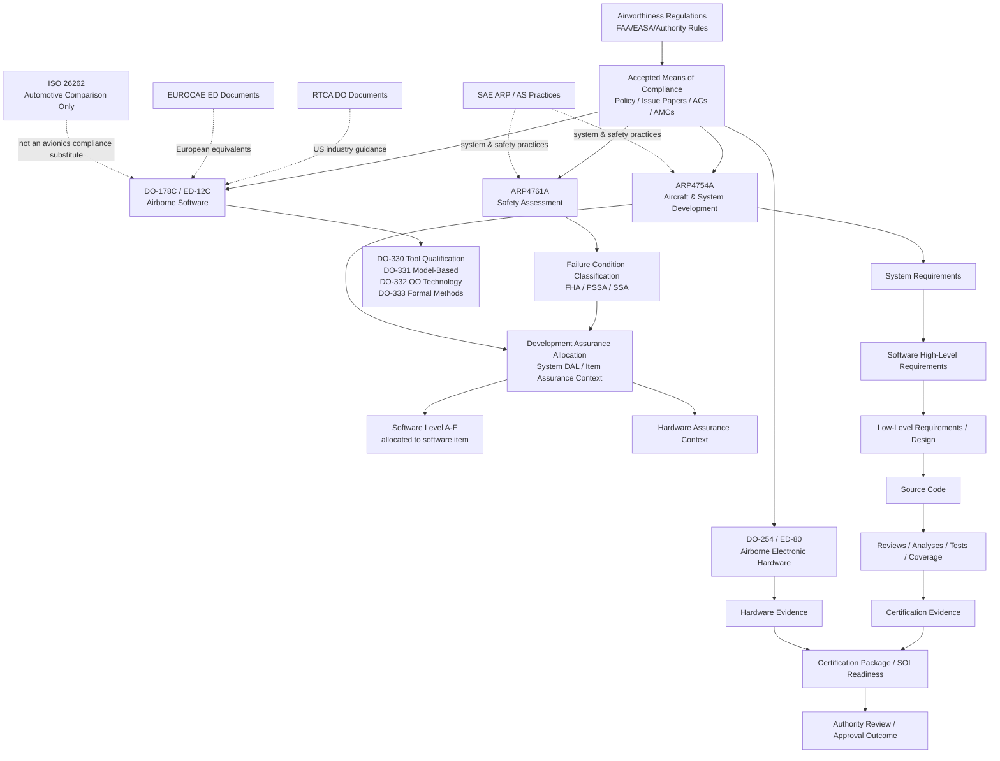

### 32.4 How the standards interact during certification

1. **System definition and allocation** start under **ARP4754A**. Aircraft/system requirements are decomposed, allocated, validated, and flowed into software and hardware items.
2. **Safety assessment** under **ARP4761/4761A** determines failure conditions, severity, architecture mitigations, monitoring, redundancy needs, and assurance expectations.
3. The allocated software item is developed and verified under **DO-178C**. That includes planning, requirements, design, coding, reviews, testing, traceability, problem reporting, configuration management, quality assurance, and certification liaison.
4. Any complex airborne electronic hardware relevant to the item may be developed under **DO-254**. Software verification must understand hardware interfaces, timing assumptions, initialization dependencies, failure reporting, and lab representativeness.
5. When tools automate verification or replace/reduce manual verification, **DO-330** considerations may apply. Model-based methods, OO technology, or formal methods may invoke **DO-331/332/333**.
6. Certification evidence is reviewed through authority/auditor engagements such as **SOI reviews**. Conformance is evaluated against approved or accepted project plans and the applicable guidance set.

### 32.5 What each standard addresses in practical senior-engineer terms

- **DO-178B:** legacy certification basis, still encountered in sustaining programs, historical procedures, and older verification environments.
- **DO-178C:** the operational rulebook for software life-cycle data, verification strategy, independence, structural coverage, and certification evidence.
- **DO-254:** the matching assurance framework for complex airborne hardware; important whenever software behavior depends on programmable logic, board configuration, or hardware fault containment.
- **ARP4754A:** explains where the software item came from, how system requirements were allocated, and how aircraft/system validation frames software intent.
- **ARP4761/4761A:** explains why the software has a given criticality and what failure conditions, monitors, and architectural mitigations the verification campaign must respect.
- **SAE standards:** broader aerospace engineering backbone; they often define upstream process expectations, interfaces, and safety/system-engineering context.
- **RTCA standards:** dominant US aviation guidance publications for certification means of compliance.
- **EUROCAE standards:** aligned European publications, commonly used in parallel with RTCA references for multinational programs.
- **ISO 26262:** useful to compare hazard-based thinking and confirmation concepts, but must not be mistaken for an airborne software certification framework.

### 32.6 Which standards an avionics verification engineer must know

**Must know deeply:**
- **DO-178C / ED-12C** — objectives, software levels, independence, life-cycle data, verification, structural coverage, reviews, analyses, and testing rigor.
- **Project certification plans** derived from DO-178C — especially PSAC, SDP, SVP, SCMP, SQAP, and SAS expectations.
- **ARP4754A** — enough to understand requirement origin, validation context, system decomposition, integration hierarchy, and cross-item assumptions.
- **ARP4761/4761A** — enough to understand failure condition rationale, safety requirements, monitoring logic, and negative-test motivation.

**Must know well:**
- **DO-254** — especially interface assumptions, representativeness of benches, and HW/SW responsibility boundaries.
- **DO-330** — when tools provide verification credit or automate checks that otherwise require manual evidence.
- **Merit and limits of DO-331/332/333** when the project uses model-based development, OO technology, or formal methods.

**Must be able to compare but not confuse:**
- **DO-178B vs DO-178C** — what changed, what did not, and which legacy artifacts remain acceptable under sustaining contexts.
- **ISO 26262 vs DO-178C** — vocabulary and process parallels without crossing domain boundaries.

### 32.7 Senior engineer takeaways

- Certification success depends on **aligned planning across system, safety, software, hardware, and quality**.
- Verification engineers do not work in a software-only bubble; they verify software behavior in the context created by **ARP4754A + ARP4761 + platform hardware realities**.
- Senior/Lead engineers must be able to explain not only **what failed**, but **which standard/process expectation was violated and what evidence restores compliance**.

## SECTION 33 — Important Certification Disclaimer

### 33.1 Five categories that must never be confused

| Category | Meaning | Typical Source | Level of Authority | Example | Misuse to Avoid |
|---|---|---|---|---|---|
| **Regulatory requirement** | Mandatory legal / airworthiness requirement applicable to the certification basis | FAA/EASA regulations, certification basis, special conditions, issue papers, CRIs | Highest | Compliance with airworthiness regulations for software-containing airborne systems | Saying “DO-178C itself is the law” |
| **Industry guidance** | Accepted means of compliance or recognized guidance used to show regulatory compliance | DO-178C, DO-254, ACs, AMCs, policy memos | High but not identical to law | Using DO-178C objectives to demonstrate software design assurance | Treating guidance text as if it automatically overrides project/authority agreements |
| **Company process** | Organization-level standard operating process defining how projects execute | Corporate processes, work instructions, templates, quality manuals | Binding internally when adopted | Standard review workflow, naming rules, problem-report states | Assuming company process alone proves certification acceptability |
| **Project-specific certification plan** | Tailored plan approved/accepted for the project describing how compliance will be shown | PSAC, SVP, SCMP, SDP, SQAP, tool plans | Binding for that project once baselined/accepted | Project defines independence method, test environment controls, review authority, and evidence package | Using generic company practice when the approved project plan says otherwise |
| **Recommended engineering practice** | Technically sound way to reduce risk and improve evidence quality | Senior engineering judgment, lessons learned, domain best practice | Advisory unless captured in approved process/plan | Peer dry-runs before SOI, dashboarding flakiness, deterministic log formats | Claiming a good practice is a DO-178C requirement without basis |

### 33.2 Accurate DO-178C terminology usage notes

- **DO-178C is guidance**, commonly used as an accepted means of compliance; it is not itself the airworthiness regulation.
- DO-178C speaks in terms of **software levels A through E**, not automotive ASILs.
- Software level is **allocated from system safety and system development context**; verification engineers should not describe it as a purely local software decision.
- DO-178C emphasizes **objectives**, **activities**, and **life-cycle data**. A project may tailor methods, but the approved approach must still satisfy the applicable objectives.
- Use **high-level requirements**, **low-level requirements**, **software architecture**, **source code**, **integration**, **verification**, **configuration management**, **quality assurance**, and **certification liaison** precisely.
- Use **structural coverage analysis** correctly. It is not a substitute for requirements-based testing; it is an additional analysis activity used to assess completeness of exercised code structure.
- Use **independence** correctly. Independence means the verifier is not the author of the item being independently verified where the objective requires it. It is not merely “another person looked at it once.”
- Use **tool qualification** carefully. Tools are not automatically qualified because they are widely used; qualification depends on the tool role and the project’s intended credit.
- Use **problem report / anomaly / issue** terminology consistently with the project process. For certification, closed-loop disposition evidence matters more than informal verbal explanations.
- Use **SOI** terminology carefully. SOI reviews assess readiness, process conformance, and evidence completeness against the project’s approved approach; they are not casual status meetings.

### 33.3 Simplified examples disclaimer

The examples in this study material are intentionally simplified to teach concepts efficiently. In real certification programs:

- Requirements sets are larger, more interdependent, and safety-context dependent.
- Traceability may span system requirements, software high-level requirements, low-level requirements, design elements, code units, test procedures, expected results, coverage items, review records, anomalies, and release baselines.
- Independence, representativeness, timing realism, partitioning concerns, hardware-in-the-loop fidelity, and lab calibration constraints can materially change the verification strategy.
- Authority expectations depend on the approved plans, system novelty, previous certification history, tool usage, service experience, and quality of objective evidence.

### 33.4 Practical disclaimer for senior/lead engineers

Use this material to understand **principles**, **terminology**, **evidence logic**, and **engineering behavior**. Do **not** use any example here as a replacement for:

- the approved **project PSAC/SVP/SCMP/SDP/SQAP**,
- the organization’s controlled procedures,
- the authority-agreed certification basis, or
- program-specific safety, system, and platform constraints.

A strong verification engineer knows when a useful training simplification must be replaced by the **exact project requirement, exact approved method, and exact evidence record**.

## SECTION 34 — Architecture Diagrams

The following Mermaid diagrams are intentionally detailed to support senior-level explanation, design reviews, onboarding, and certification-readiness discussions.

### 34.1 Avionics software lifecycle

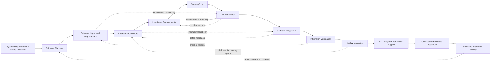

### 34.2 DO-178C lifecycle

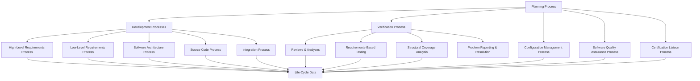

### 34.3 V-model

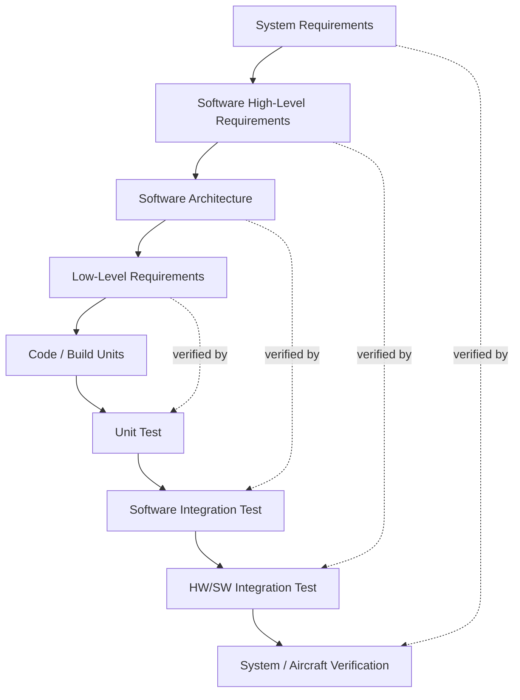

### 34.4 Requirement traceability

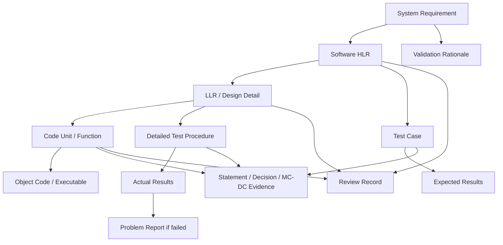

### 34.5 HSIT architecture

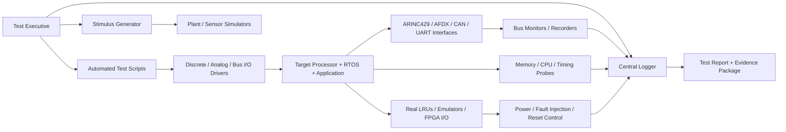

### 34.6 SWIT architecture

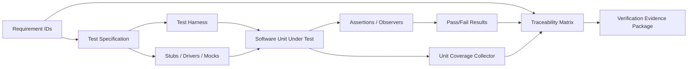

### 34.7 Test automation framework

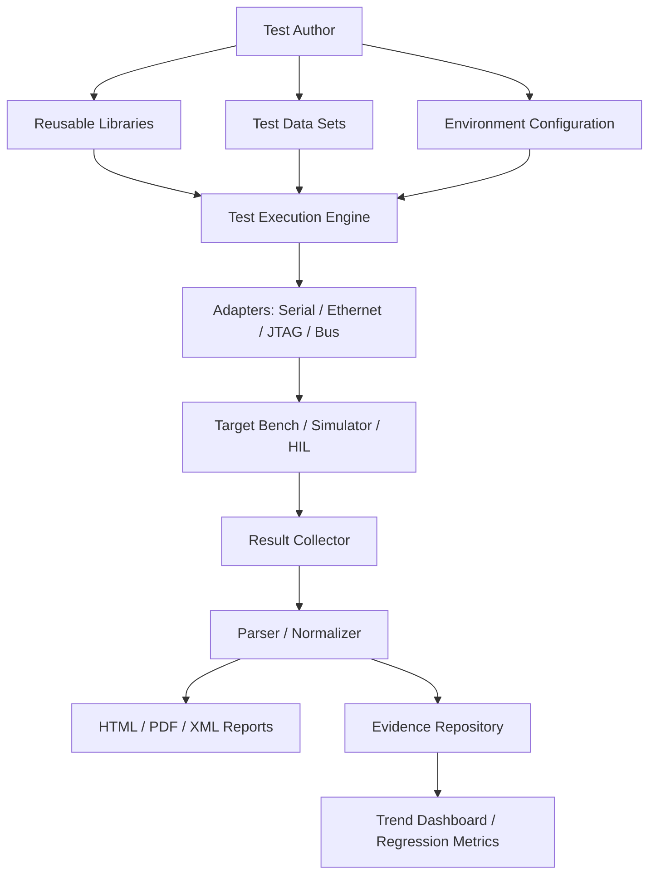

### 34.8 CI/CD pipeline

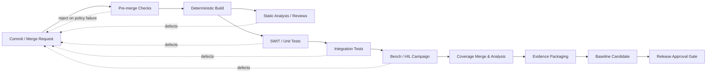

### 34.9 Configuration management workflow

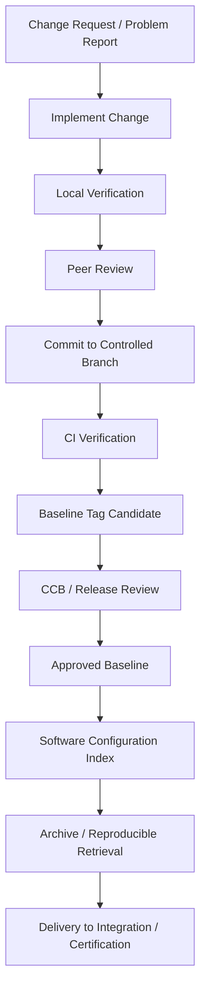

### 34.10 Change management workflow

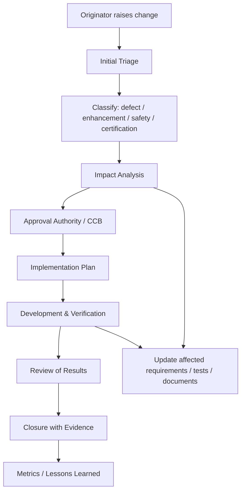

### 34.11 Problem-report workflow

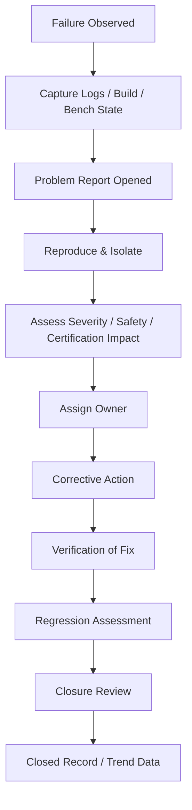

### 34.12 MC/DC analysis process

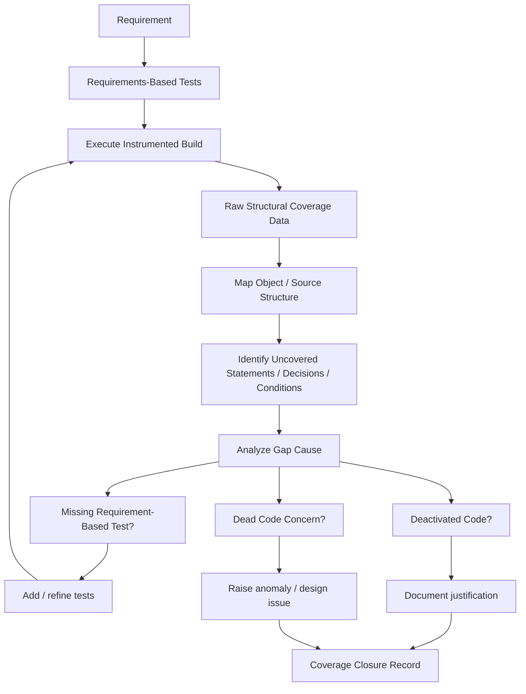

### 34.13 Certification evidence flow

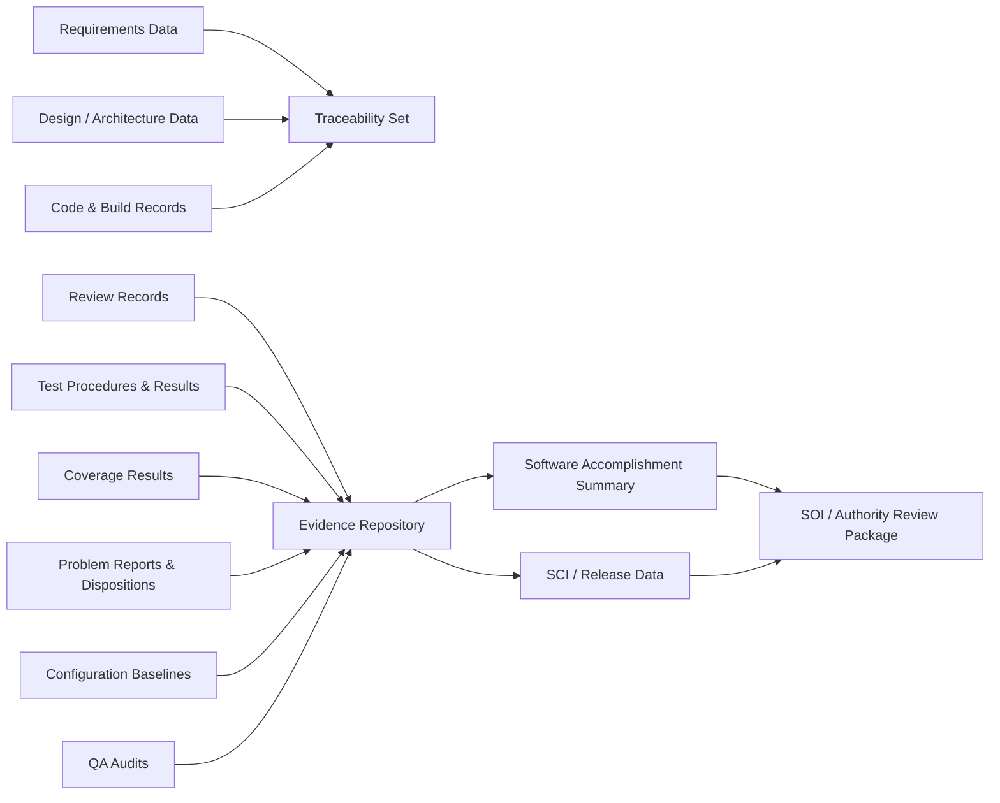

### 34.14 SOI lifecycle

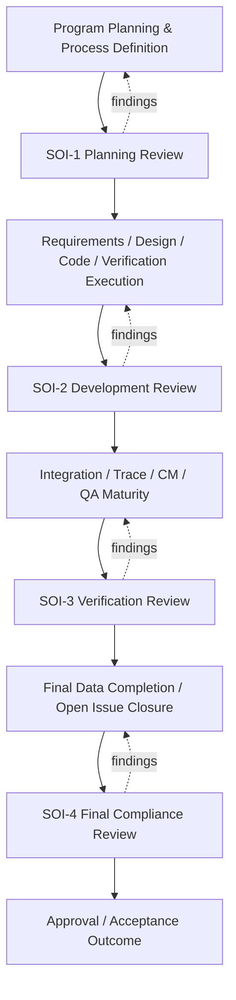

### 34.15 Complete avionics verification ecosystem

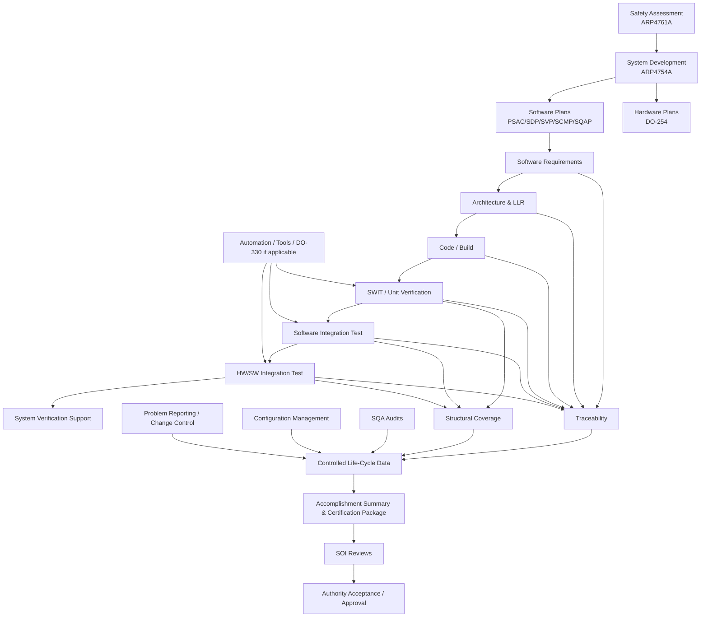

## SECTION 35 — Production-Grade Engineering Principles

These principles separate a merely functional verification effort from a certification-ready verification system. For each principle, the key question is not “Do we say we do this?” but “Can an independent reviewer follow objective evidence and prove that we did this consistently?”

### 35.1 Repeatability

- **Definition:** The same input conditions, software baseline, bench configuration, test procedure, and environment settings produce the same result every time.
- **Why critical in avionics:** Certification evidence is weak if outcomes drift between executions; repeatability underpins trust in regression results and defect reproduction.
- **How to implement:** Version-control every procedure, freeze bench configuration, control initial states, log seeds/time sync, and standardize resets and environmental preconditions.
- **How to verify the principle is actually working:** Re-run the same procedure on the same baseline and confirm identical verdict, timing band, logs, and coverage deltas.
- **Common violations:** Manual bench tweaks, hidden environment variables, ad hoc data files, and undocumented power-cycle steps.
- **Audit expectations:** Auditors expect exact baseline identifiers, bench setup records, and reproducible replay paths.

### 35.2 Determinism

- **Definition:** The software and the verification environment behave in bounded, explainable ways; any timing or ordering dependence is known and controlled.
- **Why critical in avionics:** Avionics failures often hide in race conditions, asynchronous interfaces, or startup order assumptions. Non-deterministic benches create false failures and false passes.
- **How to implement:** Stabilize schedulers where possible, bound timeouts, isolate asynchronous dependencies, timestamp all interfaces, and define acceptance windows from requirements—not convenience.
- **How to verify the principle is actually working:** Show repeated runs with bounded variation, review timeout rationale, and verify the same stimulus order yields the same state trajectory.
- **Common violations:** Sleeping “a bit longer” to make tests pass, using wall-clock behavior without control, and accepting intermittent pass rates.
- **Audit expectations:** Auditors will challenge flaky tests, uncontrolled timing assumptions, and acceptance ranges without requirement basis.

### 35.3 Traceability

- **Definition:** Every verified behavior can be traced from source requirement through design, code, test, result, anomaly, and baseline.
- **Why critical in avionics:** Without traceability, evidence completeness cannot be shown and gap analysis becomes guesswork.
- **How to implement:** Maintain bidirectional trace matrices, unique IDs, change impact links, and explicit mapping from tests and reviews to requirements.
- **How to verify the principle is actually working:** Perform forward and backward trace audits and sample changes to ensure impacted artifacts updated consistently.
- **Common violations:** Orphan tests, unlabeled logs, code not linked to requirements, and changes merged without impact analysis.
- **Audit expectations:** Expect spot-checks where reviewers ask to start from a requirement or defect and navigate the full evidence chain.

### 35.4 Reproducibility

- **Definition:** Another qualified engineer can recreate the result using the recorded baseline, procedure, tools, and data.
- **Why critical in avionics:** Programs survive staff turnover, lab migrations, and repeated authority reviews only if evidence is reproducible beyond the original author.
- **How to implement:** Capture build instructions, tool versions, test data, instrument settings, bench topology, and exact execution commands.
- **How to verify the principle is actually working:** Ask a different engineer to recreate selected results from archived data and measure how much tribal knowledge was required.
- **Common violations:** Results that depend on local workspaces, personal scripts, or undocumented patching.
- **Audit expectations:** Audit expectation: archived artifacts must be retrievable and executable enough to reconstruct findings.

### 35.5 Independence

- **Definition:** Where required, verification is performed by someone other than the item’s author, with sufficient organizational freedom to identify issues objectively.
- **Why critical in avionics:** High-assurance avionics relies on unbiased defect detection, especially for Level A/B objectives.
- **How to implement:** Define author/verifier roles, tool permissions, review sign-off rules, and escalation paths that prevent self-approval.
- **How to verify the principle is actually working:** Sample records to confirm the same individual is not both author and independent verifier where prohibited.
- **Common violations:** Rubber-stamp reviews, proxy sign-offs, or “independent” checks done by the original author through informal channels.
- **Audit expectations:** Auditors expect role evidence, approval segregation, and consistent independence application.

### 35.6 Configuration control

- **Definition:** All life-cycle data, environments, tools, test assets, and delivered binaries are versioned and baselined.
- **Why critical in avionics:** Certification depends on knowing exactly what was verified and what was delivered.
- **How to implement:** Use controlled repositories, branching strategy, immutable baseline tags, approved release identifiers, and configuration indexes.
- **How to verify the principle is actually working:** Select a released binary and prove the exact source, requirements, procedures, results, and open-problem set used to qualify it.
- **Common violations:** Re-running tests on untagged code or editing procedures after execution without version bumps.
- **Audit expectations:** Audits target baseline integrity, change history, and archive completeness.

### 35.7 Auditability

- **Definition:** Evidence is organized so an independent party can inspect, understand, and challenge it efficiently.
- **Why critical in avionics:** Good engineering that cannot be audited is often treated as unproven engineering.
- **How to implement:** Use structured reports, review checklists, anomaly histories, cross-referenced IDs, and stable repository locations.
- **How to verify the principle is actually working:** Perform internal mock audits with time-boxed retrieval of requested evidence.
- **Common violations:** Screenshots without context, free-form notes, missing reviewer identity, and ambiguous report versions.
- **Audit expectations:** Auditors look for completeness, consistency, and retrieval speed—not just volume.

### 35.8 Evidence-based verification

- **Definition:** Pass/fail claims are justified by objective records, not memory, confidence, or reputation.
- **Why critical in avionics:** Certification decisions are made on evidence, especially when defects, deviations, or coverage gaps exist.
- **How to implement:** Automate evidence capture, link verdicts to requirement IDs, preserve raw logs, and document anomaly disposition rationale.
- **How to verify the principle is actually working:** Challenge a sample test: can the team show the exact expected result, exact actual result, and exact closure basis?
- **Common violations:** “It passed on the bench yesterday” with no preserved data, or acceptance based on verbal explanation.
- **Audit expectations:** Auditors expect objective proof and closure logic for every notable exception.

### 35.9 Risk-based thinking

- **Definition:** Effort is prioritized based on safety significance, architectural fragility, service-history risk, novelty, and defect patterns.
- **Why critical in avionics:** Not all verification tasks are equal; scarce time must be applied where latent risk can escape to the aircraft.
- **How to implement:** Use safety classifications, critical interface mapping, defect trend reviews, and complexity hot spots to focus reviews and regression depth.
- **How to verify the principle is actually working:** Compare regression content and review intensity against known high-risk functions and recent change scope.
- **Common violations:** Treating a Level A mode transition and a maintenance label formatting change as identical verification effort.
- **Audit expectations:** Auditors may ask why certain scenarios were selected or omitted; rationale must be defensible.

### 35.10 Automation

- **Definition:** Tools reduce human error, accelerate regression, and improve evidence consistency when used under controlled assumptions.
- **Why critical in avionics:** Large avionics programs cannot sustain manual-only regression, trace maintenance, or evidence assembly.
- **How to implement:** Automate repetitive execution, data normalization, report generation, trace checks, and environment provisioning under version control.
- **How to verify the principle is actually working:** Validate tool outputs against known references, monitor flakiness, and qualify tools when project credit requires it.
- **Common violations:** Opaque scripts no one reviews, auto-generated reports with unchecked parsing logic, or hidden post-processing.
- **Audit expectations:** Audit focus includes tool role definition, review of generated outputs, and qualification rationale where applicable.

### 35.11 Regression protection

- **Definition:** Every approved change preserves previously verified behavior unless intentionally changed and re-approved.
- **Why critical in avionics:** Avionics defects often reappear through interface drift, timing impact, or unintended initialization changes.
- **How to implement:** Maintain regression suites by risk area, link them to changed artifacts, and require closure of failed regressions before baseline promotion.
- **How to verify the principle is actually working:** Demonstrate that change impact triggered the correct regression subset and that escaped defects feed suite improvement.
- **Common violations:** Running only new tests for a change or waiving unrelated failures without rationale.
- **Audit expectations:** Auditors expect evidence that prior compliance was not silently broken by later changes.

### 35.12 Controlled change

- **Definition:** No change enters the baseline without analysis, approval, implementation discipline, verification, and closure evidence.
- **Why critical in avionics:** Uncontrolled changes destroy certification trust even if the code looks correct.
- **How to implement:** Route all changes through formal change control with impact analysis on requirements, tests, coverage, documents, and safety assessments.
- **How to verify the principle is actually working:** Trace a sample change from request through approval, implementation, verification, baseline update, and release note.
- **Common violations:** Emergency edits on lab branches, undocumented test updates, and post-results “cleanup” without change records.
- **Audit expectations:** Auditors inspect whether process discipline holds under schedule pressure.

### 35.13 Clear ownership

- **Definition:** Each artifact, anomaly, test environment, and certification action has an accountable owner.
- **Why critical in avionics:** Ambiguity causes stale defects, missing updates, and gaps between teams.
- **How to implement:** Assign owners for requirements, benches, automation libraries, anomaly triage, coverage closure, and SOI preparation.
- **How to verify the principle is actually working:** Check aging reports, overdue items, and whether owners can explain current status and next actions.
- **Common violations:** Shared responsibility with no named owner, or constant reassignment with no decision authority.
- **Audit expectations:** Audit expectation: accountability must be visible in the records, not assumed from team memory.

### 35.14 Defect prevention

- **Definition:** The organization learns from escapes and removes the process conditions that allow recurrence.
- **Why critical in avionics:** Late avionics defects are expensive because they affect evidence packages, integration schedules, and authority confidence.
- **How to implement:** Use root-cause analysis, coding/checklist improvement, interface contracts, static checks, and regression enrichment.
- **How to verify the principle is actually working:** Track recurrence metrics, repeat-cause frequency, and whether corrective actions changed process assets.
- **Common violations:** Closing defects with code fixes only and no prevention action for repeated patterns.
- **Audit expectations:** Auditors respond well when systemic improvements are visible and effective.

### 35.15 Continuous improvement

- **Definition:** Processes, tools, checklists, metrics, and team behaviors are refined using objective feedback.
- **Why critical in avionics:** Long-lived avionics programs need maturing efficiency without sacrificing rigor.
- **How to implement:** Run retrospectives, trend escaped defects, measure review yield, and update assets under change control.
- **How to verify the principle is actually working:** Show before/after metrics, updated procedures, and training records tied to recurring pain points.
- **Common violations:** Improvement by folklore only, with no controlled process update or training follow-through.
- **Audit expectations:** Audit expectation: improvement must be controlled, justified, and reflected in the actual working process.

## SECTION 36 — Final Senior Engineer Competency Matrix

The matrix below describes what capability typically looks like at four maturity levels. The intent is not job-title policing; it is calibration for growth, delegation, interviewing, and staffing of certification-critical work.

| Skill | Beginner | Intermediate | Senior | Lead |
|---|---|---|---|---|
| DO-178C | Knows basic purpose, key life-cycle data names, and that software levels affect rigor. | Can execute assigned verification tasks using project procedures and identify relevant DO-178C objectives with guidance. | Interprets objectives independently, anticipates evidence gaps, and aligns reviews/tests/coverage with project plans. | Defines project strategy, negotiates interpretations with stakeholders, and prepares the organization for audits and SOIs. |
| DAL / Software Level | Understands A-E ordering and that higher criticality increases rigor. | Can explain why a component has its allocated level and follow corresponding verification constraints. | Uses level-driven thinking to tailor reviews, independence, test depth, and anomaly prioritization. | Explains development-assurance implications across system/software/hardware boundaries and manages staffing accordingly. |
| Requirements | Reads and traces requirements but needs help spotting ambiguity and unverifiability. | Can review for clarity, singularity, and testability; derives straightforward test conditions. | Finds hidden assumptions, interface gaps, mode confusion, and safety-significant omissions before test execution. | Establishes requirement quality standards, review checklists, and cross-discipline alignment with system engineering. |
| Verification | Runs procedures and records results correctly. | Can design, execute, and close normal verification activities for owned areas. | Builds risk-based verification strategies, integrates reviews/analysis/testing, and closes evidence gaps systematically. | Owns verification architecture, staffing, readiness criteria, and program-level closure logic. |
| Test Design | Writes basic nominal and boundary tests with supervision. | Designs meaningful functional, robustness, and negative tests from requirements. | Builds complete requirement-based test sets covering state, timing, fault handling, and interface interactions. | Defines reusable test design patterns and review standards for the whole program. |
| Test Execution | Executes controlled procedures and captures logs accurately. | Triages straightforward failures and manages environment setup with limited support. | Runs complex campaigns across benches, identifies false failures, and protects evidence integrity. | Optimizes lab utilization, gating strategy, and escalation workflows across teams. |
| MC/DC | Knows the concept and can read simple decision tables. | Can collect coverage, identify gaps, and add tests for simple logic with help. | Performs efficient MC/DC closure, explains gap causes, and prevents misuse of coverage as requirements evidence. | Defines project policy for coverage closure, tool usage, and anomaly handling under schedule pressure. |
| HSIT | Understands bench components and follows bring-up procedures. | Executes HW/SW integration procedures and recognizes common platform issues. | Designs HSIT campaigns, validates bench representativeness, and isolates HW/SW boundary problems. | Shapes HSIT architecture, investment roadmap, fault-injection strategy, and integration governance. |
| SWIT | Can use the approved unit-test toolchain for assigned modules. | Creates unit tests with stubs/drivers, captures coverage, and documents results. | Designs maintainable harnesses, reviews low-level requirement coverage, and closes complex unit issues. | Standardizes unit-verification strategy, tool usage, and scalability across the codebase. |
| Integration | Understands interface documents and basic sequencing. | Integrates components with moderate support and diagnoses straightforward interface mismatches. | Leads multi-component integration, manages assumptions, and anticipates timing/data-coupling failures. | Owns integration strategy from software layers through platform/system entry criteria. |
| Debugging | Uses logs and breakpoints for direct fault isolation. | Can narrow failures to module or interface level and reproduce them reliably. | Combines traces, timing evidence, requirements context, and architecture knowledge to isolate complex faults quickly. | Coaches others in systematic debugging and removes organizational causes of slow fault isolation. |
| RCA | Participates in root-cause discussions. | Can separate symptom from proximate cause for local issues. | Drives rigorous technical and process root-cause analysis with preventive actions. | Institutionalizes RCA quality, trend reviews, and management visibility of systemic risk. |
| Python | Writes simple scripts for parsing or execution helpers. | Builds maintainable utilities with arguments, logging, and basic tests. | Designs robust automation libraries, data pipelines, and evidence tooling under configuration control. | Defines Python engineering standards, review criteria, and long-term automation architecture. |
| Robot Framework | Can author and run basic keywords/tests. | Builds modular suites, variables, and reusable resources for bench automation. | Designs scalable keyword libraries, stable data models, and result integrations for large regressions. | Owns automation framework direction, governance, and integration with CI/evidence systems. |
| VectorCAST | Runs existing harnesses and interprets standard reports. | Creates harnesses and closes straightforward coverage gaps. | Uses advanced stubbing, environment control, and coverage analysis for complex low-level logic. | Sets program-wide usage patterns, review gates, and qualification considerations where relevant. |
| RTRT | Executes approved workflows and understands generated artifacts. | Creates tests and analyzes outcomes for medium-complexity modules. | Uses advanced features to model interfaces, inject faults, and manage regression at scale. | Defines when and how RTRT fits the verification strategy relative to other tools. |
| Git | Commits safely and follows branch naming rules. | Performs rebases/merges responsibly and reads history for change context. | Uses Git to preserve evidence integrity, forensic traceability, and controlled release baselines. | Defines branching, protection, review, and release conventions compatible with certification needs. |
| Jenkins | Triggers jobs and reads logs. | Can adjust pipeline parameters and triage common job failures. | Designs deterministic pipelines with artifact retention, gating, and traceable evidence outputs. | Owns CI governance, infrastructure reliability, and compliance-aware automation policy. |
| Configuration Management | Understands baselines, versions, and release labels. | Controls assigned artifacts correctly and follows change procedures. | Designs reproducible baselines spanning code, tests, tools, docs, and bench states. | Leads CM strategy, audits, and data-retention policy for certification programs. |
| Change Management | Follows the workflow for submitting and updating changes. | Performs local impact analysis and documents closure evidence. | Assesses cross-artifact impact, regression need, certification risk, and stakeholder approvals. | Chairs or meaningfully drives CCB decisions and enforces disciplined closure criteria. |
| Certification | Knows the names of core plans and audit events. | Supports audits by retrieving evidence and answering scoped questions. | Prepares compliance narratives, anticipates SOI findings, and closes authority-facing evidence gaps. | Leads certification readiness, authority interactions, and final evidence strategy with confidence. |
| SOI | Understands that SOIs review process and evidence maturity. | Prepares owned artifacts for SOI entry and addresses findings. | Runs internal readiness reviews and maps findings to objective closure actions. | Directs end-to-end SOI strategy, rehearsal, messaging, and post-review corrective action. |
| Leadership | Mentors informally and communicates status clearly. | Coordinates small work packages and escalates issues responsibly. | Leads cross-functional teams, protects technical rigor under schedule pressure, and develops other engineers. | Builds high-trust teams, resolves organizational friction, and aligns engineering execution with certification goals. |
| Project Management | Tracks own tasks and dependencies. | Plans moderate work packages with realistic sequencing and risk notes. | Balances scope, risk, evidence maturity, and resource constraints across verification streams. | Owns roadmap, staffing tradeoffs, stakeholder communication, and delivery confidence at program level. |

## SECTION 37 — Final Assessment

This final assessment is intended for senior/lead readiness. Parts A and B are concise by design. Parts C through J are scenario-driven and expect structured reasoning, traceability awareness, certification discipline, and technically defensible decisions.

### Part A — 100 Theoretical Questions (with answers)

1. **Q:** What is the primary purpose of DO-178C?  
   **A:** To provide guidance for development and verification of airborne software and the evidence used to show compliance with airworthiness requirements.
2. **Q:** Is DO-178C itself the law?  
   **A:** No. It is industry guidance commonly used as an accepted means of compliance.
3. **Q:** What determines software level A through E?  
   **A:** System safety and system-development allocation, not software preference alone.
4. **Q:** What does ARP4754A primarily address?  
   **A:** Aircraft and system development, including requirement allocation and development assurance at system level.
5. **Q:** What does ARP4761 primarily address?  
   **A:** Safety assessment methods such as FHA, PSSA, SSA, FTA, and FMEA.
6. **Q:** What does DO-254 address?  
   **A:** Design assurance for complex airborne electronic hardware.
7. **Q:** Why must verification engineers understand ARP4761 outputs?  
   **A:** Because safety-derived assumptions, failure conditions, and monitors shape verification focus and negative testing.
8. **Q:** What is the relationship between RTCA and EUROCAE documents?  
   **A:** They publish aligned aviation guidance, such as DO-178C and ED-12C equivalents.
9. **Q:** Why is ISO 26262 only a comparison point here?  
   **A:** Because it is automotive functional safety guidance, not an airborne certification basis.
10. **Q:** What is the main distinction between avionics and automotive compliance?  
   **A:** Avionics uses authority-facing certification evidence with standards like DO-178C; automotive uses a different safety and regulatory model.
11. **Q:** What is a PSAC?  
   **A:** Plan for Software Aspects of Certification; it describes how software compliance will be shown.
12. **Q:** What is an SVP?  
   **A:** Software Verification Plan; it defines the verification approach, methods, environments, and responsibilities.
13. **Q:** What is an SCMP?  
   **A:** Software Configuration Management Plan; it defines configuration identification, control, status accounting, and archives.
14. **Q:** What is an SQAP?  
   **A:** Software Quality Assurance Plan; it defines QA oversight and audit responsibilities.
15. **Q:** What is an SDP?  
   **A:** Software Development Plan; it describes the development processes and standards.
16. **Q:** What are high-level requirements?  
   **A:** Software requirements derived from system requirements that define externally observable software behavior.
17. **Q:** What are low-level requirements?  
   **A:** Detailed software requirements describing internal behavior and design-level functionality needed to implement HLRs.
18. **Q:** Why must requirements be verifiable?  
   **A:** Because unverifiable requirements cannot be objectively shown correct or complete.
19. **Q:** Why are ambiguous requirements dangerous?  
   **A:** They allow different interpretations in code, tests, and reviews, creating latent defects and invalid evidence.
20. **Q:** What is bidirectional traceability?  
   **A:** The ability to trace forward and backward among requirements, design, code, tests, results, and anomalies.
21. **Q:** Why are reviews important in DO-178C?  
   **A:** They detect defects early and provide objective evidence that life-cycle data satisfy standards and plans.
22. **Q:** What is independence in verification?  
   **A:** Required separation between item author and verifier for specific objectives, especially at higher software levels.
23. **Q:** Why is self-verification a problem for independent objectives?  
   **A:** Because it defeats the assurance intent of independent defect detection.
24. **Q:** What is requirements-based testing?  
   **A:** Testing derived from requirements to show intended behavior, not from code structure alone.
25. **Q:** Why is structural coverage not a substitute for requirements-based testing?  
   **A:** Because coverage only shows which code structure executed, not whether the right requirements were verified.
26. **Q:** What is statement coverage?  
   **A:** Evidence that each executable statement was exercised.
27. **Q:** What is decision coverage?  
   **A:** Evidence that each decision outcome evaluated both true and false.
28. **Q:** What is MC/DC?  
   **A:** Modified Condition/Decision Coverage; each condition must be shown to independently affect the decision outcome.
29. **Q:** Why is MC/DC required for Level A software?  
   **A:** Because the highest software criticality demands stronger evidence that complex logic has been adequately exercised.
30. **Q:** What is dead code?  
   **A:** Code that cannot execute in any operational context.
31. **Q:** Why is dead code unacceptable?  
   **A:** Because it represents uncontrolled or unjustified implementation not linked to requirements.
32. **Q:** What is deactivated code?  
   **A:** Code intentionally not executed in a particular configuration or mode but still valid under controlled conditions.
33. **Q:** Why must deactivated code be justified?  
   **A:** Because the project must show why it is not part of the current operational behavior and how it is controlled.
34. **Q:** What is object code verification concern?  
   **A:** The need to ensure compiled object behavior does not invalidate assumptions made from source-level verification.
35. **Q:** What is a test procedure?  
   **A:** A controlled sequence of steps, stimuli, expected results, and recording instructions used during execution.
36. **Q:** Why are expected results important?  
   **A:** They define objective pass/fail criteria before execution, preventing subjective interpretation.
37. **Q:** What is a problem report?  
   **A:** A controlled record of an observed anomaly, its investigation, disposition, and closure status.
38. **Q:** Why is reproducibility important for problem reports?  
   **A:** Because defects must be recreated and isolated reliably to justify root cause and closure.
39. **Q:** What is a baseline?  
   **A:** A formally identified set of controlled artifacts approved for further use or reference.
40. **Q:** Why is configuration identification critical?  
   **A:** It allows the team to prove exactly what was tested, reviewed, and delivered.
41. **Q:** What is change impact analysis?  
   **A:** Assessment of which requirements, design items, code, tests, documents, and safety assumptions are affected by a change.
42. **Q:** Why are uncontrolled lab changes dangerous?  
   **A:** They create evidence that cannot be trusted or reproduced.
43. **Q:** What is tool qualification?  
   **A:** A process for establishing confidence in a tool when the project relies on the tool to eliminate, reduce, or automate otherwise required verification.
44. **Q:** Does every test tool need qualification?  
   **A:** No. Qualification depends on the tool’s role and the credit claimed.
45. **Q:** Why is automation useful in avionics?  
   **A:** It improves repeatability, speed, consistency, and evidence capture when properly controlled.
46. **Q:** What is a flaky test?  
   **A:** A test that intermittently passes or fails without a controlled, explainable change in the item under test.
47. **Q:** Why must flaky tests be treated seriously?  
   **A:** They undermine confidence in regression results and can mask real faults.
48. **Q:** What is regression testing?  
   **A:** Re-execution of selected tests to show that existing verified behavior remains intact after change.
49. **Q:** Why should regression selection be risk-based?  
   **A:** Because high-risk, safety-significant, or highly coupled areas deserve greater protection.
50. **Q:** What is HSIT?  
   **A:** Hardware/Software Integration Testing, where software is exercised with representative hardware interfaces and platform behavior.
51. **Q:** What is SWIT?  
   **A:** Software Integration or Software Unit/Integration Test depending on project terminology; in this material it refers to software-level verification below HSIT.
52. **Q:** Why is bench representativeness important?  
   **A:** Because non-representative benches can hide or invent integration issues.
53. **Q:** What is fault injection?  
   **A:** Deliberate introduction of abnormal inputs, failures, or interface disruptions to verify detection and recovery behavior.
54. **Q:** Why are startup and shutdown sequences important test targets?  
   **A:** They commonly contain timing, initialization, and interdependency defects.
55. **Q:** What is requirement coverage?  
   **A:** Evidence that every applicable requirement has at least one adequate verification activity.
56. **Q:** What is review coverage?  
   **A:** Evidence that each artifact requiring review was reviewed against defined criteria.
57. **Q:** Why are mode transitions high-risk?  
   **A:** Because logic, timing, and inhibit conditions often change simultaneously at boundaries.
58. **Q:** What is data coupling?  
   **A:** Dependence between software components through shared data or passed values.
59. **Q:** What is control coupling?  
   **A:** Dependence introduced when one component controls the execution or behavior of another.
60. **Q:** Why do data/control coupling matter?  
   **A:** They drive integration verification and can reveal interface defects not visible in unit tests.
61. **Q:** What is a derived requirement?  
   **A:** A requirement created during software development that was not directly allocated from higher-level requirements but is necessary for correct implementation.
62. **Q:** Why must derived requirements be controlled?  
   **A:** Because they can affect system behavior and may require system-level review and approval.
63. **Q:** What is the role of SQA?  
   **A:** To provide independent oversight that defined processes are followed and noncompliances are tracked.
64. **Q:** What is the role of CM?  
   **A:** To identify, control, record, and archive configuration items and their changes.
65. **Q:** What is certification liaison?  
   **A:** Project activity that manages communication and data presentation for authority or designee review.
66. **Q:** What is an SOI review?  
   **A:** A Stage of Involvement review used to assess process implementation and evidence maturity.
67. **Q:** What is usually checked at SOI-1?  
   **A:** Planning adequacy, standards, procedures, and readiness to execute the approved approach.
68. **Q:** What is usually emphasized at SOI-2?  
   **A:** Development process implementation and data quality for requirements, design, code, and early verification artifacts.
69. **Q:** What is usually emphasized at SOI-3?  
   **A:** Verification completeness, traceability, coverage, anomaly handling, and integration evidence.
70. **Q:** What is usually emphasized at SOI-4?  
   **A:** Final compliance package completeness, residual issues, and closure of project data.
71. **Q:** Why are audit trails important?  
   **A:** They let independent reviewers reconstruct what happened and why decisions were made.
72. **Q:** What is root cause analysis?  
   **A:** Structured determination of the underlying technical and/or process cause of a problem.
73. **Q:** Why is symptom-only fixing insufficient?  
   **A:** Because the same defect pattern can recur elsewhere or later.
74. **Q:** What is controlled documentation?  
   **A:** Documentation under configuration management with version, approval, and change history.
75. **Q:** Why must test environments be controlled?  
   **A:** Environment drift can invalidate results even when the software baseline is unchanged.
76. **Q:** What is a pass/fail criterion?  
   **A:** The pre-defined objective condition used to accept or reject a test result.
77. **Q:** Why should acceptance windows come from requirements?  
   **A:** Because arbitrary tolerances weaken objective verification.
78. **Q:** What is a robustness test?  
   **A:** A test that challenges software with invalid, unexpected, boundary, or stressful conditions.
79. **Q:** Why are negative tests necessary?  
   **A:** Safety-critical software must show correct behavior not only in nominal conditions but also in off-nominal ones.
80. **Q:** What is release readiness?  
   **A:** The state in which approved evidence, baselines, open-item status, and approvals support delivery or certification progression.
81. **Q:** Why are open-problem reviews important before release?  
   **A:** Because unresolved anomalies may have safety, compliance, or operational consequences.
82. **Q:** What is evidence closure?  
   **A:** The state in which required artifacts are complete, reviewed, traceable, and consistent with the released baseline.
83. **Q:** What makes a verification metric useful?  
   **A:** It drives action, is unambiguous, and reflects real maturity or risk rather than vanity counts.
84. **Q:** Why should verification leads monitor defect trends?  
   **A:** Trend data reveal fragile areas, process weaknesses, and regression priorities.
85. **Q:** What is a controlled script?  
   **A:** An automation asset under version control, review, and approved execution rules.
86. **Q:** Why should generated reports be reviewed?  
   **A:** Because automation can generate misleading outputs if parsers, mappings, or assumptions are wrong.
87. **Q:** What is evidence integrity?  
   **A:** Confidence that stored results and artifacts are authentic, complete, and linked to the claimed baseline.
88. **Q:** Why is clear ownership needed?  
   **A:** Critical artifacts and anomalies can otherwise stagnate with no accountable decision-maker.
89. **Q:** What is a certification finding?  
   **A:** An issue raised by an authority/designee or internal audit showing noncompliance, gap, or insufficient evidence.
90. **Q:** How should a finding be answered?  
   **A:** With objective evidence, root cause, corrective action, containment, and prevention—not opinion alone.
91. **Q:** Why do senior engineers need cross-discipline awareness?  
   **A:** Software verification decisions depend on system safety, hardware behavior, integration reality, and certification strategy.
92. **Q:** What is the value of internal mock audits?  
   **A:** They expose weak retrieval paths, inconsistent terminology, and immature evidence before formal review.
93. **Q:** Why is schedule pressure dangerous in certification work?  
   **A:** It tempts teams to bypass controls that protect evidence integrity and airworthiness confidence.
94. **Q:** What is controlled reuse?  
   **A:** Reusing artifacts, tools, or tests with documented applicability, gap analysis, and approval.
95. **Q:** Why must assumptions be made explicit?  
   **A:** Hidden assumptions often become certification escapes or integration defects.
96. **Q:** What is a lead engineer expected to do during disputes?  
   **A:** Anchor decisions in requirements, plans, evidence, risk, and certification impact rather than preference.
97. **Q:** What is the final objective of avionics verification?  
   **A:** To provide objective, traceable evidence that the software correctly implements its requirements with rigor appropriate to its criticality.
98. **Q:** What is a certification-ready verification culture?  
   **A:** A culture that values evidence integrity, disciplined process execution, technical rigor, and transparent escalation of gaps.
99. **Q:** Why should senior engineers challenge weak assumptions early?  
   **A:** Because unresolved assumptions become expensive integration, safety, and certification problems later.
100. **Q:** What is the hallmark of a production-grade verification organization?  
   **A:** It consistently produces repeatable, traceable, auditable evidence that survives independent scrutiny.

### Part B — 50 MC/DC Questions (with truth tables and solutions)

Notation: `0=False`, `1=True`. “MC/DC solution” lists one valid set of row pairs demonstrating independent effect of each condition. Many equivalent solutions may exist.

#### B1. Decision: `A AND B`

**Question:** Provide MC/DC for decision `A AND B`.

| A | B | D |
|---|---|---|
| 0 | 0 | 0 |
| 0 | 1 | 0 |
| 1 | 0 | 0 |
| 1 | 1 | 1 |
**MC/DC solution:** A: `01`↔`11`; B: `10`↔`11`. These pairs change only the named condition and flip the decision outcome.

#### B2. Decision: `A OR B`

**Question:** Provide MC/DC for decision `A OR B`.

| A | B | D |
|---|---|---|
| 0 | 0 | 0 |
| 0 | 1 | 1 |
| 1 | 0 | 1 |
| 1 | 1 | 1 |
**MC/DC solution:** A: `00`↔`10`; B: `00`↔`01`. These pairs change only the named condition and flip the decision outcome.

#### B3. Decision: `A AND NOT B`

**Question:** Provide MC/DC for decision `A AND NOT B`.

| A | B | D |
|---|---|---|
| 0 | 0 | 0 |
| 0 | 1 | 0 |
| 1 | 0 | 1 |
| 1 | 1 | 0 |
**MC/DC solution:** A: `00`↔`10`; B: `10`↔`11`. These pairs change only the named condition and flip the decision outcome.

#### B4. Decision: `A OR NOT B`

**Question:** Provide MC/DC for decision `A OR NOT B`.

| A | B | D |
|---|---|---|
| 0 | 0 | 1 |
| 0 | 1 | 0 |
| 1 | 0 | 1 |
| 1 | 1 | 1 |
**MC/DC solution:** A: `01`↔`11`; B: `00`↔`01`. These pairs change only the named condition and flip the decision outcome.

#### B5. Decision: `(A AND B) OR C`

**Question:** Provide MC/DC for decision `(A AND B) OR C`.

| A | B | C | D |
|---|---|---|---|
| 0 | 0 | 0 | 0 |
| 0 | 0 | 1 | 1 |
| 0 | 1 | 0 | 0 |
| 0 | 1 | 1 | 1 |
| 1 | 0 | 0 | 0 |
| 1 | 0 | 1 | 1 |
| 1 | 1 | 0 | 1 |
| 1 | 1 | 1 | 1 |
**MC/DC solution:** A: `010`↔`110`; B: `100`↔`110`; C: `000`↔`001`. These pairs change only the named condition and flip the decision outcome.

#### B6. Decision: `A AND (B OR C)`

**Question:** Provide MC/DC for decision `A AND (B OR C)`.

| A | B | C | D |
|---|---|---|---|
| 0 | 0 | 0 | 0 |
| 0 | 0 | 1 | 0 |
| 0 | 1 | 0 | 0 |
| 0 | 1 | 1 | 0 |
| 1 | 0 | 0 | 0 |
| 1 | 0 | 1 | 1 |
| 1 | 1 | 0 | 1 |
| 1 | 1 | 1 | 1 |
**MC/DC solution:** A: `001`↔`101`; B: `100`↔`110`; C: `100`↔`101`. These pairs change only the named condition and flip the decision outcome.

#### B7. Decision: `(A OR B) AND C`

**Question:** Provide MC/DC for decision `(A OR B) AND C`.

| A | B | C | D |
|---|---|---|---|
| 0 | 0 | 0 | 0 |
| 0 | 0 | 1 | 0 |
| 0 | 1 | 0 | 0 |
| 0 | 1 | 1 | 1 |
| 1 | 0 | 0 | 0 |
| 1 | 0 | 1 | 1 |
| 1 | 1 | 0 | 0 |
| 1 | 1 | 1 | 1 |
**MC/DC solution:** A: `001`↔`101`; B: `001`↔`011`; C: `010`↔`011`. These pairs change only the named condition and flip the decision outcome.

#### B8. Decision: `A OR (B AND C)`

**Question:** Provide MC/DC for decision `A OR (B AND C)`.

| A | B | C | D |
|---|---|---|---|
| 0 | 0 | 0 | 0 |
| 0 | 0 | 1 | 0 |
| 0 | 1 | 0 | 0 |
| 0 | 1 | 1 | 1 |
| 1 | 0 | 0 | 1 |
| 1 | 0 | 1 | 1 |
| 1 | 1 | 0 | 1 |
| 1 | 1 | 1 | 1 |
**MC/DC solution:** A: `000`↔`100`; B: `001`↔`011`; C: `010`↔`011`. These pairs change only the named condition and flip the decision outcome.

#### B9. Decision: `(A AND NOT B) OR C`

**Question:** Provide MC/DC for decision `(A AND NOT B) OR C`.

| A | B | C | D |
|---|---|---|---|
| 0 | 0 | 0 | 0 |
| 0 | 0 | 1 | 1 |
| 0 | 1 | 0 | 0 |
| 0 | 1 | 1 | 1 |
| 1 | 0 | 0 | 1 |
| 1 | 0 | 1 | 1 |
| 1 | 1 | 0 | 0 |
| 1 | 1 | 1 | 1 |
**MC/DC solution:** A: `000`↔`100`; B: `100`↔`110`; C: `000`↔`001`. These pairs change only the named condition and flip the decision outcome.

#### B10. Decision: `(A AND B) OR NOT C`

**Question:** Provide MC/DC for decision `(A AND B) OR NOT C`.

| A | B | C | D |
|---|---|---|---|
| 0 | 0 | 0 | 1 |
| 0 | 0 | 1 | 0 |
| 0 | 1 | 0 | 1 |
| 0 | 1 | 1 | 0 |
| 1 | 0 | 0 | 1 |
| 1 | 0 | 1 | 0 |
| 1 | 1 | 0 | 1 |
| 1 | 1 | 1 | 1 |
**MC/DC solution:** A: `011`↔`111`; B: `101`↔`111`; C: `000`↔`001`. These pairs change only the named condition and flip the decision outcome.

#### B11. Decision: `(A OR NOT B) AND C`

**Question:** Provide MC/DC for decision `(A OR NOT B) AND C`.

| A | B | C | D |
|---|---|---|---|
| 0 | 0 | 0 | 0 |
| 0 | 0 | 1 | 1 |
| 0 | 1 | 0 | 0 |
| 0 | 1 | 1 | 0 |
| 1 | 0 | 0 | 0 |
| 1 | 0 | 1 | 1 |
| 1 | 1 | 0 | 0 |
| 1 | 1 | 1 | 1 |
**MC/DC solution:** A: `011`↔`111`; B: `001`↔`011`; C: `000`↔`001`. These pairs change only the named condition and flip the decision outcome.

#### B12. Decision: `A AND (B OR NOT C)`

**Question:** Provide MC/DC for decision `A AND (B OR NOT C)`.

| A | B | C | D |
|---|---|---|---|
| 0 | 0 | 0 | 0 |
| 0 | 0 | 1 | 0 |
| 0 | 1 | 0 | 0 |
| 0 | 1 | 1 | 0 |
| 1 | 0 | 0 | 1 |
| 1 | 0 | 1 | 0 |
| 1 | 1 | 0 | 1 |
| 1 | 1 | 1 | 1 |
**MC/DC solution:** A: `000`↔`100`; B: `101`↔`111`; C: `100`↔`101`. These pairs change only the named condition and flip the decision outcome.

#### B13. Decision: `(NOT A AND B) OR C`

**Question:** Provide MC/DC for decision `(NOT A AND B) OR C`.

| A | B | C | D |
|---|---|---|---|
| 0 | 0 | 0 | 0 |
| 0 | 0 | 1 | 1 |
| 0 | 1 | 0 | 1 |
| 0 | 1 | 1 | 1 |
| 1 | 0 | 0 | 0 |
| 1 | 0 | 1 | 1 |
| 1 | 1 | 0 | 0 |
| 1 | 1 | 1 | 1 |
**MC/DC solution:** A: `010`↔`110`; B: `000`↔`010`; C: `000`↔`001`. These pairs change only the named condition and flip the decision outcome.

#### B14. Decision: `(A AND C) OR B`

**Question:** Provide MC/DC for decision `(A AND C) OR B`.

| A | B | C | D |
|---|---|---|---|
| 0 | 0 | 0 | 0 |
| 0 | 0 | 1 | 0 |
| 0 | 1 | 0 | 1 |
| 0 | 1 | 1 | 1 |
| 1 | 0 | 0 | 0 |
| 1 | 0 | 1 | 1 |
| 1 | 1 | 0 | 1 |
| 1 | 1 | 1 | 1 |
**MC/DC solution:** A: `001`↔`101`; B: `000`↔`010`; C: `100`↔`101`. These pairs change only the named condition and flip the decision outcome.

#### B15. Decision: `A OR (B AND NOT C)`

**Question:** Provide MC/DC for decision `A OR (B AND NOT C)`.

| A | B | C | D |
|---|---|---|---|
| 0 | 0 | 0 | 0 |
| 0 | 0 | 1 | 0 |
| 0 | 1 | 0 | 1 |
| 0 | 1 | 1 | 0 |
| 1 | 0 | 0 | 1 |
| 1 | 0 | 1 | 1 |
| 1 | 1 | 0 | 1 |
| 1 | 1 | 1 | 1 |
**MC/DC solution:** A: `000`↔`100`; B: `000`↔`010`; C: `010`↔`011`. These pairs change only the named condition and flip the decision outcome.

#### B16. Decision: `(A AND B) OR (B AND C)`

**Question:** Provide MC/DC for decision `(A AND B) OR (B AND C)`.

| A | B | C | D |
|---|---|---|---|
| 0 | 0 | 0 | 0 |
| 0 | 0 | 1 | 0 |
| 0 | 1 | 0 | 0 |
| 0 | 1 | 1 | 1 |
| 1 | 0 | 0 | 0 |
| 1 | 0 | 1 | 0 |
| 1 | 1 | 0 | 1 |
| 1 | 1 | 1 | 1 |
**MC/DC solution:** A: `010`↔`110`; B: `001`↔`011`; C: `010`↔`011`. These pairs change only the named condition and flip the decision outcome.

#### B17. Decision: `(A OR B) AND (A OR C)`

**Question:** Provide MC/DC for decision `(A OR B) AND (A OR C)`.

| A | B | C | D |
|---|---|---|---|
| 0 | 0 | 0 | 0 |
| 0 | 0 | 1 | 0 |
| 0 | 1 | 0 | 0 |
| 0 | 1 | 1 | 1 |
| 1 | 0 | 0 | 1 |
| 1 | 0 | 1 | 1 |
| 1 | 1 | 0 | 1 |
| 1 | 1 | 1 | 1 |
**MC/DC solution:** A: `000`↔`100`; B: `001`↔`011`; C: `010`↔`011`. These pairs change only the named condition and flip the decision outcome.

#### B18. Decision: `(A AND C) OR NOT B`

**Question:** Provide MC/DC for decision `(A AND C) OR NOT B`.

| A | B | C | D |
|---|---|---|---|
| 0 | 0 | 0 | 1 |
| 0 | 0 | 1 | 1 |
| 0 | 1 | 0 | 0 |
| 0 | 1 | 1 | 0 |
| 1 | 0 | 0 | 1 |
| 1 | 0 | 1 | 1 |
| 1 | 1 | 0 | 0 |
| 1 | 1 | 1 | 1 |
**MC/DC solution:** A: `011`↔`111`; B: `000`↔`010`; C: `110`↔`111`. These pairs change only the named condition and flip the decision outcome.

#### B19. Decision: `(NOT A OR B) AND C`

**Question:** Provide MC/DC for decision `(NOT A OR B) AND C`.

| A | B | C | D |
|---|---|---|---|
| 0 | 0 | 0 | 0 |
| 0 | 0 | 1 | 1 |
| 0 | 1 | 0 | 0 |
| 0 | 1 | 1 | 1 |
| 1 | 0 | 0 | 0 |
| 1 | 0 | 1 | 0 |
| 1 | 1 | 0 | 0 |
| 1 | 1 | 1 | 1 |
**MC/DC solution:** A: `001`↔`101`; B: `101`↔`111`; C: `000`↔`001`. These pairs change only the named condition and flip the decision outcome.

#### B20. Decision: `A AND (NOT B OR C)`

**Question:** Provide MC/DC for decision `A AND (NOT B OR C)`.

| A | B | C | D |
|---|---|---|---|
| 0 | 0 | 0 | 0 |
| 0 | 0 | 1 | 0 |
| 0 | 1 | 0 | 0 |
| 0 | 1 | 1 | 0 |
| 1 | 0 | 0 | 1 |
| 1 | 0 | 1 | 1 |
| 1 | 1 | 0 | 0 |
| 1 | 1 | 1 | 1 |
**MC/DC solution:** A: `000`↔`100`; B: `100`↔`110`; C: `110`↔`111`. These pairs change only the named condition and flip the decision outcome.

#### B21. Decision: `(A OR C) AND B`

**Question:** Provide MC/DC for decision `(A OR C) AND B`.

| A | B | C | D |
|---|---|---|---|
| 0 | 0 | 0 | 0 |
| 0 | 0 | 1 | 0 |
| 0 | 1 | 0 | 0 |
| 0 | 1 | 1 | 1 |
| 1 | 0 | 0 | 0 |
| 1 | 0 | 1 | 0 |
| 1 | 1 | 0 | 1 |
| 1 | 1 | 1 | 1 |
**MC/DC solution:** A: `010`↔`110`; B: `001`↔`011`; C: `010`↔`011`. These pairs change only the named condition and flip the decision outcome.

#### B22. Decision: `(A AND NOT C) OR B`

**Question:** Provide MC/DC for decision `(A AND NOT C) OR B`.

| A | B | C | D |
|---|---|---|---|
| 0 | 0 | 0 | 0 |
| 0 | 0 | 1 | 0 |
| 0 | 1 | 0 | 1 |
| 0 | 1 | 1 | 1 |
| 1 | 0 | 0 | 1 |
| 1 | 0 | 1 | 0 |
| 1 | 1 | 0 | 1 |
| 1 | 1 | 1 | 1 |
**MC/DC solution:** A: `000`↔`100`; B: `000`↔`010`; C: `100`↔`101`. These pairs change only the named condition and flip the decision outcome.

#### B23. Decision: `(A OR B) AND NOT C`

**Question:** Provide MC/DC for decision `(A OR B) AND NOT C`.

| A | B | C | D |
|---|---|---|---|
| 0 | 0 | 0 | 0 |
| 0 | 0 | 1 | 0 |
| 0 | 1 | 0 | 1 |
| 0 | 1 | 1 | 0 |
| 1 | 0 | 0 | 1 |
| 1 | 0 | 1 | 0 |
| 1 | 1 | 0 | 1 |
| 1 | 1 | 1 | 0 |
**MC/DC solution:** A: `000`↔`100`; B: `000`↔`010`; C: `010`↔`011`. These pairs change only the named condition and flip the decision outcome.

#### B24. Decision: `NOT A OR (B AND C)`

**Question:** Provide MC/DC for decision `NOT A OR (B AND C)`.

| A | B | C | D |
|---|---|---|---|
| 0 | 0 | 0 | 1 |
| 0 | 0 | 1 | 1 |
| 0 | 1 | 0 | 1 |
| 0 | 1 | 1 | 1 |
| 1 | 0 | 0 | 0 |
| 1 | 0 | 1 | 0 |
| 1 | 1 | 0 | 0 |
| 1 | 1 | 1 | 1 |
**MC/DC solution:** A: `000`↔`100`; B: `101`↔`111`; C: `110`↔`111`. These pairs change only the named condition and flip the decision outcome.

#### B25. Decision: `(A AND B) OR (C AND NOT A)`

**Question:** Provide MC/DC for decision `(A AND B) OR (C AND NOT A)`.

| A | B | C | D |
|---|---|---|---|
| 0 | 0 | 0 | 0 |
| 0 | 0 | 1 | 1 |
| 0 | 1 | 0 | 0 |
| 0 | 1 | 1 | 1 |
| 1 | 0 | 0 | 0 |
| 1 | 0 | 1 | 0 |
| 1 | 1 | 0 | 1 |
| 1 | 1 | 1 | 1 |
**MC/DC solution:** A: `001`↔`101`; B: `100`↔`110`; C: `000`↔`001`. These pairs change only the named condition and flip the decision outcome.

#### B26. Decision: `(A OR NOT C) AND B`

**Question:** Provide MC/DC for decision `(A OR NOT C) AND B`.

| A | B | C | D |
|---|---|---|---|
| 0 | 0 | 0 | 0 |
| 0 | 0 | 1 | 0 |
| 0 | 1 | 0 | 1 |
| 0 | 1 | 1 | 0 |
| 1 | 0 | 0 | 0 |
| 1 | 0 | 1 | 0 |
| 1 | 1 | 0 | 1 |
| 1 | 1 | 1 | 1 |
**MC/DC solution:** A: `011`↔`111`; B: `000`↔`010`; C: `010`↔`011`. These pairs change only the named condition and flip the decision outcome.

#### B27. Decision: `(A AND B) OR (C AND B)`

**Question:** Provide MC/DC for decision `(A AND B) OR (C AND B)`.

| A | B | C | D |
|---|---|---|---|
| 0 | 0 | 0 | 0 |
| 0 | 0 | 1 | 0 |
| 0 | 1 | 0 | 0 |
| 0 | 1 | 1 | 1 |
| 1 | 0 | 0 | 0 |
| 1 | 0 | 1 | 0 |
| 1 | 1 | 0 | 1 |
| 1 | 1 | 1 | 1 |
**MC/DC solution:** A: `010`↔`110`; B: `001`↔`011`; C: `010`↔`011`. These pairs change only the named condition and flip the decision outcome.

#### B28. Decision: `(A OR B) AND (NOT A OR C)`

**Question:** Provide MC/DC for decision `(A OR B) AND (NOT A OR C)`.

| A | B | C | D |
|---|---|---|---|
| 0 | 0 | 0 | 0 |
| 0 | 0 | 1 | 0 |
| 0 | 1 | 0 | 1 |
| 0 | 1 | 1 | 1 |
| 1 | 0 | 0 | 0 |
| 1 | 0 | 1 | 1 |
| 1 | 1 | 0 | 0 |
| 1 | 1 | 1 | 1 |
**MC/DC solution:** A: `001`↔`101`; B: `000`↔`010`; C: `100`↔`101`. These pairs change only the named condition and flip the decision outcome.

#### B29. Decision: `(A AND NOT B) OR (B AND C)`

**Question:** Provide MC/DC for decision `(A AND NOT B) OR (B AND C)`.

| A | B | C | D |
|---|---|---|---|
| 0 | 0 | 0 | 0 |
| 0 | 0 | 1 | 0 |
| 0 | 1 | 0 | 0 |
| 0 | 1 | 1 | 1 |
| 1 | 0 | 0 | 1 |
| 1 | 0 | 1 | 1 |
| 1 | 1 | 0 | 0 |
| 1 | 1 | 1 | 1 |
**MC/DC solution:** A: `000`↔`100`; B: `001`↔`011`; C: `010`↔`011`. These pairs change only the named condition and flip the decision outcome.

#### B30. Decision: `(NOT A AND C) OR B`

**Question:** Provide MC/DC for decision `(NOT A AND C) OR B`.

| A | B | C | D |
|---|---|---|---|
| 0 | 0 | 0 | 0 |
| 0 | 0 | 1 | 1 |
| 0 | 1 | 0 | 1 |
| 0 | 1 | 1 | 1 |
| 1 | 0 | 0 | 0 |
| 1 | 0 | 1 | 0 |
| 1 | 1 | 0 | 1 |
| 1 | 1 | 1 | 1 |
**MC/DC solution:** A: `001`↔`101`; B: `000`↔`010`; C: `000`↔`001`. These pairs change only the named condition and flip the decision outcome.

#### B31. Decision: `(A OR C) AND (B OR C)`

**Question:** Provide MC/DC for decision `(A OR C) AND (B OR C)`.

| A | B | C | D |
|---|---|---|---|
| 0 | 0 | 0 | 0 |
| 0 | 0 | 1 | 1 |
| 0 | 1 | 0 | 0 |
| 0 | 1 | 1 | 1 |
| 1 | 0 | 0 | 0 |
| 1 | 0 | 1 | 1 |
| 1 | 1 | 0 | 1 |
| 1 | 1 | 1 | 1 |
**MC/DC solution:** A: `010`↔`110`; B: `100`↔`110`; C: `000`↔`001`. These pairs change only the named condition and flip the decision outcome.

#### B32. Decision: `(A AND B) OR (NOT B AND C)`

**Question:** Provide MC/DC for decision `(A AND B) OR (NOT B AND C)`.

| A | B | C | D |
|---|---|---|---|
| 0 | 0 | 0 | 0 |
| 0 | 0 | 1 | 1 |
| 0 | 1 | 0 | 0 |
| 0 | 1 | 1 | 0 |
| 1 | 0 | 0 | 0 |
| 1 | 0 | 1 | 1 |
| 1 | 1 | 0 | 1 |
| 1 | 1 | 1 | 1 |
**MC/DC solution:** A: `010`↔`110`; B: `001`↔`011`; C: `000`↔`001`. These pairs change only the named condition and flip the decision outcome.

#### B33. Decision: `(A OR B) AND (A OR NOT C)`

**Question:** Provide MC/DC for decision `(A OR B) AND (A OR NOT C)`.

| A | B | C | D |
|---|---|---|---|
| 0 | 0 | 0 | 0 |
| 0 | 0 | 1 | 0 |
| 0 | 1 | 0 | 1 |
| 0 | 1 | 1 | 0 |
| 1 | 0 | 0 | 1 |
| 1 | 0 | 1 | 1 |
| 1 | 1 | 0 | 1 |
| 1 | 1 | 1 | 1 |
**MC/DC solution:** A: `000`↔`100`; B: `000`↔`010`; C: `010`↔`011`. These pairs change only the named condition and flip the decision outcome.

#### B34. Decision: `(A AND C) OR (B AND NOT C)`

**Question:** Provide MC/DC for decision `(A AND C) OR (B AND NOT C)`.

| A | B | C | D |
|---|---|---|---|
| 0 | 0 | 0 | 0 |
| 0 | 0 | 1 | 0 |
| 0 | 1 | 0 | 1 |
| 0 | 1 | 1 | 0 |
| 1 | 0 | 0 | 0 |
| 1 | 0 | 1 | 1 |
| 1 | 1 | 0 | 1 |
| 1 | 1 | 1 | 1 |
**MC/DC solution:** A: `001`↔`101`; B: `000`↔`010`; C: `010`↔`011`. These pairs change only the named condition and flip the decision outcome.

#### B35. Decision: `(NOT A OR B) AND (A OR C)`

**Question:** Provide MC/DC for decision `(NOT A OR B) AND (A OR C)`.

| A | B | C | D |
|---|---|---|---|
| 0 | 0 | 0 | 0 |
| 0 | 0 | 1 | 1 |
| 0 | 1 | 0 | 0 |
| 0 | 1 | 1 | 1 |
| 1 | 0 | 0 | 0 |
| 1 | 0 | 1 | 0 |
| 1 | 1 | 0 | 1 |
| 1 | 1 | 1 | 1 |
**MC/DC solution:** A: `001`↔`101`; B: `100`↔`110`; C: `000`↔`001`. These pairs change only the named condition and flip the decision outcome.

#### B36. Decision: `(A AND B) OR (NOT A AND NOT C)`

**Question:** Provide MC/DC for decision `(A AND B) OR (NOT A AND NOT C)`.

| A | B | C | D |
|---|---|---|---|
| 0 | 0 | 0 | 1 |
| 0 | 0 | 1 | 0 |
| 0 | 1 | 0 | 1 |
| 0 | 1 | 1 | 0 |
| 1 | 0 | 0 | 0 |
| 1 | 0 | 1 | 0 |
| 1 | 1 | 0 | 1 |
| 1 | 1 | 1 | 1 |
**MC/DC solution:** A: `000`↔`100`; B: `100`↔`110`; C: `000`↔`001`. These pairs change only the named condition and flip the decision outcome.

#### B37. Decision: `(A OR NOT B) AND (B OR C)`

**Question:** Provide MC/DC for decision `(A OR NOT B) AND (B OR C)`.

| A | B | C | D |
|---|---|---|---|
| 0 | 0 | 0 | 0 |
| 0 | 0 | 1 | 1 |
| 0 | 1 | 0 | 0 |
| 0 | 1 | 1 | 0 |
| 1 | 0 | 0 | 0 |
| 1 | 0 | 1 | 1 |
| 1 | 1 | 0 | 1 |
| 1 | 1 | 1 | 1 |
**MC/DC solution:** A: `010`↔`110`; B: `001`↔`011`; C: `000`↔`001`. These pairs change only the named condition and flip the decision outcome.

#### B38. Decision: `(A AND (B OR C)) OR (NOT B AND C)`

**Question:** Provide MC/DC for decision `(A AND (B OR C)) OR (NOT B AND C)`.

| A | B | C | D |
|---|---|---|---|
| 0 | 0 | 0 | 0 |
| 0 | 0 | 1 | 1 |
| 0 | 1 | 0 | 0 |
| 0 | 1 | 1 | 0 |
| 1 | 0 | 0 | 0 |
| 1 | 0 | 1 | 1 |
| 1 | 1 | 0 | 1 |
| 1 | 1 | 1 | 1 |
**MC/DC solution:** A: `010`↔`110`; B: `001`↔`011`; C: `000`↔`001`. These pairs change only the named condition and flip the decision outcome.

#### B39. Decision: `(A OR B) AND (NOT A OR NOT C)`

**Question:** Provide MC/DC for decision `(A OR B) AND (NOT A OR NOT C)`.

| A | B | C | D |
|---|---|---|---|
| 0 | 0 | 0 | 0 |
| 0 | 0 | 1 | 0 |
| 0 | 1 | 0 | 1 |
| 0 | 1 | 1 | 1 |
| 1 | 0 | 0 | 1 |
| 1 | 0 | 1 | 0 |
| 1 | 1 | 0 | 1 |
| 1 | 1 | 1 | 0 |
**MC/DC solution:** A: `000`↔`100`; B: `000`↔`010`; C: `100`↔`101`. These pairs change only the named condition and flip the decision outcome.

#### B40. Decision: `(A AND B) OR (A AND NOT C)`

**Question:** Provide MC/DC for decision `(A AND B) OR (A AND NOT C)`.

| A | B | C | D |
|---|---|---|---|
| 0 | 0 | 0 | 0 |
| 0 | 0 | 1 | 0 |
| 0 | 1 | 0 | 0 |
| 0 | 1 | 1 | 0 |
| 1 | 0 | 0 | 1 |
| 1 | 0 | 1 | 0 |
| 1 | 1 | 0 | 1 |
| 1 | 1 | 1 | 1 |
**MC/DC solution:** A: `000`↔`100`; B: `101`↔`111`; C: `100`↔`101`. These pairs change only the named condition and flip the decision outcome.

#### B41. Decision: `(A OR B) AND (C OR NOT B)`

**Question:** Provide MC/DC for decision `(A OR B) AND (C OR NOT B)`.

| A | B | C | D |
|---|---|---|---|
| 0 | 0 | 0 | 0 |
| 0 | 0 | 1 | 0 |
| 0 | 1 | 0 | 0 |
| 0 | 1 | 1 | 1 |
| 1 | 0 | 0 | 1 |
| 1 | 0 | 1 | 1 |
| 1 | 1 | 0 | 0 |
| 1 | 1 | 1 | 1 |
**MC/DC solution:** A: `000`↔`100`; B: `001`↔`011`; C: `010`↔`011`. These pairs change only the named condition and flip the decision outcome.

#### B42. Decision: `(A AND NOT B) OR (NOT A AND C)`

**Question:** Provide MC/DC for decision `(A AND NOT B) OR (NOT A AND C)`.

| A | B | C | D |
|---|---|---|---|
| 0 | 0 | 0 | 0 |
| 0 | 0 | 1 | 1 |
| 0 | 1 | 0 | 0 |
| 0 | 1 | 1 | 1 |
| 1 | 0 | 0 | 1 |
| 1 | 0 | 1 | 1 |
| 1 | 1 | 0 | 0 |
| 1 | 1 | 1 | 0 |
**MC/DC solution:** A: `000`↔`100`; B: `100`↔`110`; C: `000`↔`001`. These pairs change only the named condition and flip the decision outcome.

#### B43. Decision: `(A OR C) AND (NOT A OR B)`

**Question:** Provide MC/DC for decision `(A OR C) AND (NOT A OR B)`.

| A | B | C | D |
|---|---|---|---|
| 0 | 0 | 0 | 0 |
| 0 | 0 | 1 | 1 |
| 0 | 1 | 0 | 0 |
| 0 | 1 | 1 | 1 |
| 1 | 0 | 0 | 0 |
| 1 | 0 | 1 | 0 |
| 1 | 1 | 0 | 1 |
| 1 | 1 | 1 | 1 |
**MC/DC solution:** A: `001`↔`101`; B: `100`↔`110`; C: `000`↔`001`. These pairs change only the named condition and flip the decision outcome.

#### B44. Decision: `(A AND B) OR (NOT A AND C)`

**Question:** Provide MC/DC for decision `(A AND B) OR (NOT A AND C)`.

| A | B | C | D |
|---|---|---|---|
| 0 | 0 | 0 | 0 |
| 0 | 0 | 1 | 1 |
| 0 | 1 | 0 | 0 |
| 0 | 1 | 1 | 1 |
| 1 | 0 | 0 | 0 |
| 1 | 0 | 1 | 0 |
| 1 | 1 | 0 | 1 |
| 1 | 1 | 1 | 1 |
**MC/DC solution:** A: `001`↔`101`; B: `100`↔`110`; C: `000`↔`001`. These pairs change only the named condition and flip the decision outcome.

#### B45. Decision: `(A OR B) AND (A OR C) AND (B OR C)`

**Question:** Provide MC/DC for decision `(A OR B) AND (A OR C) AND (B OR C)`.

| A | B | C | D |
|---|---|---|---|
| 0 | 0 | 0 | 0 |
| 0 | 0 | 1 | 0 |
| 0 | 1 | 0 | 0 |
| 0 | 1 | 1 | 1 |
| 1 | 0 | 0 | 0 |
| 1 | 0 | 1 | 1 |
| 1 | 1 | 0 | 1 |
| 1 | 1 | 1 | 1 |
**MC/DC solution:** A: `001`↔`101`; B: `001`↔`011`; C: `010`↔`011`. These pairs change only the named condition and flip the decision outcome.

#### B46. Decision: `(A AND NOT B AND C) OR (B AND C)`

**Question:** Provide MC/DC for decision `(A AND NOT B AND C) OR (B AND C)`.

| A | B | C | D |
|---|---|---|---|
| 0 | 0 | 0 | 0 |
| 0 | 0 | 1 | 0 |
| 0 | 1 | 0 | 0 |
| 0 | 1 | 1 | 1 |
| 1 | 0 | 0 | 0 |
| 1 | 0 | 1 | 1 |
| 1 | 1 | 0 | 0 |
| 1 | 1 | 1 | 1 |
**MC/DC solution:** A: `001`↔`101`; B: `001`↔`011`; C: `010`↔`011`. These pairs change only the named condition and flip the decision outcome.

#### B47. Decision: `(A OR C) AND (NOT B OR A)`

**Question:** Provide MC/DC for decision `(A OR C) AND (NOT B OR A)`.

| A | B | C | D |
|---|---|---|---|
| 0 | 0 | 0 | 0 |
| 0 | 0 | 1 | 1 |
| 0 | 1 | 0 | 0 |
| 0 | 1 | 1 | 0 |
| 1 | 0 | 0 | 1 |
| 1 | 0 | 1 | 1 |
| 1 | 1 | 0 | 1 |
| 1 | 1 | 1 | 1 |
**MC/DC solution:** A: `000`↔`100`; B: `001`↔`011`; C: `000`↔`001`. These pairs change only the named condition and flip the decision outcome.

#### B48. Decision: `(A AND B) OR (C AND (A OR B))`

**Question:** Provide MC/DC for decision `(A AND B) OR (C AND (A OR B))`.

| A | B | C | D |
|---|---|---|---|
| 0 | 0 | 0 | 0 |
| 0 | 0 | 1 | 0 |
| 0 | 1 | 0 | 0 |
| 0 | 1 | 1 | 1 |
| 1 | 0 | 0 | 0 |
| 1 | 0 | 1 | 1 |
| 1 | 1 | 0 | 1 |
| 1 | 1 | 1 | 1 |
**MC/DC solution:** A: `001`↔`101`; B: `001`↔`011`; C: `010`↔`011`. These pairs change only the named condition and flip the decision outcome.

#### B49. Decision: `(A OR B) AND (NOT C OR A)`

**Question:** Provide MC/DC for decision `(A OR B) AND (NOT C OR A)`.

| A | B | C | D |
|---|---|---|---|
| 0 | 0 | 0 | 0 |
| 0 | 0 | 1 | 0 |
| 0 | 1 | 0 | 1 |
| 0 | 1 | 1 | 0 |
| 1 | 0 | 0 | 1 |
| 1 | 0 | 1 | 1 |
| 1 | 1 | 0 | 1 |
| 1 | 1 | 1 | 1 |
**MC/DC solution:** A: `000`↔`100`; B: `000`↔`010`; C: `010`↔`011`. These pairs change only the named condition and flip the decision outcome.

#### B50. Decision: `(A AND (B OR NOT C)) OR (NOT A AND C)`

**Question:** Provide MC/DC for decision `(A AND (B OR NOT C)) OR (NOT A AND C)`.

| A | B | C | D |
|---|---|---|---|
| 0 | 0 | 0 | 0 |
| 0 | 0 | 1 | 1 |
| 0 | 1 | 0 | 0 |
| 0 | 1 | 1 | 1 |
| 1 | 0 | 0 | 1 |
| 1 | 0 | 1 | 0 |
| 1 | 1 | 0 | 1 |
| 1 | 1 | 1 | 1 |
**MC/DC solution:** A: `000`↔`100`; B: `101`↔`111`; C: `000`↔`001`. These pairs change only the named condition and flip the decision outcome.

### Part C — 30 Test-Case Design Problems (with solutions)

#### C1. Weight-on-wheels mode transition

**Scenario:** A flight-control monitoring function shall inhibit maintenance-only commands whenever weight-on-wheels transitions from ground to air. The transition may occur during a command sequence already in progress. Design a requirements-based test set.

**What a strong answer should consider:**
- State-transition coverage across command timing windows
- Nominal, near-boundary, and in-progress command behavior
- Persistence of inhibit after transition and after reversion
- Traceability to requirement wording and safety intent

**Solution approach:**
- Partition the behavior into pre-transition accepted, exact transition edge, in-progress command cancellation/continuation rule, and post-transition inhibited states.
- Create tests for stable ground, stable air, transition before command decode, transition after command decode but before execute, and transition during execution if allowed by architecture.
- Define expected outputs for command acknowledgement, command execution, annunciation, and event logging.
- Include robustness tests for chatter/bounce on weight-on-wheels input if not already handled elsewhere.
- Link each test to the specific clause of the requirement and record timing tolerances from the interface specification.

**Expected evidence / deliverables:**
- Trace matrix from requirement to test cases
- Time-correlated input/output logs showing transition timing
- Pass/fail criteria for command acceptance and inhibit status
- Problem reports for any ambiguous transition behavior

#### C2. Radio-altimeter invalid data handling

**Scenario:** An alerting application shall reject radio-altimeter altitude when validity is false, freeze the last valid display for 2 seconds, then blank the field and raise a maintenance message.

**What a strong answer should consider:**
- Mode sequencing and timer behavior
- Interface validity, displayed value, and maintenance outputs
- Off-nominal revalidation before timeout expires
- Boundary values at exactly 2 seconds

**Solution approach:**
- Decompose the requirement into three phases: invalidate detect, hold-last-valid window, and blanking/maintenance transition.
- Design tests for invalidation occurring at multiple altitude values, including zero, nominal cruise-low values, and a previously invalid state.
- Verify recovery path: validity returns before 2 seconds, at exactly 2 seconds, and after blanking.
- Add negative tests for oscillating validity to ensure timer reset behavior matches the requirement.
- Capture display output, internal timer/event markers if observable, and maintenance-message transitions.

**Expected evidence / deliverables:**
- Requirement-derived state table
- Timing logs proving the 2-second hold window
- Display output record and maintenance message record
- Regression list for related display functions

#### C3. Air-data failover freezing behavior

**Scenario:** On loss of primary air-data computer input, the software shall hold the last computed target speed for one frame, then switch to secondary data if valid; otherwise it shall enter reversionary mode.

**What a strong answer should consider:**
- Frame-based behavior and data-source selection
- Single-frame hold requirement
- Priority of secondary-source validity
- Reversion annunciation and downstream outputs

**Solution approach:**
- Build test cases for nominal failover, failover with invalid secondary source, and primary restoration.
- Exercise the exact frame where primary validity drops to verify “one frame only” hold behavior.
- Check target speed continuity, annunciation timing, and any logged reason codes.
- Add tests for secondary becoming valid during the hold frame versus after the hold frame.
- Ensure the expected results state both commanded speed output and mode-state transitions.

**Expected evidence / deliverables:**
- Frame-indexed execution logs
- Data-source selection traces
- Mode/annunciation output captures
- Updated trace links to failover requirement

#### C4. Dual-sensor median selection

**Scenario:** A monitoring function computes the median of three sensor values after rejecting any source flagged invalid. Design test cases that demonstrate correct selection and corner handling.

**What a strong answer should consider:**
- Nominal median selection
- Invalid-flag interaction with value ordering
- Equal values and duplicate values
- Insufficient-valid-source behavior

**Solution approach:**
- Create a value-partition matrix covering ordered ascending, descending, and duplicate-value sets.
- Test one invalid source, two invalid sources, and all-valid with outlier conditions.
- Verify the specified behavior when fewer than the minimum valid sensors remain; do not invent unstated behavior.
- Include limit and sign combinations if ranges include negative values.
- Check both computed output and any health/status output tied to invalid-source rejection.

**Expected evidence / deliverables:**
- Input vector table with expected median
- Status output verification record
- Review record showing requirement completeness/ambiguity handling
- Anomaly if insufficient-valid-source behavior is unspecified

#### C5. Engine-start interlock

**Scenario:** The software shall prevent starter engagement unless aircraft-on-ground, battery-voltage valid, fire-handle stowed, and engine speed below threshold.

**What a strong answer should consider:**
- Logical condition coverage
- Boundary testing on speed threshold
- Each inhibit reason isolated
- Expected pilot feedback or maintenance logging

**Solution approach:**
- Convert each clause into test conditions and derive a minimal but complete set including one passing case and one isolated failing case per inhibit condition.
- Test exact threshold, just-below, and just-above engine speed.
- Verify output command remains inhibited and any annunciation identifies or supports diagnosis of the inhibit.
- Add tests for simultaneous multiple inhibits to ensure no unsafe command is emitted.
- If requirements specify priority or logging order, verify that explicitly.

**Expected evidence / deliverables:**
- Condition matrix with traces to requirement clauses
- Command output logs and inhibit indications
- Boundary-value evidence for threshold handling
- MC/DC linkage if the logic is Level A relevant

#### C6. Flight-director mode reversion

**Scenario:** When selected vertical mode becomes invalid due to sensor loss, the flight director shall revert to basic pitch mode within one cycle and clear incompatible mode annunciations.

**What a strong answer should consider:**
- Mode invalidation trigger
- One-cycle timing requirement
- Annunciation cleanup
- No residual command from invalid mode

**Solution approach:**
- Design tests for each invalidation trigger source individually.
- Measure cycle-accurate transition from invalidation to reversion.
- Verify command outputs before, during, and after reversion, ensuring no stale mode command persists.
- Test re-selection after source restoration if requirements permit.
- Include negative cases where unrelated sensor faults must not trigger reversion.

**Expected evidence / deliverables:**
- Cycle-timestamped logs
- Annunciation screenshots or data logs
- Requirement/test trace entries
- Defect record if stale command persists

#### C7. FMS flight-plan activation

**Scenario:** Activating a modified flight plan shall replace active lateral guidance only after crew confirmation and only if the plan passes internal consistency checks.

**What a strong answer should consider:**
- Two-step activation logic
- Consistency-check failure path
- No premature guidance switch
- Crew interface acknowledgement behavior

**Solution approach:**
- Partition tests into modification present/absent, consistency pass/fail, and crew confirmation accept/reject.
- Verify that guidance source does not change on mere modification or preview.
- Add timing/order tests where confirmation arrives before consistency result is complete if asynchronous behavior exists.
- Check crew message outputs for rejected activations.
- Confirm traces exist to both operational and failure-path requirements.

**Expected evidence / deliverables:**
- Input/output sequence logs
- Crew confirmation event records
- Guidance-source status traces
- Issue record for any premature activation

#### C8. Brake-temperature caution

**Scenario:** A brake caution shall set when any brake temperature exceeds threshold for 3 consecutive samples and shall clear only after all temperatures remain below clear threshold for 10 consecutive samples.

**What a strong answer should consider:**
- Set/clear hysteresis
- Sample-count behavior
- Any-channel versus all-channel semantics
- Counter reset on interrupted sequences

**Solution approach:**
- Design tests for exact sample counts, interrupted counts, and multi-channel interactions.
- Verify set occurs on the third consecutive over-threshold sample, not earlier or later.
- Verify clear requires all channels below threshold for the full count.
- Add tests for a single channel bouncing around threshold while others remain cool.
- Capture internal counters if observable; otherwise infer behavior from outputs and sample timing.

**Expected evidence / deliverables:**
- Sample-by-sample input table and verdicts
- Set/clear timing evidence
- Threshold/hysteresis rationale trace
- Regression linkage to caution system outputs

#### C9. Bus freshness timeout

**Scenario:** A consuming function shall mark data stale if no new bus message with matching sequence count arrives within 100 ms.

**What a strong answer should consider:**
- Timeout boundary
- Sequence-count relevance
- Handling duplicate frames
- Recovery after stale state

**Solution approach:**
- Create tests for fresh updates at nominal rates, late updates at exactly 100 ms and just beyond, and duplicate frames with unchanged sequence count.
- Verify whether duplicate content with advanced sequence count is considered fresh per requirement.
- Test recovery when fresh data resumes after stale state.
- Ensure timestamp origin and measurement method are controlled in the bench.
- Document pass/fail based on stale flag and downstream output behavior.

**Expected evidence / deliverables:**
- Timestamped bus monitor log
- Stale-flag output evidence
- Sequence-count traceability notes
- Bench timing calibration reference

#### C10. Discrete input debounce

**Scenario:** A cockpit discrete shall be recognized only if stable for 50 ms; transient chatter must not cause state changes.

**What a strong answer should consider:**
- Debounce accept/reject windows
- Chatter patterns
- Recognition latency
- State retention during noise

**Solution approach:**
- Design pulse-width tests below, at, and above 50 ms.
- Include multi-bounce patterns with cumulative unstable time that must not be mistaken for stable assertion.
- Verify release debounce if the requirement is symmetric.
- Measure the latest acceptable recognition time based on sample period and implementation constraints.
- Capture raw input and debounced output in the same time base.

**Expected evidence / deliverables:**
- Stimulus waveform definition
- Raw-versus-debounced timing evidence
- Boundary-value acceptance table
- Anomaly if sampling assumptions are undocumented

#### C11. Startup BIT latching

**Scenario:** A power-up built-in test result shall latch FAIL until a complete power cycle, even if the underlying fault disappears.

**What a strong answer should consider:**
- Startup-only behavior
- Latching persistence
- Power-cycle reset conditions
- Separation from transient runtime faults

**Solution approach:**
- Test initial pass, initial fail, fail-then-condition-removed, and subsequent runtime nominal operation.
- Verify the fail indication remains latched despite fault removal.
- Perform a complete power-cycle per hardware procedure and confirm latch reset conditions.
- Check event logs or maintenance pages for stored reason codes.
- Differentiate software reset from full power-cycle if the requirement distinguishes them.

**Expected evidence / deliverables:**
- Power-state control record
- Latched-status logs across resets
- Maintenance/event log evidence
- Trace to startup BIT requirement

#### C12. NVM CRC recovery

**Scenario:** If stored calibration data CRC is invalid at startup, defaults shall be loaded, a maintenance flag set, and write-back inhibited until maintenance action.

**What a strong answer should consider:**
- Fault detection
- Default-data substitution
- Maintenance reporting
- Write-inhibit behavior

**Solution approach:**
- Prepare test data with valid CRC, invalid CRC, and partially corrupted payload.
- Verify defaults are applied consistently and unsafe partial use of corrupt data does not occur.
- Confirm maintenance flag and write inhibit outputs.
- Test restart behavior to ensure the condition remains properly managed until cleared by approved action.
- Document exact default values used and their source requirement.

**Expected evidence / deliverables:**
- Controlled corrupted NVM images
- Startup logs showing CRC decision
- Output evidence for defaults and inhibit
- Problem report if partial corrupt use is observed

#### C13. BIT inhibit in flight

**Scenario:** A maintenance BIT command shall be rejected whenever aircraft state is airborne, regardless of maintenance panel request validity.

**What a strong answer should consider:**
- Safety-driven inhibit
- Priority over command validity
- Crew/maintenance feedback
- No partial BIT side effects

**Solution approach:**
- Design passing tests for ground state and failing tests for airborne state.
- Attempt the command with otherwise valid parameters in airborne state to prove the inhibit is state-driven.
- Verify no partial BIT execution starts before rejection.
- Check acknowledgement, reject message, and any maintenance event record.
- Add transition testing around takeoff if the interface can change during command issue.

**Expected evidence / deliverables:**
- Command/reject logs
- BIT execution monitor evidence
- State-source traceability
- Safety rationale note in review record

#### C14. Command/monitor mismatch detection

**Scenario:** A monitor shall declare mismatch if commanded valve position and sensed valve position differ by more than tolerance for 200 ms.

**What a strong answer should consider:**
- Tolerance boundary
- Persistence time window
- Transient mismatch rejection
- Recovery/clear behavior

**Solution approach:**
- Create exact-boundary tests for difference equal to tolerance and just over tolerance.
- Vary persistence to less than, equal to, and greater than 200 ms.
- Test nominal convergence before timeout expiration.
- Verify clear/reset behavior if specified.
- Correlate commanded and sensed channels on a common time base.

**Expected evidence / deliverables:**
- Input/output time series
- Tolerance boundary test record
- Fault indication set/clear evidence
- Updated regression for valve monitoring

#### C15. Redundancy channel switchover

**Scenario:** A lane manager shall switch from active channel A to standby channel B when A heartbeat is missing for N frames and B health is good.

**What a strong answer should consider:**
- Heartbeat-miss counting
- Standby eligibility
- Output continuity during switchover
- No oscillation between channels

**Solution approach:**
- Test isolated A failure, B unhealthy standby, and restoration cases.
- Exercise exact N-1, N, and N+1 missing-frame sequences.
- Verify command continuity and source-status outputs during the switch.
- Add tests for A heartbeat returning immediately after switch to ensure hysteresis/ownership logic is respected.
- Inspect bus outputs and health-state logs together.

**Expected evidence / deliverables:**
- Frame-count evidence
- Source-selection logs
- Output continuity report
- Anomaly if oscillation occurs

#### C16. Gain-schedule boundary

**Scenario:** A control law selects gain table bands based on Mach number. Design tests around band edges to prove correct band selection and interpolation rules.

**What a strong answer should consider:**
- Boundary analysis
- Interpolation within band
- No skipped/overlapped bands
- Numerical precision handling

**Solution approach:**
- Identify every band edge and generate tests just below, at, and just above each.
- Verify interpolation within at least one representative point per band.
- Check behavior for exact boundary values against the requirement’s inclusion rule.
- Add a robustness test for out-of-range Mach if behavior is specified.
- Use tolerances derived from requirement math, not arbitrary comparison thresholds.

**Expected evidence / deliverables:**
- Boundary-value matrix
- Computed expected values with rationale
- Comparison logs or plots
- Review record for numerical method assumptions

#### C17. Latitude/longitude normalization

**Scenario:** Navigation software shall normalize longitude to the interval [-180, +180) before publishing it.

**What a strong answer should consider:**
- Equivalence classes for wraparound
- Boundary behavior at -180 and +180
- Multiple-wrap inputs
- Sign convention consistency

**Solution approach:**
- Create tests for nominal in-range values, exactly -180, exactly +180, just above +180, just below -180, and values multiple turns away.
- Verify output range and continuity with expected wrap rule.
- Check paired latitude/longitude records if downstream formatting uses both.
- Add negative tests for NaN/invalid input if specified.
- Document the mathematical convention used in expected results.

**Expected evidence / deliverables:**
- Input/output normalization table
- Boundary-case result logs
- Trace to normalization requirement
- Issue if interval definition is inconsistently implemented

#### C18. Timer wraparound handling

**Scenario:** An elapsed-time function uses a free-running counter that wraps at 65535. Demonstrate that timeout logic remains correct across wraparound.

**What a strong answer should consider:**
- Counter wrap behavior
- Timeout arithmetic correctness
- No false timeout on wrap
- Boundary sequences

**Solution approach:**
- Construct tests where start time is before wrap and current time is after wrap.
- Verify elapsed calculation for no-timeout, exact-timeout, and timeout cases across wrap.
- Add nominal non-wrap cases as control points.
- Ensure any helper assumptions about unsigned arithmetic are visible and reviewed.
- Capture raw counter values and computed timeout decisions.

**Expected evidence / deliverables:**
- Counter sequence logs
- Expected elapsed-time calculations
- Pass/fail evidence for wrap cases
- Review artifact referencing arithmetic rationale

#### C19. Maintenance-page access lock

**Scenario:** Maintenance pages shall be accessible only when aircraft is on ground, parking brake set, and maintenance password accepted.

**What a strong answer should consider:**
- Access-control condition matrix
- Incorrect password behavior
- State transitions while page open
- No unintended partial access

**Solution approach:**
- Derive tests isolating each condition and at least one all-true access case.
- Verify incorrect password does not grant partial data visibility.
- Test loss of parking brake or change to airborne while already on the page if specified.
- Check audit/event log generation for access attempts.
- Include timeout/session-clear behavior if the requirement defines it.

**Expected evidence / deliverables:**
- Access attempt matrix
- Screen/output capture
- Audit log evidence
- Trace links to security/maintenance requirements

#### C20. GPS-loss dead-reckoning mode

**Scenario:** After GPS invalidation, the nav solution shall enter dead-reckoning mode and remain there until GPS is valid continuously for 5 seconds.

**What a strong answer should consider:**
- Entry criteria
- Hold/recovery timing
- Annunciation and source-status outputs
- Intermittent-validity reset behavior

**Solution approach:**
- Test immediate entry on invalidation and verify continuity of computed outputs per requirement.
- Exercise recovery with valid GPS for less than 5 seconds, exactly 5 seconds, and more than 5 seconds.
- Include oscillating-validity patterns to verify timer reset.
- Check annunciation and source labels throughout.
- Correlate solution-quality flags with the visible mode state.

**Expected evidence / deliverables:**
- Mode-state timeline
- Timer-based recovery evidence
- Annunciation/source-status records
- Problem reports for premature recovery

#### C21. Data-recorder trigger

**Scenario:** A maintenance recorder shall capture the previous 30 seconds and next 15 seconds of selected parameters after an exceedance trigger.

**What a strong answer should consider:**
- Pre/post-trigger capture window
- Trigger threshold and duplicates
- Buffer wrap behavior
- Time alignment across channels

**Solution approach:**
- Test trigger at steady state and near circular-buffer wrap boundary.
- Verify the recorder includes the full pre-trigger interval and the required post-trigger extension.
- Test multiple triggers close together and confirm project-specified behavior.
- Check channel alignment and metadata timestamps.
- Confirm exported file naming/configuration control if part of the requirement set.

**Expected evidence / deliverables:**
- Recorder output file analysis
- Timestamp coverage proof
- Trigger event log
- Configuration/baseline identifier in evidence

#### C22. External-power brownout recovery

**Scenario:** During external-power brownout the display application shall blank outputs, avoid corrupted writes, and recover cleanly on stable power restore.

**What a strong answer should consider:**
- Power-state sequencing
- Write protection
- Recovery from interrupted operation
- No stale or corrupted display state

**Solution approach:**
- Create controlled brownout profiles matching interface specifications.
- Verify blanking timing and inhibition of state writes during unstable power.
- Test restart path after stable restore and ensure display state is reinitialized correctly.
- Inspect any persistent-store integrity check after the event.
- Coordinate with hardware/bench owners to document representativeness of the power profile.

**Expected evidence / deliverables:**
- Power waveform record
- Display/output logs
- Persistent-store integrity result
- Bench configuration note for power setup

#### C23. Power-up self-test sequencing

**Scenario:** A startup controller shall execute BIT-A, then BIT-B, then release operational mode only if both pass.

**What a strong answer should consider:**
- Sequence order
- Conditional progression
- Failure branch behavior
- Operational release gating

**Solution approach:**
- Design tests for both-pass, A-fail, B-fail, and asynchronous completion if relevant.
- Verify B does not start before A completion unless requirement allows parallelism.
- Check that operational mode is withheld on any failure.
- Capture status outputs and event logs for each BIT stage.
- Review the requirement text for implied timeout behavior and add tests if specified.

**Expected evidence / deliverables:**
- Sequence timeline log
- Mode-release evidence
- BIT status outputs
- Requirement-to-test mapping table

#### C24. Multi-word parameter assembly

**Scenario:** A 32-bit altitude parameter is assembled from two bus words and shall be published only when both words are from the same message epoch.

**What a strong answer should consider:**
- Cross-word coherency
- Epoch mismatch handling
- No stale/half-updated publish
- Recovery on next coherent pair

**Solution approach:**
- Create tests for coherent pairs, mismatched epochs, missing low word, and missing high word.
- Verify that partial updates do not publish mixed data.
- Test recovery on the next valid coherent pair.
- Include repeated epochs and late-arriving words if allowed by the interface.
- Capture raw bus traffic and published parameter values together.

**Expected evidence / deliverables:**
- Bus monitor trace
- Published parameter log
- Coherency decision evidence
- Anomaly if mixed-word publish occurs

#### C25. CRC error handling on uplinked data

**Scenario:** An uplinked maintenance file shall be rejected on CRC failure and must not modify active operational tables.

**What a strong answer should consider:**
- Integrity check
- Operational/maintenance data separation
- User feedback on rejection
- No partial application

**Solution approach:**
- Design pass/fail cases for valid file and CRC-corrupt file.
- Verify operational tables remain unchanged after rejection.
- Check maintenance/operator feedback and event logging.
- Add interrupted-transfer or duplicate-file cases if requirements specify handling.
- Record pre/post snapshots of the affected tables.

**Expected evidence / deliverables:**
- File transfer and CRC evidence
- Pre/post configuration snapshots
- Reject message/event logs
- Traceability to integrity requirements

#### C26. Calibration table bounds

**Scenario:** Interpolation software shall reject lookup requests outside calibrated axis limits and flag status invalid.

**What a strong answer should consider:**
- Lower/upper bound behavior
- Exact-bound acceptance
- Status invalidation
- No extrapolation when forbidden

**Solution approach:**
- Test exact min/max bounds, just-inside, and just-outside requests.
- Verify valid results at boundaries and invalid status outside range.
- Ensure no extrapolated value is emitted if the requirement forbids it.
- Add tests for descending or unordered input if interface constraints mention them.
- Document expected numeric values from approved calibration data.

**Expected evidence / deliverables:**
- Boundary-value computation sheet
- Output/status evidence
- Calibration baseline identifier
- Review note for data-source control

#### C27. Actuator command saturation

**Scenario:** A command generator shall saturate output to configured min/max values and raise a saturating flag whenever clipping occurs.

**What a strong answer should consider:**
- Positive and negative clipping
- No flag in non-clipped region
- Boundary equality handling
- Interaction with rate limiting if present

**Solution approach:**
- Create tests below min, at min, in range, at max, and above max.
- Verify output equals the configured limit when clipping occurs and that the flag behavior matches the requirement.
- If rate limiting coexists, isolate saturation from rate effects or sequence them per design.
- Check configuration values are from the correct baseline.
- Capture command input, saturated output, and status flag together.

**Expected evidence / deliverables:**
- Input/output saturation table
- Flag behavior log
- Configuration reference for limits
- Regression update for command path

#### C28. Fault-memory overwrite policy

**Scenario:** Fault memory stores the latest 100 faults. When full, it shall overwrite the oldest non-protected record first.

**What a strong answer should consider:**
- Capacity boundary
- Protected-record handling
- Ordering rules
- Data integrity after overwrite

**Solution approach:**
- Design fill-to-capacity tests, overwrite tests, and cases with protected and unprotected mixes.
- Verify the oldest eligible record is replaced and protected records remain intact.
- Check record ordering, timestamps, and fault counters after overwrite.
- Add power-cycle persistence verification if the requirement includes retention.
- Capture memory dumps before and after overwrite operations.

**Expected evidence / deliverables:**
- Fault-memory snapshots
- Overwrite decision trace
- Persistence evidence if applicable
- Issue report for policy mismatch

#### C29. Cross-channel data consistency

**Scenario:** Two redundant computing lanes shall compare selected state variables each cycle and raise inconsistency after 3 consecutive mismatches.

**What a strong answer should consider:**
- Comparison set definition
- Consecutive-count logic
- Clear behavior
- False mismatch prevention

**Solution approach:**
- Create nominal consistent cases and mismatch sequences of length 1, 2, 3, and interrupted mismatches.
- Verify the flag sets only on the third consecutive mismatch.
- Test clear behavior after restored consistency if defined.
- Check that toleranced variables use the correct comparison rule.
- Log both lane values and the inconsistency counter behavior.

**Expected evidence / deliverables:**
- Per-cycle comparison record
- Flag set/clear evidence
- Tolerance rationale if needed
- Traceability to redundancy-monitor requirements

#### C30. Partition restart health report

**Scenario:** After a software partition restart, health status shall report RESTARTED for 10 seconds and include the restart reason code.

**What a strong answer should consider:**
- Restart detection
- Timed health-state persistence
- Reason-code accuracy
- Transition back to nominal

**Solution approach:**
- Induce each restart reason available to the partition manager.
- Verify health status transitions immediately to RESTARTED and remains for the specified duration.
- Check the reported reason code matches the injected cause.
- Test repeated restarts within the 10-second window if behavior is defined.
- Correlate partition-manager events with published health status.

**Expected evidence / deliverables:**
- Restart event log
- Health-status timeline
- Reason-code verification record
- Open-item note if repeated restart behavior is ambiguous

### Part D — 20 Debugging Problems (with solutions)

#### D1. Intermittent stale-data flag at high CPU load

**Scenario:** An HSIT campaign shows stale-data flags only during long-duration runs with elevated CPU utilization. The requirement itself appears simple and unit tests pass.

**What a strong answer should consider:**
- Timing correlation between scheduler load and message-age calculation
- Difference between real bug and instrumentation artifact
- Bench/network burst effects
- Need for deterministic reproduction

**Solution approach:**
- Freeze the exact software and bench baseline, then capture time-synchronized CPU-load, message-arrival, and timeout-decision logs.
- Reproduce under controlled load shaping to determine whether message handling latency, clock drift, or monitor scheduling caused the stale flag.
- Compare design intent for timestamp ownership and update order against actual implementation.
- Inspect whether instrumentation perturbs scheduling or message queues.
- Verify the fix with long-duration regression and targeted stress scenarios.

**Expected evidence / deliverables:**
- Reproduction recipe
- Time-aligned traces proving root cause
- Patch review and regression results
- Updated risk note for stress regression

#### D2. Mode annunciation updates one cycle late

**Scenario:** A mode change command is executed correctly, but the annunciation remains on the previous mode for one additional cycle.

**What a strong answer should consider:**
- Command path versus display path latency
- Single-source-of-truth for current mode
- Queued versus immediate publication
- Requirement timing wording

**Solution approach:**
- Trace the mode-state variable, published message, and display-consumption cycle boundaries.
- Determine whether the display uses a delayed latch or stale frame because of task ordering.
- Review requirement wording for exact annunciation timing expectation.
- Correct either the state publication point or the consumer synchronization, depending on architecture intent.
- Verify both nominal and rapid successive mode changes after the fix.

**Expected evidence / deliverables:**
- Cycle-by-cycle state log
- Architecture note showing timing path
- Retest evidence for single and back-to-back changes
- Requirement clarification record if needed

#### D3. Coverage gap despite apparent test pass

**Scenario:** A Level A unit reports uncovered decision outcomes even though the team believes every branch was tested.

**What a strong answer should consider:**
- Mismatch between source expectation and instrumented object behavior
- Missing hidden condition or short-circuit path
- Unreached defensive logic
- Tool configuration correctness

**Solution approach:**
- Review the exact decision expression in the compiled/instrumented build, not just the pseudo-code.
- Map each executed test to decision rows and identify which condition combination never toggled the outcome.
- Check for compiler transformation or macro expansion affecting visibility.
- Add requirements-based test(s) if behavior is legitimate; otherwise investigate dead/deactivated code concerns.
- Rerun coverage and update the closure record with precise rationale.

**Expected evidence / deliverables:**
- Decision truth-table analysis
- Coverage report before/after
- Test additions linked to requirements
- Closure record for remaining justified gaps

#### D4. Unexpected reset during bus storm

**Scenario:** During a burst of malformed bus traffic, the target resets instead of degrading gracefully.

**What a strong answer should consider:**
- Watchdog interaction
- Exception handling path
- Resource exhaustion under malformed input
- Difference between software reset and hardware brownout

**Solution approach:**
- Capture reset reason registers, watchdog status, and last received frames.
- Stress the malformed-traffic pattern incrementally to localize the failure threshold.
- Inspect parsing, queue management, and exception paths for unbounded behavior.
- Determine whether the watchdog timeout is the symptom and buffer overrun or endless loop is the cause.
- Verify corrective action using the same malformed pattern plus extended soak testing.

**Expected evidence / deliverables:**
- Reset-reason evidence
- Malformed-frame reproduction set
- Root-cause narrative with code reference
- Regression evidence including watchdog behavior

#### D5. False fail due to bench race condition

**Scenario:** A regression only fails when two benches run the same automation suite concurrently against shared infrastructure.

**What a strong answer should consider:**
- Shared-resource contention
- Environmental non-determinism versus product defect
- Locking or namespace isolation
- Evidence contamination risk

**Solution approach:**
- Audit the environment for shared ports, log paths, database rows, or simulator channels.
- Prove the product software behaves correctly when environmental collisions are removed.
- Harden the automation with isolated resources, unique run identifiers, or serialized access.
- Record the event as an infrastructure defect because evidence from contaminated runs is not trustworthy.
- Re-run the product test on a clean environment to restore valid evidence.

**Expected evidence / deliverables:**
- Infrastructure RCA record
- Automation/environment fix review
- Clean rerun evidence
- Updated test-lab usage rules

#### D6. Nominal test passes, fault-recovery test hangs

**Scenario:** The software recovers correctly when stepping through under debugger, but the automated fault-recovery test hangs.

**What a strong answer should consider:**
- Debugger masking timing issue
- Blocking wait in recovery path
- Missed event or semaphore under full speed
- Difference between observed and actual timing

**Solution approach:**
- Instrument the recovery path with lightweight timestamps instead of debugger pauses.
- Compare event sequencing under debugger and at-speed execution.
- Inspect waits, retries, and timeout-exit logic around the recovery handler.
- Create a reduced reproduction that preserves timing characteristics.
- Verify the fix at speed and confirm the debugger no longer changes the apparent outcome.

**Expected evidence / deliverables:**
- At-speed trace log
- Reduced reproducer
- Code-change review with timeout rationale
- Regression proof for recovery scenarios

#### D7. Inconsistent CRC failure between tool and target

**Scenario:** A file image is accepted by the desktop pre-check tool but rejected on target.

**What a strong answer should consider:**
- Polynomial/init/final-xor mismatch
- Byte ordering or padding difference
- Build-version mismatch between tool and target
- Specification ambiguity

**Solution approach:**
- Capture the exact data bytes processed on both sides.
- Compare CRC algorithm parameters, endian handling, and included/excluded fields.
- Check whether the tool and target use the same versioned specification.
- Fix either the implementation or the specification/documentation mismatch and update regression vectors.
- Perform cross-checks with known-good reference files.

**Expected evidence / deliverables:**
- Byte-for-byte input record
- Algorithm comparison table
- Updated regression vector set
- Process action if spec ambiguity caused divergence

#### D8. ARINC label decoded incorrectly after refactor

**Scenario:** After a parser refactor, one label’s sign bit is misinterpreted only in HSIT.

**What a strong answer should consider:**
- Bit-field interpretation
- Difference between unit stubs and real bus word ordering
- Refactor regression on packing/unpacking
- Need for interface golden vectors

**Solution approach:**
- Reproduce with captured real bus frames and compare unit-stub assumptions to actual wire format.
- Inspect bit numbering, parity stripping, and sign extension logic introduced by the refactor.
- Add interface golden vectors directly from approved bus examples.
- Fix the decoder and backfill tests at both unit and integration levels.
- Review similar labels for the same defect pattern.

**Expected evidence / deliverables:**
- Real-frame replay evidence
- Bit mapping before/after analysis
- Backfilled unit/integration tests
- RCA for missed interface regression

#### D9. Health status stuck after recovery

**Scenario:** A fault flag sets correctly but does not clear after all recovery conditions are met.

**What a strong answer should consider:**
- Latched versus self-clearing requirement intent
- Missing clear path or state reset
- Asymmetric handling between set and clear
- Event ordering problem

**Solution approach:**
- Trace the exact conditions required for clear and verify each becomes true in the reproduction.
- Inspect whether the clear counter/timer/state is ever reset or blocked by a stale inhibit flag.
- Review requirement wording to distinguish intended latching from bug behavior.
- Implement symmetric state management if the design omitted it.
- Retest both set and clear sequences, including interrupted recovery.

**Expected evidence / deliverables:**
- State-transition log
- Requirement interpretation note
- Fix verification for set/clear paths
- Regression results for interrupted recovery

#### D10. Only optimized build fails

**Scenario:** A function behaves correctly in debug build but fails in optimized release build.

**What a strong answer should consider:**
- Undefined behavior or race
- Compiler optimization exposing aliasing/initialization issue
- Dependence on debug-only timing/logging
- Object-code-sensitive concern

**Solution approach:**
- Compare compiler warnings, initialization patterns, and volatile/aliasing usage.
- Minimize the failing case and inspect generated object behavior around the suspect logic.
- Review whether the code relied on ordering not guaranteed by the language or compiler.
- Correct the source to be unambiguous and standards-compliant rather than tuning around one optimization.
- Re-verify in the controlled release build used for certification evidence.

**Expected evidence / deliverables:**
- Reproducer in release build
- Compiler diagnostic record
- Source/object behavior explanation
- Release-build regression evidence

#### D11. Incorrect threshold only on one processor variant

**Scenario:** A numeric limit test fails on one hardware variant but not another.

**What a strong answer should consider:**
- Data-type size or endianness difference
- Compiler/library variation
- Configuration constant mismatch
- Need for hardware-specific baseline check

**Solution approach:**
- Confirm both variants use the intended build configuration and constants.
- Inspect type widths, packing, and any hardware-specific compiler options.
- Recompute the failing threshold path with captured raw values on both targets.
- Fix the portability defect or incorrect configuration selection.
- Run cross-target regression for all similar numeric paths.

**Expected evidence / deliverables:**
- Variant comparison matrix
- Captured raw-value calculations
- Configuration audit result
- Regression report across hardware variants

#### D12. Ghost command after channel switchover

**Scenario:** A commanded output repeats once from the old active lane immediately after lane switchover.

**What a strong answer should consider:**
- Residual queue contents
- Ownership transfer timing
- Output arbitration rule
- Need for frame-accurate traces

**Solution approach:**
- Capture output queue state and ownership flags around switchover.
- Determine whether the old lane transmits one buffered frame after losing authority.
- Fix queue flush, ownership gating, or transmission arbitration as appropriate.
- Verify continuity and absence of duplicate/ghost command across multiple switchover patterns.
- Assess safety significance and document any operational impact.

**Expected evidence / deliverables:**
- Frame-accurate bus trace
- Ownership/queue state evidence
- Safety impact note
- Regression results for repeated switchovers

#### D13. Automated test parser mislabels pass as fail

**Scenario:** The raw target logs are correct, but the nightly report shows failures.

**What a strong answer should consider:**
- Evidence pipeline integrity
- Parser assumptions drifted from log format
- Need to treat tooling as a controlled item
- Potential qualification concern depending on tool role

**Solution approach:**
- Diff raw logs against parser expectations and identify the exact tokenization mismatch.
- Determine whether the tool merely reports or whether project credit depends on it.
- Fix the parser under review/configuration control and back-validate against archived logs.
- Regenerate affected reports or mark them invalid if evidence integrity was compromised.
- Consider DO-330 implications if the tool output is used to reduce manual review.

**Expected evidence / deliverables:**
- Raw log versus parsed report comparison
- Tool change record
- Back-validation results
- Disposition of previously affected reports

#### D14. Memory corruption after long soak

**Scenario:** After 18 hours, unrelated outputs become erratic with no immediate fault flag.

**What a strong answer should consider:**
- Latent memory overwrite
- Leak or fragmentation
- Counter overflow after duration
- Need for long-run observability

**Solution approach:**
- Enable low-intrusion memory guards, allocation tracking, or canary checks consistent with the environment.
- Correlate time-to-failure with periodic tasks, counters, and buffer usage.
- Look for off-by-one writes, queue overruns, and stale-pointer reuse.
- Fix the defect and rerun extended soak with focused observability on the repaired area.
- Add preventive static checks or coding-rule enforcement if the pattern is systemic.

**Expected evidence / deliverables:**
- Long-run trace excerpts
- Memory-diagnostics evidence
- Root-cause/fix review
- Updated prevention action record

#### D15. Spurious maintenance message at startup

**Scenario:** A maintenance message appears briefly during startup even though the system reaches healthy state.

**What a strong answer should consider:**
- Initialization order
- Uninitialized default published too early
- Display suppression during startup
- Requirement intent for transient startup states

**Solution approach:**
- Trace message-generation conditions during startup sequencing.
- Check whether status consumers sample before all dependencies are initialized.
- Either suppress publication until validity is established or initialize status safely by design.
- Verify no safety-significant message is hidden improperly by the fix.
- Retest cold start, warm start, and restart scenarios.

**Expected evidence / deliverables:**
- Startup timeline
- Status-publication path review
- Regression for multiple startup paths
- Requirement clarification if transient display is unspecified

#### D16. One test bench always reports slower response

**Scenario:** Response-time results differ only on one bench after a recent fixture change.

**What a strong answer should consider:**
- Bench-induced latency
- Calibration drift
- Signal-conditioning difference
- Need to distinguish product and environment

**Solution approach:**
- Compare electrical timing path, load conditions, and fixture calibration between benches.
- Replay the same software baseline and stimuli on a known-good bench for comparison.
- Correct or recalibrate the fixture if the product is not at fault.
- Invalidate contaminated timing evidence from the affected bench as needed.
- Update bench acceptance/health checks to catch future drift sooner.

**Expected evidence / deliverables:**
- Bench comparison report
- Calibration records
- Disposition of affected test evidence
- Preventive bench-health action

#### D17. Unexpected NaN propagation

**Scenario:** A sensor-processing chain outputs NaN after a rare invalid-data sequence.

**What a strong answer should consider:**
- Floating-point exceptional path
- Invalid-data guard ordering
- Reset of intermediate computation state
- Need for robust negative testing

**Solution approach:**
- Reproduce with the exact invalid-data sequence and capture intermediate values.
- Find where invalid input bypasses a guard or where previous-state reuse contaminates the computation.
- Repair ordering of validity checks or initialization of intermediate state.
- Add targeted negative tests to prevent recurrence.
- Review whether other mathematical paths share the same pattern.

**Expected evidence / deliverables:**
- Intermediate-value trace
- Code fix review
- Added negative regression tests
- RCA on guard-order defect pattern

#### D18. Problem cannot be reproduced from PR record

**Scenario:** A field defect report lacks enough data to reproduce the issue.

**What a strong answer should consider:**
- Deficient defect-capture process
- Need for minimum reproduction data
- Potential service-impact urgency
- Containment while root cause is unknown

**Solution approach:**
- Define the missing baseline, configuration, event timeline, and observed outputs required for reproduction.
- Coordinate with service/integration teams to collect additional evidence without guessing.
- Improve the PR template to require minimum mandatory context.
- If needed, implement containment monitoring or logging enhancements under control.
- Reopen triage once sufficient evidence exists.

**Expected evidence / deliverables:**
- Gap analysis of defect record
- Improved PR template/procedure
- Containment decision record
- Collected supplemental evidence list

#### D19. False watchdog expiry due to time-base step

**Scenario:** A synchronization service occasionally steps the system time backward, after which a watchdog-related timeout trips.

**What a strong answer should consider:**
- Monotonic versus wall-clock time misuse
- Cross-service timing contract
- Rare-event reproduction
- Safety impact of clock corrections

**Solution approach:**
- Identify every timeout and age calculation using wall-clock instead of monotonic time.
- Reproduce using deliberate backward time-step injection in a controlled environment.
- Refactor timeout logic to a monotonic counter or otherwise protected time base.
- Assess whether any logged timestamps still need wall-clock conversion only for reporting.
- Run regression with both forward and backward corrections.

**Expected evidence / deliverables:**
- Time-step injection traces
- Usage audit of timing APIs
- Fix verification report
- Preventive coding-rule update

#### D20. Integration failure traced to stale interface document

**Scenario:** Software and FPGA disagree on bit allocation because the latest ICD update was not propagated to both teams.

**What a strong answer should consider:**
- Technical bug versus process failure
- Configuration/document control gap
- Need for interface golden source
- Preventive action beyond local fix

**Solution approach:**
- Confirm the exact ICD revision used by each team and compare delivered artifacts to that revision.
- Correct the implementation mismatch and re-run interface regression.
- Open a process corrective action for interface-change propagation and acknowledgement.
- Establish a single controlled source and explicit cross-team sign-off for future ICD changes.
- Review adjacent interfaces for similar divergence risk.

**Expected evidence / deliverables:**
- ICD revision audit
- Corrected integration evidence
- Process corrective-action record
- Expanded interface review status

### Part E — 20 Root Cause Analysis (RCA) Scenarios (with solutions)

#### E1. Recurring threshold defects

**Scenario:** Three separate modules mis-handle exact threshold equality in the last six months.

**What a strong answer should consider:**
- Common defect pattern recognition
- Specification wording versus coding habit
- Checklist/process prevention
- Regression expansion

**Solution approach:**
- Perform a cross-defect analysis rather than three isolated closures.
- Determine whether the root cause is ambiguous requirement wording, code pattern misuse, or weak review checklist prompts.
- Issue a preventive action: requirement template note on inclusive/exclusive bounds plus review checklist updates.
- Add targeted regression vectors for equality boundaries across affected modules.
- Track recurrence to prove prevention effectiveness.

**Expected evidence / deliverables:**
- Trend chart of repeated defect pattern
- RCA record separating technical and process causes
- Updated checklist/template under control
- Follow-up metric plan

#### E2. Late discovery of missing trace links

**Scenario:** Near SOI-3, dozens of tests are found without trace to updated requirements.

**What a strong answer should consider:**
- Why detection was late
- Tool/process weaknesses
- Human workflow gaps
- Containment plus prevention

**Solution approach:**
- Map the immediate cause: requirement updates bypassed trace-matrix maintenance.
- Identify systemic cause: no gating check in change workflow and weak review ownership.
- Contain by performing targeted trace repair and re-review before SOI.
- Prevent by automating trace completeness checks in CI and assigning explicit trace owner for each change.
- Audit several recent changes to verify the new control works.

**Expected evidence / deliverables:**
- Gap inventory
- Containment completion record
- Workflow/CI change evidence
- Internal audit sample results

#### E3. Frequent flaky automation on one suite

**Scenario:** One nightly suite shows 8% intermittent failures with no correlated product defects.

**What a strong answer should consider:**
- Test design issue versus infrastructure issue
- Statistical trend use
- Need for quarantine policy
- Evidence credibility

**Solution approach:**
- Cluster failures by host, bench, and test keyword to localize patterns.
- Show whether failures correlate with environment, timing, or shared resources rather than product changes.
- Contain by quarantining non-credible evidence while root cause is addressed.
- Prevent with resource isolation, deterministic waits, and bench health checks.
- Track post-fix flake rate until it reaches an agreed threshold.

**Expected evidence / deliverables:**
- Flakiness trend report
- Quarantine/disposition record
- Infrastructure or test-framework fix evidence
- Post-fix stability metric

#### E4. Coverage closure repeatedly late

**Scenario:** Structural coverage always becomes a schedule crisis late in the release.

**What a strong answer should consider:**
- Planning inadequacy
- Test design versus coverage workflow mismatch
- Ownership ambiguity
- Need for earlier visibility

**Solution approach:**
- Establish that coverage was treated as a terminal activity rather than an incremental one.
- Set a process root cause: no milestone-based coverage checkpoints and weak ownership of closure packages.
- Introduce periodic coverage reviews tied to integration milestones.
- Require unresolved gaps to carry action owners and rationale early, not at release week.
- Measure lead-time reduction across future cycles.

**Expected evidence / deliverables:**
- Historical schedule analysis
- New milestone/checkpoint definition
- Ownership matrix update
- Future metric baseline

#### E5. Integration escapes from interface changes

**Scenario:** Software/hardware interface changes repeatedly escape unit verification and appear only in HSIT.

**What a strong answer should consider:**
- Interface control weakness
- Missing representative lower-level tests
- Cross-team communication gap
- Preventive architecture change

**Solution approach:**
- Identify that interface assumptions were not encoded as golden vectors or contract tests.
- Add a prevention layer: executable interface contract tests at software integration level.
- Require explicit joint sign-off on ICD changes and impacted regressions.
- Use change impact analysis to automatically trigger interface suites.
- Review prior HSIT escapes to backfill missing vectors.

**Expected evidence / deliverables:**
- Escape trend categorized by interface
- New contract-test evidence
- ICD workflow update
- Backfilled regression coverage

#### E6. Anomaly reopened after closure

**Scenario:** A defect marked fixed reappears in a later baseline with similar symptoms.

**What a strong answer should consider:**
- Closure-quality weakness
- Regression insufficiency
- Root cause not fully removed
- Configuration confusion

**Solution approach:**
- Reassess whether the original closure fixed only one manifestation.
- Compare the reopened case to confirm same root cause or a similar symptom from a different cause.
- Strengthen closure criteria to include targeted regression and pattern search in adjacent code.
- Add a lesson-learned entry for reviewers and developers.
- Track reopened-defect rate as a quality metric.

**Expected evidence / deliverables:**
- Comparison of original and reopened defects
- Strengthened closure checklist
- Adjacent-code review evidence
- Updated quality metric dashboard

#### E7. Misleading “pass” caused by parser bug

**Scenario:** A reporting parser inverted one status field, making failed tests appear passed.

**What a strong answer should consider:**
- Tool role analysis
- Evidence contamination scope
- Need for retrospective correction
- Tool-change control

**Solution approach:**
- Determine the time range and artifact set affected by the parser defect.
- Assess whether manual raw-log review existed as secondary evidence; if not, treat impacted reports as suspect.
- Correct the parser under controlled review and re-validate against known-good logs.
- Reissue or invalidate affected evidence records as needed.
- Evaluate whether tool qualification or extra review is required given project credit.

**Expected evidence / deliverables:**
- Impact assessment of contaminated evidence
- Corrected tool validation record
- Reissued/invalidate report list
- Process action on tool governance

#### E8. High defect density in one subsystem

**Scenario:** A single subsystem contributes 40% of recent defects despite moderate size.

**What a strong answer should consider:**
- Complexity concentration
- Ownership skill gap
- Requirements churn
- Need for targeted intervention

**Solution approach:**
- Break defects into categories: requirements, design, code, integration, or test escape.
- Assess churn rate, review quality, and architectural coupling of the subsystem.
- Implement targeted actions such as senior reviews, refactoring, stronger unit isolation, or requirement clarification.
- Do not apply generic organization-wide actions if the hotspot is local and specific.
- Track defect density trend after intervention.

**Expected evidence / deliverables:**
- Subsystem defect Pareto
- Targeted action plan
- Evidence of intensified reviews/tests
- Post-action trend results

#### E9. False confidence from reused legacy tests

**Scenario:** Legacy tests were reused on a new platform with minimal review, but later found to miss timing issues.

**What a strong answer should consider:**
- Reuse applicability gap
- Platform assumption mismatch
- Need for reuse checklist
- Certification evidence risk

**Solution approach:**
- Identify which assumptions in the legacy tests depended on the old platform timing or interfaces.
- Contain by reclassifying reused evidence as provisional until gap analysis completes.
- Create a controlled reuse checklist covering timing, interfaces, initialization, tools, and safety assumptions.
- Backfill missing platform-specific tests.
- Require reuse approval sign-off in future change flow.

**Expected evidence / deliverables:**
- Reuse gap-analysis record
- Backfilled test evidence
- New reuse checklist/process
- Disposition of legacy evidence

#### E10. Problem reports lack actionable data

**Scenario:** Engineers regularly complain that PRs do not contain enough detail for diagnosis.

**What a strong answer should consider:**
- Process/data capture deficiency
- Training issue
- Template weakness
- Metrics to drive behavior

**Solution approach:**
- Review a sample of weak PRs and identify the missing fields most correlated with debugging delay.
- Update the PR template to require baseline, environment, steps, expected result, actual result, logs, and severity context.
- Train the team on why capture quality affects turnaround.
- Measure average reproduction time before and after the change.
- Escalate repeated low-quality submissions through management if needed.

**Expected evidence / deliverables:**
- PR quality audit
- Updated template and training record
- Before/after reproduction metric
- Management action plan if recurring

#### E11. Bench drift detected only during audit

**Scenario:** A calibration issue on one bench had existed for weeks before an internal audit found it.

**What a strong answer should consider:**
- Bench-health monitoring weakness
- Lack of periodic checks
- Ownership gap
- Evidence validity impact

**Solution approach:**
- Determine why daily or pre-run health checks did not catch the drift.
- Contain by identifying all evidence produced on the affected bench since the last known-good calibration.
- Prevent with automated health checks, visible calibration status, and named ownership.
- Update release-readiness criteria to include bench-health confirmation.
- Trend future bench findings to confirm improvement.

**Expected evidence / deliverables:**
- Affected-evidence inventory
- Bench-health automation/change record
- Ownership update
- Calibration compliance trend

#### E12. Repeated ambiguity in timer requirements

**Scenario:** Several defects stem from different interpretations of phrases like “within one cycle” or “for 5 seconds.”

**What a strong answer should consider:**
- Requirement-writing standard weakness
- Review checklist gaps
- Need for temporal semantics discipline
- Cross-team alignment

**Solution approach:**
- Treat the issue as a requirements-engineering root cause, not only coding mistakes.
- Update standards to require explicit time reference, sampling basis, inclusivity, and start/stop conditions.
- Train reviewers to challenge temporal ambiguity systematically.
- Back-review critical timing requirements already baselined.
- Measure reduction in timing-related defects over time.

**Expected evidence / deliverables:**
- Examples of ambiguous wording
- Updated requirement standard
- Training completion evidence
- Timing-defect trend metric

#### E13. Late authority finding on independence records

**Scenario:** An audit discovers several records where author and independent verifier are the same person.

**What a strong answer should consider:**
- Process enforcement failure
- Workflow/tooling gap
- Potential schedule impact
- Need for systemic control

**Solution approach:**
- Identify whether the issue arose from emergency workflow, permission misconfiguration, or misunderstood independence rules.
- Contain by reviewing affected artifacts and re-performing verification independently where needed.
- Prevent with workflow enforcement in review tools and periodic QA spot checks.
- Clarify role rules in training and project procedures.
- Track recurrence with QA metrics.

**Expected evidence / deliverables:**
- Affected-record list and rework status
- Workflow enforcement evidence
- Updated training/procedure record
- QA recurrence metric

#### E14. Defect escape after waived regression

**Scenario:** A change was approved with limited regression because of schedule pressure; a related function later failed in integration.

**What a strong answer should consider:**
- Waiver governance weakness
- Impact analysis quality
- Pressure-driven process erosion
- Need for stronger approval criteria

**Solution approach:**
- Reconstruct the waiver decision and show which coupling was missed.
- Separate local decision error from systemic management pressure and criteria weakness.
- Prevent with explicit waiver risk review, required senior approval, and documented compensating actions.
- Feed the escaped scenario back into regression selection rules.
- Audit future waivers for improved quality.

**Expected evidence / deliverables:**
- Waiver decision reconstruction
- Updated waiver criteria
- Added regression content
- Future waiver audit results

#### E15. Tool version drift across teams

**Scenario:** Different teams unknowingly use different versions of the same automation library, producing inconsistent evidence.

**What a strong answer should consider:**
- Configuration control gap
- Release communication weakness
- Dependency governance
- Potential contamination scope

**Solution approach:**
- Inventory library versions across all active benches and pipelines.
- Establish a controlled release and consumption mechanism for shared libraries.
- Contain by re-running suspect evidence with the approved version if outcome credibility is affected.
- Prevent with startup/version checks and pipeline enforcement.
- Add dependency-version visibility to reports.

**Expected evidence / deliverables:**
- Version inventory report
- Controlled release mechanism evidence
- Disposition of suspect evidence
- Pipeline/version-check proof

#### E16. Excessive open problems at release gate

**Scenario:** Release reviews repeatedly occur with too many unresolved anomalies.

**What a strong answer should consider:**
- Planning/triage quality
- Closure ownership weakness
- Severity classification issues
- Gate discipline

**Solution approach:**
- Analyze open-problem aging, ownership, and classification accuracy.
- Determine whether release criteria are too weak or not enforced.
- Strengthen gating thresholds and require executive visibility on exception decisions.
- Improve earlier triage so low-value churn does not drown critical items.
- Measure open-problem counts at each milestone going forward.

**Expected evidence / deliverables:**
- Aging and severity analysis
- Updated gate criteria
- Ownership/escalation changes
- Milestone trend dashboard

#### E17. Incorrect assumption carried from system safety

**Scenario:** Software verification assumed a monitor existed in hardware, but the hardware design changed.

**What a strong answer should consider:**
- Cross-discipline assumption management failure
- Safety allocation trace weakness
- Change propagation issue
- Potential certification significance

**Solution approach:**
- Trace the assumption back to system safety and hardware design records.
- Determine why the changed assumption did not trigger software impact analysis.
- Contain by reassessing affected requirements/tests immediately.
- Prevent with explicit assumption tracking and cross-discipline change-review checkpoints.
- Audit other safety assumptions for stale allocations.

**Expected evidence / deliverables:**
- Assumption trace record
- Impact reassessment evidence
- Updated cross-discipline review workflow
- Broader assumption audit status

#### E18. Senior review not improving defect yield

**Scenario:** A mandated senior-review step was added, but defect escape rate did not change.

**What a strong answer should consider:**
- Wrong corrective action chosen
- Review quality versus mere participation
- Need for measurable checklist behavior
- Possible root cause elsewhere

**Solution approach:**
- Examine whether the review step changed behavior or only attendee titles.
- Inspect review artifacts for checklist quality, time invested, and defect categories found.
- If escapes are mostly requirement-origin issues, a code-review action alone may be mis-targeted.
- Retarget the preventive action based on actual escape origin.
- Measure yield by defect origin after process adjustment.

**Expected evidence / deliverables:**
- Review effectiveness study
- Retargeted action plan
- Updated checklists/training
- Defect-origin trend metric

#### E19. Service event reveals missing negative test

**Scenario:** An in-service event occurred in a condition no test had considered because it seemed unrealistic.

**What a strong answer should consider:**
- Risk-imagination gap
- Safety/operational-context review weakness
- Need for scenario-based reviews
- Regression enrichment

**Solution approach:**
- Map the service event to the missed assumption in requirements or verification planning.
- Add scenario-based abnormal-condition reviews involving operations, safety, and integration experts.
- Create the missing negative tests and review adjacent “unlikely but possible” scenarios.
- Capture lesson learned in standards and training.
- Monitor whether the new review style surfaces similar gaps earlier.

**Expected evidence / deliverables:**
- Service-event to verification-gap mapping
- New scenario-review practice record
- Added negative test evidence
- Training/lesson-learned record

#### E20. Continuous improvement actions not sustained

**Scenario:** Several retrospective actions were recorded, but months later the team reverted to old habits.

**What a strong answer should consider:**
- Lack of controlled process adoption
- No ownership or metrics
- Training without enforcement
- Need for governance

**Solution approach:**
- Treat the failure as an implementation problem, not a lack of ideas.
- Place improvement actions under change control with named owners and due dates.
- Define visible metrics and periodic management review of sustained adoption.
- Embed critical changes into tools/checklists rather than relying only on memory.
- Close actions only when operating evidence proves sustained use.

**Expected evidence / deliverables:**
- Controlled improvement-action log
- Ownership and metric definitions
- Tool/checklist embedding evidence
- Sustained-adoption review results

### Part F — 20 DO-178C Certification Scenarios (with solutions)

#### F1. Missing verification record before SOI-3

**Scenario:** A set of integration tests executed successfully, but independent review records for the procedures are missing.

**What a strong answer should consider:**
- Evidence versus actual work performed
- Whether execution without approved procedure review is acceptable
- Containment and rework scope
- SOI messaging

**Solution approach:**
- Assess whether the project plan requires prior review/approval before execution; usually the missing review is an evidence and process conformance issue.
- Contain by freezing the affected evidence set, performing the required review, and determining whether rerun is necessary because the precondition for valid execution was not met.
- Document the gap transparently rather than quietly backfilling without trace.
- Perform extent-of-condition review on other recent procedures.
- Present closure evidence and preventive action at readiness review.

**Expected evidence / deliverables:**
- Affected-test inventory
- Disposition of whether rerun was required
- Completed independent review records
- Preventive extent-of-condition results

#### F2. Tool introduced without qualification assessment

**Scenario:** A new log parser was inserted into the evidence chain mid-project with no documented tool-role evaluation.

**What a strong answer should consider:**
- Whether tool qualification is required
- Impact on existing evidence
- Immediate containment
- Future governance

**Solution approach:**
- Define the tool’s exact role: reporting aid, review aid, or verification-credit provider.
- If the tool could reduce manual verification or mask failures, perform a formal tool assessment and qualify if required by project criteria.
- Contain by determining which outputs relied on the parser and whether secondary manual evidence exists.
- Back-validate the tool on representative datasets.
- Update the change process to require tool-role review before adoption.

**Expected evidence / deliverables:**
- Tool-role assessment record
- Back-validation results
- Disposition of affected reports
- Process update for future tool introduction

#### F3. Requirement update after tests completed

**Scenario:** A software HLR changed wording after tests passed, but no one reran impact analysis.

**What a strong answer should consider:**
- Change control expectation
- Traceability update need
- Potential re-verification scope
- Audit readiness

**Solution approach:**
- Treat the requirement change as a new baseline event requiring impact analysis even if the team believes semantics are unchanged.
- Determine whether the wording change is editorial or behavioral by comparing expected results and design assumptions.
- Update trace links, reviews, and tests as needed; rerun verification if behavior or interpretation changed.
- Record the rationale explicitly if re-execution is not needed.
- Sample similar late changes for process compliance.

**Expected evidence / deliverables:**
- Impact-analysis record
- Updated trace/review/test artifacts
- Rationale for rerun or no-rerun
- Sample audit of similar changes

#### F4. Open dead-code question late in cycle

**Scenario:** Structural coverage identifies code with no execution path and no requirement trace.

**What a strong answer should consider:**
- Dead code seriousness
- Need for design/code review
- Potential ripple to requirements and certification narrative
- Schedule pressure trap

**Solution approach:**
- Do not dismiss the finding as “harmless unused code.”
- Determine whether the code is truly dead, mistakenly untraced required behavior, or deactivated configuration logic.
- Remove dead code under change control if appropriate, or document and justify deactivated code per project approach.
- Re-run affected verification and coverage after correction.
- Update review checklists to catch such code earlier.

**Expected evidence / deliverables:**
- Dead/deactivated code disposition record
- Change package if code removed
- Re-verification and coverage evidence
- Preventive checklist update

#### F5. Independence violated on Level A reviews

**Scenario:** A senior developer reviewed and approved their own low-level requirements under schedule pressure.

**What a strong answer should consider:**
- Objective noncompliance
- Need for re-verification
- Extent-of-condition
- Management control

**Solution approach:**
- Identify all artifacts where independence was violated.
- Reperform the affected independent reviews with qualified independent personnel.
- Assess whether downstream tests relied on those reviews enough to trigger broader rework.
- Report the process noncompliance through QA/management rather than hiding it.
- Implement workflow restrictions to prevent self-approval.

**Expected evidence / deliverables:**
- Affected-artifact list
- Completed independent re-reviews
- QA noncompliance record
- Workflow control evidence

#### F6. SOI reviewer asks for bench representativeness proof

**Scenario:** The team has HSIT results but weak documentation showing why the bench adequately represents the target environment.

**What a strong answer should consider:**
- Representativeness argument
- Need for interface/timing/power documentation
- Limits of bench applicability
- Risk-based disclosure

**Solution approach:**
- Assemble objective evidence showing bench hardware, interfaces, software loads, timing, and fault-injection capabilities relative to the target.
- Explicitly state limitations and which requirements are not claimed on that bench.
- Link representativeness justification to the SVP and test procedure scope.
- If gaps remain, plan supplemental testing or analysis rather than over-claiming.
- Use this as a reusable template for future benches.

**Expected evidence / deliverables:**
- Bench architecture description
- Representativeness matrix
- Statement of limitations and supplemental actions
- SVP/test-scope cross references

#### F7. Coverage achieved using non-requirements tests only

**Scenario:** A team proposes closing a coverage gap with random exploratory tests unrelated to documented requirements.

**What a strong answer should consider:**
- Coverage versus requirements evidence distinction
- Acceptable use of supplementary tests
- Need for root cause of gap
- Documentation expectations

**Solution approach:**
- Explain that additional tests may help expose structure, but requirements-based verification remains primary.
- Investigate why the requirement-based set missed the structure: missing requirement, derived requirement, or extraneous code path.
- If supplementary tests are used, document them clearly and preserve the distinction from requirement verification.
- Resolve any requirement or code anomalies discovered.
- Update planning/checklists to prevent recurrence.

**Expected evidence / deliverables:**
- Coverage-gap analysis
- Supplementary test record with clear role
- Requirement/code anomaly disposition
- Updated planning guidance

#### F8. Authority questions problem-report closure rationale

**Scenario:** Several closed PRs state “cannot reproduce” with no further analysis.

**What a strong answer should consider:**
- Closure quality inadequacy
- Need for evidence-based disposition
- Potential reopen risk
- Process maturity concern

**Solution approach:**
- Reopen weak closures and require baseline, environment, attempted reproduction steps, and rationale for disposition.
- For truly irreproducible issues, document containment, monitoring, and risk assessment rather than a casual close.
- Train owners and reviewers on acceptable closure criteria.
- Perform extent-of-condition review on other thin closures.
- Bring improved closure examples to the next audit.

**Expected evidence / deliverables:**
- List of weak closures reworked
- Updated closure guidance/training
- Extent-of-condition results
- Improved sample closure records

#### F9. Derived requirement not reviewed at system level

**Scenario:** Software introduced a derived interlock requirement, but system engineering never evaluated it.

**What a strong answer should consider:**
- Derived requirement governance
- Potential system-behavior change
- Need for upstream visibility
- Certification significance

**Solution approach:**
- Flag the item immediately as a potential allocation/safety coordination issue.
- Route the derived requirement through the approved review path for system acceptance and impact analysis.
- Assess whether tests or safety assumptions must change.
- Do not leave the derived requirement as an informal software note.
- Update change workflow to highlight derived-requirement creation.

**Expected evidence / deliverables:**
- Derived-requirement review package
- System/safety disposition
- Updated traces/tests if needed
- Workflow enhancement evidence

#### F10. Uncontrolled script used during formal regression

**Scenario:** An engineer used a local modified automation script to save time during a planned regression run.

**What a strong answer should consider:**
- Evidence integrity impact
- Need to invalidate suspect runs
- Configuration-management breach
- Preventive action

**Solution approach:**
- Determine which runs used the uncontrolled script and quarantine those results.
- Compare the local script against the controlled version to assess whether verdicts or logs may differ.
- Re-run affected tests using the approved baseline.
- Record the CM breach and reinforce tool/script control expectations.
- Consider technical controls preventing execution of unapproved versions.

**Expected evidence / deliverables:**
- Affected-run inventory
- Diff of uncontrolled versus controlled script
- Rerun evidence
- CM corrective-action record

#### F11. Late discovery of inconsistent terminology in plans

**Scenario:** The SVP and SCMP use different terms for the same test environment states, confusing reviewers.

**What a strong answer should consider:**
- Documentation consistency problem
- Potential execution ambiguity
- Need for controlled correction across plans
- Audit perception

**Solution approach:**
- Issue a controlled documentation correction and identify whether any executed procedures inherited the ambiguity.
- Align terminology, glossary entries, and references across all affected plans and templates.
- Communicate the correction to teams using the documents.
- Check whether automated reports or dashboards also need relabeling.
- Show the reviewer the closed-loop correction rather than downplaying the inconsistency.

**Expected evidence / deliverables:**
- Document change package
- Affected-artifact check result
- Updated glossary/templates
- Communication record

#### F12. Final build not reproducible from archived data

**Scenario:** Release candidate binary cannot be rebuilt exactly from archived sources and scripts.

**What a strong answer should consider:**
- Major configuration-management concern
- Possible archive incompleteness
- Release credibility risk
- Need for immediate containment

**Solution approach:**
- Stop relying on the release candidate until reproducibility is restored or a justified equivalence argument exists.
- Audit source, tool versions, build scripts, environment settings, and submodule/dependency baselines.
- Recover missing items from controlled history if possible, then perform a clean deterministic rebuild.
- If irrecoverable, escalate as a major compliance risk and revisit release status.
- Strengthen archival and rebuild checks in CI.

**Expected evidence / deliverables:**
- Rebuild gap audit
- Recovered or corrected baseline record
- Deterministic rebuild evidence
- CI/archive preventive control

#### F13. SOI-2 finds unclear software architecture rationale

**Scenario:** The architecture document lists components but weakly explains partitioning, data flow, and safety-related segregation.

**What a strong answer should consider:**
- Architecture evidence sufficiency
- Need for rationale, not just boxes
- Trace to requirements/safety assumptions
- Impact on verification planning

**Solution approach:**
- Improve the architecture data with responsibilities, interfaces, critical data paths, partition boundaries, and rationale for segregation.
- Link architectural decisions to requirements and safety assumptions.
- Update verification plans where architecture clarification affects integration strategy.
- Re-review with independent stakeholders before returning to the auditor.
- Use architecture templates that force rationale capture.

**Expected evidence / deliverables:**
- Updated architecture package
- Trace to requirements/safety assumptions
- SVP updates if needed
- Template improvement record

#### F14. Multiple baselines used in one report

**Scenario:** A summary report accidentally combines results from two different software baselines.

**What a strong answer should consider:**
- Evidence integrity failure
- Need for report withdrawal
- CM and review weakness
- Potential broad impact

**Solution approach:**
- Withdraw or clearly invalidate the mixed-baseline report.
- Separate results by exact baseline and regenerate summaries under controlled review.
- Assess whether the issue is isolated or present in other aggregated reports.
- Fix data-ingestion/reporting logic and report-review checklist criteria.
- Communicate correction transparently to stakeholders.

**Expected evidence / deliverables:**
- Invalidated mixed report
- Regenerated baseline-pure reports
- Extent-of-condition findings
- Reporting-process corrective action

#### F15. Authority asks why a waived test is acceptable

**Scenario:** One test was waived because the bench capability was unavailable, and the review board now asks for justification.

**What a strong answer should consider:**
- Waiver rationale quality
- Compensating evidence
- Residual risk communication
- Need for trace to approved process

**Solution approach:**
- Retrieve the approved waiver record and ensure it documents reason, impacted requirement/objective, compensating analysis/tests, risk assessment, and approval authority.
- If the waiver lacks this depth, strengthen it before relying on it.
- Be explicit about what was not demonstrated and why remaining risk is acceptable or temporarily accepted.
- Plan closure testing if the waiver is interim.
- Use the case to refine waiver templates.

**Expected evidence / deliverables:**
- Waiver package with compensating evidence
- Residual-risk statement
- Planned closure action if interim
- Template/process improvement

#### F16. Quality audit finds unsigned review checklist

**Scenario:** A critical review package is complete except the independent reviewer signature/date is missing.

**What a strong answer should consider:**
- Evidence completeness
- Whether the review can be credited
- Electronic workflow adequacy
- Prevention

**Solution approach:**
- Confirm whether the review actually occurred and whether the electronic system has alternate objective evidence such as approval logs.
- If not, re-establish the review formally rather than assuming memory suffices.
- Correct the workflow to prevent incomplete approvals from reaching baseline.
- Check for similar incomplete records in the same period.
- Document the disposition in QA records.

**Expected evidence / deliverables:**
- Alternate approval evidence or re-review record
- Workflow fix evidence
- Extent-of-condition sample
- QA disposition record

#### F17. Test expected results are too generic

**Scenario:** Several formal procedures say only “system behaves correctly” as expected result text.

**What a strong answer should consider:**
- Objective pass/fail weakness
- Need for measurable expected results
- Scope of procedure update
- Execution validity concern

**Solution approach:**
- Revise expected results to measurable outputs, states, messages, timings, or tolerances derived from requirements.
- Determine whether previously executed results remain creditable; generic expected results may require rework.
- Update procedure standards and review checklists to reject vague wording.
- Retrain test authors and reviewers.
- Sample recent procedures for similar weakness.

**Expected evidence / deliverables:**
- Updated procedure set
- Disposition of prior executions
- Checklist/training updates
- Sample audit result

#### F18. Partitioning assumption missing from verification

**Scenario:** A partition is assumed isolated, but no verification evidence demonstrates that a fault in one partition cannot corrupt another’s outputs within scope claimed.

**What a strong answer should consider:**
- Claim versus evidence mismatch
- Need to coordinate with platform/system evidence
- Verification-scope boundaries
- Certification narrative

**Solution approach:**
- Clarify exactly what partitioning claim the software evidence is making.
- If the claim belongs to platform or system evidence, reference that controlled evidence explicitly; do not imply local proof that does not exist.
- Add software-level tests or analyses for observable partition fault-handling behavior where appropriate.
- Update the compliance narrative to avoid overstated claims.
- Coordinate with platform/hardware teams for aligned evidence presentation.

**Expected evidence / deliverables:**
- Claim/evidence mapping note
- Referenced platform/system evidence
- Additional software evidence if added
- Updated compliance narrative

#### F19. Open anomalies not tied to release note

**Scenario:** A release candidate has open low-severity anomalies, but customer-facing and certification-facing summaries omit them.

**What a strong answer should consider:**
- Transparency issue
- Release/readiness governance
- Customer and authority communication expectations
- Need for consistency

**Solution approach:**
- Ensure all open anomalies are listed with status, impact, and rationale in controlled release data as required by process.
- Classify whether any omitted anomaly has certification relevance despite low severity.
- Correct the release note and accomplishment-summary inputs.
- Review why omission occurred—tooling, ownership, or governance gap.
- Prevent recurrence with automatic extraction from the PR system where feasible.

**Expected evidence / deliverables:**
- Updated open-anomaly summary
- Impact classification record
- Release-data correction evidence
- Automation/governance improvement

#### F20. Program wants to claim compliance by analogy to automotive process

**Scenario:** A stakeholder argues that because an ISO 26262 process was successful on another program, similar evidence should be enough here.

**What a strong answer should consider:**
- Domain distinction
- Need for DO-178C objective framing
- Constructive comparison without confusion
- Leadership communication

**Solution approach:**
- Acknowledge useful safety-engineering habits shared across domains, such as rigor and traceability.
- State clearly that airborne certification requires evidence aligned to the project’s accepted DO-178C/ARP4754A/ARP4761 framework.
- Map any reusable practices into the avionics process rather than substituting terminology or evidence models.
- Document gaps between the automotive approach and airborne objectives.
- Use the discussion to educate rather than dismiss, while protecting certification integrity.

**Expected evidence / deliverables:**
- Gap comparison matrix
- Decision record on accepted/rejected reuse
- Updated stakeholder communication
- Action list to adapt useful practices correctly

### Part G — 10 HSIT Architecture Problems (with solutions)

#### G1. Need to test mixed real and simulated I/O

**Scenario:** A program has limited hardware availability: some LRUs are real, others must be simulated. Define an HSIT architecture that remains credible for formal verification.

**What a strong answer should consider:**
- Representativeness boundaries
- Synchronization of real and simulated interfaces
- Configuration control of simulators
- Explicit scope of claims

**Solution approach:**
- Partition the bench into real-I/O paths required for timing/physics credibility and simulated paths acceptable for non-critical dependencies.
- Time-synchronize all interface adapters and central logging so cross-domain causality is preserved.
- Version-control simulator models and tie them to approved assumptions and ICD revisions.
- Publish a representativeness matrix stating exactly which requirements are creditable on the mixed bench.
- Add bench self-test and health checks before every formal run.

**Expected evidence / deliverables:**
- Bench block diagram
- Representativeness matrix
- Simulator version/control record
- Bench health-check procedure

#### G2. HSIT timing measurements are inconsistent

**Scenario:** Response-time measurements vary widely between runs because logging is distributed and unsynchronized.

**What a strong answer should consider:**
- Single time base requirement
- Timestamp source selection
- Measurement observer effect
- Correlation method

**Solution approach:**
- Adopt a single authoritative time base or deterministic time synchronization across all capture devices.
- Place timestamps as close as practical to the observed physical/software event boundaries.
- Minimize instrumentation load or account for it through characterization.
- Standardize timing-capture methodology and acceptable uncertainty.
- Re-baseline timing evidence after architecture improvement.

**Expected evidence / deliverables:**
- Timing architecture design
- Clock-sync/calibration evidence
- Measurement uncertainty note
- Re-baselined timing report

#### G3. Fault injection currently manual and unsafe

**Scenario:** Engineers inject faults by unplugging cables or toggling supplies manually.

**What a strong answer should consider:**
- Repeatability and safety risk
- Need for programmable fault insertion
- Operator protection
- Evidence consistency

**Solution approach:**
- Introduce programmable fault-injection hardware for power, discretes, and bus errors where feasible.
- Encode fault scenarios as controlled test actions rather than human improvisation.
- Protect hardware with interlocks, limits, and recovery procedures.
- Log the exact fault profile applied during each run.
- Reserve manual interventions only for documented exceptional cases.

**Expected evidence / deliverables:**
- Fault-injection architecture
- Safety/interlock procedure
- Logged programmable fault profiles
- Reduced manual-step procedure

#### G4. Shared HSIT bench causes scheduling chaos

**Scenario:** Multiple teams contend for one bench, leading to uncontrolled setup changes.

**What a strong answer should consider:**
- Ownership/governance
- Setup reproducibility
- Reservation and baseline control
- Pre/post-run validation

**Solution approach:**
- Introduce bench reservations tied to named baselines and setup manifests.
- Require pre-run and post-run validation checklists with photographic or automated state capture as needed.
- Separate experimental use from formal verification windows.
- Maintain golden bench configurations and quick-restore packages.
- Dashboard bench health, usage, and drift indicators.

**Expected evidence / deliverables:**
- Bench-governance workflow
- Setup manifest template
- Golden configuration archive
- Bench utilization dashboard

#### G5. Need to observe internal target state without altering behavior

**Scenario:** HSIT debugging requires internal visibility, but existing instrumentation changes timing noticeably.

**What a strong answer should consider:**
- Low-intrusion observability
- When to use debug builds versus formal builds
- Probe strategy
- Evidence credibility

**Solution approach:**
- Define two modes: diagnostic builds for fault isolation and formal evidence builds for credit.
- Use hardware trace, sampled status ports, or low-intrusion event markers where possible.
- Characterize observability overhead quantitatively.
- Never claim timing evidence from heavily instrumented debug configurations unless justified.
- Document observability limits in the SVP or bench guide.

**Expected evidence / deliverables:**
- Observability strategy document
- Overhead characterization results
- Diagnostic-vs-formal usage rule
- Updated bench guidance

#### G6. Bus traffic replay lacks determinism

**Scenario:** Replayed captured bus traffic arrives with host OS jitter, causing inconsistent outcomes.

**What a strong answer should consider:**
- Deterministic replay engine
- Scheduling precision
- Traffic shaping and timestamp fidelity
- Validation of replay accuracy

**Solution approach:**
- Move replay timing to dedicated hardware or real-time-capable interfaces rather than general host scheduling alone.
- Preserve original inter-frame timing with bounded jitter characterization.
- Validate the replay engine against reference captures.
- Separate best-effort exploratory replay from formal deterministic replay.
- Expose replay profile versioning in test evidence.

**Expected evidence / deliverables:**
- Replay-engine architecture
- Jitter characterization report
- Replay validation against reference
- Versioned replay profile records

#### G7. Need HSIT support for redundancy/failover testing

**Scenario:** The product uses dual lanes and monitor channels, but the bench cannot inject asymmetric failures cleanly.

**What a strong answer should consider:**
- Asymmetric fault capability
- Lane-isolated stimulus/observation
- Cross-channel correlation
- Safety-significant scenarios

**Solution approach:**
- Provide independent power, reset, bus-stimulus, and fault-injection control per lane.
- Log both lane internals and external outputs with lane identifiers.
- Support selective data corruption, heartbeat suppression, and timing skew per channel.
- Predefine failover scenarios with expected arbitration behavior.
- Validate the bench itself with known failover reference cases.

**Expected evidence / deliverables:**
- Redundancy-capable bench design
- Lane-specific control matrix
- Reference failover validation results
- Scenario catalog

#### G8. HSIT evidence packaging is manual and error-prone

**Scenario:** Logs, screenshots, and reports are assembled manually after each campaign.

**What a strong answer should consider:**
- Evidence integrity risk
- Need for automated packaging
- Metadata completeness
- Traceability to baseline and procedure

**Solution approach:**
- Automate collection of raw logs, parsed summaries, baseline IDs, bench configuration, and procedure IDs into a single immutable result bundle.
- Generate manifest files with hashes and timestamps.
- Require reviewer sign-off on the packaged bundle, not on scattered files.
- Index bundles in an evidence repository searchable by requirement, build, and campaign.
- Retain raw data alongside summaries for forensic review.

**Expected evidence / deliverables:**
- Evidence-bundle specification
- Automated packaging scripts/workflow
- Manifest/hash example
- Repository indexing design

#### G9. Power anomalies not realistically represented

**Scenario:** The bench only supports clean power cycles, but field events include brownouts and dips.

**What a strong answer should consider:**
- Electrical representativeness
- Programmable power profiles
- Coordination with hardware specialists
- Scope of claimed verification

**Solution approach:**
- Add programmable power equipment capable of defined dip, brownout, and restore profiles within hardware-safe bounds.
- Agree on representative profiles with hardware/system engineers.
- Instrument voltage and software state simultaneously.
- State clearly which requirements claim credit from these profiles and which do not.
- Review safety precautions and equipment limits before formal use.

**Expected evidence / deliverables:**
- Power-profile library
- Hardware coordination note
- Voltage/state correlated logs
- Representativeness statement

#### G10. Need end-to-end HSIT architecture for certification readiness

**Scenario:** A new program is starting and needs a production-grade HSIT design from day one.

**What a strong answer should consider:**
- Scalability
- CM/QA integration
- Automation and observability balance
- Certification evidence flow

**Solution approach:**
- Design the bench as a controlled product: architecture document, interfaces, health checks, owned components, and change control.
- Separate stimulus, observation, logging, fault injection, and orchestration layers for maintainability.
- Integrate automation with CI scheduling, but preserve manual engineering access for diagnosis under clear rules.
- Package results with traceability, baseline IDs, and bench-state metadata automatically.
- Plan periodic representativeness reviews as the aircraft/system baseline evolves.

**Expected evidence / deliverables:**
- HSIT architecture baseline
- CM/QA and change-control workflow for the bench
- Automation/evidence integration design
- Representativeness review plan

### Part H — 10 CI/CD Design Problems (with solutions)

#### H1. Design deterministic build pipeline

**Scenario:** A team’s CI rebuilds occasionally differ because dependencies are floating.

**What a strong answer should consider:**
- Deterministic inputs
- Dependency pinning
- Environment control
- Proof of reproducibility

**Solution approach:**
- Pin compiler, dependencies, container/tool versions, and build flags.
- Treat build scripts and environment descriptors as controlled configuration items.
- Generate and archive a build manifest for every pipeline run.
- Add reproducibility checks that rebuild the same commit in a clean environment.
- Block release promotion on reproducibility failure.

**Expected evidence / deliverables:**
- Pipeline design with manifests
- Version-pinning strategy
- Rebuild check evidence
- Release-gate rule

#### H2. Integrate formal verification evidence into CI

**Scenario:** The team wants CI to run formal regression without losing evidence integrity.

**What a strong answer should consider:**
- Difference between convenience and formal credit
- Baseline tagging
- Immutable result storage
- Review/approval points

**Solution approach:**
- Separate exploratory CI runs from formal evidence runs through explicit job types and approvals.
- For formal runs, lock the software baseline, test assets, and environment manifest before execution.
- Archive raw logs, summaries, coverage, and bench metadata immutably.
- Require independent review of formal results before baseline promotion.
- Ensure reruns create new records rather than overwriting prior evidence.

**Expected evidence / deliverables:**
- Formal-versus-nonformal CI flow
- Immutable artifact retention plan
- Review/approval workflow
- Artifact naming/versioning policy

#### H3. Handle flaky tests in pipeline without hiding defects

**Scenario:** Nightly pipelines contain intermittent tests that cause noise.

**What a strong answer should consider:**
- Quarantine policy
- Signal preservation
- Ownership of stabilization
- Metrics

**Solution approach:**
- Create a controlled quarantine mechanism with explicit owner, reason, and exit criteria.
- Do not silently exclude flaky tests; visible dashboards must show quarantine status and product-risk assessment.
- Stabilize by addressing timing, environment, or product uncertainty root causes.
- Require periodic review of quarantine age and trend.
- Protect release gates from depending on untrusted signals.

**Expected evidence / deliverables:**
- Flaky-test governance policy
- Dashboard design
- Ownership/aging mechanism
- Stabilization metric plan

#### H4. Design coverage pipeline for Level A code

**Scenario:** Coverage collection is slow and often inconsistent across jobs.

**What a strong answer should consider:**
- Instrumented-build control
- Coverage merge integrity
- Gap analysis workflow
- Traceability to requirements

**Solution approach:**
- Standardize the instrumented build used for coverage and keep it under configuration control.
- Collect coverage data with run metadata and merge only compatible datasets.
- Automate gap reports that reference decision IDs or source locations consistently.
- Route uncovered items into an action queue tied to requirement/test owners.
- Retain raw coverage artifacts for audit and re-analysis.

**Expected evidence / deliverables:**
- Coverage architecture
- Merge compatibility rules
- Gap-action workflow
- Artifact retention plan

#### H5. Manage shared test hardware from CI

**Scenario:** Pipelines can trigger HSIT jobs, but shared hardware causes collisions.

**What a strong answer should consider:**
- Reservation/locking
- Priority and preemption rules
- Bench health gating
- Audit trail

**Solution approach:**
- Use a reservation service or lock manager integrated with the pipeline.
- Schedule jobs by priority and bench capability; formal runs should require clean bench-health status.
- Record who used which bench, when, with what baseline and setup.
- Auto-fail or reschedule if bench health checks fail.
- Provide manual override only through controlled approval.

**Expected evidence / deliverables:**
- Reservation workflow
- Bench-health CI gate
- Usage audit log design
- Override approval control

#### H6. Pipeline must support problem-report creation automatically

**Scenario:** Failed formal jobs should create actionable PRs automatically.

**What a strong answer should consider:**
- Minimum defect data set
- Noise avoidance
- Trace to exact run/baseline
- Ownership routing

**Solution approach:**
- Open PRs only for qualified failure types with sufficient evidence, not for every infrastructure hiccup.
- Attach baseline ID, environment manifest, procedure ID, logs, screenshots if relevant, and first-failing signature.
- Route assignment using component ownership metadata.
- Prevent duplicate PR storms by signature-based correlation.
- Allow human triage to reclassify infrastructure versus product defects.

**Expected evidence / deliverables:**
- Auto-PR data schema
- Failure classification logic
- Ownership-routing mechanism
- Duplicate-suppression design

#### H7. Secure evidence retention for long programs

**Scenario:** The project must retain evidence for years while keeping it searchable.

**What a strong answer should consider:**
- Retention policy
- Integrity and access control
- Indexing metadata
- Migration planning

**Solution approach:**
- Store evidence in immutable repositories with controlled access and checksum verification.
- Index by project, software baseline, requirement IDs, campaign, bench, and date.
- Define retention/migration procedures so tool upgrades do not strand old data.
- Periodically test retrieval and readability of archived evidence.
- Separate raw sensitive data from broad dashboards if access must differ.

**Expected evidence / deliverables:**
- Retention architecture
- Metadata/index schema
- Archive retrieval drill plan
- Integrity verification mechanism

#### H8. Need CI support for multi-level verification

**Scenario:** The same commit should trigger unit, integration, and selected HSIT tests based on impact.

**What a strong answer should consider:**
- Impact analysis automation
- Tiered verification
- Resource efficiency
- Certification alignment

**Solution approach:**
- Map source, requirement, and interface ownership so CI can infer impacted suites.
- Run fast SWIT always for touched components, broader integration on interface or shared-library changes, and HSIT on safety-significant or platform-impacting changes.
- Allow manual escalation when engineering judgment indicates hidden risk.
- Record the selection rationale for formal runs.
- Review missed escapes to improve mapping rules.

**Expected evidence / deliverables:**
- Impact-based selection design
- Tiered test matrix
- Manual escalation control
- Feedback loop from escapes to mapping rules

#### H9. Need pipeline visibility for readiness reviews

**Scenario:** Managers see green/red jobs, but leads need compliance maturity indicators.

**What a strong answer should consider:**
- Meaningful metrics
- Evidence completeness versus raw pass rate
- Open-risk visualization
- Role-based dashboards

**Solution approach:**
- Add dashboards for trace completeness, open coverage gaps, open high-severity PRs, bench health, flaky rate, and baseline reproducibility.
- Distinguish exploratory runs from formal evidence runs.
- Provide drill-down from release candidate to supporting evidence bundles.
- Use thresholds tied to release and SOI criteria.
- Keep metrics few, clear, and action-driving.

**Expected evidence / deliverables:**
- Readiness dashboard design
- Metric definitions and thresholds
- Evidence drill-down path
- Role-based view examples

#### H10. Design CI/CD for certification-aware leadership

**Scenario:** A new lead wants the pipeline to reinforce good certification behavior, not just speed.

**What a strong answer should consider:**
- Human behavior shaping
- Gate discipline
- Transparency
- Continuous improvement

**Solution approach:**
- Design gates that require review completeness, approved baselines, and trace/coverage health before promotion.
- Make bypasses visible, rare, and approval-controlled.
- Feed pipeline data into retrospectives and RCA so the system teaches the team where process friction lives.
- Preserve diagnostic flexibility in nonformal branches while protecting formal evidence branches.
- Treat the pipeline as part of the quality system, not only an IT tool.

**Expected evidence / deliverables:**
- Certification-aware pipeline policy
- Controlled bypass mechanism
- Feedback loop into improvement process
- Promotion gate definitions

### Part I — 10 Leadership Scenarios (with solutions)

#### I1. Schedule pressure versus independence

**Scenario:** Management asks the original author to perform an “independent” review to save time before a gate.

**What a strong answer should consider:**
- Compliance boundary
- Escalation courage
- Alternative recovery plan
- Message framing

**Solution approach:**
- Refuse the false independence construct politely but clearly.
- Explain the objective/evidence risk and potential downstream cost if the shortcut is exposed later.
- Offer a recovery plan: prioritize scope, reassign qualified reviewers, or adjust gate content transparently.
- Document the decision path so the organization learns the right behavior under pressure.
- Protect the team from normalizing noncompliance as heroics.

**Expected evidence / deliverables:**
- Escalation note or meeting record
- Revised staffing/plan
- Updated review assignments
- Lessons-learned capture

#### I2. Conflict between system and software teams

**Scenario:** System engineering says a requirement is clear; software/test teams say it is ambiguous and untestable.

**What a strong answer should consider:**
- Cross-discipline facilitation
- Evidence-based discussion
- Avoiding opinion deadlock
- Decision ownership

**Solution approach:**
- Bring the exact requirement text, affected tests, and conflicting interpretations into one review.
- Drive the discussion toward observable behavior, timing, and pass/fail implications.
- Escalate for formal clarification/change if ambiguity remains; do not let teams implement different assumptions.
- Record the clarified wording and update traces.
- Use the case to improve requirement review checklists.

**Expected evidence / deliverables:**
- Clarification meeting record
- Updated requirement/change package
- Affected test updates
- Checklist improvement action

#### I3. Repeated low-quality problem reports from a senior engineer

**Scenario:** A technically strong engineer submits poor PRs that waste team time.

**What a strong answer should consider:**
- Performance coaching
- Standards without ego conflict
- Objective examples
- Follow-through

**Solution approach:**
- Use concrete examples showing how missing baseline/log/steps delayed closure.
- Frame the issue as engineering effectiveness, not paperwork preference.
- Set explicit expectations and provide a good-example template.
- Review subsequent submissions and give rapid feedback.
- Escalate only if coaching fails and project risk remains.

**Expected evidence / deliverables:**
- Coaching record
- Template/example provided
- Follow-up quality trend
- Escalation path if needed

#### I4. Team divided on automation investment

**Scenario:** Some want more manual flexibility; others want strong automation for every workflow.

**What a strong answer should consider:**
- Balanced strategy
- Risk-based investment
- Human factors
- Long-term maintainability

**Solution approach:**
- Separate formal repetitive evidence work, which benefits heavily from automation, from exploratory diagnosis, which may remain manual.
- Prioritize automation where it improves repeatability, speed, and evidence integrity.
- Avoid automating unstable or poorly understood processes without first simplifying them.
- Define ownership and coding standards for automation assets so they do not become shadow products.
- Review ROI and reliability metrics regularly.

**Expected evidence / deliverables:**
- Automation strategy note
- Prioritized backlog
- Ownership/standards definition
- ROI/reliability review plan

#### I5. Lead must present bad news before SOI

**Scenario:** Internal readiness review shows major trace and coverage gaps two weeks before SOI.

**What a strong answer should consider:**
- Transparency under pressure
- Recovery planning
- Stakeholder trust
- Decision quality

**Solution approach:**
- Present the gap with quantified scope, impact, and recovery options—not with vague optimism.
- Recommend whether to proceed, narrow scope, or delay based on evidence maturity.
- Assign owners and near-term milestones for every recovery stream.
- Keep communication frequent and factual.
- Preserve credibility by refusing cosmetic “green” reporting.

**Expected evidence / deliverables:**
- Readiness gap summary
- Recovery plan with owners
- Go/no-go recommendation
- Status communication cadence

#### I6. Strong developer resists reviews

**Scenario:** A high-output developer argues reviews slow them down and their code “always works.”

**What a strong answer should consider:**
- Culture shaping
- Data-driven response
- Respectful challenge
- Sustained enforcement

**Solution approach:**
- Use defect escape and maintenance data to show the value of reviews beyond initial function.
- Clarify that reviews protect evidence integrity, shared understanding, and long-term risk—not only syntax quality.
- Set non-negotiable process expectations while inviting input on making reviews efficient.
- Recognize strong contributions without exempting the engineer from discipline.
- Monitor compliance and quality after the conversation.

**Expected evidence / deliverables:**
- Discussion record
- Supporting quality data
- Adjusted efficient-review practices if useful
- Compliance follow-up

#### I7. Cross-site team has inconsistent process interpretations

**Scenario:** Two sites execute the same verification process differently, causing merged evidence issues.

**What a strong answer should consider:**
- Standardization need
- Training and controlled assets
- Local flexibility versus core rules
- Audit exposure

**Solution approach:**
- Identify where interpretation differs: terminology, review depth, tool use, or evidence packaging.
- Create a single controlled process asset set with examples and decision trees.
- Run joint calibration workshops using real artifacts.
- Allow local differences only where explicitly authorized and documented.
- Audit both sites after alignment to verify convergence.

**Expected evidence / deliverables:**
- Interpretation-gap analysis
- Unified process asset set
- Calibration workshop record
- Post-alignment audit results

#### I8. Need to mentor a future senior engineer

**Scenario:** An intermediate engineer is technically capable but weak in certification thinking.

**What a strong answer should consider:**
- Growth planning
- Deliberate exposure
- Feedback quality
- Succession mindset

**Solution approach:**
- Assign the engineer ownership of a bounded but certification-relevant work package such as trace closure or mock-audit prep.
- Pair technical tasks with evidence narrative responsibilities.
- Review not only technical output but also rationale, risk thinking, and stakeholder communication.
- Gradually increase independence as judgment improves.
- Make learning goals explicit and measurable.

**Expected evidence / deliverables:**
- Development plan
- Assigned growth work package
- Feedback notes
- Progress assessment against goals

#### I9. Manager requests green dashboard despite unresolved high-risk item

**Scenario:** A manager wants the report to stay green until customer review, even though a high-risk integration issue is open.

**What a strong answer should consider:**
- Ethical reporting
- Escalation path
- Evidence-based communication
- Protection of program trust

**Solution approach:**
- Do not misrepresent the status.
- Present the issue with severity, current containment, and recovery plan; if dashboard semantics are disputed, change the legend, not the truth.
- Escalate through quality/certification leadership if pressured to falsify readiness.
- Protect the team from mixed messages about integrity.
- Document the final reporting decision.

**Expected evidence / deliverables:**
- Accurate status report
- Containment/recovery summary
- Escalation record if needed
- Dashboard semantic clarification

#### I10. Balancing immediate delivery and long-term improvement

**Scenario:** The team can meet this release only by postponing all process improvements again.

**What a strong answer should consider:**
- Short-term versus systemic risk
- Prioritization
- Management communication
- Sustainable execution

**Solution approach:**
- Separate improvements into critical-now, next-cycle, and optional-later buckets based on risk and recurrence impact.
- Protect the few improvements that directly reduce current evidence or escape risk.
- Explain the cost of perpetual postponement using defect and rework data.
- Embed at least some improvements into current closure actions so the cycle does not reset to zero.
- Track whether deferred items truly return with ownership next cycle.

**Expected evidence / deliverables:**
- Prioritized improvement plan
- Risk-based defer/keep rationale
- Management communication record
- Carry-over tracking mechanism

### Part J — Complete Capstone Project Specification

#### J1. Integrated Verification and Certification Readiness Capstone

**Program context:** A dual-lane flight-guidance support computer hosts Level A flight-mode monitoring functions, Level B alerting logic, maintenance interfaces, startup BIT, bus I/O processing, and health-monitoring services. The program is approaching first major certification review and needs a complete verification and integration strategy from software unit verification through HSIT evidence packaging.

**Capstone objective:** Demonstrate that you can design, execute, assess, and defend a production-grade avionics verification campaign that is technically sound, configuration controlled, audit ready, and aligned to DO-178C expectations.

**Scope:**
- Software planning assumptions and verification strategy definition
- Requirement review and traceability model
- SWIT strategy for low-level logic and interfaces
- Integration and HSIT architecture
- MC/DC closure strategy for Level A decisions
- Configuration/change/problem-report workflow
- CI/CD and evidence packaging design
- SOI readiness plan and leadership communication model

**Inputs provided to the candidate/team:**
- Sample system requirements and safety allocation summary
- Draft software HLRs and selected LLRs
- Interface control excerpts for ARINC 429, discretes, and maintenance bus
- Preliminary software architecture diagram
- Existing unit-test assets for some modules but not all
- A list of known anomalies, change requests, and bench constraints
- A mock certification schedule with SOI-1 through SOI-4 milestones

**Required deliverables:**
1. **Verification strategy package** containing verification levels, independence model, review strategy, test strategy, coverage strategy, and entry/exit criteria.
2. **Requirement quality assessment** identifying ambiguity, missing failure-path definitions, derived-requirement candidates, and testability gaps.
3. **Traceability model** linking system requirements to HLRs, LLRs, tests, coverage, anomalies, and baselines.
4. **SWIT design** for at least five modules including harness approach, stubs/drivers, boundary and robustness cases, and coverage closure plan.
5. **HSIT architecture proposal** with bench topology, real/simulated I/O split, fault injection, logging, timing measurement method, and representativeness statement.
6. **MC/DC package** for selected Level A decisions including truth tables, proposed test pairs, and closure rationale.
7. **Problem-report and RCA workflow** including severity logic, ownership, closure criteria, and preventive-action loop.
8. **CI/CD design** that distinguishes exploratory runs from formal evidence runs and preserves reproducibility.
9. **Release-readiness dashboard design** with meaningful metrics for traces, coverage, open problems, bench health, and reproducibility.
10. **SOI readiness plan** including likely findings, internal mock-audit approach, evidence retrieval strategy, and stakeholder communication cadence.

**Technical challenges intentionally embedded in the capstone:**
- Ambiguous timing phrases such as “within one cycle” and “for 5 seconds”
- A lane-switchover feature with hidden state-retention risk
- One parser tool introduced without a complete tool-role assessment
- Mixed real/simulated HSIT environment with incomplete representativeness rationale
- Coverage gaps around error-handling logic and deactivated code questions
- Legacy tests reused from a prior platform without full reuse analysis
- A release candidate that includes several low-severity but poorly documented open anomalies

**Expected execution plan:**
1. Review system/safety context and identify verification-critical assumptions.
2. Perform requirement scrub and record all ambiguity/testability issues.
3. Define the verification architecture and controlled evidence flow.
4. Derive targeted test suites at SWIT, integration, and HSIT levels.
5. Build MC/DC closure sets for selected critical logic.
6. Design regression and change-impact rules.
7. Prepare an audit narrative explaining how evidence proves compliance.
8. Conduct a mock SOI review with timed evidence retrieval drills.

**Assessment rubric:**
| Dimension | What Excellent Looks Like |
|---|---|
| Standards mastery | Uses DO-178C terminology accurately, relates ARP4754A/ARP4761/DO-254 correctly, and avoids cross-domain confusion with ISO 26262 |
| Verification rigor | Derives requirement-based tests with strong boundary, robustness, negative, and integration coverage |
| Evidence logic | Shows complete traceability, explicit pass/fail criteria, controlled baselines, and reproducible result packaging |
| MC/DC competence | Produces valid independent-condition pairs and explains why coverage supplements rather than replaces requirements testing |
| Integration realism | Designs a credible HSIT architecture with representativeness boundaries and deterministic observability |
| Certification readiness | Anticipates SOI findings, closes weak evidence paths, and communicates gaps honestly with recovery plans |
| Leadership | Balances rigor, schedule, coaching, and cross-functional alignment without compromising integrity |

**Capstone exit criteria:**
- All major requirement ambiguities identified and dispositioned
- Verification architecture reviewed and accepted by peers
- Representative test sets produced for SWIT, integration, and HSIT
- MC/DC closure package technically valid for selected decisions
- CI/evidence flow demonstrably reproducible
- Mock-audit responses achievable within realistic review time
- Open risks documented with owners, mitigation, and certification impact

**Senior/Lead expectation:** The candidate should not merely create artifacts. They should demonstrate judgment about what evidence is strong, what is weak, what is missing, what must be escalated, and what must never be hand-waved in a certification environment.
