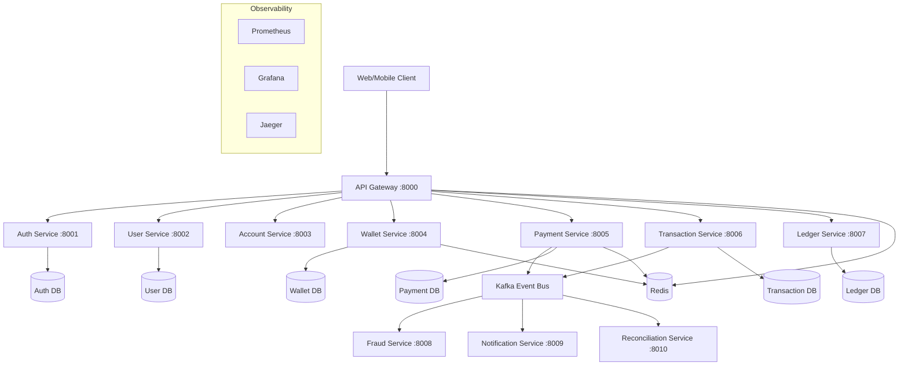
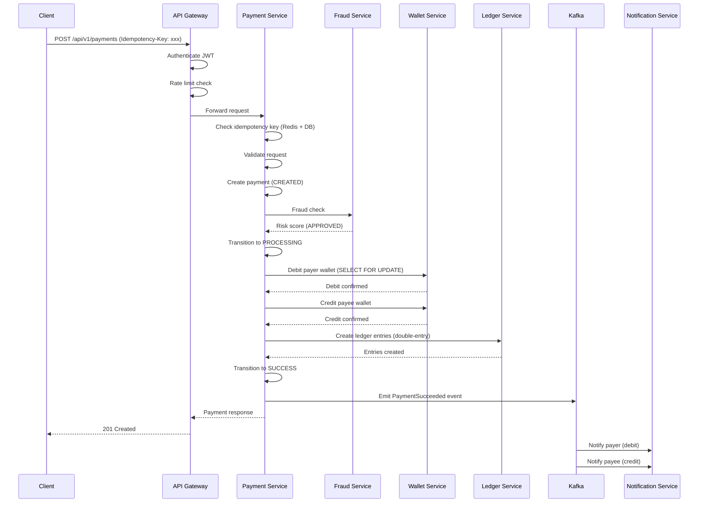
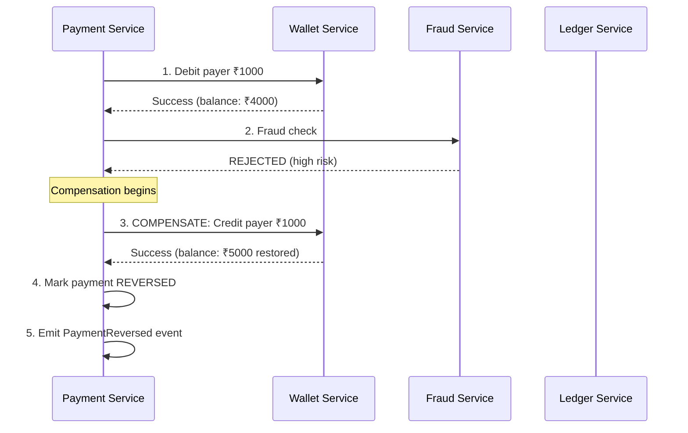
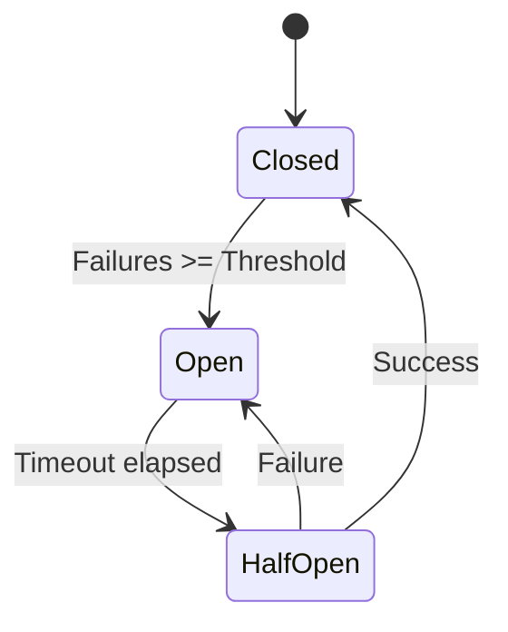

# Architecture Documentation

## 1. High-Level Architecture



## 2. Technology Decision

### Selected: FastAPI + Python 3.12

**Reasons:**
- Native async/await support (critical for high-concurrency payment processing)
- Automatic OpenAPI documentation (reduces API documentation effort)
- Pydantic v2 for request/response validation (catch errors at the boundary)
- Dependency injection built-in (clean architecture, testability)
- ASGI-based with uvicorn (C-level event loop performance)
- Type hints throughout (IDE support, static analysis, fewer bugs)

**Trade-offs:**
- Not as fast as Go/Rust for pure compute (acceptable - we're I/O bound)
- GIL limits CPU parallelism per process (solved with multiple workers/pods)
- Less mature than Java/Spring for enterprise payment systems (acceptable for this scale)

## 3. Payment Flow Sequence



## 4. Saga Pattern - Compensation Flow



## 5. Database Design

### Database-per-Service Pattern

Each service owns its database schema. No cross-service database access.

**Why?**
- Independent deployments (schema changes don't affect other services)
- Independent scaling (hot services get more DB resources)
- Technology flexibility (could use different DB per service if needed)
- Failure isolation (one DB down doesn't kill all services)

### Key Tables

#### Payment Service
```sql
CREATE TABLE payments (
    id UUID PRIMARY KEY DEFAULT gen_random_uuid(),
    payer_id VARCHAR(36) NOT NULL,
    payee_id VARCHAR(36) NOT NULL,
    amount BIGINT NOT NULL,  -- in cents/paise, NEVER float
    currency VARCHAR(3) NOT NULL DEFAULT 'INR',
    status VARCHAR(20) NOT NULL DEFAULT 'CREATED',
    payment_method VARCHAR(20) NOT NULL,
    idempotency_key VARCHAR(64) NOT NULL UNIQUE,
    metadata JSONB DEFAULT '{}',
    created_at TIMESTAMPTZ NOT NULL DEFAULT NOW(),
    updated_at TIMESTAMPTZ NOT NULL DEFAULT NOW()
);

CREATE INDEX ix_payments_payer_status ON payments(payer_id, status);
CREATE INDEX ix_payments_created_at ON payments(created_at);
```

#### Wallet Service
```sql
CREATE TABLE wallets (
    id UUID PRIMARY KEY DEFAULT gen_random_uuid(),
    user_id VARCHAR(36) NOT NULL UNIQUE,
    balance BIGINT NOT NULL DEFAULT 0,  -- in cents/paise
    currency VARCHAR(3) NOT NULL DEFAULT 'INR',
    status VARCHAR(20) NOT NULL DEFAULT 'ACTIVE',
    version INTEGER NOT NULL DEFAULT 1,  -- optimistic locking
    created_at TIMESTAMPTZ NOT NULL DEFAULT NOW(),
    updated_at TIMESTAMPTZ NOT NULL DEFAULT NOW()
);
```

#### Ledger Service (Double-Entry)
```sql
CREATE TABLE ledger_entries (
    id UUID PRIMARY KEY DEFAULT gen_random_uuid(),
    transaction_reference VARCHAR(64) NOT NULL,
    account_id VARCHAR(36) NOT NULL,
    entry_type VARCHAR(10) NOT NULL,  -- DEBIT or CREDIT
    amount BIGINT NOT NULL,
    currency VARCHAR(3) NOT NULL DEFAULT 'INR',
    idempotency_key VARCHAR(64) NOT NULL UNIQUE,
    created_at TIMESTAMPTZ NOT NULL DEFAULT NOW()
);

-- Invariant: SUM(debits) = SUM(credits) ALWAYS
```

## 6. Concurrency & Locking Strategy

### Problem: Double-Spend
```
User balance = ₹1000
Request A reads ₹1000 → spends ₹800
Request B reads ₹1000 → spends ₹700
Without locking: ₹1500 spent from ₹1000!
```

### Solution: Pessimistic Locking for Debits
```sql
BEGIN;
SELECT balance FROM wallets WHERE id = $1 FOR UPDATE;  -- Lock row
-- No other transaction can modify this row until we COMMIT
IF balance < amount THEN RAISE 'insufficient_balance';
UPDATE wallets SET balance = balance - amount WHERE id = $1;
COMMIT;  -- Lock released
```

### Solution: Optimistic Locking for Credits
```sql
UPDATE wallets 
SET balance = balance + $amount, version = version + 1
WHERE id = $1 AND version = $expected_version;
-- If rows_affected = 0, another transaction modified it → retry
```

### Deadlock Prevention for Transfers
```python
# Always lock wallets in sorted order by ID
wallet_ids = sorted([from_wallet_id, to_wallet_id])
# SELECT ... WHERE id IN (...) ORDER BY id FOR UPDATE
```

## 7. Idempotency Design

### Why Database Constraints?

Application-level checks (in-memory sets) fail because:
1. Multiple service instances don't share memory
2. Race condition between "check" and "insert"
3. Instance restart loses state

### Implementation
```
Request 1 (key=ABC): INSERT payment → Success (201)
Request 2 (key=ABC): INSERT payment → UNIQUE violation → Return cached response (200)
Request 3 (key=ABC): INSERT payment → UNIQUE violation → Return cached response (200)
```

Redis accelerates lookups (cache-aside), but PostgreSQL UNIQUE constraint is the source of truth.

## 8. Circuit Breaker Design



**Configuration:**
- Failure threshold: 5 consecutive failures
- Recovery timeout: 30 seconds
- Half-open max calls: 3

**Applied to:**
- Payment → Fraud Service (non-critical path can degrade)
- Payment → Notification Service (never fail payment for notification)
- Any external API call

## 9. Kafka Event Architecture

### Topics
| Topic | Producer | Consumers | Purpose |
|-------|----------|-----------|---------|
| payment.created | Payment Service | Fraud, Transaction | New payment |
| payment.succeeded | Payment Service | Notification, Recon | Completed payment |
| payment.failed | Payment Service | Notification | Failed payment |
| fraud.check.requested | Payment Service | Fraud Service | Risk assessment |
| notification.requested | Multiple | Notification Service | Send notifications |

### When to use REST vs Kafka
- **REST**: Synchronous operations needing immediate response (create payment, check balance)
- **Kafka**: Fire-and-forget operations, event notifications, data sync between services

### Consumer Idempotency
Every consumer checks if event was already processed (by event_id) before acting.
This handles the case where a consumer crashes after processing but before committing offset.

## 10. Production Failure Scenarios

| # | Scenario | Detection | Protection | Recovery |
|---|----------|-----------|------------|----------|
| 1 | PostgreSQL down | Health check fails, connection timeout | Circuit breaker opens, return 503 | Auto-reconnect when DB recovers |
| 2 | Redis down | Connection error | Fallback to DB (cache-aside miss path) | Service continues without cache |
| 3 | Kafka down | Producer timeout | Transactional outbox (write to DB, publish later) | Outbox worker retries |
| 4 | Fraud service slow | Response timeout | Circuit breaker + timeout | Default to APPROVE with monitoring |
| 5 | Notification down | Health check | Payment succeeds anyway | Retry from DLQ later |
| 6 | 10 duplicate requests | Idempotency key | DB UNIQUE constraint | Return cached response |
| 7 | Concurrent balance spend | Row locking | SELECT FOR UPDATE | Second request gets insufficient balance |
| 8 | Consumer crash mid-process | No offset commit | Consumer idempotency check | Reprocess event safely |
| 9 | Client never gets response | Client timeout | Client retries with same idempotency key | Returns existing payment |
| 10 | Saga crash mid-step | Saga state in DB | Saga recovery worker | Resume compensation from last state |

## 11. Observability Architecture

```
Services → Prometheus (metrics scraping every 15s)
        → Jaeger (distributed traces via OTLP)
        → Structured JSON logs → Log aggregator

Dashboards:
- Grafana: Request rates, latencies, error rates, DB pools
- Jaeger UI: Request tracing across services
- Kafka UI: Consumer lag, topic throughput
```

## 12. Security Architecture

- **Transport**: TLS everywhere (ingress terminates HTTPS)
- **Authentication**: JWT (short-lived access + long-lived refresh)
- **Authorization**: RBAC via JWT claims
- **Secrets**: Kubernetes Secrets / env vars (not in code)
- **Input Validation**: Pydantic schemas at every boundary
- **SQL Injection**: SQLAlchemy parameterized queries (never raw SQL)
- **Rate Limiting**: Per-user sliding window (Redis-backed)
- **PII**: Masked in logs, encrypted at rest
- **Audit**: Every state change logged with actor, timestamp, previous value

## 13. Scaling Strategy

| Component | Horizontal | Vertical | Notes |
|-----------|-----------|----------|-------|
| API Gateway | ✅ Stateless pods | CPU/Memory | Scale based on RPS |
| Payment Service | ✅ Stateless pods | CPU/Memory | Scale based on payment volume |
| PostgreSQL | Read replicas | CPU/RAM/IOPS | Writes to primary only |
| Redis | Cluster mode | Memory | For rate limiting, caching |
| Kafka | Add brokers + partitions | Disk/Network | Partition per consumer group |

**Why PostgreSQL for financial data?**
- ACID guarantees (critical for money)
- Strong consistency (no eventual consistency for balances)
- Mature ecosystem, well-understood failure modes
- Row-level locking for concurrent operations
